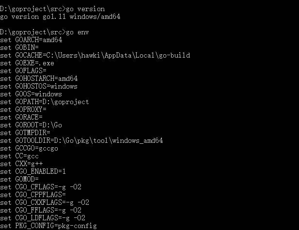
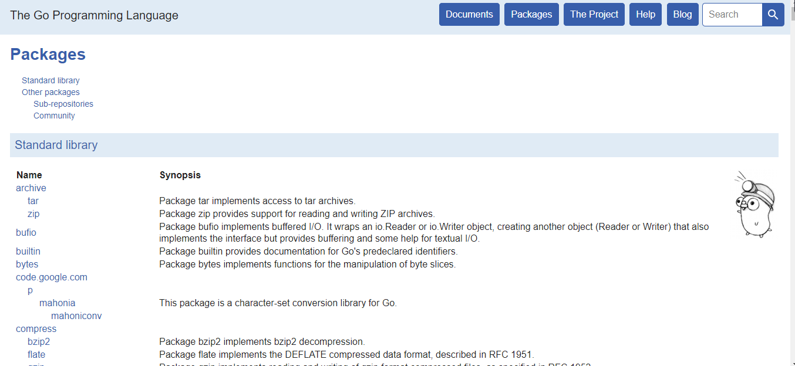
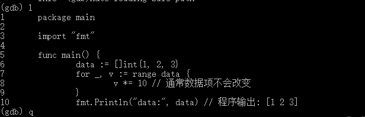
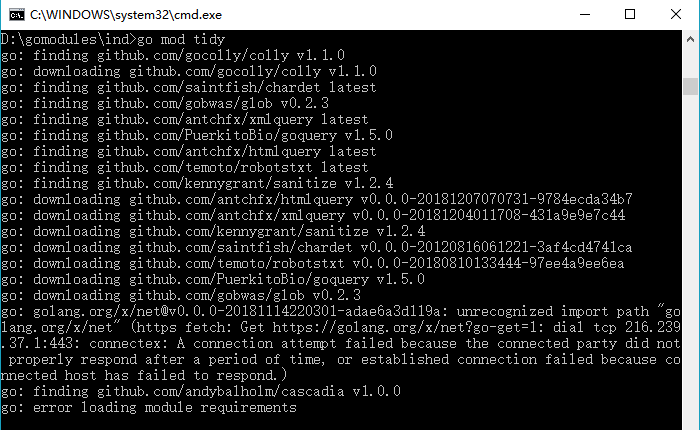
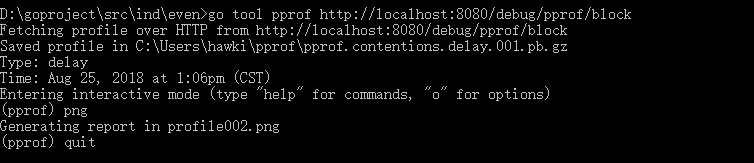
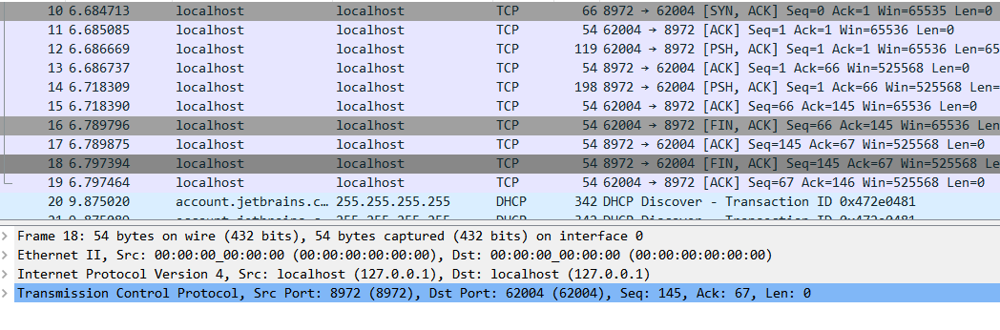
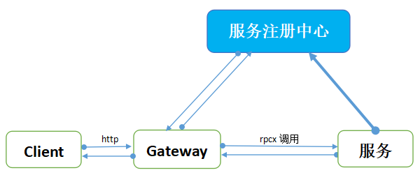

# Go语言四十二章经

## 第01章 Go安装与运行

Go语言是一门全新的静态类型开发语言，具有自动垃圾回收，丰富的内置类型, 函数多返回值，错误处理，匿名函数, 并发编程，反射，`defer`等关键特征，并具有简洁、安全、并行、开源等特性。从语言层面支持并发，可以充分的利用CPU多核，Go语言编译的程序可以媲美C或C++代码的速度，而且更加安全、支持并行进程。系统标准库功能完备，尤其是强大的网络库让建立Web服务成为再简单不过的事情。简单易学，内置runtime，支持继承、对象等，开发工具丰富，例如`gofmt`工具，自动格式化代码，让团队代码风格完美统一。同时Go非常适合用来进行服务器编程，网络编程，包括Web应用、API应用，分布式编程等等。

“Go让我体验到了从未有过的开发效率。”谷歌资深工程师罗布·派克(Rob Pike)如是说道，和C++或C一样，Go是一种系统语言，他表示，“使用它可以进行快速开发，同时它还是一个真正的编译语言，我们之所以现在将其开源，原因是我们认为它已经非常有用和强大。”

Go语言自2009年面世以来，已经有越来越多的公司开始转向Go语言开发，比如腾讯、百度、阿里、京东、小米以及360，而七牛云其技术栈基本上完全采用Go语言来开发。还有像今日头条、UBER这样的公司，他们也使用Go语言对自己的业务进行了彻底的重构。在全球范围内Go语言的使用不断增长，尤其是在云计算领域，用Go语言编写的几个主要云基础项目如`Docker`和`Kubernetes`，都取得了巨大成功。除此之外，还有各种有名的项目如`etcd`/`consul`/`flannel`等等，均使用Go语言实现。

Go语言有两快，一是编译运行快，还有一个是学习上手快。Go语言的学习曲线并不陡峭，无论是刚开始接触编程的朋友，还是有其他语言开发经验而打算学习Go语言的朋友，大家都可以放心大胆来学习和了解Go语言，“它值得拥有！”

让我们开始Go语言学习之旅吧！

### 1.1 Go安装

要用Go语言来进行开发，需要先搭建开发环境。Go 语言支持以下系统：

* Linux
* FreeBSD
* Mac OS
* Windows

首先需要下载Go语言安装包，Go语言的安装包下载地址为：https://golang.org/dl/ ， 国内可以正常下载地址：https://golang.google.cn/dl/

**源码编译安装**

Go语言是谷歌2009发布的第二款开源编程语言。经过几年的版本更迭，目前Go已经发布1.11版本，UNIX/Linux/Mac OS X，和 FreeBSD系统下可使用如下源码安装方法：

1. 下载源码包：https://golang.google.cn/dl/go1.11.1.linux-amd64.tar.gz

2. 将下载的源码包解压至 `/usr/local`目录：

   ```
   tar -C /usr/local -xzf go1.11.1.linux-amd64.tar.gz
   ```

3. 将 `/usr/local/go/bin` 目录添加至PATH环境变量：

   ```
   export PATH=$PATH:/usr/local/go/bin
   ```

4. 设置`GOPATH`，`GOROOT`环境变量：
   `GOPATH`是工作目录，`GOROOT`为Go的安装目录，这里为`/usr/local/go/`

>注意：MAC系统下你可以使用 .pkg 结尾的安装包直接双击来完成安装，安装目录在 /usr/local/go/ 下。

**Windows系统下安装**

我们在Windows系统下一般采用直接安装，下载`go1.11.1.windows-amd64.zip`版本，直接解压到安装目录`D:\Go`，然后把`D:\Go\bin`目录添加到 PATH 环境变量中。

另外，还需要设置2个重要环境变量：

```
GOPATH=D:\goproject
GOROOT=D:\Go\
```

以上三个环境变量设置好后，我们就可以开始正式使用Go语言来开发了。

Windows系统也可以选择`go1.11.1.windows-amd64.msi`，双击运行程序根据提示来操作。


>`GOPATH`是我们的工作目录，可以有多个，用分号隔开。
>`GOROOT`为Go的安装目录。

`Win+R`打开CMD（注意：设置环境变量后需要重新打开CMD），输入 `go` ，如下显示说明Go语言运行环境已经安装成功：

```Go
D:\goproject\src>go
Go is a tool for managing Go source code.

Usage:

        go <command> [arguments]

The commands are:

        bug         start a bug report
        build       compile packages and dependencies
        clean       remove object files and cached files
        doc         show documentation for package or symbol
        env         print Go environment information
        fix         update packages to use new APIs
        fmt         gofmt (reformat) package sources
        generate    generate Go files by processing source
        get         download and install packages and dependencies
        install     compile and install packages and dependencies
        list        list packages or modules
        mod         module maintenance
        run         compile and run Go program
        test        test packages
        tool        run specified go tool
        version     print Go version
        vet         report likely mistakes in packages

Use "go help <command>" for more information about a command.

Additional help topics:

        buildmode   build modes
        c           calling between Go and C
        cache       build and test caching
        environment environment variables
        filetype    file types
        go.mod      the go.mod file
        gopath      GOPATH environment variable
        gopath-get  legacy GOPATH go get
        goproxy     module proxy protocol
        importpath  import path syntax
        modules     modules, module versions, and more
        module-get  module-aware go get
        packages    package lists and patterns
        testflag    testing flags
        testfunc    testing functions

Use "go help <topic>" for more information about that topic.
```

另外，我们输入go version，可看到我们安装的Go版本，如图所示：



**在本书中，所有代码编译运行和标准库的说明讲解都基于go1.11，还没有升级的用户请及时升级。**

`GOPATH`允许多个目录，当有多个目录时，请注意分隔符，多个目录的时候Windows是分号;

当有多个`GOPATH`时默认将go get获取的包存放在第一个目录下。

`GOPATH`目录约定有三个子目录

* `src`存放源代码(比如：.go .c .h .s等)   按照Go 默认约定，go run，go install等命令的当前工作路径（即在此路径下执行上述命令）。
* `pkg`编译时生成的中间文件（比如：.a）
* `bin`编译后生成的可执行文件，接下来就可以试试代码编译运行了。

文件名: `test.go`，代码如下：

```Go
package main

import "fmt"

func main() {
   fmt.Println("Hello, World!")
}
```

使用go命令执行以上代码输出结果如下：

```bash
D:\goproject>go run test.go
Hello，World!
```


### 1.2 Go语言开发工具

`LiteIDE`是一款开源、跨平台的轻量级 Go 语言集成开发环境（IDE）。在安装`LiteIDE`之前一定要先安装Go语言环境。`LiteIDE`支持以下的操作系统：

* Windows x86 (32-bit or 64-bit)
* Linux x86 (32-bit or 64-bit)

LiteIDE可以通过以下途径下载：

下载地址：https://sourceforge.net/projects/liteide/files/ 

源码地址：https://github.com/visualfc/liteide

golang中国：https://www.golangtc.com/download/liteide

也提供下载，国内下载速度可能会快一些，但版本更新较慢，建议还是选择官方地址下载。


Windows直接安装：

Windows下选择 `liteidex35.1.windows-qt5.9.5.zip`，下载之后解压，在`liteide\bin`文件夹下找到liteide.exe，双击运行。

如果不出意外，将会出现LiteIDE的运行界面。

有关LiteIDE 的使用相对来说比较简单，很容易上手，就不在此细说了。

源码编译安装：

LiteIDE源码位于https://github.com/visualfc/liteide上。需要使用Qt4/Qt5来编译源代码，Qt库可以从https://qt-project.org/downloads上获取。Mac OS X用户可以不从源代码编译Qt，直接在终端中运行brew update && brew install qt，节省大量时间。

有关LiteIDE 安装的更多说明请访问： http://liteide.org/cn/doc/install/

其他的开发工具还有`Eclipse`以及其集成`goeclipse`开发插件，以及`Sublime text`等，可以根据个人喜好情况选择使用。

现在Go 语言和开发工具我们都已经安装完成，接下来我们开始学习Go的基础知识，并实际使用他们来进行练习和开发。

## 第02章 数据类型

在 Go 语言中，数据类型可用于参数和变量声明。

### 2.1 基本数据类型

Go 语言按类别有以下几种数据类型：

* 布尔型：
布尔型的值只可以是常量 `true` 或者 `false`。一个简单的例子：`var b bool = true`。

* 数字类型：
整型 `int` 和浮点型 `float32`、`float64`，Go 语言支持整型和浮点型数字，并且原生支持复数，其中位的运算采用补码。

* 字符串类型：
字符串就是一串固定长度的字符连接起来的字符序列。Go的字符串是由单个字节连接起来的。Go语言的字符串的字节使用`UTF-8`编码标识Unicode文本。

* 派生类型：
包括：


    (a) 指针类型（Pointer）
    (b) 数组类型
    (c) 结构类型(struct)
    (d) Channel 类型
    (e) 函数类型
    (f) 切片类型
    (g) 接口类型（interface）
    (h) Map 类型

#### 数字类型：

Go 也有基于架构的类型，例如：`int`、`uint` 和 `uintptr`，这些类型的长度都是根据运行程序所在的操作系统类型所决定的。


|类型|符号|长度范围|
|:--|:--|:--|
|`uint8`    |无符号  |8位整型 (0 到 255)|
|`uint16`   |无符号 |16位整型 (0 到 65535)|
|`uint32`   |无符号 |32位整型 (0 到 4294967295)|
|`uint64`   |无符号 |64位整型 (0 到 18446744073709551615)|
|`int8`     |有符号  |8位整型 (-128 到 127)|
|`int16`    |有符号 |16位整型 (-32768 到 32767)|
|`int32`    |有符号 |32位整型 (-2147483648 到 2147483647)|
|`int64`    |有符号 |64位整型 (-9223372036854775808 到 9223372036854775807)|


#### 浮点型：

主要是为了表示小数，也可细分为`float32`和`float64`两种。浮点数能够表示的范围可以从很小到很巨大，这个极限值范围可以在`math`包中获取，`math.MaxFloat32`表示`float32`的最大值，大约是`3.4e38`，`math.MaxFloat64`大约是`1.8e308`，两个类型最小的非负值大约是`1.4e-45`和`4.9e-324`。

`float32`大约可以提供小数点后6位的精度，作为对比，`float64`可以提供小数点后15位的精度。通常情况应该优先选择`float64`，因此`float32`的精确度较低，在累积计算时误差扩散很快，而且`float32`能精确表达的最小正整数并不大，因为浮点数和整数的底层解释方式完全不同。

|类型|长度|
|:--|:--|
|`float32`  |IEEE-754   32位浮点型数|
|`float64`  |IEEE-754   64位浮点型数|

#### 其他数字类型：

|类型|长度|
|:--|:--|
|`byte`      |类似 `uint8`|
|`rune`      |类似 `int32`|
|`uint32`     |或 64 位|
|`int`        |与 `uint` 一样大小|
|`uintptr`    |无符号整型，用于存放一个指针|

#### 字符串：
只读的Unicode字节序列，Go语言使用`UTF-8`格式编码Unicode字符，每个字符对应一个`rune`类型。一旦字符串变量赋值之后，内部的字符就不能修改，英文是一个字节，中文是三个字节。

```Go
string转int：    int, err := strconv.Atoi(string)
string转int64：  int64, err := strconv.ParseInt(string, 10, 64)
int转string：    string := strconv.Itoa(int)
int64转string：  string := strconv.FormatInt(int64, 10)
```

而一个`range`循环会在每次迭代时，解码一个`UTF-8`编码的符文。每次循环时，循环的索引是当前文字的起始位置，以字节为单位，代码点是它的值（`rune`）。

使用`range`迭代字符串时，需要注意的是`range`迭代的是Unicode而不是字节。返回的两个值，第一个是被迭代的字符的`UTF-8`编码的第一个字节在字符串中的索引，第二个值的为对应的字符且类型为`rune`(实际就是表示`unicode`值的整形数据）。

```Go
const s = "Go语言"
for i, r := range s {
	fmt.Printf("%#U  ： %d\n", r, i)
}
```
程序输出：

```
U+0047 'G'  ： 0
U+006F 'o'  ： 1
U+8BED '语'  ： 2
U+8A00 '言'  ： 5
```

#### 复数：
复数类型相对用的很少，主要是数学学科专业会用上。分为两种类型 `complex64`和`complex128` 前部分是实体后部分是虚体。

|类型|长度|
|:--|:--|
|`complex64`   |32位实数和虚数|
|`complex128`   |64位实数和虚数|

### 2.2 Unicode（UTF-8）

你可以通过增加前缀 0 来表示 8 进制数（如：077），增加前缀 `0x` 来表示 16 进制数（如：`0xFF`），以及使用 e 来表示 10 的连乘（如： `1e3 = 1000`，或者 `6.022e23 = 6.022 x 1e23`）

不过 Go 同样支持 Unicode（`UTF-8`），因此字符同样称为 Unicode 代码点或者 `runes`，并在内存中使用 `int` 来表示。在文档中，一般使用格式 `U+hhhh` 来表示，其中 h 表示一个 16 进制数。其实 `rune` 也是 Go 当中的一个类型，并且是 `int32` 的别名。

在书写 Unicode 字符时，需要在 16 进制数之前加上前缀 `\u` 或者 `\U`。

因为 Unicode 至少占用 2 个字节，所以我们使用 `int16` 或者 `int` 类型来表示。如果需要使用到 4 字节，则会加上 `\U` 前缀；前缀 `\u` 则总是紧跟着长度为 4 的 16 进制数，前缀 `\U` 紧跟着长度为 8 的 16 进制数。

```Go
var ch int = '\u0041'
var ch2 int = '\u03B2'
var ch3 int = '\U00101234'
```

### 2.3 复数
Go 拥有以下复数类型：

* `complex64` (32 位实数和虚数)

* `complex128` (64 位实数和虚数)

复数使用 `re+imi` 来表示，其中 `re` 代表实数部分，`im` 代表虚数部分，`i` 为虚数单位。
示例：

```Go
var c1 complex64 = 5 + 10i
fmt.Printf("The value is: %v", c1)// 输出： 5 + 10i
```
如果 `re` 和 `im` 的类型均为 `float32`，那么类型为 `complex64` 的复数 c 可以通过以下方式来获得：

```Go
c = complex(re, im)
```
函数 `real(c)` 和 `imag(c)` 可以分别获得相应的实数和虚数部分。
## 第03章 变量

### 3.1 变量以及声明

Go 语言中有四类标记：标识符(`identifiers`)，关键字(`keywords`)，运算符(`operators` )和标点符号(`punctuation`)以及字面量(`literals`) 。

Go 语言变量标识符由字母、数字、下划线组成，其中首个字母不能为数字，同一字母的大小写在Go语言中代表不同标识，注意区分A 和a 是不同的标识。

根据Go语言规范，标识符命名程序实体，例如变量和类型。 标识符是一个或多个Unicode字母和数字的序列。 标识符中的第一个字符必须是Unicode字母。标识符：

```Go
identifier = letter { letter | unicode_digit } .
```

Go语言规范中，下划线“`_`”也被认为是字母：

```Go
The underscore character _ (U+005F) is considered a letter.
letter        = unicode_letter | "_" .
unicode_digit  = /* a Unicode code point classified as "Number, decimal digit" */ .
```

在Unicode标准8.0中，第4.5节“常规类别”定义了一组字符类别。 Go语言将Unicode中任何字母类别Lu，Ll，Lt，Lm或Lo中的所有字符视为Unicode字母，将数字类别Nd中的字符视为Unicode数字。

据统计，Go语言视为Unicode的字母（含下划线_）一共20871个，这里面包括中文，详情见表：

|字母类别	|含义	|数量|
|:--|:--|:--|
|Lu	|字母,大写	|1781|
|Ll	|字母,小写	|2145|
|Lt	|字母,词首字母大写	|31|
|Lm	|字母,修饰符	|250|
|Lo	|字母,其他	|16053|
|Nd	|数字,十进制数	|610|

一般习惯上，在Go语言命名标识符时，我们还是选择英文的52个大小写字母以及0-9数字和下划线来组合成合适的标识符。上表中其他的字符也可以用于标识符，但不在上表中的字符是不能用在Go语言标识符中。后面我们提到大写字母，主要是指Lu类别中的1781个字母。

另外，Go语言中关键字是保留字，不能作为变量标识符，如下表所示：

|break        	|default      	|func         	|interface|    	select|
|:--|:--|:--|:--|:--|
|case         	|defer        	|go           	|map       |   	struct|
|chan         	|else         	|goto         	|package    |  	switch|
|const        	|fallthrough  	|if           	|range      |  	type|
|continue     	|for          	|import       	|return     |  	var|

Go语言变量声明使用关键字`var`，下面我们声明了几个变量：

```Go
var (
    a int
    b bool
    str string
    浮点 float32    // 没错，中文可以作为变量标识符
)
```

这种因式分解关键字的写法一般用于声明全局变量，一般在`func` 外定义。

当一个变量被`var`声明之后，系统自动赋予它该类型的零值：

* `int`   为 `0`
* `float`  为 `0.0`
* `bool`  为 `false`
* `string` 为空字符串""
* 指针为 `nil`

记住，这些变量在 Go 中都是经过初始化的。

多变量可以在同一行进行赋值，也称为 并行 或 同时 或 平行赋值。如：

```Go
a, b, c = 5, 7, "abc"
```

简式声明：

```Go
a, b, c := 5, 7, "abc"  // 注意等号前的冒号
```
右边的这些值以相同的顺序赋值给左边的变量，所以 a 的值是 5， b 的值是 7，c 的值是 "abc"。

简式声明一般用在`func`内，要注意的是：全局变量和简式声明的变量尽量不要同名，否则很容易产生偶然的变量隐藏`Accidental Variable Shadowing`。

即使对于经验丰富的Go开发者而言，这也是一个非常常见的陷阱。这个坑很容易挖，但又很难发现。

```Go
func main() {  
    x := 1
    fmt.Println(x)     // prints 1
    {
        fmt.Println(x) // prints 1
        x := 2
        fmt.Println(x) // prints 2
    }
    fmt.Println(x)     // prints 1 (不是2)
}
```
如果你想要交换两个变量的值，则可以简单地使用：

```Go
 a, b = b, a  
```
 (在 Go 语言中，这样省去了使用交换函数的必要)

空白标识符 _ 也被用于抛弃值，如值 5 在：``_, b = 5, 7`` 中被抛弃。

```Go
_, b = 5, 7
```
`_` 实际上是一个只写变量，你不能得到它的值。这样做是因为 Go 语言中你必须使用所有被声明的变量，但有时你并不需要使用从一个函数得到的所有返回值。

由于Go语言有个强制规定，在函数内一定要使用声明的变量，但未使用的全局变量是没问题的。为了避免有未使用的变量，代码将编译失败，我们可以将该未使用的变量改为 `_`。

另外，在Go语言中，如果引入的包未使用，也不能通过编译。有时我们需要引入的包，比如需要`init()`，或者调试代码时我们可能去掉了某些包的功能使用，你可以添加一个下划线标记符，`_`，来作为这个包的名字，从而避免编译失败。下滑线标记符用于引入，但不使用。

```Go
package main

import (  
    _ "fmt"
    "log"
    "time"
)

var _ = log.Println
func main() {  
    _ = time.Now
}
```
并行赋值也被用于当一个函数返回多个返回值时，比如这里的 `val` 和错误 `err` 是通过调用 `Func1` 函数同时得到：

```Go
val, err = Func1(var1)
```
对于布尔值的好的命名能够很好地提升代码的可读性，例如以 `is` 或者 `Is` 开头的 `isSorted`、`isFinished`、`isVisible`，使用这样的命名能够在阅读代码的获得阅读正常语句一样的良好体验，例如标准库中的 `unicode.IsDigit(ch)`。

在 Go 语言中，指针属于引用类型，其它的引用类型还包括 `slices`，`maps`和 `channel`。

注意，Go中的数组是数值，因此当你向函数中传递数组时，函数会得到原始数组数据的一份复制。如果你打算更新数组的数据，可以考虑使用数组指针类型。

```Go
package main

import "fmt"

func main() {  
    x := [3]int{1, 2, 3}

    func(arr *[3]int) {
        (*arr)[0] = 7
        fmt.Println(arr) // prints &[7 2 3]
    }(&x)

    fmt.Println(x) // prints [7 2 3]
}
```
被引用的变量会存储在堆中，以便进行垃圾回收，且比栈拥有更大的内存空间。

>引申：
>
>编译器会做逃逸分析，所以由Go的编译器决定在哪(堆or栈)分配内存，保证程序的正确性。

### 3.2 零值nil
`nil` 标志符用于表示interface、函数、maps、slices、channels、error、指针等的“零值”。如果你不指定变量的类型，编译器将无法编译你的代码，因为它猜不出具体的类型。

```Go
package main

func main() {  
    var x = nil // 错误

    _ = x
}
```
在一个 `nil` 的slice中添加元素是没问题的，但对一个`map`做同样的事将会生成一个运行时的`panic`：

```Go
package main

func main() {  
    var m map[string]int
    m["one"] = 1 //error

}
```
字符串不会为 `nil`

这对于经常使用 nil 分配字符串变量的开发者而言是个需要注意的地方。

```Go
var str string  = "" // ""是字符串的零值
```
根据前面的介绍，其实这样写和上面的效果一样：

```Go
var str string
```
## 第04章 常量

### 4.1 常量以及iota

常量使用关键字 `const` 定义，用于存储不会改变的数据。常量不能被重新赋予任何值。 
存储在常量中的数据类型只可以是布尔型、数字型（整数型、浮点型和复数）和字符串型。
常量的定义格式：`const identifier [type] = value`，例如：

```Go
const Pi = 3.14159
```
在 Go 语言中，你可以省略类型说明符 [`type`]，因为编译器可以根据变量（常量）的值来推断其类型。


``` go
显式类型定义： const b string = "abc"
隐式类型定义： const b = "abc"
```

Go的常量定义可以限定常量类型，但不是必需的。如果定义常量时没有指定类型，那么它与字面常量一样，是无类型（`untyped`）常量。一个没有指定类型的常量被使用时，会根据其使用环境而推断出它所需要具备的类型。换句话说，未定义类型的常量会在必要时刻根据上下文来获得相关类型。

字面常量（`literal`），是指程序中硬编码的常量，如：-12。它们的值即为它们本身，是无法被改变的。 

常量的值必须是能够在编译时就能够确定的；你可以在其赋值表达式中涉及计算过程，但是所有用于计算的值必须在编译期间就能获得。

Go语言预定义了这些常量： `true`、 `false`和`iota`。布尔常量只包含两个值：`true` 和 `false`。`iota`比较特殊，可以被认为是一个可被编译器修改的常量，在每一个`const`关键字出现时被重置为`0`，然后在下一个`const`出现之前，每出现一次`iota`，其所代表的数字会自动增`1`。

在这个例子中，iota 可以被用作枚举值：

```Go
const (
    a = iota
    b = iota
    c = iota
)
```

第一个 `iota` 等于 0，每当 `iota` 在新的一行被使用时，它的值都会自动加 1；所以 `a=0, b=1, c=2` 可以简写为如下形式：

```Go
const (
    a = iota
    b
    c
)
```
注意：

```Go
const (
    a = iota
    b = 8
    c
)
```
a, b, c分别为0, 8, 8，新的常量b声明后，`iota` 不再向下赋值，后面常量如果没有赋值，则继承上一个常量值。

可以简单理解为在一个`const`块中，每换一行定义个常量，iota 都会自动+1。

（ 关于 iota 的使用涉及到非常复杂多样的情况 ，这里不展开来讲了，有兴趣可以查查资料研究）

iota 也可以用在表达式中，如：`iota + 50`。在每遇到一个新的常量块或单个常量声明时， `iota` 都会重置为 0（ **简单地讲，每遇到一次 const 关键字，iota 就重置为 0 ** ）。

使用位左移与 iota 计数配合可优雅地实现存储单位的常量枚举：

```Go
type ByteSize float64
const (
    _ = iota // 通过赋值给空白标识符来忽略值
    KB ByteSize = 1<<(10*iota)
    MB
    GB
    TB
    PB
    EB
    ZB
    YB
)
```

数值常量（Numeric constants）包括整数，浮点数以及复数常量。数值常量有一些微妙之处。

```Go
package main

import (
	"fmt"
)

func main() {
	const a = 5
	var intVar int = a
	var int32Var int32 = a
	var float64Var float64 = a
	var complex64Var complex64 = a
	fmt.Println("intVar", intVar, "\nint32Var", int32Var, "\nfloat64Var", float64Var, "\ncomplex64Var", complex64Var)
}
```

```Go
程序输出
intVar 5 
int32Var 5 
float64Var 5 
complex64Var (5+0i)

```

在这个程序中，a 的值是 5 并且 a 在语法上是泛化的（它既可以表示浮点数 5.0，也可以表示整数 5，甚至可以表示没有虚部的复数 `5 + 0i`），因此 a 可以赋值给任何与之类型兼容的变量。像 a 这种数值常量的默认类型可以想象成是通过上下文动态生成的。


当然，常量之所以为常量就是恒定不变的量，因此我们无法在程序运行过程中修改它的值；如果你在代码中试图修改常量的值则会引发编译错误。同时，在`const` 定义中，对常量名没有强制要求全部大写，不过我们一般都会全部字母大写，以便阅读。
## 第05章 作用域

### 5.1 作用域
* 局部变量
在函数体内或代码块内声明的变量称之为局部变量，它们的作用域只在代码块内，参数和返回值变量也是局部变量。

* 全局变量
作用域都是全局的（在本包范围内）
在函数体外声明的变量称之为全局变量，全局变量可以在整个包甚至外部包（被导出后）使用。
全局变量可以在任何函数中使用。

* 简式变量
使用 `:=` 定义的变量，如果新变量Ga与那个同名已定义变量 (这里就是那个全局变量Ga)不在一个作用域中时，那么Go 语言会新定义这个变量Ga，遮盖住全局变量Ga。刚开始很容易在此犯错而茫然，解决方法是局部变量尽量不同名。

根据 Go语言的规范 ，Go的标识符作用域是基于代码块（code block）的。代码块就是包裹在一对大括号内部的声明和语句，并且是可嵌套的。在代码中直观可见的显式的(explicit)code block，比如：函数的函数体、`for`循环的循环体等；还有隐式的(implicit)code block。

我们使用最多的`if`语句类型就是 单`if`型 ，即:

```Go
if simplestmt; expression {
    ... ...
}
```

在这种类型的if语句中，有两个code block：一个隐式的code block和一个显式的code block。我们把上面的形式代码做一个等价变化，并加上code block起始和结束点的标注，结果如下：

```Go
{ // 隐式code block
    simplestmt
    if expression { // 显式的code block
            ... ...
    } 
} 
```

下面的代码综合了几种作用域的情况，很容易混淆。请各位仔细琢磨弄清楚。

```Go
package main

import (
	"fmt"
)

var (
	Ga int = 99
)

const (
	v int = 199
)

func GetGa() func() int {

	if Ga := 55; Ga < 60 {
		fmt.Println("GetGa if 中：", Ga)
	}

	for Ga := 2; ; {
		fmt.Println("GetGa循环中：", Ga)
		break
	}

	fmt.Println("GetGa函数中：", Ga)

	return func() int {
		Ga += 1
		return Ga
	}
}

func main() {
	Ga := "string"
	fmt.Println("main函数中：", Ga)

	b := GetGa()
	fmt.Println("main函数中：", b(), b(), b(), b())

	v := 1
	{
		v := 2
		fmt.Println(v)
		{
			v := 3
			fmt.Println(v)
		}
	}
	fmt.Println(v)
}


```

```Go
程序输出：

main函数中： string
GetGa if 中： 55
GetGa循环中： 2
GetGa函数中： 99
main函数中： 100 101 102 103
2
3
1

```

Ga作为全局变量纯在是`int`类型，值为99；而在`main()`中时，Ga通过简式声明 `:=` 操作，是`string`类型，值为`string`。在`main()`中，v很典型地体现了在“{}”花括号中的作用域问题，每一层花括号，都是对上一层的屏蔽。而闭包函数，`GetGa()`返回的匿名函数，赋值给b，每次执行b()，Ga的值都被记忆在内存中，下次执行b()的时候，取`b()`上次执行后Ga的值，而不是全局变量Ga的值，这就是闭包函数可以使用包含它的函数内的变量，因为作为代码块一直存在，所以每次执行都是在上次基础上运行。

简单总结如下：

* 有花括号"`{ }`"一般都存在作用域的划分；
* `:=` 简式声明会屏蔽所有上层代码块中的变量（常量），建议使用规则来规范，如对常量使用全部大写，而变量尽量小写；
* 在`if`等语句中存在隐式代码块，需要注意；
* 闭包函数可以理解为一个代码块，并且他可使用包含它的函数内的变量；

>注意，简式变量只能在函数内部声明使用，但是它可能会覆盖函数外全局同名变量。而且你不能在一个单独的声明中重复声明一个变量，但在多变量声明中这是允许的，而且其中至少要有一个新的声明变量。重复变量需要在相同的代码块内，否则你将得到一个隐藏变量。
>
>如果你在代码块中犯了这个错误，将不会出现编译错误，但应用运行结果可能不是你所期望。所以尽可能避免和全局变量同名。

思考：

```Go
func main() {
    if a := 1; false {
    } else if b := 2; false {
    } else if c := 3; false {
    } else {
        println(a, b, c)
    }
}

```

这段代码运行结果是什么，你能写出来吗？
## 第06章 约定和惯例

### 6.1 可见性规则

在Go语言中，标识符必须以一个大写字母开头，这样才可以被外部包的代码所使用，这被称为导出。标识符如果以小写字母开头，则对包外是不可见的，但是他们在整个包的内部是可见并且可用的。但是包名不管在什么情况下都必须小写。

在设计Go语言时，设计者们也希望确保它不是过于以ASCII为中心，这意味着需要从7位ASCII的范围来扩展标识符的空间。 所以Go语言标识符规定必须是Unicode定义的字母或数字，标识符是一个或多个Unicode字母和数字的序列， 标识符中的第一个字符必须是Unicode字母。

这条规则还有另外一个不幸的后果。由于导出的标识符必须以大写字母开头，因此根据定义，从某些语言的字符创建的标识符不能导出。目前唯一的解决方案是使用像“A语言”这样的东西，但这显然不能令人满意。

总而言之，为了确保我们的标识符能正常导出，我们建议在开发中还是尽量使用ASCII 码来作为标识符，虽然设计者们在避免以ASCII 码为中心，但出于习惯我们还是服从于这个现实。

>那么问题来了，使用中文命名的标识符能够正常导出吗？希望大家在了解后面的知识后，可以尝试一下试试。

### 6.2 命名规范以及语法惯例

当某个函数需要被外部包调用的时候需要使用大写字母开头，并遵循 Pascal 命名法（“大驼峰式命名法”）；否则就遵循“小驼峰式命名法”，即第一个单词的首字母小写，其余单词的首字母大写。

单词之间不以空格断开或连接号（-）、底线（_）连结，第一个单词首字母采用大写字母；后续单词的首字母亦用大写字母，例如：FirstName、LastName。每一个单词的首字母都采用大写字母的命名格式，被称为“Pascal命名法”，源自于Pascal语言的命名惯例，也有人称之为“大驼峰式命名法”（Upper Camel Case），为驼峰式大小写的子集。

当二个或二个以上单词连结在一起时，用驼峰式命名法可以增加变量和函数名称的可读性。

Go 语言追求简洁的代码风格，并通过 `gofmt` 强制实现风格统一。

Go 语言也使用分号作为语句的结束，但一般会省略分号。像在标识符后面；整数、浮点、复数、Rune或字符串等字面量后面；关键字`break`、`continue`、`fallthrough`、或者`return`后面；操作符或标点符号`++`、`--`、)、]或}之后等等都可以使用分号，但是往往会省略掉，像LiteIDE编辑器会在保存.go文件时自动过滤掉这些分号，所以在Go语言开发中一般不用过多关注分号的使用。

左大括号 { 不能单独一行，这是编译器的强制规定，否则你在使用 `gofmt` 时就会出现错误提示“ expected declaration, found '{' ”。右大括号 } 需要单独一行。

```Go
func functionName) () {
   …
}

if mod > 0 {
	div++
}
```

在定义接口名时也有惯例，一般单方法接口由方法名称加上-er后缀来命名。

### 6.3 注释

在Go语言中，注释有两种形式：

1.行注释：使用双斜线//开始，一般后面紧跟一个空格。行注释是Go语言中最常见的注释形式，在标准包中，一般都采用行注释，建议采用这种方式。
2.块注释：使用 /\* \*/，块注释不能嵌套。块注释一般用于包描述或注释成块的代码片段。

一般而言，注释文字尽量每行长度接近一致，过长的行应该换行以方便在编辑器阅读。注释可以是单行，多行，甚至可以使用doc.go文件来专门保存包注释。每个包只需要在一个go文件的package关键字上面注释，两者之间没有空行。对于变量，函数，结构体，接口等的注释直接加在声明前，注释与声明之间没有空行。例如：

```Go
// Copyright 2009 The Go Authors. All rights reserved.
// Use of this source code is governed by a BSD-style
// license that can be found in the LICENSE file.

//go:generate go run genzfunc.go

// Package sort provides primitives for sorting slices and user-defined
// collections.
package sort

// A type, typically a collection, that satisfies sort.Interface can be
// sorted by the routines in this package. The methods require that the
// elements of the collection be enumerated by an integer index.
type Interface interface {
	// Len is the number of elements in the collection.
	Len() int
	// Less reports whether the element with
	// index i should sort before the element with index j.
	Less(i, j int) bool
	// Swap swaps the elements with indexes i and j.
	Swap(i, j int)
}

// Insertion sort
func insertionSort(data Interface, a, b int) {
	for i := a + 1; i < b; i++ {
		for j := i; j > a && data.Less(j, j-1); j-- {
			data.Swap(j, j-1)
		}
	}
}
```

函数或方法的注释需要以函数名开始，且两者之间没有空行，示例如下：

```Go
// ContainsRune reports whether the rune is contained in the UTF-8-encoded byte slice b.
func ContainsRune(b []byte, r rune) bool {
	return IndexRune(b, r) >= 0
}
```

需要预格式化的部分，直接加空格缩进即可，示例如下：

```Go
// For example, flags Ldate | Ltime (or LstdFlags) produce,
//	2009/01/23 01:23:23 message
// while flags Ldate | Ltime | Lmicroseconds | Llongfile produce,
//	2009/01/23 01:23:23.123123 /a/b/c/d.go:23: message
```

在方法，结构体或者包注释前面加上“Deprecated:”表示不建议使用，示例如下：

```Go
// Deprecated: Old 老旧方法，不建议使用
func Old(a int)(int){
    return a
}
```

在注释中，还可以插入空行，示例如下：

```Go
// Search calls f(i) only for i in the range [0, n).
//
// A common use of Search is to find the index i for a value x in
// a sorted, indexable data structure such as an array or slice.
// In this case, the argument f, typically a closure, captures the value
// to be searched for, and how the data structure is indexed and
// ordered.
//
// For instance, given a slice data sorted in ascending order,
// the call Search(len(data), func(i int) bool { return data[i] >= 23 })
// returns the smallest index i such that data[i] >= 23. If the caller
// wants to find whether 23 is in the slice, it must test data[i] == 23
// separately.
```
## 第07章 代码结构化

### 7.1 包的概念

Go语言使用包（package）的概念来组织管理代码，包是结构化代码的一种方式。和其他语言如JAVA类似，Go语言中包的主要作用是把功能相似或相关的代码组织在同一个包中，以方便查找和使用。在Go语言中，每个.go文件都必须归属于某一个包，每个文件都可有`init()`函数。包名在源文件中第一行通过关键字package指定，包名要小写。如下所示：

```Go
package fmt
```

每个目录下面可以有多个.go文件，这些文件只能属于同一个包，否则编译时会报错。同一个包下的不同.go文件相互之间可以直接引用变量和函数，所以这些文件中定义的全局变量和函数不能重名。

Go语言的可执行应用程序必须有`main`包，而且在`main`包中必须且只能有一个`main()`函数，`main()`函数是应用程序运行开始入口。在main包中也可以使用`init()`函数。

Go语言不强制要求包的名称和文件所在目录名称相同，但是这两者最好保持相同，否则很容易引起歧义。因为导入包的时候，会使用目录名作为包的路径，而在代码中使用时，却要使用包的名称。


### 7.2 包的导入

一个Go程序通过import关键字将一组包链接在一起。import其实是导入目录，而不是定义的包名称，实际应用中我们一般都会保持一致。

例如标准包中定义的big包：`package big`，`import  "math/big"` ，源代码其实是在GOROOT下`src`中的`src/math/big`目录。在代码中使用`big.Int`时，big指的才是.go文件中定义的包名称。

当导入多个包时，一般按照字母顺序排列包名称，像LiteIDE会在保存文件时自动完成这个动作。所谓导入包即等同于包含了这个包的所有的代码对象。

为避免名称冲突，同一包中所有对象的标识符必须要求唯一。但是相同的标识符可以在不同的包中使用，因为可以使用包名来区分它们。

`import`语句一般放在包名定义的下一行，导入包示例如下：

```Go
package main

import  "context"  //加载context包
```

导入多个包的常见的方式是：

```Go
import  (
"fmt"
"net/http"
 )
```

调用导入的包函数的一般方式：

```Go
fmt.Println("Hello World!")
```

下面介绍三种特殊的`import`方式。

点操作的含义是某个包导入之后，在调用这个包的函数时，可以省略前缀的包名，如这里可以写成`Println("Hello World!")`，而不是`fmt.Println("Hello World!")`。例如：
```Go
import( . "fmt" ) 

```

别名操作就是可以把包命名成另一个容易记忆的名字。例如：
```Go
import(
    f "fmt"
)
```
别名操作调用包函数时，前缀变成了别名，即`f.Println("Hello World!")`。在实际项目中有时这样使用，但请谨慎使用，不要不加节制地采用这种形式。

`_` 操作是引入某个包，但不直接使用包里的函数，而是调用该包里面的`init`函数，比如下面的`mysql`包的导入。此外在开发中，由于某种原因某个原来导入的包现在不再使用，也可以采用这种方式处理，比如下面`fmt`的包。代码示例如下：

```Go
import (
	_ "fmt"
	_ "github.com/go-sql-driver/mysql"
)
```

### 7.3 标准库

在 Go 的安装文件里包含了一些可以直接使用的标准库。在`GOROOT/src`中可以看到源码，也可以根据情况自行重新编译。

完整列表可以访问`GoWalker`（https://gowalker.org/）查看。

```Go
    unsafe: 包含了一些打破 Go 语言“类型安全”的命令，一般的程序中不会被使用，可用在 C/C++ 程序的调用中。
    syscall-os-os/exec:
    	os: 提供给我们一个平台无关性的操作系统功能接口，采用类UNIX设计，隐藏了不同操作系统间差异，让不同的文件系统和操作系统对象表现一致。
    	os/exec: 提供我们运行外部操作系统命令和程序的方式。
    	syscall: 底层的外部包，提供了操作系统底层调用的基本接口。
    archive/tar 和 /zip-compress：压缩(解压缩)文件功能。
    fmt-io-bufio-path/filepath-flag:
    	fmt: 提供了格式化输入输出功能。
    	io: 提供了基本输入输出功能，大多数是围绕系统功能的封装。
    	bufio: 缓冲输入输出功能的封装。
    	path/filepath: 用来操作在当前系统中的目标文件名路径。
    	flag: 对命令行参数的操作。　　
    strings-strconv-unicode-regexp-bytes:
    	strings: 提供对字符串的操作。
    	strconv: 提供将字符串转换为基础类型的功能。
    	unicode: 为 unicode 型的字符串提供特殊的功能。
    	regexp: 正则表达式功能。
    	bytes: 提供对字符型分片的操作。
    math-math/cmath-math/big-math/rand-sort:
    	math: 基本的数学函数。
    	math/cmath: 对复数的操作。
    	math/rand: 伪随机数生成。
    	sort: 为数组排序和自定义集合。
    	math/big: 大数的实现和计算。 　　
    container-/list-ring-heap: 实现对集合的操作。
    	list: 双链表。
    	ring: 环形链表。
   time-log:
        time: 日期和时间的基本操作。
        log: 记录程序运行时产生的日志。
    encoding/Json-encoding/xml-text/template:
        encoding/Json: 读取并解码和写入并编码 Json 数据。
        encoding/xml:简单的 XML1.0 解析器。
        text/template:生成像 HTML 一样的数据与文本混合的数据驱动模板。
    net-net/http-html:
        net: 网络数据的基本操作。
        http: 提供了一个可扩展的 HTTP 服务器和客户端，解析 HTTP 请求和回复。
        html: HTML5 解析器。
    runtime: Go 程序运行时的交互操作，例如垃圾回收和协程创建。
    reflect: 实现通过程序运行时反射，让程序操作任意类型的变量。
```

### 7.4 从 GitHub 安装包
如果有人想安装您的远端项目到本地机器，打开终端并执行（`ffhelicopter`是我在GitHub上的用户名）：

```Go
go get -u github.com/ffhelicopter/tmm
```
这样现在这台机器上的其他 Go 应用程序也可以通过导入路径："`github.com/ffhelicopter/tmm`" 来使用。 开发中一般这样操作：

```Go
import "github.com/ffhelicopter/tmm"
```
Go 对包的版本管理做的不是很友好，不过现在有些第三方项目做的不错，有兴趣的同学可以了解下（`glide`、`godep`、`govendor`）。

### 7.5 导入外部安装包
如果你要在你的应用中使用一个或多个外部包，你可以使用go install在你的本地机器上安装它们。go install 是Go语言中自动包安装工具：如需要将包安装到本地它会从远端仓库下载包：检出、编译和安装一气呵成。

在包安装前的先决条件是要自动处理包自身依赖关系的安装。被依赖的包也会安装到子目录下，但是没有文档和示例：可以到网上浏览。

**go install 使用了 GOPATH 变量**

假设你想使用https://github.com/gocolly/colly 这种托管在 Google Code、GitHub 和 Launchpad 等代码网站上的包。

你可以通过如下命令安装： go install github.com/gocolly/colly 将一个名为 github.com/gocolly/colly   安装在GOPATH/pkg/ 目录下。

go install/build都是用来编译包和其依赖的包。

区别： go build只对main包有效，在当前目录编译生成一个可执行的二进制文件（依赖包生成的静态库文件放在GOPATH/pkg）。

go install一般生成静态库文件放在GOPATH/pkg目录下，文件扩展名a。

>如果为main包，运行Go build则会在GOPATH/bin 生成一个可执行的二进制文件。

### 7.6 包的初始化


可执行应用程序的初始化和执行都起始于main包。如果main包的源代码中没有包含main()函数，则会引发构建错误 undefined: main.main。main()函数既没有参数，也没有返回类型，init()函数和main()函数在这一点上两者一样。

如果main包还导入了其它的包，那么就会在编译时将它们依次导入。有时某个包会被多个包同时导入，那么它只会被导入一次（例如很多包可能都会用到fmt包，但它只会被导入一次，因为没有必要导入多次）。

当某个包被导入时，如果该包还导入了其它的包，那么会先将其它包导入进来，然后再对这些包中的包级常量和变量进行初始化，接着执行init()函数（如果有的话），依次类推。

等所有被导入的包都加载完毕了，就会开始对main包中的包级常量和变量进行初始化，然后执行main包中的init()函数，最后执行main()函数。

Go语言中init()函数常用于包的初始化，该函数是Go语言的一个重要特性，有下面的特征：

* init函数是用于程序执行前做包的初始化的函数，比如初始化包里的变量等
* 每个包可以拥有多个init函数
* 包的每个源文件也可以拥有多个init函数
* 同一个包中多个init()函数的执行顺序不定
* 不同包的init()函数按照包导入的依赖关系决定该函数的执行顺序
* init()函数不能被其他函数调用，其在main函数执行之前，自动被调用
## 第08章 Go项目开发与编译

### 8.1 项目结构
Go的工程项目管理非常简单，使用目录结构和包名来确定工程结构和构建顺序。

环境变量`GOPATH`在项目管理中非常重要，想要构建一个项目，必须确保项目目录在`GOPATH`中。而`GOPATH`可以有多个项目用";"分隔。

Go 项目目录下一般有三个子目录：

* `src`存放源代码
* `pkg`编译后生成的文件
* `bin`编译后生成的可执行文件

我们重点要关注的其实就是`src`文件夹中的目录结构。

为了进行一个项目，我们会在`GOPATH`目录下的`src`目录中，新建立一个项目的主要目录，比如我写的一个WEB项目《使用gin快速搭建WEB站点以及提供`RESTful`接口》。

https://github.com/ffhelicopter/tmm

项目主要目录“`tmm`”： `GOPATH/src/github.com/ffhelicopter/tmm`

在这个目录(`tmm`)下面还有其他目录，分别放置了其他代码，大概结构如下：

```Go
src/github.com/ffhelicopter/tmm  
                               /api  
                               /handler
                               /model
                               /task
                               /website
                               main.go
```
`main.go` 文件中定义了`package main` 。同时也在文件中`import`了

```Go
"github.com/ffhelicopter/tmm/api"
"github.com/ffhelicopter/tmm/handler"
```
2个自定义包。

上面的目录结构是一般项目的目录结构，基本上可以满足单个项目开发的需要。如果需要构建多个项目，可按照类似的结构，分别建立不同项目目录。

当我们运行`go install main.go` 会在`GOPATH`的`bin` 目录中生成可执行文件。

### 8.2 使用godoc

在程序中我们一般都会注释，如果我们按照一定规则，`godoc`工具会收集这些注释并产生一个技术文档。

```Go
// Copyright 2009 The Go Authors. All rights reserved.  
// Use of this source code is governed by a BSD-style  
// license that can be found in the LICENSE file.     

package zlib
....

// A Writer takes data written to it and writes the compressed
// form of that data to an underlying writer (see NewWriter).
type Writer struct {
    w           io.Writer
    level       int
    dict        []byte
    compressor  * flate.Writer
    digest      hash.Hash32
    err         error
    scratch     [4]byte
    wroteHeader bool
}

// NewWriter creates a new Writer.
// Writes to the returned Writer are compressed and written to w.
//
// It is the caller's responsibility to call Close on the WriteCloser when done.
// Writes may be buffered and not flushed until Close.
func NewWriter(w io.Writer) * Writer {
    z, _ := NewWriterLevelDict(w, DefaultCompression, nil)
    return z
}
```

命令行下进入目录下并输入命令： `godoc -http=:6060 -goroot="."`

然后在浏览器打开地址：http://localhost:6060

然后你会看到本地的 Godoc 页面，从左到右一次显示出目录中的包。



### 8.3 Go程序的编译

在Go语言中，和编译有关的命令主要是go run ,go build , go install这三个命令。

`go run`只能作用于`main`包文件，先运行`compile` 命令编译生成`.a`文件，然后 `link` 生成最终可执行文件并运行程序，这过程的产生的是临时文件，在`go run` 退出前会删除这些临时文件（含`.a`文件和可执行文件）。最后直接在命令行输出程序执行结果。`go run` 命令在第二次执行的时候，如果发现导入的代码包没有发生变化，那么 `go run` 不会再次编译这个导入的代码包，直接进行链接生成最终可执行文件并运行程序。

`go install`用于编译并安装指定的代码包及它们的依赖包，并且将编译后生成的可执行文件放到 bin 目录下（`GOPATH/bin`），编译后的包文件放到当前工作区的 `pkg` 的平台相关目录下。

`go build`用于编译指定的代码包以及它们的依赖包。如果用来编译非`main`包的源码，则只做检查性的编译，而不会输出任何结果文件。如果是一个可执行程序的源码（即是 `main` 包），这个过程与`go run` 大体相同，除了会在当前目录生成一个可执行文件外。

使用`go build`时有一个地方需要注意，对外发布编译文件如果不希望被人看到源代码，请使用`go build -ldflags` 命令，设置编译参数`-ldflags "-w -s"` 再编译后发布。避免使用`gdb`来调试而清楚看到源代码。



### 8.4 Go modules 包依赖管理

Go 1.11 新增了对模块的支持，希望借此解决“包依赖管理”。可以通过设置环境变量 `GO111MODULE`来开启或关闭模块支持，它有三个可选值： `off`、 `on`、 `auto`，默认值是 `auto`。

* `GO111MODULE=off`
    无模块支持，go 会从 `GOPATH` 和 `vendor` 文件夹寻找包。
* `GO111MODULE=on`
    模块支持，go 会忽略 `GOPATH` 和 `vendor` 文件夹，只根据 `go.mod`下载依赖。
* `GO111MODULE=auto`
在 `GOPATH/src`外面且根目录有 `go.mod`文件时，开启模块支持。

在使用模块的时候， `GOPATH`是无意义的，不过它还是会把下载的依赖储存在 `GOPATH/pkg/mod` 中。

运行命令，`go help mod` ，我们可以看到`mod`的操作子命令，主要是`init`、 `edit`、 `tidy`。

```Go
Go mod provides access to operations on modules.

Note that support for modules is built into all the go commands,
not just 'go mod'. For example, day-to-day adding, removing, upgrading,
and downgrading of dependencies should be done using 'go get'.
See 'go help modules' for an overview of module functionality.

Usage:

        go mod <command> [arguments]

The commands are:

        download    download modules to local cache
        edit        edit go.mod from tools or scripts
        graph       print module requirement graph
        init        initialize new module in current directory
        tidy        add missing and remove unused modules
        vendor      make vendored copy of dependencies
        verify      verify dependencies have expected content
        why         explain why packages or modules are needed

Use "go help mod <command>" for more information about a command.
```

命令含义：
`download`   下载依赖的module到本地cache
`edit`            编辑go.mod文件
`graph`         打印模块依赖图
`init`           在当前文件夹下初始化一个新的module, 创建go.mod文件
`tidy`           增加丢失的module，去掉未用的module
`vendor`      将依赖复制到vendor下
`verify`      校验依赖
`why`             解释为什么需要依赖

为了使用`modules`来管理项目，我们可以以下几个步骤来操作：

（1）首先需要设置`GO111MODULE` ，这里我们设置为`auto`。

（2）考虑和原来`GOPATH`有所隔离，新建立了一个目录`D:\gomodules`来存放`modules`管理的项目。

（3）在`D:\gomodules`下建立ind项目，建立对应的目录，`D:\gomodules\ind`

（4）在`ind`目录中，我们编写了该项目的主要文件`main.go`


```Go

package main

import (
	"fmt"
	"github.com/gocolly/colly"
)

func main() {
	c := colly.NewCollector()
	// Find and visit all links
	c.OnHTML("a[href]", func(e *colly.HTMLElement) {
		e.Request.Visit(e.Attr("href"))
	})

	c.OnRequest(func(r *colly.Request) {
		fmt.Println("Visiting", r.URL)
	})
	c.Visit("http://go-colly.org/")
}
```

1、第一次需要我们运行init命令初始化：

`D:\gomodules\ind>go mod init ind`

`go: creating new go.mod: module ind`

可以在ind目录看到新生成了一个文件：`go.mod` ，这个`modules`名字叫`ind`。

2、接下来我们运行`go mod tidy` 命令，发现如下图一样出现报错，这主要是众所周知的网络原因，由于这里主要是`golang.org/x`下的包，所以可以简单使用replace命令来解决这个问题，如果是其他厂商的依赖包，还是优先解决网络问题。

然后重复运行`go mod tidy` ，如果出错在使用`replace`，直到能正常运行`go mod tidy` 命令完成。

`go mod edit -replace=old[@v]=new[@v]`

注意：replace版本号可以在错误信息中看到。

`D:\gomodules\ind>go mod edit -replace=golang.org/x/net@v0.0.0-20181114220301-adae6a3d119a=github.com/golang/net@v0.0.0-20181114220301-adae6a3d119a`




3、我们看到在`ind`目录下面多了2个文件，分别是`go.mod`和`go.sum`。

`go.mod`文件

```Go
module ind

replace (
	golang.org/x/net v0.0.0-20180218175443-cbe0f9307d01 => github.com/golang/net v0.0.0-20180218175443-cbe0f9307d01
	golang.org/x/net v0.0.0-20181114220301-adae6a3d119a => github.com/golang/net v0.0.0-20181114220301-adae6a3d119a
)

require (
	github.com/PuerkitoBio/goquery v1.5.0 // indirect
	github.com/antchfx/htmlquery v0.0.0-20181207070731-9784ecda34b7 // indirect
	github.com/antchfx/xmlquery v0.0.0-20181204011708-431a9e9e7c44 // indirect
	github.com/antchfx/xpath v0.0.0-20181208024549-4bbdf6db12aa // indirect
	github.com/gobwas/glob v0.2.3 // indirect
	github.com/gocolly/colly v1.1.0
	github.com/kennygrant/sanitize v1.2.4 // indirect
	github.com/saintfish/chardet v0.0.0-20120816061221-3af4cd4741ca // indirect
	github.com/temoto/robotstxt v0.0.0-20180810133444-97ee4a9ee6ea // indirect
)
```

`go.mod`文件可以通过`require`，`replace`和`exclude`语句使用的精确软件包集。

（1）require语句指定的依赖项模块

（2）replace语句可以替换依赖项模块

（3）exclude语句可以忽略依赖项模块

`go.sum`文件

```Go
github.com/PuerkitoBio/goquery v1.5.0 h1:uGvmFXOA73IKluu/F84Xd1tt/z07GYm8X49XKHP7EJk=
github.com/PuerkitoBio/goquery v1.5.0/go.mod h1:qD2PgZ9lccMbQlc7eEOjaeRlFQON7xY8kdmcsrnKqMg=
github.com/andybalholm/cascadia v1.0.0 h1:hOCXnnZ5A+3eVDX8pvgl4kofXv2ELss0bKcqRySc45o=
github.com/andybalholm/cascadia v1.0.0/go.mod h1:GsXiBklL0woXo1j/WYWtSYYC4ouU9PqHO0sqidkEA4Y=
github.com/antchfx/htmlquery v0.0.0-20181207070731-9784ecda34b7 h1:w7OFcAjjWOJ/Fp9/dlvikG46C44FV/B8G42Tj+KlFUk=
github.com/antchfx/htmlquery v0.0.0-20181207070731-9784ecda34b7/go.mod h1:MS9yksVSQXls00iXkiMqXr0J+umL/AmxXKuP28SUJM8=
github.com/antchfx/xmlquery v0.0.0-20181204011708-431a9e9e7c44 h1:utJNS82e0x9ZhwWvitDlUv2+0HgGYfyrSKX9hDf0uW0=
github.com/antchfx/xmlquery v0.0.0-20181204011708-431a9e9e7c44/go.mod h1:/+CnyD/DzHRnv2eRxrVbieRU/FIF6N0C+7oTtyUtCKk=
github.com/antchfx/xpath v0.0.0-20181208024549-4bbdf6db12aa h1:lL66YnJWy1tHlhjSx8fXnpgmv8kQVYnI4ilbYpNB6Zs=
github.com/antchfx/xpath v0.0.0-20181208024549-4bbdf6db12aa/go.mod h1:Yee4kTMuNiPYJ7nSNorELQMr1J33uOpXDMByNYhvtNk=
github.com/gobwas/glob v0.2.3 h1:A4xDbljILXROh+kObIiy5kIaPYD8e96x1tgBhUI5J+Y=
github.com/gobwas/glob v0.2.3/go.mod h1:d3Ez4x06l9bZtSvzIay5+Yzi0fmZzPgnTbPcKjJAkT8=
github.com/gocolly/colly v1.1.0 h1:B1M8NzjFpuhagut8f2ILUDlWMag+nTx+PWEmPy7RhrE=
github.com/gocolly/colly v1.1.0/go.mod h1:Hof5T3ZswNVsOHYmba1u03W65HDWgpV5HifSuueE0EA=
github.com/golang/net v0.0.0-20180218175443-cbe0f9307d01/go.mod h1:98y8FxUyMjTdJ5eOj/8vzuiVO14/dkJ98NYhEPG8QGY=
github.com/golang/net v0.0.0-20181114220301-adae6a3d119a/go.mod h1:98y8FxUyMjTdJ5eOj/8vzuiVO14/dkJ98NYhEPG8QGY=
github.com/kennygrant/sanitize v1.2.4 h1:gN25/otpP5vAsO2djbMhF/LQX6R7+O1TB4yv8NzpJ3o=
github.com/kennygrant/sanitize v1.2.4/go.mod h1:LGsjYYtgxbetdg5owWB2mpgUL6e2nfw2eObZ0u0qvak=
github.com/saintfish/chardet v0.0.0-20120816061221-3af4cd4741ca h1:NugYot0LIVPxTvN8n+Kvkn6TrbMyxQiuvKdEwFdR9vI=
github.com/saintfish/chardet v0.0.0-20120816061221-3af4cd4741ca/go.mod h1:uugorj2VCxiV1x+LzaIdVa9b4S4qGAcH6cbhh4qVxOU=
github.com/temoto/robotstxt v0.0.0-20180810133444-97ee4a9ee6ea h1:hH8P1IiDpzRU6ZDbDh/RDnVuezi2oOXJpApa06M0zyI=
github.com/temoto/robotstxt v0.0.0-20180810133444-97ee4a9ee6ea/go.mod h1:aOux3gHPCftJ3KHq6Pz/AlDjYJ7Y+yKfm1gU/3B0u04=
```

打开目录`GOPATH/pkg/mod`，我们可以看到这个项目下的依赖包都下载过来了。
## 第09章 运算符

### 9.1 内置运算符

* 算术运算符
* 关系运算符
* 逻辑运算符
* 位运算符
* 赋值运算符
* 其他运算符

Go语言的算术运算符：

|运算符|含义|示意|
|:--|:--|:--|
|+	|相加	|A + B |
|-	|相减	|A - B |
|*	|相乘	|A * B |
|/	|相除	|B / A 结果还是整数 8/3=2|
|%	|求余	|B % A |
|++	|自增	|A++ 1|
|--	|自减	|A-- |

Go语言的关系运算符：

|运算符|含义|示意|
|:--|:--|:--|
|==	|检查两个值是否相等。|(A == B) 为 False|
|!=	|检查两个值是否不相等。|(A != B) 为 True|
|\>	|检查左边值是否大于右边值。|(A > B) 为 False|
|<	|检查左边值是否小于右边值。|(A < B) 为 True|
|>=	|检查左边值是否大于等于右边值。|(A >= B) 为 False|
|<=	|检查左边值是否小于等于右边值。|(A <= B) 为 True |

Go语言的逻辑运算符：

|运算符|操作|含义|
|:--|:--|:--|
|&&	|逻辑与|如果两边的操作数都是 True，则条件 True，否则为 False|
|&#124;&#124;|逻辑或| 如果两边的操作数有一个 True，则条件 True，否则为 False|
|!	|逻辑非|如果条件为 True，则逻辑 NOT 条件 False，否则为 True |

Go语言的位运算符：

位运算符对整数在内存中的二进制位进行操作。
下表列出了位运算符 &，|，和 ^ 的计算：

|位|位|& 与|&#124; 或|^ 异或|
|:--|:--:|:--:|:--:|:--:|
|p|	q|	p  & q | p &#124; q|  p ^ q|
|0	|0	|0	 |   0	|  0|
|0	|1	|0	  |  1	|  1|
|1	|1|	1	  |  1	|  0|
|1	|0|	0	  |  1	|  1|

Go 语言支持的位运算符含义。

* &	按位与运算符"&"是双目运算符。 其功能是参与运算的两数各对应的二进位相与。

* |	按位或运算符"|"是双目运算符。 其功能是参与运算的两数各对应的二进位相或。

* ^	按位异或运算符"^"是双目运算符。 其功能是参与运算的两数各对应的二进位相异或，当两对应的二进位相异时，结果为1。

* <<	左移运算符"<<"是双目运算符。左移n位就是乘以2的n次方。 其功能把"<<"左边的运算数的各二进位全部左移若干位，由"<<"右边的数指定移动的位数，高位丢弃，低位补0。

* \>\>	右移运算符">>"是双目运算符。右移n位就是除以2的n次方。 其功能是把">>"左边的运算数的各二进位全部右移若干位，">>"右边的数指定移动的位数。

Go语言的赋值运算符：

|运算符|含义|示意|
|:--|:--|:--|
|=	|简单的赋值运算符||
|+=	|相加后再赋值	|C += A 等于 C = C + A|
|-=	|相减后再赋值	|C -= A 等于 C = C - A|
|*=	|相乘后再赋值	|C *= A 等于 C = C * A|
|/=	|相除后再赋值	|C /= A 等于 C = C / A|
|%=	|求余后再赋值	|C %= A 等于 C = C % A|
|<<=	|左移后赋值 	    |C <<= 2 等于 C = C << 2|
|\>\>=	|右移后赋值 	    |C >>= 2 等于 C = C >> 2|
|&=	|按位与后赋值	|C &= 2 等于 C = C & 2|
|^=	|按位异或后赋值	|C ^= 2 等于 C = C ^ 2|
|&#124;=	|按位或后赋值	|C &#124;= 2 等于 C = C &#124; 2|

Go语言的其他运算符：

|运算符|含义|
|:--|:--|
|&	|返回变量存储地址	&a; 将给出变量的实际地址。|
|*	|指针变量。	        *a; 是一个指针变量|

### 9.2 运算符优先级

有些运算符拥有较高的优先级，二元运算符的运算方向均是从左至右。下表列出了所有运算符以及它们的优先级，由上至下代表优先级由高到低：

|优先级|	运算符|
|:--|:--|
|7 	|^ !|
|6 	|* / % << >> & &^|
|5 	|+ - &#124; ^|
|4 	|== != < <= >= >|
|3 	|<-|
|2 	|&&|
|1 	|&#124;&#124;|

当然，你可以通过使用括号来临时提升某个表达式的整体运算优先级。

### 9.3 几个特殊运算符

位清除 &^：

将指定位置上的值设置为 0。将运算符左边数据相异的位保留，相同位清零 ：

```Go
X=2
Y=4
x&^y==x&(^y)
```
首先我们先换算成2进制  0000 0010 &^ 0000 0100 = 0000 0010 如果y bit位上的数是0则取x上对应位置的值， 如果y bit位上为1则结果位上取0

1、如果右侧是0，则左侧数保持不变

2、如果右侧是1，则左侧数一定清零

3、功能同a&(^b)相同

4、如果左侧是变量，也等同于：

```Go
var a int
a &^= b
```
^(XOR) 在Go语言中XOR是作为二元运算符存在的：

但是如果是作为一元运算符出现，他的意思是按位取反。

如果作为二元运算符则是, XOR是不进位加法计算，也就是异或计算。0000 0100 + 0000 0010 = 0000 0110 = 6

常见可用于整数和浮点数的二元运算符有 +、-、* 和 /。
（相对于一般规则而言，Go 在进行字符串拼接时允许使用对运算符 + 的重载，但 Go 本身不允许开发者进行自定义的运算符重载）

对于整数运算而言，结果依旧为整数，例如：9 / 4 -> 2。

取余运算符只能作用于整数：9 % 4 -> 1。

浮点数除以 0.0 会返回一个无穷尽的结果，使用 +Inf 表示。

你可以将语句 b = b + a 简写为 b+=a，同样的写法也可用于 -=、\*=、/=、%=。

对于整数和浮点数，你可以使用一元运算符 ++（递增）和 --（递减），但只能用于后缀：

i++ -> i += 1 -> i = i + 1

i-- -> i -= 1 -> i = i - 1

同时，带有 ++ 和 -- 的只能作为语句，而非表达式，因此 n = i++ 这种写法是无效的。

函数 rand.Float32 和 rand.Float64 返回介于 [0.0，1.0) 之间的伪随机数，其中包括 0.0 但不包括 1.0。函数 rand.Intn 返回介于 [0，n) 之间的伪随机数。

你可以使用 Seed(value) 函数来提供伪随机数的生成种子，一般情况下都会使用当前时间的纳秒级数字。
## 第10章 string

### 10.1 字符串介绍

Go 语言中可以使用反引号或者双引号来定义字符串。反引号表示原生的字符串，即不进行转义。

1. 双引号：字符串使用双引号括起来，其中的相关的转义字符将被替换。例如：

```Go
str := "Hello World! \n Hello Gopher! \n"

输出：
Hello World! 
Hello Gopher!
```

2. 反引号：字符串使用反引号括起来，其中的相关的转义字符不会被替换。例如：

```Go
str :=  `Hello World! \n Hello Gopher! \n` 

输出：
Hello World! \nHello Gopher! \n
```

双引号中的转义字符被替换，而反引号中原生字符串中的 \n 会被原样输出。


Go 语言中的string类型是一种值类型，存储的字符串是不可变的，如果要修改string内容需要将string转换为[]byte或[]rune，并且修改后的string内容是重新分配的。

那么byte和rune的区别是什么(下面写法是type别名):

```Go
type byte = uint8
type rune = int32
```
从上面的定义中我们可清楚看到两者的区别。

而string类型的零值是为长度为零的字符串，即空字符串 ""。

一般的比较运算符（==、!=、<、<=、>=、>）通过在内存中按字节比较来实现字符串的对比。你可以通过函数 len() 来获取字符串所占的字节长度，例如：len(str)。

字符串的内容（纯字节）可以通过标准索引法来获取，在中括号 [] 内写入索引，索引从 0 开始计数：

字符串 str 的第 1 个字节：str[0]
第 i 个字节：str[i - 1]
最后 1 个字节：str[len(str)-1]

需要注意的是，在Go语言代码使用 UTF-8 编码，同时标识符也支持 Unicode 字符。在标准库 unicode 包中，提供了对 Unicode 相关编码、解码的支持。而UTF8编码由Go语言之父Ken Thompson和Rob Pike共同发明的，现在已经是Unicode的标准。

Go语言默认使用UTF-8编码，对Unicode的支持非常好。但这也带来一个问题，也就是很多资料中提到的“获取字符串长度”的问题。内置的len()函数获取的是每个字符的UTF-8编码的长度和，而不是直接的字符数量。

```Go
package main

import (
	"fmt"
	"unicode/utf8"
)

func main() {

	s := "其实就是rune"
	fmt.Println(len(s))                    // "16"
	fmt.Println(utf8.RuneCountInString(s)) // "8"
}
```

如字符串含有中文等字符，我们可以看到每个中文字符的索引值相差3。下面代码同时说明了在for range循环处理字符时，不是按照字节的方式来处理的。v其实际上是一个rune类型值。实际上，Go语言的range循环在处理字符串的时候，会自动隐式解码UTF8字符串。

```Go
package main

import (
	"fmt"
)

func main() {
	s := "Go语言四十二章经"
	for k, v := range s {
		fmt.Printf("k：%d,v：%c == %d\n", k, v, v)
	}
}
```

```Go
程序输出：
k：0,v：G == 71
k：1,v：o == 111
k：2,v：语 == 35821
k：5,v：言 == 35328
k：8,v：四 == 22235
k：11,v：十 == 21313
k：14,v：二 == 20108
k：17,v：章 == 31456
k：20,v：经 == 32463
```


>注意事项：
>
>获取字符串中某个字节的地址的行为是非法的，例如：&str[i]。


### 10.2 字符串拼接

可以通过以下方式来对代码中多行的字符串进行拼接。
* 直接使用运算符

```Go
str := "Beginning of the string " +
"second part of the string"
```

由于编译器行尾自动补全分号的缘故，加号 + 必须放在第一行。
拼接的简写形式 += 也可以用于字符串：

```Go
s := "hel" + "lo, "
s += "world!"
fmt.Println(s) // 输出 “hello, world!”
```

里面的字符串都是不可变的，每次运算都会产生一个新的字符串，所以会产生很多临时的无用的字符串，不仅没有用，还会给 GC 带来额外的负担，所以性能比较差。

* `fmt.Sprintf()`

```Go
fmt.Sprintf("%d:%s", 2018, "年")
```

内部使用 []byte 实现，不像直接运算符这种会产生很多临时的字符串，但是内部的逻辑比较复杂，有很多额外的判断，还用到了 interface，所以性能一般。

* `strings.Join()`

```Go
strings.Join([]string{"hello", "world"}, ", ")
```

Join会先根据字符串数组的内容，计算出一个拼接之后的长度，然后申请对应大小的内存，一个一个字符串填入，在已有一个数组的情况下，这种效率会很高，但是本来没有，去构造这个数据的代价也不小。

* `bytes.Buffer`

```Go
var buffer bytes.Buffer
buffer.WriteString("hello")
buffer.WriteString(", ")
buffer.WriteString("world")

fmt.Print(buffer.String())
```

这个比较理想，可以当成可变字符使用，对内存的增长也有优化，如果能预估字符串的长度，还可以用 `buffer.Grow()` 接口来设置 `capacity`。

* `strings.Builder`

```Go
var b1 strings.Builder
b1.WriteString("ABC")
b1.WriteString("DEF")

fmt.Print(b1.String())
```

strings.Builder 内部通过 slice 来保存和管理内容。slice 内部则是通过一个指针指向实际保存内容的数组。strings.Builder 同样也提供了 Grow() 来支持预定义容量。当我们可以预定义我们需要使用的容量时，strings.Builder 就能避免扩容而创建新的 slice 了。strings.Builder是非线程安全，性能上和 bytes.Buffer 相差无几。


### 10.3 有关string处理

标准库中有四个包对字符串处理尤为重要：bytes、strings、strconv和unicode包。

strings包提供了许多如字符串的查询、替换、比较、截断、拆分和合并等功能。

bytes包也提供了很多类似功能的函数，但是针对和字符串有着相同结构的[]byte类型。因为字符串是只读的，因此逐步构建字符串会导致很多分配和复制。在这种情况下，使用bytes.Buffer类型将会更有效，稍后我们将展示。

strconv包提供了布尔型、整型数、浮点数和对应字符串的相互转换，还提供了双引号转义相关的转换。

unicode包提供了IsDigit、IsLetter、IsUpper和IsLower等类似功能，它们用于给字符分类。

strings 包提供了很多操作字符串的简单函数，通常一般的字符串操作需求都可以在这个包中找到。下面简单举几个例子：

判断是否以某字符串打头/结尾
strings.HasPrefix(s, prefix string) bool
strings.HasSuffix(s, suffix string) bool

字符串分割
strings.Split(s, sep string) []string

返回子串索引
strings.Index(s, substr string) int
strings.LastIndex 最后一个匹配索引

字符串连接
strings.Join(a []string, sep string) string
另外可以直接使用“+”来连接两个字符串

字符串替换
strings.Replace(s, old, new string, n int) string

字符串转化为大小写
strings.ToUpper(s string) string
strings.ToLower(s string) string

统计某个字符在字符串出现的次数
strings.Count(s, substr string) int

判断字符串的包含关系
strings.Contains(s, substr string) bool
## 第11章 数组(Array)

### 11.1 数组(Array)

数组是具有相同唯一类型的一组已编号且长度固定的数据项序列（这是一种同构的数据结构）；这种类型可以是任意的原始类型例如整型、字符串或者自定义类型。数组长度必须是一个常量表达式，并且必须是一个非负整数。

数组长度也是数组类型的一部分，所以[5]int和[10]int是属于不同类型的。

注意事项：如果我们想让数组元素类型为任意类型的话可以使用空接口interface{}作为类型。当使用值时我们必须先做一个类型判断。

在Go语言中，可以定义一维数组或者多维数组。

一维数组声明以及初始化常见方式如下：

```Go
var arrAge  = [5]int{18, 20, 15, 22, 16}
var arrName = [5]string{3: "Chris", 4: "Ron"} //指定索引位置初始化 
// {"","","","Chris","Ron"}
var arrCount = [4]int{500, 2: 100} //指定索引位置初始化 {500,0,100,0}
var arrLazy = [...]int{5, 6, 7, 8, 22} //数组长度初始化时根据元素多少确定
var arrPack = [...]int{10, 5: 100} //指定索引位置初始化，数组长度与此有关 {10,0,0,0,0,100}
var arrRoom [20]int
var arrBed = new([20]int)
```

数组在声明时需要确定长度，但是也可以采用上面不定长数组的方式声明，在初始化时会自动确定好数组的长度。上面 arrPack 声明中 len(arrPack) 结果为6 ，表明初始化时已经确定了数组长度。而arrRoom和arrBed这两个数组的所有元素这时都为0，这是因为每个元素是一个整型值，当声明数组时所有的元素都会被自动初始化为默认值 0。

Go 语言中的数组是一种值类型（不像 C/C++ 中是指向首元素的指针），所以可以通过 new() 来创建：

```Go
var arr1 = new([5]int)
```

那么这种方式和 var arr2 [5]int 的区别是什么呢？arr1 的类型是 *[5]int，而 arr2的类型是 [5]int。在Go语言中，数组的长度都算在类型里。

```Go
package main

import (
	"fmt"
)

func main() {

	var arr1 = new([5]int)
	arr := arr1
	arr1[2] = 100
	fmt.Println(arr1[2], arr[2])

	var arr2 [5]int
	newarr := arr2
	arr2[2] = 100
	fmt.Println(arr2[2], newarr[2])
}

程序输出：
100 100
100 0
```

从上面代码结果可以看到，new([5]int)创建的是数组指针，arr其实和arr1指向同一地址，故而修改arr1时arr同样也生效。而newarr是由arr2值传递（拷贝），故而修改任何一个都不会改变另一个的值。在写函数或方法时，如果参数是数组，需要注意参数长度不能过大。

由于把一个大数组传递给函数会消耗很多内存（值传递），在实际中我们通常有两种方法可以避免这种现象：

    传递数组的指针
    使用切片

而通常使用切片是第一选择，有关切片的使用，请看后面有关章节。

多维数组在Go语言中也是支持的，例如：

```Go
[...][5]int{ {10, 20}, {30, 40} }	   // len() 长度根据实际初始化时数据的长度来定，这里为2
[3][5]int				   // len() 长度为3
[2][2][2]float64			   // 可以这样理解 [2]([2]([2]float64))
```

在定义多维数组时，仅第一维允许使用“…”，而内置函数len和cap也都返回第一维度长度。定义数组时使用“…”表示长度，表示初始化时的实际长度来确定数组的长度。

```Go
b := [...][5]int{ { 10, 20 }, { 30, 40, 50, 60 } }

fmt.Println(b[1][3], len(b)) //60 2
```

数组元素可以通过索引（下标）来读取（或者修改），索引从 0 开始，第一个元素索引为 0，第二个索引为 1，以此类推。（数组以 0 开始在所有类 C 语言中是相似的）。元素的数目，也称为长度或者数组大小必须是固定的并且在声明该数组时就给出（编译时需要知道数组长度以便分配内存）；数组大小最大为 2Gb。

遍历数组的方法既可以for 条件循环，也可以使用 for-range。这两种 for 结构对于切片（slices）来说也同样适用。

```Go
var arrAge = [5]int{18, 20, 15, 22, 16}
	for i, v := range arrAge {
		fmt.Printf("%d 的年龄： %d\n", i, v)
}

0 的年龄： 18
1 的年龄： 20
2 的年龄： 15
3 的年龄： 22
4 的年龄： 16

```

多维数组的遍历需要使用多层的循环嵌套，这里就不举例了。

另外，如数组元素类型支持”==，!=”操作符，那么数组也支持此操作，但如果数组类型不一样则不支持（需要长度和数据类型一致，否则编译不通过）。如：

```Go
var arrRoom [20]int
var arrBed [20]int

println(arrRoom == arrBed) //true

```
## 第12章 切片(slice)

### 12.1 切片(slice)

**切片（slice）** 是对底层数组一个连续片段的引用，所以切片是一个引用类型。切片提供对该数组中编号的元素序列的访问。未初始化切片的值为nil。

与数组一样，切片是可索引的并且具有长度。切片s的长度可以通过内置函数`len()` 获取;与数组不同，切片的长度可能在执行期间发生变化。元素可以通过整数索引0到`len(s)-1`来寻址。我们可以把切片看成是一个长度可变的数组。

切片提供了计算容量的函数 cap() ，可以测量切片最大长度。切片的长度永远不会超过它的容量，所以对于切片 s 来说，这个不等式永远成立：`0 <= len(s) <= cap(s)`。

一旦初始化，切片始终与保存其元素的基础数组相关联。因此，切片会和与其拥有同一基础数组的其他切片共享存储;相比之下，不同的数组总是代表不同的存储。

切片下面的数组可以延伸超过切片的末端。容量是切片长度与切片之外的数组长度的总和。

使用内置函数make()可以给切片初始化，该函数指定切片类型和指定长度和可选容量的参数。

切片与数组相比较：

**优点**

因为切片是引用，所以它们不需要使用额外的内存并且比使用数组更有效率，所以在 Go 代码中切片比数组更常用。


声明切片的格式是： `var identifier []type`（不需要说明长度）。一个切片在未初始化之前默认为 nil，长度为 0。

切片的初始化格式是：

```Go
var slice1 []type = arr1[start:end]
```

这表示 `slice1` 是由数组 `arr1` 从 `start` 索引到 `end-1` 索引之间的元素构成的子集（切分数组，`start:end` 被称为切片表达式）。

切片也可以用类似数组的方式初始化：

```Go
var x = []int{2, 3, 5, 7, 11}
```

这样就创建了一个长度为 5 的数组并且创建了一个相关切片。

当相关数组还没有定义时，我们可以使用 make() 函数来创建一个切片，同时创建好相关数组：


```Go
var slice1 []type = make([]type, len,cap)
```

也可以简写为 `slice1 := make([]type, len)`，这里 `len` 是数组的长度并且也是切片的初始长度。`cap`是容量，其中cap是可选参数。

```Go
v := make([]int, 10, 50)
```

这样分配一个有 50 个int值的数组，并且创建了一个长度为10，容量为50的切片 v，该切片指向数组的前 10 个元素。

以上我们列举了三种切片初始化方式，这三种方式都比较常用。

如果从数组或者切片中生成一个新的切片，我们可以使用下面的表达式：

a[low : high : max]     max-low的结果表示容量，high-low的结果表示长度。

```Go
a := [5]int{1, 2, 3, 4, 5}
t := a[1:3:5]
```

这里t的容量（capacity）是5-1=4 ，长度是2。

如果切片取值时索引值大于长度会导致panic错误发生，即使容量远远大于长度也没有用，如下面代码所示：

```Go
package main

import "fmt"

func main() {
	sli := make([]int, 5, 10)
	fmt.Printf("切片sli长度和容量：%d, %d\n", len(sli), cap(sli))
	fmt.Println(sli)
	newsli := sli[:cap(sli)]
	fmt.Println(newsli)

	var x = []int{2, 3, 5, 7, 11}
	fmt.Printf("切片x长度和容量：%d, %d\n", len(x), cap(x))

	a := [5]int{1, 2, 3, 4, 5}
	t := a[1:3:5] // a[low : high : max]  max-low的结果表示容量  high-low为长度
	fmt.Printf("切片t长度和容量：%d, %d\n", len(t), cap(t))

	// fmt.Println(t[2]) // panic ，索引不能超过切片的长度
}

程序输出：
切片sli长度和容量：5, 10
[0 0 0 0 0]
[0 0 0 0 0 0 0 0 0 0]
切片x长度和容量：5, 5
切片t长度和容量：2, 4
```

### 12.2 切片重组(reslice)

```Go
slice1 := make([]type, start_length, capacity)
```

通过改变切片长度得到新切片的过程称之为切片重组 reslicing，做法如下：slice1 = slice1[0:end]，其中 end 是新的末尾索引（即长度）。

当我们在一个切片基础上重新划分一个切片时，新的切片会继续引用原有切片的数组。如果你忘了这个行为的话，在你的应用分配大量临时的切片用于创建新的切片来引用原有数据的一小部分时，会导致难以预期的内存使用。

```Go
package main

import "fmt"

func get() []byte {  
    raw := make([]byte, 10000)
    fmt.Println(len(raw), cap(raw), &raw[0]) // 显示: 10000 10000 数组首字节地址
    return raw[:3]  // 10000个字节实际只需要引用3个，其他空间浪费
}

func main() {  
    data := get()
    fmt.Println(len(data), cap(data), &data[0]) // 显示: 3 10000 数组首字节地址
}
```

为了避免这个陷阱，我们需要从临时的切片中使用内置函数copy()，拷贝数据（而不是重新划分切片）到新切片。

```Go
package main

import "fmt"

func get() []byte {
	raw := make([]byte, 10000)
	fmt.Println(len(raw), cap(raw), &raw[0]) // 显示: 10000 10000 数组首字节地址
	res := make([]byte, 3)
	copy(res, raw[:3]) // 利用copy 函数复制，raw 可被GC释放
	return res
}

func main() {
	data := get()
	fmt.Println(len(data), cap(data), &data[0]) // 显示: 3 3 数组首字节地址
}

程序输出：
10000 10000 0xc000086000
3 3 0xc000050098
```

`append()`内置函数：

```Go
func append(s S, x ...T) S  // T是S元素类型
```

append()函数将 0 个或多个具有相同类型S的元素追加到切片s后面并且返回新的切片；追加的元素必须和原切片的元素同类型。如果s的容量不足以存储新增元素，append()会分配新的切片来保证已有切片元素和新增元素的存储。

因此，append()函数返回的切片可能已经指向一个不同的相关数组了。append()函数总是返回成功，除非系统内存耗尽了。

```Go
s0 := []int{0, 0}
s1 := append(s0, 2)                // append 单个元素     s1 == []int{0, 0, 2}
s2 := append(s1, 3, 5, 7)          // append 多个元素    s2 == []int{0, 0, 2, 3, 5, 7}
s3 := append(s2, s0...)            // append 一个切片     s3 == []int{0, 0, 2, 3, 5, 7, 0, 0}
s4 := append(s3[3:6], s3[2:]...)   // append 切片片段    s4 == []int{3, 5, 7, 2, 3, 5, 7, 0, 0}
```

append()函数操作如果导致分配新的切片来保证已有切片元素和新增元素的存储，也就是返回的切片可能已经指向一个不同的相关数组了，那么新的切片已经和原来切片没有任何关系，即使修改了数据也不会同步。

append()函数操作后，有没有生成新的切片需要看原有切片的容量是否足够。

### 12.3 陈旧的切片(Stale Slices)

多个切片可以引用同一个底层数组。在某些情况下，在一个切片中添加新的数据，在原有数组无法保持更多新的数据时，将导致分配一个新的数组。而现在其他的切片还指向老的数组（和老的数据）。

上一节我们也说了：append()函数操作后，有没有生成新的切片需要看原有切片的容量是否足够。

下面，我们看看这个过程是怎么产生的：

```Go
package main

import "fmt"

func main() {
	s1 := []int{1, 2, 3}
	fmt.Println(len(s1), cap(s1), s1) // 输出 3 3 [1 2 3]
	s2 := s1[1:]
	fmt.Println(len(s2), cap(s2), s2) // 输出 2 2 [2 3]
	for i := range s2 {
		s2[i] += 20
	}
	// s2的修改会影响到数组数据，s1输出新数据
	fmt.Println(s1) // 输出 [1 22 23]
	fmt.Println(s2) // 输出 [22 23]

	s2 = append(s2, 4) // append  s2容量为2，这个操作导致了切片 s2扩容，会生成新的底层数组。

	for i := range s2 {
		s2[i] += 10
	}
	// s1 的数据现在是老数据，而s2扩容了，复制数据到了新数组，他们的底层数组已经不是同一个了。
	fmt.Println(len(s1), cap(s1), s1) // 输出3 3 [1 22 23]
	fmt.Println(len(s2), cap(s2), s2) // 输出3 4 [32 33 14]
}


程序输出：
3 3 [1 2 3]
2 2 [2 3]
[1 22 23]
[22 23]
3 3 [1 22 23]
3 4 [32 33 14]
```


## 第13章 字典(Map)

### 13.1 字典(Map)

map是一种元素对的无序集合，一组称为元素value，另一组为唯一键索引key。 未初始化map的值为nil。map 是引用类型，可以使用如下声明：

```Go
var map1 map[keytype]valuetype
```

（[keytype] 和 valuetype 之间允许有空格，但是 Gofmt 移除了空格）

在声明的时候不需要知道 map 的长度，map 是可以动态增长的。

key 可以是任意可以用 == 或者 != 操作符比较的类型，比如 string、int、float。所以数组、函数、字典、切片和结构体不能作为 key (含有数组切片的结构体不能作为 key，只包含内建类型的 struct 是可以作为 key 的），但是指针和接口类型可以。

value 可以是任意类型的；通过使用空接口类型，我们可以存储任意值，但是使用这种类型作为值时需要先做一次类型断言。map 也可以用函数作为自己的值，这样就可以用来做分支结构：key 用来选择要执行的函数。

map 传递给函数的代价很小：在 32 位机器上占 4 个字节，64 位机器上占 8 个字节，无论实际上存储了多少数据。通过 key 在 map 中寻找值是很快的，比线性查找快得多，但是仍然比从数组和切片的索引中直接读取要慢 100 倍；所以如果你很在乎性能的话还是建议用切片来解决问题。

map 可以用 {key1: val1, key2: val2} 的描述方法来初始化，就像数组和结构体一样。

map 是引用类型的，内存用 make 方法来分配。map 的初始化：

```Go
var map1 = make(map[keytype]valuetype)
```

map 容量：
和数组不同，map 可以根据新增的 key-value 对动态的伸缩，因此它不存在固定长度或者最大限制。但是你也可以选择标明 map 的初始容量 capacity，就像这样：make(map[keytype]valuetype，cap)。

例如：

```Go
map2 := make(map[string]float32, 100)
```

当 map 增长到容量上限的时候，如果再增加新的 key-value 对，map 的大小会自动加 1。所以出于性能的考虑，对于大的 map 或者会快速扩张的 map，即使只是大概知道容量，也最好先标明。

在一个 nil 的slice中添加元素是没问题的，但对一个map做同样的事将会生成一个运行时的panic。

```Go
可正常运行：

package main
func main() {  
    var s []int
    s = append(s, 1)
}

会发生错误：

package main
func main() {  
    var m map[string]int
    m["one"] = 1 // 错误

}
```

map的key访问，`val1, isPresent := map1[key1]`  或者 `val1 = map1[key1]` 的方法获取 key1 对应的值 val1。

一般判断是否某个key存在，不使用值判断，而使用下面的方式：

```Go
if _, ok := x["two"]; !ok {
        fmt.Println("no entry")
    }

```

这里有一些定义 map 的例子：

```Go
// 声明但未初始化map，此时是map的零值状态
map1 := make(map[string]string, 5)

map2 := make(map[string]string)

// 创建了初始化了一个空的的map，这个时候没有任何元素
map3 := map[string]string{}

// map中有三个值
map4 := map[string]string{"a": "1", "b": "2", "c": "3"}
```

从 map1 中删除 key1，直接 `delete(map1, key1)` 就可以。如果 key1 不存在，该操作不会产生错误。

```Go
delete(map4, "a")
```

map 默认是无序的，不管是按照 key 还是按照 value 默认都不排序。如果你想为 map 排序，需要将 key（或者 value）拷贝到一个切片，再对切片排序（使用 sort 包）。

### 13.2 range语句中的值

在"range"语句中生成的数据的值是真实集合元素的拷贝，它们不是原有元素的引用。这意味着更新这些值将不会修改原来的数据。同时也意味着使用这些值的地址将不会得到原有数据的指针。

```Go
package main
import "fmt"
func main() {  
    data := []int{1, 2, 3}
    for _, v := range data {
        v *= 10 // 通常数据项不会改变
    }
    fmt.Println("data:", data) // 程序输出: [1 2 3]
}

程序输出：
data: [1 2 3]
```

如果你需要更新原有集合中的数据，使用索引操作符来获得数据。

```Go
package main
import "fmt"
func main() {  
    data := []int{1, 2, 3}
    for i, _ := range data {
        data[i] *= 10
    }

    fmt.Println("data:", data) // 程序输出 data: [10 20 30]
}

程序输出：
data: [10 20 30]
```
## 第14章 流程控制

### 14.1 switch 语句

```Go
switch var1 {
    case val1:
        ...
    case val2:
        ...
    default:
        ...
}
```

```Go
switch {
    case condition1:
        ...
    case condition2:
        ...
    default:
        ...
}
```
`switch` 语句的第二种形式是不提供任何被判断的值（实际上默认为判断是否为 `true`），然后在每个 `case` 分支中进行测试不同的条件。当任一分支的测试结果为 `true` 时，该分支的代码会被执行。

`switch` 语句的第三种形式是包含一个初始化语句：

```Go
switch initialization {
    case val1:
        ...
    case val2:
        ...
    default:
        ...
}
```

```Go
switch result := calculate(); {
    case result < 0:
        ...
    case result > 0:
        ...
    default:
        // 0
}
```

变量 `var1` 可以是任何类型，而 `val1` 和 `val2` 则可以是同类型的任意值。类型不被局限于常量或整数，但必须是相同的类型；或者最终结果为相同类型的表达式。前花括号 `{` 必须和 `switch` 关键字在同一行。

您可以同时测试多个可能符合条件的值，使用逗号分割它们，例如：`case val1，val2，val3`。
一旦成功地匹配到某个分支，在执行完相应代码后就会退出整个 switch 代码块，也就是说您不需要特别使用 break 语句来表示结束。

如果在执行完每个分支的代码后，还希望继续执行后续分支的代码，可以使用 `fallthrough` 关键字来达到目的。

`fallthrough`强制执行后面的case代码，`fallthrough`不会判断下一条case的`expr`结果是否为true。

```Go
package main

import "fmt"

func main() {

	switch a := 1; {
	case a == 1:
		fmt.Println("The integer was == 1")
		fallthrough
	case a == 2:
		fmt.Println("The integer was == 2")
	case a == 3:
		fmt.Println("The integer was == 3")
		fallthrough
	case a == 4:
		fmt.Println("The integer was == 4")
	case a == 5:
		fmt.Println("The integer was == 5")
		fallthrough
	default:
		fmt.Println("default case")
	}
}
```

```Go
程序输出：
The integer was == 1
The integer was == 2
```

### 14.2 select控制

select是Go语言中的一个控制结构，类似于switch语句，主要用于处理异步通道操作，所有情况都会涉及通信操作。因此select会监听分支语句中通道的读写操作，当分支中的通道读写操作为非阻塞状态（即能读写）时，将会触发相应的动作。select语句会选择一组可以发送或接收操作中的一个分支继续执行。select没有条件表达式，一直在等待分支进入可运行状态。 


>select中的case语句必须是一个channel操作
>
>select中的default子句总是可运行的。


* 如果有多个分支都可以运行，select会伪随机公平地选出一个执行，其他分支不会执行。
* 如果没有可运行的分支，且有default语句，那么就会执行default的动作。
* 如果没有可运行的分支，且没有default语句，select将阻塞，直到某个分支可以运行。

```Go
package main

import (
	"fmt"
	"time"
)

func main() {
	var c1, c2, c3 chan int
	var i1, i2 int
	select {
	case i1 = <-c1:
		fmt.Printf("received ", i1, " from c1\n")
	case c2 <- i2:
		fmt.Printf("sent ", i2, " to c2\n")
	case i3, ok := (<-c3): 
		if ok {
			fmt.Printf("received ", i3, " from c3\n")
		} else {
			fmt.Printf("c3 is closed\n")
		}
	case <-time.After(time.Second * 3): //超时退出
		fmt.Println("request time out")
	}
}

// 输出：request time out
```

### 14.3 for循环

最简单的基于计数器的迭代，基本形式为：

```Go
for  初始化语句; 条件语句; 修饰语句 {}
```
这三部分组成的循环的头部，它们之间使用分号 ; 相隔，但并不需要括号 () 将它们括起来。

您还可以在循环中同时使用多个计数器：

```Go
for i, j := 0, N; i < j; i, j = i+1, j-1 {}
```
这得益于 Go 语言具有的平行赋值的特性，for 结构的第二种形式是没有头部的条件判断迭代（类似其它语言中的 while 循环），基本形式为：for 条件语句 {}。

您也可以认为这是没有初始化语句和修饰语句的 for 结构，因此 ;; 便是多余的了

条件语句是可以被省略的，如 i:=0; ; i++ 或 for { } 或 for ;; { }（;; 会在使用 Gofmt 时被移除）：这些循环的本质就是无限循环。
最后一个形式也可以被改写为 for true { }，但一般情况下都会直接写 for { }。

如果 for 循环的头部没有条件语句，那么就会认为条件永远为 true，因此循环体内必须有相关的条件判断以确保会在某个时刻退出循环。

```Go
package main

import (
	"fmt"
)

func main() {
	a := []int{1, 2, 3, 4, 5, 6}
	for i, j := 0, len(a)-1; i < j; i, j = i+1, j-1 {
		a[i], a[j] = a[j], a[i]
	}

	for j := 0; j < 5; j++ {
		for i := 0; i < 10; i++ {
			if i > 5 {
				break
			}
			fmt.Println(i)
		}
	}
}
```

### 14.4 for-range 结构

for-range 结构是 Go 语言特有的一种迭代结构，它在许多情况下都非常有用。它可以迭代任何一个集合，包括数组（array）和字典（map），同时可以获得每次迭代所对应的索引和值。一般形式为：

```Go
for ix, val := range coll { }
```
要注意的是，val 始终为集合中对应索引的值的副本，因此它一般只具有只读性质，对它所做的任何修改都不会影响到集合中原有的值（注：如果 val 为指针，则会产生指针的副本，依旧可以修改集合中的原值）。

```Go
package main

import (
	"fmt"
	"time"
)

type field struct {
	name string
}

func (p *field) print() {
	fmt.Println(p.name)
}

func main() {
	data := []field{ {"one"}, {"two"}, {"three"} }

	for _, v := range data {
		go v.print()
	}
	time.Sleep(3 * time.Second)
	// goroutines （可能）显示: three, three, three
}
```
当前的迭代变量作为匿名goroutine的参数。

```Go
package main

import (  
    "fmt"
    "time"
)

func main() {  
    data := []string{"one", "two", "three"}

    for _, v := range data {
        go func(in string) {
            fmt.Println(in)
        }(v)
    }

    time.Sleep(3 * time.Second)
    // goroutines输出: one, two, three
}
```
一个字符串是 Unicode 编码的字符（或称之为 rune）集合，因此您也可以用它迭代字符串：

```Go
for pos, char := range str {
...
}
```

**if** 

If语句由布尔表达式后紧跟一个或多个语句组成，注意布尔表达式不用()

```Go
if 布尔表达式 {
   /* 在布尔表达式为 true 时执行 */
}
```
**break**

一个 break 的作用范围为该语句出现后的最内部的结构，它可以被用于任何形式的 for 循环（计数器、条件判断等）。
但在 switch 或 select 语句中，break 语句的作用结果是跳过整个代码块，执行后续的代码。

**continue**

关键字 continue 忽略剩余的循环体而直接进入下一次循环的过程，但不是无条件执行下一次循环，执行之前依旧需要满足循环的判断条件。
关键字 continue 只能被用于 for 循环中。

**label**

for、switch 或 select 语句都可以配合标签（label）形式的标识符使用，即某一行第一个以冒号（:）结尾的单词（Gofmt 会将后续代码自动移至下一行）
（标签的名称是大小写敏感的，为了提升可读性，一般建议使用全部大写字母）
continue 语句指向 LABEL1，当执行到该语句的时候，就会跳转到 LABEL1 标签的位置。

使用标签和 Goto 语句是不被鼓励的：它们会很快导致非常糟糕的程序设计，而且总有更加可读的替代方案来实现相同的需求。
## 第15章 错误处理

### 15.1 错误类型
任何时候当你需要一个新的错误类型，都可以用 `errors`（必须先 `import`）包的 `errors.New` 函数接收合适的错误信息来创建，像下面这样：

```Go
err := errors.New("math - square root of negative number")
func Sqrt(f float64) (float64, error) {
if f < 0 {
        return 0, errors.New ("math - square root of negative number")
    }
}
```
用 `fmt` 创建错误对象：

通常你想要返回包含错误参数的更有信息量的字符串，例如：可以用 `fmt.Errorf()` 来实现：它和 `fmt.Printf()` 完全一样，接收有一个或多个格式占位符的格式化字符串和相应数量的占位变量。和打印信息不同的是它用信息生成错误对象。
比如在前面的平方根例子中使用：

```Go
if f < 0 {
    return 0, fmt.Errorf("square root of negative number %g", f)
}
```

### 15.2 Panic

在Go语言中 `panic()` 是一个内置函数，用来表示非常严重的不可恢复的错误。必须要先声明`defer`，否则不能捕获到异常。普通函数在执行的时候发生了异常，则开始运行`defer`（如有），`defer`处理完再返回。

在多层嵌套的函数调用中调用 `panic()`，可以马上中止当前函数的执行，所有的 `defer` 语句都会保证执行并把控制权交还给接收到异常的函数调用者。这样向上冒泡直到最顶层，并执行（每层的） `defer`，在栈顶处程序崩溃，并在命令行中用传给异常的值报告错误情况：这个终止过程就是 `panicking`。

一般不要随意用 `panic()` 中止程序，必须尽力补救错误让程序能继续执行。

自定义包中的错误处理和 `panicking`，这是所有自定义包实现者应该遵守的最佳实践：

1）在包内部，总是应该从异常中 `recover`：不允许显式的超出包范围的 `panic()`

2）向包的调用者返回错误值。

`recover()` 函数的调用仅当它在 `defer` 函数中被直接调用时才有效。

下面主函数捕获了异常：

```Go
package main

import (
	"fmt"
)

func div(a, b int) {
	defer func() {
		if r := recover(); r != nil {
			fmt.Printf("捕获到异常：%s\n", r)
		}
	}()
	if b < 0 {
		panic("除数需要大于0")
	}
	fmt.Println("余数为：", a/b)
}

func main() {
	// 捕捉内部的异常
	div(10, 0)
	// 捕捉主动的异常
	div(10, -1)
}
/*
程序输出：
捕获到异常：runtime error: integer divide by zero
捕获到异常：除数需要大于0
*/
```

### 15.3 Recover：从异常中恢复

`recover()` 这个内建函数被用于从异常或错误场景中恢复：让程序可以从 `panicking` 重新获得控制权，停止终止过程进而恢复正常执行。
`recover()` 只能在 `defer` 修饰的函数中使用：用于取得异常调用中传递过来的错误值，如果是正常执行，调用 `recover()` 会返回 `nil`，且没有其它效果。
总结：异常会导致栈被展开直到 `defer` 修饰的 `recover()` 被调用或者程序中止。

```Go
func protect(g func()) {
    defer func() {
        log.Println("done")
        // 即使有panic，Println也正常执行。
        if err := recover(); err != nil {
        	log.Printf("run time panic: %v", err)
        }
    }()
    log.Println("start")
    g() //   可能发生运行时错误的地方
}
```

### 15.4 有关于defer

说到错误处理，就不得不提`defer`。先说说它的规则：

* 规则一 当`defer`被声明时，其参数就会被实时解析
* 规则二 `defer`顺序为先进后出
* 规则三 `defer`可以读取有名返回值，也就是可以改变有名返回参数的值。

这三个规则用起来需要注意下，避免出现代码陷阱，下面是具体代码：

```Go
// 规则一，当defer被声明时，其参数就会被实时解析
package main

import "fmt"

func main() {
	var i int = 1

	defer fmt.Println("result =>", func() int { return i * 2 }())
	i++
	// 输出: result => 2 (而不是 4)
}
```

```Go
// 规则二 defer执行顺序为先进后出

package main

import "fmt"

func main() {

	defer fmt.Print(" !!! ")
	defer fmt.Print(" world ")
	fmt.Print(" hello ")

}
//输出:  hello  world  !!!
```

上面讲了两条规则，第三条规则其实也不难理解，只要记住是可以改变有名返回值：

这是由于在Go语言中，`return` 语句不是原子操作，最先是所有结果值在进入函数时都会初始化为其类型的零值（姑且称为`ret`赋值），然后执行`defer`命令,最后才是`return`操作。如果是有名返回值，返回值变量其实可视为是引用赋值，可以能被`defer`修改。而在匿名返回值时，给ret的值相当于拷贝赋值，`defer`命令时不能直接修改。

```Go
func fun1() (i int)
```
上面函数签名中的 `i` 就是有名返回值，如果`fun1()`中定义了 `defer` 代码块，是可以改变返回值 `i` 的，函数返回语句`return i` 可以简写为 `return` 。

这里综合了一下，在下面这个例子里列举了几种情况，可以好好琢磨下：

```Go
package main

import (
	"fmt"
)

func main() {
	fmt.Println("=========================")
	fmt.Println("return:", fun1())

	fmt.Println("=========================")
	fmt.Println("return:", fun2())
	fmt.Println("=========================")

	fmt.Println("return:", fun3())
	fmt.Println("=========================")

	fmt.Println("return:", fun4())
}

func fun1() (i int) {
	defer func() {
		i++
		fmt.Println("defer2:", i) // 打印结果为 defer2: 2
	}()

	// 规则二 defer执行顺序为先进后出
	defer func() {
		i++
		fmt.Println("defer1:", i) // 打印结果为 defer1: 1
	}()

	// 规则三 defer可以读取有名返回值（函数指定了返回参数名）
	return 0 //这里实际结果为2。如果是return 100呢
}

func fun2() int {
	var i int
	defer func() {
		i++
		fmt.Println("defer2:", i) // 打印结果为 defer2: 2
	}()

	defer func() {
		i++
		fmt.Println("defer1:", i) // 打印结果为 defer1: 1
	}()
	return i
}

func fun3() (r int) {
	t := 5
	defer func() {
		t = t + 5
		fmt.Println(t)
	}()
	return t
}

func fun4() int {
	i := 8
	// 规则一 当defer被声明时，其参数就会被实时解析
	defer func(i int) {
		i = 99
		fmt.Println(i)
	}(i)
	i = 19
	return i
}
```

在上面`fun1() (i int)`有名返回值情况下，`return`最终返回的实际值和期望的`return 0`有较大出入。因为在上面`fun1() (i int)` 中，如果`return 100`或`return 0` ，这样的区别在于`i`的值实际上分别是`100`或`0`。而在上面中，如果`return 100`，则因为改变了有名返回值`i`，而`defer`可以读取有名返回值，所以返回值最终为`102`，而`defer1`打印`101`，`defer`打印`102`。因此我们一般直接写为`return`。

这点要注意，有时函数可能返回非我们希望的值，所以改为匿名返回也是一种办法。具体请看下面输出。

```Go
程序输出：
=========================
defer1: 1
defer2: 2
return: 2
=========================
defer1: 1
defer2: 2
return: 0
=========================
10
return: 5
=========================
99
return: 19

```

使用defer计算函数执行时间

```Go
package main
import(
        "fmt"
        "time"
)

func main(){
        defer timeCost(time.Now())
        fmt.Println("start program")
        time.Sleep(5*time.Second)
        fmt.Println("finish program")
}

func timeCost(start time.Time){
        terminal:=time.Since(start)
        fmt.Println(terminal)
}
```
另外一种计算函数执行时间方法：

在对比和基准测试中，我们需要知道一个计算执行消耗的时间。最简单的一个办法就是在计算开始之前设置一个起始时候，再由计算结束时的结束时间，最后取出它们的差值，就是这个计算所消耗的时间。想要实现这样的做法，可以使用 `time` 包中的 `Now()` 和 `Sub` 函数：
```Go
start := time.Now()
longCalculation()
end := time.Now()
delta := end.Sub(start)
fmt.Printf("longCalculation took this amount of time: %s\n", delta)
```
## 第16章 函数

### 16.1 函数介绍

Go语言函数基本组成：关键字`func`、函数名、参数列表、返回值、函数体和返回语句。语法如下：

```Go
func 函数名(参数列表) (返回值列表) {
    // 函数体
	return
}
```

除了`main()`、`init()`函数外，其它所有类型的函数都可以有参数与返回值。

对于函数，一般也可以这么认为：`"func" FunctionName Signature [ FunctionBody ]` . 

"`func`" 为定义函数的关键字，`FunctionName` 为函数名，`Signature` 为函数签名，`FunctionBody` 为函数体。以下面定义的函数为例：

```Go
func FunctionName (a typea, b typeb) (t1 type1, t2 type2)
```

函数签名由函数参数、返回值以及它们的类型组成，被统称为函数签名。如：

```Go
(a typea, b typeb) (t1 type1, t2 type2)
```

如果两个函数的参数列表和返回值列表的变量类型能一一对应，那么这两个函数就有相同的签名，下面`testa`与`testb`具有相同的函数签名。

```Go
func testa  (a, b int, z float32) bool
func testb  (a, b int, z float32) (bool)
```

函数调用传入的参数必须按照参数声明的顺序。而且Go语言没有默认参数值的说法。函数签名中的最后传入参数可以具有前缀为`....`的类型（`...int`），这样的参数称为**可变参数**，并且可以使用零个或多个参数来调用该函数，这样的函数称为变参函数。

```Go
func doFix (prefix string, values ...int)
```

函数的参数和返回值列表始终带括号，但如果只有一个未命名的返回值（且只有此种情况），则可以将其写为未加括号的类型；一个函数也可以拥有多返回值，返回类型之间需要使用逗号分割，并使用小括号 `()` 将它们括起来。

```Go
func testa (a, b int, z float32) bool
func swap (a int, b int) (t1 int, t2 int)
```

在函数体中，参数是局部变量，被初始化为调用者传入的值。函数的参数和具名返回值是函数最外层的局部变量，它们的作用域就是整个函数。如果函数的签名声明了返回值，则函数体的语句列表必须以终止语句结束。

```Go
func IndexRune(s string, r rune) int {
	for i, c := range s {
		if c == r {
			return i
		}
	}
	return // 必须要有终止语句，如果这里没有return，则会编译错误：missing return at end of function
}
```

函数重载（function overloading）指的是可以编写多个同名函数，只要它们拥有不同的形参或者不同的返回值，在 Go 语言里面函数重载是不被允许的。

函数也可以作为函数类型被使用。函数类型也就是函数签名，函数类型表示具有相同参数和结果类型的所有函数的集合。函数类型的未初始化变量的值为`nil`。就像下面：

```Go
type funcType func (int, int) int
```

上面通过`type`关键字，定义了一个新类型，函数类型 `funcType` 。

函数也可以在表达式中赋值给变量，这样作为表达式中右值出现，我们称之为函数值字面量（function literal），函数值字面量是一种表达式，它的值被称为匿名函数，就像下面一样：

```Go
f := func() int { return 7 }  
```

下面代码对以上2种情况都做了定义和调用：

```Go
package main

import (
	"fmt"
	"time"
)

type funcType func(time.Time)     // 定义函数类型funcType

func main() {
	f := func(t time.Time) time.Time { return t } // 方式一：直接赋值给变量
	fmt.Println(f(time.Now()))

	var timer funcType = CurrentTime // 方式二：定义函数类型funcType变量timer
	timer(time.Now())

	funcType(CurrentTime)(time.Now())  // 先把CurrentTime函数转为funcType类型，然后传入参数调用
// 这种处理方式在Go 中比较常见
}

func CurrentTime(start time.Time) {
	fmt.Println(start)
}
```

### 16.2 函数调用

Go 语言中函数默认使用按值传递来传递参数，也就是传递参数的副本。函数接收参数副本之后，在使用变量的过程中可能对副本的值进行更改，但不会影响到原来的变量。

如果我们希望函数可以直接修改参数的值，而不是对参数的副本进行操作，则需要将参数的地址传递给函数，这就是按引用传递，比如 `Function(&arg1)`，此时传递给函数的是一个指针。如果传递给函数的是一个指针，我们可以通过这个指针来修改对应地址上的变量值。

在函数调用时，像切片（slice）、字典（map）、接口（interface）、通道（channel）等这样的引用类型都是默认使用引用传递。

命名返回值被初始化为相应类型的零值，当需要返回的时候，我们只需要一条简单的不带参数的`return`语句。需要注意的是，即使只有一个命名返回值，也需要使用 () 括起来

前面说过，函数签名中的最后传入参数可以具有前缀为`...`的类型（`...int`），这样的函数称为变参函数。

变参函数可以接受某种类型的切片 `slice` 为参数：

```Go
package main

import (
	"fmt"
)

// 变参函数，参数不定长
func list(nums ...int) {
	fmt.Println(nums)
}

func main() {
	// 常规调用，参数可以多个
	list(1, 2, 3, 4, 5, 6, 7, 8, 9, 10)

	// 在参数同类型时，可以组成slice使用 parms... 进行参数传递
	numbers := []int{1, 2, 3, 4, 5, 6, 7, 8, 9, 10}
	list(numbers...) // slice时使用
}
```

### 16.3 内置函数

Go 语言拥有一些内置函数，内置函数是预先声明的，它们像任何其他函数一样被调用，内置函数没有标准的类型，因此它们只能出现在调用表达式中，它们不能用作函数值。它们有时可以针对不同的类型进行操作：

|内置函数|说明|
|:--|:--|
|close|	用于通道，对于通道c，内置函数close(c)将不再在通道c上发送值。 如果c是仅接收通道，则会出错。 发送或关闭已关闭的通道会导致运行时错误。 关闭nil通道也会导致运行时错误。|
|new、make|	new 和 make 均是用于分配内存：new用于值类型的内存分配，并且置为零值。make只用于slice、map以及channel这三种引用数据类型的内存分配和初始化。new(T) 分配类型 T 的零值并返回其地址，也就是指向类型 T 的指针。make(T) 它返回类型T的值（不是* T）。|

`make()`内置函数声明不同类型时的参数以及具体作用请见下面说明：

```Go
调用           T的类型     结果

make(T, n)       slice        T为切片类型，长度和容量都为n
make(T, n, m)     slice        T为切片类型，长度为n，容量为m （n<=m ，否则错误）

make(T)          map        T为字典类型
make(T, n)        map        T为字典类型，初始化n个元素的空间

make(T)          channel      T为通道类型，无缓冲区
make(T, n)        channel      T为通道类型，缓冲区长度为n
```

make()内置函数的实际使用举例见下面代码以及注释：

```Go
s := make([]int, 10, 100)       // slice with len(s) == 10, cap(s) == 100
s := make([]int, 1e3)           // slice with len(s) == cap(s) == 1000
s := make([]int, 1<<63)         // illegal: len(s) is not representable by a value of type int
s := make([]int, 10, 0)         // illegal: len(s) > cap(s)
c := make(chan int, 10)         // channel with a buffer size of 10
m := make(map[string]int, 100)  // map with initial space for approximately 100 elements
```

`new(T)`内置函数在运行时为该类型的变量分配内存，并返回指向它的类型`*T`的值。 并对变量初始化。

例如：
```Go
type S struct { a int; b float64 }
new(S)
```
new(S)为S类型的变量分配内存，并初始化（a = 0，b = 0.0），返回包含该位置地址的类型* S的值。

|内置函数	|参数类型	|结果|
|:--|:--|:--|
|len(s)	|string type ，[n]T, *[n]T ，[]T ，map[K]T ，chan T	|string的长度（按照字节计算），数组长度 ，切片长度 ，字典长度 ，通道缓冲区中排队的元素数|
|cap(s) |	[n]T, *[n]T ，[]T ，chan T	|数组长度 ，切片容量 ，通道缓冲区容量|

对于len(s)和cap(s)，如果s为nil值，则两个函数的取值都是0，我们还需要记住一个规则：

```Go
0 <= len(s) <= cap(s)
```

在Go语言中，常量在某些计算条件下也可以通过表达式计算得到。比如：如果s是字符串常量，则表达式len(s)是常量。 如果s的类型是数组或指向数组的指针而表达式不包含通道接收或（非常量）函数调用，则表达式len(s)和cap(s)是常量；否则len和cap的调用不是常量。

```Go
const (
	c1 = imag(2i)                  // imag(2i) = 2.0 是常量
	c2 = len([10]float64{2})         // [10]float64{2} 无函数调用
	c3 = len([10]float64{c1})        // [10]float64{c1} 无函数调用
	c4 = len([10]float64{imag(2i)})   // imag(2i)常量无函数调用
	c5 = len([10]float64{imag(z)})    // 无效: imag(z) 非常量函数调用
)
var z complex128
```

|内置函数|	说明|
|:--|:--|
|append	|用于附加连接切片|
|copy	|用于复制切片|
|delete	|从字典删除元素|

```Go
append(s S, x ...T) S  // T 是类型S的元素
```

`append`内置函数是变参函数，常常用来附加切片元素，将零或多个值`x`附加到`S`类型的切片`s`，它的可变参数必须是切片类型，并返回结果切片，也就是是`S`类型。值`x`传递给类型为`...`的参数`T`，其中`T` 是`S`的元素类型，并且适用相应的参数传递规则：

```Go
s0 := []int{0, 0}
s1 := append(s0, 2)            // append 附加连接单个元素   s1 == []int{0, 0, 2}
s2 := append(s1, 3, 5, 7)        // append 附加连接多个元素  s2 == []int{0, 0, 2, 3, 5, 7}
s3 := append(s2, s0...)         // append 附加连接切片s0  s3 == []int{0, 0, 2, 3, 5, 7, 0, 0}
s4 := append(s3[3:6], s3[2:]...)  // append 附加切片指定值 s4 == []int{3, 5, 7, 2, 3, 5, 7, 0, 0}

var t []interface{}
t = append(t, 42, 3.1415, "foo")  //  t == []interface{}{42, 3.1415, "foo"}

var b []byte
b = append(b, "bar"...)         // append 附加连接字符串内容  b == []byte{'b', 'a', 'r' }
```

```Go
copy(dst, src []T) int
copy(dst []byte, src string) int
```

`copy`内置函数常常将切片元素从源`src`复制到目标`dst`，并返回复制的元素数。 两个参数必须具有相同的元素类型`T`，并且必须可以分配给类型为`[] T`的切片。 复制的元素数量是`len（src）`和`len（dst）`的最小值。

作为特殊情况，copy函数还接受可分配给[] byte类型的目标参数，其中source参数为字符串类型。 此种情况将字符串中的字节复制到字节切片中。

```Go
var a = [...]int{0, 1, 2, 3, 4, 5, 6, 7}
var s = make([]int, 6)
var b = make([]byte, 5)
n1 := copy(s, a[0:])            // n1 == 6, s == []int{0, 1, 2, 3, 4, 5}
n2 := copy(s, s[2:])            // n2 == 4, s == []int{2, 3, 4, 5, 4, 5}
n3 := copy(b, "Hello, World!")  // n3 == 5, b == []byte("Hello")
```

```Go
delete(m, k)  //从字典m中删除元素 m[k] 
```

内置函数delete从字典m中删除带有键k的元素。

|内置函数	|说明|
|:--|:--|
|complex	|从浮点实部和虚部构造复数值|
|real	|提取复数值的实部|
|imag	|提取复数值的虚部|

```Go
complex(realPart, imaginaryPart floatT) complexT
real(complexT) floatT
imag(complexT) floatT
```

内置函数complex用浮点实部和虚部构造复数值，而real和imag则提取复数值的实部和虚部。

对于complex，两个参数必须是相同的浮点类型，返回类型是具有相应浮点组成的复数类型。float32用于complex64参数，float64用于complex128参数。如果其中一个参数求值为无类型常量，则首先将其转换为另一个参数的类型。如果两个参数都计算为无类型常量，则它们必须是非复数或其虚部必须为零，并且函数的返回值是无类型复数常量。

对于`real`和`imag`，参数必须是复数类型，返回类型是相应的浮点类型：`float32`一般为`complex64`返回类型，`float64`一般为`complex128`返回类型。如果参数求值为无类型常量，则它必须是数字，并且函数的返回值是无类型浮点常量。

`real`和`imag`函数一起形成复数的逆，因此对于复数类型Z的值`z`，`z == Z(complex(real(z)，imag(z)))`。

如果这些函数的操作数都是常量，则返回值是常量。

```Go
var a = complex(2, -2)             // complex128
const b = complex(1.0, -1.4)        // 无类型complex 常量 1 - 1.4i
x := float32(math.Cos(math.Pi/2))   // float32
var c64 = complex(5, -x)          // complex64
var s uint = complex(1, 0)         // 无类型 complex 常量 1 + 0i 可以转为uint
var rl = real(c64)                // float32
var im = imag(a)                // float64
const c = imag(b)               // 无类型常量 -1.4
```

|内置函数	|说明|
|:--|:--|
|panic	|用来表示非常严重的不可恢复的异常错误|
|recover	|用于从 panic 或 错误场景中恢复|

```Go
func panic(interface{})
func recover() interface{}
```

panic和recover两个内置函数，协助报告和处理运行时异常和程序定义的错误。

在执行函数F时，显式调用panic或者运行时发生panic都会终止F的执行。然后，由F延迟（defer）的任何函数都照常执行。 依此类推，直到执行goroutine中的顶级函数延迟。 此时，程序终止并报告错误条件，包括panic参数的值。

```Go
panic(42)
panic("unreachable")
panic(Error("cannot parse"))
```

recover函数允许程序管理发生panic的goroutine的行为。

另外，Go语言中提供了几个在引导期间有用的内置函数。 这些函数不保证会保留在Go语言中，一般不建议使用。

```Go
print      打印所有参数
println    打印所有参数并换行
```

### 16.4 递归与回调

函数直接或间接调用函数本身，则该函数称为递归函数。使用递归函数时经常会遇到的一个重要问题就是栈溢出：一般出现在大量的递归调用导致的内存分配耗尽。有时我们可以通过循环来解决：

```Go
package main

import "fmt"

// Factorial函数递归调用
func Factorial(n uint64)(result uint64) {
    if (n > 0) {
        result = n * Factorial(n-1)
        return result
    }
    return 1
}

// Fac2函数循环计算
func Fac2(n uint64) (result uint64) {
	result = 1
	var un uint64 = 1
	for i := un; i <= n; i++ {
		result *= i
	}
	return
}

func main() {  
    var i uint64= 7
    fmt.Printf("%d 的阶乘是 %d\n", i, Factorial(i)) 
    fmt.Printf("%d 的阶乘是 %d\n", i, Fac2(i))
}

程序输出：
7 的阶乘是 5040
7 的阶乘是 5040
```

Go 语言中也可以使用相互调用的递归函数：多个函数之间相互调用形成闭环。因为 Go 语言编译器的特殊性，这些函数的声明顺序可以是任意的。

Go语言中函数可以作为其它函数的参数进行传递，然后在其它函数内调用执行，一般称之为回调。

```Go
package main

import (
	"fmt"
)

func main() {
	callback(1, Add)
}

func Add(a, b int) {
	fmt.Printf("%d 与 %d 相加的和是: %d\n", a, b, a+b)
}

func callback(y int, f func(int, int)) {
	f(y, 2) // 回调函数f
}

程序输出：
1 与 2 相加的和是: 3
```

### 16.5 匿名函数

函数值字面量是一种表达式，它的值被称为匿名函数。从形式上看当我们不给函数起名字的时候，可以使用匿名函数，例如：

```Go
func(x, y int) int { return x + y }
```

这样的函数不能够独立存在，但可以被赋值于某个变量，即保存函数的地址到变量中：

```Go
fplus := func(x, y int) int { return x + y }
```

然后通过变量名对函数进行调用：

```Go
fplus(3, 4)
```

当然，也可以直接对匿名函数进行调用，注意匿名函数的最后面加上了括号并填入了参数值，如果没有参数，也需要加上空括号，代表直接调用：

```Go
func(x, y int) int { return x + y } (3, 4)
```

下面是一个计算从 1 到 1 百万整数的总和的匿名函数：

```Go
func() {
    sum := 0
    for i := 1; i <= 1e6; i++ {
        sum += i
    }
}()
```

参数列表的第一对括号必须紧挨着关键字 func，因为匿名函数没有名称。花括号 {} 涵盖着函数体，最后的一对括号表示对该匿名函数的调用。

下面代码演示了上面的几种情况：

```Go

package main

import (
	"fmt"
)

func main() {
	fn := func() {
		fmt.Println("hello")
	}
	fn()

	fmt.Println("匿名函数加法求和：", func(x, y int) int { return x + y }(3, 4))

	func() {
		sum := 0
		for i := 1; i <= 1e6; i++ {
			sum += i
		}
		fmt.Println("匿名函数加法循环求和：", sum)
	}()
}

程序输出：
hello
匿名函数加法求和： 7
匿名函数加法循环求和： 500000500000
```

### 16.6 闭包函数

匿名函数同样也被称之为闭包。

闭包可被允许调用定义在其环境下的变量，可以访问它们所在的外部函数中声明的所有局部变量、参数和声明的其他内部函数。闭包继承了函数所声明时的作用域，作用域内的变量都被共享到闭包的环境中，因此这些变量可以在闭包中被操作，直到被销毁。也可以理解为内层函数引用了外层函数中的变量或称为引用了自由变量。

实质上看，闭包是由函数及其相关引用环境组合而成的实体(即：闭包=函数+引用环境)。闭包在运行时可以有多个实例，不同的引用环境和相同的函数组合可以产生不同的实例。由闭包的实质含义，我们可以推论：闭包获取捕获变量相当于引用传递，而非值传递；对于闭包函数捕获的常量和变量，无论闭包何时何处被调用，闭包都可以使用这些常量和变量，而不用关心它们表面上的作用域。

换句话说闭包函数可以访问不是它自己内部的变量（这个变量在其它作用域内声明），且这个变量是未赋值的，它在闭包里面赋值。

我们通过下面代码来看看闭包的使用：
```Go

package main

import "fmt"

var G int = 7

func main() {
	// 影响全局变量G，代码块状态持续
	y := func() int {
		fmt.Printf("G: %d, G的地址:%p\n", G, &G)
		G += 1
		return G
	}
	fmt.Println(y(), y)
	fmt.Println(y(), y)
	fmt.Println(y(), y) //y的地址

	// 影响全局变量G，注意z的匿名函数是直接执行，所以结果不变
	z := func() int {
		G += 1
		return G
	}()
	fmt.Println(z, &z)
	fmt.Println(z, &z)
	fmt.Println(z, &z)

	// 影响外层（自由）变量i，代码块状态持续
	var f = N()
	fmt.Println(f(1), &f)
	fmt.Println(f(1), &f)
	fmt.Println(f(1), &f)

	var f1 = N()
	fmt.Println(f1(1), &f1)

}

func N() func(int) int {
	var i int
	return func(d int) int {
		fmt.Printf("i: %d, i的地址:%p\n", i, &i)
		i += d
		return i
	}
}


程序输出：
G: 7, G的地址:0x54b1e8
8 0x490340
G: 8, G的地址:0x54b1e8
9 0x490340
G: 9, G的地址:0x54b1e8
10 0x490340
11 0xc0000500c8
11 0xc0000500c8
11 0xc0000500c8
i: 0, i的地址:0xc0000500e8
1 0xc000078020
i: 1, i的地址:0xc0000500e8
2 0xc000078020
i: 2, i的地址:0xc0000500e8
3 0xc000078020
i: 0, i的地址:0xc000050118
1 0xc000078028
```

首先强调一点，G是闭包中被捕获的全局变量，因此，对于每一次引用，G的地址都是固定的，i是函数内部局部变量，地址也是固定的，他们都可以被闭包保持状态并修改。还要注意，f和f1是不同的实例，它们的地址是不一样的。

### 16.7 变参函数

可变参数也就是不定长参数，支持可变参数列表的函数可以支持任意个传入参数，比如fmt.Println函数就是一个支持可变长参数列表的函数。

```Go
package main

import "fmt"

func Greeting(who ...string) {
	for k, v := range who {
		fmt.Println(k, v)
	}
}

func main() {
	s := []string{"James", "Jasmine"}
	Greeting(s...)  // 注意这里切片s... ，把切片打散传入，与s具有相同底层数组的值。
}

程序输出：
0 James
1 Jasmine
```


## 第17章 type关键字

type关键字在Go语言中作用很重要，比如定义结构体，接口，还可以自定义类型，定义类型别名等。自定义类型由一组值以及作用于这些值的方法组成，类型一般有类型名称，往往从现有类型组合通过type关键字构造出一个新的类型。

### 17.1 type 自定义类型

在Go 语言中，基础类型有下面几种：

```Go
    bool byte complex64 complex128 error float32 float64
    int int8 int16 int32 int64 rune string
    uint uint8 uint16 uint32 uint64 uintptr
```

使用 type 关键字可以定义我们自己的类型，如我们可以使用type定义一个新的结构体，但也可以把一个已经存在的类型作为基础类型而定义新类型，然后就可以在我们的代码中使用新的类型名字，这称为自定义类型，如：

```Go
type IZ int
```

这里IZ就是完全是一种新类型，然后我们可以使用下面的方式声明变量：

```Go
var a IZ = 5
```

这里我们可以看到 int 是变量 a 的底层类型，这也使得它们之间存在相互转换的可能。

如果我们有多个类型需要定义，可以使用因式分解关键字的方式，例如：

```Go
type (
   IZ int
   FZ float64
   STR string
)
```

在 type IZ int 中，IZ 就是在 int 类型基础构建的新名称，这称为自定义类型。然后就可以使用 IZ 来操作 int 类型的数据。使用这种方法定义之后的类型可以拥有更多的特性，但是在类型转换时必须显式转换。

每个值都必须在经过编译后属于某个类型（编译器必须能够推断出所有值的类型），因为 Go 语言是一种静态类型语言。在必要以及可行的情况下，一个类型的值可以被转换成另一种类型的值。由于 Go 语言不存在隐式类型转换，因此所有的转换都必须显式说明，就像调用一个函数一样（类型在这里的作用可以看作是一种函数）：

```Go
valueOfTypeB = typeB(valueOfTypeA)
```
类型 B 的值 = 类型 B(类型 A 的值)

type TZ int 中，**新类型不会拥有原基础类型所附带的方法**，如下面代码所示：

```Go
package main

import (
	"fmt"
)

type A struct {
	Face int
}
type Aa A // 自定义新类型Aa，没有基础类型A的方法

func (a A) f() {
	fmt.Println("hi ", a.Face)
}

func main() {
	var s A = A{ Face: 9 }
	s.f()

	var sa Aa = Aa{ Face: 9 }
	sa.f()
}
```

```Go
编译错误信息：sa.f undefined (type Aa has no field or method f)
```

通过type 关键字在原有类型基础上构造出一个新类型，我们需要针对新类型来重新创建新方法。


### 17.2 type 定义类型别名

```Go
type IZ = int 
```

这种写法其实是定义了int类型的别名，类型别名在1.9中实现，可将别名类型和原类型这两个类型视为完全一致使用。type IZ int 其实是定义了新类型，这和类型别名完全不是一个含义。自定义类型不会拥有原类型附带的方法，而别名是拥有原类型附带的。下面举2个例子说明：

如果是类型别名，完整拥有其方法：

```Go

package main

import (
	"fmt"
)

type A struct {
	Face int
}
type Aa=A // 类型别名

func (a A) f() {
	fmt.Println("hi ", a.Face)
}

func main() {
	var s A = A{Face: 9}
	s.f()

	var sa Aa = Aa{Face: 9}
	sa.f()
}


程序输出：
hi  9
hi  9
```

结构化的类型没有真正的值，它使用 nil 作为默认值（在 Objective-C 中是 nil，在 Java 中是 null，在 C 和 C++ 中是NULL或 0）。值得注意的是，Go 语言中不存在类型继承。

函数也是一个确定的类型，就是以函数签名作为类型。这种类型的定义例如：

```Go
type  typeFunc func ( int, int) int 
```

我们可以在函数体中的某处返回使用类型为 typeFunc 的变量 varfunc：

```Go
return varfunc
```

自定义类型不会继承原有类型的方法，但接口方法或组合类型的内嵌元素则保留原有的方法。

```Go
//  Mutex 用两种方法，Lock and Unlock。
type Mutex struct         { /* Mutex fields */ }
func (m *Mutex) Lock()    { /* Lock implementation */ }
func (m *Mutex) Unlock()  { /* Unlock implementation */ }

// NewMutex和 Mutex 一样的数据结构，但是其方法是空的。
type NewMutex Mutex

// PtrMutex 的方法也是空的
type PtrMutex *Mutex

// *PrintableMutex 拥有Lock and Unlock 方法
type PrintableMutex struct {
    Mutex
}
```
## 第18章 Struct 结构体

### 18.1结构体(struct)

Go 通过结构体的形式支持用户自定义类型，或者叫定制类型。

>Go 语言结构体是实现自定义类型的一种重要数据类型。
>
>结构体是复合类型（composite types），它由一系列属性组成，每个属性都有自己的类型和值的，结构体通过属性把数据聚集在一起。
>
>结构体类型和字段的命名遵循可见性规则。
>
>方法（Method）可以访问这些数据，就好像它们是这个独立实体的一部分。
>
>结构体是值类型，因此可以通过 new 函数来创建。

结构体是由一系列称为字段（fields）的命名元素组成，每个元素都有一个名称和一个类型。 字段名称可以显式指定（IdentifierList）或隐式指定（EmbeddedField），没有显式字段名称的字段称为匿名（内嵌）字段。在结构体中，非空字段名称必须是唯一的。

结构体定义的一般方式如下：

```Go
type identifier struct {
    field1 type1
    field2 type2
    ...
}
```

结构体里的字段一般都有名字，像 field1、field2 等，如果字段在代码中从来也不会被用到，那么可以命名它为 _。

空结构体如下所示：

```Go
struct {}
```

具有6个字段的结构体：

```Go
struct {
	x, y int
	u float32
	_ float32  // 填充
	A *[]int
	F func()
}
```

对于匿名字段，必须将匿名字段指定为类型名称T或指向非接口类型名称* T的指针，并且T本身可能不是指针类型。

```Go
struct {
	T1        // 字段名 T1
	*T2       // 字段名 T2
	P.T3      // 字段名 T3
	*P.T4     // f字段名T4
	x, y int    // 字段名 x 和 y
}
```

使用 `new` 函数给一个新的结构体变量分配内存，它返回指向已分配内存的指针：

```Go
type S struct { a int; b float64 }
new(S)
```

`new(S)`为`S`类型的变量分配内存，并初始化（`a = 0`，`b = 0.0`），返回包含该位置地址的类型`*S`的值。

我们一般的惯用方法是：`t := new(T)`，变量 `t` 是一个指向 `T`的指针，此时结构体字段的值是它们所属类型的零值。

也可以这样写：`var t T` ，也会给 `t` 分配内存，并零值化内存，但是这个时候 `t` 是类型`T`。

在这两种方式中，`t` 通常被称做类型 `T` 的一个实例（instance）或对象（object）。

使用点号符“`.`”可以获取结构体字段的值`structname.fieldname`。无论变量是一个结构体类型还是一个结构体类型指针，都使用同样的表示法来引用结构体的字段。例如：

```Go
type myStruct struct { i int }
var v myStruct    // v是结构体类型变量
var p *myStruct   // p是指向一个结构体类型变量的指针
v.i
p.i

type Interval struct {
    start  int
    end   int
}
```

结构体变量有下面几种初始化方式，前面一种按照字段顺序，后面两种则对应字段名来初始化赋值：
```Go

intr := Interval{0, 3}              (A)
intr := Interval{end:5, start:1}    (B)
intr := Interval{end:5}             (C)
```

复合字面量是构造结构体，数组，切片和字典的值，并每次都创建新值。声明和初始化一个结构体实例（一个结构体字面量：struct-literal）方式如下：

定义结构体类型`Point3D`和`Line`：

```Go
type Point3D struct { x, y, z float64 }
type Line struct { p, q Point3D }
```

声明并初始化：

```Go
origin := Point3D{}                      //  Point3D 是零值
line := Line{origin, Point3D{y: -4, z: 12.3}}  //   line.q.x 是零值
```

这里 `Point3D{}`以及 `Line{origin, Point3D{y: -4, z: 12.3}}`都是结构体字面量。

表达式 `new(Type)` 和 `&Type{}` 是等价的。`&struct1{a, b, c}` 是一种简写，底层仍然会调用 `new ()`，这里值的顺序必须按照字段顺序来写。也可以通过在值的前面放上字段名来初始化字段的方式，这种方式就不必按照顺序来写了。

结构体类型和字段的命名遵循可见性规则，一个导出的结构体类型中有些字段是导出的，也即首字母大写字段会导出；另一些不可见，也即首字母小写为未导出，对外不可见。

### 18.2 结构体特性

* 结构体的内存布局

Go 语言中，结构体和它所包含的数据在内存中是以连续块的形式存在的，即使结构体中嵌套有其他的结构体，这在性能上带来了很大的优势。

* 递归结构体

递归结构体类型可以通过引用自身指针来定义。这在定义链表或二叉树的节点时特别有用，此时节点包含指向临近节点的链接。例如：

```Go
type Element struct {
	// Next and previous pointers in the doubly-linked list of elements.
	// To simplify the implementation, internally a list l is implemented
	// as a ring, such that &l.root is both the next element of the last
	// list element (l.Back()) and the previous element of the first list
	// element (l.Front()).
	next, prev *Element

	// The list to which this element belongs.
	list *List

	// The value stored with this element.
	Value interface{}
}
```

* 可见性

通过参考应用可见性规则，如果结构体名不能导出，可使用 new 函数使用工厂方法的方法达到同样的目的。例如：

```Go
type bitmap struct {
	Size int
	data []byte
}

func NewBitmap(size int) *bitmap {
	div, mod := size/8, size%8
	if mod > 0 {
		div++
	}
	return &bitmap{size, make([]byte, div)}
}
```

在包外，只有通过`NewBitmap`函数才可以初始`bitmap`结构体。同理，在`bitmap`结构体中，由于其字段data是小写字母开头即并未导出，`bitmap`结构体的变量不能直接通过选择器读取`data`字段的数据。

* 带标签的结构体

结构体中的字段除了有名字和类型外，还可以有一个可选的标签（`tag`）。它是一个附属于字段的字符串，可以是文档或其他的重要标记。标签的内容不可以在一般的编程中使用，只有 `reflect` 包能获取它。

`reflect`包可以在运行时反射得到类型、属性和方法。如变量是结构体类型，可以通过 `Field()` 方法来索引结构体的字段，然后就可以得到`Tag` 属性。例如：

```Go
package main

import (
	"fmt"
	"reflect"
)

type Student struct {
	name string "学生名字"          // 结构体标签
	Age  int    "学生年龄"          // 结构体标签
	Room int    `json:"Roomid"` // 结构体标签
}

func main() {
	st := Student{"Titan", 14, 102}
	fmt.Println(reflect.TypeOf(st).Field(0).Tag)
	fmt.Println(reflect.TypeOf(st).Field(1).Tag)
	fmt.Println(reflect.TypeOf(st).Field(2).Tag)
}

程序输出：
学生名字
学生年龄
json:"Roomid"
```

从上面代码中可以看到，通过`reflect`我们很容易得到结构体字段的标签。

### 18.3 匿名成员

Go语言结构体中可以包含一个或多个匿名（内嵌）字段，即这些字段没有显式的名字，只有字段的类型是必须的，此时类型就是字段的名字（这一特征决定了在一个结构体中，每种数据类型只能有一个匿名字段）。

匿名（内嵌）字段本身也可以是一个结构体类型，即结构体可以包含内嵌结构体。

```Go
type Human struct {
	name string
}

type Student struct { // 含内嵌结构体Human
	Human // 匿名（内嵌）字段
	int   // 匿名（内嵌）字段
}
```

Go语言结构体中这种含匿名（内嵌）字段和内嵌结构体的结构，可近似地理解为面向对象语言中的继承概念。

Go 语言中的继承是通过内嵌或者说组合来实现的，所以可以说，在 Go 语言中，相比较于继承，组合更受青睐。

### 18.4 嵌入与聚合

结构体中包含匿名（内嵌）字段叫嵌入或者内嵌；而如果结构体中字段包含了类型名，还有字段名，则是聚合。聚合的在JAVA和C++都是常见的方式，而内嵌则是Go 的特有方式。

```Go
type Human struct {
	name string
}

type Person1 struct {           // 内嵌
	Human
}

type Person2 struct {           // 内嵌， 这种内嵌与上面内嵌有差异
	*Human
}

type Person3 struct{             // 聚合
	human Human
}
```

嵌入在结构体中广泛使用，在Go语言中如果只考虑结构体和接口的嵌入组合方式，一共有下面四种：

* 1.在接口中嵌入接口:

这里指的是在接口中定义中嵌入接口类型，而不是接口的一个实例，相当于合并了两个接口类型定义的全部函数。下面只有同时实现了Writer和 Reader 的接口，才可以说是实现了Teacher接口，即可以作为Teacher的实例。Teacher接口嵌入了Writer和 Reader 两个接口，在Teacher接口中，Writer和 Reader是两个匿名（内嵌）字段。

```Go
type Writer interface{
   Write()
}

type Reader interface{
   Read()
} 

type Teacher interface{
  Reader
  Writer
}
```

* 2.在接口中嵌入结构体: 

这种方式在Go语言中是不合法的，不能通过编译。

```Go
type Human struct {
	name string
}

type Writer interface {
	Write()
}

type Reader interface {
	Read()
}

type Teacher interface {
	Reader
	Writer
	Human
}
```

存在语法错误，并不具有实际的含义，编译报错: 
interface contains embedded non-interface Base

```Go
Interface 不能嵌入非interface的类型。
```

* 3.在结构体中内嵌接口:

初始化的时候，内嵌接口要用一个实现此接口的结构体赋值；或者定义一个新结构体，可以把新结构体作为receiver，实现接口的方法就实现了接口（先记住这句话，后面在讲述方法时会解释），这个新结构体可作为初始化时实现了内嵌接口的结构体来赋值。

```Go
package main

import (
	"fmt"
)

type Writer interface {
	Write()
}

type Author struct {
	name string
	Writer
}

// 定义新结构体，重点是实现接口方法Write()
type Other struct {
	i int
}

func (a Author) Write() {
	fmt.Println(a.name, "  Write.")
}

// 新结构体Other实现接口方法Write()，也就可以初始化时赋值给Writer 接口
func (o Other) Write() {
	fmt.Println(" Other Write.")
}

func main() {

	//  方法一：Other{99}作为Writer 接口赋值
	Ao := Author{"Other", Other{99}}
	Ao.Write()

	// 方法二：简易做法，对接口使用零值，可以完成初始化
	Au := Author{name: "Hawking"}
	Au.Write()
}

程序输出：
Other   Write.
Hawking   Write.
```

* 4.在结构体中嵌入结构体:

在结构体嵌入结构体很好理解，但不能嵌入自身值类型，可以嵌入自身的指针类型即递归嵌套。

在初始化时，内嵌结构体也进行赋值；外层结构自动获得内嵌结构体所有定义的字段和实现的方法。

下面代码完整演示了结构体中嵌入结构体，初始化以及字段的选择调用：

```Go
package main

import (
	"fmt"
)

type Human struct {
	name   string // 姓名
	Gender string // 性别
	Age    int    // 年龄
	string        // 匿名字段
}

type Student struct {
	Human     // 匿名字段
	Room  int // 教室
	int       // 匿名字段
}

func main() {
	//使用new方式
	stu := new(Student)
	stu.Room = 102
	stu.Human.name = "Titan"
	stu.Gender = "男"
	stu.Human.Age = 14
	stu.Human.string = "Student"

	fmt.Println("stu is:", stu)
	fmt.Printf("Student.Room is: %d\n", stu.Room)
	fmt.Printf("Student.int is: %d\n", stu.int) // 初始化时已自动给予零值：0
	fmt.Printf("Student.Human.name is: %s\n", stu.name) //  (*stu).name
	fmt.Printf("Student.Human.Gender is: %s\n", stu.Gender)
	fmt.Printf("Student.Human.Age is: %d\n", stu.Age)
	fmt.Printf("Student.Human.string is: %s\n", stu.string)

	// 使用结构体字面量赋值
	stud := Student{Room: 102, Human: Human{"Hawking", "男", 14, "Monitor"}}

	fmt.Println("stud is:", stud)
	fmt.Printf("Student.Room is: %d\n", stud.Room)
	fmt.Printf("Student.int is: %d\n", stud.int) // 初始化时已自动给予零值：0
	fmt.Printf("Student.Human.name is: %s\n", stud.Human.name)
	fmt.Printf("Student.Human.Gender is: %s\n", stud.Human.Gender)
	fmt.Printf("Student.Human.Age is: %d\n", stud.Human.Age)
	fmt.Printf("Student.Human.string is: %s\n", stud.Human.string)
}

程序输出：
stu is: &{ {Titan 男 14 Student} 102 0}
Student.Room is: 102
Student.int is: 0
Student.Human.name is: Titan
Student.Human.Gender is: 男
Student.Human.Age is: 14
Student.Human.string is: Student
stud is: { {Hawking 男 14 Monitor} 102 0}
Student.Room is: 102
Student.int is: 0
Student.Human.name is: Hawking
Student.Human.Gender is: 男
Student.Human.Age is: 14
Student.Human.string is: Monitor
```

内嵌结构体的字段，可以逐层选择来使用，如`stu.Human.name`。如果外层结构体中没有同名的`name`字段，也可以直接选择使用，如`stu.name`。

通过对结构体使用`new(T)`，`struct{filed:value}`两种方式来声明初始化，分别可以得到`*T`指针变量，和T值变量。

从上面程序输出结果中`stu is: &{ {Titan 男 14 Student} 102 0}` 可以得知，`stu` 是指针变量。但是程序在调用此结构体变量的字段时并没有使用到指针，这是因为这里的 `stu.name`  相当于`(*stu).name`，这是一个语法糖，一般都使用`stu.name`方式来调用，但要知道有这个语法糖存在。


### 18.5 命名冲突
当结构体两个字段拥有相同的名字（可能是继承来的名字）时会怎么样呢？外层名字会覆盖内层名字（但是两者的内存空间都保留）。

当相同的字段名在同一层级出现了两次，而且这个名字被程序直接选择使用了，就会引发一个错误，可以采用逐级选择使用的方式来避免这个错误。例如：

```Go
type A struct {a int}
type B struct {a int}

type C struct {
A
B
}
var c C
```

上面代码中不能直接选择使用c.a，编译时会报告ambiguous selector c.a，且编译不能通过。但是完整逐级写出来就正常了，例如c.A.a或者c.B.a 都可以正确得到对应的值。

解决直接选择使用c.a引发二义性的问题一般应该由程序员逐级完整写出避免错误。
## 第19章 接口

### 19.1 接口是什么

Go语言接口定义了一组方法集合，但是这些方法集合仅仅只是被定义，它们没有在接口中实现。接口(interface)类型是Go语言的一种数据类型。而因为所有的类型包括自定义类型都实现了空接口interface{}，所以空接口interface{}可以被当做任意类型的数值。

Go 语言中的所有类型包括自定义类型都实现了interface{}接口，这意味着所有的类型如string、 int、 int64甚至是自定义的结构体类型都拥有interface{}空接口，这一点interface{}和Java中的Object类比较相似。

接口类型的未初始化变量的值为nil。

```Go
var i interface{} = 99 // i可以是任何类型
i = 44.09
i = "All"  // i 可接受任意类型的赋值
```

接口是一组抽象方法的集合，它必须由其他非接口类型实现，不能自我实现。Go 语言通过它可以实现很多面向对象的特性。

通过如下格式定义接口：

```Go
type Namer interface {
    Method1(param_list) return_type
    Method2(param_list) return_type
    ...
}
```

上面的 `Namer` 是一个接口类型，按照惯例，单方法接口由方法名称加上`-er`后缀或类似修改来命名，以构造代理名词：`Reader`，`Writer`，`Formatter`，`CloseNotifier`等。还有一些不常用的方式（当后缀 `er` 不合适时），比如 `Recoverable`，此时接口名以 `able` 结尾，或者以 `I` 开头等。

Go 语言中的接口都很简短，通常它们会包含 0 个、最多 3 个方法。如标准库`io`包中定义了下面2个接口：

```Go
type Reader interface {
	Read(p []byte) (n int, err error)
}
type Writer interface {
	Write(p []byte) (n int, err error)
}
```

在Go语言中，如果接口的所有方法在某个类型方法集中被实现，则认为该类型实现了这个接口。

类型不用显式声明实现了接口，只需要实现接口所有方法，这样的隐式实现解藕了实现接口的包和定义接口的包。

同一个接口可被多个类型可以实现，一个类型也可以实现多个接口。实现了某个接口的类型，还可以有其它的方法。有时我们甚至都不知道某个类型定义的方法集巧合地实现了某个接口。这种灵活性使我们不用像JAVA语言那样需要显式implement，一旦类型不需要实现某个接口，我们甚至可以不改动任何代码。

类型需要实现接口方法集中的所有方法，一定是接口方法集中所有方法。类型实现了这个接口，那么接口类型的变量也就可以存放该类型的值。

如下代码所示，结构体A和类型I都实现了接口B的方法f()，所有这两种类型也具有了接口B的一切特性，可以将该类型的值存储在接口B类型的变量中：

```Go
package main

import (
	"fmt"
)

type A struct {
	Books int
}

type B interface {
	f()
}

func (a A) f() {
	fmt.Println("A.f() ", a.Books)
}

type I int

func (i I) f() {
	fmt.Println("I.f() ", i)
}

func main() {
	var a A = A{Books: 9}
	a.f()

	var b B = A{Books: 99} // 接口类型可接受结构体A的值，因为结构体A实现了接口
	b.f()

	var i I = 199 // I是int类型引申出来的新类型
	i.f()

	var b2 B = I(299) // 接口类型可接受新类型I的值，因为新类型I实现了接口
	b2.f()
}

程序输出：
A.f()  9
A.f()  99
I.f()  199
I.f()  299
```

如果接口在类型之后才定义，或者二者处于不同的包中。但只要类型实现了接口中的所有方法，这个类型就实现了此接口。

因此Go语言中接口具有强大的灵活性。

注意：接口中的方法必须要全部实现，才能实现接口。

### 19.2 接口嵌入

一个接口可以包含一个或多个其他的接口，但是在接口内不能嵌入结构体，也不能嵌入接口自身，否则编译会出错。

下面这两种嵌入接口自身的方式都不能编译通过:

```Go
// 编译错误：invalid recursive type Bad
type Bad interface {
	Bad
}

// 编译错误：invalid recursive type Bad2
type Bad1 interface {
	Bad2
}
type Bad2 interface {
	Bad1
}
```

比如下面的接口 `File` 包含了 `ReadWrite` 和 `Lock` 的所有方法，它还额外有一个 `Close()` 方法。接口的嵌入方式和结构体的嵌入方式语法上差不多，直接写接口名即可。

```Go
type ReadWrite interface {
    Read(b Buffer) bool
    Write(b Buffer) bool
}

type Lock interface {
    Lock()
    Unlock()
}

type File interface {
    ReadWrite
    Lock
    Close()
}
```

### 19.3 类型断言

前面我们可以把实现了某个接口的类型值保存在接口变量中，但反过来某个接口变量属于哪个类型呢？如何检测接口变量的类型呢？这就是类型断言（Type Assertion）的作用。

接口类型I的变量 `varI` 中可以包含任何实现了这个接口的类型的值，如果多个类型都实现了这个接口，所以有时我们需要用一种动态方式来检测它的真实类型，即在运行时确定变量的实际类型。

通常我们可以使用类型断言（value, ok := element.(T)）来测试在某个时刻接口变量 varI 是否包含类型 T 的值：

```Go
value, ok := varI.(T)       // 类型断言
```
**varI 必须是一个接口变量**，否则编译器会报错：invalid type assertion: varI.(T) (non-interface type (type of I) on left) 。

类型断言可能是无效的，虽然编译器会尽力检查转换是否有效，但是它不可能预见所有的可能性。如果转换在程序运行时失败会导致错误发生。更安全的方式是使用以下形式来进行类型断言：

```Go
var varI I
varI = T("Tstring")
if v, ok := varI.(T); ok { // 类型断言
	fmt.Println("varI类型断言结果为：", v) // varI已经转为T类型
	varI.f()
}
```

如果断言成功，v 是 varI 转换到类型 T 的值，ok 会是 true；否则 v 是类型 T 的零值，ok 是 false，也没有运行时错误发生。

接口类型向普通类型转换有两种方式：Comma-ok断言和Type-switch测试。

**通过Type-switch做类型判断**

接口变量的类型可以使用一种特殊形式的 switch 做类型断言：

```Go
// Type-switch做类型判断
var value interface{}

switch str := value.(type) {
case string:
	fmt.Println("value类型断言结果为string:", str)

case Stringer:
	fmt.Println("value类型断言结果为Stringer:", str)

default:
	fmt.Println("value类型不在上述类型之中")
}
```

可以用 Type-switch 进行运行时类型分析，但是在 type-switch 时不允许有 fallthrough 。Type-switch让我们在处理未知类型的数据时，比如解析 json 等编码的数据，会非常方便。

**测试一个值是否实现了某个接口（Comma-ok断言）**

我们想测试它是否实现了 I 接口，可以这样做类型断言：

```Go
// Comma-ok断言
var varI I
varI = T("Tstring")
if v, ok := varI.(T); ok { // 类型断言
	fmt.Println("varI类型断言结果为：", v) // varI已经转为T类型
	varI.f()
}
```

接口描述了一系列的行为，规定可以做什么行为，“当一个东西，走起来像鸭子，叫起来也像鸭子，游泳也像鸭子，那么我们可以认为他就是一只鸭子”。类型实现不同的接口将拥有不同的行为方法集合，这就是多态的本质。

下面是上面几个代码片段的完整代码文件：

```Go
package main

import (
	"fmt"
)

type I interface {
	f()
}

type T string

func (t T) f() {
	fmt.Println("T Method")
}

type Stringer interface {
	String() string
}

func main() {

	// 类型断言
	var varI I
	varI = T("Tstring")
	if v, ok := varI.(T); ok { // 类型断言
		fmt.Println("varI类型断言结果为：", v) // varI已经转为T类型
		varI.f()
	}

	// Type-switch做类型判断
	var value interface{} // 默认为零值

	switch str := value.(type) {
	case string:
		fmt.Println("value类型断言结果为string:", str)

	case Stringer:
		fmt.Println("value类型断言结果为Stringer:", str)

	default:
		fmt.Println("value类型不在上述类型之中")
	}

	// Comma-ok断言
	value = "类型断言检查"
	str, ok := value.(string)
	if ok {
		fmt.Printf("value类型断言结果为：%T\n", str) // str已经转为string类型
	} else {
		fmt.Printf("value不是string类型 \n")
	}
}

程序输出：
varI类型断言结果为： Tstring
T Method
value类型不在上述类型之中
value类型断言结果为：string
```

使用接口使代码更具有普适性，例如函数的参数为接口变量。标准库中遵循了这个原则，但如果对接口概念没有良好的把握，是不能很好理解它是如何构建的。

那么为什么在Go语言中我们可以进行类型断言呢？我们可以在上面代码中看到，断言后的值 `v, ok := varI.(T)`，v值对应的是一个类型名：`Tstring` 。 因为在Go语言中，一个接口值(Interface Value)其实是由两部分组成：type :value 。所以在做类型断言时，变量只能是接口类型变量，断言得到的值其实是接口值中对应的类型名。这在后面讨论reflect反射包时将会有更深入的说明。

### 19.4 接口与动态类型

在经典的面向对象语言（像 C++，Java 和 C#）中，往往将数据和方法被封装为类的概念：类中包含它们两者，并且不能剥离。

Go 语言中没有类，数据（结构体或更一般的类型）和方法是一种松耦合的正交关系。Go 语言中的接口必须提供一个指定方法集的实现，但是更加灵活通用：任何提供了接口方法实现代码的类型都隐式地实现了该接口，而不用显式地声明。该特性允许我们在不改变已有的代码的情况下定义和使用新接口。

接收一个（或多个）接口类型作为参数的函数，其实参可以是任何实现了该接口的类型。 实现了某个接口的类型可以被传给任何以此接口为参数的函数 。

Go 语言动态类型的实现通常需要编译器静态检查的支持：当变量被赋值给一个接口类型的变量时，编译器会检查其是否实现了该接口的所有方法。我们也可以通过类型断言来检查接口变量是否实现了相应类型。

因此 Go 语言提供了动态语言的优点，却没有其他动态语言在运行时可能发生错误的缺点。Go 语言的接口提高了代码的分离度，改善了代码的复用性，使得代码开发过程中的设计模式更容易实现。

### 19.5 接口的提取

接口的提取，是非常有用的设计模式，良好的提取可以减少需要的类型和方法数量。而且在Go语言中不需要像传统的基于类的面向对象语言那样维护整个的类层次结构。

假设有一些拥有共同行为的对象，并且开发者想要抽象出这些行为，这时就可以创建一个接口来使用。在Go语言中这样操作甚至不会影响到前面开发的代码，所以我们不用提前设计出所有的接口，接口的设计可以不断演进，并且不用废弃之前的决定。而且类型要实现某个接口，类型本身不用改变，只需要在这个类型上实现新的接口方法集。

### 19.6 接口的继承

当一个类型包含（内嵌）另一个类型（实现了一个或多个接口）时，这个类型就可以使用（另一个类型）所有的接口方法。

类型可以通过继承多个接口来提供像多重继承一样的特性：

```Go
type ReaderWriter struct {
    io.Reader
    io.Writer
}
```

## 第20章 方法

在前面我们讲了结构体（`struct`）和接口（`interface`），在里面也提到过方法，但没有详细介绍方法（`Method`）。在这一章里，我们来仔细看看方法有那些奇妙之处呢？

### 20.1 方法的定义

在 Go 语言中，结构体就像是**类**的一种简化形式，那么面向对象程序员可能会问：类的方法在哪里呢？在 Go 语言中有一个概念，它和方法有着同样的名字，并且大体上意思相近。

Go 语言中方法和函数在形式上很像，它是作用在接收器（`receiver`）上的一个函数，接收器是某种类型的变量。因此方法是一种特殊类型的函数，方法只是比函数多了一个接收器（`receiver`），当然在接口中定义的函数我们也称为方法（因为最终还是要通过绑定到类型来实现）。

正是因为有了接收器，方法才可以作用于接收器的类型（变量）上，类似于面向对象中类的方法可以作用于类属性上。

定义方法的一般格式如下：

```Go
func (recv receiver_type) methodName(parameter_list) (return_value_list) { ... }
```
在方法名之前，`func` 关键字之后的括号中指定接收器 `receiver`。

```Go
type A struct {
	Face int
}

func (a A) f() {
	fmt.Println("hi ", a.Face)
}
```
上面代码中，我们定义了结构体 `A` ，注意`f()`就是 `A` 的方法，`(a A)`表示接收器。`a` 是 A的实例，`f()`是它的方法名，方法调用遵循传统的 `object.name` 即选择器符号：`a.f()`。

**接收器(receiver)**

* 接收器类型除了不能是指针类型或接口类型外，可以是其他任何类型，不仅仅是结构体类型，也可以是函数类型，还可以是 `int`、`bool`、`string` 等等为基础的自定义类型。

```Go
package main

import (
	"fmt"
)

type Human struct {
	name   string // 姓名
	Gender string // 性别
	Age    int    // 年龄
	string        // 匿名字段
}

func (h Human) print() { // 值方法
	fmt.Println("Human:", h)
}

type MyInt int

func (m MyInt) print() { // 值方法
	fmt.Println("MyInt:", m)
}

func main() {
	//使用new方式
	hu := new(Human)
	hu.name = "Titan"
	hu.Gender = "男"
	hu.Age = 14
	hu.string = "Student"
	hu.print()

	// 指针变量
	mi := new(MyInt)
	mi.print()

	// 使用结构体字面量赋值
	hum := Human{"Hawking", "男", 14, "Monitor"}
	hum.print()

	// 值变量
	myi := MyInt(99)
	myi.print()
}
/*
程序输出：
Human: {Titan 男 14 Student}
MyInt: 0
Human: {Hawking 男 14 Monitor}
MyInt: 99
*/
```

* 接收器不能是一个接口类型，因为接口是一个抽象定义，但是方法却是具体实现；如果这样做会引发一个编译错误：`invalid receiver type…`。

```Go
package main

import (
	"fmt"
)

type printer interface {
	print()
}

func (p printer) print() { //  invalid receiver type printer (printer is an interface type)
	fmt.Println("printer:", p)
}
func main() {}
```

* 接收器不能是一个指针类型，但是它可以是任何其他允许类型的指针。

```Go
package main

import (
	"fmt"
)

type MyInt int

type Q *MyInt

func (q Q) print() { // invalid receiver type Q (Q is a pointer type)
	fmt.Println("Q:", q)
}

func main() {}
```

接收器不能是指针类型，但可以是类型的指针，有点绕口。下面我们看个例子：

```Go
package main

import (
	"fmt"
)

type MyInt int

func (mi *MyInt) print() { // 指针接收器，指针方法
	fmt.Println("MyInt:", *mi)
}
func (mi MyInt) echo() { // 值接收器，值方法
	fmt.Println("MyInt:", mi)
}
func main() {
	i := MyInt(9)
	i.print()
}
```

如果有类型`T`，方法的接收器为`(t T)`时我们称为值接收器，该方法称为值方法；方法的接收器为`(t *T)`时我们称为指针接收器，该方法称为指针方法。

类型 `T`（或 `*T`）上的所有方法的集合叫做类型 `T`（或 `*T`）的方法集。

>关于接收器的命名
>
>社区约定的接收器命名是类型的一个或两个字母的缩写(像 c 或者 cl 对于 Client)。不要使用泛指的名字像是 me，this 或者 self，也不要使用过度描述的名字，简短即可。

**方法表达式与方法值**

在Go语言中，方法调用的方式如下：如有类型`X`的变量`x`，`m()`是其方法，则方法有效调用方式是`x.m()`，如果`x`是指针变量，则`x.m()`实际上是`(&x).m()`的简写。所以我们看到指针方法的调用写成`x.m()`，这其实是一种语法糖。

这里我们了解下Go语言的选择器（`selector`），如：

```Go
x.f
```

上面代码表示如果`x`不是包名，则表示是`x`（或`* x`）的`f`（字段或方法）。标识符`f`（字段或方法）称为选择器(`selector`)，选择器不能是空白标识符。选择器表达式的类型是`f`的类型。

选择器`f`可以表示类型`T`的字段或方法，或者指嵌入字段`T`的字段或方法`f`。遍历到`f`的嵌入字段的层数被称为其在`T`中的深度。在`T`中声明的字段或方法`f`的深度为零。在`T`中的嵌入字段`A`中声明的字段或方法`f`的深度是`A`中的`f`的深度加1。

在Go语言中，我们认为方法的显式接收器(explicit receiver)`x`是方法`x.m()`的等效函数`X.m()`的第一个参数，所以`x.m()`和`X.m(x)`是等价的，下面我们看看具体例子：

```Go
package main

import (
	"fmt"
)

type T struct {
	a int
}

func (tv T) Mv(a int) int {
	fmt.Printf("Mv的值是: %d\n", a)
	return a
} // 值方法

func (tp *T) Mp(f float32) float32 {
	fmt.Printf("Mp: %f\n", f)
	return f
} // 指针方法

func main() {
	var t T
	// 下面几种调用方法是等价的
	t.Mv(1)    // 一般调用
	T.Mv(t, 1) // 显式接收器t可以当做为函数的第一个参数
	f0 := t.Mv // 通过选择器（selector）t.Mv将方法值赋值给一个变量 f0
	f0(2)
	T.Mv(t, 3)
	(T).Mv(t, 4)
	f1 := T.Mv // 利用方法表达式(Method Expression) T.Mv 取到函数值
	f1(t, 5)
	f2 := (T).Mv // 利用方法表达式(Method Expression) T.Mv 取到函数值
	f2(t, 6)
}

```

t.Mv(1)和T.Mv(t, 1)效果是一致的，这里显式接收器t可以当做为等效函数T.Mv()的第一个参数。而在Go语言中，我们可以利用选择器，将方法值(Method Value)取到，并可以将其赋值给其它变量。使用 t.Mv，就可以得到 Mv 方法的方法值，而且这个方法值绑定到了显式接收器（实参）t。

```Go
f0 := t.Mv // 通过选择器将方法值t.Mv赋值给一个变量 f0
```

除了使用选择器取到方法值外，还可以使用方法表达式(Method Expression) 取到函数值(Function Value)。方法表达式(Method Expression)产生的是一个函数值(Function Value)而不是方法值(Method Value)。

```Go
f1 := T.Mv // 利用方法表达式(Method Expression) T.Mv 取到函数值
f1(t, 5)
f2 := (T).Mv // 利用方法表达式(Method Expression) T.Mv 取到函数值
f2(t, 6)
```

这个函数值的第一个参数必须是一个接收器：

```Go
f1(t, 5)
f2(t, 6)
```

上面有关选择器，方法表达式，函数值，方法值等概念可以帮助我们更好理解方法，掌握他们可以更好地使用好方法。

在Go语言中不允许方法重载，因为方法是函数，所以对于一个类型只能有唯一一个特定名称的方法。但是如果基于接收器类型，我们可以通过一种变通的方法，达到这个目的：具有同样名字的方法可以在 2 个或多个不同的接收器类型上存在，比如在同一个包里这么做是允许的：

```Go
type MyInt1 int
type MyInt2 int

func (a *MyInt1) Add(b int) int { return 0 }
func (a *MyInt2) Add(b int) int { return 0 }
```

**自定义类型方法与匿名嵌入**

Go语言中类型加上它的方法集等价于面向对象中的类。但在 Go 语言中，类型的代码和绑定在它上面的方法集的代码可以不放置在同一个文件中，它们可以保存在同一个包下的其他源文件中。

下面是在非结构体类型上定义方法的例子：

```Go
type MyInt int

func (m MyInt) print() { // 值方法
	fmt.Println("MyInt:", m)
}
```

> 注意：类型和作用在它上面定义的方法必须在同一个包里定义，所以基础类型`int`、`float` 等上不能直接定义。

类型在其他的，或是非本地的包里定义，在它上面定义方法都会发生错误。

```Go
package main

import (
	"fmt"
)

func (i int) print() { // cannot define new methods on non-local type int
	fmt.Println("Int:", i)
}

func main() {
}

程序编译不通过，错误如下：
cannot define new methods on non-local type int
```

虽然我们不能直接为非同一包下的类型直接定义方法，但我们可以以这个类型（比如：`int` 或 `float`）为基础来自定义新类型，然后再为新类型定义方法。

```Go
package main

import (
	"fmt"
)

type MyInt int

func (m MyInt) print() { // 值方法
	fmt.Println("MyInt:", m)
}

func main() {
	myi := MyInt(99)
	myi.print()
}
/*
程序输出：
MyInt: 99
*/
```

`MyInt`类型由`int` 为基础自定义的，`MyInt`定义了一个方法`print()`。

下面我们再以这个代码为例看看在类型别名下的方法情况，类型别名情况下方法是保留的，但自定义的新类型方法是需要重新定义的，原方法不保留。

如果我们采用类型别名下面程序可正常运行，Go 1.9及以上版本编译通过：

```Go
package main

import (
	"fmt"
)

type MyInt int
type NewInt = MyInt

func (m MyInt) print() { // 值方法
	fmt.Println("MyInt:", m)
}

func main() {
	myi := MyInt(99)
	myi.print()

	Ni := NewInt(myi)
	Ni.print()
}

程序输出：
MyInt: 99
MyInt: 99
```

但上面代码我们稍微修改，把type NewInt = MyInt 改为type NewInt  MyInt 。一个符号“=”去掉使得NewInt 变为新类型，会报程序错误：

```Go
Ni.print undefined (type NewInt has no field or method print)
```

因为Ni 属于新的自定义类型 NewInt, 它没有定义print()方法，需要另外定义这个方法。

我们也可以像下面这样将定义好的类型作为匿名类型嵌入在一个新的结构体中。当然新方法只在这个自定义类型上有效。

```Go
package main

import (
	"fmt"
)

type Human struct {
	name   string // 姓名
	Gender string // 性别
	Age    int    // 年龄
	string        // 匿名字段
}

type Student struct {
	Human     // 匿名字段
	Room  int // 教室
	int       // 匿名字段
}

func (h Human) String() { // 值方法
	fmt.Println("Human")
}

func (s Student) String() { // 值方法
	fmt.Println("Student")
}

func (s Student) Print() { // 值方法
	fmt.Println("Print")
}

func main() {
	stud := Student{Room: 102, Human: Human{"Hawking", "男", 14, "Monitor"}}
	stud.String()
	stud.Human.String()
}

程序输出：
Student
Human
```

### 20.2 函数和方法的区别

方法相对于函数多了接收器，这是他们之间最大的区别。

函数是直接调用，而方法是作用在接收器上，方法需要类型的实例来调用。方法接收器必须有一个显式的名字，这个名字必须在方法中被使用。

在接收器是指针时，方法可以改变接收器的值（或状态），这点函数也可以做到（当参数作为指针传递，即通过引用调用时，函数也可以改变参数的状态）。

在 Go 语言中，（接收器）类型关联的方法不写在类型结构里面，就像类那样；耦合更加宽松；类型和方法之间的关联由接收器来建立。

方法没有和定义的数据类型（结构体）混在一起，方法和数据是正交，而且数据和行为（方法）是相对独立的。

### 20.3 指针方法与值方法

有类型T，方法的接收器为(t T)时我们称为值接收器，该方法称为值方法；方法的接收器为(t *T)时我们称为指针接收器，该方法称为指针方法。

如果想要方法改变接收器的数据，就在接收器的指针上定义该方法；否则，就在普通的值类型上定义方法。这是指针方法和值方法最大的区别。

下面声明一个 T 类型的变量，并调用其方法 M1() 和 M2() 。

```Go
package main

import (
	"fmt"
)

type T struct {
	Name string
}

func (t T) M1() {
	t.Name = "name1"
}

func (t *T) M2() {
	t.Name = "name2"
}
func main() {

	t1 := T{"t1"}

	fmt.Println("M1调用前：", t1.Name)
	t1.M1()
	fmt.Println("M1调用后：", t1.Name)

	fmt.Println("M2调用前：", t1.Name)
	t1.M2()
	fmt.Println("M2调用后：", t1.Name)

}

程序输出：
M1调用前： t1
M1调用后： t1
M2调用前： t1
M2调用后： name2
```
可见，t1.M2()修改了接收器数据。

>分析：
>
>分析：
>由于调用 t1.M1() 时相当于T.M1(t1)，实参和形参都是类型 T。此时在M1()中的t只是t1的值拷贝，所以M1()的修改影响不到t1。
>
>同上， t1.M2() => M2(t1)，这是将 T 类型传给了 *T 类型，Go会取 t1 的地址传进去：M2(&t1)，所以M2()的修改可以影响 t1 。


上面的例子同时也说明了：

```Go
 T 类型的变量可以调用M1()和M2()这两个方法。
```

因为对于类型 T，如果在 *T 上存在方法 M2()，并且 t 是这个类型的变量，那么 t.M2() 会被自动转换为 (&t).M2()。

下面声明一个 *T 类型的变量，并调用方法 M1() 和 M2() 。

```Go
package main

import (
	"fmt"
)

type T struct {
	Name string
}

func (t T) M1() {
	t.Name = "name1"
}

func (t *T) M2() {
	t.Name = "name2"
}
func main() {

	t2 := &T{"t2"}

	fmt.Println("M1调用前：", t2.Name)
	t2.M1()
	fmt.Println("M1调用后：", t2.Name)

	fmt.Println("M2调用前：", t2.Name)
	t2.M2()
	fmt.Println("M2调用后：", t2.Name)

}

程序输出：
M1调用前： t2
M1调用后： t2
M2调用前： t2
M2调用后： name2
```

>分析：
>
>t2.M1() => M1(t2)，t2 是指针类型，取t2的值并拷贝一份传给M1()。
>
>t2.M2() => M2(t2)，都是指针类型，不需要转换。

```Go
*T 类型的变量也可以调用M1()和M2()这两个方法。
```

从上面调用我们可以得知：无论你声明方法的接收器是指针接收器还是值接收器，Go都可以帮你隐式转换为正确的方法使用。

但我们需要记住，值变量只拥有值方法集，而指针变量则同时拥有值方法集和指针方法集。

**接口变量上的指针方法与值方法**

无论是T类型变量还是*T类型变量，都可调用值方法或指针方法。但如果是接口变量呢，那么这两个方法都可以调用吗？

我们添加一个接口看看：

```Go
package main

type T struct {
	Name string
}
type Intf interface {
	M1()
	M2()
}

func (t T) M1() {
	t.Name = "name1"
}

func (t *T) M2() {
	t.Name = "name2"
}
func main() {
	var t1 T = T{"t1"}
	t1.M1()
	t1.M2()

	var t2 Intf = t1
	t2.M1()
	t2.M2()
}
```
编译不通过：

```go
cannot use t1 (type T) as type Intf in assignment:
	T does not implement Intf (M2 method has pointer receiver)
```

上面代码中我们看到，var t2 Intf 中，t2是Intf接口类型变量，t1是T类型值变量。上面错误信息中已经明确了T没有实现接口Intf，所以不能直接赋值。这是为什么呢？

首先这是Go语言的一种规则，具体如下：

* **规则一：如果使用指针方法来实现一个接口，那么只有指向那个类型的指针才能够实现对应的接口。**
* **规则二：如果使用值方法来实现一个接口，那么那个类型的值和指针都能够实现对应的接口。**

按照上面两条规则的规则一，我们稍微修改下代码：

```Go
package main

type T struct {
	Name string
}
type Intf interface {
	M1()
	M2()
}

func (t T) M1() {
	t.Name = "name1"
}

func (t *T) M2() {
	t.Name = "name2"
}
func main() {

	var t1 T = T{"t1"}
	t1.M1()
	t1.M2()

	var t2 Intf = &t1
	t2.M1()
	t2.M2()
}
```
程序编译通过。

程序编译通过。综合起来看，接口类型的变量（实现了该接口的类型变量）调用方法时，我们需要注意方法的接收器，是不是真正实现了接口。结合接口类型断言，我们做下测试：

```Go
package main

import (
	"fmt"
)

type T struct {
	Name string
}
type Intf interface {
	M1()
	M2()
}

func (t T) M1() {
	t.Name = "name1"
	fmt.Println("M1")
}

func (t *T) M2() {
	t.Name = "name2"
	fmt.Println("M2")
}
func main() {

	var t1 T = T{"t1"}

	// interface{}(t1) 先转为空接口，再使用接口断言
	_, ok1 := interface{}(t1).(Intf)
	fmt.Println("t1 => Intf", ok1)

	_, ok2 := interface{}(t1).(T)
	fmt.Println("t1 => T", ok2)
	t1.M1()
	t1.M2()

	_, ok3 := interface{}(t1).(*T)
	fmt.Println("t1 => *T", ok3)
	t1.M1()
	t1.M2()

	_, ok4 := interface{}(&t1).(Intf)
	fmt.Println("&t1 => Intf", ok4)
	t1.M1()
	t1.M2()

	_, ok5 := interface{}(&t1).(T)
	fmt.Println("&t1 => T", ok5)

	_, ok6 := interface{}(&t1).(*T)
	fmt.Println("&t1 => *T", ok6)
	t1.M1()
	t1.M2()

}


程序输出：
t1 => Intf false
t1 => T true
M1
M2
t1 => *T false
M1
M2
&t1 => Intf true
M1
M2
&t1 => T false
&t1 => *T true
M1
M2
```

执行结果表明，t1 没有实现Intf方法集，不是Intf接口类型；而&t1 则实现了Intf方法集，是Intf接口类型，可以调用相应方法。t1 这个结构体值变量本身则调用值方法或者指针方法都是可以的，这是因为语法糖存在的原因。

按照上面的两条规则，那究竟怎么选择是指针接收器还是值接收器呢？

* 何时使用值类型

（1）如果接收器是一个 map，func 或者 chan，使用值类型（因为它们本身就是引用类型）。
（2）如果接收器是一个 slice，并且方法不执行 reslice 操作，也不重新分配内存给 slice，使用值类型。
（3）如果接收器是一个小的数组或者原生的值类型结构体类型(比如 time.Time 类型)，而且没有可修改的字段和指针，又或者接收器是一个简单地基本类型像是 int 和 string，使用值类型就好了。

值类型的接收器可以减少一定数量的内存垃圾生成，值类型接收器一般会在栈上分配到内存（但也不一定），在没搞明白代码想干什么之前，别为这个原因而选择值类型接收器。

* 何时使用指针类型

（1）如果方法需要修改接收器里的数据，则接收器必须是指针类型。
（2）如果接收器是一个包含了 sync.Mutex 或者类似同步字段的结构体，接收器必须是指针，这样可以避免拷贝。
（3）如果接收器是一个大的结构体或者数组，那么指针类型接收器更有效率。
（4）如果接收器是一个结构体，数组或者 slice，它们中任意一个元素是指针类型而且可能被修改，建议使用指针类型接收器，这样会增加程序的可读性。

最后如果实在还是不知道该使用哪种接收器，那么记住使用指针接收器是最靠谱的。

### 20.4 匿名类型的方法提升

当一个匿名类型被嵌入在结构体中时，匿名类型的可见方法也同样被内嵌，这在效果上等同于外层类型继承了这些方法：将父类型放在子类型中来实现亚型。这个机制提供了一种简单的方式来模拟经典面向对象语言中的子类和继承相关的效果。

当我们嵌入一个匿名类型，这个类型的方法就变成了外部类型的方法，但是当它的方法被调用时，方法的接收器是内部类型(嵌入的匿名类型)，而非外部类型。

```Go
type People struct {
	Age    int
	gender string
	Name   string
}

type OtherPeople struct {
	People
}

func (p People) PeInfo() {
	fmt.Println("People ", p.Name, ": ", p.Age, "岁, 性别:", p.gender)
}
```

因此嵌入类型的名字充当着字段名，同时嵌入类型作为内部类型存在，我们可以使用下面的调用方法：

```Go
OtherPeople.People.PeInfo()
```

这儿我们可以通过类型名称来访问内部类型的字段和方法。然而，这些字段和方法也同样被提升到了外部类型，我们可以直接访问：

```Go
OtherPeople.PeInfo()
```

前面我们看到了嵌入类型的方法提升，在 Go 语言中匿名嵌入类型方法集提升的规则：

给定一个结构体类型 S 和一个命名为 T 的类型，方法提升像下面规定的这样被包含在结构体方法集中：

**简单地说是两条规则：**

**规则一：如果S包含嵌入字段T，则S和\*S的方法集都包括具有接收器T的提升方法。\*S的方法集还包括具有接收器*T的提升方法。**

**规则二：如果S包含嵌入字段*T，则S和\*S的方法集都包括具有接收器T或\*T的提升方法。**

当嵌入一个类型，嵌入类型的接收器为指针的方法将不能被外部类型的值访问。这跟接口规则一致。

注意：以上规则在调用指针方法 t.M() 时会被自动转换为 (&t).M() ，由于这个语法糖，导致我们很容易误解上面的规则不起作用，而实际上规则是有效的，在实际应用中我们可以留意这个问题。

我们通过下面代码验证下：

```Go
package main

import (
	"fmt"
	"reflect"
)

type People struct {
	Age    int
	gender string
	Name   string
}

type OtherPeople struct {
	People
}

type NewPeople People

func (p *NewPeople) PeName(pname string) {
	fmt.Println("pold name:", p.Name)
	p.Name = pname
	fmt.Println("pnew name:", p.Name)
}

func (p NewPeople) PeInfo() {
	fmt.Println("NewPeople ", p.Name, ": ", p.Age, "岁, 性别:", p.gender)
}

func (p *People) PeName(pname string) {
	fmt.Println("old name:", p.Name)
	p.Name = pname
	fmt.Println("new name:", p.Name)
}

func (p People) PeInfo() {
	fmt.Println("People ", p.Name, ": ", p.Age, "岁, 性别:", p.gender)
}

func methodSet(a interface{}) {
	t := reflect.TypeOf(a)	
	fmt.Printf("%T\n", a)
	for i, n := 0, t.NumMethod(); i < n; i++ {
		m := t.Method(i)
		fmt.Println(i, ":", m.Name, m.Type)
	}
}

func main() {
	p := OtherPeople{People{26, "Male", "张三"}}
	p.PeInfo()
	p.PeName("Joke")

	methodSet(p) // T方法提升

	methodSet(&p) // *T和T方法提升

	pp := NewPeople{42, "Male", "李四"}
	pp.PeInfo()
	pp.PeName("Haw")

	methodSet(&pp)
}


程序输出：
People  张三 :  26 岁, 性别: Male
old name: 张三
new name: Joke
main.OtherPeople
0 : PeInfo func(main.OtherPeople)
*main.OtherPeople
0 : PeInfo func(*main.OtherPeople)
1 : PeName func(*main.OtherPeople, string)
NewPeople  李四 :  42 岁, 性别: Male
pold name: 李四
pnew name: Haw
*main.NewPeople
0 : PeInfo func(*main.NewPeople)
1 : PeName func(*main.NewPeople, string)
```

我们可以从上面输出看到，*OtherPeople 下有两个方法PeInfo(),PeName(string)可以调用，而OtherPeople只有一个方法PeInfo()可以调用。

但是在Go中存在一个语法糖：

```Go
	p.PeInfo()
	p.PeName("Joke")

	methodSet(p) // T方法提升
```

虽然`P` 只有一个方法：`PeInfo func(main.OtherPeople)`，但我们依然可以调用`p.PeName("Joke")`。

这里Go自动转为(&p).PeName("Joke")，其调用后结果让我们以为p有两个方法，其实这里p只有一个方法。

有关于内嵌字段方法集的提升，初学者需要好好留意下这个规则。

结合前面的自定义类型赋值接口类型的规则，与内嵌类型的方法集提升规则这两个大规则一定要弄清楚，只有彻底弄清楚这些规则，我们在阅读和写代码时才能做到气定神闲。
## 第21章 协程(goroutine)

>Concurrency is about dealing with lots of things at once. <br>
>Parallelism is about doing lots of things at once.<br>
>
>并发： 指的是程序的逻辑结构。如果程序代码结构中的某些函数逻辑上可以同时运行，但物理上未必会同时运行。<br>
>并行： 并行是指程序的运行状态。并行则指的就是在物理层面也就是使用了不同CPU在执行不同或者相同的任务。

### 21.1 并发

并发是在同一时间处理多件事情。并行是在同一时间做多件事情。并发的目的在于把当个 CPU 的利用率使用到最高。并行则需要多核 CPU 的支持。

Go 语言在语言层面上支持了并发，goroutine是Go语言提供的一种用户态线程，有时我们也称之为协程。所谓的协程，某种程度上也可以叫做轻量线程，它不由系统而由应用程序创建和管理，因此使用开销较低（一般为4K）。我们可以创建很多的协程，并且它们跑在同一个内核线程之上的时候，就需要一个调度器来维护这些协程，确保所有的协程都能使用CPU，并且是尽可能公平地使用CPU资源。

调度器的主要有4个重要部分，分别是M、G、P、Sched。

* M (work thread)  代表了系统线程内核线程，由操作系统管理。

* P (processor)    衔接M和G的调度上下文，它负责将等待执行的G与M对接。P的数量可以通过GOMAXPROCS()来设置，它其实也就代表了真正的并发度，即有多少个goroutine可以同时运行。

* G (goroutine)    协程的实体，包括了调用栈，重要的调度信息，例如channel等。

在操作系统的内核线程和编程语言的用户线程之间，实际上存在3种线程对应模型，也就是：1:1，1:N，M:N。

N:1 多个（N）用户线程始终在一个内核线程上跑，context上下文切换很快，但是无法真正的利用多核。 
1:1 一个用户线程就只在一个内核线程上跑，这时可以利用多核，但是上下文切换很慢，切换效率很低。 
M:N 多个协程在多个内核线程上跑，这个可以集齐上面两者的优势，但是无疑增加了调度的难度。

M:N 综合两种方式（N:1，1:1）的优势。多个协程可以在多个内核线程上处理。既能快速切换上下文，也能利用多核的优势，而Go正是选择这种实现方式。

Go 语言中的协程是运行在多核CPU中的(通过runtime.GOMAXPROCS(1)设定CPU核数)。 实际中运行的CPU核数未必会和实际物理CPU数相吻合。

每个协程都会被一个特定的P(某个CPU)选定维护，而M(物理计算资源)每次挑选一个有效P，然后执行P中的协程。

每个P会将自己所维护的协程放到一个G队列中，其中就包括了协程堆栈信息，是否可执行信息等等。

默认情况下，P的数量与实际物理CPU的数量相等。当我们通过循环来创建协程时，协程会被分配到不同的G队列中。 而M的数量又不是唯一的，当M随机挑选P时，也就等同随机挑选了协程。

所以，当我们碰到多个协程的执行顺序不是我们想象的顺序时就可以理解了，因为协程进入P管理的队列G是带有随机性的。

P的数量由runtime.GOMAXPROCS(1)所设定，通常来说它是和内核数对应，例如在4Core的服务器上会启动4个线程。G会有很多个，每个P会将协程从一个就绪的队列中做Pop操作，为了减小锁的竞争，通常情况下每个P会负责一个队列。

```Go
runtime.NumCPU()        // 返回当前CPU内核数
runtime.GOMAXPROCS(2)  // 设置运行时最大可执行CPU数
runtime.NumGoroutine() // 当前正在运行的协程 数
```

P维护着这个队列（称之为runqueue），Go语言里，启动一个协程很容易：go function 就行，所以每有一个go语句被执行，runqueue队列就在其末尾加入一个协程，在下一个调度点，就从runqueue中取出一个协程执行。

假如有两个M，即两个内核线程，分别对应一个P，每一个P调度一个G队列。如此一来，就组成的协程运行时的基本结构：

* 当有一个M返回时，它必须尝试取得一个P来运行协程，一般情况下，它会从其他的OS Thread线程那里窃取一个P过来，如果没有拿到，它就把协程放在一个global runqueue里，然后自己进入线程缓存里。

* 如果某个P所分配的任务G很快就执行完了，这会导致多个队列存在不平衡，会从其他队列中截取一部分协程到P上进行调度。一般来说，如果P从其他的P那里要取任务的话，一般就取run queue的一半，这就确保了每个内核线程都能充分的使用。

* 当一个内核线程被阻塞时，P可以转而投奔另一个内核线程。


我们可以运行下面代码体验下Go语言中通过设定runtime.GOMAXPROCS(2) ，也即手动指定CPU运行的核数，来体验多核CPU在并发处理时的威力。不得不提，递归函数的计算很费CPU和内存，运行时可以根据电脑配置修改循环或递归数量。

```Go
package main

import (
	"fmt"
	"runtime"
	"sync"
	"time"
)

var quit chan int = make(chan int)

func loop() {
	for i := 0; i < 1000; i++ {
		Factorial(uint64(1000))
	}
	quit <- 1
}
func Factorial(n uint64) (result uint64) {
	if n > 0 {
		result = n * Factorial(n-1)
		return result
	}
	return 1
}

var wg1, wg2 sync.WaitGroup

func main() {
	fmt.Println("1:", time.Now())
	fmt.Println(runtime.NumCPU()) // 默认CPU核数
	a := 5000
	for i := 1; i <= a; i++ {
		wg1.Add(1)
		go loop()
	}

	for i := 0; i < a; i++ {
		select {
		case <-quit:
			wg1.Done()
		}
	}
	fmt.Println("2:", time.Now())
	wg1.Wait()

	fmt.Println("3:", time.Now())
	runtime.GOMAXPROCS(2) // 设置执行使用的核数
	a = 5000
	for i := 1; i <= a; i++ {
		wg2.Add(1)
		go loop()
	}

	for i := 0; i < a; i++ {
		select {
		case <-quit:
			wg2.Done()
		}
	}

	fmt.Println("4:", time.Now())
	wg2.Wait()
	fmt.Println("5:", time.Now())
}
```

我的测试电脑CPU默认是4核，对比手动设置CPU在2核时的运行耗时，4核耗时约8秒，2核约14秒，当然这是一种比较理想化的测试，因为阶乘很快导致unit64为0，所以这个测试并不严谨，但从中我们仍然可以体验到Go语言在处理并发时代码之简单，控制之方便。

在实际中运行速度延缓可能不一定仅仅是由于CPU的竞争，可能还有内存或者I/O的原因导致的，我们需要根据情况仔细分析。

最后，runtime.Gosched()用于让出CPU时间片，让出当前协程的执行权限，调度器安排其他等待的任务运行，并在下次某个时候从该位置恢复执行。

### 21.2 goroutine

在Go语言中，协程的使用很简单，直接在函数（代码块）前加上关键字 go 即可。go关键字就是用来创建一个协程的，后面的代码块就是这个协程需要执行的代码逻辑。

```Go
package main

import (
	"fmt"
	"time"
)

func main() {
	for i := 1; i < 10; i++ {
		go func(i int) {
			fmt.Println(i)
		}(i)
	}
	// 暂停一会，保证打印全部结束
	time.Sleep(1e9)
}
```

`time.Sleep(1e9)`让主程序不会马上退出，以便让协程运行完成，避免主程序退出时协程未处理完成甚至没有开始运行。

有关于协程之间的通信以及协程与主线程的控制以及多个协程的管理和控制，我们后续通过channel、context以及锁来进一步说明。
## 第22章 通道(channel)

### 22.1 通道(channel)

Go 奉行通过通信来共享内存，而不是共享内存来通信。所以，**channel 是协程之间互相通信的通道**，协程之间可以通过它发送消息和接收消息。

通道是进程内的通信方式，因此通过通道传递对象的行为与函数调用时参数传递行为比较一致，比如也可以传递指针等。

通道消息传递与消息类型也有关系，一个通道只能传递（发送`send`或接收`receive`）类型的值，这需要在声明通道时指定。

默认情况下，通道是阻塞的 (叫做无缓冲的通道)。

使用`make`来建立一个通道：

```Go
var channel chan int = make(chan int)
// 或
channel := make(chan int)
```
Go中通道可以是发送（send）、接收（receive）、同时发送（send）和接收（receive）。

```Go
// 定义接收的通道
receive_only := make (<-chan int)
 
// 定义发送的通道
send_only := make (chan<- int)

// 可同时发送接收
send_receive := make (chan int)
```

* `chan<-` 表示数据进入通道，要把数据写进通道，对于调用者就是发送。
* `<-chan` 表示数据从通道出来，对于调用者就是得到通道的数据，当然就是接收。

定义只发送或只接收的通道意义不大，一般用于在参数传递中：

```Go
package main

import (
	"fmt"
	"time"
)

func main() {
	c := make(chan int) // 不使用带缓冲区的通道
	go send(c)
	go recv(c)
	time.Sleep(3 * time.Second)
close(c)
}

// 只能向chan里send数据
func send(c chan<- int) {
	for i := 0; i < 10; i++ {

		fmt.Println("send readey ", i)
		c <- i
		fmt.Println("send ", i)
	}
}

// 只能接收通道中的数据
func recv(c <-chan int) {
	for i := range c {
		fmt.Println("received ", i)
	}
}
```
```Go
程序输出：

send readey  0
send  0
send readey  1
received  0
received  1
send  1
send readey  2
send  2
send readey  3
received  2
received  3
send  3
send readey  4
send  4
send readey  5
received  4
received  5
send  5
send readey  6
send  6
send readey  7
received  6
received  7
send  7
send readey  8
send  8
send readey  9
received  8
received  9
send  9
```
运行结果上我们可以发现一个现象，往通道发送数据后，这个数据如果没有被取走，通道是阻塞的，也就是不能继续向通道里面发送数据。上面代码中，我们没有指定通道缓冲区的大小，默认情况下是阻塞的。

我们可以建立带缓冲区的通道：

```Go
c := make(chan int, 1024)
```
我们把前面的程序修改下：

```Go
package main

import (
	"fmt"
	"time"
)

func main() {
	c := make(chan int, 10) // 使用带缓冲区的通道
	go send(c)
	go recv(c)
	time.Sleep(3 * time.Second)
	close(c)
}

// 只能向chan里send发送数据
func send(c chan<- int) {
	for i := 0; i < 10; i++ {

		fmt.Println("send readey ", i)
		c <- i
		fmt.Println("send ", i)
	}
}

// 只能接收通道中的数据
func recv(c <-chan int) {
	for i := range c {
		fmt.Println("received ", i)
	}
}
```

```Go
程序输出：

send readey  0
send  0
send readey  1
send  1
send readey  2
send  2
send readey  3
send  3
send readey  4
send  4
send readey  5
received  0
received  1
received  2
received  3
received  4
received  5
send  5
send readey  6
send  6
send readey  7
send  7
send readey  8
send  8
send readey  9
send  9
received  6
received  7
received  8
received  9
```

从运行结果我们可以看到（每次执行顺序不一定相同，协程运行导致的原因），带有缓冲区的通道，在缓冲区有数据而未填满前，读取不会出现阻塞的情况。


* 无缓冲的通道（unbuffered channel）是指在接收前没有能力保存任何值的通道。

这种类型的通道要求发送协程和接收协程同时准备好，才能完成发送和接收操作。如果两个协程没有同时准备好，通道会导致先执行发送或接收操作的协程阻塞等待。

这种对通道进行发送和接收的交互行为本身就是同步的。

* 有缓冲的通道（buffered channel）是一种在被接收前能存储一个或者多个值的通道。

这种类型的通道并不强制要求协程之间必须同时完成发送和接收。通道会阻塞发送和接收动作的条件也会不同。只有在通道中没有要接收的值时，接收动作才会阻塞。只有在通道没有可用缓冲区容纳被发送的值时，发送动作才会阻塞。

这导致有缓冲的通道和无缓冲的通道之间的一个很大的不同：无缓冲的通道保证进行发送和接收的协程会在同一时间进行数据交换；有缓冲的通道没有这种保证。

如果给定了一个缓冲区容量，通道就是异步的。只要缓冲区有未使用空间用于发送数据，或还包含可以接收的数据，那么其通信就会无阻塞地进行。

可以通过内置的close函数来关闭通道实现。

* 通道不需要经常去关闭，只有当没有任何可发送数据时才去关闭通道；

* 关闭通道后，无法向通道再发送数据(引发panic 错误后导致接收立即返回零值)；

* 关闭通道后，可以继续向通道接收数据，不能继续发送数据；

* 对于nil 通道，无论收发都会被阻塞。
## 第23章 同步与锁

### 23.1 同步锁

Go语言包中的`sync`包提供了两种锁类型：`sync.Mutex`和`sync.RWMutex`，前者是互斥锁，后者是读写锁。

互斥锁是传统的并发程序对共享资源进行访问控制的主要手段，在Go中，似乎更推崇由channel来实现资源共享和通信。它由标准库代码包sync中的Mutex结构体类型代表。只有两个公开方法：调用Lock（）获得锁，调用unlock（）释放锁。

* 使用Lock()加锁后，不能再继续对其加锁（同一个goroutine中，即：同步调用），否则会panic。只有在unlock()之后才能再次Lock()。异步调用Lock()，是正当的锁竞争，当然不会有panic了。适用于读写不确定场景，即读写次数没有明显的区别，并且只允许只有一个读或者写的场景，所以该锁也叫做全局锁。

* `func (m *Mutex) Unlock()`用于解锁m，如果在使用Unlock()前未加锁，就会引起一个运行错误。已经锁定的Mutex并不与特定的goroutine相关联，这样可以利用一个goroutine对其加锁，再利用其他goroutine对其解锁。

建议：同一个互斥锁的成对锁定和解锁操作放在同一层次的代码块中。
使用锁的经典模式：

```Go
var lck sync.Mutex
func foo() {
    lck.Lock() 
    defer lck.Unlock()
    // ...
}
```
`lck.Lock()`会阻塞直到获取锁，然后利用`defer`语句在函数返回时自动释放锁。

下面代码通过3个goroutine来体现`sync.Mutex` 对资源的访问控制特征：

```Go
package main

import (
	"fmt"
	"sync"
	"time"
)

func main() {
	wg := sync.WaitGroup{}

	var mutex sync.Mutex
	fmt.Println("Locking  (G0)")
	mutex.Lock()
	fmt.Println("locked (G0)")
	wg.Add(3)

	for i := 1; i < 4; i++ {
		go func(i int) {
			fmt.Printf("Locking (G%d)\n", i)
			mutex.Lock()
			fmt.Printf("locked (G%d)\n", i)

			time.Sleep(time.Second * 2)
			mutex.Unlock()
			fmt.Printf("unlocked (G%d)\n", i)
			wg.Done()
		}(i)
	}

	time.Sleep(time.Second * 5)
	fmt.Println("ready unlock (G0)")
	mutex.Unlock()
	fmt.Println("unlocked (G0)")

	wg.Wait()
}
```

```Go
程序输出：
Locking  (G0)
locked (G0)
Locking (G1)
Locking (G3)
Locking (G2)
ready unlock (G0)
unlocked (G0)
locked (G1)
unlocked (G1)
locked (G3)
locked (G2)
unlocked (G3)
unlocked (G2)
```
通过程序执行结果我们可以看到，当有锁释放时，才能进行lock动作，G0锁释放时，才有后续锁释放的可能，这里是G1抢到释放机会。

Mutex也可以作为struct的一部分，这样这个struct就会防止被多线程更改数据。

```Go
package main

import (
	"fmt"
	"sync"
	"time"
)

type Book struct {
	BookName string
	L        *sync.Mutex
}

func (bk *Book) SetName(wg *sync.WaitGroup, name string) {
	defer func() {
		fmt.Println("Unlock set name:", name)
		bk.L.Unlock()
		wg.Done()
	}()

	bk.L.Lock()
	fmt.Println("Lock set name:", name)
	time.Sleep(1 * time.Second)
	bk.BookName = name
}

func main() {
	bk := Book{}
	bk.L = new(sync.Mutex)
	wg := &sync.WaitGroup{}
	books := []string{"《三国演义》", "《道德经》", "《西游记》"}
	for _, book := range books {
		wg.Add(1)
		go bk.SetName(wg, book)
	}

	wg.Wait()
}
```
```Go
程序输出：

Lock set name: 《西游记》
Unlock set name: 《西游记》
Lock set name: 《三国演义》
Unlock set name: 《三国演义》
Lock set name: 《道德经》
Unlock set name: 《道德经》
```
### 23.2 读写锁
读写锁是分别针对读操作和写操作进行锁定和解锁操作的互斥锁。在Go语言中，读写锁由结构体类型`sync.RWMutex`代表。

基本遵循原则：

* 写锁定情况下，对读写锁进行读锁定或者写锁定，都将阻塞；而且读锁与写锁之间是互斥的；

* 读锁定情况下，对读写锁进行写锁定，将阻塞；加读锁时不会阻塞；

* 对未被写锁定的读写锁进行写解锁，会引发panic；

* 对未被读锁定的读写锁进行读解锁的时候也会引发panic；

* 写解锁在进行的同时会试图唤醒所有因进行读锁定而被阻塞的协程；

* 读解锁在进行的时候则会试图唤醒一个因进行写锁定而被阻塞的协程。

与互斥锁类似，sync.RWMutex类型的零值就已经是立即可用的读写锁了。在此类型的方法集合中包含了两对方法，即：

RWMutex提供四个方法：

```Go
func (*RWMutex) Lock // 写锁定
func (*RWMutex) Unlock // 写解锁

func (*RWMutex) RLock // 读锁定
func (*RWMutex) RUnlock // 读解锁

```

```Go
package main

import (
	"fmt"
	"sync"
	"time"
)

var m *sync.RWMutex

func main() {
	wg := sync.WaitGroup{}
	wg.Add(20)
	var rwMutex sync.RWMutex
	Data := 0
	for i := 0; i < 10; i++ {
		go func(t int) {
			rwMutex.RLock()
			defer rwMutex.RUnlock()
			fmt.Printf("Read data: %v\n", Data)
			wg.Done()
			time.Sleep(2 * time.Second)
			// 这句代码第一次运行后，读解锁。
			// 循环到第二个时，读锁定后，这个协程就没有阻塞，同时读成功。
		}(i)

		go func(t int) {
			rwMutex.Lock()
			defer rwMutex.Unlock()
			Data += t
			fmt.Printf("Write Data: %v %d \n", Data, t)
			wg.Done() 

			// 这句代码让写锁的效果显示出来，写锁定下是需要解锁后才能写的。
			time.Sleep(2 * time.Second)		
		}(i)
	}
	time.Sleep(5 * time.Second)
	wg.Wait()
}
```

### 23.3 sync.WaitGroup
前面例子中我们有使用WaitGroup，它用于线程同步，WaitGroup等待一组线程集合完成，才会继续向下执行。 主线程(goroutine)调用Add来设置等待的线程(goroutine)数量。 然后每个线程(goroutine)运行，并在完成后调用Done。 同时，Wait用来阻塞，直到所有线程(goroutine)完成才会向下执行。Add(-1)和Done()效果一致。

```Go
package main

import (
	"fmt"
	"sync"
)

func main() {
	var wg sync.WaitGroup
	for i := 0; i < 10; i++ {
		wg.Add(1)
		go func(t int) {
			defer wg.Done()
			fmt.Println(t)
		}(i)
	}
	wg.Wait()
}
```

### 23.4 sync.Once
sync.Once.Do(f func())能保证once只执行一次,这个sync.Once块只会执行一次。


```Go
package main

import (
	"fmt"
	"sync"
	"time"
)

var once sync.Once

func main() {

	for i, v := range make([]string, 10) {
		once.Do(onces)
		fmt.Println("v:", v, "---i:", i)
	}

	for i := 0; i < 10; i++ {

		go func(i int) {
			once.Do(onced)
			fmt.Println(i)
		}(i)
	}
	time.Sleep(4000)
}
func onces() {
	fmt.Println("onces")
}
func onced() {
	fmt.Println("onced")
}
```

### 23.5 sync.Map

随着Go1.9的发布，有了一个新的特性，那就是sync.map，它是原生支持并发安全的map。虽然说普通map并不是线程安全（或者说并发安全），但一般情况下我们还是使用它，因为这足够了；只有在涉及到线程安全，再考虑sync.map。

但由于sync.Map的读取并不是类型安全的，所以我们在使用Load读取数据的时候我们需要做类型转换。

sync.Map的使用上和map有较大差异，详情见代码。

```Go
package main

import (
	"fmt"
	"sync"
)

func main() {
	var m sync.Map

	//Store
	m.Store("name", "Joe")
	m.Store("gender", "Male")

	//LoadOrStore
	//若key不存在，则存入key和value，返回false和输入的value
	v, ok := m.LoadOrStore("name1", "Jim")
	fmt.Println(ok, v) //false Jim

	//若key已存在，则返回true和key对应的value，不会修改原来的value
	v, ok = m.LoadOrStore("name", "aaa")
	fmt.Println(ok, v) //true Joe

	//Load
	v, ok = m.Load("name")
	if ok {
		fmt.Println("key存在，值是： ", v)
	} else {
		fmt.Println("key不存在")
	}

	//Range
	//遍历sync.Map
	f := func(k, v interface{}) bool {
		fmt.Println(k, v)
		return true
	}
	m.Range(f)

	//Delete
	m.Delete("name1")
	fmt.Println(m.Load("name1"))

}

```


```Go
程序运行输出：

false Jim
true Joe
key存在，值是：  Joe
name Joe
gender Male
name1 Jim
<nil> false
```

## 第24章 指针和内存

### 24.1 指针

一个指针变量可以指向任何一个值的内存地址。指针变量在 32 位计算机上占用 4B 内存，在 64 位计算机占用 8B内存，并且与它所指向的值的大小无关，因为指针变量只是地址的值而已。可以声明指针指向任何类型的值来表明它的原始性或结构性，也可以在指针类型前面加上`*`号（前缀）来获取指针所指向的内容。

在Go语言中，指针类型表示指向给定类型（称为指针的基础类型）的变量的所有指针的集合。 符号 `*` 可以放在一个类型前，如 `*T`，那么它将以类型`T`为基础，生成指针类型`*T`。未初始化指针的值为`nil`。例如：

```Go
type Point3D struct{ x, y, z float64 }
var pointer *Point3D
var i *[4]int
```

上面定义了两个指针类型变量。它们的值为`nil`，这时对它们的反向引用是不合法的，并且会使程序崩溃。

```Go
xx := (*pointer).x
panic: runtime error: invalid memory address or nil pointer dereference
```

符号 \* 可以放在一个指针前，如 `(*pointer)`，那么它将得到这个指针指向地址上所存储的值，这称为反向引用。不过在Go语言中，`(*pointer).x`可以简写为`pointer.x`。

对于任何一个变量 `var`， 表达式`var == *(&var)`都是正确的。

注意：不能得到一个数字或常量的地址，下面的写法是错误的：

```Go
const i = 5
ptr := &i // error: cannot take the address of i
ptr2 := &10 // error: cannot take the address of 10
```

虽然Go 语言和 C、C++ 这些语言一样，都有指针的概念，但是指针运算在语法上是不允许的。这样做的目的是保证内存安全。从这一点看，Go 语言的指针基本就是一种引用。

指针的一个高级应用是可以传递一个变量的引用（如函数的参数），这样不会传递变量的副本。当调用函数时，如果参数为基础类型，传进去的是值，也就是另外复制了一份参数到当前的函数调用栈。参数为引用类型时，传进去的基本都是引用。而指针传递的成本很低，只占用 4B或 8B内存。

如果代码在运行中需要占用大量的内存，或很多变量，或者两者都有，这时使用指针会减少内存占用和提高运行效率。被指向的变量保存在内存中，直到没有任何指针指向它们。所以从它们被创建开始就具有相互独立的生命周期。

内存管理中的内存区域一般包括堆内存（heap）和栈内存（stack）， 栈内存主要用来存储当前调用栈用到的简单类型数据，如string，bool，int，float 等。这些类型基本上较少占用内存，容易回收，因此可以直接复制，进行垃圾回收时也比较容易做针对性的优化。 而复杂的复合类型占用的内存往往相对较大，存储在堆内存中，垃圾回收频率相对较低，代价也较大，因此传引用或指针可以避免进行成本较高的复制操作，并且节省内存，提高程序运行效率。

因此，在需要改变参数的值或者避免复制大批量数据而节省内存时（也会提高运行效率，毕竟大批量复制也耗费时间）都会选择使用指针。

另一方面，指针的频繁使用也会导致性能下降。指针也可以指向另一个指针，并且可以进行任意深度的嵌套，形成多级的间接引用，但会使代码结构不清晰。

在大多数情况下，Go 语言可以使程序员轻松创建指针，并且隐藏间接引用，如：自动反向引用。

**指针的使用方法：**

* 定义指针变量；

* 为指针变量赋值；

* 访问指针变量中指向地址的值；

* 在指针类型前面加上\*号来获取指针所指向的内容。

```Go
package main

import "fmt"

func main() {
	var a, b int = 20, 30 // 声明实际变量
	var ptra *int         // 声明指针变量
	var ptrb *int = &b

	ptra = &a // 指针变量的存储地址

	fmt.Printf("a  变量的地址是: %x\n", &a)
	fmt.Printf("b  变量的地址是: %x\n", &b)

	// 指针变量的存储地址
	fmt.Printf("ptra  变量的存储地址: %x\n", ptra)
	fmt.Printf("ptrb  变量的存储地址: %x\n", ptrb)

	// 使用指针访问值
	fmt.Printf("*ptra  变量的值: %d\n", *ptra)
	fmt.Printf("*ptrb  变量的值: %d\n", *ptrb)
}
```
### 24.2 new() 和 make() 的区别

`new()` 和 make() 都在堆上分配内存，但是它们的行为不同，适用于不同的类型。

new() 用于值类型的内存分配，并且置为零值。
make() 只用于切片、字典以及通道这三种引用数据类型的内存分配和初始化。

new(T) 分配类型 T 的零值并返回其地址，也就是指向类型 T 的指针。
make(T) 返回类型T的值（不是* T）。

然而在Go语言中，并不能准确判断变量是分配到栈还是堆上。在C++中，使用new()创建的变量总是在堆上。在Go中变量的位置是由编译器决定的。编译器根据变量的大小和泄露（逃逸）分析的结果来决定其位置。

如果想确切知道变量分配的位置，可在执行`go build`或`go run`时加上`-m gc`标志（即`go run -gcflags -m app.go`）。例如：


```Go
go run -gcflags -m main.go
# command-line-arguments
.\main.go:12:31: m.Alloc / 1024 escapes to heap
.\main.go:11:23: main &m does not escape
.\main.go:12:12: main ... argument does not escape
```

### 24.3 垃圾回收和 SetFinalizer

Go 语言开发者一般不需要写代码来释放不再使用的变量或结构体占用的内存，在 Go语言运行时有一个独立的进程，即垃圾收集器（GC），会专门处理这些事情，它搜索不再使用的变量然后释放它们占用的内存，这是自动垃圾回收；还有一种是主动垃圾回收，通过显式调用 runtime.GC()来实现。

通过调用 runtime.GC() 函数可以显式的触发 GC，这在某些的场景下非常有用，比如当内存资源不足时调用 runtime.GC()，它会在此函数执行的点上立即释放一大片内存，但此时程序可能会有短时的性能下降（因为 GC 进程在执行）。

下面代码中的func (p *Person) NewOpen()在某些情况下非常有必要这样处理，比如某些资源占用申请，开发人员可能忘记使用defer Close()来销毁处理，但通过SetFinalizer，如果GC自动运行或者手动运行GC，则都能及时销毁这些资源，释放占用的内存而避免内存泄漏。

GC过程中重要的函数func SetFinalizer(obj interface{}, finalizer interface{})有两个参数，参数一：obj必须是指针类型。参数二：finalizer是一个函数，其参数类型是obj的类型，其没有返回值。


```Go
package main

import (
	"log"
	"runtime"
	"time"
)

type Person struct {
	Name string
	Age  int
}

func (p *Person) Close() {
	p.Name = "NewName"
	log.Println(p)
	log.Println("Close")
}

func (p *Person) NewOpen() {
	log.Println("Init")
	runtime.SetFinalizer(p, (*Person).Close)
}

func Tt(p *Person) {
	p.Name = "NewName"
	log.Println(p)
	log.Println("Tt")
}

// 查看内存情况
func Mem(m *runtime.MemStats) {
	runtime.ReadMemStats(m)
	log.Printf("%d Kb\n", m.Alloc/1024)
}

func main() {
	var m runtime.MemStats
	Mem(&m)

	var p *Person = &Person{Name: "lee", Age: 4}
	p.NewOpen()
	log.Println("Gc完成第一次")
	log.Println("p:", p)
	runtime.GC()
	time.Sleep(time.Second * 5)
	Mem(&m)

	var p1 *Person = &Person{Name: "Goo", Age: 9}
	runtime.SetFinalizer(p1, Tt)
	log.Println("Gc完成第二次")
	time.Sleep(time.Second * 2)
	runtime.GC()
	time.Sleep(time.Second * 2)
	Mem(&m)

}

```

## 第25章 面向对象

### 25.1 Go 中的面向对象

我们总结一下前面看到的：Go 没有类，而是松耦合的类型、方法对接口的实现。

OO 语言最重要的三个方面分别是：封装，继承和多态，在 Go 中它们是怎样表现的呢？

Go实现面向对象的两个关键是struct和interface，结构代替类，因为Go语言不提供类，但提供了结构体或自定义类型，方法可以被添加到结构体或自定义类型中。结构体之间可以嵌套，类似继承。而interface定义接口，实现多态性。

**封装（数据隐藏）：**

和别的 OO 语言有 4 个或更多的访问层次相比，Go 把它简化为了 2 层：
    1）包范围内的：通过标识符首字母小写，对象 只在它所在的包内可见
    2）可导出的：通过标识符首字母大写，对象 对所在包以外也可见类型只拥有自己所在包中定义的方法。

**继承：**

Go没有显式的继承，而是通过组合实现继承，内嵌一个（或多个）包含想要的行为（字段和方法）的结构体；多重继承可以通过内嵌多个结构体实现。

**多态：**

多态是运行时特性，而继承则是编译时特征，也就是说，继承关系在编译时就已经确定了，而多态则可以实现运行时的动态绑定。Go用接口实现多态，某个类型的实例可以赋给它所实现的任意接口类型的变量。类型和接口是松耦合的，并且多重继承可以通过实现多个接口实现。Go 接口不是 Java 和 C# 接口的变体，而且：接口间是不相关的，并且是大规模编程和可适应的演进型设计的关键。

另外Go没有构造函数，如果一定要在初始化对象的时候进行一些工作的话，可以自行封装产生实例的方法。实例化的时候可以初始化属性值，如果没有指明则默认为系统默认值。加&符号和new的是指针对象，没有的则是值对象，在传递对象的时候要根据实际情况来决定是要传递指针还是值。


### 25.2 多重继承

多重继承指的是类型获得多个父类型行为的能力，它在传统的面向对象语言中通常是不被实现的（C++ 和 Python 例外）。因为在类继承层次中，多重继承会给编译器引入额外的复杂度。但是在 Go 语言中，通过在类型中嵌入所有必要的父类型，可以很简单的实现多重继承。

有关方法重载就是一个类中可以有相同的函数名称，但是它们的参数是不一致的，在java、C++中这种做法普遍存在。Go中如果尝试这么做会报重新声明（redeclared）错误，但是Go的函数可以声明不定参数，这个非常强大。

```Go
func Println(a ...interface{}) (n int, err error) {
	return Fprintln(os.Stdout, a...)
}
```

其中a ...interface{}表示参数不定的意思。如果要根据不同的参数实现不同的功能，要在方法内检测传递的参数。

## 第26章 测试


在Go语言中，所有的包都应该有必要文档和注释，当然同样甚至更为重要的是对包进行必要的测试。

testing 包就是这样一个标准包，被专门用来进行单元测试以及进行自动化测试，打印日志和错误报告，方便程序员调试代码，并且还包含一些基准测试函数的功能。

testing 包含测试函数、测试辅助代码和示例函数；测试函数包括Test开头的单元测试函数和以Benchmark开头的基准测试函数两种，测试辅助代码是为测试函数服务的公共函数、初始化函数、测试数据等。

而示例函数则是名称以Example开头函数，通常保存在example_*_test.go文件中，示例函数检测实际输出与注释中的期望输出是否一致，一致则测试通过，不一致则测试失败。

### 26.1 单元测试

开发中经常需要对一个包做（单元）测试，写一些可以频繁（每次更新后）执行的小块测试单元来检查代码的正确性，于是我们必须写一些 Go 源文件来测试代码。

使用testing包，我们只需要遵守简单的规则，就可以很好地写出通用的测试程序。因为其他开发人员也会遵循这个包的规则来进行测试。

首先测试程序是独立的文件，他必须属于被测试的包，和这个包的其他程序放在一起，并且文件名满足这种形式 *_test.go。由于是独立的测试文件，所以测试代码和包中的业务代码是分开的。Go语言这样规定的好处是不言而喻的，因为在其他语言开发的程序中，我们经常可以看到代码中注释掉的测试代码，而且有把开发版作为生产版发布到线上导致异常的问题出现。

当然，好的规则需要我们遵守并严格执行。

_test 程序不会被普通的 Go 编译器编译，所以当放应用部署到生产环境时它们不会被部署；只有 Gotest 会编译所有的程序：普通程序和测试程序。

测试文件中必须导入 "testing" 包，测试函数名字是以 TestXxx 打头的全局函数，Xxx部分可以为任意的字母数字的组合，但是首字母不能是小写字母[a-z]，函数名我们可以以被测试函数的字母描述，如 TestFmtInterface，TestPayEmployees 等。测试用例会按照测试源代码中写的顺序依次执行。

测试函数一般都要求这种形式的头部：

```Go
func TestAbcde(t *testing.T)
```

*testing.T是传给测试函数的结构类型，用来管理测试状态，支持格式化测试日志，如 t.Log，t.Error，t.ErrorF 等。t.Log函数就像我们常常使用的fmt.Println一样，可以接受多个参数，方便输出调试结果。

用下面这些函数来通知测试失败：
1）func (t *T) Fail()
    标记测试函数为失败，然后继续执行剩下的测试。

2）func (t *T) FailNow()
    标记测试函数为失败并中止执行；文件中别的测试也被略过，继续执行下一个文件。

3）func (t *T) Log(args ...interface{})
    args 被用默认的格式格式化并打印到错误日志中。

4）func (t *T) Fatal(args ...interface{})
    结合 先执行 3），然后执行 2）的效果。

运行 go test 来编译测试程序，并执行程序中所有的 TestXxx 函数。如果所有的测试都通过会打印出 PASS。

当然，对于包中不能导出的函数不能进行单元或者基准测试。

gotest 可以接收一个或多个函数程序作为参数，并指定一些选项。

go test 常用参数
-cpu: 指定测试的GOMAXPROCS值，默认是GOMAXPROCS当前值
-count: 运行单元测试和基准测试n次（默认1）。如设置了-cpu，则为每个GOMAXPROCS运行n次，示例函数总运行一次。
-cover: 启用覆盖率分析
-run: 执行功能测试函数，支持正则匹配，可以选择测试函数或者测试文件来仅测试单个函数或者单个文件
-bench: 执行基准测试函数，支持正则匹配
-benchtime: 基准测试最大时间上限
-parallel: 允许并行执行的最大测试数，默认情况下设置为GOMAXPROCS的值
-v: 展示测试过程信息

在系统标准包中，有很多 _test.go 结尾的程序，大家可以用来测试，为节约篇幅这里我就不写具体例子了。

### 26.2 基准测试

testing 包中有一些类型和函数可以用来做简单的基准测试；测试代码中必须包含以 BenchmarkZzz 打头的函数并接收一个 *testing.B 类型的参数，比如：

```Go
func BenchmarkReverse(b *testing.B) {
    ...
}
```

命令 go test –test.bench=.* 会运行所有的基准测试函数；代码中的函数会被调用 N 次（N是非常大的数，如 N = 1000000），可以根据情况指定b.N的值，并展示 N 的值和函数执行的平均时间，单位为 ns（纳秒，ns/op）。如果是用 testing.Benchmark 调用这些函数，直接运行程序即可。

下面我们看一个测试的具体例子：

```Go
package even

func Loop(n uint64) (result uint64) {
	result = 1
	var i uint64 = 1
	for ; i <= n; i++ {
		result *= i
	}
	return result
}

func Factorial(n uint64) (result uint64) {
	if n > 0 {
		result = n * Factorial(n-1)
		return result
	}
	return 1
}
```

在 even 包的路径下，我们创建一个名为 even_test.go 的测试程序：

```Go
package even

import (
	"testing"
)

func TestLoop(t *testing.T) {
	t.Log("Loop:", Loop(uint64(32)))
}

func TestFactorial(t *testing.T) {
	t.Log("Factorial:", Factorial(uint64(32)))
}

func BenchmarkLoop(b *testing.B) {

	for i := 0; i < b.N; i++ {
		Loop(uint64(40))
	}
}

func BenchmarkFactorial(b *testing.B) {

	for i := 0; i < b.N; i++ {
		Factorial(uint64(40))
	}
}
```

现在我们可以在这个包的目录下使用命令：go test  -test.bench=.* 来测试 even 包。

输出：

```Go
输出：

goos: windows
goarch: amd64
pkg: go42/chapter-13/13.1/1
BenchmarkLoop-4        	50000000	        27.2 ns/op
BenchmarkFactorial-4   	10000000	       163 ns/op
PASS
ok  	go42/chapter-13/13.1/1	3.628s
```

递归函数的确是很耗费系统资源，而且运行也慢，不建议使用。

### 26.3 分析并优化 Go 程序

如果代码使用了 Go 中 testing 包的基准测试功能，我们可以用 gotest 标准的 -cpuprofile 和 -memprofile 标志向指定文件写入 CPU 或 内存使用情况报告。

使用方式：

```Go
go test -x -v -test.cpuprofile=pprof.out
```

运行上面代码，将会基于基准测试把执行结果中的 cpu 性能分析信息写到 pprof.out 文件中。我们可以根据这个文件做分析来详细了解性能情况。

### 26.4 用 pprof 调试

要监控Go程序的堆栈，cpu的耗时等性能信息，我们可以通过使用pprof包来实现。在代码中，pprof包有两种方式导入：

```Go
"net/http/pprof"
"runtime/prof"
```

其实net/http/pprof中只是使用runtime/pprof包来进行封装了一下，并在http端口上暴露出来，让我们可以在浏览器查看程序的性能分析。我们可以自行查看net/http/pprof中代码，只有一个文件pprof.go。

下面我们具体说说怎么使用pprof，首先我们讲讲在开发中取得pprof信息的三种方式：

一：web 服务器程序

如果我们的Go程序是web服务器，你想查看自己的web服务器的状态。这个时候就可以选择net/http/pprof。你只需要引入包_"net/http/pprof"，然后就可以在浏览器中使用http://localhost:port/debug/pprof/直接看到当前web服务的状态，包括CPU占用情况和内存使用情况等。

这里port是8080，也就是我们web服务器监听的端口。

```Go
package main

import (
	"fmt"
	"net/http"
	_ "net/http/pprof"  // 为什么用_ , 在讲解http包时有解释。
)

func myfunc(w http.ResponseWriter, r *http.Request) {
	fmt.Fprintf(w, "hi")
}

func main() {
	http.HandleFunc("/", myfunc)
	http.ListenAndServe(":8080", nil)
}
```

访问http://localhost:8080/debug/pprof/

二：服务进程

如果你的Go程序不是web服务器，而是一个服务进程，可以选择使用net/http/pprof包，然后开启一个goroutine来监听相应端口。

```Go
package main

import (
	"fmt"
	"log"
	"net/http"
	_ "net/http/pprof"

	"time"
)

func main() {
	// 开启pprof
	go func() {
		log.Println(http.ListenAndServe("localhost:8080", nil))
	}()
	go hello()
	select {}
}
func hello() {
	for {
		go func() {
			fmt.Println("hello word")
		}()
		time.Sleep(time.Millisecond * 1)
	}
}
```

访问http://localhost:8080/debug/pprof/
在前面这两种方式中，我们还可以在命令行分别运行以下命令：

利用这个命令查看堆栈信息：
go tool pprof http://localhost:8080/debug/pprof/heap
利用这个命令可以查看程序CPU使用情况信息：
go tool pprof http://localhost:8080/debug/pprof/profile
使用这个命令可以查看block信息：
go tool pprof http://localhost:8080/debug/pprof/block



这里需要先安装graphviz，http://www.graphviz.org/download/ ，windows平台直接下载zip包，解压缩后把bin目录放到$path中。我们可以通过执行命令 png 产生图片，还有svg，gif，pdf等命令，生成的图片自动命名存放在当前目录下，我们这里生成了png。其他命令使用可通过help查看。

三：应用程序

如果你的Go程序只是一个应用程序，那么你就不能使用net/http/pprof包了，你就需要使用到runtime/pprof。比如下面的例子：

```Go
package main

import (
	"flag"
	"fmt"
	"log"

	"os"
	"runtime/pprof"
	"time"
)

var cpuprofile = flag.String("cpuprofile", "", "write cpu profile to file")

func Factorial(n uint64) (result uint64) {
	if n > 0 {
		result = n * Factorial(n-1)
		return result
	}
	return 1
}

func main() {
	flag.Parse()
	if *cpuprofile != "" {
		f, err := os.Create(*cpuprofile)
		if err != nil {
			log.Fatal(err)
		}
		pprof.StartCPUProfile(f)
		defer pprof.StopCPUProfile()
	}

	go compute()
	time.Sleep(10 * time.Second)
}
func compute() {
	for i := 0; i < 100; i++ {
		go func() {
			fmt.Println(Factorial(uint64(40)))
		}()
		time.Sleep(time.Millisecond * 1)
	}
}
```

编译后生成3.exe文件并运行：

```Go
3.exe --cpuprofile=cpu.prof
```

这里我们编译后可执行程序是3.exe , 程序运行完后的cpu信息就会记录到cpu.prof中。

现在有了cpu.prof 文件，我们就可以通过go tool pprof 来看相应的信息了。在命令行运行：

```Go
go tool pprof 3.exe cpu.prof 
```

这里要注意的是需要带上可执行的程序名以及prof信息文件。

命令执行后会进入到：


命令界面和前面两种使用net/http/pprof包 一样。我们可以通过go tool pprof 生svg，png或者是pdf文件。

这是生成的png文件，和前面生成的png类似，前面我们生成的是block信息：


通过上面这三种情况的分析，我们可以知道，其实就是两种情况：
go tool pprof http://localhost:8080/debug/pprof/profile 这种url方式，或者
go tool pprof 3.exe cpu.prof   这种文件方式来进行分析。

我们可以根据项目情况灵活使用。有关pprof，我们就讲这么多，在实际项目中，我们多使用就会发现这个工具还是蛮有用处的。


[目录](https://github.com/ffhelicopter/Go42/blob/master/SUMMARY.md)

[第二十五章 面向对象](https://github.com/ffhelicopter/Go42/blob/master/content/42_25_oo.md)

[第二十七章 反射(reflect)](https://github.com/ffhelicopter/Go42/blob/master/content/42_27_reflect.md)


>本书《Go语言四十二章经》内容在github上同步地址：https://github.com/ffhelicopter/Go42
>
>
>虽然本书中例子都经过实际运行，但难免出现错误和不足之处，烦请您指出；如有建议也欢迎交流。
>联系邮箱：roteman@163.com
## 第27章 反射(reflect)

### 27.1 反射(reflect)

反射是应用程序检查其所拥有的结构，尤其是类型的一种能。每种语言的反射模型都不同，并且有些语言根本不支持反射。Go语言实现了反射，反射机制就是在运行时动态调用对象的方法和属性，即可从运行时态的示例对象反求其编码阶段的定义，标准库中reflect包提供了相关的功能。在reflect包中，通过reflect.TypeOf()，reflect.ValueOf()分别从类型、值的角度来描述一个Go对象。

```Go
func TypeOf(i interface{}) Type
type Type interface 

func ValueOf(i interface{}) Value
type Value struct 
```

在Go语言的实现中，一个interface类型的变量存储了2个信息, 一个<值，类型>对，<value,type> :

```Go
(value, type)
```

value是实际变量值，type是实际变量的类型。两个简单的函数，reflect.TypeOf 和 reflect.ValueOf，返回被检查对象的类型和值。

例如，x 被定义为：var x float64 = 3.4，那么 reflect.TypeOf(x) 返回 float64，reflect.ValueOf(x) 返回 3.4。实际上，反射是通过检查一个接口的值，变量首先被转换成空接口。这从下面两个函数签名能够很明显的看出来：

```Go
func TypeOf(i interface{}) Type
func ValueOf(i interface{}) Value
```

reflect.Type 和 reflect.Value 都有许多方法用于检查和操作它们。 

Type主要有：
Kind() 将返回一个常量，表示具体类型的底层类型
Elem()方法返回指针、数组、切片、字典、通道的基类型，这个方法要慎用，如果用在其他类型上面会出现panic

Value主要有：
Type() 将返回具体类型所对应的 reflect.Type（静态类型）
Kind() 将返回一个常量，表示具体类型的底层类型

反射可以在运行时检查类型和变量，例如它的大小、方法和 动态 的调用这些方法。这对于没有源代码的包尤其有用。

由于反射是一个强大的工具，但反射对性能有一定的影响，除非有必要，否则应当避免使用或小心使用。下面代码针对int、数组以及结构体分别使用反射机制，其中的差异请看注释。

```Go
package main

import (
	"fmt"
	"reflect"
)

type Student struct {
	name string
}

func main() {

	var a int = 50
	v := reflect.ValueOf(a) // 返回Value类型对象，值为50
	t := reflect.TypeOf(a)  // 返回Type类型对象，值为int
	fmt.Println(v, t, v.Type(), t.Kind())

	var b [5]int = [5]int{5, 6, 7, 8}
	fmt.Println(reflect.TypeOf(b), reflect.TypeOf(b).Kind(),reflect.TypeOf(b).Elem()) // [5]int array int

	var Pupil Student
	p := reflect.ValueOf(Pupil) // 使用ValueOf()获取到结构体的Value对象

	fmt.Println(p.Type()) // 输出:Student
	fmt.Println(p.Kind()) // 输出:struct

}
```

在Go语言中，类型包括 static type和concrete type. 简单说 static type是你在编码是看见的类型(如int、string)，concrete type是实际具体的类型，runtime系统看见的类型。

Type()返回的是静态类型，而kind()返回的是具体类型。上面代码中，在int，数组以及结构体三种类型情况中，可以看到kind()，type()返回值的差异。


**通过反射可以修改原对象**

d.CanAddr()方法：判断它是否可被取地址
d.CanSet()方法：判断它是否可被取地址并可被修改

通过一个settable的Value反射对象来访问、修改其对应的变量值：

```Go
package main

import (
	"fmt"
	"reflect"
)

type Student struct {
	name string
	Age  int
}

func main() {

	var a int = 50
	v := reflect.ValueOf(a) // 返回Value类型对象，值为50
	t := reflect.TypeOf(a)  // 返回Type类型对象，值为int
	fmt.Println(v, t, v.Type(), t.Kind(), reflect.ValueOf(&a).Elem())
	seta := reflect.ValueOf(&a).Elem() // 这样才能让seta保存a的值
	fmt.Println(seta, seta.CanSet())
	seta.SetInt(1000)
	fmt.Println(seta)

	var b [5]int = [5]int{5, 6, 7, 8}
	fmt.Println(reflect.TypeOf(b), reflect.TypeOf(b).Kind(), reflect.TypeOf(b).Elem())

	var Pupil Student = Student{"joke", 18}
	p := reflect.ValueOf(Pupil) // 使用ValueOf()获取到结构体的Value对象

	fmt.Println(p.Type()) // 输出:Student
	fmt.Println(p.Kind()) // 输出:struct

	setStudent := reflect.ValueOf(&Pupil).Elem()
	//setStudent.Field(0).SetString("Mike") // 未导出字段，不能修改，panic会发生
	setStudent.Field(1).SetInt(19)
	fmt.Println(setStudent)

}
```

虽然反射可以越过Go语言的导出规则的限制读取结构体中未导出的成员，但不能修改这些未导出的成员。因为一个结构体中只有被导出的字段才是可修改的。

在结构体中有tag标签，通过反射可获取结构体成员变量的tag信息。

```Go
package main

import (
	"fmt"
	"reflect"
)

type Student struct {
	name string
	Age  int `json:"years"`
}

func main() {
	var Pupil Student = Student{"joke", 18}
	setStudent := reflect.ValueOf(&Pupil).Elem()

	sSAge, _ := setStudent.Type().FieldByName("Age")
	fmt.Println(sSAge.Tag.Get("json")) // years
}

```

```Go
程序输出：
years
```

### 27.2 反射结构体

为了完整说明反射的情况，通过反射一个结构体类型，综合来说明。下面例子较为系统地利用一个结构体，来充分举例说明反射：

```Go
package main

import (
	"fmt"
	"reflect"
)

// 结构体
type ss struct {
	int
	string
	bool
	float64
}

func (s ss) Method1(i int) string  { return "结构体方法1" }
func (s *ss) Method2(i int) string { return "结构体方法2" }

var (
	structValue = ss{ // 结构体
		20, 
		"结构体", 
		false, 
		64.0, 
	}
)

// 复杂类型
var complexTypes = []interface{}{
	structValue, &structValue, // 结构体
	structValue.Method1, structValue.Method2, // 方法
}

func main() {
	// 测试复杂类型
	for i := 0; i < len(complexTypes); i++ {
		PrintInfo(complexTypes[i])
	}
}

func PrintInfo(i interface{}) {
	if i == nil {
		fmt.Println("--------------------")
		fmt.Printf("无效接口值：%v\n", i)
		fmt.Println("--------------------")
		return
	}
	v := reflect.ValueOf(i)
	PrintValue(v)
}

func PrintValue(v reflect.Value) {
	fmt.Println("--------------------")
	// ----- 通用方法 -----
	fmt.Println("String             :", v.String())  // 反射值的字符串形式
	fmt.Println("Type               :", v.Type())    // 反射值的类型
	fmt.Println("Kind               :", v.Kind())    // 反射值的类别
	fmt.Println("CanAddr            :", v.CanAddr()) // 是否可以获取地址
	fmt.Println("CanSet             :", v.CanSet())  // 是否可以修改
	if v.CanAddr() {
		fmt.Println("Addr               :", v.Addr())       // 获取地址
		fmt.Println("UnsafeAddr         :", v.UnsafeAddr()) // 获取自由地址
	}
	// 获取方法数量
	fmt.Println("NumMethod          :", v.NumMethod())
	if v.NumMethod() > 0 {
		// 遍历方法
		i := 0
		for ; i < v.NumMethod()-1; i++ {
			fmt.Printf("    ┣ %v\n", v.Method(i).String())
			//			if i >= 4 { // 只列举 5 个
			//				fmt.Println("    ┗ ...")
			//				break
			//			}
		}
		fmt.Printf("    ┗ %v\n", v.Method(i).String())
		// 通过名称获取方法
		fmt.Println("MethodByName       :", v.MethodByName("String").String())
	}

	switch v.Kind() {
	// 结构体：
	case reflect.Struct:
		fmt.Println("=== 结构体 ===")
		// 获取字段个数
		fmt.Println("NumField           :", v.NumField())
		if v.NumField() > 0 {
			var i int
			// 遍历结构体字段
			for i = 0; i < v.NumField()-1; i++ {
				field := v.Field(i) // 获取结构体字段
				fmt.Printf("    ├ %-8v %v\n", field.Type(), field.String())
			}
			field := v.Field(i) // 获取结构体字段
			fmt.Printf("    └ %-8v %v\n", field.Type(), field.String())
			// 通过名称查找字段
			if v := v.FieldByName("ptr"); v.IsValid() {
				fmt.Println("FieldByName(ptr)   :", v.Type().Name())
			}
			// 通过函数查找字段
			v := v.FieldByNameFunc(func(s string) bool { return len(s) > 3 })
			if v.IsValid() {
				fmt.Println("FieldByNameFunc    :", v.Type().Name())
			}
		}
	}
}
```

```Go
程序输出：
String             : <main.ss Value>
Type               : main.ss
Kind               : struct
CanAddr            : false
CanSet             : false
NumMethod          : 1
    ┗ <func(int) string Value>
MethodByName       : <invalid Value>
=== 结构体 ===
NumField           : 4
    ├ int      <int Value>
    ├ string   结构体
    ├ bool     <bool Value>
    └ float64  <float64 Value>
--------------------
String             : <*main.ss Value>
Type               : *main.ss
Kind               : ptr
CanAddr            : false
CanSet             : false
NumMethod          : 2
    ┣ <func(int) string Value>
    ┗ <func(int) string Value>
MethodByName       : <invalid Value>
--------------------
String             : <func(int) string Value>
Type               : func(int) string
Kind               : func
CanAddr            : false
CanSet             : false
NumMethod          : 0
--------------------
String             : <func(int) string Value>
Type               : func(int) string
Kind               : func
CanAddr            : false
CanSet             : false
NumMethod          : 0

```

细心的读者可能发现了上面代码中的一个有趣的问题，那就是structValue, &structValue的反射结果是不一样的，指针对象在这里有两个方法，而值对象只有一个方法，这是因为Method2()方法是指针方法，在值对象中是不能被反射到的。

## 第28章 unsafe包

### 28.1 unsafe 包

```Go
func Alignof(x ArbitraryType) uintptr
func Offsetof(x ArbitraryType) uintptr
func Sizeof(x ArbitraryType) uintptr
type ArbitraryType int
type Pointer *ArbitraryType
```

在unsafe包中，只提供了3个函数，两个类型。就这么少的量，却有着超级强悍的功能。一般我们在C语言中通过指针，在知道变量在内存中占用的字节数情况下，就可以通过指针加偏移量的操作，直接在地址中，修改，访问变量的值。在Go 语言中不支持指针运算，那怎么办呢？其实通过unsafe包，我们可以完成类似的操作。

ArbitraryType 是以int为基础定义的一个新类型，但是Go 语言unsafe包中，对ArbitraryType赋予了特殊的意义，通常，我们把interface{}看作是任意类型，那么ArbitraryType这个类型，在Go 语言系统中，比interface{}还要随意。

Pointer 是ArbitraryType指针类型为基础的新类型，在Go 语言系统中，可以把Pointer类型，理解成任何指针的亲爹。

Go 语言的指针类型长度与int类型长度，在内存中占用的字节数是一样的。ArbitraryType类型的变量也可以是指针。

```Go
func Alignof(x ArbitraryType) uintptr
func Offsetof(x ArbitraryType) uintptr
func Sizeof(x ArbitraryType) uintptr
```

通过分析发现，这三个函数的参数均是ArbitraryType类型。

1. Alignof返回变量对齐字节数量
2. Offsetof返回变量指定属性的偏移量，所以如果变量是一个struct类型，不能直接将这个struct类型的变量当作参数，只能将这个struct类型变量的属性当作参数。
3. Sizeof 返回变量在内存中占用的字节数，切记，如果是slice，则不会返回这个slice在内存中的实际占用长度。

unsafe中，通过ArbitraryType 、Pointer 这两个类型，可以将其他类型都转换过来，然后通过这三个函数，分别能取长度，偏移量，对齐字节数，就可以在内存地址映射中，来回游走。

### 28.2 指针运算

uintptr这个基础类型，在Go 语言中，字节长度是与int一致。通常Pointer不能参与指针运算，比如你要在某个指针地址上加上一个偏移量，Pointer是不能做这个运算的，那么谁可以呢？这里要靠uintptr类型了，只有将Pointer类型先转换成uintptr类型，做完地址加减法运算后，再转换成Pointer类型，通过*操作达到取值、修改值的目的。

unsafe.Pointer其实就是类似C的void *，在Go 语言中是用于各种指针相互转换的桥梁，也即是通用指针。它可以让任意类型的指针实现相互转换，也可以将任意类型的指针转换为 uintptr 进行指针运算。

uintptr是Go 语言的内置类型，是能存储指针的整型， uintptr 的底层类型是int，它和unsafe.Pointer可相互转换。

uintptr和unsafe.Pointer的区别就是：

* unsafe.Pointer只是单纯的通用指针类型，用于转换不同类型指针，它不可以参与指针运算；

* 而uintptr是用于指针运算的，GC 不把 uintptr 当指针，也就是说 uintptr 无法持有对象， uintptr 类型的目标会被回收；

* unsafe.Pointer 可以和 普通指针 进行相互转换；

* unsafe.Pointer 可以和 uintptr 进行相互转换。

Go 语言的unsafe包很强大，基本上很少会去用它。它可以像C一样去操作内存，但由于Go 语言不支持直接进行指针运算，所以用起来稍显麻烦。

uintptr和intptr是无符号和有符号的指针类型，并且确保在64位平台上是8个字节，在32位平台上是4个字节，uintptr主要用于Go 语言中的指针运算。

通过unsafe包来实现对V的成员i和j赋值，然后通过GetI()和GetJ()来打印观察输出结果。

以下是main.go源代码：

```Go
package main

import (
	"fmt"
	"unsafe"
)

type V struct {
	i int32
	j int64
}

func (v V) GetI() {
	fmt.Printf("i=%d\n", v.i)
}
func (v V) GetJ() {
	fmt.Printf("j=%d\n", v.j)
}

func main() {
	// 定义指针类型变量
	var v *V = &V{199, 299}

	// 取得v的指针并转为*int32的值，对应结构体的i。
	var i *int32 = (*int32)(unsafe.Pointer(v))

	fmt.Println("指针地址：", i)
	fmt.Println("指针uintptr值:", uintptr(unsafe.Pointer(i)))
	*i = int32(98)

	// 根据v的基准地址加上偏移量进行指针运算，运算后的值为j的地址，使用unsafe.Pointer转为指针
	var j *int64 = (*int64)(unsafe.Pointer(uintptr(unsafe.Pointer(v)) + uintptr(unsafe.Sizeof(int64(0)))))

	*j = int64(763)

	v.GetI()
	v.GetJ()
}
```

```Go
指针地址： 0xc00000c180
指针uintptr值: 824633770368
i=98
j=763
```

要修改struct字段的值，需要提前知道结构体V的成员布局，然后根据字段计算偏移量，以及考虑对齐值，最后通过指针运算得到成员指针，利用指针达到修改成员值得目的。由于结构体的成员在内存中的分配是一段连续的内存，因此结构体中第一个成员的地址就是这个结构体的地址，我们也可以认为是相对于这个结构体偏移了0。相同的，这个结构体中的任一成员都可以相对于这个结构体的偏移来计算出它在内存中的绝对地址。

具体来讲解下main方法的实现：


```Go
var v *V = &V{199, 299}
```

通过&来分配一段内存(并按类型初始化)，返回一个指针。所以v就是类型为V的一个指针。和new函数的作用类似。

```Go
var i *int32 = (*int32)(unsafe.Pointer(v))
```

将指针v转成通用指针，再转成int32指针类型。这里就看到了unsafe.Pointer的作用了，您不能直接将v转成int32类型的指针，那样将会panic，但是unsafe.Pointer是可以转为任何指针。刚才说了v的地址其实就是它的第一个成员的地址，所以这个i就很显然指向了v的成员i，通过给i赋值就相当于给v.i赋值了，但是别忘了i只是个指针，要赋值得解引用。

```Go
*i = int32(98)
```

现在已经成功的改变了v的私有成员i的值。

但是对于v.j来说，怎么来得到它在内存中的地址呢？其实我们可以获取它相对于v的偏移量(unsafe.Sizeof可以为我们做这个事)，但上面的代码并没有这样去实现。各位别急，一步步来。


```Go
var j *int64 = (*int64)(unsafe.Pointer(uintptr(unsafe.Pointer(v)) + uintptr(unsafe.Sizeof(int64(0)))))
```

其实我们已经知道v是有两个成员的，包括i和j，并且在定义中，i位于j的前面，而i是int32类型，也就是说i占4个字节。所以j是相对于v偏移了4个字节。您可以用uintptr(4)或uintptr(unsafe.Sizeof(int64(0)))来做这个事。unsafe.Sizeof方法用来得到一个值应该占用多少个字节空间。注意这里跟C的用法不一样，C是直接传入类型，而Go 语言是传入值。

之所以转成uintptr类型是因为需要做指针运算。v的地址加上j相对于v的偏移地址，也就得到了v.j在内存中的绝对地址，然后通过unsafe.Pointer转为指针，别忘了j的类型是int64，所以现在的j就是一个指向v.j的指针，接下来给它赋值：

```Go
*j = int64(763)
```

另外，我们可以看到两种地址表示上的差异：

```Go
指针地址： 0xc00000c180
指针uintptr值: 824633770368
```

上面结构体V中，定义了2个成员属性，如果我们定义一个byte类型的成员属性。我们来看下它的输出：

```Go
package main

import (
	"fmt"
	"unsafe"
)

type V struct {
	b byte
	i int32
	j int64
}

func (v V) GetI() {
	fmt.Printf("i=%d\n", v.i)
}
func (v V) GetJ() {
	fmt.Printf("j=%d\n", v.j)
}

func main() {
	// 定义指针类型变量
	var v *V = new(V)

	// v的长度
	fmt.Printf("size=%d\n", unsafe.Sizeof(*v))
	// 取得v的指针考虑对齐值计算偏移量，然后转为*int32的值，对应结构体的i。
	var i *int32 = (*int32)(unsafe.Pointer(uintptr(unsafe.Pointer(v)) + uintptr(4*unsafe.Sizeof(byte(0)))))

	fmt.Println("指针地址：", i)
	fmt.Println("指针uintptr值:", uintptr(unsafe.Pointer(i)))
	*i = int32(98)

	// 根据v的基准地址加上偏移量进行指针运算，运算后的值为j的地址，使用unsafe.Pointer转为指针
	var j *int64 = (*int64)(unsafe.Pointer(uintptr(unsafe.Pointer(v)) + uintptr(unsafe.Sizeof(int64(0)))))

	*j = int64(763)
	fmt.Println("指针uintptr值:", uintptr(unsafe.Pointer(&v.b)))
	fmt.Println("指针uintptr值:", uintptr(unsafe.Pointer(&v.i)))
	fmt.Println("指针uintptr值:", uintptr(unsafe.Pointer(&v.j)))
	v.GetI()
	v.GetJ()
}

```

```Go
程序输出：
size=16
指针地址： 0xc000050084
指针uintptr值: 824634048644
指针uintptr值: 824634048640
指针uintptr值: 824634048644
指针uintptr值: 824634048648
i=98
j=763
```

新结构体的长度为size=16，好像跟我们想像的不一致。我们计算一下：b是byte类型，占1个字节；i是int32类型，占4个字节；j是int64类型，占8个字节，1+4+8=13。这是怎么回事呢？

这是因为发生了对齐。在struct中，它的对齐值是它的成员中的最大对齐值。

每个成员类型都有它的对齐值，可以用unsafe.Alignof方法来计算，比如unsafe.Alignof(v.b)就可以得到b的对齐值为1 。但这个对齐值是其值类型的长度或引用的地址长度（32位或者64位），和其在结构体中的size不是简单相加的问题。经过在64位机器上测试，发现地址（uintptr）如下：

```Go
unsafe.Pointer(b): %s 824634048640
unsafe.Pointer(i): %s 824634048644
unsafe.Pointer(j): %s 824634048648
```

可以初步推断，也经过测试验证，取i值使用uintptr(4*unsafe.Sizeof(byte(0)))是准确的。至于size其实也和对齐值有关，也不是简单相加每个字段的长度。

unsafe.Offsetof 可以在实际中使用，如果改变私有的字段，需要程序员认真考虑后，按照上面的方法仔细确认好对齐值再进行操作。

## 第29章 排序(sort)

### 29.1 sort包介绍

Go语言标准库sort包中实现了几种基本的排序算法：插入排序、快排和堆排序，但在使用sort包进行排序时无需具体考虑使用那种排序方式。

```Go
func insertionSort(data Interface, a, b int) 
func heapSort(data Interface, a, b int)
func quickSort(data Interface, a, b, maxDepth int) 
```

sort.Interface接口定义了三个方法，注意sort包中接口Interface这个名字，是大写字母I开头，不要和interface关键字混淆，这里就是一个接口名而已。

```Go
type Interface interface {
	// Len 为集合内元素的总数  
	Len() int
	// 如果index为i的元素小于index为j的元素，则返回true，否则false
	Less(i, j int) bool
	// Swap 交换索引为 i 和 j 的元素
	Swap(i, j int)
}

```

这三个方法分别是：获取数据集合长度的Len()方法、比较两个元素大小的Less()方法和交换两个元素位置的Swap()方法。只要实现了这三个方法，就可以对数据集合进行排序，sort包会根据实际数据自动选择高效的排序算法。

sort包原生支持[]int、[]float64和[]string三种内建数据类型切片的排序操作，即不必我们自己实现相关的Len()、Less()和Swap()方法。

以[]int为例，我们看看在sort包中的是怎么定义排序操作的:

type IntSlice []int

先通过 []int 来定义新类型IntSlice，然后在IntSlice上定义三个方法，Len()，Less(i, j int)，Swap(i, j int)，实现了这三个方法也就意味着实现了sort.Interface。

方法 func (p IntSlice) Sort() 通过调用 sort.Sort(p) 函数来实现排序。而p因为是sort.Interface类型，但IntSlice实现了这三个接口方法，也是sort.Interface类型，因此可以直接调用得到排序结果。其他[]float64和[]string的排序也基本上按照这种方式来实现。

其他类型并没有在标准包中给出实现方法，需要我们自己来定义实现。下面第二节 自定义sort.Interface排序 就是专门来讲怎么实现的，但有了这三个实现的实例，自定义实现排序也就很容易了。

```Go
func (p IntSlice) Len() int           { return len(p) }
func (p IntSlice) Less(i, j int) bool { return p[i] < p[j] }
func (p IntSlice) Swap(i, j int)      { p[i], p[j] = p[j], p[i] }
func (p IntSlice) Sort() { Sort(p) }

```

来看看[]int，[]string排序的实例：

```Go
package main

import (
	"fmt"
	"sort"
)

func main() {
	a := []int{3, 5, 4, -1, 9, 11, -14}
	sort.Ints(a)
	fmt.Println(a)
	ss := []string{"surface", "ipad", "mac pro", "mac air", "think pad", "idea pad"}
	sort.Strings(ss)
	fmt.Println(ss)
	sort.Sort(sort.Reverse(sort.StringSlice(ss)))
	fmt.Printf("After reverse: %v\n", ss)
}
```

```Go
程序输出：
[-14 -1 3 4 5 9 11]
[idea pad ipad mac air mac pro surface think pad]
After reverse: [think pad surface mac pro mac air ipad idea pad]
```

默认结果都是升序排列，如果我们想对一个 sortable object 进行逆序排序，可以自定义一个type。但 sort.Reverse 帮你省掉了这些代码。

```Go
package main

import (
	"fmt"
	"sort"
)

func main() {
	a := []int{4, 3, 2, 1, 5, 9, 8, 7, 6}
	sort.Sort(sort.Reverse(sort.IntSlice(a)))
	fmt.Println("After reversed: ", a)
}
```

```Go
程序输出：
After reversed:  [9 8 7 6 5 4 3 2 1]
```

相关方法：

```Go
// 将类型为float64的slice以升序方式排序
func Float64s(a []float64)   

// 判定是否已经进行排序func Ints(a []int)
func Float64sAreSorted(a []float64) bool　

// Ints 以升序排列 int 切片。
func Ints(a []int)                  

// 判断 int 切片是否已经按升序排列。
func IntsAreSorted(a []int) bool　

//IsSorted 判断数据是否已经排序。包括各种可sort的数据类型的判断．
func IsSorted(data Interface) bool    


//Strings 以升序排列 string 切片。
func Strings(a []string)

//判断 string 切片是否按升序排列
func StringsAreSorted(a []string) bool

// search使用二分法进行查找，Search()方法回使用“二分查找”算法来搜索某指定切片[0:n]，
// 并返回能够使f(i)=true的最小的i（0<=i<n）值，并且会假定，如果f(i)=true，则f(i+1)=true，
// 即对于切片[0:n]，i之前的切片元素会使f()函数返回false，i及i之后的元素会使f()
// 函数返回true。但是，当在切片中无法找到时f(i)=true的i时（此时切片元素都不能使f()
// 函数返回true），Search()方法会返回n（而不是返回-1）。
//
// Search 常用于在一个已排序的，可索引的数据结构中寻找索引为 i 的值 x，例如数组或切片。
// 这种情况下实参 f一般是一个闭包，会捕获所要搜索的值，以及索引并排序该数据结构的方式。
func Search(n int, f func(int) bool) int   

// SearchFloat64s 在float64s切片中搜索x并返回索引如Search函数所述. 
// 返回可以插入x值的索引位置，如果x不存在，返回数组a的长度切片必须以升序排列
func SearchFloat64s(a []float64, x float64) int　　

// SearchInts 在ints切片中搜索x并返回索引如Search函数所述. 返回可以插入x值的
// 索引位置，如果x不存在，返回数组a的长度切片必须以升序排列
func SearchInts(a []int, x int) int 

// SearchFloat64s 在strings切片中搜索x并返回索引如Search函数所述. 返回可以
// 插入x值的索引位置，如果x不存在，返回数组a的长度切片必须以升序排列
func SearchStrings(a []string, x string) int

// 其中需要注意的是，以上三种search查找方法，其对应的slice必须按照升序进行排序，
// 否则会出现奇怪的结果．

// Sort 对 data 进行排序。它调用一次 data.Len 来决定排序的长度 n，调用 data.Less 
// 和 data.Swap 的开销为O(n*log(n))。此排序为不稳定排序。他根据不同形式决定使用
// 不同的排序方式（插入排序，堆排序，快排）。
func Sort(data Interface)

// Stable对data进行排序，不过排序过程中，如果data中存在相等的元素，则他们原来的
// 顺序不会改变，即如果有两个相等元素num, 他们的初始index分别为i和j，并且i<j，
// 则利用Stable对data进行排序后，i依然小于ｊ．直接利用sort进行排序则不能够保证这一点。
func Stable(data Interface)
```

### 29.2 自定义sort.Interface排序

如果是具体的某个结构体的排序，就需要自己实现Interface了。数据集合（包括自定义数据类型的集合）排序需要实现sort.Interface接口的三个方法，即：Len()，Swap(i, j int)，Less(i, j int)，数据集合实现了这三个方法后，即可调用该包的Sort()方法进行排序。Sort(data Interface) 方法内部会使用quickSort()来进行集合的排序。quickSort()会根据实际情况来选择排序方法。

任何实现了 sort.Interface 的类型（一般为集合），均可使用该包中的方法进行排序。这些方法要求集合内列出元素的索引为整数。


```Go
package main

import (
	"fmt"
	"sort"
)

type person struct {
	Name string
	Age  int
}

type personSlice []person

func (s personSlice) Len() int           { return len(s) }
func (s personSlice) Swap(i, j int)      { s[i], s[j] = s[j], s[i] }
func (s personSlice) Less(i, j int) bool { return s[i].Age < s[j].Age }

func main() {
	a := personSlice{
		{
			Name: "AAA", 
			Age:  55, 
		}, 
		{
			Name: "BBB", 
			Age:  22, 
		}, 
		{
			Name: "CCC", 
			Age:  0, 
		}, 
		{
			Name: "DDD", 
			Age:  22, 
		}, 
		{
			Name: "EEE", 
			Age:  11, 
		}, 
	}
	sort.Sort(a)
	fmt.Println("Sort:", a)

	sort.Stable(a)
	fmt.Println("Stable:", a)

}
```

该示例程序的自定义类型personSlice实现了sort.Interface接口，所以可以将其对象作为sort.Sort()和sort.Stable()的参数传入。运行结果：

```Go
程序输出：

Sort: [{CCC 0} {EEE 11} {BBB 22} {DDD 22} {AAA 55}]
Stable: [{CCC 0} {EEE 11} {BBB 22} {DDD 22} {AAA 55}]
```

### 29.3 sort.Slice

利用sort.Slice 函数，而不用提供一个特定的 sort.Interface 的实现，而是 Less(i，j int) 作为一个比较回调函数，可以简单地传递给 sort.Slice 进行排序。这种方法一般不建议使用，因为在sort.Slice中使用了reflect。

```Go
package main

import (
	"fmt"
	"sort"
)

type Peak struct {
	Name      string
	Elevation int // in feet
}

func main() {
	peaks := []Peak{
		{"Aconcagua", 22838}, 
		{"Denali", 20322}, 
		{"Kilimanjaro", 19341}, 
		{"Mount Elbrus", 18510}, 
		{"Mount Everest", 29029}, 
		{"Mount Kosciuszko", 7310}, 
		{"Mount Vinson", 16050}, 
		{"Puncak Jaya", 16024}, 
	}

	// does an in-place sort on the peaks slice, with tallest peak first
	sort.Slice(peaks, func(i, j int) bool {
		return peaks[i].Elevation >= peaks[j].Elevation
	})
	fmt.Println(peaks)

}
```

```Go
程序输出：
[{Mount Everest 29029} {Aconcagua 22838} {Denali 20322} {Kilimanjaro 19341} {Mount Elbrus 18510} {Mount Vinson 16050} {Puncak Jaya 16024} {Mount Kosciuszko 7310}]

```

## 第30章 os包

### 30.1 启动外部命令和程序

os标准包，是一个比较重要的包，顾名思义，主要是在服务器上进行系统的基本操作，如文件操作，目录操作，执行命令，信号与中断，进程，系统状态等等。在os包下，有
exec，signal，user三个子包。

在os包中，有很多有趣的功能，比如可以通过变量Args来获取命令参数，os.Args返回一个字符串数组。

```Go
   fmt.Println(os.Args)
```

在os包中，相关函数名字和作用有较重的UNIX风格，比如：

```
func Chdir(dir string) error   //chdir将当前工作目录更改为dir目录
func Getwd() (dir string, err error)    //获取当前目录
func Chmod(name string, mode FileMode) error     //更改文件的权限
func Chown(name string, uid, gid int) error  //更改文件拥有者owner
func Chtimes(name string, atime time.Time, mtime time.Time) error 
func Clearenv()    //清除所有环境变量（慎用）
func Environ() []string  //返回所有环境变量
func Exit(code int)     //系统退出，并返回code，其中０表示执行成功并退出，非０表示错误并退出
```

在os包中，有关文件的处理也有很多方法，如：

```
func Create(name string) (file *File, err error) // Create采用模式0666创建一个名为name的文件，如果文件已存在会截断它（为空文件）
func Open(name string) (file *File, err error) // Open打开一个文件用于读取。
func (f *File) Stat() (fi FileInfo, err error) // Stat返回描述文件f的FileInfo类型值
func (f *File) Readdir(n int) (fi []FileInfo, err error) // Readdir读取目录f的内容，返回一个有n个成员的[]FileInfo
func (f *File) Read(b []byte) (n int, err error) // Read方法从f中读取最多len(b)字节数据并写入b
func (f *File) WriteString(s string) (ret int, err error) // 向文件中写入字符串
func (f *File) Sync() (err error) // Sync递交文件的当前内容进行稳定的存储。
func (f *File) Close() error // Close关闭文件f
```

有关文件的处理，将在下一章中详细说明。

在os 包中有一个 StartProcess 函数可以调用或启动外部系统命令和二进制可执行文件；它的第一个参数是要运行的进程，第二个参数用来传递选项或参数，第三个参数是含有系统环境基本信息的结构体。

这个函数返回被启动进程的 id（pid），或者启动失败返回错误。

```Go
package main

import (
	"fmt"
	"os"
)

func main() {
	// os.StartProcess 
	env := os.Environ()
	procAttr := &os.ProcAttr{
		Env: env, 
		Files: []*os.File{
			os.Stdin, 
			os.Stdout, 
			os.Stderr, 
		}, 
	}
	// example:
	Pid, err := os.StartProcess("/bin/ls", []string{"ls", "-l"}, procAttr)
	if err != nil {
		fmt.Printf("Error %v starting process!", err) //
		os.Exit(1)
	}
	fmt.Printf("The process id is %v", Pid)
}
```

### 30.2 os/signal 信号处理

一个运行良好的程序在退出（正常退出或者强制退出，如ctrl+c，kill等）时是可以执行一段清理代码，将收尾工作做完后再真正退出。一般采用系统Signal来通知系统退出，如kill pid。在程序中针对一些系统信号设置了处理函数，当收到信号后，会执行相关清理程序或通知各个子进程做自清理。

Go的系统信号处理主要涉及os包、os.signal包以及syscall包。其中最主要的函数是signal包中的Notify函数：

func Notify(c chan<- os.Signal, sig …os.Signal)

该函数会将进程收到的系统Signal转发给channel c。如果没有传入sig参数，那么Notify会将系统收到的所有信号转发给channel c。

Notify会根据传入的os.Signal，监听对应Signal信号，Notify()方法会将接收到对应os.Signal往一个channel c中发送。 

下面代码以 syscall.SIGUSR2 信息为例，说明了具体实现：

```Go
package main

import (
	"fmt"
	"os"
	"os/signal"
	"syscall"
	"time"
)

func main() {
	go signalListen()
	for {
		time.Sleep(10 * time.Second)
	}
}

func signalListen() {
	c := make(chan os.Signal)
	signal.Notify(c, syscall.SIGUSR2)
	for {
		s := <-c
		//收到信号后的处理，这里只是输出信号内容，可以做一些更有意思的事
		fmt.Println("get signal:", s)
	}
}
```

关于信号有关信息，有兴趣建议可以参考《UNIX高级编程》。其他更多Signal信号类型，请参看相关手册。

os包中其他的功能还有很多，这里就不一一介绍了。

## 第31章 文件操作与I/O

### 31.1 文件系统
对于文件和目录的操作，Go主要在os包中提供了的相应方法：

```Go
func Mkdir(name string, perm FileMode) error 
func Chdir(dir string) error
func TempDir() string
func Rename(oldpath, newpath string) error
func Chmod(name string, mode FileMode) error
func Open(name string) (*File, error) {
	return OpenFile(name, O_RDONLY, 0)
}
func Create(name string) (*File, error) {
	return OpenFile(name, O_RDWR|O_CREATE|O_TRUNC, 0666)
}
func OpenFile(name string, flag int, perm FileMode) (*File, error) {
	testlog.Open(name)
	return openFileNolog(name, flag, perm)
}
```
从上面函数定义中我们可以发现一个情况：那就是os包中不同函数打开（创建）文件的操作，最终还是通过函数OpenFile()来实现，而OpenFile()由编译器根据系统的情况来选择不同的底层功能来实现，对这个实现细节有兴趣可以根据标准包来仔细了解，这里就不展开讲了。

```Go
os.Open(name string) 使用只读模式打开文件；
os.Create(name string) 创建新文件，如文件存在则原文件内容会丢失；
os.OpenFile(name string, flag int, perm FileMode) 这个函数可以指定flag和FileMode 。这三个函数都会返回一个文件对象。
```

预定义的Flag值：
```Go
O_RDONLY int = syscall.O_RDONLY // 只读打开文件和os.Open()同义
O_WRONLY int = syscall.O_WRONLY // 只写打开文件	
O_RDWR   int = syscall.O_RDWR   // 读写方式打开文件	
O_APPEND int = syscall.O_APPEND // 当写的时候使用追加模式到文件末尾	
O_CREATE int = syscall.O_CREAT  // 如果文件不存在，此案创建	
O_EXCL   int = syscall.O_EXCL   // 和O_CREATE一起使用，只有当文件不存在时才创建
O_SYNC   int = syscall.O_SYNC   // 以同步I/O方式打开文件，直接写入硬盘
O_TRUNC  int = syscall.O_TRUNC  // 如果可以的话，当打开文件时先清空文件
```

在ioutil包中，也可以对文件操作，主要有下面三个函数：

```Go
func ReadFile(filename string) ([]byte, error) // f, err := os.Open(filename)
func WriteFile(filename string, data []byte, perm os.FileMode) error  //os.OpenFile
func ReadDir(dirname string) ([]os.FileInfo, error) //	f, err := os.Open(dirname)
```
这三个函数涉及到了文件I/O ，而对文件的操作我们除了打开（创建），关闭外，更主要的是对内容的读写操作上，也即是文件I/O处理上。在Go语言中，对于I/O的操作在Go 语言很多标准库中存在，很难完整地讲清楚。下面我就尝试结合io, ioutil, bufio这三个标准库，讲一讲这几个标准库在文件I/O操作中的具体使用方法。

### 31.2 I/O读写

Go 语言中，为了方便开发者使用，将 I/O 操作封装在了大概如下几个包中：
- io 为 I/O 原语（I/O primitives）提供基本的接口
- io/ioutil 封装一些实用的 I/O 函数
- fmt 实现格式化 I/O，类似 C 语言中的 printf 和 scanf ，后面会详细讲解
- bufio 实现带缓冲I/O

在 io 包中最重要的是两个接口：Reader 和 Writer 接口。

这两个接口是我们了解整个I/O的关键，我们只要记住：**实现了这两个接口，就有了 I/O 的功能**。

有关缓冲：

* 内核中的缓冲：无论进程是否提供缓冲，内核都是提供缓冲的，系统对磁盘的读写都会提供一个缓冲（内核高速缓冲），将数据写入到块缓冲进行排队，当块缓冲达到一定的量时，才把数据写入磁盘。

* 进程中的缓冲：是指对输入输出流进行了改进，提供了一个流缓冲，当调用一个函数向磁盘写数据时，先把数据写入缓冲区，当达到某个条件，如流缓冲满了，或刷新流缓冲，这时候才会把数据一次送往内核提供的块缓冲中，再经块缓冲写入磁盘。


Go 语言提供了很多读写文件的方式，一般来说常用的有三种。
一：os.File 实现了Reader 和 Writer 接口，所以在文件对象上，我们可以直接读写文件。

```Go
func (f *File) Read(b []byte) (n int, err error)
func (f *File) Write(b []byte) (n int, err error)
```
在使用File.Read读文件时，可考虑使用buffer：

```Go
package main

import (
	"fmt"
	"os"
)

func main() {
	b := make([]byte, 1024)
	f, err := os.Open("./tt.txt")
	_, err = f.Read(b)
	f.Close()

	if err != nil {
		fmt.Println(err)
	}
	fmt.Println(string(b))

}
```

二：ioutil库，没有直接实现Reader 和 Writer 接口，但是通过内部调用，也可读写文件内容：

```Go
func ReadAll(r io.Reader) ([]byte, error) 
func ReadFile(filename string) ([]byte, error)  //os.Open
func WriteFile(filename string, data []byte, perm os.FileMode) error  //os.OpenFile
func ReadDir(dirname string) ([]os.FileInfo, error)  // os.Open
```

三：使用bufio库，这个库实现了I/O的缓冲操作，通过内嵌io.Reader、io.Writer接口，新建了Reader ，Writer 结构体。同时也实现了Reader 和 Writer 接口。

```Go
type Reader struct {
	buf          []byte
	rd           io.Reader // reader provided by the client
	r, w         int       // buf read and write positions
	err          error
	lastByte     int
	lastRuneSize int
}

type Writer struct {
	err error
	buf []byte
	n   int
	wr  io.Writer
}


func (b *Reader) Read(p []byte) (n int, err error) 
func (b *Writer) Write(p []byte) (nn int, err error) 
```

这三种读方式的效率怎么样呢，我们可以看看：

```Go
package main

import (
	"bufio"
	"fmt"
	"io"
	"io/ioutil"
	"os"
	"time"
)

func read1(path string) {
	fi, err := os.Open(path)
	if err != nil {
		panic(err)
	}
	defer fi.Close()
	buf := make([]byte, 1024)
	for {
		n, err := fi.Read(buf)
		if err != nil && err != io.EOF {
			panic(err)
		}
		if 0 == n {
			break
		}
	}
}

func read2(path string) {
	fi, err := os.Open(path)
	if err != nil {
		panic(err)
	}
	defer fi.Close()
	r := bufio.NewReader(fi)
	buf := make([]byte, 1024)
	for {
		n, err := r.Read(buf)
		if err != nil && err != io.EOF {
			panic(err)
		}
		if 0 == n {
			break
		}
	}
}

func read3(path string) {
	fi, err := os.Open(path)
	if err != nil {
		panic(err)
	}
	defer fi.Close()
	_, err = ioutil.ReadAll(fi)
}

func main() {

	file := "" //找一个大的文件，如日志文件
	start := time.Now()
	read1(file)
	t1 := time.Now()
	fmt.Printf("Cost time %v\n", t1.Sub(start))
	read2(file)
	t2 := time.Now()
	fmt.Printf("Cost time %v\n", t2.Sub(t1))
	read3(file)
	t3 := time.Now()
	fmt.Printf("Cost time %v\n", t3.Sub(t2))
}
```

经过多次测试，基本上保持 file.Read > ioutil >bufio 这样的成绩， bufio读同一文件耗费时间最少，效果稳稳地保持在最佳。

### 31.3 ioutil包

下面代码使用ioutil包实现2种读文件，1种写文件的方法，其中 ioutil.ReadAll 可以读取所有io.Reader流。所以在网络连接中，也经常使用ioutil.ReadAll来读取流，后面章节我们会讲到这块内容。

```Go
package main

import (
	"fmt"
	"io/ioutil"
	"os"
)

func main() {
	fileObj, err := os.Open("./tt.txt")
	defer fileObj.Close()

	Contents, _ := ioutil.ReadAll(fileObj)
	fmt.Println(string(contents))

	if contents, _ := ioutil.ReadFile("./tt.txt"); err == nil {
		fmt.Println(string(contents))
	}

	ioutil.WriteFile("./t3.txt", contents, 0666)

}
```

### 31.4 bufio包

bufio 包通过 bufio.NewReader 和bufio.NewWriter 来创建I/O方法集，利用缓冲来处理流，后面章节我们也会讲到这块内容。

```Go
package main

import (
	"bufio"
	"fmt"
	"os"
)

func main() {
	fileObj, _ := os.OpenFile("./tt.txt", os.O_RDWR|os.O_CREATE, 0666)
	defer fileObj.Close()

	Rd := bufio.NewReader(fileObj)
	cont, _ := Rd.ReadSlice('#')
	fmt.Println(string(cont))

	Wr := bufio.NewWriter(fileObj)
	Wr.WriteString("WriteString writes a ## string.")
	Wr.Flush()
}
```

```Go
程序输出：
WriteString writes a #
```

bufio包中，主要方法如下：

```Go
// NewReaderSize 将 rd 封装成一个带缓存的 bufio.Reader 对象，缓存大小由 size 指定（如果小于 16 则会被设置为 16）。
func NewReaderSize(rd io.Reader, size int) *Reader

// NewReader 相当于 NewReaderSize(rd, 4096)
func NewReader(rd io.Reader) *Reader

// Peek 返回缓存的一个切片，该切片引用缓存中前 n 个字节的数据。 
// 如果 n 大于缓存的总大小，则返回 当前缓存中能读到的字节的数据。
func (b *Reader) Peek(n int) ([]byte, error)


// Read 从 b 中读出数据到 p 中，返回读出的字节数和遇到的错误。
// 如果缓存不为空，则只能读出缓存中的数据，不会从底层 io.Reader 
// 中提取数据，如果缓存为空，则：
// 1、len(p) >= 缓存大小，则跳过缓存，直接从底层 io.Reader 中读出到 p 中。
// 2、len(p) < 缓存大小，则先将数据从底层 io.Reader 中读取到缓存中，
// 再从缓存读取到 p 中。
func (b *Reader) Read(p []byte) (n int, err error)

// Buffered 该方法返回从当前缓存中能被读到的字节数。
func (b *Reader) Buffered() int

// Discard 方法跳过后续的 n 个字节的数据，返回跳过的字节数。
func (b *Reader) Discard(n int) (discarded int, err error)

// ReadSlice 在 b 中查找 delim 并返回 delim 及其之前的所有数据。
// 该操作会读出数据，返回的切片是已读出的数据的引用，切片中的数据在下一次
// 读取操作之前是有效的。
// 如果找到 delim，则返回查找结果，err 返回 nil。
// 如果未找到 delim，则：
// 1、缓存不满，则将缓存填满后再次查找。
// 2、缓存是满的，则返回整个缓存，err 返回 ErrBufferFull。
// 如果未找到 delim 且遇到错误（通常是 io.EOF），则返回缓存中的所有数据
// 和遇到的错误。
// 因为返回的数据有可能被下一次的读写操作修改，所以大多数操作应该使用 
// ReadBytes 或 ReadString，它们返回的是数据的拷贝。
func (b *Reader) ReadSlice(delim byte) (line []byte, err error)

// ReadLine 是一个低水平的行读取原语，大多数情况下，应该使用ReadBytes('\n')
//  或 ReadString('\n')，或者使用一个 Scanner。
// ReadLine 通过调用 ReadSlice 方法实现，返回的也是缓存的切片。
// 用于读取一行数据，不包括行尾标记（\n 或 \r\n）。
// 只要能读出数据，err 就为 nil。如果没有数据可读，则 isPrefix 
// 返回 false，err 返回 io.EOF。
// 如果找到行尾标记，则返回查找结果，isPrefix 返回 false。
// 如果未找到行尾标记，则：
// 1、缓存不满，则将缓存填满后再次查找。
// 2、缓存是满的，则返回整个缓存，isPrefix 返回 true。
// 整个数据尾部“有一个换行标记”和“没有换行标记”的读取结果是一样。
// 如果 ReadLine 读取到换行标记，则调用 UnreadByte 撤销的是换行标记，
// 而不是返回的数据。
func (b *Reader) ReadLine() (line []byte, isPrefix bool, err error)

// ReadBytes 功能同 ReadSlice，只不过返回的是缓存的拷贝。
func (b *Reader) ReadBytes(delim byte) (line []byte, err error)

// ReadString 功能同 ReadBytes，只不过返回的是字符串。
func (b *Reader) ReadString(delim byte) (line string, err error)

// Reset 将 b 的底层 Reader 重新指定为 r，同时丢弃缓存中的所有数据，
// 复位所有标记和错误信息。 bufio.Reader。
func (b *Reader) Reset(r io.Reader)
```

下面一段代码是，里面有用到peek，Discard 等方法，可以修改方法参数值，仔细体会：

```Go
package main

import (
	"bufio"
	"fmt"
	"strings"
)

func main() {
	sr := strings.NewReader("ABCDEFGHIJKLMNOPQRSTUVWXYZ1234567890")
	buf := bufio.NewReaderSize(sr, 0) //默认16
	b := make([]byte, 10)

	fmt.Println("==", buf.Buffered()) // 0
	S, _ := buf.Peek(5)
	fmt.Printf("%d ==  %q\n", buf.Buffered(), s) // 
	nn, er := buf.Discard(3)
	fmt.Println(nn, er)

	for n, err := 0, error(nil); err == nil; {
		fmt.Printf("Buffered:%d ==Size:%d== n:%d==  b[:n] %q ==  err:%v\n", buf.Buffered(), buf.Size(), n, b[:n], err)
		n, err = buf.Read(b)
		fmt.Printf("Buffered:%d ==Size:%d== n:%d==  b[:n] %q ==  err: %v == s: %s\n", buf.Buffered(), buf.Size(), n, b[:n], err, s)
	}

	fmt.Printf("%d ==  %q\n", buf.Buffered(), s)
}
```

有关I/O 的处理，这里主要讲了针对文件的处理。后面在网络I/O读写处理中，我们将会接触到更多的方式和方法。

## 第32章 fmt包与日志log包

### 32.1 fmt包格式化I/O

上一章我们有提到fmt格式化I/O，这一章我们就详细来说说。在fmt包，有关格式化输入输出的方法就两大类：Scan 和 Print ，分别在scan.go 和 print.go 文件中。

print.go文件中定义了如下函数：

```Go
func Printf(format string,  a ...interface{}) (n int,  err error)
func Fprintf(w io.Writer,  format string,  a ...interface{}) (n int,  err error)
func Sprintf(format string,  a ...interface{}) string

func Print(a ...interface{}) (n int,  err error)
func Fprint(w io.Writer,  a ...interface{}) (n int,  err error)
func Sprint(a ...interface{}) string

func Println(a ...interface{}) (n int,  err error)
func Fprintln(w io.Writer,  a ...interface{}) (n int,  err error)
func Sprintln(a ...interface{}) string
```

这9个函数，按照两个维度来说明，基本上可以说明白了。当然这两个维度是我个人为了记忆而分，并不是官方的说法。

一：如果把"Print"理解为核心关键字，那么后面跟的后缀有"f"和"ln"以及""，着重的是输出内容的最终结果；

如果后缀是"f", 则指定了format
如果后缀是"ln", 则有换行符

```Go
Println、Fprintln、Sprintln  输出内容时会加上换行符；
Print、Fprint、Sprint        输出内容时不加上换行符；
Printf、Fprintf、Sprintf     按照指定格式化文本输出内容。
```

二：如果把"Print"理解为核心关键字，那么前面的前缀有"F"和"S"以及""，着重的是输出内容的目标（终端）；

如果前缀是"F", 则指定了io.Writer
如果前缀是"S", 则是输出到字符串

```Go
Print、Printf、Println      输出内容到标准输出os.Stdout；
Fprint、Fprintf、Fprintln   输出内容到指定的io.Writer；
Sprint、Sprintf、Sprintln   输出内容到字符串。
```

scan.go文件中定义了如下函数：

```Go
func Scanf(format string,  a ...interface{}) (n int,  err error)
func Fscanf(r io.Reader,  format string,  a ...interface{}) (n int,  err error)
func Sscanf(str string,  format string,  a ...interface{}) (n int,  err error)

func Scan(a ...interface{}) (n int,  err error)
func Fscan(r io.Reader,  a ...interface{}) (n int,  err error)
func Sscan(str string,  a ...interface{}) (n int,  err error)

func Scanln(a ...interface{}) (n int,  err error)
func Fscanln(r io.Reader,  a ...interface{}) (n int,  err error)
func Sscanln(str string,  a ...interface{}) (n int,  err error) 
```

这9个函数可以扫描格式化文本以生成值。同样也可以按照两个维度来说明。

一：如果把"Scan"理解为核心关键字，那么后面跟的后缀有"f"和"ln"以及""，着重的是输入内容的结果；

如果后缀是"f", 则指定了format
如果后缀是"ln", 则有换行符

```Go
Scanln、Fscanln、Sscanln    读取到换行时停止，并要求一次提供一行所有条目；
Scan、Fscan、Sscan          读取内容时不关注换行；
Scanf、Fscanf、Sscanf       根据格式化文本读取。
```

二：如果把"Scan"理解为核心关键字，那么前面的前缀有"F"和"S"以及""，着重的是输入内容的来源（终端）；

如果前缀是"F", 则指定了io.Reader
如果前缀是"S", 则是从字符串读取

```
Scan、Scanf、Scanln     从标准输入os.Stdin读取文本；
Fscan、Fscanf、Fscanln  从指定的io.Reader接口读取文本；
Sscan、Sscanf、Sscanln  从一个参数字符串读取文本。
```

### 32.2 格式化verb应用

在应用上，我们主要讲讲格式化verb ，fmt包中格式化的主要功能函数都在format.go文件中。

我们先来了解下有哪些verb：

| 符号   | 含义                                                         |
| :----- | :----------------------------------------------------------- |
| 通用： |                                                              |
| %v     | 值的默认格式表示。当输出结构体时，扩展标志（%+v）会添加字段名 |
| %#v    | 值的Go语法表示                                               |
| %T     | 值的类型的Go语法表示                                         |
| %%     | 百分号                                                       |


| 符号     | 含义            |
| :------- | :-------------- |
| 布尔值： |                 |
| %t       | 单词true或false |

| 符号   | 含义                                                         |
| :----- | :----------------------------------------------------------- |
| 整数： |                                                              |
| %b     | 表示为二进制                                                 |
| %c     | 该值对应的unicode码值                                        |
| %d     | 表示为十进制                                                 |
| %o     | 表示为八进制                                                 |
| %q     | 该值对应的单引号括起来的go语法字符字面值，必要时会采用安全的转义表示 |
| %x     | 表示为十六进制，使用a-f                                      |
| %X     | 表示为十六进制，使用A-F                                      |
| %U     | 表示为Unicode格式：U+1234，等价于"U+%04X"                    |

| 符号                     | 含义                                                         |
| :----------------------- | :----------------------------------------------------------- |
| 浮点数、复数的两个组分： |                                                              |
| %b                       | 无小数部分、二进制指数的科学计数法，如-123456p-78；参见strconv.FormatFloat |
| %e                       | 科学计数法，如-1234.456e+78                                  |
| %E                       | 科学计数法，如-1234.456E+78                                  |
| %f                       | 有小数部分但无指数部分，如123.456                            |
| %F                       | 等价于%f                                                     |
| %g                       | 根据实际情况采用%e或%f格式（以获得更简洁、准确的输出）       |
| %G                       | 根据实际情况采用%E或%F格式（以获得更简洁、准确的输出）       |

| 符号             | 含义                                                         |
| :--------------- | :----------------------------------------------------------- |
| 字符串和[]byte： |                                                              |
| %s               | 直接输出字符串或者[]byte                                     |
| %q               | 该值对应的双引号括起来的Go语法字符串字面值，必要时会采用安全的转义表示 |
| %x               | 每个字节用两字符十六进制数表示（使用a-f）                    |
| %X               | 每个字节用两字符十六进制数表示（使用A-F）                    |

| 符号   | 含义                           |
| :----- | :----------------------------- |
| 指针： |                                |
| %p     | 表示为十六进制，并加上前导的0x |


宽度通过一个紧跟在百分号后面的十进制数指定，如果未指定宽度，则表示值时除必需之外不作填充。精度通过（可能有的）宽度后跟点号后跟的十进制数指定。如果未指定精度，会使用默认精度；如果点号后没有跟数字，表示精度为0。举例如下：

| 符号  | 含义               |
| :---- | :----------------- |
| %f:   | 默认宽度，默认精度 |
| %9f   | 宽度9，默认精度    |
| %.2f  | 默认宽度，精度2    |
| %9.2f | 宽度9，精度2       |
| %9.f  | 宽度9，精度0       |


对于整数，宽度和精度都设置输出总长度。采用精度时表示右对齐并用0填充，而宽度默认表示用空格填充。

对于浮点数，宽度设置输出总长度；精度设置小数部分长度（如果有的话），除了%g/%G，此时精度设置总的数字个数。例如，对数字123.45，格式%6.2f 输出123.45；格式%.4g输出123.5。%e和%f的默认精度是6，%g的默认精度是可以将该值区分出来需要的最小数字个数。

对复数，宽度和精度会分别用于实部和虚部，结果用小括号包裹。因此%f用于1.2+3.4i输出(1.200000+3.400000i)。


其它flag：

| 符号 | 含义                                                         |
| :--- | :----------------------------------------------------------- |
| +    | 总是输出数值的正负号；对%q（%+q）会生成全部是ASCII字符的输出（通过转义）； |
| -    | 在输出右边填充空白而不是默认的左边（即从默认的右对齐切换为左对齐）； |
| #    | 切换格式：八进制数前加0（%#o），十六进制数前加0x（%#x）或0X（%#X），指针去掉前面的0x（%#p）； 	对%q（%#q），如果strconv.CanBackquote返回真会输出反引号括起来的未转义字符串；	对%U（%#U），如果字符是可打印的，会在输出Unicode格式、空格、单引号括起来的Go字面值； |
| ' '  | 对数值，正数前加空格而负数前加负号；对字符串采用%x或%X时（% x或% X）会给各打印的字节之间加空格； |
| 0    | 使用0而不是空格填充，对于数值类型会把填充的0放在正负号后面； |


verb会忽略不支持的旗标（flag）。

下面我们用一个程序来演示下：

```Go
package main

import (
	"fmt"
	"os"
)

type User struct {
	name string
	age  int
}

var valF float64 = 32.9983
var valI int = 89
var valS string = "Go is an open source programming language that makes it easy to build simple,  reliable,  and efficient software."
var valB bool = true

func main() {

	p := User{"John",  28}

	fmt.Printf("Printf struct %%v : %v\n",  p)
	fmt.Printf("Printf struct %%+v : %+v\n",  p)
	fmt.Printf("Printf struct %%#v : %#v\n",  p)
	fmt.Printf("Printf struct %%T : %T\n",  p)

	fmt.Printf("Printf struct %%p : %p\n",  &p)

	fmt.Printf("Printf float64 %%v : %v\n",  valF)
	fmt.Printf("Printf float64 %%+v : %+v\n",  valF)
	fmt.Printf("Printf float64 %%#v : %#v\n",  valF)
	fmt.Printf("Printf float64 %%T : %T\n",  valF)
	fmt.Printf("Printf float64 %%f : %f\n",  valF)
	fmt.Printf("Printf float64 %%4.3f : %4.3f\n",  valF)
	fmt.Printf("Printf float64 %%8.3f : %8.3f\n",  valF)
	fmt.Printf("Printf float64 %%-8.3f : %-8.3f\n",  valF)
	fmt.Printf("Printf float64 %%e : %e\n",  valF)
	fmt.Printf("Printf float64 %%E : %E\n",  valF)

	fmt.Printf("Printf int %%v : %v\n",  valI)
	fmt.Printf("Printf int %%+v : %+v\n",  valI)
	fmt.Printf("Printf int %%#v : %#v\n",  valI)
	fmt.Printf("Printf int %%T : %T\n",  valI)
	fmt.Printf("Printf int %%d : %d\n",  valI)
	fmt.Printf("Printf int %%8d : %8d\n",  valI)
	fmt.Printf("Printf int %%-8d : %-8d\n",  valI)
	fmt.Printf("Printf int %%b : %b\n",  valI)
	fmt.Printf("Printf int %%c : %c\n",  valI)
	fmt.Printf("Printf int %%o : %o\n",  valI)
	fmt.Printf("Printf int %%U : %U\n",  valI)
	fmt.Printf("Printf int %%q : %q\n",  valI)
	fmt.Printf("Printf int %%x : %x\n",  valI)

	fmt.Printf("Printf string %%v : %v\n",  valS)
	fmt.Printf("Printf string %%+v : %+v\n",  valS)
	fmt.Printf("Printf string %%#v : %#v\n",  valS)
	fmt.Printf("Printf string %%T : %T\n",  valS)
	fmt.Printf("Printf string %%x : %x\n",  valS)
	fmt.Printf("Printf string %%X : %X\n",  valS)
	fmt.Printf("Printf string %%s : %s\n",  valS)
	fmt.Printf("Printf string %%200s : %200s\n",  valS)
	fmt.Printf("Printf string %%-200s : %-200s\n",  valS)
	fmt.Printf("Printf string %%q : %q\n",  valS)

	fmt.Printf("Printf bool %%v : %v\n",  valB)
	fmt.Printf("Printf bool %%+v : %+v\n",  valB)
	fmt.Printf("Printf bool %%#v : %#v\n",  valB)
	fmt.Printf("Printf bool %%T : %T\n",  valB)
	fmt.Printf("Printf bool %%t : %t\n",  valB)

	s := fmt.Sprintf("a %s",  "string")
	fmt.Println(s)

	fmt.Fprintf(os.Stderr,  "an %s\n",  "error")
}
```

```Go
程序输出：

Printf struct %v : {John 28}
Printf struct %+v : {name:John age:28}
Printf struct %#v : main.User{name:"John", age:28}
Printf struct %T : main.User
Printf struct %p : 0xc000048400
Printf float64 %v : 32.9983
Printf float64 %+v : 32.9983
Printf float64 %#v : 32.9983
Printf float64 %T : float64
Printf float64 %f : 32.998300
Printf float64 %4.3f : 32.998
Printf float64 %8.3f :   32.998
Printf float64 %-8.3f : 32.998  
Printf float64 %e : 3.299830e+01
Printf float64 %E : 3.299830E+01
Printf int %v : 89
Printf int %+v : 89
Printf int %#v : 89
Printf int %T : int
Printf int %d : 89
Printf int %8d :       89
Printf int %-8d : 89      
Printf int %b : 1011001
Printf int %c : Y
Printf int %o : 131
Printf int %U : U+0059
Printf int %q : 'Y'
Printf int %x : 59
Printf string %v : Go is an open source programming language that makes it easy to build simple,  reliable,  and efficient software.
Printf string %+v : Go is an open source programming language that makes it easy to build simple,  reliable,  and efficient software.
Printf string %#v : "Go is an open source programming language that makes it easy to build simple,  reliable,  and efficient software."
Printf string %T : string
Printf string %x : 476f20697320616e206f70656e20736f757263652070726f6772616d6d696e67206c616e67756167652074686174206d616b6573206974206561737920746f206275696c642073696d706c652c202072656c6961626c652c2020616e6420656666696369656e7420736f6674776172652e
Printf string %X : 476F20697320616E206F70656E20736F757263652070726F6772616D6D696E67206C616E67756167652074686174206D616B6573206974206561737920746F206275696C642073696D706C652C202072656C6961626C652C2020616E6420656666696369656E7420736F6674776172652E
Printf string %s : Go is an open source programming language that makes it easy to build simple,  reliable,  and efficient software.
Printf string %200s :                                                                                        Go is an open source programming language that makes it easy to build simple,  reliable,  and efficient software.
Printf string %-200s : Go is an open source programming language that makes it easy to build simple,  reliable,  and efficient software.                                                                                       
Printf string %q : "Go is an open source programming language that makes it easy to build simple,  reliable,  and efficient software."
Printf bool %v : true
Printf bool %+v : true
Printf bool %#v : true
Printf bool %T : bool
Printf bool %t : true
a string
an error

```

我们主要通过fmt.Printf来理解这些flag 的含义，这对我们今后的开发有较强的实际作用。至于其他函数，我就不一一举例，有兴趣可以进一步研究。


### 32.3 日志log包

Go语言标准包中有日志功能，对应在log包中。主要结构体是：

```Go
type Logger struct {
	mu     sync.Mutex // ensures atomic writes; protects the following fields
	prefix string     // prefix to write at beginning of each line
	flag   int        // properties
	out    io.Writer  // destination for output
	buf    []byte     // for accumulating text to write
}


func New(out io.Writer, prefix string, flag int) *Logger {
	return &Logger{out: out, prefix: prefix, flag: flag}
}
```

在log包中通过New函数得到一个Logger结构体指针，这个函数的三个参数分别是out，prefix，flag。pfefix可以指定日志信息的前缀，比如“[Debug]”等，一般根据实际需要定义，可根据情况随时通过SetPrefix()函数修改。flag是日志的前缀信息（在prefix之后），包括可配置的时间格式等，一般默认为LstdFlags就可以了。out是日志输出的目标，只要实现了io.Writer接口就可以作为out，log包中默认指定stderr为out，所以log包默认都是输出到标准设备。

```Go
var std = New(os.Stderr, "", LstdFlags)

func Println(v ...interface{}) {
	std.Output(2, fmt.Sprintln(v...))
}
```

也可以按照上面的思路，把日志信息写入到文件。

```Go
logfile, err := os.OpenFile("my.log", os.O_RDWR|os.O_CREATE|os.O_APPEND, 0644)
if err != nil {
	log.Fatalln("fail to create log file!")
}
defer logfile.Close()

l:=log.New(logfile, "", log.LstdFlags)
l.Println("test")
num:=5
l.Println("test %d",num)
```

因为logfile已经实现了io.Writer，所以这里用做out，日志信息被写入到文件。log的方法Printf()可以把信息按照一定格式来写入。另外，在写入日志信息时都有加入并发锁，这是mu  sync.Mutex的作用。

最后，log包的日志功能基本上能满足一般的开发需要，但相对还是比较简单，缺少日志分层控制，缺少对json格式的支持等，所以如果有需要灵活定制或大并发、大吞吐量的日志开发需求，建议考虑使用其他方法或途径来实现。

## 第33章 Socket网络

### 33.1 Socket基础知识

TCP/UDP、IP构成了网络通信的基石，TCP/IP是面向连接的通信协议，要求建立连接时进行3次握手确保连接已被建立，关闭连接时需要4次通信来保证客户端和服务端都已经关闭，也就是我们常说的三次握手，四次挥手。在通信过程中还有保证数据不丢失，在连接不畅通时还需要进行超时重试等等。

Socket就是封装了这一套基于TCP/UDP/IP协议细节，提供了一系列套接字接口进行通信。

我们知道Socket有两种：TCP Socket和UDP Socket，TCP和UDP是协议，而要确定一个进程的需要三元组，还需要IP地址和端口。

* IPv4地址

目前的全球因特网所采用的协议族是TCP/IP协议。IP是TCP/IP协议中网络层的协议，是TCP/IP协议族的核心协议。目前主要采用的IP协议的版本号是4(简称为IPv4)，IPv4的地址位数为32位，也就是最多有2的32次方的网络设备可以联到Internet上。

地址格式类似这样：127.0.0.1   

* IPv6地址

IPv6是新一版本的互联网协议，也可以说是新一代互联网的协议，它是为了解决IPv4在实施过程中遇到的各种问题而被提出的，IPv6采用128位地址长度，几乎可以不受限制地提供地址。在IPv6的设计过程中除了一劳永逸地解决了地址短缺问题以外，还考虑了在IPv4中解决不好的其它问题，主要有端到端IP连接、服务质量（QoS）、安全性、多播、移动性、即插即用等。

地址格式类似这样：2002:c0e8:82e7:0:0:0:c0e8:82e7

### 33.2 TCP 与 UDP 

Go是自带runtime的跨平台编程语言，Go中暴露给语言使用者的TCP socket api是建立OS原生TCP socket接口之上的，所以在使用上相对简单。

TCP Socket

建立网络连接过程：TCP连接的建立需要经历客户端和服务端的三次握手的过程。Go 语言net包封装了系列API，在TCP连接中，服务端是一个标准的Listen + Accept的结构，而在客户端Go语言使用net.Dial或DialTimeout进行连接建立：

在Go语言的net包中有一个类型TCPConn，这个类型可以用来作为客户端和服务器端交互的通道，他有两个主要的函数：

```Go
func (c *TCPConn) Write(b []byte) (n int, err os.Error)
func (c *TCPConn) Read(b []byte) (n int, err os.Error)
```

TCPConn可以用在客户端和服务器端来读写数据。

在Go语言中通过ResolveTCPAddr获取一个TCPAddr：

```Go
func ResolveTCPAddr(net, addr string) (*TCPAddr, os.Error)
```

net参数是"tcp4"、"tcp6"、"tcp"中的任意一个，分别表示TCP(IPv4-only), TCP(IPv6-only)或者TCP(IPv4, IPv6的任意一个)。

addr表示域名或者IP地址，例如"www.google.com:80" 或者"127.0.0.1:22"。

我们来看一个TCP 连接建立的具体代码：

```Go
// TCP server 服务端代码

package main

import (
	"bufio"
	"fmt"
	"io"
	"net"
	"time"
)

func main() {

	var tcpAddr *net.TCPAddr

	tcpAddr, _ = net.ResolveTCPAddr("tcp", "127.0.0.1:999")

	tcpListener, _ := net.ListenTCP("tcp", tcpAddr)

	defer tcpListener.Close()

	fmt.Println("Server ready to read ...")
	for {
		tcpConn, err := tcpListener.AcceptTCP()
		if err != nil {
			fmt.Println("accept error:", err)
			continue
		}
		fmt.Println("A client connected : " + tcpConn.RemoteAddr().String())
		go tcpPipe(tcpConn)
	}

}

func tcpPipe(conn *net.TCPConn) {
	ipStr := conn.RemoteAddr().String()

	defer func() {
		fmt.Println(" Disconnected : " + ipStr)
		conn.Close()
	}()

	reader := bufio.NewReader(conn)
	i := 0

	for {
		message, err := reader.ReadString('\n') //将数据按照换行符进行读取。
		if err != nil || err == io.EOF {
			break
		}

		fmt.Println(string(message))

		time.Sleep(time.Second * 3)

		msg := time.Now().String() + conn.RemoteAddr().String() + " Server Say hello! \n"
		b := []byte(msg)

		conn.Write(b)
		i++

		if i > 10 {
			break
		}
	}
}
```

服务端 tcpListener.AcceptTCP() 接受一个客户端连接请求，通过go tcpPipe(tcpConn) 开启一个新协程来管理这对连接。 在func tcpPipe(conn *net.TCPConn)  中，处理服务端和客户端数据的交换，在这段代码for中，通过 bufio.NewReader 读取客户端发送过来的数据。

客户端代码：

```Go
// TCP client

package main

import (
	"bufio"
	"fmt"
	"io"
	"net"
	"time"
)

func main() {
	var tcpAddr *net.TCPAddr
	tcpAddr, _ = net.ResolveTCPAddr("tcp", "127.0.0.1:999")

	conn, err := net.DialTCP("tcp", nil, tcpAddr)
	if err != nil {
		fmt.Println("Client connect error ! " + err.Error())
		return
	}

	defer conn.Close()

	fmt.Println(conn.LocalAddr().String() + " : Client connected!")

	onMessageRecived(conn)
}

func onMessageRecived(conn *net.TCPConn) {
	reader := bufio.NewReader(conn)
	b := []byte(conn.LocalAddr().String() + " Say hello to Server... \n")
	conn.Write(b)
	for {
		msg, err := reader.ReadString('\n')
		fmt.Println("ReadString")
		fmt.Println(msg)

		if err != nil || err == io.EOF {
			fmt.Println(err)
			break
		}
		time.Sleep(time.Second * 2)

		fmt.Println("writing...")

		b := []byte(conn.LocalAddr().String() + " write data to Server... \n")
		_, err = conn.Write(b)

		if err != nil {
			fmt.Println(err)
			break
		}
	}
}
```

客户端net.DialTCP("tcp", nil, tcpAddr) 向服务端发起一个连接请求，调用onMessageRecived(conn)，处理客户端和服务端数据的发送与接收。在func onMessageRecived(conn *net.TCPConn) 中，通过 bufio.NewReader 读取客户端发送过来的数据。

上面2个例子你可以试着运行一下，程序支持多个客户端同时运行。当然，这两个例子只是简单的TCP原始连接，在实际中，我们还可能需要定义协议。

用Socket进行通信，发送的数据包一定是有结构的，类似于：数据头+数据长度+数据内容+校验码+数据尾。而在TCP流传输的过程中，可能会出现分包与黏包的现象。我们为了解决这些问题，需要我们自定义通信协议进行封包与解包。对这方面内容如有兴趣可以去了解更多相关知识。

## 第34章 命令行flag包 

### 34.1 命令行

写命令行程序时需要对命令参数进行解析，这时我们可以使用os库。os库可以通过变量Args来获取命令参数，os.Args返回一个字符串数组，其中第一个参数就是执行文件本身。

```Go
package main
 
import (
    "fmt"
    "os"
)
 
func main() {
    fmt.Println(os.Args)
}
```

编译执行后执行

```Go
$ ./cmd -user="root"
 [./cmd -user=root]
```

这种方式对于简单的参数格式还能使用，一旦面对复杂的参数格式，比较费时费劲，所以这时我们会选择flag库。


### 34.2 flag包

Go提供了flag包，可以很方便的操作命名行参数，下面介绍下flag的用法。

几个概念：

1）命令行参数（或参数）：是指运行程序提供的参数

2）已定义命令行参数：是指程序中通过flag.Xxx等这种形式定义了的参数

3）非flag（non-flag）命令行参数（或保留的命令行参数）：先可以简单理解为flag包不能解析的参数

```Go
package main

import (
	"flag"
	"fmt"
	"os"
)

var (
	h, H bool

	v bool
	q *bool

	D    string
	Conf string
)

func init() {
	flag.BoolVar(&h, "h", false, "帮助信息")
	flag.BoolVar(&h, "H", false, "帮助信息")

	flag.BoolVar(&v, "v", false, "显示版本号")

	//
	flag.StringVar(&D, "D", "deamon", "set descripton ")
	flag.StringVar(&Conf, "Conf", "/dev/conf/cli.conf", "set Conf filename ")

	// 另一种绑定方式
	q = flag.Bool("q", false, "退出程序")

	// 像flag.Xxx函数格式都是一样的，第一个参数表示参数名称，
	// 第二个参数表示默认值，第三个参数表示使用说明和描述。
	// flag.XxxVar这样的函数第一个参数换成了变量地址，
        // 后面的参数和flag.Xxx是一样的。

	// 改变默认的 Usage

	flag.Usage = usage

	flag.Parse()

	var cmd string = flag.Arg(0)

	fmt.Printf("-----------------------\n")
	fmt.Printf("cli non=flags      : %s\n", cmd)

	fmt.Printf("q: %b\n", *q)

	fmt.Printf("descripton:  %s\n", D)
	fmt.Printf("Conf filename : %s\n", Conf)

	fmt.Printf("-----------------------\n")
	fmt.Printf("there are %d non-flag input param\n", flag.NArg())
	for i, param := range flag.Args() {
		fmt.Printf("#%d    :%s\n", i, param)
	}

}

func main() {
	flag.Parse()

	if h || H {
		flag.Usage()
	}
}

func usage() {
	fmt.Fprintf(os.Stderr, `CLI: 8.0
Usage: Cli [-hvq] [-D descripton] [-Conf filename] 

`)
	flag.PrintDefaults()
}
```

flag包实现了命令行参数的解析，大致需要几个步骤：

一：flag参数定义或绑定

定义flags有两种方式：

1）flag.Xxx()，其中Xxx可以是Int、String等；返回一个相应类型的指针，如：

```Go
var ip = flag.Int("flagname", 1234, "help message for flagname")
```

2）flag.XxxVar()，将flag绑定到一个变量上，如：

```Go
var flagvar int
flag.IntVar(&flagvar, "flagname", 1234, "help message for flagname")
```

另外，还可以创建自定义flag，只要实现flag.Value接口即可（要求receiver是指针），这时候可以通过如下方式定义该flag：

flag.Var(&flagVal, "name", "help message for flagname")

命令行flag的语法有如下三种形式：
-flag // 只支持bool类型
-flag=x
-flag x // 只支持非bool类型

二：flag参数解析

在所有的flag定义完成之后，可以通过调用flag.Parse()进行解析。

根据Parse()中for循环终止的条件，当parseOne返回false，nil时，Parse解析终止。
```Go
s := f.args[0]
if len(s) == 0 || s[0] != '-' || len(s) == 1 {
    return false, nil
}
```
当遇到单独的一个“-”或不是“-”开始时，会停止解析。比如：./cli – -f 或 ./cli -f

这两种情况，-f都不会被正确解析。像这些参数，我们称之为non-flag参数

parseOne方法中接下来是处理-flag=x，然后是-flag（bool类型）（这里对bool进行了特殊处理），接着是-flag x这种形式，最后，将解析成功的Flag实例存入FlagSet的actual map中。

Arg(i int)和Args()、NArg()、NFlag()
Arg(i int)和Args()这两个方法就是获取non-flag参数的；NArg()获得non-flag个数；NFlag()获得FlagSet中actual长度（即被设置了的参数个数）。

flag解析遇到non-flag参数就停止了。所以如果我们将non-flag参数放在最前面，flag什么也不会解析，因为flag遇到了这个就停止解析了。

三：分支程序

根据参数值，代码进入分支程序，执行相关功能。上面代码提供了 -h 参数的功能执行。
```Go
if h || H {
		flag.Usage()
	}
```
总体而言，从例子上看，flag package很有用，但是并没有强大到解析一切的程度。如果你的入参解析非常复杂，flag可能捉襟见肘。

Cobra是一个用来创建强大的现代CLI命令行的Go开源库。开源包可能比较合适构建更为复杂的命令行程序。开源地址：https://github.com/spf13/cobra

## 第35章 模板

标准库`fmt`包中，`Printf()`等方法可以做到输出格式化，当然，对于简单的例子来说足够了，但是我们有时候还是需要复杂的输出格式，甚至需要将格式化代码分离开来。这时，可以使用`text/template`和`html/template`。

Go 官方库提供了两个模板库： `text/template` 和 `html/template` 。这两个库类似，当需要输出`html`格式的代码时需要使用 `html/template`。

### 35.1 text/template

所谓模板引擎，则将模板和数据进行渲染的输出格式化后的字符程序。对于Go，执行这个流程大概需要三步。

* 创建模板对象
* 加载模板
* 执行渲染模板

其中最后一步就是把加载的字符和数据进行格式化。

```Go
package main

import (
	"log"
	"os"
	"text/template"
)

// printf "%6.2f" 表示6位宽度2位精度
const templ = ` 
{{range .}}----------------------------------------
Name:   {{.Name}}
Price:  {{.Price | printf "%6.2f"}}
{{end}}`

var report = template.Must(template.New("report").Parse(templ))

type Book struct {
	Name  string
	Price float64
}

func main() {
	Data := []Book{ {"《三国演义》", 19.82}, {"《儒林外史》", 99.09}, {"《史记》", 26.89} }
	if err := report.Execute(os.Stdout, Data); err != nil {
		log.Fatal(err)
	}
}
```

```Go
程序输出：
----------------------------------------
Name:   《三国演义》
Price:   19.82
----------------------------------------
Name:   《儒林外史》
Price:   99.09
----------------------------------------
Name:   《史记》
Price:   26.89
```

如果把模板的内容存在一个文本文件里`tmp.txt`：

```Go
{{range .}}----------------------------------------
Name:   {{.Name}}
Price:  {{.Price | printf "%6.2f"}}
{{end}}
```
我们可以这样处理：

```Go
package main

import (
	"log"
	"os"
	"text/template"
)

var report = template.Must(template.ParseFiles("tmp.txt"))

type Book struct {
	Name  string
	Price float64
}

func main() {
	Data := []Book{ {"《三国演义》", 19.82}, {"《儒林外史》", 99.09}, {"《史记》", 26.89} }
	if err := report.Execute(os.Stdout, Data); err != nil {
		log.Fatal(err)
	}
}
```

```Go
程序输出：

----------------------------------------
Name:   《三国演义》
Price:   19.82
----------------------------------------
Name:   《儒林外史》
Price:   99.09
----------------------------------------
Name:   《史记》
Price:   26.89
```


读取模板文件：

```Go
// 建立模板，自动 new("name")
// ParseFiles接受一个字符串，字符串的内容是一个模板文件的路径。
// ParseGlob是用glob的方式匹配多个文件。
Tmpl, err := template.ParseFiles("tmp.txt")  

// 假设一个目录里有a.txt b.txt c.txt的话，用ParseFiles需要写3行对应3个文件，
// 如果有更多文件，可以用ParseGlob。
// 写成template.ParseGlob("*.txt") 即可。
Tmpl, err :=template.ParseGlob("*.txt")

// 函数Must，它的作用是检测模板是否正确，例如大括号是否匹配，
// 注释是否正确的关闭，变量是否正确的书写。
var report = template.Must(template.ParseFiles("tmp.txt"))
```

### 35.2 html/template

和`text`、`template`类似，`html/template`主要在提供支持HTML的功能，所以基本使用上和上面差不多，我们来看看Go语言利用`html/template`怎样实现一个动态页面：

`index.html.tmpl`模板文件：

`index.html.tmpl`：

```Go
<!doctype html>
 <head>
  <meta charset="UTF-8">
  <meta name="Author" content="">
  <meta name="Keywords" content="">
  <meta name="Description" content="">
  <title>Go</title>
 </head>
 <body>
   {{ . }} 
 </body>
</html>
```

`main.go`：

```Go
package main

import (
	"net/http"
	"text/template"
)

func tHandler(w http.ResponseWriter, r *http.Request) {
	t := template.Must(template.ParseFiles("index.html.tmpl"))
	t.Execute(w, "Hello World!")
}

func main() {
	http.HandleFunc("/", tHandler)
	http.ListenAndServe(":8080", nil) // 启动web服务
}
```

运行程序，在浏览器打开：http://localhost:8080/    我们可以看到浏览器页面显示`Hello World !`即使模板文件这时有修改，刷新浏览器后页面也即更新，这个过程并不需要重启web服务。

```Go
func(t *Template) ParseFiles(filenames ...string) (*Template, error)
func(t *Template) ParseGlob(patternstring) (*Template, error)
```

从上面简单的代码中我们可以看到，通过`ParseFile`加载了单个`Html`模板文件，当然也可以使用`ParseGlob`加载多个模板文件。

如果最终的页面很可能是多个模板文件的嵌套结果，`ParseFiles`也支持加载多个模板文件，模板对象的名字则是第一个模板文件的文件名。

`ExecuteTemplate()`执行模板渲染的方法，这个方法可用于执行指定名字的模板，因为如果多个模板文件加载情况下，我们需要指定特定的模板渲染执行。面我们根据一段代码来看看：

`Layout.html.tmpl`模板：

```Go
{{ define "layout" }}

<!doctype html>
 <head>
  <meta charset="UTF-8">
  <meta name="Author" content="">
  <meta name="Keywords" content="">
  <meta name="Description" content="">
  <title>Go</title>
 </head>
 <body>
   {{ . }} 

   {{ template "index" }}
 </body>
</html>

{{ end }}
```

注意模板文件开头根据模板语法，定义了模板名字，`{{define "layout"}}`。

在模板`layout`中，通过 `{{ template "index" }}` 嵌入了模板`index`，也就是第二个模板文件`index.html.tmpl`，这个模板文件定义了模板名`{{define "index"}}`。

注意：通过将模板应用于一个数据结构(即该数据结构作为模板的参数)来执行数据渲染而获得输出。模板执行时会遍历结构并将指针表示为.(称之为dot)，指向运行过程中数据结构的当前位置的值。

{{template "header" .}}  嵌套模板中，加入.dot 代表在该模板中也可以使用该数据结构，否则不能显示。

Index.html.tmpl模板：


```Go
{{ define "index" }}

<div>
<b>Go 语言值得你拥有！</b>
</div>
{{ end }}
```

通过define定义模板名字，还可以通过template action引入模板，类似include。


```Go
package main

import (
	"net/http"
	"text/template"
)

func tHandler(w http.ResponseWriter, r *http.Request) {
	t, err := template.ParseFiles("layout.html.tmpl", "index.html.tmpl")
	t.ExecuteTemplate(w, "layout", "Hello World!")
}

func main() {
	http.HandleFunc("/", tHandler)
	http.ListenAndServe(":8080", nil)
}
```
运行程序，在浏览器打开：http://localhost:8080/ 

```Go
Hello World!
Go 语言值得你拥有！
```


### 35.3 模板语法


（1）模板标签
```Go
{{  }}
```
模板标签用"{{"和"}}"括起来

（2）注释 
```Go
{{/* a comment */}}
```
使用{{/*和*/}}来包含注释内容。

（3）变量
```Go 
{{.}}
```
此标签输出当前对象的值。

```Go 
{{.Admpub}}
```
表示输出对象中字段或方法名称为Admpub的值。
当Admpub是匿名字段时，可以访问其内部字段或方法, 如"Com"：{{.Admpub.Com}} ，如果Com是一个方法并返回一个结构体对象，同样也可以访问其字段或方法：```{{.Admpub.Com.Field1}} ```。


```Go 
{{.Method1 "参数值1" "参数值2"}}
```
调用方法Method1，将后面的参数值依次传递给此方法，并输出其返回值。

```Go 
{{$admpub}}
```
此标签用于输出在模板中定义的名称为"admpub"的变量。当$admpub本身是一个结构体对象时，可访问其字段{{$admpub.Field1}}。

在模板中定义变量，变量名称用字母和数字组成，并带上$前缀，采用简式赋值。

例如：``` {{$x := "OK"}}``` 或 ```{{$x := pipeline}} ```。

（4）通道函数
```Go 
{{FuncName1}}
```
此标签将调用名称为"FuncName1"的模板函数（等同于执行"FuncName1()"，不传递任何参数）并输出其返回值。

```Go 
{{FuncName1 "参数值1" "参数值2"}}
```
此标签将调用FuncName1("参数值1", "参数值2")，并输出其返回值。


```Go 
{{.Admpub|FuncName1}}
```
此标签将调用名称为"FuncName1"的模板函数（等同于执行"FuncName1(this.Admpub)"，将竖线"|"左边的".Admpub"变量值作为函数参数传送）并输出其返回值。

（5）条件判断
```Go 
{{if pipeline}} T1 {{end}}
```
标签结构为``` {{if ...}} ... {{end}}```。

```Go 
{{if pipeline}} T1 {{else}} T0 {{end}}
```
标签结构为``` {{if ...}} ... {{else}} ... {{end}}```。

```Go 
{{if pipeline}} T1 {{else if pipeline}} T0 {{end}}
```
标签结构为``` {{if ...}} ... {{else if ...}} ... {{end}}```。
其中if后面可以是一个条件表达式（包括通道函数表达式），也可以是一个字符窜变量或布尔值变量。当为字符窜变量时，如为空字符串则判断为false，否则判断为true。

（6）循环遍历
```Go 
{{range $k, $v := .Var}} {{$k}} => {{$v}} {{end}}
```
range...end结构内部如要使用外部的变量，如.Var2，需要写为：$.Var2（即在外部变量名称前加符号"$"）。

```Go 
{{range .Var}} {{.}} {{end}}
```
将遍历值直接显示出来。

```Go 
{{range pipeline}} T1 {{else}} T0 {{end}}
```
当没有可遍历的值时，将执行else部分。

（7）嵌入子模板
```Go
 {{template "name"}}
```
嵌入名称为"name"的子模板。使用前请确保已经用``` {{define "name"}}子模板内容{{end}}```定义好了子模板内容。

```Go
{{template "name" pipeline}}
```
将通道的值赋给子模板中的"."（即"{{.}}"）。

（8）子模板嵌套
```Go
{{define "T1"}}ONE{{end}}
{{define "T2"}}TWO{{end}}
{{define "T3"}}{{template "T1"}} {{template "T2"}}{{end}}
{{template "T3"}}
```
输出如下：
ONE TWO

（9）定义局部变量
```Go
{{with pipeline}} T1 {{end}}
```
通道的值将赋给该标签内部的"."。（注：这里的“内部”一词是指被{{with pipeline}}...{{end}}包围起来的部分，即T1所在位置）

{{with pipeline}} T1 {{else}} T0 {{end}}
如果通道的值为空，"."不受影响并且执行T0，否则，将通道的值赋给"."并且执行T1。
说明：{{end}}标签是if、with、range的结束标签。

（10）输出字符串
```Go
{{"\"output\""}}
```
输出一个字符窜常量。


```Go
{{`"output"`}}
```
输出一个原始字符串常量。


```Go
{{printf "%q" "output"}}
```
函数调用，等同于``` printf("%q", "output")```。

```Go
{{"output" | printf "%q"}}
```
竖线"|"左边的结果作为函数最后一个参数，等同于``` printf("%q", "output")```。

```Go
{{printf "%q" (print "out" "put")}}
```
圆括号中表达式的整体结果作为printf函数的参数，等同于```printf("%q", print("out", "put"))```。

```Go
{{"put" | printf "%s%s" "out" | printf "%q"}}
```
一个更复杂的调用，等同于``` printf("%q", printf("%s%s", "out", "put"))```。

```Go
{{"output" | printf "%s" | printf "%q"}}
```
等同于``` printf("%q", printf("%s", "output"))```。

```Go
{{with "output"}}{{printf "%q" .}}{{end}}
```
一个使用点号"."的with操作，等同于：``` printf("%q", "output") ```。

```Go
{{with $x := "output" | printf "%q"}}{{$x}}{{end}}
```
with结构定义变量，值为执行通道函数之后的结果，等同于``` $x := printf("%q", "output") ```。

```Go
{{with $x := "output"}}{{printf "%q" $x}}{{end}}
```
with结构中，在其它动作中使用定义的变量。

```Go
{{with $x := "output"}}{{$x | printf "%q"}}{{end}}
```
with结构使用了通道，等同于``` printf("%q", "output") ```。

（11）预定义的模板全局函数
```Go
{{and x y}}
```
模板全局函数and，如果x为真，返回y，否则返回x。等同于Go中的x && y。

```Go
{{call .X.Y 1 2}}
```
模板全局函数call，后面的第一个参数的结果必须是一个函数（即这是一个函数类型的值），其余参数作为该函数的参数。
该函数必须返回一个或两个结果值，其中第二个结果值是error类型。
如果传递的参数与函数定义的不匹配或返回的error值不为nil，则停止执行。

```Go
{{html }}
```
模板全局函数html，转义文本中的html标签，如将"<"转义为"&lt;"，">"转义为"&gt;"等。

```Go
{{index x 1 2 3}}
```
模板全局函数index，返回index后面的第一个参数的某个索引对应的元素值，其余的参数为索引值。x必须是一个map、slice或数组。

```Go
{{js}}
```
模板全局函数js，返回用JavaScript的escape处理后的文本。

```Go
{{len x}}
```
模板全局函数len，返回参数的长度值（int类型）。

```Go
{{not x}}
```
模板全局函数not，返回单一参数的布尔否定值。

```Go
{{or x y}}
```
模板全局函数or，如果x为真返回x，否则返回y。等同于Go中的：x || y。

```Go
{{print }}
```
模板全局函数print，fmt.Sprint的别名。

```Go
{{printf }}
```
模板全局函数printf，fmt.Sprintf的别名。

```Go
{{println }}
```
模板全局函数println，fmt.Sprintln的别名。

```Go
{{urlquery }}
```
模板全局函数urlquery，返回适合在URL查询中嵌入到形参中的文本转义值。类似于PHP的urlencode。

（12）布尔函数
```Go
{{eq arg1 arg2}}
```
布尔函数eq，返回表达式"arg1 == arg2"的布尔值。

```Go
{{ne arg1 arg2}}
```
布尔函数ne，返回表达式"arg1 != arg2"的布尔值。

```Go
{{lt arg1 arg2}}
```
布尔函数lt，返回表达式"arg1 < arg2"的布尔值。

```Go
{{le arg1 arg2}}
```
布尔函数le，返回表达式"arg1 <= arg2"的布尔值。

```Go
{{gt arg1 arg2}}
```
布尔函数gt，返回表达式"arg1 > arg2"的布尔值。

```Go
{{ge arg1 arg2}}
```
布尔函数ge，返回表达式"arg1 >= arg2"的布尔值。

布尔函数对于任何零值返回false，非零值返回true。对于简单的多路相等测试，eq只接受两个参数进行比较，后面其它的参数将分别依次与第一个参数进行比较。

```Go
{{eq arg1 arg2 arg3 arg4}}
```

即只能作如下比较：
```Go
arg1==arg2 || arg1==arg3 || arg1==arg4 
```
## 第36章 net/http包

在Go中，搭建一个HTTP server简单到令人难以置信。只需要引入net/http包，写几行代码，一个HTTP服务器就可以正常运行并接受访问请求。

下面就是Go最简单的HTTP服务器：

```Go
package main

import (
	"fmt"
	"net/http"
)

func myfunc(w http.ResponseWriter, r *http.Request) {
	fmt.Fprintf(w, "hi")
}

func main() {
	http.HandleFunc("/", myfunc)
	http.ListenAndServe(":8080", nil)
}
```

编译运行程序，然后打开浏览器访问 http://localhost:8080/  , 我们可以看到网页输出"hi" ! 就这么简单，我们实现了一个HTTPserver！

下面我们通过分析net/http的源代码，来深入理解这个包的实现原理。在net/http源代码中，我们可以深深体会到Go语言的结构体（以及自定义类型）、接口、方法简单组合的设计哲学。这个包最主要的文件有4个，分别是：
client.go
server.go
request.go
response.go

这四个文件也分别代表了HTTP中最重要的4个部分，HTTP Request 请求、 HTTP Response 响应、HTTP Client客户端和HTTP Server 服务端，所以我们先从这四个方面来了解net/http包：

### 36.1 Request

HTTP Request请求是由客户端发出的消息, 用来使服务器执行动作.发出的消息包括起始行, Headers, Body。

在net/http包中，request.go文件定义了结构： 

```Go
type Request struct 
```

HTTP Request请求是HTTP Client客户端向HTTP Server服务端发出的消息，或者是HTTP Server服务端收到的一个请求，但是HTTP Server服务端和HTTP Client客户端使用Request时语义区别很大。我们一般使用 http.NewRequest来构造一个HTTP Request请求，可能包括HTTP Headers信息，cookies信息等，然后发给服务端：


```Go
// 利用指定的method, url以及可选的body返回一个新的请求.如果body参数实现了
// io.Closer接口，Request返回值的Body 字段会被设置为body，并会被Client
// 类型的Do、Post和PostForm方法以及Transport.RoundTrip方法关闭。 
func NewRequest(method, urlStr string, body io.Reader) (*Request, error) 

// 从b中读取和解析一个请求. 
func ReadRequest(b *bufio.Reader) (req *Request, err error)

// 给request添加cookie, AddCookie向请求中添加一个cookie.按照RFC 6265 
// section 5.4的规则, AddCookie不会添加超过一个Cookie头字段.
// 这表示所有的cookie都写在同一行, 用分号分隔（cookie内部用逗号分隔属性） 
func (r *Request) AddCookie(c *Cookie)

// 返回request中指定名name的cookie，如果没有发现，返回ErrNoCookie 
func (r *Request) Cookie(name string) (*Cookie, error)

// 返回该请求的所有cookies 
func (r *Request) Cookies() []*Cookie

// 利用提供的用户名和密码给http基本权限提供具有一定权限的header。
// 当使用http基本授权时，用户名和密码是不加密的 
func (r *Request) SetBasicAuth(username, password string)

// 如果在request中发送，该函数返回客户端的user-Agent
func (r *Request) UserAgent() string

// 对于指定格式的key，FormFile返回符合条件的第一个文件，如果有必要的话，
// 该函数会调用ParseMultipartForm和ParseForm。 
func (r *Request) FormFile(key string) (multipart.File, *multipart.FileHeader, error)

// 返回key获取的队列中第一个值。在查询过程中post和put中的主题参数优先级
// 高于url中的value。为了访问相同key的多个值，调用ParseForm然后直接
// 检查RequestForm。 
func (r *Request) FormValue(key string) string

// 如果这是一个有多部分组成的post请求，该函数将会返回一个MIME 多部分reader，
// 否则的话将会返回一个nil和error。使用本函数代替ParseMultipartForm
// 可以将请求body当做流stream来处理。 
func (r *Request) MultipartReader() (*multipart.Reader, error)

// 解析URL中的查询字符串，并将解析结果更新到r.Form字段。对于POST或PUT
// 请求，ParseForm还会将body当作表单解析，并将结果既更新到r.PostForm也
// 更新到r.Form。解析结果中，POST或PUT请求主体要优先于URL查询字符串
// （同名变量，主体的值在查询字符串的值前面）。如果请求的主体的大小没有被
// MaxBytesReader函数设定限制，其大小默认限制为开头10MB。
// ParseMultipartForm会自动调用ParseForm。重复调用本方法是无意义的。
func (r *Request) ParseForm() error 

// ParseMultipartForm将请求的主体作为multipart/form-data解析。
// 请求的整个主体都会被解析，得到的文件记录最多 maxMemery字节保存在内存，
// 其余部分保存在硬盘的temp文件里。如果必要，ParseMultipartForm会
// 自行调用 ParseForm。重复调用本方法是无意义的。
func (r *Request) ParseMultipartForm(maxMemory int64) error 

// 返回post或者put请求body指定元素的第一个值，其中url中的参数被忽略。
func (r *Request) PostFormValue(key string) string 

// 检测在request中使用的http协议是否至少是major.minor 
func (r *Request) ProtoAtLeast(major，minor int) bool

// 如果request中有refer，那么refer返回相应的url。Referer在request
// 中是拼错的，这个错误从http初期就已经存在了。该值也可以从Headermap中
// 利用Header["Referer"]获取；在使用过程中利用Referer这个方法而
// 不是map的形式的好处是在编译过程中可以检查方法的错误，而无法检查map中
// key的错误。
func (r *Request) Referer() string 

// Write方法以有线格式将HTTP/1.1请求写入w（用于将请求写入下层TCPConn等）
// 。本方法会考虑请求的如下字段：Host URL Method (defaults to "GET")
//  Header ContentLength TransferEncoding Body如果存在Body，
// ContentLength字段<= 0且TransferEncoding字段未显式设置为
// ["identity"]，Write方法会显式添加”Transfer-Encoding: chunked”
// 到请求的头域。Body字段会在发送完请求后关闭。
func (r *Request) Write(w io.Writer) error 

// 该函数与Write方法类似，但是该方法写的request是按照http代理的格式去写。
// 尤其是，按照RFC 2616 Section 5.1.2，WriteProxy会使用绝对URI
// （包括协议和主机名）来初始化请求的第1行（Request-URI行）。无论何种情况，
// WriteProxy都会使用r.Host或r.URL.Host设置Host头。
func (r *Request) WriteProxy(w io.Writer) error 
```

### 36.2 Response

HTTP Response响应是由HTTP Server服务端发出的消息，用来响应HTTP Client端发出的HTTP Request请求。发出的消息包括起始行, Headers, Body。

```Go
// 注意是在response.go中定义的，而在server.go有一个
// type response struct  ，注意大小写。这个结构是体现在server端的功能。
type Response struct 

// ReadResponse从r读取并返回一个HTTP 回复。req参数是可选的，指定该回复
// 对应的请求（即是对该请求的回复）。如果是nil，将假设请 求是GET请求。
// 客户端必须在结束resp.Body的读取后关闭它。读取完毕并关闭后，客户端可以
// 检查resp.Trailer字段获取回复的 trailer的键值对。
func ReadResponse(r *bufio.Reader, req *Request) (*Response, error)

// 解析cookie并返回在header中利用set-Cookie设定的cookie值。
func (r *Response) Cookies() []*Cookie 

// 返回response中Location的header值的url。如果该值存在的话，则对于
// 请求问题可以解决相对重定向的问题，如果该值为nil，则返回ErrNOLocation。
func (r *Response) Location() (*url.URL，error) 

// 判定在response中使用的http协议是否至少是major.minor的形式。
func (r *Response) ProtoAtLeast(major, minor int) bool 

// 将response中信息按照线性格式写入w中。
func (r *Response) Write(w io.Writer) error 
```


### 36.3 client

HTTP Client客户端主要用来发送HTTP Request请求给HTTP Server服务端，比如以Do方法，Get方法以及Post或PostForm方法发送HTTP Request请求。

```Go
// Client具有Do，Get，Head，Post以及PostForm等方法。 其中Do方法可以对
// Request进行一系列的设定，而其他的对request设定较少。如果Client使用默认的
// Client，则其中的Get，Head，Post以及PostForm方法相当于默认的http.Get, 
// http.Post, http.Head以及http.PostForm函数。
type Client struct
 
// 利用GET方法对一个指定的URL进行请求，如果response是如下重定向中的一个
// 代码，则Get之后将会调用重定向内容，最多10次重定向。 
// 301 (永久重定向，告诉客户端以后应该从新地址访问) 
// 302 (暂时性重定向，作为HTTP1.0的标准，PHP的默认Location重定向用到
// 也是302)，注：303和307其实是对302的细化。 
// 303 (对于Post请求，它表示请求已经被处理，客户端可以接着使用GET方法去
// 请求Location里的URl) 
// 307 (临时重定向，对于Post请求，表示请求还没有被处理，客户端应该向
// Location里的URL重新发起Post请求)
func Get(url string) (resp *Response, err error) 

// 该函数功能见net中Head方法功能。该方法与默认的defaultClient中
// Head方法一致。
func Head(url string) (resp *Response, err error) 

// 该方法与默认的defaultClient中Post方法一致。
func Post(url string, bodyType string, body io.Reader) (resp *Response, err error)
 
// 该方法与默认的defaultClient中PostForm方法一致。 
func PostForm(url string, data url.Values) (resp *Response, err error)

// Do发送http请求并且返回一个http响应, 遵守client的策略, 如重定向, 
// cookies以及auth等.错误经常是由于策略引起的, 当err是nil时, resp
// 总会包含一个非nil的resp.body.当调用者读完resp.body之后应该关闭它, 
// 如果resp.body没有关闭, 则Client底层RoundTripper将无法重用存在的
// TCP连接去服务接下来的请求, 如果resp.body非nil, 则必须对其进行关闭.
// 通常来说, 经常使用Get, Post, 或者PostForm来替代Do. 
func (c *Client) Do(req *Request) (resp *Response, err error)

// 利用get方法请求指定的url.Get请求指定的页面信息，并返回实体主体。
func (c *Client) Get(url string) (resp *Response, err error) 

// 利用head方法请求指定的url，Head只返回页面的首部。
func (c *Client) Head(url string) (resp *Response, err error) 

// post方法请求指定的URl, 如果body也是一个io.Closer, 则在请求之后关闭它 
func (c *Client) Post(url string, bodyType string, body io.Reader) (resp *Response, err error)

// 利用post方法请求指定的url, 利用data的key和value作为请求体. 
func (c *Client) PostForm(url string, data url.Values) (resp *Response, err error)
```

http.NewRequest可以灵活的对http Request进行配置，然后再使用http.Client的Do方法发送这个http Request请求。注意：如果使用Post或者PostForm方法，是不能使用http.NewRequest配置请求的，只有Do方法可以定制http.NewRequest。

利用http.Client以及http.NewRequest就可以完整模拟一个HTTP Request请求，包括自定义的HTTP Request请求的头部信息。有了前面介绍的 HTTP Request 请求、HTTP Response 响应、HTTP Client 客户端 三个部分，我们已经可以模拟各种HTTP Request 请求的发送，接收HTTP Response 响应了。

下面我们来模拟HTTP Request请求，请求中附带有cookie信息，通过http.Client的Do方法发送这个请求。

先配置http.NewRequest，然后我们通过http.Client的Do方法来发送任何HTTP Request请求。示例如下：

* 模拟任何HTTP Request请求：

```Go
package main

import (
	"compress/gzip"
	"fmt"
	"io/ioutil"
	"net/http"
	"strconv"
)

func main() {
	// 简式声明一个http.Client空结构体指针对象
	client := &http.Client{}

	// 使用http.NewRequest构建http Request请求
	request, err := http.NewRequest("GET", "http://www.baidu.com", nil)
	if err != nil {
		fmt.Println(err)
	}

	// 使用http.Cookie结构体初始化一个cookie键值对
	cookie := &http.Cookie{Name: "userId", Value: strconv.Itoa(12345)}

	// 使用前面构建的request方法AddCookie往请求中添加cookie
	request.AddCookie(cookie)

	// 设置request的Header，具体可参考http协议
	request.Header.Set("Accept", "text/html, application/xhtml+xml, application/xml;q=0.9, */*;q=0.8")
	request.Header.Set("Accept-Charset", "GBK, utf-8;q=0.7, *;q=0.3")
	request.Header.Set("Accept-Encoding", "gzip, deflate, sdch")
	request.Header.Set("Accept-Language", "zh-CN, zh;q=0.8")
	request.Header.Set("Cache-Control", "max-age=0")
	request.Header.Set("Connection", "keep-alive")

	// 使用http.Client 来发送request，这里使用了Do方法。
	response, err := client.Do(request)
	if err != nil {
		fmt.Println(err)
		return
	}

	// 程序结束时关闭response.Body响应流
	defer response.Body.Close()

	// 接收到的http Response 状态值
	fmt.Println(response.StatusCode)
	if response.StatusCode == 200 { // 200意味成功得到http Server返回的http Response信息

		// gzip.NewReader对压缩的返回信息解压（考虑网络传输量，http Server
	// 一般都会对响应压缩后再返回）
		body, err := gzip.NewReader(response.Body)
		if err != nil {
			fmt.Println(err)
		}

		defer body.Close()

		r, err := ioutil.ReadAll(body)
		if err != nil {
			fmt.Println(err)
		}
		// 打印出http Server返回的http Response信息
		fmt.Println(string(r))
	}
}
```

使用http.Get 发送HTTP Get请求非常简单，在一般简单不需要对http.Request配置的场景下我们可以使用，只需要提供URL即可。


* 发送一个HTTP Get请求：

```Go
package main

import (
	"fmt"
	"io/ioutil"
	"net/http"
)

func main() {
	// var DefaultClient = &Client{}
	// func Get(url string) (resp *Response, err error) {
	// return DefaultClient.Get(url)
	// }
	/*
		func (c *Client) Get(url string) (resp *Response, err error) {
			req, err := NewRequest("GET", url, nil)
			if err != nil {
				return nil, err
			}
			return c.Do(req)
		}
	*/

	// http.Get实际上是DefaultClient.Get(url)，Get函数是高度封装的，只有一个参数url。
	// 对于一般的http Request是可以使用，但是不能定制Request
	response, err := http.Get("http://www.baidu.com")
	if err != nil {
		fmt.Println(err)
	}

	//程序在使用完回复后必须关闭回复的主体。
	defer response.Body.Close()

	body, _ := ioutil.ReadAll(response.Body)
	fmt.Println(string(body))
}
```

使用http.Post 发送HTTP Post请求也非常简单，在一般简单不需要对http.Request配置的场景下我们可以使用。

* 发送一个http.Post请求：

```Go
package main

import (
	"fmt"
	"io/ioutil"
	"net/http"
	"strings"
)

func main() {
	// application/x-www-form-urlencoded：为POST的contentType
	// strings.NewReader("mobile=xxxxxxxxxx&isRemberPwd=1") 理解为传递的参数
	resp, err := http.Post("http://localhost:8080/login.do",
		"application/x-www-form-urlencoded", strings.NewReader("mobile=xxxxxxxxxx&isRemberPwd=1"))
	if err != nil {
		fmt.Println(err)
		return
	}
	defer resp.Body.Close()
	body, err := ioutil.ReadAll(resp.Body)
	if err != nil {
		fmt.Println(err)
		return
	}
	fmt.Println(string(body))
}
```

使用http.PostForm 发送HTTP Request请求也非常简单，而且可以附带参数的键值对作为请求的body传递到服务端。

* 发送一个http.PostForm请求：

```Go
package main

import (
	"fmt"
	"io/ioutil"
	"net/http"
	"net/url"
)

func main() {
	postParam := url.Values{
		"mobile":      {"xxxxxx"},
		"isRemberPwd": {"1"},
	}
	// 数据的键值会经过URL编码后作为请求的body传递
	resp, err := http.PostForm("http://localhost：8080/login.do", postParam)
	if err != nil {
		fmt.Println(err)
		return
	}
	defer resp.Body.Close()
	body, err := ioutil.ReadAll(resp.Body)
	if err != nil {
		fmt.Println(err)
		return
	}
	fmt.Println(string(body))
}
```
上面列举了四种HTTP Client客户端发送HTTP Request请求的方式，其中只有Do方法最灵活。

http.Client与http.NewRequest结合可以模拟任何HTTP Request请求，方法是Do。像Get方法，Post方法和PostForm方法，http.NewRequest都是定制好的，所以使用方便但灵活性不够。不过好在有Do方法，我们可以更灵活来配置http.NewRequest。

```Go
func NewRequest(method, url string, body io.Reader) (*Request, error)

func (c *Client) Get(url string) (resp *Response, err error) {
	req, err := NewRequest("GET", url, nil)
......

func (c *Client) Post(url string, contentType string, body io.Reader) (resp *Response, err error) {
	req, err := NewRequest("POST", url, body)
......
```

### 36.4 HTTP Server 服务端

HTTP Server服务端用来接收并响应HTTP Client端发出的HTTP Request请求，是net/http包中非常重要和关键的一个功能。我们在Go语言中简单就能搭建HTTP服务器，就是因为它的存在。

在server.go文件中还定义了一个非常重要的接口：Handler，另外还有一个结构体response，这和http.Response结构体只有首字母大小写不一致，不过这个response 也是响应，只不过是专门用在服务端，和http.Response结构体是完全两回事。

```Go
type Handler interface {
	ServeHTTP(ResponseWriter, *Request)
}

type Server struct

// 监听TCP网络地址srv.Addr然后调用Serve来处理接下来连接的请求。
// 如果srv.Addr是空的话，则使用“:http”。
func (srv *Server) ListenAndServe() error 

// ListenAndServeTLS监听srv.Addr确定的TCP地址，并且会调用Serve
// 方法处理接收到的连接。必须提供证书文件和对应的私钥文 件。如果证书是由
// 权威机构签发的，certFile参数必须是顺序串联的服务端证书和CA证书。
// 如果srv.Addr为空字符串，会使 用”:https”。
func (srv *Server) ListenAndServeTLS(certFile, keyFile string) error 

// 接受Listener l的连接，创建一个新的服务协程。该服务协程读取请求然后调用
// srv.Handler来应答。实际上就是实现了对某个端口进行监听，然后创建相应的连接。 
func (srv *Server) Serve(l net.Listener) error

// 该函数控制是否http的keep-alives能够使用，默认情况下，keep-alives总是可用的。
// 只有资源非常紧张的环境或者服务端在关闭进程中时，才应该关闭该功能。 
func (s *Server) SetKeepAlivesEnabled(v bool)

// 是一个http请求多路复用器，它将每一个请求的URL和
// 一个注册模式的列表进行匹配，然后调用和URL最匹配的模式的处理器进行后续操作。
type ServeMux

// 初始化一个新的ServeMux 
func NewServeMux() *ServeMux

// 将handler注册为指定的模式，如果该模式已经有了handler，则会出错panic。
func (mux *ServeMux) Handle(pattern string, handler Handler) 

// 将handler注册为指定的模式 
func (mux *ServeMux) HandleFunc(pattern string, handler func(ResponseWriter, *Request))

// 根据指定的r.Method, r.Host以及r.RUL.Path返回一个用来处理给定请求的handler。
// 该函数总是返回一个非nil的 handler，如果path不是一个规范格式，则handler会
// 重定向到其规范path。Handler总是返回匹配该请求的的已注册模式；在内建重定向
// 处理器的情况下，pattern会在重定向后进行匹配。如果没有已注册模式可以应用于该请求，
// 本方法将返回一个内建的”404 page not found”处理器和一个空字符串模式。
func (mux *ServeMux) Handler(r *Request) (h Handler, pattern string) 

// 该函数用于将最接近请求url模式的handler分配给指定的请求。 
func (mux *ServeMux) ServeHTTP(w ResponseWriter, r *Request)
```

Handler接口应该算是server.go中最关键的接口了，如果我们仔细看这个文件的源代码，将会发现很多结构体实现了这个接口的ServeHTTP方法。

注意这个接口的注释：Handler响应HTTP请求。没错，最终我们的HTTP服务是通过实现ServeHTTP(ResponseWriter, *Request)来达到服务端接收客户端请求并响应。

理解 HTTP 构建的网络应用只要关注两个端---客户端（Clinet）和服务端（Server），两个端的交互来自 Clinet 的 Request，以及Server端的Response。HTTP服务器，主要在于如何接受 Clinet端的 Request，Server端向Client端返回Response。

那这个过程是什么样的呢？要讲清楚这个过程，还需要回到开始的HTTP服务器程序。这里以前面我们了解到的HTTP Request、HTTP Response、HTTP Client作为基础，并重点分析server.go源代码才能讲清楚：


```Go
func main() {
	http.HandleFunc("/", myfunc)
	http.ListenAndServe(":8080", nil)
}
```

以上两行代码，就成功启动了一个HTTP服务器。我们通过net/http 包源代码分析发现，调用Http.HandleFunc，按顺序做了几件事：


1.Http.HandleFunc调用了DefaultServeMux的HandleFunc

```Go
func HandleFunc(pattern string, handler func(ResponseWriter, *Request)) {
    DefaultServeMux.HandleFunc(pattern, handler)
}
```

2.DefaultServeMux.HandleFunc调用了DefaultServeMux的Handle，DefaultServeMux是一个ServeMux 指针变量。而ServeMux 是Go语言中的Multiplexer（多路复用器），通过Handle匹配pattern 和我们定义的handler（其实就是http.HandlerFunc函数类型变量）。

```Go
var DefaultServeMux = &defaultServeMux
var defaultServeMux ServeMux

func (mux *ServeMux) HandleFunc(pattern string, handler func(ResponseWriter, *Request)) {
	mux.Handle(pattern, HandlerFunc(handler))
}
```
注意：
上面的方法命名Handle，HandleFunc和HandlerFunc，Handler（接口），他们很相似，容易混淆。记住Handle和HandleFunc和pattern 匹配有关，也即往DefaultServeMux的map[string]muxEntry中增加对应的handler和路由规则。

接着我们看看myfunc的声明和定义：

```Go
func myfunc(w http.ResponseWriter, r *http.Request) {
	fmt.Fprintf(w, "hi")
}
```
而type HandlerFunc func(ResponseWriter, *Request) 是一个函数类型，而我们定义的myfunc的函数签名刚好符合这个函数类型。

所以http.HandleFunc("/", myfunc)，实际上是mux.Handle("/", HandlerFunc(myfunc))。

HandlerFunc(myfunc) 让myfunc成为了HandlerFunc类型，我们称myfunc为handler。而HandlerFunc类型是具有ServeHTTP方法的，而有了ServeHTTP方法也就是实现了Handler接口。

```Go
func (f HandlerFunc) ServeHTTP(w ResponseWriter, r *Request) {
	f(w, r) // 这相当于自身的调用
}

```
现在ServeMux和Handler都和我们的myfunc联系上了，myfunc是一个Handler接口变量也是HandlerFunc类型变量，接下来和结构体server有关了。

从http.ListenAndServe的源码可以看出，它创建了一个server对象，并调用server对象的ListenAndServe方法：

```Go
func ListenAndServe(addr string, handler Handler) error {
    server := &Server{Addr: addr, Handler: handler}
    return server.ListenAndServe()
}
```
而我们HTTP服务器中第二行代码：

```Go
http.ListenAndServe(":8080", nil)
```
创建了一个server对象，并调用server对象的ListenAndServe方法，这里没有直接传递Handler，而是默认使用DefautServeMux作为multiplexer，myfunc是存在于handler和路由规则中的。

Server的ListenAndServe方法中，会初始化监听地址Addr，同时调用Listen方法设置监听。

```Go
for {
    rw, e := l.Accept()
    ...
    c := srv.newConn(rw)
c.setState(c.rwc, StateNew) 
go c.serve(ctx)
}
```
监听开启之后，一旦客户端请求过来，Go就开启一个协程go c.serve(ctx)处理请求，主要逻辑都在serve方法之中。

func (c *conn) serve(ctx context.Context)，这个方法很长，里面主要的一句：serverHandler{c.server}.ServeHTTP(w, w.req)。其中w由w, err := c.readRequest(ctx)得到，因为有传递context。

还是来看源代码：

```Go
type serverHandler struct {
srv *Server
}

func (sh serverHandler) ServeHTTP(rw ResponseWriter, req Request) {
handler := sh.srv.Handler
if handler == nil {
handler = DefaultServeMux
}
if req.RequestURI == "" && req.Method == "OPTIONS" {
handler = globalOptionsHandler{}
}
handler.ServeHTTP(rw, req)
}
```
从http.ListenAndServe(":8080", nil)开始，handler是nil，所以最后实际ServeHTTP方法是DefaultServeMux.ServeHTTP(rw, req)。

```Go
func (mux *ServeMux) ServeHTTP(w ResponseWriter, r *Request) {
	if r.RequestURI == "*" {
		if r.ProtoAtLeast(1, 1) {
			w.Header().Set("Connection", "close")
		}
		w.WriteHeader(StatusBadRequest)
		return
	}
	h, _ := mux.Handler(r)
	h.ServeHTTP(w, r)
}
```

通过func (mux *ServeMux) Handler(r *Request) (h Handler, pattern string)，我们得到Handler h，然后执行h.ServeHTTP(w, r)方法，也就是执行我们的myfunc函数（别忘了myfunc是HandlerFunc类型，而他的ServeHTTP(w, r)方法这里其实就是自己调用自己），把response写到http.ResponseWriter对象返回给客户端，fmt.Fprintf(w, "hi")，我们在客户端会接收到hi 。至此整个HTTP服务执行完成。


总结下，HTTP服务整个过程大概是这样：
```Go
Request -> ServeMux(Multiplexer) -> handler-> Response
```

我们再看下面代码：

```Go
http.ListenAndServe(":8080", nil)
func ListenAndServe(addr string, handler Handler) error {
    server := &Server{Addr: addr, Handler: handler}
    return server.ListenAndServe()
}
```

上面代码实际上就是server.ListenAndServe()执行的实际效果，只不过简单声明了一个结构体Server{Addr: addr, Handler: handler}实例。如果我们声明一个Server实例，完全可以达到深度自定义 http.Server的目的：


```Go
package main

import (
	"fmt"
	"net/http"
)

func myfunc(w http.ResponseWriter, r *http.Request) {
	fmt.Fprintf(w, "hi")
}

func main() {
	// 更多http.Server的字段可以根据情况初始化
	server := http.Server{
		Addr:         ":8080",
		ReadTimeout:  0,
		WriteTimeout: 0,
	}
	http.HandleFunc("/", myfunc)
	server.ListenAndServe()
}

这样服务也能跑起来，而且我们完全可以根据情况来自定义我们的Server！

还可以指定Servemux的用法:

GOPATH\src\go42\chapter-15\15.3\7\main.go

package main

import (
	"fmt"
	"net/http"
)

func myfunc(w http.ResponseWriter, r *http.Request) {
	fmt.Fprintf(w, "hi")
}

func main() {
	mux := http.NewServeMux()

	mux.HandleFunc("/", myfunc)
	http.ListenAndServe(":8080", mux)
}
```

如果既指定Servemux又自定义 http.Server，因为Server中有字段Handler，所以我们可以直接把Servemux变量作为Server.Handler：


```Go
package main

import (
	"fmt"
	"net/http"
)

func myfunc(w http.ResponseWriter, r *http.Request) {
	fmt.Fprintf(w, "hi")
}

func main() {
	server := http.Server{
		Addr:         ":8080",
		ReadTimeout:  0,
		WriteTimeout: 0,
	}
	mux := http.NewServeMux()
	server.Handler = mux

	mux.HandleFunc("/", myfunc)
	server.ListenAndServe()
}
```

在前面pprof 包的内容中我们也用了本章开头这段代码，当我们访问http://localhost:8080/debug/pprof/ 时可以看到对应的性能分析报告。
因为我们这样导入 _"net/http/pprof" 包时，在文件 pprof.go 文件中init 函数已经定义好了handler：

```Go
func init() {
	http.HandleFunc("/debug/pprof/", Index)
	http.HandleFunc("/debug/pprof/cmdline", Cmdline)
	http.HandleFunc("/debug/pprof/profile", Profile)
	http.HandleFunc("/debug/pprof/symbol", Symbol)
	http.HandleFunc("/debug/pprof/trace", Trace)
}
```
所以，我们就可以通过浏览器访问上面地址来看到报告。现在再来看这些代码，我们就明白怎么回事了！

### 36.5 自定义处理器（Custom Handlers）

自定义的Handler：

标准库http提供了Handler接口，用于开发者实现自己的handler。只要实现接口的ServeHTTP方法即可。

```Go
package main

import (
	"log"
	"net/http"
	"time"
)

type timeHandler struct {
	format string
}

func (th *timeHandler) ServeHTTP(w http.ResponseWriter, r *http.Request) {
	tm := time.Now().Format(th.format)
	w.Write([]byte("The time is: " + tm))
}

func main() {
	mux := http.NewServeMux()

	th := &timeHandler{format: time.RFC1123}
	mux.Handle("/time", th)

	log.Println("Listening...")
	http.ListenAndServe(":3000", mux)
}
```
我们知道，NewServeMux可以创建一个ServeMux实例，ServeMux同时也实现了ServeHTTP方法，因此代码中的mux也是一种handler。把它当成参数传给http.ListenAndServe方法，后者会把mux传给Server实例。因为指定了handler，因此整个http服务就不再是DefaultServeMux，而是mux，无论是在注册路由还是提供请求服务的时候。

任何有 func(http.ResponseWriter，*http.Request) 签名的函数都能转化为一个 HandlerFunc 类型。这很有用，因为 HandlerFunc 对象内置了 ServeHTTP 方法，后者可以聪明又方便的调用我们最初提供的函数内容。

### 36.6 将函数作为处理器

```Go
package main

import (
	"log"
	"net/http"
	"time"
)

func timeHandler(w http.ResponseWriter, r *http.Request) {
	tm := time.Now().Format(time.RFC1123)
	w.Write([]byte("The time is: " + tm))
}

func main() {
	mux := http.NewServeMux()

	// Convert the timeHandler function to a HandlerFunc type
	th := http.HandlerFunc(timeHandler)
	// And add it to the ServeMux
	mux.Handle("/time", th)

	log.Println("Listening...")
	http.ListenAndServe(":3000", mux)
}
```
创建新的server：

```Go
func index(w http.ResponseWriter, r *http.Request) {
    w.Header().Set("Content-Type", "text/html")

    html := `<doctype html>
        <html>
        <head>
          <title>Hello World</title>
        </head>
        <body>
        <p>
          Welcome
        </p>
        </body>
</html>`
    fmt.Fprintln(w, html)
}

func main(){
    http.HandleFunc("/", index)

    server := &http.Server{
        Addr: ":8000", 
        ReadTimeout: 60 * time.Second, 
        WriteTimeout: 60 * time.Second, 
    }
    server.ListenAndServe()
}
```

### 36.7 中间件Middleware

所谓中间件，就是连接上下级不同功能的函数或者软件，通常进行一些包裹函数的行为，为被包裹函数提供添加一些功能或行为。前文的HandleFunc就能把签名为 func(w http.ResponseWriter, r *http.Reqeust)的函数包裹成handler。这个函数也算是中间件。

Go的HTTP中间件很简单，只要实现一个函数签名为func(http.Handler) http.Handler的函数即可。http.Handler是一个接口，接口方法我们熟悉的为serveHTTP。返回也是一个handler。因为Go中的函数也可以当成变量传递或者或者返回，因此也可以在中间件函数中传递定义好的函数，只要这个函数是一个handler即可，即实现或者被handlerFunc包裹成为handler处理器。

```Go
func index(w http.ResponseWriter, r *http.Request) {
    w.Header().Set("Content-Type", "text/html")

    html := `<doctype html>
        <html>
        <head>
          <title>Hello World</title>
        </head>
        <body>
        <p>
          Welcome
        </p>
        </body>
</html>`
    fmt.Fprintln(w, html)
}

func middlewareHandler(next http.Handler) http.Handler{
    return http.HandlerFunc(func(w http.ResponseWriter, r *http.Request){
        // 执行handler之前的逻辑
        next.ServeHTTP(w, r)
        // 执行完毕handler后的逻辑
    })
}

func loggingHandler(next http.Handler) http.Handler {
    return http.HandlerFunc(func(w http.ResponseWriter, r *http.Request) {
        start := time.Now()
        log.Printf("Started %s %s", r.Method, r.URL.Path)
        next.ServeHTTP(w, r)
        log.Printf("Completed %s in %v", r.URL.Path, time.Since(start))
    })
}

func main() {
    http.Handle("/", loggingHandler(http.HandlerFunc(index)))

    http.ListenAndServe(":8000", nil)
}
```

### 36.8 静态站点

下面代码通过指定目录，作为静态站点：
```Go
package main

import (
	"net/http"
)

func main() {
	http.Handle("/", http.FileServer(http.Dir("D:/html/static/")))
	http.ListenAndServe(":8080", nil)
}
```

## 第37章 context包

### 37.1 context包

在Go中，每个请求的request在单独的协程中进行，处理一个request也可能涉及多个协程之间的交互。一个请求衍生出的各个协程之间需要满足一定的约束关系，以实现一些诸如有效期，中止routine树，传递请求全局变量之类的功能。于是Go为我们提供一个解决方案，标准context包。使用context可以使开发者方便的在这些协程之间传递request相关的数据、取消协程的signal或截止时间等。

每个协程在执行之前，都要先知道程序当前的执行状态，通常将这些执行状态封装在一个Context变量中，传递给要执行的协程中。上下文则几乎已经成为传递与请求同生存周期变量的标准方法。在网络编程下，当接收到一个网络请求Request，处理Request时，我们可能需要开启不同的协程来获取数据与逻辑处理，即一个请求Request，会在多个协程中处理。而这些协程可能需要共享Request的一些信息；同时当Request被取消或者超时的时候，所有从这个Request创建的所有协程也应该被结束。

context包不仅实现了在程序单元之间共享状态变量的方法，同时能通过简单的方法，使我们在被调用程序单元的外部，通过设置ctx变量值，将过期或撤销这些信号传递给被调用的程序单元。若存在A调用B的API，B再调用C的API，若A调用B取消，那也要取消B调用C，通过在A, B, C的API调用之间传递Context，以及判断其状态。

Context结构

```Go
// Context包含过期，取消信号，request值传递等，方法在多个协程中协程安全
type Context interface {
    // Done 方法在context被取消或者超时返回一个close的channel
    Done() <-chan struct{}

    Err() error

    // Deadline 返回context超时时间
    Deadline() (deadline time.Time, ok bool)

    // Value 返回context相关key对应的值
    Value(key interface{}) interface{}
}
```

* Deadline会返回一个超时时间，协程获得了超时时间后，例如可以对某些io操作设定超时时间。

* Done方法返回一个通道（channel），当Context被撤销或过期时，该通道关闭，即它是一个表示Context是否已关闭的信号。

* 当Done通道关闭后，Err方法表明Context被撤的原因。

* Value可以让协程共享一些数据，当然获得数据是协程安全的。但使用这些数据的时候要注意同步，比如返回了一个map，而这个map的读写则要加锁。


协程的创建和调用关系总是像层层调用进行的，就像人的辈分一样，而更靠顶部的协程应有办法主动关闭其下属的协程的执行（不然程序可能就失控了）。为了实现这种关系，Context结构也应该像一棵树，叶子节点须总是由根节点衍生出来的。

要创建Context树，第一步就是要得到根节点，`context.Background`函数的返回值就是根节点：

```Go
func Background() Context
```

该函数返回空的Context，该Context一般由接收请求的第一个协程创建，是与进入请求对应的Context根节点，它不能被取消、没有值、也没有过期时间。它常常作为处理Request的顶层context存在。

有了根节点，又该怎么创建其它的子节点，孙节点呢？context包为我们提供了多个函数来创建他们：

```Go
func WithCancel(parent Context) (ctx Context, cancel CancelFunc)
func WithDeadline(parent Context, deadline time.Time) (Context, CancelFunc)
func WithTimeout(parent Context, timeout time.Duration) (Context, CancelFunc)
func WithValue(parent Context, key interface{}, val interface{}) Context
```

函数都接收一个Context类型的参数parent，并返回一个Context类型的值，这样就层层创建出不同的节点。子节点是从复制父节点得到的，并且根据接收参数设定子节点的一些状态值，接着就可以将子节点传递给下层的协程了。

再回到之前的问题：该怎么通过Context传递改变后的状态呢？使用Context的协程无法取消某个操作，其实这也是符合常理的，因为这些协程是被某个父协程创建的，而理应只有父协程可以取消操作。在父协程中可以通过`WithCancel`方法获得一个cancel方法，从而获得cancel的权利。

第一个`WithCancel`函数，它是将父节点复制到子节点，并且还返回一个额外的`CancelFunc`函数类型变量，该函数类型的定义为：

```Go
type CancelFunc func()
```

调用`CancelFunc`对象将撤销对应的Context对象，这就是主动撤销Context的方法。在父节点的Context所对应的环境中，通过`WithCancel`函数不仅可创建子节点的Context，同时也获得了该节点Context的控制权，一旦执行该函数，则该节点Context就结束了，则子节点需要类似如下代码来判断是否已结束，并退出该协程：

```Go
select {
    case <-cxt.Done():
        // do some clean...
}
```

`WithDeadline`函数的作用也差不多，它返回的Context类型值同样是parent的副本，但其过期时间由deadline和parent的过期时间共同决定。这是因为父节点过期时，其所有的子孙节点必须同时关闭；反之，返回的父节点的过期时间则为deadline。

`WithTimeout`函数与`WithDeadline`类似，不过它传入的是从现在开始Context剩余的生命时长。他们都同样也都返回了所创建的子Context的控制权，一个`CancelFunc`类型的函数变量。

当顶层的Request请求函数结束后，我们就可以cancel掉某个context，从而再在对应协程中根据`cxt.Done()`来决定是否结束。

`WithValue`函数，它返回parent的一个副本，调用该副本的Value(key)方法将得到对应key的值。这样我们不光将根节点原有的值保留了，还可以在子孙节点中加入了新的值，注意若存在Key相同，则会被覆盖。

Context对象的生存周期一般仅为一个请求的处理周期。即针对一个请求创建一个Context变量（它为Context树结构的根）；在请求处理结束后，撤销此ctx变量，释放资源。

每次创建一个协程时，可以将原有的Context传递给这个子协程，或者新创建一个子Context传递给这个协程。

Context能灵活地存储不同类型、不同数目的值，并且使多个协程安全地读写其中的值。

当通过父Context对象创建子Context对象时，即可获得子Context的一个撤销函数，这样父Context对象的创建环境就获得了对子Context的撤销权。

注意：使用时遵循context规则

1. 不要把Context存在一个结构体当中，显式地传入函数。Context变量需要作为第一个参数使用，一般命名为ctx。

2. 即使方法允许，也不要传入一个nil的Context，如果你不确定你要用什么Context的时候传一个context.TODO。

3. 使用context的Value相关方法只应该用于在程序和接口中传递的和请求相关的元数据，不要用它来传递一些可选的参数。

4. 同样的Context可以用来传递到不同的协程中，Context在多个协程中是安全的。


在子Context被传递到的协程中，应该对该子Context的Done通道（channel）进行监控，一旦该通道被关闭（即上层运行环境撤销了本协程的执行），应主动终止对当前请求信息的处理，释放资源并返回。

### 37.2 context应用

前面介绍协程时，对协程的管理和控制我们并没有进行讨论。到目前我们已经清楚认识了channel、context以及sync包，通过这三者，我们完全可以达到完美控制协程运行的目的。

通过go关键字让我们很容易启动一个协程，但难的是很好的管理和控制他们的运行。有几种方法我们可以根据场景使用：

（1）使用sync.WaitGroup，它用于线程总同步，会等待一组线程集合完成，才会继续向下执行，这对监控所有子协程全部完成情况特别有用，但要控制某个协程就无能为力了；

（2）使用channel来传递消息，一个协程来发送channel信号，另一个协程通过select来得到channel信息，这种方式可以满足协程之间的通信，来控制协程运行。但如果协程数量达到一定程度，就很难把控了；或者这两个协程还和其他协程也有类似通信，比如A与B，B与C，如果A发信号B退出了，C有可能等不到B的channel信号而被遗忘；

（3）使用Context来传递消息，Context是层层传递机制，根节点完全控制了子节点，根节点（父节点）可以根据需要选择自动还是手动结束子节点。而每层节点所在的协程就可以根据信息来决定下一步的操作。

下面我们来看看具体使用Context怎么来控制协程的运行：

这里用Context同时控制2个协程，这2个协程都可以收到cancel()发出的信号，甚至doNothing这样不结束协程可反复接收cancel信息。

```Go
package main

import (
	"context"
	"log"
	"os"
	"time"
)

var logs *log.Logger

func doClearn(ctx context.Context) {
	// for 循环来每1秒work一下，判断ctx是否被取消了，如果是就退出
	for {
		time.Sleep(1 * time.Second)
		select {
		case <-ctx.Done():
			logs.Println("doClearn:收到Cancel，做好收尾工作后马上退出。")
			return
		default:
			logs.Println("doClearn:每隔1秒观察信号，继续观察...")
		}
	}
}

func doNothing(ctx context.Context) {
	for {
		time.Sleep(3 * time.Second)
		select {
		case <-ctx.Done():
			logs.Println("doNothing:收到Cancel，但不退出......")

			// 注释return可以观察到，ctx.Done()信号是可以一直接收到的，return不注释意味退出协程
			//return
		default:
			logs.Println("doNothing:每隔3秒观察信号，一直运行")
		}
	}
}

func main() {
	logs = log.New(os.Stdout, "", log.Ltime)

	// 新建一个ctx
	ctx, cancel := context.WithCancel(context.Background())

	// 传递ctx
	go doClearn(ctx)
	go doNothing(ctx)

	// 主程序阻塞20秒，留给协程来演示
	time.Sleep(20 * time.Second)
	logs.Println("cancel")

	// 调用cancel：context.WithCancel 返回的CancelFunc
	cancel()

	// 发出cancel 命令后，主程序阻塞10秒，再看协程的运行情况
	time.Sleep(10 * time.Second)
}

程序输出：
......
cancel
doClearn:收到Cancel，做好收尾工作后马上退出。
doNothing:收到Cancel，但不退出......
doNothing:收到Cancel，但不退出......
doNothing:收到Cancel，但不退出......
```

这里用Context嵌套控制3个协程，A，B，C。在主程序发出cancel信号后，每个协程都能接收根Context的Done()信号而退出。

```Go
package main

import (
	"context"
	"fmt"
	"time"
)

func A(ctx context.Context) int {
	ctx = context.WithValue(ctx, "AFunction", "Great")

	go B(ctx)

	select {
	// 监测自己上层的ctx ...
	case <-ctx.Done():
		fmt.Println("A Done")
		return -1
	}
	return 1
}

func B(ctx context.Context) int {
	fmt.Println("A value in B:", ctx.Value("AFunction"))
	ctx = context.WithValue(ctx, "BFunction", 999)

	go C(ctx)

	select {
	// 监测自己上层的ctx ...
	case <-ctx.Done():
		fmt.Println("B Done")
		return -2
	}
	return 2
}

func C(ctx context.Context) int {
	fmt.Println("B value in C:", ctx.Value("AFunction"))
	fmt.Println("B value in C:", ctx.Value("BFunction"))
	select {
	// 结束时候做点什么 ...
	case <-ctx.Done():
		fmt.Println("C Done")
		return -3
	}
	return 3
}

func main() {
	// 自动取消(定时取消)
	{
		timeout := 10 * time.Second
		ctx, _ := context.WithTimeout(context.Background(), timeout)

		fmt.Println("A 执行完成，返回：", A(ctx))
		select {
		case <-ctx.Done():
			fmt.Println("context Done")
			break
		}
	}
	time.Sleep(20 * time.Second)
}
```

最后我们看看Context在http 是怎么传递的：

```Go
package main

import (
	"context"
	"net/http"
	"time"
)

// ContextMiddle是http服务中间件，统一读取通行cookie并使用ctx传递
func ContextMiddle(next http.Handler) http.Handler {
	return http.HandlerFunc(func(w http.ResponseWriter, r *http.Request) {
		cookie, _ := r.Cookie("Check")
		if cookie != nil {
			ctx := context.WithValue(r.Context(), "Check", cookie.Value)
			next.ServeHTTP(w, r.WithContext(ctx))
		} else {
			next.ServeHTTP(w, r)
		}
	})
}

// 强制设置通行cookie
func CheckHandler(w http.ResponseWriter, r *http.Request) {
	expitation := time.Now().Add(24 * time.Hour)
	cookie := http.Cookie{Name: "Check", Value: "42", Expires: expitation}
	http.SetCookie(w, &cookie)
}

func indexHandler(w http.ResponseWriter, r *http.Request) {
	// 通过取中间件传过来的context值来判断是否放行通过
	if chk := r.Context().Value("Check"); chk == "42" {
		w.WriteHeader(http.StatusOK)
		w.Write([]byte("Let's go! \n"))
	} else {
		w.WriteHeader(http.StatusNotFound)
		w.Write([]byte("No Pass!"))
	}
}

func main() {
	mux := http.NewServeMux()

	mux.HandleFunc("/", indexHandler)

	// 人为设置通行cookie
	mux.HandleFunc("/chk", CheckHandler)

	ctxMux := ContextMiddle(mux)
	http.ListenAndServe(":8080", ctxMux)
}
```

我们打开浏览器访问：http://localhost:8080/chk ，然后再访问：http://localhost:8080/ ，将会看到我们正常通行后结果，否则将会看到没有正常通行下的信息。Context信息的传递主要靠中间件ContextMiddle来进行。

## 第38章 数据序列化

### 38.1 序列化与反序列化

我们的数据对象要在网络中传输或保存到文件，就需要对其编码和解码动作，目前存在很多编码格式：JSON，XML，Gob，Google Protocol Buffer等，Go 语言当然也支持所有这些编码格式。

序列化 (Serialization)是将对象的状态信息转换为可以存储或传输的形式的过程。在序列化期间，对象将其当前状态写入到临时或持久性存储区。通过从存储区中读取对象的状态，重新创建该对象，则为反序列化。

简单地说把某种数据结构转为指定数据格式为“序列化”或“编码”（传输之前）；而把“指定数据格式”转为某种数据结构则为“反序列化”或“解码”（传输之后）。

在Go语言中，encoding/json标准包处理JSON数据的序列化与反序列化问题。

JSON数据序列化函数主要有：

json.Marshal() 

```Go
func Marshal(v interface{}) ([]byte, error) {
	e := newEncodeState()

	err := e.marshal(v, encOpts{escapeHTML: true})
	if err != nil {
		return nil, err
	}
	buf := append([]byte(nil), e.Bytes()...)

	e.Reset()
	encodeStatePool.Put(e)

	return buf, nil
}
```

从上面的Marshal()函数我们可以看到，数据结构序列化后返回的是字节数组，而字节数组很容易通过网络传输或写入文件存储。而且在Go中，Marshal()默认是设置escapeHTML = true的，会自动把 '<', '>', 以及 '&' 等转化为"\u003c" ， "\u003e"以及 "\u0026"。

JSON数据反序列化函数主要有：

UnMarshal() 

```Go
func Unmarshal(data []byte, v interface{}) error // 把 JSON 解码为数据结构
```

从上面的UnMarshal()函数我们可以看到，反序列化是读取字节数组，进而解析为对应的数据结构。


注意：

不是所有的数据都可以编码为 JSON 格式,只有验证通过的数据结构才能被编码：

* json 对象只支持字符串类型的 key；要编码一个 Go map 类型，map 必须是 map[string]T（T是 json 包中支持的任何类型）
* channel，复杂类型和函数类型不能被编码
* 不支持循环数据结构；它将引起序列化进入一个无限循环
* 指针可以被编码，实际上是对指针指向的值进行编码（或者指针是 nil）


而在Go中，JSON 与 Go 类型对应如下：

* bool    对应 JSON 的 booleans
* float64 对应 JSON 的 numbers
* string  对应 JSON 的 strings
* nil     对应 JSON 的 null

在解析 JSON 格式数据时，若以 interface{} 接收数据，需要按照以上规则进行解析。


### 38.2 JSON数据格式

在Go语言中，利用encoding/json标准包将数据序列化为JSON数据格式这个过程简单直接，直接使用json.Marshal(v)来处理任意类型，序列化成功后得到一个字节数组。 

反过来我们将一个JSON数据来反序列化或解码，则就不那么容易了，下面我们一一来说明。

（一）将JSON数据反序列化到结构体：

这种需求是最常见的，在我们知道 JSON 的数据结构前提情况下，我们完全可以定义一个或几个适当的结构体并对 JSON 数据反序列化。例如：

```Go
package main

import (
	"encoding/json"
	"fmt"
)

type Human struct {
	name   string `json:"name"` // 姓名
	Gender  string `json:"s"`    // 性别，性别的tag表明在json中为s字段
	Age    int    `json:"Age"`  // 年龄
	Lesson
}

type Lesson struct {
	Lessons []string `json:"lessons"`
}

func main() {
	jsonStr := `{"Age": 18,"name": "Jim" ,"s": "男",
	"lessons":["English","History"],"Room":201,"n":null,"b":false}`

	var hu Human
	if err := json.Unmarshal([]byte(jsonStr), &hu); err == nil {
		fmt.Println("\n结构体Human")
		fmt.Println(hu)
	}

	var le Lesson
	if err := json.Unmarshal([]byte(jsonStr), &le); err == nil {
		fmt.Println("\n结构体Lesson")
		fmt.Println(le)
	}

	jsonStr = `["English","History"]`

	var str []string
	if err := json.Unmarshal([]byte(jsonStr), &str); err == nil {
		fmt.Println("\n字符串数组")
		fmt.Println(str)
	} else {
		fmt.Println(err)
	}
}

程序输出：
结构体Human
{ 男 18 {[English History]}}

结构体Lesson
{[English History]}

字符串数组
[English History 
```

我们定义了2个结构体Human和Lesson，结构体Human的Gender字段tag标签为：`json:"s"`，表明这个字段在JSON中的名字对应为s。而且结构体Human中嵌入了Lesson结构体。

jsonStr 我们可以认作为一个JSON数据，通过json.Unmarshal，我们可以把JSON中的数据反序列化到了对应结构体，由于结构体Human的name字段不能导出，所以并不能实际得到JSON中的值，这是我们在定义结构体时需要注意的，字段首字母大写。

对JSON中的Age，在结构体Human对应Age int，不能是string。另外，如果是JSON数组，可以把数据反序列化给一个字符串数组。

总之，知道JSON的数据结构很关键，有了这个前提做反序列化就容易多了。而且结构体的字段并不需要和JSON中所有数据都一一对应，定义的结构体字段可以是JSON中的一部分。

（二）反序列化任意JSON数据：

encoding/json 包使用 map[string]interface{} 和 []interface{} 储存任意的 JSON 对象和数组；其可以被反序列化为任何的 JSON blob 存储到接口值中。

直接使用 Unmarshal 把这个数据反序列化，并保存在map[string]interface{} 中，要访问这个数据，我们可以使用类型断言：

```Go
package main

import (
	"encoding/json"
	"fmt"
)

func main() {
	jsonStr := `{"Age": 18,"name": "Jim" ,"s": "男","Lessons":["English","History"],"Room":201,"n":null,"b":false}`

	var data map[string]interface{}
	if err := json.Unmarshal([]byte(jsonStr), &data); err == nil {
		fmt.Println("map结构")
		fmt.Println(data)
	}

	for k, v := range data {
		switch vv := v.(type) {
		case string:
			fmt.Println(k, "是string", vv)
		case bool:
			fmt.Println(k, "是bool", vv)
		case float64:
			fmt.Println(k, "是float64", vv)
		case nil:
			fmt.Println(k, "是nil", vv)
		case []interface{}:
			fmt.Println(k, "是array:")
			for i, u := range vv {
				fmt.Println(i, u)
			}
		default:
			fmt.Println(k, "未知数据类型")
		}
	}
}

程序输出：
map结构
map[n:<nil> b:false Age:18 name:Jim s:男 Lessons:[English History] Room:201]
name 是string Jim
s 是string 男
Lessons 是array:
0 English
1 History
Room 是float64 201
n 是nil <nil>
b 是bool false
Age 是float64 18
```

通过这种方式，即使是未知 JSON 数据结构，我们也可以反序列化，同时可以确保类型安全。在switch-type中，我们可以根据表16-3 JSON与Go数据类型对照表来做选择。比如Age是float64而不是int类型，另外JSON的booleans、null类型在JSON也常常出现，在这里都做了case。


（三）JSON数据编码和解码：

json 包提供 Decoder 和 Encoder 类型来支持常用 JSON 数据流读写。NewDecoder 和 NewEncoder 函数分别封装了 io.Reader 和 io.Writer 接口。

```Go
func NewDecoder(r io.Reader) *Decoder
func NewEncoder(w io.Writer) *Encoder
```

如果要想把 JSON 直接写入文件，可以使用 json.NewEncoder 初始化文件（或者任何实现 io.Writer 的类型），并调用 Encode()；反过来与其对应的是使用 json.Decoder 和 Decode() 函数：

```Go
func NewDecoder(r io.Reader) *Decoder
func (dec *Decoder) Decode(v interface{}) error
```

由于 Go 语言中很多标准包都实现了 Reader 和 Writer接口，因此 Encoder 和 Decoder 使用起来非常方便。

例如，下面例子使用 Decode方法解码一段JSON格式数据，同时使用Encode方法将我们的结构体数据保存到文件t.json中：

```Go
package main

import (
	"encoding/json"
	"fmt"
	"os"
	"strings"
)

type Human struct {
	name   string `json:"name"` // 姓名
	Gender string `json:"s"`    // 性别，性别的tag表明在json中为s字段
	Age    int    `json:"Age"`  // 年龄
	Lesson
}

type Lesson struct {
	Lessons []string `json:"lessons"`
}

func main() {
	// json数据的字符串
	jsonStr := `{"Age": 18,"name": "Jim" ,"s": "男",
	"lessons":["English","History"],"Room":201,"n":null,"b":false}`
	strR := strings.NewReader(jsonStr)
	h := &Human{}

	// Decode 解码json数据到结构体Human中
	err := json.NewDecoder(strR).Decode(h)

	if err != nil {
		fmt.Println(err)
	}
	fmt.Println(h)

	// 定义Encode需要的Writer
	f, err := os.Create("./t.json")

	// 把保存数据的Human结构体对象编码为json保存到文件
	json.NewEncoder(f).Encode(h)

}

程序输出：
&{ 男 18 {[English History]}}
```

我们调用json.NewDecoder 函数构造了 Decoder 对象，使用这个对象的 Decode方法解码给定义好的结构体对象h。对于字符串，使用 strings.NewReader 方法，让字符串变成一个 Reader。

类似解码过程，我们通过json.NewEncoder()函数来构造Encoder对象，由于os中文件操作已经实现了Writer接口，所以可以直接使用，把h结构体对象编码为JSON数据格式保存在文件t.json中。

文件t.json中内容为：

{"s":"男","Age":18,"lessons":["English","History"]}

（四）JSON数据延迟解析

Human.Name字段，由于可以等到使用的时候，再根据具体数据类型来解析，因此我们可以延迟解析。当结构体Human的Name字段的类型设置为 json.RawMessage 时，它将在解码后继续以 byte 数组方式存在。

```Go
package main

import (
	"encoding/json"
	"fmt"
)

type Human struct {
	Name   json.RawMessage `json:"name"` // 姓名，json.RawMessage 类型不会进行解码
	Gender string          `json:"s"`    // 性别，性别的tag表明在json中为s字段
	Age    int             `json:"Age"`  // 年龄
	Lesson
}

type Lesson struct {
	Lessons []string `json:"lessons"`
}

func main() {
	jsonStr := `{"Age": 18,"name": "Jim" ,"s": "男",
	"lessons":["English","History"],"Room":201,"n":null,"b":false}`

	var hu Human
	if err := json.Unmarshal([]byte(jsonStr), &hu); err == nil {
		fmt.Printf("\n 结构体Human \n")
		fmt.Printf("%+v \n", hu) // 可以看到Name字段未解码，还是字节数组
	}

	// 对延迟解码的Human.Name进行反序列化
	var UName string
	if err := json.Unmarshal(hu.Name, &UName); err == nil {
		fmt.Printf("\n Human.Name: %s \n", UName)
	}
}

程序输出：

 结构体Human 
{Name:[34 74 105 109 34] Gender:男 Age:18 Lesson:{Lessons:[English History]}} 

 Human.Name: Jim 
```

在对JSON数据第一次解码后，保存在Human的hu.Name的值还是二进制数组，在后面对hu.Name进行解码后才真正发序列化为string类型的真实字符串对象。

除了Go标准库外，还有很多的第三方库也能较好解析JSON数据。这里我推荐一个第三方库：https://github.com/buger/jsonparser

如同 encoding/json 包一样，在Go语言中XML也有 Marshal() 和 UnMarshal() 从 XML 中编码和解码数据；也可以从文件中读取和写入（或者任何实现了 io.Reader 和 io.Writer 接口的类型）。和 JSON 的方式一样，XML 数据可以序列化为结构，或者从结构反序列化为 XML 数据。


### 38.3 Protocol Buffer数据格式

Protocol Buffer 简单称为protobuf(Pb)，是Google开发出来的一个语言无关、平台无关的数据序列化工具，在rpc或tcp通信等很多场景都可以使用。在服务端定义一个数据结构，通过protobuf转化为字节流，再传送到客户端解码，就可以得到对应的数据结构。它的通信效率极高，同一条消息数据，用protobuf序列化后的大小是JSON的10分之一左右。

为了正常使用protobuf，我们需要做一些准备工作。

1、下载protobuf的编译器protoc，地址：https://github.com/google/protobuf/releases

window用户下载: protoc-3.6.1-win32.zip，然后解压，把protoc.exe文件复制到GOPATH/bin下。
linux 用户下载：protoc-3.6.1-linux-x86_64.zip 或 protoc-3.6.1-linux-x86_32.zip，然后解压，把protoc文件复制到GOPATH/bin下。

2、获取protobuf的编译器插件protoc-gen-go。

在命令行运行 go get -u github.com/golang/protobuf/protoc-gen-go
会在GOPATH/bin下生成protoc-gen-go.exe文件，如果没有请自行build。GOPATH/bin目录建议加入path，以便后续操作方便。

接下来我们可以正式开始尝试怎么使用protobuf了。我们需要创建一个.proto 结尾的文件，这个文件需要按照一定规则编写。

具体请见官方说明：https://developers.google.com/protocol-buffers/docs/proto
也可参考：https://gowalker.org/github.com/golang/protobuf/proto

protobuf的使用方法是将数据结构写入到.proto文件中，使用protoc编译器编译（通过调用protoc-gen-go）得到一个新的go包，里面包含go中可以使用的数据结构和一些辅助方法。

下面我们先创建一个msg.proto文件

```Go
syntax = "proto3";

package learn;

message UserInfo {
    int32 UserType = 1;     //必选字段
    string UserName = 2;    //必选字段
    string UserInfo = 3;    //必选字段
}
```

运行如下命令

```Go
> protoc --go_out=.  msg.proto
```

会生成一个msg.pb.go的文件，代码如下。

```Go
// Code generated by protoc-gen-go. DO NOT EDIT.
// source: msg.proto

package learn

import (
	fmt "fmt"
	proto "github.com/golang/protobuf/proto"
	math "math"
)

// Reference imports to suppress errors if they are not otherwise used.
var _ = proto.Marshal
var _ = fmt.Errorf
var _ = math.Inf

// This is a compile-time assertion to ensure that this generated file
// is compatible with the proto package it is being compiled against.
// A compilation error at this line likely means your copy of the
// proto package needs to be updated.
const _ = proto.ProtoPackageIsVersion2 // please upgrade the proto package

type UserInfo struct {
	UserType             int32    `protobuf:"varint,1,opt,name=UserType,proto3" json:"UserType,omitempty"`
	UserName             string   `protobuf:"bytes,2,opt,name=UserName,proto3" json:"UserName,omitempty"`
	UserInfo             string   `protobuf:"bytes,3,opt,name=UserInfo,proto3" json:"UserInfo,omitempty"`
	XXX_NoUnkeyedLiteral struct{} `json:"-"`
	XXX_unrecognized     []byte   `json:"-"`
	XXX_sizecache        int32    `json:"-"`
}

func (m *UserInfo) Reset()         { *m = UserInfo{} }
func (m *UserInfo) String() string { return proto.CompactTextString(m) }
func (*UserInfo) ProtoMessage()    {}
func (*UserInfo) Descriptor() ([]byte, []int) {
	return fileDescriptor_c06e4cca6c2cc899, []int{0}
}

func (m *UserInfo) XXX_Unmarshal(b []byte) error {
	return xxx_messageInfo_UserInfo.Unmarshal(m, b)
}
func (m *UserInfo) XXX_Marshal(b []byte, deterministic bool) ([]byte, error) {
	return xxx_messageInfo_UserInfo.Marshal(b, m, deterministic)
}
func (m *UserInfo) XXX_Merge(src proto.Message) {
	xxx_messageInfo_UserInfo.Merge(m, src)
}
func (m *UserInfo) XXX_Size() int {
	return xxx_messageInfo_UserInfo.Size(m)
}
func (m *UserInfo) XXX_DiscardUnknown() {
	xxx_messageInfo_UserInfo.DiscardUnknown(m)
}

var xxx_messageInfo_UserInfo proto.InternalMessageInfo

func (m *UserInfo) GetUserType() int32 {
	if m != nil {
		return m.UserType
	}
	return 0
}

func (m *UserInfo) GetUserName() string {
	if m != nil {
		return m.UserName
	}
	return ""
}

func (m *UserInfo) GetUserInfo() string {
	if m != nil {
		return m.UserInfo
	}
	return ""
}

func init() {
	proto.RegisterType((*UserInfo)(nil), "learn.UserInfo")
}

func init() { proto.RegisterFile("msg.proto", fileDescriptor_c06e4cca6c2cc899) }

var fileDescriptor_c06e4cca6c2cc899 = []byte{
	// 100 bytes of a gzipped FileDescriptorProto
	0x1f, 0x8b, 0x08, 0x00, 0x00, 0x00, 0x00, 0x00, 0x02, 0xff, 0xe2, 0xe2, 0xcc, 0x2d, 0x4e, 0xd7,
	0x2b, 0x28, 0xca, 0x2f, 0xc9, 0x17, 0x62, 0xcd, 0x49, 0x4d, 0x2c, 0xca, 0x53, 0x8a, 0xe3, 0xe2,
	0x08, 0x2d, 0x4e, 0x2d, 0xf2, 0xcc, 0x4b, 0xcb, 0x17, 0x92, 0x82, 0xb0, 0x43, 0x2a, 0x0b, 0x52,
	0x25, 0x18, 0x15, 0x18, 0x35, 0x58, 0x83, 0xe0, 0x7c, 0x98, 0x9c, 0x5f, 0x62, 0x6e, 0xaa, 0x04,
	0x93, 0x02, 0xa3, 0x06, 0x67, 0x10, 0x9c, 0x0f, 0x93, 0x03, 0x99, 0x21, 0xc1, 0x8c, 0x90, 0x03,
	0xf1, 0x93, 0xd8, 0xc0, 0xb6, 0x19, 0x03, 0x02, 0x00, 0x00, 0xff, 0xff, 0x7e, 0x5d, 0xad, 0x78,
	0x7a, 0x00, 0x00, 0x00,
}
```


接下来，我们在Go语言程序中使用protobuf。

```Go
package main

import (
	"github.com/golang/protobuf/proto"

	"fmt"
	"ind/pb"
)

func main() {
	//初始化message UserInfo
	usermsg := &pb.UserInfo{
		UserType: 1,
		UserName: "Jok",
		UserInfo: "I am a woker!",
	}

	//序列化
	userdata, err := proto.Marshal(usermsg)
	if err != nil {
		fmt.Println("Marshaling error: ", err)
	}

	//反序列化
	encodingmsg := &pb.UserInfo{}
	err = proto.Unmarshal(userdata, encodingmsg)

	if err != nil {
		fmt.Println("Unmarshaling error: ", err)
	}

	fmt.Printf("GetUserType: %d\n", encodingmsg.GetUserType())
	fmt.Printf("GetUserName: %s\n", encodingmsg.GetUserName())
	fmt.Printf("GetUserInfo: %s\n", encodingmsg.GetUserInfo())
}
```

```Go
程序输出：

GetUserType: 1
GetUserName: Jok
GetUserInfo: I am a woker!
```

通过上面的介绍，我们已经学会了怎么使用protobuf来处理我们的数据。


[目录](https://github.com/ffhelicopter/Go42/blob/master/SUMMARY.md)

[第三十七章 context包](https://github.com/ffhelicopter/Go42/blob/master/content/42_37_context.md)

[第三十九章 Mysql数据库](https://github.com/ffhelicopter/Go42/blob/master/content/42_39_mysql.md)


>本书《Go语言四十二章经》内容在github上同步地址：https://github.com/ffhelicopter/Go42
>
>虽然本书中例子都经过实际运行，但难免出现错误和不足之处，烦请您指出；如有建议也欢迎交流。
>联系邮箱：roteman@163.com# 

## 第39章 MySql数据库

### 39.1 database/sql包

Go 提供了database/sql包用于对关系型数据库的访问，作为操作数据库的入口对象sql.DB，主要为我们提供了两个重要的功能：

* sql.DB 通过数据库驱动为我们提供管理底层数据库连接的打开和关闭操作.
* sql.DB 为我们管理数据库连接池

需要注意的是，sql.DB表示操作数据库的抽象访问接口, 而非一个数据库连接对象;它可以根据driver打开关闭数据库连接，管理连接池。正在使用的连接被标记为繁忙，用完后回到连接池等待下次使用。所以，如果你没有把连接释放回连接池，会导致过多连接使系统资源耗尽。

具体到某一类型的关系型数据库，需要导入对应的数据库驱动。下面以MySQL8.0为例，来讲讲怎么在Go语言中调用。

首先，需要下载第三方包：

`go get github.com/go-sql-driver/mysql`

在代码中导入mysql数据库驱动：

```Go
import (
	"database/sql"
	_ "github.com/go-sql-driver/mysql"
)
```

通常来说，不应该直接使用驱动所提供的方法，而是应该使用 sql.DB，因此在导入 mysql 驱动时，这里使用了匿名导入的方式(在包路径前添加 _)，当导入了一个数据库驱动后，此驱动会自行初始化并注册自己到Go的database/sql上下文中，因此我们就可以通过 database/sql 包提供的方法访问数据库了。


### 39.2 MySQL数据库操作

我们先建立表结构：

```Go
CREATE TABLE t_article_cate (
`cid` int(10) NOT NULL AUTO_INCREMENT, 
  `cname` varchar(60) NOT NULL, 
  `ename` varchar(100), 
  `cateimg` varchar(255), 
  `addtime` int(10) unsigned NOT NULL DEFAULT '0', 
  `publishtime` int(10) unsigned NOT NULL DEFAULT '0', 
  `scope` int(10) unsigned NOT NULL DEFAULT '10000', 
  `status` tinyint(1) unsigned NOT NULL DEFAULT '0', 
  PRIMARY KEY (`cid`), 
  UNIQUE  KEY catename (`cname`)
) ENGINE=InnoDB AUTO_INCREMENT=99 DEFAULT CHARSET=utf8 COLLATE=utf8_general_ci;
```

由于预编译语句(PreparedStatement)提供了诸多好处，可以实现自定义参数的查询，通常来说，比手动拼接字符串 SQL 语句高效，可以防止SQL注入攻击。

下面代码使用预编译的方式，来进行增删改查的操作，并通过事务来批量提交一批数据。

在Go语言中对数据类型要求很严格，一般查询数据时先定义数据类型，但是查询数据库中的数据存在三种可能:
存在值，存在零值，未赋值NULL 三种状态，因此可以将待查询的数据类型定义为sql.Nullxxx类型，可以通过判断Valid值来判断查询到的值是否为赋值状态还是未赋值NULL状态。如: sql.NullInt64 sql.NullString 

```Go
package main

import (
	"database/sql"
	"fmt"
	"strings"
	"time"

	_ "github.com/go-sql-driver/mysql"
)

type DbWorker struct {
	Dsn string
	Db  *sql.DB
}

type Cate struct {
	cid     int
	cname   string
	addtime int
	scope   int
}


func main() {
	dbw := DbWorker{Dsn: "root:123456@tcp(localhost:3306)/mydb?charset=utf8mb4"}
	// 支持下面几种DSN写法，具体看MySQL服务端配置，常见为第2种
	// user@unix(/path/to/socket)/dbname?charset=utf8
	// user:password@tcp(localhost:5555)/dbname?charset=utf8
	// user:password@/dbname
	// user:password@tcp([de:ad:be:ef::ca:fe]:80)/dbname

	dbtemp,  err := sql.Open("mysql",  dbw.Dsn)
	dbw.Db = dbtemp

	if err != nil {
		panic(err)
		return
	}
	defer dbw.Db.Close()

	// 插入数据测试
	dbw.insertData()

	// 删除数据测试
	dbw.deleteData()

	// 修改数据测试
	dbw.editData()

	// 查询数据测试
	dbw.queryData()

	// 事务操作测试
	dbw.transaction()
}
```

每次db.Query操作后，都建议调用rows.Close()。 因为 db.Query() 会从数据库连接池中获取一个连接，这个底层连接在结果集(rows)未关闭前会被标记为处于繁忙状态。当遍历读到最后一条记录时，会发生一个内部EOF错误，自动调用rows.Close(), 但如果提前退出循环，rows不会关闭，连接不会回到连接池中，连接也不会关闭，则此连接会一直被占用。 因此通常我们使用 defer rows.Close() 来确保数据库连接可以正确放回到连接池中。

插入数据：

```Go
// 插入数据，sql预编译
func (dbw *DbWorker) insertData() {
	stmt,  _ := dbw.Db.Prepare(`INSERT INTO t_article_cate (cname, addtime, scope) VALUES (?, ?, ?)`)
	defer stmt.Close()
	
	ret,  err := stmt.Exec("栏目1",  time.Now().UNIX(),  10)

	// 通过返回的ret可以进一步查询本次插入数据影响的行数
	// RowsAffected和最后插入的Id(如果数据库支持查询最后插入Id)
	if err != nil {
		fmt.Printf("insert data error: %v\n",  err)
		return
	}
	if LastInsertId,  err := ret.LastInsertId(); nil == err {
		fmt.Println("LastInsertId:",  LastInsertId)
	}
	if RowsAffected,  err := ret.RowsAffected(); nil == err {
		fmt.Println("RowsAffected:",  RowsAffected)
	}
}
```

删除数据：

```Go
// 删除数据，预编译
func (dbw *DbWorker) deleteData() {
	stmt,  err := dbw.Db.Prepare(`DELETE FROM t_article_cate WHERE cid=?`)
	ret,  err := stmt.Exec(122)
	// 通过返回的ret可以进一步查询本次插入数据影响的行数RowsAffected和
	// 最后插入的Id(如果数据库支持查询最后插入Id).
	if err != nil {
		fmt.Printf("insert data error: %v\n",  err)
		return
	}
	if RowsAffected,  err := ret.RowsAffected(); nil == err {
		fmt.Println("RowsAffected:",  RowsAffected)
	}
}
```

修改数据：

```Go
// 修改数据，预编译
func (dbw *DbWorker) editData() {
	stmt,  err := dbw.Db.Prepare(`UPDATE t_article_cate SET scope=? WHERE cid=?`)
	ret,  err := stmt.Exec(111,  123)
	// 通过返回的ret可以进一步查询本次插入数据影响的行数RowsAffected和
// 最后插入的Id(如果数据库支持查询最后插入Id).
	if err != nil {
		fmt.Printf("insert data error: %v\n",  err)
		return
	}
	if RowsAffected,  err := ret.RowsAffected(); nil == err {
		fmt.Println("RowsAffected:",  RowsAffected)
	}
}
```

查询数据：

```Go
// 查询数据，预编译
func (dbw *DbWorker) queryData() {
	// 如果方法包含Query，那么这个方法是用于查询并返回rows的。其他用Exec()
// 另外一种写法
	// rows, err := db.Query("select id, name from users where id = ?", 1) 
	stmt,  _ := dbw.Db.Prepare(`SELECT cid, cname, addtime, scope From t_article_cate where status=?`)
	//err = db.QueryRow("select name from users where id = ?", 1).Scan(&name) // 单行查询，直接处理
	defer stmt.Close()

	rows,  err := stmt.Query(0)
	defer rows.Close()
	if err != nil {
		fmt.Printf("insert data error: %v\n",  err)
		return
	}

	// 构造scanArgs、values两个slice，
// scanArgs的每个值指向values相应值的地址
	columns,  _ := rows.Columns()
	fmt.Println(columns)
	rowMaps := make([]map[string]string,  9)
	values := make([]sql.RawBytes,  len(columns))
	scans := make([]interface{},  len(columns))
	for i := range values {
		scans[i] = &values[i]
		scans[i] = &values[i]
	}
	i := 0
	for rows.Next() {
		//将行数据保存到record字典
		err = rows.Scan(scans...)

		each := make(map[string]string,  4)
    // 由于是map引用，放在上层for时，rowMaps最终返回值是最后一条。
		for i,  col := range values {
			each[columns[i]] = string(col)
		}

// 切片追加数据，索引位置有意思。不这样写就不是希望的样子。
		rowMaps = append(rowMaps[:i],  each) 
		fmt.Println(each)
		i++
	}
	fmt.Println(rowMaps)

	for i,  col := range rowMaps {
		fmt.Println(i,  col)
	}

	err = rows.Err()
	if err != nil {
		fmt.Printf(err.Error())
	}
}
```

事务处理：
db.Begin()开始事务，Commit() 或 Rollback()关闭事务。Tx从连接池中取出一个连接，在关闭之前都使用这个连接。Tx不能和DB层的BEGIN，COMMIT混合使用。

```Go
func (dbw *DbWorker) transaction() {
	tx,  err := dbw.Db.Begin()
	if err != nil {

		fmt.Printf("insert data error: %v\n",  err)
		return
	}
	defer tx.Rollback()
	stmt,  err := tx.Prepare(`INSERT INTO t_article_cate (cname, addtime, scope) VALUES (?, ?, ?)`)
	if err != nil {

		fmt.Printf("insert data error: %v\n",  err)
		return
	}

	for i := 100; i < 110; i++ {
		cname := strings.Join([]string{"栏目-",  string(i)},  "-")
		_,  err = stmt.Exec(cname,  time.Now().UNIX(),  i+20)
		if err != nil {
			fmt.Printf("insert data error: %v\n",  err)
			return
		}
	}
	err = tx.Commit()
	if err != nil {
		fmt.Printf("insert data error: %v\n",  err)
		return
	}
	stmt.Close()
}
```
## 第40章 LevelDB与BoltDB

LevelDB 和 BoltDB 都是k/v非关系型数据库。

LevelDB没有事务，LevelDB实现了一个日志结构化的merge tree。它将有序的key/value存储在不同文件的之中，通过db, _ := leveldb.OpenFile("db", nil)，在db目录下有很多数据文件，并通过“层级”把它们分开，并且周期性地将小的文件merge为更大的文件。这让其在随机写的时候会很快，但是读的时候却很慢。

这也让LevelDB的性能不可预知：但数据量很小的时候，它可能性能很好，但是当随着数据量的增加，性能只会越来越糟糕。而且做merge的线程也会在服务器上出现问题。

>LSM树而且通过批量存储技术规避磁盘随机写入问题。 LSM树的设计思想非常朴素，它的原理是把一颗大树拆分成N棵小树， 它首先写入到内存中（内存没有寻道速度的问题，随机写的性能得到大幅提升），在内存中构建一颗有序小树，随着小树越来越大，内存的小树会flush到磁盘上。磁盘中的树定期可以做merge操作，合并成一棵大树，以优化读性能。


BoltDB会在数据文件上获得一个文件锁，所以多个进程不能同时打开同一个数据库。BoltDB使用一个单独的内存映射的文件(.db)，实现一个写入时拷贝的B+树，这能让读取更快。而且，BoltDB的载入时间很快，特别是在从crash恢复的时候，因为它不需要去通过读log去找到上次成功的事务，它仅仅从两个B+树的根节点读取ID。

BoltDB支持完全可序列化的ACID事务，让应用程序可以更简单的处理复杂操作。

BoltDB设计源于LMDB，具有以下特点：

* 直接使用API存取数据，没有查询语句；
* 支持完全可序列化的ACID事务，这个特性比LevelDB强；
* 数据保存在内存映射的文件里。没有wal、线程压缩和垃圾回收；
* 通过COW技术，可实现无锁的读写并发，但是无法实现无锁的写写并发，这就注定了读性能超高，但写性能一般，适合与读多写少的场景。
* 最后，BoltDB使用Golang开发，而且被应用于influxDB项目作为底层存储。


>LMDB的全称是Lightning Memory-Mapped Database(快如闪电的内存映射数据库)，它的文件结构简单，包含一个数据文件和一个锁文件.
>LMDB文件可以同时由多个进程打开，具有极高的数据存取速度，访问简单，不需要运行单独的数据库管理进程，只要在访问数据的代码里引用LMDB库，访问时给文件路径即可。
>
>让系统访问大量小文件的开销很大，而LMDB使用内存映射的方式访问文件，使得文件内寻址的开销非常小，使用指针运算就能实现。数据库单文件还能减少数据集复制/传输过程的开销。

### 40.1 LevelDB

Go语言LevelDB的实现我们使用 github.com/syndtr/goleveldb/leveldb 包，通过go get命令下载该包后在程序中导入。

goleveldb主要有Get()，Put()等方法，可进行key/value的读取和写入，可进行事务批量Put()插入key，Delete()删除某个key。

```Go
package main

import (
	"fmt"
	"strconv"

	"crypto/md5"

	"github.com/syndtr/goleveldb/leveldb"
	"github.com/syndtr/goleveldb/leveldb/util"
)

var md = md5.New()

// 测试专用
func Read(db *leveldb.DB, num int) {
	var kStr string
	var haskKey string
	kStr = strconv.Itoa(num)
	md.Write([]byte(kStr))
	haskKey = fmt.Sprintf("%x", md.Sum(nil))
	md.Reset()

	db.Get([]byte(haskKey), nil)
}

// 测试专用
func Write(db *leveldb.DB, num int) {
	var kStr string
	var haskKey string
	kStr = strconv.Itoa(num)
	md.Write([]byte(kStr))
	haskKey = fmt.Sprintf("%x", md.Sum(nil))
	md.Reset()

	db.Put([]byte(haskKey), []byte(kStr), nil)
}

func main() {
	// 打开数据库文件 /path/to/db ,第一个参数为存放数据的目录，不是具体文件
	// o := &opt.Options{	Filter: filter.NewBloomFilter(10),}
	// OpenFile第2个参数这里指定为nil，在数据集大时可设置比如布隆过滤器。
	// *opt.Options 为nil默认为false ，true为只读模式ReadOnly
	db, _ := leveldb.OpenFile("levdb", nil)

	defer db.Close()

	// 读数据库:Get(key,nil)，写数据库:Put(key,value,nil)
	// Put第三个参数为nil，默认就好，默认时写的时候如果机器崩了数据会丢失。
	// key和value都是字节slice
	_ = db.Put([]byte("key1"), []byte("好好检查"), nil)
	_ = db.Put([]byte("key2"), []byte("天天向上"), nil)
	_ = db.Put([]byte("key:3"), []byte("就会一个本事"), nil)
	_ = db.Put([]byte("uname"), []byte("Jim"), nil)
	_ = db.Put([]byte("time"), []byte("1450932202"), nil)

	// 读数据库:Get(key,nil)，返回字节slice
	data, _ := db.Get([]byte("key1"), nil)
	fmt.Println("key1=>", string(data))

	// 删除某个key(key,nil)，key不存在时并不返回错误
	_ = db.Delete([]byte("key"), nil)

	//迭代数据库内容:
	iter := db.NewIterator(nil, nil)
	fmt.Println("迭代所有key/value")
	for iter.Next() {
		key := iter.Key()
		value := iter.Value()
		fmt.Println(string(key), "=>", string(value))

	}
	iter.Release()
	iter.Error()

	//Seek()定位到比给定key值(字节值)要大的第一个key，可next迭代所有筛选出的key/value:
	iter = db.NewIterator(nil, nil)
	fmt.Println("\nSeek()按值筛选查找key")
	for ok := iter.Seek([]byte("t")); ok; ok = iter.Next() {
		// Use key/value.
		fmt.Println("Seek-then-Iterate:")
		fmt.Println(string(iter.Key()), "=>", string(iter.Value()))
	}
	iter.Release()

	//迭代内容子集:start表示key中包含有的字符串， Limit表示key不能包含有字符串
	fmt.Println("\n 按照指定（排除）条件筛选key")
	iter = db.NewIterator(&util.Range{Start: []byte("key"), Limit: []byte("no")}, nil)
	for iter.Next() {
		// Use key/value.
		fmt.Println("Iterate over subset of database content:")
		fmt.Println(string(iter.Key()), "=>", string(iter.Value()))
	}
	iter.Release()

	//迭代子集内容，key的前缀是指定字符串:
	fmt.Println("\n 查找指定前缀key")
	iter = db.NewIterator(util.BytesPrefix([]byte("key")), nil)
	for iter.Next() {
		// Use key/value.
		fmt.Println("Iterate over subset of database content with a particular prefix:")
		fmt.Println(string(iter.Key()), "=>", string(iter.Value()))
	}
	iter.Release()

	_ = iter.Error()

	//批量写:
	batch := new(leveldb.Batch)
	var kStr string
	var batchkey string
	for i := 0; i < 10; i++ {
		kStr = strconv.Itoa(i)
		md.Write([]byte(kStr))
		batchkey = fmt.Sprintf("%x", md.Sum(nil))
		batch.Put([]byte(batchkey), []byte(kStr))
	}
	md.Reset()
	batch.Delete([]byte("lazy"))
	_ = db.Write(batch, nil)
}
```

Leveldb比较突出的问题是在读操作上，在大量key的情况下可能成为性能的瓶颈，我们可以根据场景来选择使用。下面是我们进行的几种数量级别的基准测试数据：

BenchmarkWrite-4   	  100000	     14541 ns/op
BenchmarkRead-4    	  100000	     13094 ns/op

BenchmarkWrite-4   	  500000	     12724 ns/op
BenchmarkRead-4    	  500000	     17002 ns/op

BenchmarkWrite-4   	 1000000	     13355 ns/op
BenchmarkRead-4    	 1000000	     20610 ns/op

BenchmarkWrite-4   	 3000000	     15644 ns/op
BenchmarkRead-4    	 3000000	     22742 ns/op

我们可以看到随着key的数量的增加，读的性能明显地下降，而写的性能则不受影响。

### 40.2 BoltDB

Go语言BoltDB的实现我们使用 github.com/boltdb/bolt 包，通过go get命令下载该包后在程序中导入。

BoltDB中存储比较重要的概念是bucket，存取操作之前都需要指定bucket，如果读数据时指定bucket不存在，则会panic。

```Go
package main

import (
	"bytes"
	"fmt"
	"log"
	"time"

	"github.com/boltdb/bolt"
)

func main() {
	Boltdb()
}
func Boltdb() error {
	// Bolt 会在数据文件上获得一个文件锁，所以多个进程不能同时打开同一个数据库。
	// 打开一个已经打开的 Bolt 数据库将导致它挂起，直到另一个进程关闭它。
	// 为防止无限期等待，您可以将超时选项传递给Open()函数：
	db, err := bolt.Open("my.db", 0600, &bolt.Options{Timeout: 10 * time.Second})
	defer db.Close()
	if err != nil {
		log.Fatal(err)
	}

	//	两种处理方式：读-写和只读操作，读-写方式开始于db.Update方法：
	//	Bolt 一次只允许一个读写事务，但是一次允许多个只读事务。
	// 每个事务处理都有一个始终如一的数据视图
	err = db.Update(func(tx *bolt.Tx) error {
		// 这里还有另外一层：k-v存储在bucket中，
		// 可以将bucket当做一个key的集合或者是数据库中的表。
		//（顺便提一句，buckets中可以包含其他的buckets，这将会相当有用）
		// Buckets 是键值对在数据库中的集合.所有在bucket中的key必须唯一，
		// 使用DB.CreateBucket() 函数建立buket
		// Tx.DeleteBucket() 删除bucket
		// b := tx.Bucket([]byte("MyBucket"))
		b, err := tx.CreateBucketIfNotExists([]byte("MyBucket"))

		//要将 key/value 对保存到 bucket，请使用 Bucket.Put() 函数：
		//这将在 MyBucket 的 bucket 中将 "answer" key的值设置为"42"。
		err = b.Put([]byte("answer"), []byte("42"))
		err = b.Put([]byte("why"), []byte("101010"))
		return err
	})

	// 可以看到，传入db.update函数一个参数，在函数内部你可以get/set数据和处理error。
	// 如返回为nil，事务就会从数据库得到一个commit，但如果返回一个实际的错误，则会做回滚，
	// 你在函数中做的事情都不会commit。这很自然，因为你不需要人为地去关心事务的回滚，
	// 只需要返回一个错误，其他的由Bolt去帮你完成。
	// 只读事务 只读事务和读写事务不应该相互依赖，一般不应该在同一个例程中同时打开。
	// 这可能会导致死锁，因为读写事务需要定期重新映射数据文件，
	// 但只有在只读事务处于打开状态时才能这样做。

	// 批量读写事务.每一次新的事物都需要等待上一次事物的结束，
	// 可以通过DB.Batch()批处理来完
	err = db.Batch(func(tx *bolt.Tx) error {
		return nil
	})

	//只读事务在db.View函数之中：在函数中可以读取，但是不能做修改。
	db.View(func(tx *bolt.Tx) error {
		//要检索这个value，我们可以使用 Bucket.Get() 函数：
		//由于Get是有安全保障的，所有不会返回错误，不存在的key返回nil
		b := tx.Bucket([]byte("MyBucket"))
		//tx.Bucket([]byte("MyBucket")).Cursor() 可这样写
		v := b.Get([]byte("answer"))
		id, _ := b.NextSequence()
		fmt.Printf("The answer is: %s %d \n", v, id)

		//游标遍历key
		c := b.Cursor()
		fmt.Println("\n游标遍历key")
		for k, v := c.First(); k != nil; k, v = c.Next() {
			fmt.Printf("key=%s, value=%s\n", k, v)
		}

		//游标上有以下函数：
		//First()  移动到第一个健.
		//Last()   移动到最后一个健.
		//Seek()   移动到特定的一个健.
		//Next()   移动到下一个健.
		//Prev()   移动到上一个健.

		//Prefix 前缀扫描
		fmt.Println("\nPrefix 前缀扫描")
		prefix := []byte("a")
		for k, v := c.Seek(prefix); k != nil && bytes.HasPrefix(k, prefix); k, v = c.Next() {
			fmt.Printf("key=%s, value=%s\n", k, v)
		}
		return nil
	})

	//如果你知道所在桶中拥有键，你也可以使用ForEach()来迭代：
	db.View(func(tx *bolt.Tx) error {
		fmt.Println("\nForEach()来迭代")
		b := tx.Bucket([]byte("MyBucket"))
		b.ForEach(func(k, v []byte) error {
			fmt.Printf("key=%s, value=%s\n", k, v)
			return nil
		})
		return nil
	})

	//事务处理
	// 开始事务
	tx, err := db.Begin(true)
	if err != nil {
		return err
	}
	defer tx.Rollback()

	// 使用事务...
	_, err = tx.CreateBucket([]byte("MyBucket"))
	if err != nil {
		return err
	}

	// 事务提交
	if err = tx.Commit(); err != nil {
		return err
	}
	return err

	//还可以在一个键中存储一个桶，以创建嵌套的桶：
	//func (*Bucket) CreateBucket(key []byte) (*Bucket, error)
	//func (*Bucket) CreateBucketIfNotExists(key []byte) (*Bucket, error)
	//func (*Bucket) DeleteBucket(key []byte) error
}
```

BoltDB的性能测试这里就不再做阐述，和LevelDB正好相反，它在写性能上存在瓶颈，而读性能上非常有优势，这两者我们需要根据场景来选择使用。


## 第41章 网络爬虫

### 41.1 Colly网络爬虫框架

Colly是用Go实现的网络爬虫框架。Colly快速优雅，在单核上每秒可以发起1K以上请求；以回调函数的形式提供了一组接口，可以实现任意类型的爬虫。

Colly 特性：

清晰的API
快速（单个内核上的请求数大于1k）
管理每个域的请求延迟和最大并发数
自动cookie 和会话处理
同步/异步/并行抓取
高速缓存
自动处理非Unicode的编码
支持Robots.txt
定制Agent信息
定制抓取频次

特性如此多，引无数程序员竞折腰。下面开始我们的Colly之旅：

首先，下载安装第三方包：go get -u github.com/gocolly/colly/...

接下来在代码中导入包：

```Go
import "github.com/gocolly/colly"
```

准备工作已经完成，接下来就看看Colly的使用方法和主要的用途。

colly的主体是Collector对象，管理网络通信和负责在作业运行时执行附加的回调函数。使用colly需要先初始化Collector：

```Go
c := colly.NewCollector() 
```
我们看看NewCollector，它也是变参函数，参数类型为函数类型func(*Collector)，主要是用来初始化一个&Collector{}对象。

而在Colly中有好些函数都返回这个函数类型func(*Collector)，如UserAgent(us string)用来设置UA。所以，这里其实是一种初始化对象，设置对象属性的一种模式。相比使用方法（set方法）这种传统方式来初始设置对象属性，采用回调函数的形式在Go语言中更灵活更方便：

```Go
NewCollector(options ...func(*Collector)) *Collector
UserAgent(ua string) func(*Collector)
```

一旦得到一个colly对象，可以向colly附加各种不同类型的回调函数（回调函数在Colly中广泛使用），来控制收集作业或获取信息，回调函数的调用顺序如下：

1. OnRequest
在发起请求前被调用

2. OnError
请求过程中如果发生错误被调用

3. OnResponse
收到回复后被调用

4. OnHTML
在OnResponse之后被调用，如果收到的内容是HTML

5. OnScraped
在OnHTML之后被调用

下面我们看一个例子：

```Go
package main

import (
	"fmt"

	"github.com/gocolly/colly"
)

func main() {
	// NewCollector(options ...func(*Collector)) *Collector
	// 声明初始化NewCollector对象时可以指定Agent，连接递归深度，URL过滤以及domain限制等
	c := colly.NewCollector(
		//colly.AllowedDomains("news.baidu.com"),
		colly.UserAgent("Opera/9.80 (Windows NT 6.1; U; zh-cn) Presto/2.9.168 Version/11.50"))

	// 发出请求时附的回调
	c.OnRequest(func(r *colly.Request) {
		// Request头部设定
		r.Headers.Set("Host", "baidu.com")
		r.Headers.Set("Connection", "keep-alive")
		r.Headers.Set("Accept", "*/*")
		r.Headers.Set("Origin", "")
		r.Headers.Set("Referer", "http://www.baidu.com")
		r.Headers.Set("Accept-Encoding", "gzip, deflate")
		r.Headers.Set("Accept-Language", "zh-CN, zh;q=0.9")

		fmt.Println("Visiting", r.URL)
	})

	// 对响应的HTML元素处理
	c.OnHTML("title", func(e *colly.HTMLElement) {
		//e.Request.Visit(e.Attr("href"))
		fmt.Println("title:", e.Text)
	})

	c.OnHTML("body", func(e *colly.HTMLElement) {
		// <div class="hotnews" alog-group="focustop-hotnews"> 下所有的a解析
		e.ForEach(".hotnews a", func(i int, el *colly.HTMLElement) {
			band := el.Attr("href")
			title := el.Text
			fmt.Printf("新闻 %d : %s - %s\n", i, title, band)
			// e.Request.Visit(band)
		})
	})

	// 发现并访问下一个连接
	//c.OnHTML(`.next a[href]`, func(e *colly.HTMLElement) {
	//	e.Request.Visit(e.Attr("href"))
	//})

	// extract status code
	c.OnResponse(func(r *colly.Response) {
		fmt.Println("response received", r.StatusCode)
		// 设置context
		// fmt.Println(r.Ctx.Get("url"))
	})

	// 对visit的线程数做限制，visit可以同时运行多个
	c.Limit(&colly.LimitRule{
		Parallelism: 2,
		//Delay:      5 * time.Second,
	})

	c.Visit("http://news.baidu.com")
}
```

上面代码在开始处对Colly做了简单的初始化，增加UserAgent和域名限制，其他的设置可根据实际情况来设置，Url过滤，抓取深度等等都可以在此设置，也可以后运行时在具体设置。

该例只是简单说明了Colly在爬虫抓取，调度管理方面的优势，对此如有兴趣可更深入了解。大家在深入学习Colly时，可自行选择更合适的URL。

程序运行后，开始根据news.baidu.com抓取页面结果，通过OnHTML回调函数分析首页中的热点新闻标题及链接，并可不断地抓取更深层次的新链接进行访问，每个链接的访问结果我们可以通过OnHTML来进行分析，也可通过OnResponse来进行处理，例子中没有进一步展示深层链接的内容，有兴趣的朋友可以继续进一步研究。

我们来看看OnHTML这个方法的定义：

```Go
func (c *Collector) OnHTML(goquerySelector string, f HTMLCallback)
```

直接在参数中标明了 goquerySelector ，上例中我们有简单尝试。这和我们下面要介绍的goquery HTML解析框架有一定联系，我们也可以使用goquery，通过goquery 来更轻松分析HTML代码。

### 41.2 goquery HTML解析

Colly框架可以快速发起请求，接收服务器响应。但如果我们需要分析返回的HTML代码，这时候仅仅使用Colly就有点吃力。而goquery库是一个使用Go语言写成的HTML解析库，功能更加强大。

goquery将jQuery的语法和特性引入进来，所以可以更灵活地选择采集内容的数据项，就像jQuery那样的方式来操作DOM文档，使用起来非常的简便。

goquery主要的结构：

```Go
type Document struct {
	*Selection
	Url      *url.URL
	rootNode *html.Node
}
```

Document 嵌入了Selection 类型，因此，Document 可以直接使用 Selection 类型的方法。我们可以通过下面四种方式来初始化得到*Document对象。

```Go
func NewDocumentFromNode(root *html.Node) *Document 

func NewDocument(url string) (*Document, error) 

func NewDocumentFromReader(r io.Reader) (*Document, error) 

func NewDocumentFromResponse(res *http.Response) (*Document, error)
```

Selection 是重要的一个结构体，解析中最重要，最核心的方法方法都由它提供。

```Go
type Selection struct {
	Nodes    []*html.Node
	document *Document
	prevSel  *Selection
}
```

下面我们开始了解下怎么使用goquery：

首先，要确定已经下载安装这个第三方包：

go get github.com/PuerkitoBio/goquery

接下来在代码中导入包：

```Go
import "github.com/PuerkitoBio/goquery"
```

goquery的主要用法是选择器，需要借鉴jQuery的特性，多加练习就能很快掌握。限于篇幅，这里只能简单介绍了goquery的大概情况。

goquery可以直接发送url请求，获得响应后得到HTML代码。但goquery主要擅长于HTML代码分析，而Colly在爬虫抓取管理调度上有优势，所以下面以Colly作为爬虫框架，goquery作为HTML分析器，看看怎么抓取并分析页面内容：

```Go
package main

import (
	"bytes"
	"fmt"
	"log"
	"net/url"
	"time"

	"github.com/PuerkitoBio/goquery"
	"github.com/gocolly/colly"
)

func main() {
	urlstr := "https://news.baidu.com"
	u, err := url.Parse(urlstr)
	if err != nil {
		log.Fatal(err)
	}
	c := colly.NewCollector()
	// 超时设定
	c.SetRequestTimeout(100 * time.Second)
	// 指定Agent信息
	c.UserAgent = "Mozilla/5.0 (Windows NT 10.0; WOW64) AppleWebKit/537.36 (KHTML, like Gecko) Chrome/63.0.3239.108 Safari/537.36"
	c.OnRequest(func(r *colly.Request) {
		// Request头部设定
		r.Headers.Set("Host", u.Host)
		r.Headers.Set("Connection", "keep-alive")
		r.Headers.Set("Accept", "*/*")
		r.Headers.Set("Origin", u.Host)
		r.Headers.Set("Referer", urlstr)
		r.Headers.Set("Accept-Encoding", "gzip, deflate")
		r.Headers.Set("Accept-Language", "zh-CN, zh;q=0.9")
	})

	c.OnHTML("title", func(e *colly.HTMLElement) {
		fmt.Println("title:", e.Text)
	})

	c.OnResponse(func(resp *colly.Response) {
		fmt.Println("response received", resp.StatusCode)

		// goquery直接读取resp.Body的内容
		htmlDoc, err := goquery.NewDocumentFromReader(bytes.NewReader(resp.Body))

		// 读取url再传给goquery，访问url读取内容，此处不建议使用
		// htmlDoc, err := goquery.NewDocument(resp.Request.URL.String())

		if err != nil {
			log.Fatal(err)
		}

		// 找到抓取项 <div class="hotnews" alog-group="focustop-hotnews"> 下所有的a解析
		htmlDoc.Find(".hotnews a").Each(func(i int, s *goquery.Selection) {
			band, _ := s.Attr("href")
			title := s.Text()
			fmt.Printf("热点新闻 %d: %s - %s\n", i, title, band)
			c.Visit(band)
		})

	})

	c.OnError(func(resp *colly.Response, errHttp error) {
		err = errHttp
	})

	err = c.Visit(urlstr)
}
```

上面代码中，goquery先通过 goquery.NewDocumentFromReader生成文档对象htmlDoc。有了htmlDoc就可以使用选择器，而选择器的目的主要是定位：htmlDoc.Find(".hotnews a").Each(func(i int, s *goquery.Selection)，找到文档中的&lt;div class="hotnews" alog-group="focustop-hotnews"&gt;。

有关选择器Find()方法的使用语法，是不是有些熟悉的感觉，没错就是jQuery的样子。

在goquery中，常用大概有以下选择器：

|选择器类型|说明|
|:--|:--|
|HTML Element |元素的选择器Find("a")|
|Element ID 选择器| Find(element#id)|
|Class选择器   |Find(".class")|
|属性选择器| |


|选择器 	|说明|
|:--|:--|
|Find(“div[lang]“) 	|筛选含有lang属性的div元素|
|Find(“div[lang=zh]“) 	|筛选lang属性为zh的div元素|
|Find(“div[lang!=zh]“) 	|筛选lang属性不等于zh的div元素|
|Find(“div[lang¦=zh]“) 	|筛选lang属性为zh或者zh-开头的div元素|
|Find(“div[lang*=zh]“) 	|筛选lang属性包含zh这个字符串的div元素|
|Find(“div[lang~=zh]“) 	|筛选lang属性包含zh这个单词的div元素，单词以空格分开的|
|Find(“div[lang$=zh]“) 	|筛选lang属性以zh结尾的div元素，区分大小写|
|Find(“div[lang^=zh]“) 	|筛选lang属性以zh开头的div元素，区分大小写|


parent>child选择器
如果我们想筛选出某个元素下符合条件的子元素，我们就可以使用子元素筛选器，它的语法为Find("parent>child"),表示筛选parent这个父元素下，符合child这个条件的最直接（一级）的子元素。

prev+next相邻选择器
假设我们要筛选的元素没有规律，但是该元素的上一个元素有规律，我们就可以使用这种下一个相邻选择器来进行选择。

prev~next选择器
有相邻就有兄弟，兄弟选择器就不一定要求相邻了，只要他们共有一个父元素就可以。

Colly + goquery 是抓取网络内容的利器，使用上极其方便。如今动态渲染的页面越来越多，爬虫们或多或少都需要用到headless browser来渲染待爬取的页面，这里推荐chromedp，开源网址：https://github.com/chromedp/chromedp


[目录](https://github.com/ffhelicopter/Go42/blob/master/SUMMARY.md)

[第四十章 LevelDB与BoltDB](https://github.com/ffhelicopter/Go42/blob/master/content/42_40_kvdb.md)

[第四十二章 WEB框架(Gin)](https://github.com/ffhelicopter/Go42/blob/master/content/42_42_gin.md)


>本书《Go语言四十二章经》内容在github上同步地址：https://github.com/ffhelicopter/Go42
>
>
>虽然本书中例子都经过实际运行，但难免出现错误和不足之处，烦请您指出；如有建议也欢迎交流。
>联系邮箱：roteman@163.com
## 第42章 WEB框架(Gin)

### 42.1 有关于Gin

在Go语言开发的WEB框架中，有两款著名WEB框架的命名都以酒有关：Martini（ 马丁尼）和Gin（杜松子酒），由于我不擅于饮酒所以这两种酒的优劣暂不做评价，但说WEB框架相比较的话，Gin要比Martini强很多。

Gin是Go语言写的一个WEB框架，它具有运行速度快，分组的路由器，良好的崩溃捕获和错误处理，非常好的支持中间件和JSON。总之在Go语言开发领域是一款值得好好研究的WEB框架，开源网址：https://github.com/gin-gonic/gin

首先下载安装gin包：

```Go
go get -u github.com/gin-gonic/gin
```
一个简单的例子：

```Go
package main

import "github.com/gin-gonic/gin"

func main() {
	r := gin.Default()
	r.GET("/ping", func(c *gin.Context) {
		c.JSON(200, gin.H{
			"message": "pong", 
		})
	})
	r.Run() // listen and serve on 0.0.0.0:8080
}
```

编译运行程序，打开浏览器，访问 http://localhost:8080/ping  
页面显示：

```Go
{"message":"pong"}
```

以JSON格式输出了数据。

gin的功能不只是简单输出JSON数据。它是一个轻量级的WEB框架，支持RESTful风格API，支持GET，POST，PUT，PATCH，DELETE，OPTIONS 等http方法，支持文件上传，分组路由，Multipart/Urlencoded FORM，以及支持JSONP，参数处理等等功能，这些都和WEB紧密相关，通过提供这些功能，使开发人员更方便地处理WEB业务。

### 42.2 Gin实际应用

接下来使用Gin作为框架来搭建一个拥有静态资源站点，动态WEB站点，以及RESTFull API接口站点（可专门作为手机APP应用提供服务使用）组成的，亦可根据情况分拆这套系统，每种功能独立出来单独提供服务。

下面按照一套系统但采用分站点来说明，首先是整个系统的目录结构，website目录下面static是资源类文件，为静态资源站点专用；photo目录是UGC上传图片目录，tpl是动态站点的模板。当然这个目录结构是一种约定，你可以根据情况来修改。整个项目已经开源，你可以访问来详细了解：https://github.com/ffhelicopter/tmm


具体每个站点的功能怎么实现呢？请看下面有关每个功能的讲述：

**一：静态资源站点**

一般网站开发中，我们会考虑把js，css，以及资源图片放在一起，作为静态站点部署在CDN，提升响应速度。采用Gin实现起来非常简单，当然也可以使用net/http包轻松实现，但使用Gin会更方便。

不管怎么样，使用Go开发，我们可以不用花太多时间在WEB服务环境搭建上，程序启动就直接可以提供WEB服务了。

```Go
package main

import (
	"net/http"
	"github.com/gin-gonic/gin"
)

func main() {
	router := gin.Default()

	// 静态资源加载，本例为css,js以及资源图片
	router.StaticFS("/public", http.Dir("D:/goproject/src/github.com/ffhelicopter/tmm/website/static"))
	router.StaticFile("/favicon.ico", "./resources/favicon.ico")

	// Listen and serve on 0.0.0.0:80
	router.Run(":80")
}
```
首先需要是生成一个Engine ，这是gin的核心，默认带有Logger 和 Recovery 两个中间件。
```Go
router := gin.Default()
```
StaticFile 是加载单个文件，而StaticFS 是加载一个完整的目录资源：
```Go
func (group *RouterGroup) StaticFile(relativePath, filepath string) IRoutes
func (group *RouterGroup) StaticFS(relativePath string, fs http.FileSystem) IRoutes
```
这些目录下资源是可以随时更新，而不用重新启动程序。现在编译运行程序，静态站点就可以正常访问了。

访问http://localhost/public/images/logo.jpg 图片加载正常。每次请求响应都会在服务端有日志产生，包括响应时间，加载资源名称，响应状态值等等。

**二：动态站点**

如果需要动态交互的功能，比如发一段文字+图片上传。由于这些功能出来前端页面外，还需要服务端程序一起来实现，而且迭代需要经常需要修改代码和模板，所以把这些统一放在一个大目录下，姑且称动态站点。

tpl是动态站点所有模板的根目录，这些模板可调用静态资源站点的css，图片等；photo是图片上传后存放的目录。
```Go
package main

import (
	"context"
	"log"
	"net/http"
	"os"
	"os/signal"
	"time"

	"github.com/ffhelicopter/tmm/handler"

	"github.com/gin-gonic/gin"
)

func main() {
	router := gin.Default()

	// 静态资源加载，本例为css,js以及资源图片
	router.StaticFS("/public", http.Dir("D:/goproject/src/github.com/ffhelicopter/tmm/website/static"))
	router.StaticFile("/favicon.ico", "./resources/favicon.ico")

	// 导入所有模板，多级目录结构需要这样写
	router.LoadHTMLGlob("website/tpl/*/*")

	// website分组
	v := router.Group("/")
	{

		v.GET("/index.html", handler.IndexHandler)
		v.GET("/add.html", handler.AddHandler)
		v.POST("/postme.html", handler.PostmeHandler)
	}

	// router.Run(":80") 
	// 这样写就可以了，下面所有代码（go1.8+）是为了优雅处理重启等动作。
	srv := &http.Server{
		Addr:         ":80",
		Handler:      router,
		ReadTimeout:  30 * time.Second,
		WriteTimeout: 30 * time.Second,
	}

	go func() {
		// 监听请求
		if err := srv.ListenAndServe(); err != nil && err != http.ErrServerClosed {
			log.Fatalf("listen: %s\n", err)
		}
	}()

	// 优雅Shutdown（或重启）服务
	quit := make(chan os.Signal)
	signal.Notify(quit, os.Interrupt) // syscall.SIGKILL
	<-quit
	log.Println("Shutdown Server ...")

	ctx, cancel := context.WithTimeout(context.Background(), 5*time.Second)
	defer cancel()
	if err := srv.Shutdown(ctx); err != nil {
		log.Fatal("Server Shutdown:", err)
	}
	select {
	case <-ctx.Done():
	}	
	log.Println("Server exiting")
}
```
在动态站点实现中，引入WEB分组以及优雅重启这两个功能。WEB分组功能可以通过不同的入口根路径来区别不同的模块，这里我们可以访问：http://localhost/index.html 。如果新增一个分组，比如：
```Go
v := router.Group("/login") 
```
我们可以访问：http://localhost/login/xxxx ，xxx是我们在v.GET方法或v.POST方法中的路径。

```Go
	// 导入所有模板，多级目录结构需要这样写
	router.LoadHTMLGlob("website/tpl/*/*")
	
	// website分组
	v := router.Group("/")
	{

		v.GET("/index.html", handler.IndexHandler)
		v.GET("/add.html", handler.AddHandler)
		v.POST("/postme.html", handler.PostmeHandler)
	}
```

通过router.LoadHTMLGlob("website/tpl/*/*") 导入模板根目录下所有的文件。在前面有讲过html/template 包的使用，这里模板文件中的语法和前面一致。

```Go
	router.LoadHTMLGlob("website/tpl/*/*")
```

比如v.GET("/index.html", handler.IndexHandler) ，通过访问http://localhost/index.html 这个URL，实际由handler.IndexHandler来处理。而在tmm目录下的handler存放了package handler 文件。在包里定义了IndexHandler函数，它使用了index.html模板。

```Go
func IndexHandler(c *gin.Context) {
	c.HTML(http.StatusOK, "index.html", gin.H{
		"Title": "作品欣赏",
	})
}
```
index.html模板：

```Go
<!DOCTYPE html>
<html>
<head>
{{template "header" .}}
</head>
<body>

<!--导航-->
<div class="feeds">
    <div class="top-nav">
    	<a href="/index.tml" class="active">欣赏</a>
    	<a href="/add.html" class="add-btn">
    		<svg class="icon" aria-hidden="true">
    			<use  xlink:href="#icon-add"></use>
    		</svg>
    		发布
    	</a>
    </div>
	<input type="hidden" id="showmore" value="{$showmore}">
	<input type="hidden" id="page" value="{$page}">
    <!--</div>-->
</div>
<script type="text/javascript">
	var done = true;
	$(window).scroll(function(){
        var scrollTop = $(window).scrollTop();
        var scrollHeight = $(document).height();
        var windowHeight = $(window).height();
        var showmore = $("#showmore").val();
        if(scrollTop + windowHeight + 300 >= scrollHeight && showmore == 1 && done){
        	var page = $("#page").val();
        	done = false;
	        $.get("{:U('Product/listsAjax')}", { page : page }, function(json) {
	        	if (json.rs != "") {
	        		$(".feeds").append(json.rs);
	        		$("#showmore").val(json.showmore);
	        		$("#page").val(json.page);
	        		done = true;
	        	}
	        },'json');
        }
    });
</script>
    <script src="//at.alicdn.com/t/font_ttszo9rnm0wwmi.js"></script>
</body>
</html>
```

在index.html模板中，通过{{template "header" .}}语句，嵌套了header.html模板。

header.html模板：

```Go
{{ define "header" }}
	<meta charset="UTF-8">	
    <meta name="viewport" content="width=device-width, initial-scale=1, maximum-scale=1, minimum-scale=1, user-scalable=no, minimal-ui">
	<meta http-equiv="X-UA-Compatible" content="IE=edge,chrome=1">
	<meta name="format-detection" content="telephone=no,email=no">
	<title>{{ .Title }}</title>
	<link rel="stylesheet" href="/public/css/common.css">
	<script src="/public/lib/jquery-3.1.1.min.js"></script>
    <script src="/public/lib/jquery.cookie.js"></script>
    <link href="/public/css/font-awesome.css?v=4.4.0" rel="stylesheet">
{{ end }}
```

{{ define "header" }} 让我们在模板嵌套时直接使用header名字，而在index.html中的{{template "header" .}} 注意“.”，可以使参数嵌套传递，否则不能传递，比如这里的Title。

现在我们访问 http://localhost/index.html  ，可以看到浏览器显示Title 是“作品欣赏”，这个Title是通过IndexHandler来指定的。

接下来点击“发布”按钮，我们进入发布页面，上传图片，点击“完成”提交，会提示我们成功上传图片。可以在photo目录中看到刚才上传的图片。

注意：
由于在本人在发布到github的代码中，在处理图片上传的代码中，除了服务器存储外，还实现了IPFS发布存储，如果不需要IPFS，请注释相关代码。

有关IPFS:
IPFS本质上是一种内容可寻址、版本化、点对点超媒体的分布式存储、传输协议，目标是补充甚至取代过去20年里使用的超文本媒体传输协议（HTTP），希望构建更快、更安全、更自由的互联网时代。

IPFS 不算严格意义上区块链项目，是一个去中心化存储解决方案，但有些区块链项目通过它来做存储。

IPFS项目有在github上开源，Go语言实现哦，可以关注并了解。

优雅重启在迭代中有较好的实际意义，每次版本发布，如果直接停服务在部署重启，对业务还是有蛮大的影响，而通过优雅重启，这方面的体验可以做得更好些。这里ctrl + c 后过5秒服务停止。


**三：中间件的使用，在API中可能使用限流，身份验证等**

Go 语言中net/http设计的一大特点就是特别容易构建中间件。 gin也提供了类似的中间件。需要注意的是在gin里面中间件只对注册过的路由函数起作用。

而对于分组路由，嵌套使用中间件，可以限定中间件的作用范围。大致分为全局中间件，单个路由中间件和分组中间件。

即使是全局中间件，其使用前的代码不受影响。 也可在handler中局部使用，具体见api.GetUser 。

在高并发场景中，有时候需要用到限流降速的功能，这里引入一个限流中间件。有关限流方法常见有两种，具体可自行研究，这里只讲使用。

导入 import  "github.com/didip/tollbooth/limiter" 包，在上面代码基础上增加如下语句：

```Go
	//rate-limit 限流中间件 
	lmt := tollbooth.NewLimiter(1, nil)
	lmt.SetMessage("服务繁忙，请稍后再试...")
```

并修改

```Go
v.GET("/index.html", LimitHandler(lmt), handler.IndexHandler) 
```

当F5刷新刷新http://localhost/index.html 页面时，浏览器会显示：服务繁忙，请稍后再试...

限流策略也可以为IP：

```Go
tollbooth.LimitByKeys(lmt, []string{"127.0.0.1", "/"})
```

更多限流策略的配置，可以进一步github.com/didip/tollbooth/limiter 了解。

**四：RESTful API接口**

前面说了在gin里面可以采用分组来组织访问URL，这里RESTful API需要给出不同的访问URL来和动态站点区分，所以新建了一个分组v1。

在浏览器中访问http://localhost/v1/user/1100000/ 


这里对v1.GET("/user/:id/*action", LimitHandler(lmt), api.GetUser) 进行了限流控制，所以如果频繁访问上面地址也将会有限制，这在API接口中非常有作用。

通过 api这个包，来实现所有有关API的代码。在GetUser函数中，通过读取mysql数据库，查找到对应userid的用户信息，并通过JSON格式返回给client。

在api.GetUser中，设置了一个局部中间件：

```Go
	//CORS 局部CORS，可在路由中设置全局的CORS
	c.Writer.Header().Add("Access-Control-Allow-Origin", "*")
```
gin关于参数的处理，api包中api.go文件中有简单说明，限于篇幅原因，就不在此展开。这个项目的详细情况，请访问 https://github.com/ffhelicopter/tmm 了解。有关gin的更多信息，请访问 https://github.com/gin-gonic/gin ，该开源项目比较活跃，可以关注。

完整main.go代码：

```Go
package main

import (
	"context"
	"log"
	"net/http"
	"os"
	"os/signal"
	"time"

	"github.com/didip/tollbooth"
	"github.com/didip/tollbooth/limiter"
	"github.com/ffhelicopter/tmm/api"
	"github.com/ffhelicopter/tmm/handler"

	"github.com/gin-gonic/gin"
)

// 定义全局的CORS中间件
func Cors() gin.HandlerFunc {
	return func(c *gin.Context) {
		c.Writer.Header().Add("Access-Control-Allow-Origin", "*")
		c.Next()
	}
}

func LimitHandler(lmt *limiter.Limiter) gin.HandlerFunc {
	return func(c *gin.Context) {
		httpError := tollbooth.LimitByRequest(lmt, c.Writer, c.Request)
		if httpError != nil {
			c.Data(httpError.StatusCode, lmt.GetMessageContentType(), []byte(httpError.Message))
			c.Abort()
		} else {
			c.Next()
		}
	}
}

func main() {
gin.SetMode(gin.ReleaseMode)
	router := gin.Default()

	// 静态资源加载，本例为css,js以及资源图片
	router.StaticFS("/public", http.Dir("D:/goproject/src/github.com/ffhelicopter/tmm/website/static"))
	router.StaticFile("/favicon.ico", "./resources/favicon.ico")

	// 导入所有模板，多级目录结构需要这样写
	router.LoadHTMLGlob("website/tpl/*/*")
	// 也可以根据handler，实时导入模板。

	// website分组
	v := router.Group("/")
	{

		v.GET("/index.html", handler.IndexHandler)
		v.GET("/add.html", handler.AddHandler)
		v.POST("/postme.html", handler.PostmeHandler)
	}

	// 中间件 golang的net/http设计的一大特点就是特别容易构建中间件。
	// gin也提供了类似的中间件。需要注意的是中间件只对注册过的路由函数起作用。
	// 对于分组路由，嵌套使用中间件，可以限定中间件的作用范围。
	// 大致分为全局中间件，单个路由中间件和群组中间件。

	// 使用全局CORS中间件。
	// router.Use(Cors())
	// 即使是全局中间件，在use前的代码不受影响
	// 也可在handler中局部使用，见api.GetUser

	//rate-limit 中间件
	lmt := tollbooth.NewLimiter(1, nil)
	lmt.SetMessage("服务繁忙，请稍后再试...")

	// API分组(RESTFULL)以及版本控制
	v1 := router.Group("/v1")
	{
		// 下面是群组中间的用法
		// v1.Use(Cors())

		// 单个中间件的用法
		// v1.GET("/user/:id/*action",Cors(), api.GetUser)

		// rate-limit
		v1.GET("/user/:id/*action", LimitHandler(lmt), api.GetUser)

		//v1.GET("/user/:id/*action", Cors(), api.GetUser)
		// AJAX OPTIONS ，下面是有关OPTIONS用法的示例
		// v1.OPTIONS("/users", OptionsUser)      // POST
		// v1.OPTIONS("/users/:id", OptionsUser)  // PUT, DELETE
	}

	srv := &http.Server{
		Addr:         ":80",
		Handler:      router,
		ReadTimeout:  30 * time.Second,
		WriteTimeout: 30 * time.Second,
	}

	go func() {
		if err := srv.ListenAndServe(); err != nil && err != http.ErrServerClosed {
			log.Fatalf("listen: %s\n", err)
		}
	}()

	// 优雅Shutdown（或重启）服务
	// 5秒后优雅Shutdown服务
	quit := make(chan os.Signal)
	signal.Notify(quit, os.Interrupt) //syscall.SIGKILL
	<-quit
	log.Println("Shutdown Server ...")

	ctx, cancel := context.WithTimeout(context.Background(), 5*time.Second)
	defer cancel()
	if err := srv.Shutdown(ctx); err != nil {
		log.Fatal("Server Shutdown:", err)
	}
	select {
	case <-ctx.Done():
	}
	log.Println("Server exiting")
}
```


[目录](https://github.com/ffhelicopter/Go42/blob/master/SUMMARY.md)

[前言](https://github.com/ffhelicopter/Go42/blob/master/README.md)

[第四十一章 网络爬虫](https://github.com/ffhelicopter/Go42/blob/master/content/42_41_crawler.md)


>本书《Go语言四十二章经》内容在github上同步地址：https://github.com/ffhelicopter/Go42
>
>
>虽然本书中例子都经过实际运行，但难免出现错误和不足之处，烦请您指出；如有建议也欢迎交流。
>联系邮箱：roteman@163.com
# rpcx 框架

作者：李骁

## rpcx 框架简介

框架rpcx包含了服务发现、负载均衡、故障转移等服务治理能力，拥有较多的特性，例如无需定义.proto文件，支持跨语言的服务调用等。目前只支持Go语言，但性能良好，可以当作微服务框架来使用。

下面开始来了解下rpcx的使用，文中例子用户服务作为本篇全文的通用示例，看看利用rpcx框架来实现RPC难易程度如何。

首先安装 rpcx框架：

```Go
go get -u -v github.com/smallnest/rpcx/...
```

由于rpcx 后续服务注册中心的需要，还需要加上一些标签来安装，即使这些标签刚开始可能用不上，但建议最好都选择安装，或许最合适的安装命令是这样：

```Go
go get -u -v -tags "reuseport quic kcp zookeeper etcd consul ping" github.com/smallnest/rpcx/...
```


## rpcx 构建服务

由于rpcx对开发的目录结构并没有强制性的规定，所以首先需要为项目规划良好的工程目录结构，下面是用户服务在rpcx中的目录结构：

```Go
└─appservice
    └─member
        ├─cmd
        │  ├─client
        │  │      client.go
        │  │
        │  └─server
        │          server.go
        │
        ├─model
        │      member.go
        │
        └─service
                service.go
```

appservice作为所有服务的总目录入口，member目录是用户服务的目录，下面cmd作为客户端和服务端入口程序的目录，model目录专门用来定义数据结构，而service作为服务的主要实现目录，存放service.go文件，在该文件中定义了用户服务的所有方法和参数类型结构。这就是单个服务整体的目录结构，当然如果有配置项还可以建立conf目录。

该服务的目录结构建议在其他服务中也保持一致，这样在开发中对提升效率会有较大帮助，而且这样的约定也是在开发中非常有必要存在的。

在最关键的service目录中，定义了服务的主要实现。文件service.go主要代码如下：

```Go
type Args struct {
	Uid int
}

type Reply struct {
	model.User
}

type ServiceUser struct {
}

func (s *ServiceUser) UserInfo(ctx context.Context, args *Args, reply *Reply) error {
	fmt.Println("service:", args.Uid)
	reply.User.AddTime = 14990093
	reply.User.Uface = "http://image.xxxx.xxx/t.gif"
	reply.User.UID = int64(args.Uid)
	reply.User.UserName = "Joke"
	reply.User.UserType = 2
	return nil
}
```

ServiceUser作为服务结构体存在，UserInfo(ctx context.Context, args *Args, reply *Reply)方法是用户服务的方法，这个方法需要满足一定的约束：

* 服务方法是可导出的（首字母大写）
* 该方法必须有两个可导出或是内建类型的参数
* 第一个参数为context.Context，第二个参数是输入参数用来接收数据，第三个参数作为输出参数且必须是指针类型
* 方法返回类型为error

这些约束条件中除了第一个参数为context.Context，其他的条件大致与Go语言中定义的RPC方法需要满足一定的条件约束相一致。

在service.go文件中还分别定义了两个可导出的结构体Args和Reply，分别作为服务方法的第二个、第三个参数的类型。这两个参数类型可自定义或是内建类型，第二个参数也就是这里的Args是输入参数（接收），第三个参数也即Reply是输出参数。

对于方法UserInfo()，在实际中应该读取数据库或缓存，在这里不是讨论的重点，故直接赋值。有兴趣的读者可以进行拓展，可在model目录中来处理数据库的访问与处理。

在model目录中的文件member.go定义了用户结构体：

```Go
type User struct {
	UID      int64  `json:"id"`
	AddTime  int64  `json:"addtime"`
	UserType int32  `json:"utype"`
	Uface    string `json:"uface"`
	UserName string `json:"uname"`
}
```

接下来，通过服务端程序注册该服务以及方法，server.go文件在cmd目录下server目录中，主要代码如下：

```Go
var (
	addr = flag.String("addr", "localhost:8972", "server address")
)

func main() {
	flag.Parse()

	s := server.NewServer()
	//s.Register(new(service.ServiceUser), "")
	s.RegisterName("ServiceUser", new(service.ServiceUser), "")
	err := s.Serve("tcp", *addr)
	if err != nil {
		panic(err)
	}
}
```

首先使用 NewServer() 来创建一个服务实例，再通过RegisterName()或者Register()方法注册用户服务，方便客户端从服务注册中心查找并调用用户服务，然后调用 Serve 或者 ServeHTTP 来监听客户端的请求。

在rpcx框架中定义了一个非常重要和关键的结构体Server：

```Go
type Server struct {
	ln                 net.Listener
	readTimeout        time.Duration
	writeTimeout       time.Duration
	gatewayHTTPServer  *http.Server
	DisableHTTPGateway bool // 禁用http调用
	DisableJSONRPC     bool // 禁用json rpc
	serviceMapMu sync.RWMutex
	serviceMap   map[string]*service
	mu         sync.RWMutex
	activeConn map[net.Conn]struct{}
	doneChan   chan struct{}
	seq        uint64
	inShutdown int32
	onShutdown []func(s *Server)
	tlsConfig *tls.Config
	options map[string]interface{}
	// CORS 选项
	corsOptions *CORSOptions 
// 所有的插件
	Plugins PluginContainer
	// AuthFunc 用来鉴权
	AuthFunc func(ctx context.Context, req *protocol.Message, token string) error
	handlerMsgNum int32
}
```

## rpcx 启动选项

在rpcx 框架中，func NewServer(options ...OptionFn) *Server方法先实例化一个Server，然后再设置启动选项，一共提供了 3个 OptionFn 来设置启动选项：

```Go
    func WithReadTimeout(readTimeout time.Duration) OptionFn
    func WithTLSConfig(cfg *tls.Config) OptionFn
    func WithWriteTimeout(writeTimeout time.Duration) OptionFn
```

可以分别用来设置服务读超时、tls证书和写超时，也即设置结构体Server的readTimeout，tlsConfig，writeTimeout 这三个字段的值。当然这三个启动选项是可选的，可根据实际需要来决定。

OptionFn 的定义如下：

```Go
type OptionFn func(*Server)
```

是不是感觉很眼熟！没错，这里采用的就是功能选项设计模式，利用功能选项函数很方便地修改Server实例的字段，也可以做为函数NewServer()的参数来设定启动项的值。

服务注册（RegisterName()或者Register()）会通过反射机制，生成service结构体的实例，该结构体的字段中name为服务注册时的具体服务名，如没指定服务名则默认为该服务（本例中为service.ServiceUser）的类型名。

```Go
type service struct {
	name     string                   // 服务名字
	rcvr     reflect.Value            // 服务方法的接收器
	typ      reflect.Type             // 接收器的类型
	method   map[string]*methodType   // 注册的方法
	function map[string]*functionType // 注册的函数
}
```

最终所有注册的服务会生成serviceMap，也即在结构体Server中定义的字段```Go serviceMap   map[string]*service ```。

有关服务实例的生成和服务注册过程大致就这样。接下来完成客户端的实现，client.go文件在cmd目录下client目录中，主要代码如下：

```Go
var (
	addr = flag.String("addr", "localhost:8972", "server address")
)

func main() {
	flag.Parse()

	d := client.NewPeer2PeerDiscovery("tcp@"+*addr, "")
	xclient := client.NewXClient("ServiceUser", client.Failtry, client.RandomSelect, d, client.DefaultOption)
	defer xclient.Close()

	args := service.Args{
		Uid: 999,
	}

	reply := &service.Reply{}
	err := xclient.Call(context.Background(), "UserInfo", args, reply)
	if err != nil {
		log.Fatalf("failed to call: %v", err)
	}

	log.Println(args.Uid, ":", reply.User)

}
```

首先使用 NewPeer2PeerDiscovery() 来初始化点对点的服务发现（客户端直连每个服务节点），所谓的服务发现简单点说就是找到服务器列表。上面NewPeer2PeerDiscovery() 中的参数值tcp@ipaddress:port表示通过TCP通信。

在rpcx框架中可以通过TCP（tcp@ipaddress:port）、HTTP（http@ipaddress:port）、UnixDomain（unix@ipaddress:port）、QUIC（quic@ipaddress:port）和KCP（kcp@ipaddress:port）通信，而且http客户端可以通过网关或者http调用来访问rpcx服务。

在rpcx中使用network @ Host: port格式表示服务地址，network 可以为 tcp ， http ，unix ，quic或kcp，而Host可以是主机名或是IP地址。

接下来通过NewXClient()函数得到客户端的实例，这个客户端实例支持服务发现与服务治理，其结构体xClient如下：

```Go
type xClient struct {
	failMode     FailMode
	selectMode   SelectMode
	cachedClient map[string]RPCClient
	breakers     sync.Map
	servicePath  string
	option       Option
	mu        sync.RWMutex
	servers   map[string]string
	discovery ServiceDiscovery
	selector  Selector

	isShutdown bool
	auth string
	Plugins PluginContainer
	ch chan []*KVPair
	serverMessageChan chan<- *protocol.Message
}
```

再看 ```Go func NewXClient(servicePath string, failMode FailMode, selectMode SelectMode, discovery ServiceDiscovery, option Option) XClient ``` 函数的签名，servicePath 是前面服务端定义的服务名“ServiceUser”，在结构体xClient中对应字段为servicePath ，在客户端和服务端中，这两者对应的字符串需要一致才能正常调用。

上面用户服务的客户端在初始化xClient时选择使用 client.Failtry 错误模式，即调用远程方法失败后再次尝试当前服务器，客户端通过随机选择client.RandomSelect的方式来选择服务器，而服务发现在这里则使用了点对点的方式，也就是直接连接到服务器，可选项为client.DefaultOption，其中默认重试次数为3，默认的编码为MsgPack。大致如图1所示：


图1 xClient初始化

客户端在初始化时会根据参数（F.S.D.O，姑且这样称呼）来确定调用失败后处理模式、路由选择的模式、发现服务器列表以及可选配置项。

FailMode和SelectMode为服务治理 (失败模式与路由选择)的选项定义。在大规模的RPC系统中，许多服务节点在提供同一个服务。客户端如何选择最合适的节点来调用呢？如果调用失败，客户端应该选择另一个节点或者立即返回错误？可以通过NewXClient()来指定具体的模式。

失败处理模式FailMode仅对同步调用有效（xClient.Call），而异步调用（xClient.Go）无效，FailMode一共有下面几种值可选择：

```Go
type FailMode int

const (
	// 自动选择另一台服务器
	Failover FailMode = iota
	// 立即返回错误
	Failfast
	// 再次使用当前客户端
	Failtry
	// 如果第一台服务器在指定时间内没有快速响应，则选择另一台服务器
	Failbackup
)
```

Failfast模式：一旦调用服务节点失败，rpcx会立即返回错误。 注意这个错误可能是网络错误或者服务异常原因造成的。

Failover模式：rpcx如果遇到错误，它会尝试调用另外一个节点， 直到有服务节点能正常返回信息，或者达到最大的重试次数。 重试次数Retries在参数Option中设置， 缺省设置为3。

Failtry模式：rpcx调用一个服务节点出现错误，继续重试这个节点直到节点正常返回数据或者达到最大重试次数。

Failbackup模式： 如果服务节点在一定的时间内不返回结果， rpcx客户端会发送相同的请求到另外一个节点，只要在这两个节点中任一节点有返回，rpcx就算调用成功。

而路由选择模式SelectMode则有下面几种情况可选择：

```Go
// SelectMode 定义从候选者中选择服务的算法
type SelectMode int
const (
	// 随机选择
	RandomSelect SelectMode = iota
	// 轮询模式
	RoundRobin
	// 加权轮询模式
	WeightedRoundRobin
	// 加权网络质量优先
	WeightedICMP
	// 一致性Hash
	ConsistentHash
	// 最近的服务器
	Closest

	// 通过用户进行选择
	SelectByUser = 1000
)

```

注意，这里的路由是针对 ServicePath 和 ServiceMethod的路由。

随机模式：从服务节点中随机选择一个节点。由于节点是随机选择，所以并不能保证节点之间负载的均匀。

轮询模式：从服务节点列表中逐个选择依次使用，能保证每个节点均匀被访问，在节点服务能力相差不大时适用。

加权轮询模式：使用基于权重的轮询算法。

网络质量优先：客户端会基于ping(ICMP) 探测各个节点的网络质量，网络质量越好则节点的权重也就越高。

一致性哈希：使用 JumpConsistentHash 选择节点， 相同的servicePath, serviceMethod 和参数会路由到同一个节点上。 JumpConsistentHash 是一个快速计算一致性哈希的算法，但是有一个缺陷是它不能删除节点，如果删除节点，路由需要重新计算一致性哈希。

地理位置优先：它要求服务在注册的时候要设置它所在的地理经纬度。

在rpcx框架中，根据路由选择模式（SelectMode）并通过选择器（Selector）来确定具体的服务器。选择器是一个接口，其定义如下：

```Go
type Selector interface {
    Select(ctx context.Context, servicePath, serviceMethod string, args interface{}) string
    UpdateServer(servers map[string]string)
}
```

上述路由选择模式都已经实现选择器的接口。而且在rpcx框架中支持自定义选择器，如果上述路由选择模式不适合，可考虑实现自己的路由选择器。

另外，客户端的可选配置项结构如下：

```Go
type Option struct {
	Group string
	Retries int
	TLSConfig *tls.Config
	Block interface{}
	RPCPath string
	ConnectTimeout time.Duration
	ReadTimeout time.Duration
	WriteTimeout time.Duration
	BackupLatency time.Duration
	GenBreaker func() Breaker
	SerializeType protocol.SerializeType
	CompressType  protocol.CompressType
	Heartbeat         bool
	HeartbeatInterval time.Duration
}
```

在rpcx中，已经预设了一些可选项的值：

```Go
var DefaultOption = Option{
	Retries:        3,
	RPCPath:        share.DefaultRPCPath,
	ConnectTimeout: 10 * time.Second,
	SerializeType:  protocol.MsgPack,
	CompressType:   protocol.None,
	BackupLatency:  10 * time.Millisecond,
}
```

Retries ：重试次数。
ConnectTimeout：连接超时
SerializeType：默认通信协议

还可以设置自动的心跳来保持连接不断掉。客户端需要启用心跳选项，并且设置心跳间隔：

```Go
    option := client.DefaultOption
    option.Heartbeat = true
    option.HeartbeatInterval = time.Second
```

Call()方法是客户端同步远程调用的方法，而另外的Go()方法则是异步远程调用的方法。在这里Call()方法指定调用的RPC方法为用户服务的“UserInfo”方法。当执行Call()方法时，会根据选择器确定的算法（这里是随机）来选择通过服务发现找到的服务器列表，最终确定访问的服务器，远程调用时如果失败则根据失败模式来确定下一步动作，比如上面示例的代码选择Failtry失败模式会重试三次，消息的编码采用MsgPack。当然可以通过设置Option来确定采用其他的编码方式。

用户服务的客户端通过rpcx框架，使用RPC远程调用的方式来调用服务端的方法，现在分别运行服务端和客户端。

在命令行运行服务端程序：

```Go
>go run server.go
2019/07/26 20:50:22 server.go:174: INFO : server pid:724
```

然后在命令行运行客户端程序：

```Go
>go run client.go
2019/07/26 20:50:41 999 : {999 14990093 2 http://image.xxxx.xxx/t.gif Joke}
```

在客户端运行后，服务端接收到客户端请求并响应，控制台会显示：

```Go
service: 999
2019/07/26 20:50:41 server.go:358: INFO : client has closed this connection: 127.0.0.1:60186
```

当服务端停止服务后，再运行客户端程序，客户端发现调用远程方法失败，接下来会因为client.Failtry模式而重试，而可选项默认的配置是client.DefaultOption.Retries=3，表示重试的次数为三次，所以这里会重试三次而宣告失败。具体如下图2所示：


图2 服务端无响应Failtry

上图中第一次的失败是Call()方法调用失败时的信息。如果把失败模式改为Failfast，停止服务端运行，再运行客户端程序，则调用远程方法时程序会直接报错而不会去尝试重试，具体如下图3所示：


图3 服务端无响应Failfast模式

在上面用户服务中，服务注册是针对服务方法而言的，如s.RegisterName("ServiceUser", new(service.ServiceUser), "")，就是将service.ServiceUser用户服务这个结构体的所有方法注册到服务中心。rpcx 也支持将纯函数注册为服务，函数必须满足的条件和前面用户服务中对方法的要求一样：

* 该函数是可导出的（首字母大写）
* 该该函数必须有两个可导出或是内建类型的参数
* 第一个参数为context.Context，第二个参数是输入参数用来接收数据，第三个参数作为输出参数且必须是指针类型
* 函数返回类型为error

接下来在用户服务的service.go文件中增加一个函数，该函数要按照上面要求定义，否则不能注册成功：

```Go
func UserReply(ctx context.Context, args *Args, reply *Reply) error {
	reply.User.AddTime = 10000999
	reply.User.Uface = "http://image.xxxx.xxx/reply.gif"
	reply.User.UID = int64(args.Uid)
	reply.User.UserName = "Reply"
	reply.User.UserType = 3
	return nil
}
```

在服务端，即server.go文件中增加关键的一行，注册该函数到服务中心：

```Go
s.RegisterFunction("ServiceUserFn", service.UserReply, "")
```

上面方法的第一个参数为该函数的自定义服务名，第二个参数为函数名。

接下来在客户端远程调用这个函数，在clientfn.go中主要代码如下：

```Go
func main() {
	flag.Parse()

	d := client.NewPeer2PeerDiscovery("tcp@"+*addr, "")
	xclient := client.NewXClient("ServiceUserFn", client.Failtry, client.RandomSelect, d, client.DefaultOption)
	defer xclient.Close()

	args := service.Args{
		Uid: 888,
	}

	reply := &service.Reply{}
	err := xclient.Call(context.Background(), "UserReply", args, reply)
	if err != nil {
		log.Fatalf("failed to call: %v", err)
	}

	log.Println(args.Uid, ":", reply.User)
}
```

函数的远程调用和服务方法的远程调用基本一样，接下来在命令行运行服务端程序：

```Go
>go run server.go
2019/07/28 21:10:36 server.go:174: INFO : server pid:739
```

然后在命令行运行客户端程序：

```Go
>go run clientfn.go
2019/07/28 21:11:12 888 : {888 10000999 3 http://image.xxxx.xxx/reply.gif Reply}
```

在客户端运行后，服务端接收到客户端请求并响应，控制台会显示：

```Go
2019/07/28 21:11:12 server.go:358: INFO : client has closed this connection: 127.0.0.1:60209
```

通过上面用户服务的例子可以看到，rpcx框架使用非常方便，RPC调用过程整体透明，而服务发现以及治理上只需要简单做好配置即可。这些方面对开发者而言，实在是非常的贴心。

当然，rpcx框架不止上面这些特征，还有其他非常值得了解的特性，下面继续来更深入了解和熟悉这款优秀的RPC框架。

## 服务注册中心

在rpcx框架中，服务注册中心用来实现服务发现和服务元数据的存储。在rpcx框架中支持多种服务注册中心， 并且支持进程内的注册中心，方便开发与测试。rpcx框架会自动将服务的服务名，监听地址，监听协议，权重等信息登记到注册中心，也会定时将服务的吞吐率更新到注册中心。

如果服务意外中断或者宕机，服务注册中心能够监测到事件发生，服务注册中心会通知客户端该服务当前不可用，在服务调用的时候不要再选择这个服务器。

客户端初始化的时候从服务注册中心得到服务器列表，然后根据不同的负载均衡模式选择合适的服务器进行服务调用，同时注册中心会通知客户端某个服务暂时不可用。

服务注册中心与客户端和服务端之间的关系可见下图4：


图4 服务注册中心

在rpcx框架中有几种不同的服务注册中心：

### 一、点对点

点对点使用 NewPeer2PeerDiscovery() 来初始化服务发现，由客户端直连服务节点，客户端根据唯一服务器的地址直接连接到服务器，事实上它并没有注册中心。而由于只有一个服务节点，函数func NewXClient()在生成xClient实例时，选择器Selector的selectMode实际上并没有什么作用，因为只有一个节点什么规则最终都只会而且只能选择这个节点。

上面的用户服务中，使用的就是点对点的服务注册中心，最简单直接的方式：

```Go
d := client.NewPeer2PeerDiscovery("tcp@"+*addr, "")
```

### 二、点对多

点对多顾名思义同一服务部署在多台服务器，可以使用NewMultipleServersDiscovery()来发现部署服务的多台服务器。
    
为了测试这种服务注册，在前面用户服务的基础上建立新的服务，在appservice目录下建立membermultiple目录，暂且称为membermultiple服务。该服务业务逻辑和用户服务一样，只有服务发现有变化。

假设有两台服务器来部署这个服务，为了方便测试，这里需要通过不同的端口来模拟不同的服务器，服务端文件server.go主要代码为：

```Go
var (
	addr0 = flag.String("addr0", "localhost:8972", "server0 address")
	addr1 = flag.String("addr1", "localhost:8973", "server1 address")
)

func main() {
	flag.Parse()

	go createServer(*addr0)
	go createServer(*addr1)

	select {}
}

func createServer(addr string) {
	s := server.NewServer()

	s.RegisterName("ServiceUser", new(service.ServiceUser), "")
	err := s.Serve("tcp", addr)
	if err != nil {
		panic(err)
	}
}
```

上面代码相当于membermultiple服务同时在两台服务器上运行，而客户端采用NewMultipleServersDiscovery()方式来得到服务器信息，这里客户端采用编码的方式来配置服务器地址。

```Go
var (
	addr  = flag.String("addr0", "tcp@localhost:8972", "server0 address")
	addr1 = flag.String("addr1", "tcp@localhost:8973", "server1 address")
)
......
	d := client.NewMultipleServersDiscovery([]*client.KVPair{{Key: *addr}, {Key: *addr1}})
	xclient := client.NewXClient("ServiceUser", client.Failtry, client.RandomSelect, d, client.DefaultOption)
	defer xclient.Close()
......
	err := xclient.Call(context.Background(), "UserInfo", args, reply)
```

为了更好地观察这种方式的运行，这里稍微修改下rpcx框架中的xclient.go文件，在方法selectClient()中添加	fmt.Println("===", k)语句，这里K的值是访问服务器的协议以及地址，以便观察选择器最终选择服务器的结果。

接下来运行服务端程序：

```Go
>go run server.go
2019/07/30 20:44:23 server.go:174: INFO : server pid:11444
2019/07/30 20:44:23 server.go:174: INFO : server pid:11444
```

模拟的两个服务端已经正常运行，下面运行客户端：

```Go
>go run client.go
=== tcp@localhost:8972
2019/07/30 20:46:07 999 : {999 14990093 2 http://image.xxxx.xxx/t.gif Joke}
```

再次运行客户端：

```Go
 >go run client.go
=== tcp@localhost:8973
2019/07/30 20:46:41 999 : {999 14990093 2 http://image.xxxx.xxx/t.gif Joke}
```

可以看到两次运行客户端时，远程调用的结果一样，但访问的服务器不一样。经过多次测试发现，现在RandomSelect模式下服务器连接是随机的，并不是轮换，上面测试结果两次服务器不一样只是一种巧合。

现在修改客户端代码中的NewMultipleServersDiscovery()和NewXClient()的参数值为如下所示：

```Go
	d := client.NewMultipleServersDiscovery([]*client.KVPair{{Key: *addr, Value: "weight=1"}, {Key: *addr1, Value: "weight=9"}})
	xclient := client.NewXClient("ServiceUser", client.Failtry, client.WeightedRoundRobin, d, client.DefaultOption)
```

改为WeightedRoundRobin按照权重轮询后，再多次运行客户端会发现，访问的服务器大多数情况都是addr1，因为它的权重是9，所以基本上都会连接到这台服务器上。

### 三、Etcd

说到Etcd，它是一个强一致的分布式键值存储存储系统，主要用于配置和服务发现，用它来做rpcx框架的服务注册中心是非常合适的选择。下面来具体了解怎样利用Etcd做服务注册中心。

首先需要确定已经安装好Etcd，如果没有则请先安装Etcd。

为了测试Etcd服务注册，在前面用户服务的基础上建立新的服务，在appservice目录下建立memberetcd目录，暂且称为memberetcd服务。该服务业务逻辑和用户服务一样，服务注册在Etcd上面。

下面开始搭建memberetcd服务，服务端文件server.go主要代码为：

```Go
var (
	addr     = flag.String("addr", "localhost:8972", "server address")
	etcdAddr = flag.String("etcdAddr", "localhost:2379", "etcd address")
	basePath = flag.String("base", "/rpcx_test", "prefix path")
)

func main() {
	flag.Parse()

	s := server.NewServer()
	addRegistryPlugin(s)
	//s.Register(new(service.ServiceUser), "")

	s.RegisterName("ServiceUser", new(service.ServiceUser), "")

	err := s.Serve("tcp", *addr)
	if err != nil {
		panic(err)
	}
}

func addRegistryPlugin(s *server.Server) {
	r := &serverplugin.EtcdRegisterPlugin{
		ServiceAddress: "tcp@" + *addr,
		EtcdServers:    []string{*etcdAddr},
		BasePath:       *basePath,
		Metrics:        metrics.NewRegistry(),
		UpdateInterval: time.Minute,
	}
	err := r.Start()
	if err != nil {
		log.Fatal(err)
	}
	s.Plugins.Add(r)
}
```

这里主要实现了把服务注册到Etcd，主要通过addRegistryPlugin()函数来实现。接下来实现客户端的主要代码如下：

```Go
var (
	etcdAddr = flag.String("etcdAddr", "localhost:2379", "etcd address")
	basePath = flag.String("base", "/rpcx_test", "prefix path")
)
......
	d := client.NewEtcdDiscovery(*basePath, "ServiceUser", []string{*etcdAddr}, nil)
	xclient := client.NewXClient("ServiceUser", client.Failover, client.RoundRobin, d, client.DefaultOption)
	defer xclient.Close()
	......
```

这里客户端采用NewEtcdDiscovery()方式发现服务。前面在安装rpcx时建议加上标签：-tags etcd，在这里也需要用到这个编译标签。在rpcx的etcd_discovery.go文件中带有编译标签：// +build etcd ，所以使用在运行或者编译时需要注意用上这个标签。

首先启动Etcd服务，接下来运行服务端程序：

```Go
>go run -tags etcd server.go
2019/08/05 21:22:38 server.go:174: INFO : server pid:11444
2019/08/05 21:22:38 server.go:174: INFO : server pid:11444
```

模拟服务端已经正常运行，下面运行客户端：

```Go
>go run -tags etcd client.go
=== tcp@localhost:8972
2019/08/05 21:25:16 999 : {999 14990093 2 http://image.xxxx.xxx/t.gif Joke}
```

此时停掉Etcd服务，再次运行客户端，则服务端和客户端都会发生错误导致程序不能正常运行。

而再次启动Etcd服务，此时再运行客户端可以得到正常结果：

```Go
>go run -tags etcd client.go
=== tcp@localhost:8972
2019/08/05 21:32:06 999 : {999 14990093 2 http://image.xxxx.xxx/t.gif Joke}
```

通过Etcd客户端可以看到注册的服务信息：

/rpcx_test/ServiceUser/tcp@localhost:8972

Etcd作为服务注册中心是可靠的，类似像ZooKeeper、Consul都可以作为可靠的服务注册中心，由于rpcx框架已经封装好了其作为服务注册中心的使用方法，因此Etcd和它们在使用上相差无几，这里就不再列举例子说明。 需要注意的是使用run命令运行或者构建应用程序时需要带上编译标签，如上面例子中 -tags etcd。

## rpcx调用

在rpcx框架中，调用有下面几种方式：

```Go
func (c *xClient) Call(ctx context.Context, serviceMethod string, args interface{}, reply interface{}) error
func (c *xClient) Go(ctx context.Context, serviceMethod string, args interface{}, reply interface{},done chan *Call) (*Call, error)
func (c *xClient) Fork(ctx context.Context, serviceMethod string, args interface{}, reply interface{}) error
func (c *xClient) Broadcast(ctx context.Context, serviceMethod string, args interface{}, reply interface{}) error
```

Go()方法是异步调用，在异步调用中，失败模式FailMode将会不起作用，它即时返回一个Call结构体实例。

Call()方法是同步调用，也是最常用的调用方式，它会根据选择器确定服务器，支持失败模式FailMode，可以设置Option可选项，来进行远程调用，直到服务器返回数据或者超时。

Broadcast()方法将请求发送到该服务的所有节点。如果所有的节点都正常返回才算成功。只有在所有节点没有错误的情况下， Broadcast()方法将返回其中的一个节点的返回信息。 如果有节点返回错误的话，Broadcast()方法将返回这些错误信息中的一个。失败模式FailMode和路由选择SelectMode在该方法中都不会生效，最好设置超时避免程序挂起。

Fork()方法将请求发送到该服务的所有节点。如果有任何一个节点正常返回，则成功，Fork()方法将返回其中的一个节点的返回结果。 如果所有节点返回错误的话，Fork()方法将返回这些错误信息中的一个。失败模式FailMode和路由选择SelectMode在该方法中都不会生效。

还是在用户服务的基础上来看看Fork()方法的实际运行情况，在用户服务目录下cmd目录中新建fork目录，作为Fork()方法的测试目录。

服务端模拟两个服务器：

```Go
var (
	addr0 = flag.String("addr0", "localhost:8972", "server0 address")
	addr1 = flag.String("addr1", "localhost:8973", "server1 address")
)
```

客户端使用多点服务发现，再使用Fork()方法：

```Go
var (
	addr  = flag.String("addr0", "tcp@localhost:8972", "server0 address")
	addr1 = flag.String("addr1", "tcp@localhost:8973", "server1 address")
)

func main() {
	flag.Parse()

	d := client.NewMultipleServersDiscovery([]*client.KVPair{{Key: *addr, Value: "weight=1"}, {Key: *addr1, Value: "weight=9"}})
	xclient := client.NewXClient("ServiceUser", client.Failtry, client.WeightedRoundRobin, d, client.DefaultOption)

	defer xclient.Close()

	args := service.Args{
		Uid: 999,
	}

	reply := &service.Reply{}
	err := xclient.Fork(context.Background(), "UserInfo", args, reply)
	if err != nil {
		log.Fatalf("failed to call: %v", err)
	}

	log.Println(args.Uid, ":", reply.User)

}
```

先在命令行运行服务端：

```Go
>go run server.go
2019/08/17 15:47:36 server.go:174: INFO : server pid:9956
2019/08/17 15:47:36 server.go:174: INFO : server pid:9956
```

然后运行客户端：

```Go
>go run client.go
2019/08/17 15:47:50 999 : {999 14990093 2 http://image.xxxx.xxx/t.gif Joke}
```

而此时服务端控制台显示：

```Go
service: 999
service: 999
2019/08/17 15:47:50 server.go:358: INFO : client has closed this connection: 127.0.0.1:58487
2019/08/17 15:47:50 server.go:358: INFO : client has closed this connection: 127.0.0.1:58489
```

表明Fork()方法将请求发送到了这两个服务器，得到正常结果后返回。而当服务器全部停止服务时，则Fork()方法直接报ErrXClientNoServer错误信息。

对于RPC来说，序列化对于远程调用的响应速度、吞吐量、网络带宽消耗等也起着至关重要的作用，是分布式系统性能提升的关键因素之一。在rpcx框架中，默认使用 msgpack 编解码器，一共有下面几种编解码器：

SerializeNone：不会对数据进行编解码，要求数据为 []byte 类型。
JSON：通用的数据交换的格式，常规情况下可使用这种编解码。
protocol buffers：一种高性能的编解码器。
MsgPack：默认的编解码器，一种高性能的编解码器，是跨语言的编解码器。
Thrift：一种高性能的编解码器。

开发中可以设置Option.SerializeType来指定合适的编解码器。对于有特殊要求的场景，还可以定制新的编解码器。

编解码也即序列化/反序列化，在rpcx中需要将消息结构体序列化为二进制数据，同时也需要将网络流数据反序列化为内部使用的消息结构体。大致如下图5所示：


图5 rpcx编解码

由于在gRPC中只能使用ProtoBuf，因此看看在rpcx中怎样来使用ProtoBuf，下面基于前面的用户服务来实现，新建服务memberproto。

由于有ProtoBuf，建立pb目录来存放member.proto文件：

```Go
syntax = "proto3";

package pb;

message Args {
  int64 Id = 1;
}

message Reply {
   int64	UID =1;	
  int64	AddTime=2;
  int32	UserType=3;
  string Uface =4;
  string UserName=5;
}

message ProtoArgs { 
    int32 A = 1;
    int32 B = 2;
}

message ProtoReply { 
    int32 C = 1;
}
```

运行命令：

```Go
protoc --go_out=. member.proto
```

得到member.pb.go文件，接下来修改service.g文件代码，这次增加了一个方法Mul()：

```Go
func (s *ServiceUser) UserInfo(ctx context.Context, args *pb.Args, reply *pb.Reply) error {
	fmt.Println("service:", args.Id)
	reply.AddTime = 14990093
	reply.Uface = "http://image.xxxx.xxx/t.gif"
	reply.UID = int64(args.Id)
	reply.UserName = "Joke"
	reply.UserType = 2
	return nil
}

func (t *ServiceUser) Mul(ctx context.Context, args *pb.ProtoArgs, reply *pb.ProtoReply) error {
	reply.C = args.A * args.B
	fmt.Printf("call: %d * %d = %d\n", args.A, args.B, reply.C)
	return nil
}
```

客户端需要修改Option可选项，把默认的编解码器改为protocol.ProtoBuffer：

```Go
func main() {
	flag.Parse()

	// register customized codec
	option := client.DefaultOption
	option.SerializeType = protocol.ProtoBuffer

	d := client.NewPeer2PeerDiscovery("tcp@"+*addr, "")
	xclient := client.NewXClient("ServiceUser", client.Failover, client.RandomSelect, d, client.DefaultOption)
	defer xclient.Close()

	args1 := &pb.ProtoArgs{
		A: 10,
		B: 20,
	}

	reply1 := &pb.ProtoReply{}
	err := xclient.Call(context.Background(), "Mul", args1, reply1)

	args := &pb.Args{
		Id: 999,
	}

	reply := &pb.Reply{}

	err = xclient.Call(context.Background(), "UserInfo", args, reply)

	if err != nil {
		log.Fatalf("failed to call: %v", err)
	}
	log.Printf("%d * %d = %d", args1.A, args1.B, reply1.C)
	log.Println(args.Id, ":", reply)
}
```

接下来运行服务端程序：

```Go
>go run server.go
2019/08/17 23:05:22 server.go:174: INFO : server pid:7124
```

然后运行客户端：

```Go
>go run client.go
2019/08/17 23:05:26 10 * 20 = 200
2019/08/17 23:05:26 999 : UID:999 AddTime:14990093 UserType:2 Uface:"http://image.xxxx.xxx/t.gif" UserName:"Joke"
```

很明显新设置的protocol.ProtoBuffer编解码器生效了。由于ProtoBuf使用上更加麻烦，而且和MsgPack相比反倒是MsgPack更有优势，所以在rpcx中默认使用MsgPack也就有了很好的理由。

在rpcx中还可以定制新的编解码器，下面以gob作为新的编解码器，新建服务membergob来实验一下。

首先修改service.go文件，在里面加入gob编解码两个方法：

```Go
type GobCodec struct {
}

func (c *GobCodec) Decode(data []byte, i interface{}) error {
	enc := gob.NewDecoder(bytes.NewBuffer(data))
	err := enc.Decode(i)
	return err
}

func (c *GobCodec) Encode(i interface{}) ([]byte, error) {
	var buf bytes.Buffer
	enc := gob.NewEncoder(&buf)
	err := enc.Encode(i)
	return buf.Bytes(), err
}
```

在服务端server.go文件中增加新的gob编解码器：

```Go
share.Codecs[protocol.SerializeType(5)] = &service.GobCodec{}
```

在客户端client.go文件中增加新的gob编解码器，同时修改Option选项中的SerializeType为新增的gob编解码器：

```Go
share.Codecs[protocol.SerializeType(5)] = &service.GobCodec{}

option := client.DefaultOption
option.SerializeType = protocol.SerializeType(5)
```

现在可以运行服务端程序：

```Go
>go run server.go
2019/08/17 21:42:57 server.go:174: INFO : server pid:2588
```

然后运行客户端：

```Go
>go run client.go
2019/08/17 21:44:48 999 : {999 14990093 2 http://image.xxxx.xxx/t.gif Joke}
```

而此时服务端控制台显示：

```Go
service: 999
2019/08/17 21:47:50 server.go:358: INFO : client has closed this connection: 127.0.0.1:62004
```

通过抓包可以看到端口62004与8972之间存在通信，如下图6所示：



图6 gob编解码

如果需要新增其他的编解码器，只需要先实现编解码器，主要实现了Encode和Decode方法，就相当于有了新的编解码器，把新的编解码加入到rpcx中就非常容易了。所以，有兴趣的话读者可以自己尝试一下。


##  超时设置

随着对rpcx框架有了更多的了解，现在开始对框架进行更深一些入细致的了解，更多的细节弄清楚有助于我们更全面了解rpcx框架。比如在客户端和服务端，可以设置超时。

超时机制可认为是一种保护机制，避免服务陷入无限的等待之中。在给定的时间没有响应则服务调用就进入下一个状态，或者重试、或者立即返回错误。

在服务端，主要通过OptionFn来设置两种超时，分别是读超时readTimeout和写超时writeTimeout：

```Go
func WithReadTimeout(readTimeout time.Duration) OptionFn
func WithWriteTimeout(writeTimeout time.Duration) OptionFn
```

既可以在实例化服务时使用NewServer(options ...OptionFn)，也可以直接使用WithReadTimeout()等函数来直接设置。

在客户端可在Option中设置几个超时值：

```Go
type Option struct {
    ……
    // 连接超时
    ConnectTimeout time.Duration
    // 读超时
    ReadTimeout time.Duration
    // 写超时
    WriteTimeout time.Duration
    ……
}
```

在DefaultOption 中设置了连接超时值为 10 秒，但并没有设置 ReadTimeout 和 WriteTimeout。没有设置的超时字段，可以根据情况来设置，但一般默认就可以了。

在客户端中，使用context.Context也可以来控制超时，如使用context.WithTimeout 来设置超时时间，这是在客户端推荐的一种设置超时方式。

```Go
func WithTimeout(parent Context, timeout time.Duration) (Context, CancelFunc)
```

##  元数据

在上面的远程RPC调用中，远程调用的方法可以通过参数来传递数据。在rpcx中，客户端和服务端可以互相传递元数据。元数据指的也具体业务无关的基础数据。在rpcx中元数据是一个键值队的列表，键和值都是字符串。

在服务器端注册服务的方法中有个设置元数据的参数metadata：

```Go
func (s *Server) RegisterName(name string, rcvr interface{}, metadata string) error
```

参数metadata一般为空字符串，但可以为服务增加一些元数据。比如服务状态（state）就是其中一类元数据，如果在元数据中设置了state=inactive，客户端将不能访问这些服务。这可以帮忙程序员临时禁用一些服务，大致实现服务的降级。

下面实际来看看具体的例子，基于前面的用户服务来实现，新建服务membermeta，在cmd目录中建立state目录，该目录下分别建立server和client目录。大致结构如下：

```Go
membermeta
├─cmd
│  └─state
│      ├─client
│      │      client.go
│      │
│      └─server
│              server.go
│
├─model
│      member.go
│
└─service
        service.go
```

修改server.go文件，在RegisterName()方法中设置元数据state=inactive：

```Go
s.RegisterName("ServiceUser", new(service.ServiceUser), "state=inactive")
```

修改client.go文件中代码：

```Go
d := client.NewMultipleServersDiscovery([]*client.KVPair{{Key: *addr, Value: "state=inactive"}, {Key: *addr1, Value: "state=inactive"}})	
```

运行服务端程序：

```Go
>go run server.go
2019/08/18 22:18:01 server.go:174: INFO : server pid:17696
2019/08/18 22:18:01 server.go:174: INFO : server pid:17696
```

然后运行客户端：

```Go
>go run client.go
2019/08/18 22:18:06 connection.go:91: WARN : failed to dial server: dial tcp: missing address
2019/08/18 22:18:06 connection.go:91: WARN : failed to dial server: dial tcp: missing address
2019/08/18 22:18:06 connection.go:91: WARN : failed to dial server: dial tcp: missing address
2019/08/18 22:18:06 failed to call: can not found any server
```

可以看到客户都已经不能正常与服务端通信了，说明设置元数据state=inactive生效。这种通过设置元数据来修改服务状态的方法，在客户端如果不设置，即使服务端设置了也不会生效。

例如把客户端分别修改为下面三种情况：

```Go
d := client.NewMultipleServersDiscovery([]*client.KVPair{{Key: *addr}, {Key: *addr1}})	
d := client.NewMultipleServersDiscovery([]*client.KVPair{{Key: *addr}, {Key: *addr1, Value: "state=inactive"}})	
d := client.NewMultipleServersDiscovery([]*client.KVPair{{Key: *addr, Value: "state=inactive"}, {Key: *addr1}})	
```

在服务端不改变情况下，分别运行三次客户端：

```Go
>go run client.go
=== tcp@localhost:8972
2019/08/18 22:23:38 999 : {999 14990093 2 http://image.xxxx.xxx/t.gif Joke}
```

```Go
>go run client.go
=== tcp@localhost:8972
2019/08/18 22:23:55 999 : {999 14990093 2 http://image.xxxx.xxx/t.gif Joke}
```

```Go
>go run client.go
=== tcp@localhost:8973
2019/08/18 22:24:13 999 : {999 14990093 2 http://image.xxxx.xxx/t.gif Joke}
```

第三种情况很明显，第一个服务器服务状态为inactive，只有第二个服务器正常，所以由它提供服务。

而甚至如果服务端不设置元数据state=inactive，客户端设置了元数据state=inactive也依然生效。如服务端不设置元数据state=inactive，而客户端设置为：

d := client.NewMultipleServersDiscovery([]*client.KVPair{{Key: *addr, Value: "state=inactive"}, {Key: *addr1, Value: "state=inactive"}})	

则客户端运行结果依然是能正常与服务端通信。虽然服务端可不用设置，但建议还是设置这个参数。但如果客户端不设置这个元数据，则服务端无论怎样设置都不会起作用，这个必须要注意。

和服务状态类似的还有分组（Group）元数据，在初始化客户端实例时，NewXClient()函数中会调用下面的函数filterByStateAndGroup()，这个函数会检查服务状态和分组两个元数据信息，根据情况来把对应服务器从列表中删除：

```Go
func filterByStateAndGroup(group string, servers map[string]string) {
	for k, v := range servers {
		if values, err := url.ParseQuery(v); err == nil {
			if state := values.Get("state"); state == "inactive" {
				delete(servers, k)
			}
			if group != "" && group != values.Get("group") {
				delete(servers, k)
			}
		}
	}
}
```

为了测试分组元数据的使用，在上面的服务membermeta的cmd目录中新建group目录，分别建立server目录和client目录。

对server.go做简单修改，仅仅只添加metadata参数：

```Go
s.RegisterName("ServiceUser", new(service.ServiceUser), "group=Member")
```

对client.go文件主要修改如下：

```Go
	......
d := client.NewMultipleServersDiscovery([]*client.KVPair{{Key: *addr, Value: ""}, {Key: *addr1, Value: "group=Member"}})
	option := client.DefaultOption
	option.Group = "Me"
	xclient := client.NewXClient("ServiceUser", client.Failover, client.RoundRobin, d, option)
	defer xclient.Close()
......
````

运行服务端程序：

```Go
>go run server.go
2019/08/19 00:02:06 server.go:174: INFO : server pid:7400
2019/08/19 00:02:06 server.go:174: INFO : server pid:7400
```

然后运行客户端：

```Go
>go run client.go
2019/08/19 00:14:06 failed to call: can not found any server
```

由于在服务端设置的元数据“group=Member”，而在客户端设置的option.Group = "Me"，客户端和服务端不在一组，所以客户端不能访问到服务器。

此时再修改下client.go文件，修改客户端设置的分组为服务端设置的分组值：

```Go
option.Group = "Member"
```

再运行客户端：

```Go
>go run client.go
=== tcp@localhost:8973
2019/08/19 00:21:38 999 : {999 14990093 2 http://image.xxxx.xxx/t.gif Joke}
```

和预想中基本一样，由于服务端和客户端都设置在同一分组，而且在服务发现中指定8973端口的服务器为分组Member，所以应该只有这台服务器可以访问，而且运行结果也证实了这一点。

如果此时把服务发现的分组元数据指定为其他值：

```Go
d := client.NewMultipleServersDiscovery([]*client.KVPair{{Key: *addr, Value: ""}, {Key: *addr1, Value: "group=009"}}
```

则客户端运行结果：

```Go
>go run client.go
2019/08/19 00:22:52 failed to call: can not found any server
```

可以看到，运行结果失败，原因是由于该分组没有服务器，所以调用服务失败。所以如果在服务发现中指定分组值，与服务端也需要保持一致。

和服务状态一样，分组也可以在客户端避开。如果在客户端不设置Group这个可选项，其实分组的限制是不起作用的：

```Go
option := client.DefaultOption
option.Group = "Member"
```

把客户端的这个设置取消掉，改为：

```Go
option := client.DefaultOption
```

然后再运行客户端程序：

```Go
go run client.go
=== tcp@localhost:8972
2019/08/19 00:33:08 999 : {999 14990093 2 http://image.xxxx.xxx/t.gif Joke}
````

虽然服务发现中指定的元数据和服务端不一样，但是由于option.Group 没有设置，分组的限制没有生效。

## 网关

在rpcx框架中，可以通过网关（Gateway）的方式来实现跨语言的调用，比如Java、Python、C#、Node.js、Php、C\C++、Rust等来调用 rpcx 服务。如图7所示：



图7 网关

使用网关程序有两种部署模式Gateway和Agent。

1.Gateway：网关模式需要将网关程序独立部署，所有http请求都将先发送给网关，网关将其转换为rpcx请求，再来调用相关rpcx服务，并将rpcx的返回结果转换成http响应, 最终返回给用户。

2.Agent：代理模式是将网关程序和客户端程序一起部署，代理作为一个后台服务部署。客户端发送http请求到本地的代理, 本地的代理将请求转为rpcx请求，并转发到相应的rpcx服务，最后将rpcx的返回结果转换为http响应返回给客户端，类似于Istio中的Sidecar。

下面来实际演示一下网关，在发送http请求时，需要额外设置一些Header信息：

```Go
    X-RPCX-Version: rpcx 版本
    X-RPCX-MesssageType: 设置为0,代表请求
    X-RPCX-Heartbeat: 是否是心跳请求, 缺省false
    X-RPCX-Oneway: 是否是单向请求, 缺省false.
    X-RPCX-SerializeType: 0 as raw bytes, 1 as JSON, 2 as protobuf, 3 as msgpack
    X-RPCX-MessageID: 消息id, uint64 类型
    X-RPCX-ServicePath: service path
    X-RPCX-ServiceMethod: service method
    X-RPCX-Meta: 额外的元数据
```

而对于 http 响应，也有对应的Header信息：

```Go
    X-RPCX-Version: rpcx 版本
    X-RPCX-MesssageType: 1 ,代表响应
    X-RPCX-Heartbeat: 是否是heartbeat请求
    X-RPCX-MessageStatusType: Error 还是正常返回结果
    X-RPCX-SerializeType: 0 as raw bytes, 1 as JSON, 2 as protobuf, 3 as msgpack
    X-RPCX-MessageID: 消息id, uint64 类型
    X-RPCX-ServicePath: service path
    X-RPCX-ServiceMethod: service method
    X-RPCX-Meta: 额外的元数据
    X-RPCX-ErrorMessage: 错误信息
```

在用户服务的基础上来看看网关的实际运行情况，在用户服务目录下cmd目录中新建gateway目录，作为测试目录。

在client目录中增加一个文件httpclient.go，通过这个文件来测试网关连接rpcx服务：

```Go
func main() {
	cc := &codec.MsgpackCodec{}

	args := service.Args{
		Uid: 999,
	}
	data, _ := cc.Encode(args)

	req, err := http.NewRequest("POST", "http://127.0.0.1:8972/", bytes.NewReader(data))
	if err != nil {
		log.Fatal("failed to create request: ", err)
		return
	}

	h := req.Header
	h.Set(gateway.XMessageID, "10000")
	h.Set(gateway.XMessageType, "0")
	h.Set(gateway.XSerializeType, "3")
	h.Set(gateway.XServicePath, "ServiceUser")
	h.Set(gateway.XServiceMethod, "UserInfo")

	res, err := http.DefaultClient.Do(req)
	if err != nil {
		log.Fatal("failed to call: ", err)
	}
	defer res.Body.Close()

	// handle http response
	replyData, err := ioutil.ReadAll(res.Body)
	if err != nil {
		log.Fatal("failed to read response: ", err)
	}

	reply := &service.Reply{}
	err = cc.Decode(replyData, reply)
	if err != nil {
		log.Fatal("failed to decode reply: ", err)
	}

	log.Println(args.Uid, ":", reply.User)
}
```

运行服务端程序：

```Go
>go run server.go
2019/08/19 20:53:51 server.go:174: INFO : server pid:16136
```

然后运行含有网关的客户端：

```Go
>go run httpclient.go
2019/08/19 21:02:43 999 : {999 14990093 2 http://image.xxxx.xxx/t.gif Joke}
```

可以看到http响应正常。

## 断路器（Circuit Breaker）

在rpcx中，可能出现一个节点宕机的情况，可以使用断路器（Circuit Breaker）模式来避免这个错误影响到其他服务，防止出现雪崩情况。

客户端通过断路器调用服务， 一旦连续的错误达到一个阈值，断路器就会断开进行保护，如果继续调用这个节点，系统直接返回错误。经过一段时间，断路器会处于半开的状态，允许一定数量的请求尝试发送到这个节点，如果正常访问，断路器就处于全开的状态，否则又进入短路的状态。

在rpcx 这样定义了断路器 Breaker 接口：

```Go
// Breaker is a CircuitBreaker interface.
type Breaker interface {
	Call(func() error, time.Duration) error
	Fail()
	Success()
	Ready() bool
}
```

在rpcx 中只提供了一个简单的断路器 ConsecCircuitBreaker，实现代码保存在circuit_breaker.go文件中，它在连续发生规定数量的故障或超时后跳闸，再经过一段时间后打开。

```Go
option := client.DefaultOption
option.GenBreaker = func() client.Breaker { return client.NewConsecCircuitBreaker(5, 30*time.Second) }
```

还是在用户服务的cmd目录中建立breaker目录来演示断路器在rpcx中的作用。通过在服务端两个端口只启动一个服务的简单模拟故障发生：

```Go
var (
	addr0 = flag.String("addr0", "localhost:8972", "server0 address")
	addr1 = flag.String("addr1", "localhost:8973", "server1 address")
)

func main() {
	flag.Parse()

	go createServer(*addr0)
	//go createServer(*addr1)

	select {}
}

func createServer(addr string) {
	s := server.NewServer()

	s.RegisterName("ServiceUser", new(service.ServiceUser), "")
	err := s.Serve("tcp", addr)
	if err != nil {
		panic(err)
	}
}
```

客户端需要在Option中指定GenBreaker，这里指定rpcx自带的断路器，这个断路器只有一种触发的条件，即连续多次触发断路，这里设定为2次：

```Go
var (
	addr  = flag.String("addr", "localhost:8972", "server address")
	addr1 = flag.String("addr1", "localhost:8973", "server1 address")
)

func main() {
	flag.Parse()

	option := client.DefaultOption
	option.GenBreaker = func() client.Breaker { return client.NewConsecCircuitBreaker(2, 30*time.Second) }

	d := client.NewMultipleServersDiscovery([]*client.KVPair{{Key: *addr}, {Key: *addr1}})
	option.Retries = 5
	xclient := client.NewXClient("ServiceUser", client.Failtry, client.RandomSelect, d, option)
	defer xclient.Close()

	args := service.Args{
		Uid: 999,
	}
	for i := 0; i < 100; i++ {
		reply := &service.Reply{}
		err := xclient.Call(context.Background(), "UserInfo", args, reply)
		if err != nil {
			log.Printf("failed to call: %v", err)
		}

		log.Println(args.Uid, ":", reply.User)
		time.Sleep(time.Second)
	}
}
```

运行服务端程序：

```Go
>go run server.go
2019/08/20 16:51:30 server.go:174: INFO : server pid:20496
```

然后运行含有断路器的客户端：

```Go
>go run client.go
=== localhost:8973
2019/08/20 18:29:42 connection.go:91: WARN : failed to dial server: dial tcp [::1]:8973: connectex: No connection could be made because the target machine actively refused it.
2019/08/20 18:29:43 connection.go:91: WARN : failed to dial server: dial tcp [::1]:8973: connectex: No connection could be made because the target machine actively refused it.
2019/08/20 18:29:43 failed to call: dial tcp [::1]:8973: connectex: No connection could be made because the target machine actively refused it.
2019/08/20 18:29:43 999 : {0 0 0  }
=== localhost:8973
2019/08/20 18:29:44 failed to call: breaker open
2019/08/20 18:29:44 999 : {0 0 0  }
=== localhost:8973
2019/08/20 18:29:45 failed to call: breaker open
2019/08/20 18:29:45 999 : {0 0 0  }
=== localhost:8972
2019/08/20 18:29:46 999 : {999 14990093 2 http://image.xxxx.xxx/t.gif Joke}
=== localhost:8973
2019/08/20 18:29:47 failed to call: breaker open
2019/08/20 18:29:47 999 : {0 0 0  }
```

客户端设置的失败模式是Failtry，所以重试两次后触发断路器，在断路器生效期间，再次调用则显示breaker open，表明断路器在有效期，这期间不会继续调用已经出问题的服务， 从而达到保护的目的，整个系统不会出现因为超时而产生的雪崩式连锁反应。

另外有开源包：github.com/rubyist/circuitbreaker，提供更多的断路器：

```Go
func NewBreaker() *Breaker                         // 空断路器
func NewThresholdBreaker(threshold int64) *Breaker     // 失败次数
func NewConsecutiveBreaker(threshold int64) *Breaker   // 连续失败次数
func NewRateBreaker(rate float64, minSamples int64) *Breaker // 根据失败比率
```

把客户端代码稍微修改下，改为使用circuitbreaker来做断路器：

```Go
option := client.DefaultOption
	option.GenBreaker = func() client.Breaker {
		return circuit.NewBreakerWithOptions(&circuit.Options{
			ShouldTrip: circuit.ThresholdTripFunc(2),
			WindowTime: 30 * time.Second,
		})
	}
```

运行客户端，也可以实现断路器模式：

```Go
>go run client.go
......
2019/08/20 19:30:06 failed to call: dial tcp [::1]:8973: connectex: No connection could be made because the target machine actively refused it.
2019/08/20 19:30:06 999 : {0 0 0  }
=== localhost:8973
2019/08/20 19:30:07 failed to call: breaker open
2019/08/20 19:30:07 999 : {0 0 0  }
```
