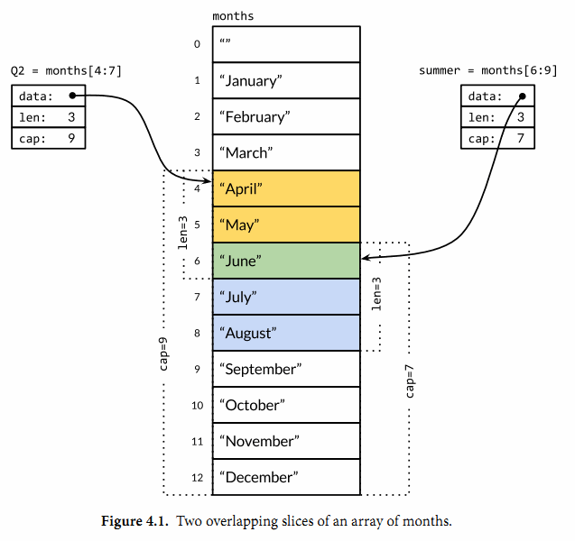
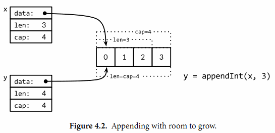

# 第四章　复合数据类型

在第三章我们讨论了基本数据类型，它们可以用于构建程序中数据的结构，是Go语言世界的原子。在本章，我们将讨论复合数据类型，它是以不同的方式组合基本类型而构造出来的复合数据类型。我们主要讨论四种类型——数组、slice、map和结构体——同时在本章的最后，我们将演示如何使用结构体来解码和编码到对应JSON格式的数据，并且通过结合使用模板来生成HTML页面。

数组和结构体是聚合类型；它们的值由许多元素或成员字段的值组成。数组是由同构的元素组成——每个数组元素都是完全相同的类型——结构体则是由异构的元素组成的。数组和结构体都是有固定内存大小的数据结构。相比之下，`slice`和`map`则是动态的数据结构，它们将根据需要动态增长。

## 4.1. 数组

数组是一个由固定长度的特定类型元素组成的序列，一个数组可以由**零个或多个**元素组成。因为数组的长度是固定的，因此在Go语言中很少直接使用数组。和数组对应的类型是`Slice`（**切片**），它是可以增长和收缩的动态序列，`slice`功能也更灵活，但是要理解`slice`工作原理的话需要先理解数组。

数组的每个元素可以通过索引下标来访问，索引下标的范围是从`0`开始到`数组长度减1`的位置。内置的`len`函数将返回数组中元素的个数。

```go
var a [3]int             // array of 3 integers
fmt.Println(a[0])        // print the first element
fmt.Println(a[len(a)-1]) // print the last element, a[2]

// Print the indices and elements.
for i, v := range a {
    fmt.Printf("%d %d\n", i, v)
}

// Print the elements only.
for _, v := range a {
    fmt.Printf("%d\n", v)
}
```

默认情况下，数组的每个元素都被初始化为元素类型对应的零值，对于数字类型来说就是`0`。我们也可以使用数组字面值语法用一组值来初始化数组：

```go
var q [3]int = [3]int{1, 2, 3}
var r [3]int = [3]int{1, 2}
fmt.Println(r[2]) // "0"
```

在数组字面值中，如果在数组的长度位置出现的是“`…`”省略号，则表示数组的长度是根据初始化值的个数来计算。因此，上面`q`数组的定义可以简化为

```go
q := [...]int{1, 2, 3}
fmt.Printf("%T\n", q) // "[3]int"
```

数组的长度是数组类型的一个组成部分，因此`[3]int`和`[4]int`是两种不同的数组类型。数组的长度必须是常量表达式，因为数组的长度需要在编译阶段确定。

```go
q := [3]int{1, 2, 3}
q = [4]int{1, 2, 3, 4} // compile error: cannot assign [4]int to [3]int
```

我们将会发现，数组、`slice`、`map`和结构体字面值的写法都很相似。上面的形式是直接提供顺序初始化值序列，但是也可以指定一个索引和对应值列表的方式初始化，就像下面这样：

```go
type Currency int

const (
    USD Currency = iota // 美元
    EUR                 // 欧元
    GBP                 // 英镑
    RMB                 // 人民币
)

symbol := [...]string{USD: "$", EUR: "€", GBP: "￡", RMB: "￥"}

fmt.Println(RMB, symbol[RMB]) // "3 ￥"
```

在这种形式的数组字面值形式中，初始化索引的顺序是无关紧要的，而且没用到的索引可以省略，和前面提到的规则一样，**未指定初始值的元素将用零值初始化**。例如，

```go
r := [...]int{99: -1}
```

定义了一个含有`100`个元素的数组`r`，最后一个元素被初始化为`-1`，其它元素都是用`0`初始化。

如果一个数组的元素类型是可以相互比较的，那么数组类型也是可以相互比较的，这时候我们可以直接通过`==`比较运算符来比较两个数组，只有当两个数组的所有元素都是相等的时候数组才是相等的。不相等比较运算符`!=`遵循同样的规则。

```go
a := [2]int{1, 2}
b := [...]int{1, 2}
c := [2]int{1, 3}
fmt.Println(a == b, a == c, b == c) // "true false false"

d := [3]int{1, 2}
fmt.Println(a == d) // compile error: cannot compare [2]int == [3]int
```

作为一个真实的例子，`crypto/sha256`包的`Sum256`函数对一个任意的字节`slice`类型的数据生成一个对应的消息摘要。消息摘要有`256bit`大小，因此对应`[32]byte`数组类型。如果两个消息摘要是相同的，那么可以认为两个消息本身也是相同（译注：理论上有HASH码碰撞的情况，但是实际应用可以基本忽略）；如果消息摘要不同，那么消息本身必然也是不同的。下面的例子用**SHA256**算法分别生成“`x`”和“`X`”两个信息的摘要：

*gopl.io/ch4/sha256*

```go
import "crypto/sha256"

func main() {
    c1 := sha256.Sum256([]byte("x"))
    c2 := sha256.Sum256([]byte("X"))
    fmt.Printf("%x\n%x\n%t\n%T\n", c1, c2, c1 == c2, c1)
    // Output:
    // 2d711642b726b04401627ca9fbac32f5c8530fb1903cc4db02258717921a4881
    // 4b68ab3847feda7d6c62c1fbcbeebfa35eab7351ed5e78f4ddadea5df64b8015
    // false
    // [32]uint8
}
```

上面例子中，两个消息虽然只有一个字符的差异，但是生成的消息摘要则几乎有一半的`bit`位是不相同的。需要注意`Printf`函数的`%x`副词参数，它用于指定以十六进制的格式打印数组或`slice`全部的元素，`%t`副词参数是用于打印布尔型数据，`%T`副词参数是用于显示一个值对应的数据类型。

当调用一个函数的时候，函数的每个调用参数将会被赋值给函数内部的参数变量，所以函数参数变量接收的是一个复制的副本，并不是原始调用的变量。因为函数参数传递的机制导致传递大的数组类型将是低效的，并且对数组参数的任何的修改都是发生在复制的数组上，并不能直接修改调用时原始的数组变量。在这个方面，Go语言对待数组的方式和其它很多编程语言不同，其它编程语言可能会隐式地将数组作为引用或指针对象传入被调用的函数。

当然，我们可以显式地传入一个数组指针，那样的话函数通过指针对数组的任何修改都可以直接反馈到调用者。下面的函数用于给`[32]byte`类型的数组清零：

```go
func zero(ptr *[32]byte) {
    for i := range ptr {
        ptr[i] = 0
    }
}
```

其实数组字面值`[32]byte{}`就可以生成一个`32`字节的数组。而且每个数组的元素都是*零值初始化*，也就是`0`。因此，我们可以将上面的`zero`函数写的更简洁一点：

```go
func zero(ptr *[32]byte) {
    *ptr = [32]byte{}
}
```

虽然通过指针来传递数组参数是高效的，而且也允许在函数内部修改数组的值，但是数组依然是僵化的类型，因为数组的类型包含了僵化的长度信息。上面的`zero`函数并不能接收指向`[16]byte`类型数组的指针，而且也没有任何添加或删除数组元素的方法。由于这些原因，除了像**SHA256**这类需要处理特定大小数组的特例外，数组依然很少用作函数参数；相反，我们一般使用`slice`来替代数组。

**练习 4.1：** 编写一个函数，计算两个`SHA256`哈希码中不同**bit**的数目。（参考2.6.2节的`PopCount`函数。)

```go
// shadiff.go
package shadiff

import (
	"crypto/sha256"
)

// 101 & 101-1
// 101 & 100
// 100
// 100 & 011
// 000
func popCount(b byte) int {
	count := 0
	for ; b != 0; count++ {
		b &= b - 1
	}
	return count
}

func bitDiff(a, b []byte) int {
	count := 0
	for i := 0; i < len(a) || i < len(b); i++ {
		switch {
		case i >= len(a):
			count += popCount(b[i])
		case i >= len(b):
			count += popCount(a[i])
		default:
			count += popCount(a[i] ^ b[i])
		}
	}
	return count
}

// ShaBitDiff returns the number of bits that are different in the SHA256
// hashes of two buffers.
func ShaBitDiff(a, b []byte) int {
	shaA := sha256.Sum256(a)
	shaB := sha256.Sum256(b)
	return bitDiff(shaA[:], shaB[:])
}
```

```go
// shadiff_test.go
package shadiff

import (
	"testing"
)

func TestBitDiff(t *testing.T) {
	tests := []struct {
		a, b []byte
		want int
	}{
		{[]byte{0}, []byte{6}, 2},
		{[]byte{1, 2, 3}, []byte{4, 5, 6}, 7},
	}
	for _, test := range tests {
		got := bitDiff(test.a, test.b)
		if got != test.want {
			t.Errorf("bitDiff(%v, %v), got %d, want %d",
				test.a, test.b, got, test.want)
		}
	}
}
```

**练习 4.2：** 编写一个程序，默认情况下打印标准输入的`SHA256`编码，并支持通过命令行`flag`定制，输出`SHA384`或`SHA512`哈希算法。

```go
// sha.go
package main

import (
	"crypto/sha256"
	"crypto/sha512"
	"flag"
	"fmt"
	"io/ioutil"
	"log"
	"os"
)

var width = flag.Int("w", 256, "hash width (256 or 512)")

func main() {
	flag.Parse()
	var function func(b []byte) []byte
	switch *width {
	case 256:
		function = func(b []byte) []byte {
			h := sha256.Sum256(b)
			return h[:]
		}
	case 512:
		function = func(b []byte) []byte {
			h := sha512.Sum512(b)
			return h[:]
		}
	default:
		log.Fatal("Unexpected width specified.")
	}
	b, err := ioutil.ReadAll(os.Stdin)
	if err != nil {
		log.Fatal(err)
	}
	fmt.Printf("%x\n", function(b))
}
```

## 4.2. Slice

Slice（切片）代表变长的序列，序列中每个元素都有相同的类型。一个`slice`类型一般写作`[]T`，其中`T`代表`slice`中元素的类型；`slice`的语法和数组很像，只是没有固定长度而已。

数组和`slice`之间有着紧密的联系。一个`slice`是一个轻量级的数据结构，提供了访问数组子序列（或者全部）元素的功能，而且`slice`的底层确实引用一个数组对象。一个`slice`由三个部分构成：*指针*、*长度*和*容量*。指针指向第一个`slice`元素对应的底层数组元素的地址，要注意的是`slice`的第一个元素并不一定就是数组的第一个元素。长度对应`slice`中元素的数目；长度不能超过容量，容量一般是从`slice`的开始位置到底层数据的结尾位置。内置的`len`和`cap`函数分别返回`slice`的长度和容量。

多个`slice`之间可以共享底层的数据，并且引用的数组部分区间可能重叠。图4.1显示了表示一年中每个月份名字的字符串数组，还有重叠引用了该数组的两个`slice`。数组这样定义

```go
months := [...]string{1: "January", /* ... */, 12: "December"}
```

因此一月份是`months[1]`，十二月份是`months[12]`。通常，数组的第一个元素从索引`0`开始，但是月份一般是从`1`开始的，因此我们声明数组时直接跳过第`0`个元素，第`0`个元素会被自动初始化为空字符串。

`slice`的切片操作`s[i:j]`，其中`0 ≤ i≤ j≤ cap(s)`，用于创建一个新的`slice`，引用`s`的从第`i`个元素开始到第`j-1`个元素的子序列。新的`slice`将只有`j-i`个元素。如果`i`位置的索引被省略的话将使用`0`代替，如果`j`位置的索引被省略的话将使用`len(s)`代替。因此，`months[1:13]`切片操作将引用全部有效的月份，和`months[1:]`操作等价；`months[:]`切片操作则是引用整个数组。让我们分别定义表示第二季度和北方夏天月份的`slice`，它们有重叠部分：



```go
Q2 := months[4:7]
summer := months[6:9]

fmt.Println(Q2)     // ["April" "May" "June"]
fmt.Println(summer) // ["June" "July" "August"]
```

两个`slice`都包含了六月份，下面的代码是一个包含相同月份的测试（性能较低）：

```go
for _, s := range summer {
    for _, q := range Q2 {
        if s == q {
            fmt.Printf("%s appears in both\n", s)
        }
    }
}
```

如果切片操作超出`cap(s)`的上限将导致一个`panic`异常，但是超出`len(s)`则是意味着扩展了`slice`，因为新`slice`的长度会变大：

```go
fmt.Println(summer[:20]) // panic: out of range

endlessSummer := summer[:5] // extend a slice (within capacity)
fmt.Println(endlessSummer)  // "[June July August September October]"
```

另外，字符串的切片操作和`[]byte`字节类型切片的切片操作是类似的。都写作`x[m:n]`，并且都是返回一个原始字节系列的子序列，底层都是共享之前的底层数组，因此这种操作都是常量时间复杂度。`x[m:n]`切片操作对于字符串则生成一个新字符串，如果`x`是`[]byte`的话则生成一个新的`[]byte`。

因为`slice`值包含指向第一个`slice`元素的指针，因此向函数传递`slice`将允许在函数内部修改底层数组的元素。换句话说，复制一个`slice`只是对底层的数组创建了一个新的`slice`别名（§2.3.2）。下面的`reverse`函数在原内存空间将`[]int`类型的`slice`反转，而且它可以用于任意长度的`slice`。

*gopl.io/ch4/rev*

```go
// reverse reverses a slice of ints in place.
func reverse(s []int) {
    for i, j := 0, len(s)-1; i < j; i, j = i+1, j-1 {
        s[i], s[j] = s[j], s[i]
    }
}
```

这里我们反转数组的应用：

```go
a := [...]int{0, 1, 2, 3, 4, 5}
reverse(a[:])
fmt.Println(a) // "[5 4 3 2 1 0]"
```

一种将`slice`元素循环向左旋转`n`个元素的方法是三次调用`reverse`反转函数，第一次是反转开头的`n`个元素，然后是反转剩下的元素，最后是反转整个`slice`的元素。（如果是向右循环旋转，则将第三个函数调用移到第一个调用位置就可以了。）

```go
s := []int{0, 1, 2, 3, 4, 5}
// Rotate s left by two positions.
reverse(s[:2])
reverse(s[2:])
reverse(s)
fmt.Println(s) // "[2 3 4 5 0 1]"
```

要注意的是`slice`类型的变量`s`和数组类型的变量`a`的初始化语法的差异。`slice`和数组的字面值语法很类似，它们都是用花括弧包含一系列的初始化元素，但是对于`slice`并没有指明序列的长度。这会隐式地创建一个合适大小的数组，然后`slice`的指针指向底层的数组。就像数组字面值一样，`slice`的字面值也可以按顺序指定初始化值序列，或者是通过索引和元素值指定，或者用两种风格的混合语法初始化。

和数组不同的是，`slice`之间不能比较，因此我们不能使用`==`操作符来判断两个`slice`是否含有全部相等元素。不过标准库提供了高度优化的`bytes.Equal`函数来判断两个字节型`slice`是否相等（`[]byte`），但是对于其他类型的`slice`，我们必须自己展开每个元素进行比较：

```go
func equal(x, y []string) bool {
    if len(x) != len(y) {
        return false
    }
    for i := range x {
        if x[i] != y[i] {
            return false
        }
    }
    return true
}
```

上面关于两个`slice`的深度相等测试，运行的时间并不比支持`==`操作的数组或字符串更多，但是为何`slice`不直接支持比较运算符呢？这方面有两个原因。

第一个原因，一个`slice`的元素是间接引用的，一个`slice`甚至可以包含自身。虽然有很多办法处理这种情形，但是没有一个是简单有效的。

第二个原因，因为`slice`的元素是间接引用的，一个固定的`slice`值(译注：指`slice`本身的值，不是元素的值)在不同的时刻可能包含不同的元素，因为底层数组的元素可能会被修改。而例如Go语言中`map`的`key`只做简单的浅拷贝，它要求`key`在整个生命周期内保持不变性(译注：例如`slice`扩容，就会导致其本身的值/地址变化)。而用深度相等判断的话，显然在`map`的`key`这种场合不合适。对于像指针或`chan`之类的引用类型，`==`相等测试可以判断两个是否是引用相同的对象。一个针对`slice`的浅相等测试的`==`操作符可能是有一定用处的，也能临时解决`map`类型的`key`问题，但是`slice`和数组不同的相等测试行为会让人困惑。因此，**安全的做法是直接禁止slice之间的比较操作**。

`slice`唯一合法的比较操作是和`nil`比较，例如：

```go
if summer == nil { /* ... */ }
```

一个零值的`slice`等于`nil`。一个`nil`值的slice并没有底层数组。一个`nil`值的`slice`的长度和容量都是`0`，但是也有非`nil`值的`slice`的长度和容量也是`0`的，例如`[]int{}`或`make([]int, 3)[3:]`。与任意类型的`nil`值一样，我们可以用`[]int(nil)`类型转换表达式来生成一个对应类型`slice`的`nil`值。

```go
var s []int    // len(s) == 0, s == nil
s = nil        // len(s) == 0, s == nil
s = []int(nil) // len(s) == 0, s == nil
s = []int{}    // len(s) == 0, s != nil
```

如果你需要测试一个`slice`是否是空的，使用`len(s) == 0`来判断，而不应该用`s == nil`来判断。除了和`nil`相等比较外，一个`nil`值的`slice`的行为和其它任意`0`长度的`slice`一样；例如`reverse(nil)`也是安全的。除了文档已经明确说明的地方，所有的Go语言函数应该以相同的方式对待`nil`值的`slice`和`0`长度的`slice`。

内置的`make`函数创建一个指定元素类型、长度和容量的`slice`。容量部分可以省略，在这种情况下，容量将等于长度。

```go
make([]T, len)
make([]T, len, cap) // same as make([]T, cap)[:len]
```

在底层，`make`创建了一个匿名的数组变量，然后返回一个`slice`；只有通过返回的`slice`才能引用底层匿名的数组变量。在第一种语句中，`slice`是整个数组的`view`。在第二个语句中，`slice`只引用了底层数组的前`len`个元素，但是容量将包含整个的数组。额外的元素是留给未来的增长用的。

### 4.2.1. append函数

内置的`append`函数用于向`slice`追加元素：

```go
var runes []rune

for _, r := range "Hello, 世界" {
    runes = append(runes, r)
}

fmt.Printf("%q\n", runes) // "['H' 'e' 'l' 'l' 'o' ',' ' ' '世' '界']"
```

在循环中使用`append`函数构建一个由九个`rune`字符构成的slice，当然对应这个特殊的问题我们可以通过Go语言内置的`[]rune(“Hello, 世界”)`转换操作完成。

`append`函数对于理解`slice`底层是如何工作的非常重要，所以让我们仔细查看究竟是发生了什么。下面是第一个版本的`appendInt`函数，专门用于处理`[]int`类型的`slice`：

*gopl.io/ch4/append*

```go
func appendInt(x []int, y int) []int {
    var z []int
    zlen := len(x) + 1
    if zlen <= cap(x) {
        // There is room to grow.  Extend the slice.
        z = x[:zlen]
    } else {
        // There is insufficient space.  Allocate a new array.
        // Grow by doubling, for amortized linear complexity.
        zcap := zlen
        if zcap < 2*len(x) {
            zcap = 2 * len(x)
        }
        z = make([]int, zlen, zcap)
        copy(z, x) // a built-in function; see text
    }
    z[len(x)] = y
    return z
}
```

每次调用`appendInt`函数，必须先检测`slice`底层数组是否有足够的容量来保存新添加的元素。如果有足够空间的话，直接扩展`slice`（依然在原有的底层数组之上），将新添加的`y`元素复制到新扩展的空间，并返回`slice`。因此，输入的`x`和输出的`z`共享相同的底层数组。

如果没有足够的增长空间的话，`appendInt`函数则会先分配一个足够大的`slice`用于保存新的结果，先将输入的`x`复制到新的空间，然后添加`y`元素。结果`z`和输入的`x`引用的将是不同的底层数组。

虽然通过循环复制元素更直接，不过内置的`copy`函数可以方便地将一个`slice`复制另一个相同类型的`slice`。`copy`函数的第一个参数是要复制的**目标slice**，第二个参数是**源slice**，目标和源的位置顺序和`dst = src`赋值语句是一致的。两个`slice`可以共享同一个底层数组，甚至有重叠也没有问题。`copy`函数将返回成功复制的元素的个数（我们这里没有用到），等于两个`slice`中较小的长度，所以我们不用担心覆盖会超出目标`slice`的范围。

为了提高内存使用效率，新分配的数组一般略大于保存`x`和`y`所需要的最低大小。通过在每次扩展数组时直接将长度翻倍从而避免了多次内存分配，也确保了添加单个元素操的平均时间是一个常数时间。这个程序演示了效果：

```go
func main() {
    var x, y []int
    for i := 0; i < 10; i++ {
        y = appendInt(x, i)
        fmt.Printf("%d cap=%d\t%v\n", i, cap(y), y)
        x = y
    }
}
```

每一次容量的变化都会导致重新分配内存和`copy`操作：

```go
0  cap=1    [0]
1  cap=2    [0 1]
2  cap=4    [0 1 2]
3  cap=4    [0 1 2 3]
4  cap=8    [0 1 2 3 4]
5  cap=8    [0 1 2 3 4 5]
6  cap=8    [0 1 2 3 4 5 6]
7  cap=8    [0 1 2 3 4 5 6 7]
8  cap=16   [0 1 2 3 4 5 6 7 8]
9  cap=16   [0 1 2 3 4 5 6 7 8 9]
```

让我们仔细查看`i=3`次的迭代。当时`x`包含了`[0 1 2]`三个元素，但是容量是`4`，因此可以简单将新的元素添加到末尾，不需要新的内存分配。然后新的`y`的长度和容量都是4，并且和`x`引用着相同的底层数组，如图4.2所示。



在下一次迭代时`i=4`，现在没有新的空余的空间了，因此`appendInt`函数分配一个容量为`8`的底层数组，将`x`的`4`个元素`[0 1 2 3]`复制到新空间的开头，然后添加新的元素`i`，新元素的值是`4`。新的`y`的长度是`5`，容量是`8`；后面有`3`个空闲的位置，三次迭代都不需要分配新的空间。当前迭代中，`y`和`x`是对应不同底层数组的`view`。这次操作如图4.3所示。


内置的`append`函数可能使用比`appendInt`更复杂的内存扩展策略。因此，通常我们并不知道`append`调用是否导致了内存的重新分配，因此我们也不能确认新的`slice`和原始的`slice`是否引用的是相同的底层数组空间。同样，我们不能确认在原先的`slice`上的操作是否会影响到新的`slice`。因此，通常是将`append`返回的结果直接赋值给输入的`slice`变量：

```go
runes = append(runes, r)
```

更新`slice`变量不仅对调用`append`函数是必要的，实际上对应任何可能导致长度、容量或底层数组变化的操作都是必要的。要正确地使用`slice`，需要记住尽管底层数组的元素是间接访问的，但是`slice`对应结构体本身的指针、长度和容量部分是直接访问的。要更新这些信息需要像上面例子那样一个显式的赋值操作。从这个角度看，`slice`并不是一个纯粹的引用类型，它实际上是一个类似下面结构体的聚合类型：

```go
type IntSlice struct {
    ptr      *int
    len, cap int
}
```

我们的`appendInt`函数每次只能向`slice`追加一个元素，但是内置的`append`函数则可以追加多个元素，甚至追加一个`slice`。

```go
var x []int
x = append(x, 1)
x = append(x, 2, 3)
x = append(x, 4, 5, 6)
x = append(x, x...) // append the slice x
fmt.Println(x)      // "[1 2 3 4 5 6 1 2 3 4 5 6]"
```

通过下面的小修改，我们可以达到`append`函数类似的功能。其中在`appendInt`函数参数中的最后的“`…`”省略号表示接收变长的参数为`slice`。我们将在5.7节详细解释这个特性。

```go
func appendInt(x []int, y ...int) []int {
    var z []int
    zlen := len(x) + len(y)
    // ...expand z to at least zlen...
    copy(z[len(x):], y)
    return z
}
```

为了避免重复，和前面相同的代码并没有显示。

### 4.2.2. Slice内存技巧

让我们看看更多的例子，比如旋转`slice`、反转`slice`或在`slice`原有内存空间修改元素。给定一个字符串列表，下面的`nonempty`函数将在原有`slice`内存空间之上返回不包含空字符串的列表：

*gopl.io/ch4/nonempty*

```go
// Nonempty is an example of an in-place slice algorithm.
package main

import "fmt"

// nonempty returns a slice holding only the non-empty strings.
// The underlying array is modified during the call.
func nonempty(strings []string) []string {
    i := 0
    for _, s := range strings {
        if s != "" {
            strings[i] = s
            i++
        }
    }
    return strings[:i]
}
```

比较微妙的地方是，输入的`slice`和输出的`slice`共享一个底层数组。这可以避免分配另一个数组，不过原来的数据将可能会被覆盖，正如下面两个打印语句看到的那样：

```go
data := []string{"one", "", "three"}
fmt.Printf("%q\n", nonempty(data)) // `["one" "three"]`
fmt.Printf("%q\n", data)           // `["one" "three" "three"]`
```

因此我们通常会这样使用`nonempty`函数：`data = nonempty(data)`。

`nonempty`函数也可以使用`append`函数实现：

```go
func nonempty2(strings []string) []string {
    out := strings[:0] // zero-length slice of original
    for _, s := range strings {
        if s != "" {
            out = append(out, s)
        }
    }
    return out
}
```

无论如何实现，以这种方式重用一个`slice`一般都要求最多为每个输入值产生一个输出值，事实上很多这类算法都是用来过滤或合并序列中相邻的元素。这种slice用法是比较复杂的技巧，虽然使用到了`slice`的一些技巧，但是对于某些场合是比较清晰和有效的。

一个`slice`可以用来模拟一个`stack`。最初给定的空`slice`对应一个空的`stack`，然后可以使用`append`函数将新的值压入`stack`：

```go
stack = append(stack, v) // push v
```

`stack`的顶部位置对应`slice`的最后一个元素：

```go
top := stack[len(stack)-1] // top of stack
```

通过收缩`stack`可以弹出栈顶的元素

```go
stack = stack[:len(stack)-1] // pop
```

要删除`slice`中间的某个元素并保存原有的元素顺序，可以通过内置的`copy`函数将后面的子`slice`向前依次移动一位完成：

```go
func remove(slice []int, i int) []int {
    copy(slice[i:], slice[i+1:])
    return slice[:len(slice)-1]
}

func main() {
    s := []int{5, 6, 7, 8, 9}
    fmt.Println(remove(s, 2)) // "[5 6 8 9]"
}
```

如果删除元素后不用保持原来顺序的话，我们可以简单的用最后一个元素覆盖被删除的元素：

```go
func remove(slice []int, i int) []int {
    slice[i] = slice[len(slice)-1]
    return slice[:len(slice)-1]
}

func main() {
    s := []int{5, 6, 7, 8, 9}
    fmt.Println(remove(s, 2)) // "[5 6 9 8]
}
```

**练习 4.3：** 重写`reverse`函数，使用数组指针代替`slice`。

```go
//reverse.go
package reverse

func reverse(ints *[5]int) {
	for i := 0; i < len(ints)/2; i++ {
		end := len(ints) - i - 1
		ints[i], ints[end] = ints[end], ints[i]
	}
}
```

```go
//reverse_test.go
package reverse

import (
	"reflect"
	"testing"
)

func TestReverse(t *testing.T) {
	tests := []struct {
		a, want [5]int
	}{
		{[5]int{1, 2, 3, 4, 5}, [5]int{5, 4, 3, 2, 1}},
	}
	for _, test := range tests {
		reverse(&test.a)
		if !reflect.DeepEqual(test.a, test.want) {
			t.Errorf("got %v, want %v", test.a, test.want)
		}
	}
}
```

**练习 4.4：** 编写一个`rotate`函数，通过一次循环完成旋转。

```go
// rotate_slice.go
package rotate

import (
	"fmt"
)

func rotate_ints(ints []int) {
	first := ints[0]
	copy(ints, ints[1:])
	ints[len(ints)-1] = first
}

func main() {
	s := []int{1, 2, 3, 4, 5}
	rotate_ints(s)
	fmt.Println(s)
}
```

```go
// rotate_test.go
package rotate

import (
	"reflect"
	"testing"
)

func TestRotate(t *testing.T) {
	s := []int{1, 2, 3}
	rotate_ints(s)
	want := []int{2, 3, 1}
	if !reflect.DeepEqual(s, want) {
		t.Errorf("got %v, want %v", s, want)
	}
}
```

**练习 4.5：** 写一个函数在原地完成消除`[]string`中相邻重复的字符串的操作。

```go
// unique.go
package unique

func unique(strs []string) []string {
	w := 0 // index of last written string
	for _, s := range strs {
		if strs[w] == s {
			continue
		}
		w++
		strs[w] = s
	}
	return strs[:w+1]
}
```

```go
// unique_test.go
package unique

import (
	"reflect"
	"testing"
)

func TestUnique(t *testing.T) {
	s := []string{"a", "a", "b", "c", "c", "c", "d", "d", "e"}
	got := unique(s)
	want := []string{"a", "b", "c", "d", "e"}
	if !reflect.DeepEqual(got, want) {
		t.Errorf("got %v, want %v", got, want)
	}
}
```

**练习 4.6：** 编写一个函数，原地将一个UTF-8编码的`[]byte`类型的`slice`中相邻的空格（参考`unicode.IsSpace`）替换成一个空格返回

```go
// reverse.go
package reverse

import (
	"unicode/utf8"
)

func rev(b []byte) {
	size := len(b)
	for i := 0; i < len(b)/2; i++ {
		b[i], b[size-1-i] = b[size-1-i], b[i]
	}
}

// ex4.7
// Reverse all the runes, and then the entire slice. The runes' bytes end up in
// the right order.
func revUTF8(b []byte) []byte {
	for i := 0; i < len(b); {
		_, size := utf8.DecodeRune(b[i:])
		rev(b[i : i+size])
		i += size
	}
	rev(b)
	return b
}
```

```go
// reverse_test.go
package reverse

import (
	"testing"
)

func TestRevUTF8(t *testing.T) {
	s := []byte("Räksmörgås")
	got := string(revUTF8(s))
	want := "sågrömskäR"
	if got != want {
		t.Errorf("got %v, want %v", string(got), want)
	}
}
```

**练习 4.7：** 修改`reverse`函数用于原地反转UTF-8编码的`[]byte`。是否可以不用分配额外的内存？

```go
// reverse.go
package reverse

import (
	"unicode/utf8"
)

func rev(b []byte) {
	size := len(b)
	for i := 0; i < len(b)/2; i++ {
		b[i], b[size-1-i] = b[size-1-i], b[i]
	}
}

// Reverse all the runes, and then the entire slice. The runes' bytes end up in
// the right order.
func revUTF8(b []byte) []byte {
	for i := 0; i < len(b); {
		_, size := utf8.DecodeRune(b[i:])
		rev(b[i : i+size])
		i += size
	}
	rev(b)
	return b
}
```

```go
// reverse_test.go
package reverse

import (
	"testing"
)

func TestRevUTF8(t *testing.T) {
	s := []byte("Räksmörgås")
	got := string(revUTF8(s))
	want := "sågrömskäR"
	if got != want {
		t.Errorf("got %v, want %v", string(got), want)
	}
}
```

## 4.3. Map

哈希表是一种巧妙并且实用的数据结构。它是一个无序的`key/value`对的集合，其中所有的`key`都是不同的，然后通过给定的`key`可以在常数时间复杂度内检索、更新或删除对应的`value`。

在Go语言中，一个`map`就是一个哈希表的引用，`map`类型可以写为`map[K]V`，其中`K`和`V`分别对应`key`和`value`。`map`中所有的`key`都有相同的类型，所有的`value`也有着相同的类型，但是`key`和`value`之间可以是不同的数据类型。其中`K`对应的`key`必须是支持`==`比较运算符的数据类型，所以`map`可以通过测试`key`是否相等来判断是否已经存在。虽然浮点数类型也是支持相等运算符比较的，但是将浮点数用做`key`类型则是一个坏的想法，正如第三章提到的，最坏的情况是可能出现的`NaN`和任何浮点数都不相等。对于`V`对应的`value`数据类型则没有任何的限制。

内置的`make`函数可以创建一个`map`：

```go
ages := make(map[string]int) // mapping from strings to ints
```

我们也可以用`map`字面值的语法创建`map`，同时还可以指定一些最初的`key`/`value`：

```go
ages := map[string]int{
    "alice":   31,
    "charlie": 34,
}
```

这相当于

```go
ages := make(map[string]int)
ages["alice"] = 31
ages["charlie"] = 34
```

因此，另一种创建空的`map`的表达式是`map[string]int{}`。

Map中的元素通过`key`对应的下标语法访问：

```go
ages["alice"] = 32
fmt.Println(ages["alice"]) // "32"
```

使用内置的`delete`函数可以删除元素：

```go
delete(ages, "alice") // remove element ages["alice"]
```

所有这些操作是安全的，即使这些元素不在`map`中也没有关系；如果一个查找失败将返回`value`类型对应的零值，例如，即使`map`中不存在“`bob`”下面的代码也可以正常工作，因为`ages["bob"]`失败时将返回0。

```go
ages["bob"] = ages["bob"] + 1 // happy birthday!
```

而且`x += y`和`x++`等简短赋值语法也可以用在`map`上，所以上面的代码可以改写成

```go
ages["bob"] += 1
```

更简单的写法

```go
ages["bob"]++
```

但是`map`中的元素并不是一个变量，因此我们不能对`map`的元素进行取址操作：

```go
_ = &ages["bob"] // compile error: cannot take address of map element
```

**禁止对map元素取址的原因是map可能随着元素数量的增长而重新分配更大的内存空间，从而可能导致之前的地址无效**。

要想遍历`map`中全部的`key`/`value`对的话，可以使用`range`风格的`for`循环实现，和之前的`slice`遍历语法类似。下面的迭代语句将在每次迭代时设置`name`和`age`变量，它们对应下一个键/值对：

```go
for name, age := range ages {
    fmt.Printf("%s\t%d\n", name, age)
}
```

Map的迭代顺序是不确定的，并且不同的哈希函数实现可能导致不同的遍历顺序。在实践中，遍历的顺序是随机的，每一次遍历的顺序都不相同。这是故意的，每次都使用随机的遍历顺序可以强制要求程序不会依赖具体的哈希函数实现。如果要按顺序遍历`key`/`value`对，我们必须显式地对`key`进行排序，可以使用`sort`包的`Strings`函数对字符串`slice`进行排序。下面是常见的处理方式：

```go
import "sort"

var names []string

for name := range ages {
    names = append(names, name)
}
sort.Strings(names)
for _, name := range names {
    fmt.Printf("%s\t%d\n", name, ages[name])
}
```

因为我们一开始就知道`names`的最终大小，因此给`slice`分配一个合适的大小将会更有效。下面的代码创建了一个空的`slice`，但是`slice`的容量刚好可以放下`map`中全部的`key`：

```go
names := make([]string, 0, len(ages))
```

在上面的第一个`range`循环中，我们只关心`map`中的`key`，所以我们忽略了第二个循环变量。在第二个循环中，我们只关心`names`中的名字，所以我们使用“`_`”空白标识符来忽略第一个循环变量，也就是迭代`slice`时的索引。

`map`类型的零值是`nil`，也就是没有引用任何哈希表。

```go
var ages map[string]int
fmt.Println(ages == nil)    // "true"
fmt.Println(len(ages) == 0) // "true"
```

`map`上的大部分操作，包括查找、删除、`len`和`range`循环都可以安全工作在`nil`值的`map`上，它们的行为和一个空的`map`类似。但是向一个`nil`值的`map`存入元素将导致一个`panic`异常：

```go
ages["carol"] = 21 // panic: assignment to entry in nil map
```

**在向map存数据前必须先创建map**。

通过`key`作为索引下标来访问`map`将产生一个`value`。如果`key`在`map`中是存在的，那么将得到与`key`对应的`value`；如果`key`不存在，那么将得到`value`对应类型的零值，正如我们前面看到的`ages["bob"]`那样。这个规则很实用，但是有时候可能需要知道对应的元素是否真的是在`map`之中。例如，如果元素类型是一个数字，你可能需要区分一个已经存在的`0`，和不存在而返回零值的`0`，可以像下面这样测试：

```go
age, ok := ages["bob"]
if !ok { /* "bob" is not a key in this map; age == 0. */ }
```

你会经常看到将这两个结合起来使用，像这样：

```go
if age, ok := ages["bob"]; !ok { /* ... */ }
```

在这种场景下，`map`的下标语法将产生两个值；第二个是一个布尔值，用于报告元素是否真的存在。布尔变量一般命名为`ok`，特别适合马上用于`if`条件判断部分。

和`slice`一样，`map`之间也不能进行相等比较；唯一的例外是和`nil`进行比较。要判断两个`map`是否包含相同的`key`和`value`，我们必须通过一个循环实现：

```go
func equal(x, y map[string]int) bool {
    if len(x) != len(y) {
        return false
    }
    for k, xv := range x {
        if yv, ok := y[k]; !ok || yv != xv {
            return false
        }
    }
    return true
}
```

从例子中可以看到如何用`!ok`来区分元素不存在，与元素存在但为`0`的。我们不能简单地用`xv != y[k]`判断，那样会导致在判断下面两个`map`时产生错误的结果：

```go
// True if equal is written incorrectly.
equal(map[string]int{"A": 0}, map[string]int{"B": 42})
```

Go语言中并没有提供一个`set`类型，但是`map`中的`key`也是不相同的，可以用`map`实现类似`set`的功能。为了说明这一点，下面的`dedup`程序读取多行输入，但是只打印第一次出现的行。（它是1.3节中出现的`dup`程序的变体。）`dedup`程序通过`map`来表示所有的输入行所对应的`set`集合，以确保已经在集合存在的行不会被重复打印。

*gopl.io/ch4/dedup*

```go
func main() {
    seen := make(map[string]bool) // a set of strings
    input := bufio.NewScanner(os.Stdin)
    for input.Scan() {
        line := input.Text()
        if !seen[line] {
            seen[line] = true
            fmt.Println(line)
        }
    }
   
    if err := input.Err(); err != nil {
        fmt.Fprintf(os.Stderr, "dedup: %v\n", err)
        os.Exit(1)
    }
}
```

Go程序员将这种忽略`value`的`map`当作一个字符串集合，并非所有`map[string]bool`类型`value`都是无关紧要的；有一些则可能会同时包含`true`和`false`的值。

有时候我们需要一个`map`或`set`的`key`是`slice`类型，但是`map`的`key`必须是可比较的类型，但是`slice`并不满足这个条件。不过，我们可以通过两个步骤绕过这个限制。第一步，定义一个辅助函数`k`，将`slice`转为`map`对应的`string`类型的`key`，确保只有`x`和`y`相等时`k(x) == k(y)`才成立。然后创建一个`key`为`string`类型的`map`，在每次对`map`操作时先用`k`辅助函数将`slice`转化为`string`类型。

下面的例子演示了如何使用`map`来记录提交相同的字符串列表的次数。它使用了`fmt.Sprintf`函数将字符串列表转换为一个字符串以用于`map`的`key`，通过`%q`参数忠实地记录每个字符串元素的信息：

```go
var m = make(map[string]int)

func k(list []string) string { return fmt.Sprintf("%q", list) }

func Add(list []string)       { m[k(list)]++ }
func Count(list []string) int { return m[k(list)] }
```

使用同样的技术可以处理任何不可比较的`key`类型，而不仅仅是`slice`类型。这种技术对于想使用自定义`key`比较函数的时候也很有用，例如在比较字符串的时候忽略大小写。同时，辅助函数`k(x)`也不一定是字符串类型，它可以返回任何可比较的类型，例如整数、数组或结构体等。

这是`map`的另一个例子，下面的程序用于统计输入中每个Unicode码点出现的次数。虽然Unicode全部码点的数量巨大，但是出现在特定文档中的字符种类并没有多少，使用`map`可以用比较自然的方式来跟踪那些出现过的字符的次数。

*gopl.io/ch4/charcount*

```go
// Charcount computes counts of Unicode characters.
package main

import (
    "bufio"
    "fmt"
    "io"
    "os"
    "unicode"
    "unicode/utf8"
)

func main() {
    counts := make(map[rune]int)    // counts of Unicode characters
    var utflen [utf8.UTFMax + 1]int // count of lengths of UTF-8 encodings
    invalid := 0                    // count of invalid UTF-8 characters
    in := bufio.NewReader(os.Stdin)
    for {
        r, n, err := in.ReadRune() // returns rune, nbytes, error
        if err == io.EOF {
            break
        }
        if err != nil {
            fmt.Fprintf(os.Stderr, "charcount: %v\n", err)
            os.Exit(1)
        }
        if r == unicode.ReplacementChar && n == 1 {
            invalid++
            continue
        }
        counts[r]++
        utflen[n]++
    }
    fmt.Printf("rune\tcount\n")
    for c, n := range counts {
        fmt.Printf("%q\t%d\n", c, n)
    }
    fmt.Print("\nlen\tcount\n")
    for i, n := range utflen {
        if i > 0 {
            fmt.Printf("%d\t%d\n", i, n)
        }
    }
    if invalid > 0 {
        fmt.Printf("\n%d invalid UTF-8 characters\n", invalid)
    }
}
```

`ReadRune`方法执行*UTF-8*解码并返回三个值：解码的`rune`字符的值，字符UTF-8编码后的长度，和一个错误值。我们可预期的错误值只有对应文件结尾的`io.EOF`。如果输入的是无效的UTF-8编码的字符，返回的将是`unicode.ReplacementChar`表示无效字符，并且编码长度是1。

`charcount`程序同时打印不同UTF-8编码长度的字符数目。对此，`map`并不是一个合适的数据结构；因为*UTF-8*编码的长度总是从`1`到`utf8.UTFMax`（最大是4个字节），使用数组将更有效。

作为一个实验，我们用`charcount`程序对英文版原稿的字符进行了统计。虽然大部分是英语，但是也有一些非ASCII字符。下面是排名前10的非ASCII字符：


下面是不同UTF-8编码长度的字符的数目：

```go
len count
1   765391
2   60
3   70
4   0
```

Map的`value`类型也可以是一个聚合类型，比如是一个`map`或`slice`。在下面的代码中，图`graph`的`key`类型是一个字符串，`value`类型`map[string]bool`代表一个字符串集合。从概念上讲，`graph`将一个字符串类型的`key`映射到一组相关的字符串集合，它们指向新的`graph`的`key`。

*gopl.io/ch4/graph*

```go
var graph = make(map[string]map[string]bool)

func addEdge(from, to string) {
    edges := graph[from]
    if edges == nil {
        edges = make(map[string]bool)
        graph[from] = edges
    }
    edges[to] = true
}

func hasEdge(from, to string) bool {
    return graph[from][to]
}
```

其中`addEdge`函数惰性初始化`map`是一个惯用方式，也就是说在每个值首次作为`key`时才初始化。`addEdge`函数显示了如何让`map`的零值也能正常工作；即使`from`到`to`的边不存在，`graph[from][to]`依然可以返回一个有意义的结果。

**练习 4.8：** 修改`charcount`程序，使用`unicode.IsLetter`等相关的函数，统计字母、数字等Unicode中不同的字符类别。

```go
// charcount.go
package main

import (
	"bufio"
	"fmt"
	"io"
	"os"
	"unicode"
	"unicode/utf8"
)

func main() {
	counts := make(map[rune]int) // counts of Unicode characters
	cats := make(map[string]int)
	var utflen [utf8.UTFMax + 1]int // count of lengths of UTF-8 encodings
	invalid := 0                    // count of invalid UTF-8 characters

	in := bufio.NewReader(os.Stdin)
	for {
		r, n, err := in.ReadRune() // returns rune, nbytes, error
		if err == io.EOF {
			break
		}
		if err != nil {
			fmt.Fprintf(os.Stderr, "charcount: %v\n", err)
			os.Exit(1)
		}
		if r == unicode.ReplacementChar && n == 1 {
			invalid++
			continue
		}
		for catName, rangeTable := range unicode.Properties {
			if unicode.In(r, rangeTable) {
				cats[catName]++
			}
		}
		counts[r]++
		utflen[n]++
	}
	fmt.Printf("rune\tcount\n")
	for c, n := range counts {
		fmt.Printf("%q\t%d\n", c, n)
	}
	fmt.Print("\nlen\tcount\n")
	for i, n := range utflen {
		if i > 0 {
			fmt.Printf("%d\t%d\n", i, n)
		}
	}
	fmt.Printf("\n%-30s count\n", "category")
	for cat, n := range cats {
		fmt.Printf("%-30s %d\n", cat, n)
	}
	if invalid > 0 {
		fmt.Printf("\n%d invalid UTF-8 characters\n", invalid)
	}
}
```

**练习 4.9：** 编写一个程序`wordfreq`程序，报告输入文本中每个单词出现的频率。在第一次调用Scan前先调用`input.Split(bufio.ScanWords)`函数，这样可以按单词而不是按行输入。

```go
// wordfreq.go
package main

import (
	"bufio"
	"fmt"
	"os"
)

func main() {
	freq := make(map[string]int)
	scanner := bufio.NewScanner(os.Stdin)
	scanner.Split(bufio.ScanWords)
	for scanner.Scan() {
		word := scanner.Text()
		freq[word]++
	}
	if scanner.Err() != nil {
		fmt.Fprintln(os.Stderr, scanner.Err())
		os.Exit(1)
	}
	for word, n := range freq {
		fmt.Printf("%-30s %d\n", word, n)
	}
}
```

## 4.4. 结构体

结构体是一种聚合的数据类型，是由零个或多个任意类型的值聚合成的实体。每个值称为结构体的成员。用结构体的经典案例是处理公司的员工信息，每个员工信息包含一个唯一的员工编号、员工的名字、家庭住址、出生日期、工作岗位、薪资、上级领导等等。所有的这些信息都需要绑定到一个实体中，可以作为一个整体单元被复制，作为函数的参数或返回值，或者是被存储到数组中，等等。

下面两个语句声明了一个叫`Employee`的命名的结构体类型，并且声明了一个`Employee`类型的变量`dilbert`：

```go
type Employee struct {
    ID        int
    Name      string
    Address   string
    DoB       time.Time
    Position  string
    Salary    int
    ManagerID int
}

var dilbert Employee
```

`dilbert`结构体变量的成员可以通过点操作符访问，比如`dilbert.Name`和`dilbert.DoB`。因为`dilbert`是一个变量，它所有的成员也同样是变量，我们可以直接对每个成员赋值：

```go
dilbert.Salary -= 5000 // demoted, for writing too few lines of code
```

或者是对成员取地址，然后通过指针访问：

```go
position := &dilbert.Position
*position = "Senior " + *position // promoted, for outsourcing to Elbonia
```

点操作符也可以和指向结构体的指针一起工作：

```go
var employeeOfTheMonth *Employee = &dilbert
employeeOfTheMonth.Position += " (proactive team player)"
```

相当于下面语句

```go
(*employeeOfTheMonth).Position += " (proactive team player)"
```

下面的`EmployeeByID`函数将根据给定的员工`ID`返回对应的员工信息结构体的指针。我们可以使用点操作符来访问它里面的成员：

```go
func EmployeeByID(id int) *Employee { /* ... */ }

fmt.Println(EmployeeByID(dilbert.ManagerID).Position) // "Pointy-haired boss"

id := dilbert.ID
EmployeeByID(id).Salary = 0 // fired for... no real reason
```

后面的语句通过`EmployeeByID`返回的结构体指针更新了`Employee`结构体的成员。如果将`EmployeeByID`函数的返回值从`*Employee`指针类型改为`Employee`值类型，那么更新语句将不能编译通过，因为在赋值语句的左边并不确定是一个变量。

> （译注：调用函数返回的是值，并不是一个可取地址的变量）。

通常一行对应一个结构体成员，成员的名字在前类型在后，不过如果相邻的成员类型如果相同的话可以被合并到一行，就像下面的`Name`和`Address`成员那样：

```go
type Employee struct {
    ID            int
    Name, Address string
    DoB           time.Time
    Position      string
    Salary        int
    ManagerID     int
}
```

结构体成员的输入顺序也有重要的意义。我们也可以将`Position`成员合并（因为也是字符串类型），或者是交换`Name`和`Address`出现的先后顺序，那样的话就是定义了不同的结构体类型。通常，我们只是将相关的成员写到一起。

如果结构体成员名字是以大写字母开头的，那么该成员就是导出的；这是Go语言导出规则决定的。一个结构体可能同时包含导出和未导出的成员。

结构体类型往往是冗长的，因为它的每个成员可能都会占一行。虽然我们每次都可以重写整个结构体成员，但是重复会令人厌烦。因此，完整的结构体写法通常只在类型声明语句的地方出现，就像`Employee`类型声明语句那样。

一个命名为`S`的结构体类型将不能再包含`S`类型的成员：因为一个聚合的值不能包含它自身。（该限制同样适用于数组。）但是`S`类型的结构体可以包含`*S`指针类型的成员，这可以让我们创建递归的数据结构，比如链表和树结构等。在下面的代码中，我们使用一个二叉树来实现一个插入排序：

*gopl.io/ch4/treesort*

```go
type tree struct {
    value       int
    left, right *tree
}

// Sort sorts values in place.
func Sort(values []int) {
    var root *tree
    for _, v := range values {
        root = add(root, v)
    }
    appendValues(values[:0], root)
}

// appendValues appends the elements of t to values in order
// and returns the resulting slice.
func appendValues(values []int, t *tree) []int {
    if t != nil {
        values = appendValues(values, t.left)
        values = append(values, t.value)
        values = appendValues(values, t.right)
    }
    return values
}

func add(t *tree, value int) *tree {
    if t == nil {
        // Equivalent to return &tree{value: value}.
        t = new(tree)
        t.value = value
        return t
    }
    if value < t.value {
        t.left = add(t.left, value)
    } else {
        t.right = add(t.right, value)
    }
    return t
}
```

结构体类型的零值是每个成员都是零值。通常会将零值作为最合理的默认值。例如，对于`bytes.Buffer`类型，结构体初始值就是一个随时可用的空缓存，还有在第9章将会讲到的`sync.Mutex`的零值也是有效的未锁定状态。有时候这种零值可用的特性是自然获得的，但是也有些类型需要一些额外的工作。

如果结构体没有任何成员的话就是空结构体，写作`struct{}`。它的大小为`0`，也不包含任何信息，但是有时候依然是有价值的。有些Go语言程序员用`map`来模拟`set`数据结构时，用它来代替`map`中布尔类型的`value`，只是强调`key`的重要性，但是因为节约的空间有限，而且语法比较复杂，所以我们通常会避免这样的用法。

```go
seen := make(map[string]struct{}) // set of strings
// ...
if _, ok := seen[s]; !ok {
    seen[s] = struct{}{}
    // ...first time seeing s...
}
```

### 4.4.1. 结构体字面值

结构体值也可以用结构体字面值表示，结构体字面值可以指定每个成员的值。

```go
type Point struct{ X, Y int }

p := Point{1, 2}
```

这里有两种形式的结构体字面值语法，上面的是第一种写法，要求以结构体成员定义的顺序为每个结构体成员指定一个字面值。它要求写代码和读代码的人要记住结构体的每个成员的类型和顺序，不过结构体成员有细微的调整就可能导致上述代码不能编译。因此，上述的语法一般只在定义结构体的包内部使用，或者是在较小的结构体中使用，这些结构体的成员排列比较规则，比如`image.Point{x, y}`或`color.RGBA{red, green, blue, alpha}`。

其实更常用的是第二种写法，以成员名字和相应的值来初始化，可以包含部分或全部的成员，如1.4节的`Lissajous`程序的写法：

```go
anim := gif.GIF{LoopCount: nframes}
```

在这种形式的结构体字面值写法中，如果成员被忽略的话将默认用零值。因为提供了成员的名字，所以成员出现的顺序并不重要。

两种不同形式的写法不能混合使用。而且，你不能企图在外部包中用第一种顺序赋值的技巧来偷偷地初始化结构体中未导出的成员。

```go
package p
type T struct{ a, b int } // a and b are not exported

package q
import "p"
var _ = p.T{a: 1, b: 2} // compile error: can't reference a, b
var _ = p.T{1, 2}       // compile error: can't reference a, b
```

虽然上面最后一行代码的编译错误信息中并没有显式提到未导出的成员，但是这样企图隐式使用未导出成员的行为也是不允许的。

结构体可以作为函数的参数和返回值。例如，这个`Scale`函数将`Point`类型的值缩放后返回：

```go
func Scale(p Point, factor int) Point {
    return Point{p.X * factor, p.Y * factor}
}

fmt.Println(Scale(Point{1, 2}, 5)) // "{5 10}"
```

如果考虑效率的话，较大的结构体通常会用指针的方式传入和返回，

```go
func Bonus(e *Employee, percent int) int {
    return e.Salary * percent / 100
}
```

如果要在函数内部修改结构体成员的话，用指针传入是必须的；因为在Go语言中，所有的函数参数都是值拷贝传入的，函数参数将不再是函数调用时的原始变量。

```go
func AwardAnnualRaise(e *Employee) {
    e.Salary = e.Salary * 105 / 100
}
```

因为结构体通常通过指针处理，可以用下面的写法来创建并初始化一个结构体变量，并返回结构体的地址：

```go
pp := &Point{1, 2}
```

它和下面的语句是等价的

```go
pp := new(Point)
*pp = Point{1, 2}
```

不过`&Point{1, 2}`写法可以直接在表达式中使用，比如一个函数调用。

### 4.4.2. 结构体比较

如果结构体的全部成员都是可以比较的，那么结构体也是可以比较的，那样的话两个结构体将可以使用`==`或`!=`运算符进行比较。相等比较运算符`==`将比较两个结构体的每个成员，因此下面两个比较的表达式是等价的：

```go
type Point struct{ X, Y int }

p := Point{1, 2}
q := Point{2, 1}
fmt.Println(p.X == q.X && p.Y == q.Y) // "false"
fmt.Println(p == q)                   // "false"
```

可比较的结构体类型和其他可比较的类型一样，可以用于`map`的`key`类型。

```go
type address struct {
    hostname string
    port     int
}

hits := make(map[address]int)
hits[address{"golang.org", 443}]++
```

### 4.4.3. 结构体嵌入和匿名成员

在本节中，我们将看到如何使用Go语言提供的不同寻常的结构体嵌入机制让一个命名的结构体包含另一个结构体类型的匿名成员，这样就可以通过简单的点运算符`x.f`来访问匿名成员链中嵌套的`x.d.e.f`成员。

考虑一个二维的绘图程序，提供了一个各种图形的库，例如矩形、椭圆形、星形和轮形等几何形状。这里是其中两个的定义：

```go
type Circle struct {
    X, Y, Radius int
}

type Wheel struct {
    X, Y, Radius, Spokes int
}
```

一个`Circle`代表的圆形类型包含了标准圆心的`X`和`Y`坐标信息，和一个`Radius`表示的半径信息。一个`Wheel`轮形除了包含`Circle`类型所有的全部成员外，还增加了`Spokes`表示径向辐条的数量。我们可以这样创建一个`wheel`变量：

```go
var w Wheel
w.X = 8
w.Y = 8
w.Radius = 5
w.Spokes = 20
```

随着库中几何形状数量的增多，我们一定会注意到它们之间的相似和重复之处，所以我们可能为了便于维护而将相同的属性独立出来：

```go
type Point struct {
    X, Y int
}

type Circle struct {
    Center Point
    Radius int
}

type Wheel struct {
    Circle Circle
    Spokes int
}
```

这样改动之后结构体类型变的清晰了，但是这种修改同时也导致了访问每个成员变得繁琐：

```go
var w Wheel
w.Circle.Center.X = 8
w.Circle.Center.Y = 8
w.Circle.Radius = 5
w.Spokes = 20
```

Go语言有一个特性让我们只声明一个成员对应的数据类型而不指名成员的名字；这类成员就叫**匿名成员**。匿名成员的数据类型必须是命名的类型或指向一个命名的类型的指针。下面的代码中，`Circle`和`Wheel`各自都有一个匿名成员。我们可以说`Point`类型被嵌入到了`Circle`结构体，同时`Circle`类型被嵌入到了`Wheel`结构体。

```go
type Circle struct {
    Point
    Radius int
}

type Wheel struct {
    Circle
    Spokes int
}
```

得益于匿名嵌入的特性，我们可以直接访问叶子属性而不需要给出完整的路径：

```go
var w Wheel
w.X = 8            // equivalent to w.Circle.Point.X = 8
w.Y = 8            // equivalent to w.Circle.Point.Y = 8
w.Radius = 5       // equivalent to w.Circle.Radius = 5
w.Spokes = 20
```

在右边的注释中给出的显式形式访问这些叶子成员的语法依然有效，因此匿名成员并不是真的无法访问了。其中匿名成员`Circle`和`Point`都有自己的名字——就是命名的类型名字——但是这些名字在点操作符中是可选的。我们在访问子成员的时候可以忽略任何匿名成员部分。

不幸的是，结构体字面值并没有简短表示匿名成员的语法， 因此下面的语句都不能编译通过：

```go
w = Wheel{8, 8, 5, 20}                       // compile error: unknown fields
w = Wheel{X: 8, Y: 8, Radius: 5, Spokes: 20} // compile error: unknown fields
```

结构体字面值必须遵循形状类型声明时的结构，所以我们只能用下面的两种语法，它们彼此是等价的：

*gopl.io/ch4/embed*

```go
w = Wheel{Circle{Point{8, 8}, 5}, 20}

w = Wheel{
    Circle: Circle{
        Point:  Point{X: 8, Y: 8},
        Radius: 5,
    },
    Spokes: 20, // NOTE: trailing comma necessary here (and at Radius)
}

fmt.Printf("%#v\n", w)
// Output:
// Wheel{Circle:Circle{Point:Point{X:8, Y:8}, Radius:5}, Spokes:20}
w.X = 42

fmt.Printf("%#v\n", w)
// Output:
// Wheel{Circle:Circle{Point:Point{X:42, Y:8}, Radius:5}, Spokes:20}
```

需要注意的是`Printf`函数中`%v`参数包含的`#`副词，它表示用和Go语言类似的语法打印值。对于结构体类型来说，将包含每个成员的名字。

因为匿名成员也有一个隐式的名字，因此不能同时包含两个类型相同的匿名成员，这会导致名字冲突。同时，因为成员的名字是由其类型隐式地决定的，所以匿名成员也有可见性的规则约束。在上面的例子中，`Point`和`Circle`匿名成员都是导出的。即使它们不导出（比如改成小写字母开头的`point`和`circle`），我们依然可以用简短形式访问匿名成员嵌套的成员

```go
w.X = 8 // equivalent to w.circle.point.X = 8
```

但是在包外部，因为`circle`和`point`没有导出，不能访问它们的成员，因此简短的匿名成员访问语法也是禁止的。

到目前为止，我们看到匿名成员特性只是对访问嵌套成员的点运算符提供了简短的语法糖。稍后，我们将会看到匿名成员并不要求是结构体类型；其实任何命名的类型都可以作为结构体的匿名成员。但是为什么要嵌入一个没有任何子成员类型的匿名成员类型呢？

答案是匿名类型的方法集。简短的点运算符语法可以用于选择匿名成员嵌套的成员，也可以用于访问它们的方法。实际上，外层的结构体不仅仅是获得了匿名成员类型的所有成员，而且也获得了该类型导出的全部的方法。这个机制可以用于将一些有简单行为的对象组合成有复杂行为的对象。组合是Go语言中面向对象编程的核心，我们将在6.3节中专门讨论。

## 4.5. JSON

JavaScript对象表示法（JSON）是一种用于发送和接收结构化信息的标准协议。在类似的协议中，JSON并不是唯一的一个标准协议。 XML（§7.14）、ASN.1和Google的`Protocol Buffers`都是类似的协议，并且有各自的特色，但是由于简洁性、可读性和流行程度等原因，JSON是应用最广泛的一个。

Go语言对于这些标准格式的编码和解码都有良好的支持，由标准库中的`encoding/json`、`encoding/xml`、`encoding/asn1`等包提供支持（译注：Protocol Buffers的支持由 `github.com/golang/protobuf` 包提供），并且这类包都有着相似的API接口。本节，我们将对重要的`encoding/json`包的用法做个概述。

JSON是对JavaScript中各种类型的值——字符串、数字、布尔值和对象——Unicode本文编码。它可以用有效可读的方式表示第三章的基础数据类型和本章的数组、`slice`、结构体和`map`等聚合数据类型。

基本的JSON类型有数字（十进制或科学记数法）、布尔值（`true`或`false`）、字符串，其中字符串是以双引号包含的Unicode字符序列，支持和Go语言类似的反斜杠转义特性，不过JSON使用的是`\Uhhhh`转义数字来表示一个UTF-16编码（译注：UTF-16和UTF-8一样是一种变长的编码，有些Unicode码点较大的字符需要用4个字节表示；而且UTF-16还有大端和小端的问题），而不是Go语言的`rune`类型。

这些基础类型可以通过JSON的数组和对象类型进行递归组合。一个JSON数组是一个有序的值序列，写在一个方括号中并以逗号分隔；一个JSON数组可以用于编码Go语言的数组和`slice`。一个JSON对象是一个字符串到值的映射，写成一系列的`name:value`对形式，用花括号包含并以逗号分隔；JSON的对象类型可以用于编码Go语言的`map`类型（`key`类型是字符串）和结构体。例如：

```go
boolean         true
number          -273.15
string          "She said \"Hello, BF\""
array           ["gold", "silver", "bronze"]
object          {"year": 1980,
                 "event": "archery",
                 "medals": ["gold", "silver", "bronze"]}
```

考虑一个应用程序，该程序负责收集各种电影评论并提供反馈功能。它的`Movie`数据类型和一个典型的表示电影的值列表如下所示。（在结构体声明中，`Year`和`Color`成员后面的字符串面值是结构体成员`Tag`；我们稍后会解释它的作用。）

*gopl.io/ch4/movie*

```go
type Movie struct {
    Title  string
    Year   int  `json:"released"`
    Color  bool `json:"color,omitempty"`
    Actors []string
}

var movies = []Movie{
    {Title: "Casablanca", Year: 1942, Color: false,
        Actors: []string{"Humphrey Bogart", "Ingrid Bergman"}},
    {Title: "Cool Hand Luke", Year: 1967, Color: true,
        Actors: []string{"Paul Newman"}},
    {Title: "Bullitt", Year: 1968, Color: true,
        Actors: []string{"Steve McQueen", "Jacqueline Bisset"}},
    // ...
}
```

这样的数据结构特别适合JSON格式，并且在两者之间相互转换也很容易。将一个Go语言中类似`movies`的结构体`slice`转为JSON的过程叫编组（`marshaling`）。编组通过调用`json.Marshal`函数完成：

```go
data, err := json.Marshal(movies)
if err != nil {
    log.Fatalf("JSON marshaling failed: %s", err)
}
fmt.Printf("%s\n", data)
```

`Marshal`函数返还一个编码后的字节`slice`，包含很长的字符串，并且没有空白缩进；我们将它折行以便于显示：

```go
[{"Title":"Casablanca","released":1942,"Actors":["Humphrey Bogart","Ingr
id Bergman"]},{"Title":"Cool Hand Luke","released":1967,"color":true,"Ac
tors":["Paul Newman"]},{"Title":"Bullitt","released":1968,"color":true,"
Actors":["Steve McQueen","Jacqueline Bisset"]}]
```

这种紧凑的表示形式虽然包含了全部的信息，但是很难阅读。为了生成便于阅读的格式，另一个`json.MarshalIndent`函数将产生整齐缩进的输出。该函数有两个额外的字符串参数用于表示每一行输出的前缀和每一个层级的缩进：

```go
data, err := json.MarshalIndent(movies, "", "    ")
if err != nil {
    log.Fatalf("JSON marshaling failed: %s", err)
}
fmt.Printf("%s\n", data)
```

上面的代码将产生这样的输出（译注：在最后一个成员或元素后面并没有逗号分隔符）：

```go
[
    {
        "Title": "Casablanca",
        "released": 1942,
        "Actors": [
            "Humphrey Bogart",
            "Ingrid Bergman"
        ]
    },
    {
        "Title": "Cool Hand Luke",
        "released": 1967,
        "color": true,
        "Actors": [
            "Paul Newman"
        ]
    },
    {
        "Title": "Bullitt",
        "released": 1968,
        "color": true,
        "Actors": [
            "Steve McQueen",
            "Jacqueline Bisset"
        ]
    }
]
```

在编码时，默认使用Go语言结构体的成员名字作为JSON的对象（通过`reflect`反射技术，我们将在12.6节讨论）。只有导出的结构体成员才会被编码，这也就是我们为什么选择用大写字母开头的成员名称。

细心的读者可能已经注意到，其中`Year`名字的成员在编码后变成了`released`，还有`Color`成员编码后变成了小写字母开头的`color`。这是因为结构体成员`Tag`所导致的。一个结构体成员`Tag`是和在编译阶段关联到该成员的元信息字符串：

```go
Year  int  `json:"released"`
Color bool `json:"color,omitempty"`
```

结构体的成员`Tag`可以是任意的字符串面值，但是通常是一系列用空格分隔的`key:”value”`键值对序列；因为值中含有双引号字符，因此成员`Tag`一般用原生字符串面值的形式书写。`json`开头键名对应的值用于控制`encoding/json`包的编码和解码的行为，并且`encoding/…`下面其它的包也遵循这个约定。成员`Tag`中`json`对应值的第一部分用于指定JSON对象的名字，比如将Go语言中的`TotalCount`成员对应到JSON中的`total_count`对象。`Color`成员的`Tag`还带了一个额外的`omitempty`选项，表示当Go语言结构体成员为空或零值时不生成该JSON对象（这里`false`为零值）。果然，`Casablanca`是一个黑白电影，并没有输出`Color`成员。

编码的逆操作是解码，对应将JSON数据解码为Go语言的数据结构，Go语言中一般叫`unmarshaling`，通过`json.Unmarshal`函数完成。下面的代码将JSON格式的电影数据解码为一个结构体`slice`，结构体中只有`Title`成员。通过定义合适的Go语言数据结构，我们可以选择性地解码JSON中感兴趣的成员。当`Unmarshal`函数调用返回，`slice`将被只含有`Title`信息的值填充，其它JSON成员将被忽略。

```go
var titles []struct{ Title string }
if err := json.Unmarshal(data, &titles); err != nil {
    log.Fatalf("JSON unmarshaling failed: %s", err)
}
fmt.Println(titles) // "[{Casablanca} {Cool Hand Luke} {Bullitt}]"
```

许多web服务都提供JSON接口，通过HTTP接口发送JSON格式请求并返回JSON格式的信息。为了说明这一点，我们通过`Github`的`issue`查询服务来演示类似的用法。首先，我们要定义合适的类型和常量：

*gopl.io/ch4/github*

```go
// Package github provides a Go API for the GitHub issue tracker.
// See https://developer.github.com/v3/search/#search-issues.
package github

import "time"

const IssuesURL = "https://api.github.com/search/issues"

type IssuesSearchResult struct {
    TotalCount int `json:"total_count"`
    Items          []*Issue
}

type Issue struct {
    Number    int
    HTMLURL   string `json:"html_url"`
    Title     string
    State     string
    User      *User
    CreatedAt time.Time `json:"created_at"`
    Body      string    // in Markdown format
}

type User struct {
    Login   string
    HTMLURL string `json:"html_url"`
}
```

和前面一样，即使对应的JSON对象名是小写字母，每个结构体的成员名也是声明为大写字母开头的。因为有些JSON成员名字和Go结构体成员名字并不相同，因此需要Go语言结构体成员`Tag`来指定对应的JSON名字。同样，在解码的时候也需要做同样的处理，GitHub服务返回的信息比我们定义的要多很多。

`SearchIssues`函数发出一个HTTP请求，然后解码返回的JSON格式的结果。因为用户提供的查询条件可能包含类似`?`和`&`之类的特殊字符，为了避免对URL造成冲突，我们用`url.QueryEscape`来对查询中的特殊字符进行转义操作。

*gopl.io/ch4/github*

```go
package github

import (
    "encoding/json"
    "fmt"
    "net/http"
    "net/url"
    "strings"
)

// SearchIssues queries the GitHub issue tracker.
func SearchIssues(terms []string) (*IssuesSearchResult, error) {
    q := url.QueryEscape(strings.Join(terms, " "))
    resp, err := http.Get(IssuesURL + "?q=" + q)
    if err != nil {
        return nil, err
    }
    
    // We must close resp.Body on all execution paths.
    // (Chapter 5 presents 'defer', which makes this simpler.)
    if resp.StatusCode != http.StatusOK {
        resp.Body.Close()
        return nil, fmt.Errorf("search query failed: %s", resp.Status)
    }
    
    var result IssuesSearchResult
    if err := json.NewDecoder(resp.Body).Decode(&result); err != nil {
        resp.Body.Close()
        return nil, err
    }
    resp.Body.Close()
    return &result, nil
}
```

在早些的例子中，我们使用了`json.Unmarshal`函数来将JSON格式的字符串解码为字节`slice`。但是这个例子中，我们使用了基于流式的解码器`json.Decoder`，它可以从一个输入流解码JSON数据，尽管这不是必须的。如您所料，还有一个针对输出流的`json.Encoder`编码对象。

我们调用`Decode`方法来填充变量。这里有多种方法可以格式化结构。下面是最简单的一种，以一个固定宽度打印每个`issue`，但是在下一节我们将看到如何利用模板来输出复杂的格式。

*gopl.io/ch4/issues*

```go
// Issues prints a table of GitHub issues matching the search terms.
package main

import (
    "fmt"
    "log"
    "os"
    "gopl.io/ch4/github"
)

func main() {
    result, err := github.SearchIssues(os.Args[1:])
    if err != nil {
        log.Fatal(err)
    }
    fmt.Printf("%d issues:\n", result.TotalCount)
    for _, item := range result.Items {
        fmt.Printf("#%-5d %9.9s %.55s\n",
            item.Number, item.User.Login, item.Title)
    }
}
```

通过命令行参数指定检索条件。下面的命令是查询Go语言项目中和JSON解码相关的问题，还有查询返回的结果：

```go
$ go build gopl.io/ch4/issues
$ ./issues repo:golang/go is:open json decoder
13 issues:
#5680    eaigner encoding/json: set key converter on en/decoder
#6050  gopherbot encoding/json: provide tokenizer
#8658  gopherbot encoding/json: use bufio
#8462  kortschak encoding/json: UnmarshalText confuses json.Unmarshal
#5901        rsc encoding/json: allow override type marshaling
#9812  klauspost encoding/json: string tag not symmetric
#7872  extempora encoding/json: Encoder internally buffers full output
#9650    cespare encoding/json: Decoding gives errPhase when unmarshalin
#6716  gopherbot encoding/json: include field name in unmarshal error me
#6901  lukescott encoding/json, encoding/xml: option to treat unknown fi
#6384    joeshaw encoding/json: encode precise floating point integers u
#6647    btracey x/tools/cmd/godoc: display type kind of each named type
#4237  gjemiller encoding/base64: URLEncoding padding is optional
```

GitHub的Web服务接口 https://developer.github.com/v3/ 包含了更多的特性。

**练习 4.10：** 修改issues程序，根据问题的时间进行分类，比如不到一个月的、不到一年的、超过一年。

```go
package main

import (
	"fmt"
	"log"
	"os"
	"time"

	"gopl.io/ch4/github"
)

//!+
func main() {
	result, err := github.SearchIssues(os.Args[1:])
	if err != nil {
		log.Fatal(err)
	}
	format := "#%-5d %9.9s %.55s\n"
	now := time.Now()

	pastDay := make([]*github.Issue, 0)
	pastMonth := make([]*github.Issue, 0)
	pastYear := make([]*github.Issue, 0)

	day := now.AddDate(0, 0, -1)
	month := now.AddDate(0, -1, 0)
	year := now.AddDate(-1, 0, 0)
	for _, item := range result.Items {
		switch {
		case item.CreatedAt.After(day):
			pastDay = append(pastDay, item)
		case item.CreatedAt.After(month) && item.CreatedAt.Before(day):
			pastMonth = append(pastMonth, item)
		case item.CreatedAt.After(year) && item.CreatedAt.Before(month):
			pastYear = append(pastYear, item)
		}
	}

	if len(pastDay) > 0 {
		fmt.Printf("\nPast day:\n")
		for _, item := range pastDay {
			fmt.Printf(format, item.Number, item.User.Login, item.Title)
		}
	}
	if len(pastMonth) > 0 {
		fmt.Printf("\nPast month:\n")
		for _, item := range pastMonth {
			fmt.Printf(format, item.Number, item.User.Login, item.Title)
		}
	}
	if len(pastYear) > 0 {
		fmt.Printf("\nPast year:\n")
		for _, item := range pastYear {
			fmt.Printf(format, item.Number, item.User.Login, item.Title)
		}
	}
}

//!-

/*
//!+textoutput
$ go build gopl.io/ch4/issues
$ ./issues repo:golang/go is:open json decoder
13 issues:
#5680    eaigner encoding/json: set key converter on en/decoder
#6050  gopherbot encoding/json: provide tokenizer
#8658  gopherbot encoding/json: use bufio
#8462  kortschak encoding/json: UnmarshalText confuses json.Unmarshal
#5901        rsc encoding/json: allow override type marshaling
#9812  klauspost encoding/json: string tag not symmetric
#7872  extempora encoding/json: Encoder internally buffers full output
#9650    cespare encoding/json: Decoding gives errPhase when unmarshalin
#6716  gopherbot encoding/json: include field name in unmarshal error me
#6901  lukescott encoding/json, encoding/xml: option to treat unknown fi
#6384    joeshaw encoding/json: encode precise floating point integers u
#6647    btracey x/tools/cmd/godoc: display type kind of each named type
#4237  gjemiller encoding/base64: URLEncoding padding is optional
//!-textoutput
*/
```

**练习 4.11：** 编写一个工具，允许用户在命令行创建、读取、更新和关闭GitHub上的issue，当必要的时候自动打开用户默认的编辑器用于输入文本信息。

```go
// github.go
package main

import (
	"fmt"
	"time"
)

const IssuesURL = "https://api.github.com/search/issues"
const APIURL = "https://api.github.com"

type IssuesSearchResult struct {
	TotalCount int `json:"total_count"`
	Items      []*Issue
}

type Issue struct {
	Number    int
	HTMLURL   string `json:"html_url"`
	Title     string
	State     string
	User      *User
	CreatedAt time.Time `json:"created_at"`
	Body      string    // in Markdown format
}

func (i Issue) CacheURL() string {
	return fmt.Sprintf("/issues/%d", i.Number)
}

type User struct {
	Login   string
	HTMLURL string `json:"html_url"`
}

//!-
```

```go
// search.go
package main

import (
	"bytes"
	"encoding/json"
	"fmt"
	"net/http"
	"net/url"
	"os"
	"strings"
)

// SearchIssues queries the GitHub issue tracker.
func SearchIssues(terms []string) (*IssuesSearchResult, error) {
	q := url.QueryEscape(strings.Join(terms, " "))
	resp, err := http.Get(IssuesURL + "?q=" + q)
	if err != nil {
		return nil, err
	}
	//!-
	// For long-term stability, instead of http.Get, use the
	// variant below which adds an HTTP request header indicating
	// that only version 3 of the GitHub API is acceptable.
	//
	//   req, err := http.NewRequest("GET", IssuesURL+"?q="+q, nil)
	//   if err != nil {
	//       return nil, err
	//   }
	//   req.Header.Set(
	//       "Accept", "application/vnd.github.v3.text-match+json")
	//   resp, err := http.DefaultClient.Do(req)
	//!+

	// We must close resp.Body on all execution paths.
	// (Chapter 5 presents 'defer', which makes this simpler.)
	if resp.StatusCode != http.StatusOK {
		resp.Body.Close()
		return nil, fmt.Errorf("search query failed: %s", resp.Status)
	}

	var result IssuesSearchResult
	if err := json.NewDecoder(resp.Body).Decode(&result); err != nil {
		resp.Body.Close()
		return nil, err
	}
	resp.Body.Close()
	return &result, nil
}

// remember to close the response body.
func get(url string) (*http.Response, error) {
	resp, err := http.Get(url)
	if err != nil {
		return nil, err
	}
	if resp.StatusCode != http.StatusOK {
		resp.Body.Close()
		return nil, fmt.Errorf("can't get %s: %s", url, resp.Status)
	}
	return resp, nil
}

func GetIssue(owner string, repo string, number string) (*Issue, error) {
	url := strings.Join([]string{APIURL, "repos", owner, repo, "issues", number}, "/")
	resp, err := get(url)
	if err != nil {
		return nil, err
	}
	defer resp.Body.Close()

	var issue Issue
	if err := json.NewDecoder(resp.Body).Decode(&issue); err != nil {
		return nil, err
	}
	return &issue, nil
}

func GetIssues(owner string, repo string) ([]Issue, error) {
	url := strings.Join([]string{APIURL, "repos", owner, repo, "issues"}, "/")
	resp, err := get(url)
	if err != nil {
		return nil, err
	}
	defer resp.Body.Close()

	var issues []Issue
	if err := json.NewDecoder(resp.Body).Decode(&issues); err != nil {
		return nil, err
	}
	return issues, nil
}

func EditIssue(owner, repo, number string, fields map[string]string) (*Issue, error) {
	buf := &bytes.Buffer{}
	encoder := json.NewEncoder(buf)
	err := encoder.Encode(fields)
	if err != nil {
		return nil, err
	}

	client := &http.Client{}
	url := strings.Join([]string{APIURL, "repos", owner, repo, "issues", number}, "/")
	req, err := http.NewRequest("PATCH", url, buf)
	req.SetBasicAuth(os.Getenv("GITHUB_USER"), os.Getenv("GITHUB_PASS"))
	if err != nil {
		return nil, err
	}
	resp, err := client.Do(req)
	if err != nil {
		return nil, err
	}
	defer resp.Body.Close()
	if resp.StatusCode != http.StatusOK {
		return nil, fmt.Errorf("failed to edit issue: %s", resp.Status)
	}
	var issue Issue
	if err = json.NewDecoder(resp.Body).Decode(&issue); err != nil {
		return nil, err
	}
	return &issue, nil
}
```

```go
// main.go
package main

import (
	"encoding/json"
	"fmt"
	"io/ioutil"
	"log"
	"os"
	"os/exec"
)

func search(query []string) {
	result, err := SearchIssues(query)
	if err != nil {
		log.Fatal(err)
	}
	for _, item := range result.Items {
		format := "#%-5d %9.9s %.55s\n"
		fmt.Printf(format, item.Number, item.User.Login, item.Title)
	}
}

func read(owner, repo, number string) {
	issue, err := GetIssue(owner, repo, number)
	if err != nil {
		log.Fatal(err)
	}
	body := issue.Body
	if body == "" {
		body = "<empty>\n"
	}
	fmt.Printf("repo: %s/%s\nnumber: %s\nuser: %s\ntitle: %s\n\n%s",
		owner, repo, number, issue.User.Login, issue.Title, body)
}

func edit(owner string, repo string, number string) {
	editor := os.Getenv("EDITOR")
	if editor == "" {
		editor = "vim"
	}
	editorPath, err := exec.LookPath(editor)
	if err != nil {
		log.Fatal(err)
	}
	tempfile, err := ioutil.TempFile("", "issue_crud")
	if err != nil {
		log.Fatal(err)
	}
	defer tempfile.Close()
	defer os.Remove(tempfile.Name())

	issue, err := GetIssue(owner, repo, number)
	if err != nil {
		log.Fatal(err)
	}

	encoder := json.NewEncoder(tempfile)
	err = encoder.Encode(map[string]string{
		"title": issue.Title,
		"state": issue.State,
		"body":  issue.Body,
	})
	if err != nil {
		log.Fatal(err)
	}

	cmd := &exec.Cmd{
		Path:   editorPath,
		Args:   []string{editor, tempfile.Name()},
		Stdin:  os.Stdin,
		Stdout: os.Stdout,
		Stderr: os.Stderr,
	}
	err = cmd.Run()
	if err != nil {
		log.Fatal(err)
	}

	tempfile.Seek(0, 0)
	fields := make(map[string]string)
	if err = json.NewDecoder(tempfile).Decode(&fields); err != nil {
		log.Fatal(err)
	}

	_, err = EditIssue(owner, repo, number, fields)
	if err != nil {
		log.Fatal(err)
	}
}

func close_(owner string, repo string, number string) {
	_, err := EditIssue(owner, repo, number, map[string]string{"state": "closed"})
	if err != nil {
		log.Fatal(err)
	}
}

func open(owner string, repo string, number string) {
	_, err := EditIssue(owner, repo, number, map[string]string{"state": "open"})
	if err != nil {
		log.Fatal(err)
	}
}

var usage string = `usage:
search QUERY
[read|edit|close|open] OWNER REPO ISSUE_NUMBER
`

func usageDie() {
	fmt.Fprintln(os.Stderr, usage)
	os.Exit(1)
}

func main() {
	if len(os.Args) < 2 {
		usageDie()
	}
	cmd := os.Args[1]
	args := os.Args[2:]

	if cmd == "search" {
		if len(args) < 1 {
			usageDie()
		}
		search(args)
		os.Exit(0)
	}
	if len(args) != 3 {
		usageDie()
	}
	owner, repo, number := args[0], args[1], args[2]
	switch cmd {
	case "read":
		read(owner, repo, number)
	case "edit":
		edit(owner, repo, number)
	case "close":
		close_(owner, repo, number)
	case "open":
		open(owner, repo, number)
	}
}
```

**练习 4.12：** 流行的web漫画服务`xkcd`也提供了JSON接口。例如，一个 https://xkcd.com/571/info.0.json 请求将返回一个很多人喜爱的571编号的详细描述。下载每个链接（只下载一次）然后创建一个离线索引。编写一个`xkcd`工具，使用这些离线索引，打印和命令行输入的检索词相匹配的漫画的URL。

```go
package main

import (
	"bufio"
	"encoding/gob"
	"encoding/json"
	"fmt"
	"log"
	"net/http"
	"os"
	"strconv"
	"strings"
	"unicode"
	"unicode/utf8"
)

type WordIndex map[string]map[int]bool
type NumIndex map[int]Comic

type Comic struct {
	Num              int
	Year, Month, Day string
	Title            string
	Transcript       string
	Alt              string
	Img              string // url
}

func getComic(n int) (Comic, error) {
	var comic Comic
	url := fmt.Sprintf("https://xkcd.com/%d/info.0.json", n)
	fmt.Println(url)
	resp, err := http.Get(url)
	if err != nil {
		return comic, err
	}
	defer resp.Body.Close()
	if resp.StatusCode != http.StatusOK {
		return comic, fmt.Errorf("can't get comic %d: %s", n, resp.Status)
	}
	if err = json.NewDecoder(resp.Body).Decode(&comic); err != nil {
		return comic, err
	}
	return comic, nil
}

func getComics() (chan Comic, error) {
	max, err := getComicCount()
	if err != nil {
		return nil, err
	}
	fmt.Println("max", max)
	max = 20

	nworkers := 5
	comics := make(chan Comic, 5*nworkers)
	comicNums := make(chan int, 1*nworkers)
	done := make(chan int, 0)
	for i := 0; i < nworkers; i++ {
		go fetcher(comicNums, comics, done)
	}

	for i := 1; i <= max; i++ {
		comicNums <- i
	}
	close(comicNums)

	for i := 0; i < nworkers; i++ {
		<-done
	}
	close(done)
	close(comics)
	return comics, nil
}

func ScanWords(data []byte, atEOF bool) (advance int, token []byte, err error) {
	i := 0
	start := 0
	stop := 0
	for i < len(data) {
		r, size := utf8.DecodeRune(data[i:])
		i += size
		if unicode.IsLetter(r) {
			start = i - size
			break
		}
	}
	for i < len(data) {
		r, size := utf8.DecodeRune(data[i:])
		i += size
		if !unicode.IsLetter(r) {
			stop = i - size
			break
		}
	}
	if stop > start {
		token = data[start:stop]
	}
	return i, token, nil
}

func indexComics(comics chan Comic) (WordIndex, NumIndex) {
	wordIndex := make(WordIndex)
	numIndex := make(NumIndex)
	for comic := range comics {
		numIndex[comic.Num] = comic
		scanner := bufio.NewScanner(strings.NewReader(comic.Transcript))
		scanner.Split(ScanWords)
		for scanner.Scan() {
			token := strings.ToLower(scanner.Text())
			if _, ok := wordIndex[token]; !ok {
				wordIndex[token] = make(map[int]bool, 1)
			}
			wordIndex[token][comic.Num] = true
		}
	}
	return wordIndex, numIndex
}

func index(filename string) error {
	comicChan, err := getComics()
	if err != nil {
		return err
	}
	wordIndex, numIndex := indexComics(comicChan)
	file, err := os.Create(filename)
	if err != nil {
		return err
	}
	defer file.Close()
	enc := gob.NewEncoder(file)
	fmt.Println(wordIndex)
	err = enc.Encode(wordIndex)
	if err != nil {
		return err
	}
	err = enc.Encode(numIndex)
	if err != nil {
		return err
	}
	return nil
}

func readIndex(filename string) (WordIndex, NumIndex, error) {
	file, err := os.Open(filename)
	if err != nil {
		return nil, nil, err
	}
	dec := gob.NewDecoder(file)
	var wordIndex WordIndex
	var numIndex NumIndex
	err = dec.Decode(&wordIndex)
	if err != nil {
		return nil, nil, err
	}
	dec.Decode(&numIndex)
	if err != nil {
		return nil, nil, err
	}
	return wordIndex, numIndex, nil
}

func comicsContainingWords(words []string, wordIndex WordIndex, numIndex NumIndex) []Comic {
	found := make(map[int]int) // comic Num -> count words found
	comics := make([]Comic, 0)
	for _, word := range words {
		for num := range wordIndex[word] {
			found[num]++
		}
	}
	for num, nfound := range found {
		if nfound == len(words) {
			comics = append(comics, numIndex[num])
		}
	}
	return comics
}

func search(query string, filename string) error {
	wordIndex, numIndex, err := readIndex(filename)
	if err != nil {
		return err
	}
	comics := comicsContainingWords(strings.Fields(query), wordIndex, numIndex)
	for _, comic := range comics {
		fmt.Printf("%+v\n\n", comic)
	}
	return nil
}

func fetcher(comicNums chan int, comics chan Comic, done chan int) {
	for n := range comicNums {
		comic, err := getComic(n)
		if err != nil {
			log.Printf("Can't get comic %d: %s", n, err)
			continue
		}
		comics <- comic
	}
	done <- 1
}

func getComicCount() (int, error) {
	resp, err := http.Get("https://xkcd.com/info.0.json")
	if err != nil {
		return 0, err
	}
	defer resp.Body.Close()
	if resp.StatusCode != http.StatusOK {
		return 0, fmt.Errorf("can't get main page: %s", resp.Status)
	}
	var comic Comic
	if err = json.NewDecoder(resp.Body).Decode(&comic); err != nil {
		return 0, err
	}
	return comic.Num, nil
}

const usage = `xkcd get N
xkcd index OUTPUT_FILE
xkcd search INDEX_FILE QUERY`

func usageDie() {
	fmt.Println(usage)
	os.Exit(1)
}

func main() {
	if len(os.Args) < 2 {
		fmt.Fprintln(os.Stderr, usage)
		os.Exit(1)
	}
	cmd := os.Args[1]
	switch cmd {
	case "get":
		if len(os.Args) != 3 {
			usageDie()
		}
		n, err := strconv.Atoi(os.Args[2])
		if err != nil {
			fmt.Fprintf(os.Stderr, "N (%s) must be an int", os.Args[1])
			usageDie()
		}
		comic, err := getComic(n)
		if err != nil {
			log.Fatal("Error getting comic", err)
		}
		fmt.Println(comic)
	case "index":
		if len(os.Args) != 3 {
			usageDie()
		}
		err := index(os.Args[2])
		if err != nil {
			log.Fatal("Error serializing indexes", err)
		}
	case "search":
		if len(os.Args) != 4 {
			usageDie()
		}
		filename := os.Args[2]
		query := os.Args[3]
		err := search(query, filename)
		if err != nil {
			log.Fatal("Error searching index", err)
		}
	default:
		usageDie()
	}
}
```

**练习 4.13：** 使用开放电影数据库的JSON服务接口，允许你检索和下载 https://omdbapi.com/ 上电影的名字和对应的海报图像。编写一个`poster`工具，通过命令行输入的电影名字，下载对应的海报。

```go
package main

import (
	"bufio"
	"encoding/json"
	"fmt"
	"github.com/metal3d/go-slugify"
	"log"
	"net/http"
	"net/url"
	"os"
	"path/filepath"
)

const APIURL = "http://www.omdbapi.com/?"

type Movie struct {
	Title  string
	Year   string
	Poster string
}

func (m Movie) posterFilename() string {
	ext := filepath.Ext(m.Poster)
	title := slugify.Marshal(m.Title)
	return fmt.Sprintf("%s_(%s)%s", title, m.Year, ext)
}

func getMovie(title string) (movie Movie, err error) {
	url_ := fmt.Sprintf("%st=%s", APIURL, url.QueryEscape(title))
	resp, err := http.Get(url_)
	if err != nil {
		return
	}
	defer resp.Body.Close()
	if resp.StatusCode != 200 {
		err = fmt.Errorf("%d response from %s", resp.StatusCode, url_)
		return
	}
	err = json.NewDecoder(resp.Body).Decode(&movie)
	if err != nil {
		return
	}
	return
}

func (m Movie) writePoster() error {
	url_ := m.Poster
	resp, err := http.Get(url_)
	if err != nil {
		return err
	}
	defer resp.Body.Close()
	if resp.StatusCode != 200 {
		return fmt.Errorf("%d response from %s", resp.StatusCode, url_)
	}
	file, err := os.Create(m.posterFilename())
	if err != nil {
		return err
	}
	defer file.Close()
	writer := bufio.NewWriter(file)
	_, err = writer.ReadFrom(resp.Body)
	if err != nil {
		return err
	}
	err = writer.Flush()
	if err != nil {
		return err
	}
	return nil
}

func main() {
	if len(os.Args) != 2 {
		fmt.Fprintln(os.Stderr, "usage: poster MOVIE_TITLE")
		os.Exit(1)
	}
	title := os.Args[1]
	movie, err := getMovie(title)
	if err != nil {
		log.Fatal(err)
	}

	if zero := new(Movie); movie == *zero {
		fmt.Fprintf(os.Stderr, "No results for '%s'\n", title)
		os.Exit(2)
	}

	err = movie.writePoster()
	if err != nil {
		log.Fatal(err)
	}
}
```

## 4.6. 文本和HTML模板

前面的例子，只是最简单的格式化，使用`Printf`是完全足够的。但是有时候会需要复杂的打印格式，这时候一般需要将格式化代码分离出来以便更安全地修改。这些功能是由`text/template`和`html/template`等模板包提供的，它们提供了一个将变量值填充到一个文本或HTML格式的模板的机制。

一个模板是一个字符串或一个文件，里面包含了一个或多个由双花括号包含的`{{action}}`对象。大部分的字符串只是按字面值打印，但是对于`actions`部分将触发其它的行为。每个`actions`都包含了一个用模板语言书写的表达式，一个`action`虽然简短但是可以输出复杂的打印值，模板语言包含通过选择结构体的成员、调用函数或方法、表达式控制流`if-else`语句和`range`循环语句，还有其它实例化模板等诸多特性。下面是一个简单的模板字符串：

*gopl.io/ch4/issuesreport*

```go
const templ = `{{.TotalCount}} issues:
{{range .Items}}----------------------------------------
Number: {{.Number}}
User:   {{.User.Login}}
Title:  {{.Title | printf "%.64s"}}
Age:    {{.CreatedAt | daysAgo}} days
{{end}}`
```

这个模板先打印匹配到的`issue`总数，然后打印每个`issue`的编号、创建用户、标题还有存在的时间。对于每一个`action`，都有一个当前值的概念，对应点操作符，写作“.”。当前值“.”最初被初始化为调用模板时的参数，在当前例子中对应`github.IssuesSearchResult`类型的变量。模板中`{{.TotalCount}}`对应`action`将展开为结构体中`TotalCount`成员以默认的方式打印的值。模板中`{{range .Items}}`和`{{end}}`对应一个循环`action`，因此它们直接的内容可能会被展开多次，循环每次迭代的当前值对应当前的`Items`元素的值。

在一个`action`中，`|`操作符表示将前一个表达式的结果作为后一个函数的输入，类似于UNIX中管道的概念。在`Title`这一行的`action`中，第二个操作是一个`printf`函数，是一个基于`fmt.Sprintf`实现的内置函数，所有模板都可以直接使用。对于`Age`部分，第二个动作是一个叫`daysAgo`的函数，通过`time.Since`函数将`CreatedAt`成员转换为过去的时间长度：

```go
func daysAgo(t time.Time) int {
    return int(time.Since(t).Hours() / 24)
}
```

需要注意的是`CreatedAt`的参数类型是`time.Time`，并不是字符串。以同样的方式，我们可以通过定义一些方法来控制字符串的格式化（§2.5），一个类型同样可以定制自己的JSON编码和解码行为。`time.Time`类型对应的JSON值是一个标准时间格式的字符串。

生成模板的输出需要两个处理步骤。第一步是要分析模板并转为内部表示，然后基于指定的输入执行模板。分析模板部分一般只需要执行一次。下面的代码创建并分析上面定义的模板`templ`。注意方法调用链的顺序：`template.New`先创建并返回一个模板；`Funcs`方法将`daysAgo`等自定义函数注册到模板中，并返回模板；最后调用`Parse`函数分析模板。

```go
report, err := template.New("report").
    Funcs(template.FuncMap{"daysAgo": daysAgo}).
    Parse(templ)
if err != nil {
    log.Fatal(err)
}
```

因为模板通常在编译时就测试好了，如果模板解析失败将是一个致命的错误。`template.Must`辅助函数可以简化这个致命错误的处理：它接受一个模板和一个`error`类型的参数，检测`error`是否为`nil`（如果不是`nil`则发出`panic`异常），然后返回传入的模板。我们将在5.9节再讨论这个话题。

一旦模板已经创建、注册了`daysAgo`函数、并通过分析和检测，我们就可以使用`github.IssuesSearchResult`作为输入源、`os.Stdout`作为输出源来执行模板：

```go
var report = template.Must(template.New("issuelist").
    Funcs(template.FuncMap{"daysAgo": daysAgo}).
    Parse(templ))

func main() {
    result, err := github.SearchIssues(os.Args[1:])
    if err != nil {
        log.Fatal(err)
    }
    if err := report.Execute(os.Stdout, result); err != nil {
        log.Fatal(err)
    }
}
```

程序输出一个纯文本报告：

```go
$ go build gopl.io/ch4/issuesreport
$ ./issuesreport repo:golang/go is:open json decoder
13 issues:
----------------------------------------
Number: 5680
User:      eaigner
Title:     encoding/json: set key converter on en/decoder
Age:       750 days
----------------------------------------
Number: 6050
User:      gopherbot
Title:     encoding/json: provide tokenizer
Age:       695 days
----------------------------------------
...
```

现在让我们转到`html/template`模板包。它使用和`text/template`包相同的API和模板语言，但是增加了一个将字符串自动转义特性，这可以避免输入字符串和HTML、JavaScript、CSS或URL语法产生冲突的问题。这个特性还可以避免一些长期存在的安全问题，比如通过生成HTML注入攻击，通过构造一个含有恶意代码的问题标题，这些都可能让模板输出错误的输出，从而让他们控制页面。

下面的模板以HTML格式输出issue列表。注意`import`语句的不同：

*gopl.io/ch4/issueshtml*

```go
import "html/template"

var issueList = template.Must(template.New("issuelist").Parse(`
<h1>{{.TotalCount}} issues</h1>
<table>
<tr style='text-align: left'>
  <th>#</th>
  <th>State</th>
  <th>User</th>
  <th>Title</th>
</tr>
{{range .Items}}
<tr>
  <td><a href='{{.HTMLURL}}'>{{.Number}}</a></td>
  <td>{{.State}}</td>
  <td><a href='{{.User.HTMLURL}}'>{{.User.Login}}</a></td>
  <td><a href='{{.HTMLURL}}'>{{.Title}}</a></td>
</tr>
{{end}}
</table>
`))
```

下面的命令将在新的模板上执行一个稍微不同的查询：

```go
$ go build gopl.io/ch4/issueshtml
$ ./issueshtml repo:golang/go commenter:gopherbot json encoder >issues.html
```

图4.4显示了在web浏览器中的效果图。每个`issue`包含到`Github`对应页面的链接。


图4.4中issue没有包含会对HTML格式产生冲突的特殊字符，但是我们马上将看到标题中含有`&`和`<`字符的issue。下面的命令选择了两个这样的issue：

```go
$ ./issueshtml repo:golang/go 3133 10535 >issues2.html
```

图4.5显示了该查询的结果。注意，`html/template`包已经自动将特殊字符转义，因此我们依然可以看到正确的字面值。如果我们使用`text/template`包的话，这2个issue将会产生错误，其中“`>`”四个字符将会被当作小于字符“`<`”处理，同时“`<link>`”字符串将会被当作一个链接元素处理，它们都会导致HTML文档结构的改变，从而导致有未知的风险。

我们也可以通过对信任的HTML字符串使用`template.HTML`类型来抑制这种自动转义的行为。还有很多采用类型命名的字符串类型分别对应信任的JavaScript、CSS和URL。下面的程序演示了两个使用不同类型的相同字符串产生的不同结果：A是一个普通字符串，B是一个信任的`template.HTML`字符串类型。


*gopl.io/ch4/autoescape*

```go
func main() {
    const templ = `<p>A: {{.A}}</p><p>B: {{.B}}</p>`
    t := template.Must(template.New("escape").Parse(templ))
    var data struct {
        A string        // untrusted plain text
        B template.HTML // trusted HTML
    }
    data.A = "<b>Hello!</b>"
    data.B = "<b>Hello!</b>"
    if err := t.Execute(os.Stdout, data); err != nil {
        log.Fatal(err)
    }
}
```

图4.6显示了出现在浏览器中的模板输出。我们看到A的黑体标记被转义失效了，但是B没有。


我们这里只讲述了模板系统中最基本的特性。一如既往，如果想了解更多的信息，请自己查看包文档：

```go
$ go doc text/template
$ go doc html/template
```

**练习 4.14：** 创建一个web服务器，查询一次GitHub，然后生成BUG报告、里程碑和对应的用户信息。

```go
// github.go
package main

import (
	"fmt"
	"time"
)

const IssuesURL = "https://api.github.com/search/issues"
const APIURL = "https://api.github.com"

type IssuesSearchResult struct {
	TotalCount int `json:"total_count"`
	Items      []*Issue
}

type Issue struct {
	Number    int
	HTMLURL   string `json:"html_url"`
	Title     string
	State     string
	User      *User
	CreatedAt time.Time `json:"created_at"`
	Body      string    // in Markdown format
}

func (i Issue) CacheURL() string {
	return fmt.Sprintf("/issues/%d", i.Number)
}

type User struct {
	Login   string
	HTMLURL string `json:"html_url"`
}
```

```go
// search.go
package main

import (
	"bytes"
	"encoding/json"
	"fmt"
	"net/http"
	"net/url"
	"os"
	"strings"
)

// SearchIssues queries the GitHub issue tracker.
func SearchIssues(terms []string) (*IssuesSearchResult, error) {
	q := url.QueryEscape(strings.Join(terms, " "))
	resp, err := http.Get(IssuesURL + "?q=" + q)
	if err != nil {
		return nil, err
	}
	//!-
	// For long-term stability, instead of http.Get, use the
	// variant below which adds an HTTP request header indicating
	// that only version 3 of the GitHub API is acceptable.
	//
	//   req, err := http.NewRequest("GET", IssuesURL+"?q="+q, nil)
	//   if err != nil {
	//       return nil, err
	//   }
	//   req.Header.Set(
	//       "Accept", "application/vnd.github.v3.text-match+json")
	//   resp, err := http.DefaultClient.Do(req)
	//!+

	// We must close resp.Body on all execution paths.
	// (Chapter 5 presents 'defer', which makes this simpler.)
	if resp.StatusCode != http.StatusOK {
		resp.Body.Close()
		return nil, fmt.Errorf("search query failed: %s", resp.Status)
	}

	var result IssuesSearchResult
	if err := json.NewDecoder(resp.Body).Decode(&result); err != nil {
		resp.Body.Close()
		return nil, err
	}
	resp.Body.Close()
	return &result, nil
}

// remember to close the response body.
func get(url string) (*http.Response, error) {
	resp, err := http.Get(url)
	if err != nil {
		return nil, err
	}
	if resp.StatusCode != http.StatusOK {
		resp.Body.Close()
		return nil, fmt.Errorf("can't get %s: %s", url, resp.Status)
	}
	return resp, nil
}

func GetIssue(owner string, repo string, number string) (*Issue, error) {
	url := strings.Join([]string{APIURL, "repos", owner, repo, "issues", number}, "/")
	resp, err := get(url)
	if err != nil {
		return nil, err
	}
	defer resp.Body.Close()

	var issue Issue
	if err := json.NewDecoder(resp.Body).Decode(&issue); err != nil {
		return nil, err
	}
	return &issue, nil
}

func GetIssues(owner string, repo string) ([]Issue, error) {
	url := strings.Join([]string{APIURL, "repos", owner, repo, "issues"}, "/")
	resp, err := get(url)
	if err != nil {
		return nil, err
	}
	defer resp.Body.Close()

	var issues []Issue
	if err := json.NewDecoder(resp.Body).Decode(&issues); err != nil {
		return nil, err
	}
	return issues, nil
}

func EditIssue(owner, repo, number string, fields map[string]string) (*Issue, error) {
	buf := &bytes.Buffer{}
	encoder := json.NewEncoder(buf)
	err := encoder.Encode(fields)
	if err != nil {
		return nil, err
	}

	client := &http.Client{}
	url := strings.Join([]string{APIURL, "repos", owner, repo, "issues", number}, "/")
	req, err := http.NewRequest("PATCH", url, buf)
	req.SetBasicAuth(os.Getenv("GITHUB_USER"), os.Getenv("GITHUB_PASS"))
	if err != nil {
		return nil, err
	}
	resp, err := client.Do(req)
	if err != nil {
		return nil, err
	}
	defer resp.Body.Close()
	if resp.StatusCode != http.StatusOK {
		return nil, fmt.Errorf("failed to edit issue: %s", resp.Status)
	}
	var issue Issue
	if err = json.NewDecoder(resp.Body).Decode(&issue); err != nil {
		return nil, err
	}
	return &issue, nil
}
```

```go
// main.go
package main

import (
	"fmt"
	"html/template"
	"log"
	"net/http"
	"os"
	"strconv"
	"strings"
)

var issueListTemplate = template.Must(template.New("issueList").Parse(`
<h1>{{.Issues | len}} issues</h1>
<table>
<tr style='text-align: left'>
<th>#</th>
<th>State</th>
<th>User</th>
<th>Title</th>
</tr>
{{range .Issues}}
<tr>
	<td><a href='{{.CacheURL}}'>{{.Number}}</td>
	<td>{{.State}}</td>
	<td><a href='{{.User.HTMLURL}}'>{{.User.Login}}</a></td>
	<td><a href='{{.CacheURL}}'>{{.Title}}</a></td>
</tr>
{{end}}
</table>
`))

var issueTemplate = template.Must(template.New("issue").Parse(`
<h1>{{.Title}}</h1>
<dl>
	<dt>user</dt>
	<dd><a href='{{.User.HTMLURL}}'>{{.User.Login}}</a></dd>
	<dt>state</dt>
	<dd>{{.State}}</dd>
</dl>
<p>{{.Body}}</p>
`))

type IssueCache struct {
	Issues         []Issue
	IssuesByNumber map[int]Issue
}

func NewIssueCache(owner, repo string) (ic IssueCache, err error) {
	issues, err := GetIssues(owner, repo)
	if err != nil {
		return
	}
	ic.Issues = issues
	ic.IssuesByNumber = make(map[int]Issue, len(issues))
	for _, issue := range issues {
		ic.IssuesByNumber[issue.Number] = issue
	}
	return
}

func logNonNil(v interface{}) {
	if v != nil {
		log.Print(v)
	}
}

func (ic IssueCache) ServeHTTP(w http.ResponseWriter, r *http.Request) {
	pathParts := strings.SplitN(r.URL.Path, "/", -1)
	if len(pathParts) < 3 || pathParts[2] == "" {
		logNonNil(issueListTemplate.Execute(w, ic))
		return
	}
	numStr := pathParts[2]
	num, err := strconv.Atoi(numStr)
	if err != nil {
		w.WriteHeader(http.StatusBadRequest)
		_, err := w.Write([]byte(fmt.Sprintf("Issue number isn't a number: '%s'", numStr)))
		if err != nil {
			log.Printf("Error writing response for %s: %s", r, err)
		}
		return
	}
	issue, ok := ic.IssuesByNumber[num]
	if !ok {
		w.WriteHeader(http.StatusNotFound)
		_, err := w.Write([]byte(fmt.Sprintf("No issue '%d'", num)))
		if err != nil {
			log.Printf("Error writing response for %s: %s", r, err)
		}
		return
	}
	logNonNil(issueTemplate.Execute(w, issue))
}

func main() {
	if len(os.Args) != 3 {
		fmt.Fprintln(os.Stderr, "usage: githubserver OWNER REPO")
		os.Exit(1)
	}
	owner := os.Args[1]
	repo := os.Args[2]

	issueCache, err := NewIssueCache(owner, repo)
	if err != nil {
		log.Fatal(err)
	}

	http.Handle("/", issueCache)
	log.Fatal(http.ListenAndServe(":8080", nil))
}
```