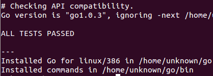

# 第2章：安装与运行环境

## 2.1 平台与架构

Go 语言开发团队开发了适用于以下操作系统的编译器：

- Linux
- FreeBSD
- Mac OS X（也称为 Darwin）

目前有2个版本的编译器：Go 原生编译器 `gc` 和非原生编译器 `gccgo`，这两款编译器都是在类 Unix 系统下工作 。其中，`gc` 版本的编译器已经被移植到 Windows 平台上，并集成在主要发行版中，你也可以通过安装 MinGW 从而在 Windows 平台下使用 `gcc` 编译器。这两个编译器都是以单通道的形式工作。

你可以获取以下平台上的 Go 1.4 源码和二进制文件：

- Linux 2.6+：amd64、386 和 arm 架构
- Mac OS X（Snow Leopard + Lion）：amd64 和 386 架构
- Windows 2000+：amd64 和 386 架构

对于非常底层的纯 Go 语言代码或者包而言，在各个操作系统平台上的可移植性是非常强的，只需要将源码拷贝到相应平台上进行编译即可，或者可以使用交叉编译来构建目标平台的应用程序（第 2.2 节）。但如果你打算使用 `cgo` 或者类似文件监控系统的软件，就需要根据实际情况进行相应地修改了。

### 2.1.1 Go 原生编译器 `gc`：

主要基于 Ken Thompson 先前在 Plan 9 操作系统上使用的 C 工具链。

Go 语言的编译器和链接器都是使用 C 语言编写并产生本地代码，Go 不存在自我引导之类的功能。因此如果使用一个有不同指令集的编译器来构建 Go 程序，就需要针对操作系统和处理器架构（32 位操作系统或 64 位操作系统）进行区别对待。（ **译者注：Go从1.5版本开始已经实现自举。Go语言的编译器和链接器都是Go语言编写的**）

这款编译器使用非分代、无压缩和并行的方式进行编译，它的编译速度要比 `gccgo` 更快，产生更好的本地代码，但编译后的程序不能够使用 `gcc` 进行链接。

编译器目前支持以下基于 Intel 或 AMD 处理器架构的程序构建。


图2.1 `gc` 编译器支持的处理器架构

当你第一次看到这套命名系统的时候你会觉得很奇葩，不过这些命名都是来自于 Plan 9 项目。

* g = 编译器：将源代码编译为项目代码（程序文本）
* l = 链接器：将项目代码链接到可执行的二进制文件（机器代码）

（相关的 C 编译器名称为 6c、8c 和 5c，相关的汇编器名称为 6a、8a 和 5a）

**标记（Flags）** 是指可以通过命令行设置可选参数来影响编译器或链接器的构建过程或得到一个特殊的目标结果。

可用的编译器标记如下：

```go
flags:
   	-I 针对包的目录搜索
   	-d 打印声明信息
   	-e 不限制错误打印的个数
   	-f 打印栈结构
   	-h 发生错误时进入恐慌（panic）状态
   	-o 指定输出文件名 // 详见第3.4节
   	-S 打印产生的汇编代码
   	-V 打印编译器版本 // 详见第2.3节
   	-u 禁止使用 unsafe 包中的代码
   	-w 打印归类后的语法解析树
   	-x 打印 lex tokens
```

从 Go 1.0.3 版本开始，不再使用 `8g`，`8l` 之类的指令进行程序的构建，取而代之的是统一的 `go build` 和 `go install` 等命令，而这些指令会自动调用相关的编译器或链接器。

如果你想获得更深层次的信息，你可以在目录 [`$GOROOT/src/cmd`](https://github.com/golang/go/tree/master/src/cmd) 下找到编译器和链接器的源代码。Go 语言本身是由 C 语言开发的，而不是 Go 语言（Go 1.5 开始自举）。词法分析程序是 GNU bison，语法分析程序是名为 [`$GOROOT/src/cmd/gc/go.y`](https://github.com/golang/go/blob/master/src%2Fcmd%2Finternal%2Fgc%2Fgo.y) 的 `yacc` 文件，它会在同一目录输出 `y.tab.{c,h}` 文件。如果你想知道更多有关构建过程的信息，你可以在 [`$GOROOT/src/make.bash`](https://github.com/golang/go/blob/master/src/make.bash) 中找到。

大部分的目录都包含了名为 `doc.go` 的文件，这个文件提供了更多详细的信息。

### 2.1.2 gccgo 编译器：

一款相对于 `gc` 而言更加传统的编译器，使用 GCC 作为后端。GCC 是一款非常流行的 GNU 编译器，它能够构建基于众多处理器架构的应用程序。编译速度相对 `gc` 较慢，但产生的本地代码运行要稍微快一点。它同时也提供一些与 C 语言之间的互操作性。

从 Go 1 版本开始，`gc` 和 `gccgo` 在编译方面都有等价的功能。

### 2.1.3 文件扩展名与包（package）：

Go 语言源文件的扩展名很显然就是 `.go`。

C 文件使用后缀名 `.c`，汇编文件使用后缀名 `.s`。所有的源代码文件都是通过包（`packages`）来组织。包含可执行代码的包文件在被压缩后使用扩展名 `.a`（AR 文档）。

Go 语言的标准库（第 9.1 节）包文件在被安装后就是使用这种格式的文件。

**注意** 当你在创建目录时，文件夹名称永远不应该包含空格，而应该使用下划线 "`_`" 或者其它一般符号代替。

## 2.2 Go 环境变量

Go 开发环境依赖于一些操作系统环境变量，你最好在安装 Go 之前就已经设置好他们。如果你使用的是 Windows 的话，你完全不用进行手动设置，Go 将被默认安装在目录 `c:/go` 下。这里列举几个最为重要的环境变量：

- **$GOROOT** 表示 Go 在你的电脑上的安装位置，它的值一般都是 `$HOME/go`，当然，你也可以安装在别的地方。
- **$GOARCH** 表示目标机器的处理器架构，它的值可以是 386、amd64 或 arm。
- **$GOOS** 表示目标机器的操作系统，它的值可以是 `darwin`、`freebsd`、`linux` 或 `windows`。
- **$GOBIN** 表示编译器和链接器的安装位置，默认是 `$GOROOT/bin`，如果你使用的是 Go 1.0.3 及以后的版本，一般情况下你可以将它的值设置为空，Go 将会使用前面提到的默认值。

目标机器是指你打算运行你的 Go 应用程序的机器。

Go 编译器支持交叉编译，也就是说你可以在一台机器上构建运行在具有不同操作系统和处理器架构上运行的应用程序，也就是说编写源代码的机器可以和目标机器有完全不同的特性（操作系统与处理器架构）。

为了区分本地机器和目标机器，你可以使用 `$GOHOSTOS` 和 `$GOHOSTARCH` 设置本地机器的操作系统名称和编译体系结构，这两个变量只有在进行交叉编译的时候才会用到，如果你不进行显示设置，他们的值会和本地机器（`$GOOS` 和 `$GOARCH`）一样。

- **$GOPATH** 默认采用和 `$GOROOT` 一样的值，但从 Go 1.1 版本开始，你必须修改为其它路径。它可以包含多个 Go 语言源码文件、包文件和可执行文件的路径，而这些路径下又必须分别包含三个规定的目录：`src`、`pkg` 和 `bin`，这三个目录分别用于存放源码文件、包文件和可执行文件。
- **$GOARM** 专门针对基于 arm 架构的处理器，它的值可以是 5 或 6，默认为 6。
- **$GOMAXPROCS** 用于设置应用程序可使用的处理器个数与核数，详见第 14.1.3 节。

在接下来的章节中，我们将会讨论如何在 Linux、Mac OS X 和 Windows 上安装 Go 语言。在 FreeBSD 上的安装和 Linux 非常类似。开发团队正在尝试将 Go 语言移植到其它例如 OpenBSD、DragonFlyBSD、NetBSD、Plan 9、Haiku 和 Solaris 操作系统上，你可以在这个页面找到最近的动态：[Go Porting Efforts](http://go-lang.cat-v.org/os-ports)。

## 2.3 在 Linux 上安装 Go

如果你能够自己下载并编译 Go 的源代码的话,对你来说是非常有教育意义的，你可以根据这个页面找到安装指南和下载地址：[Download the Go distribution](http://golang.org/doc/install)。

我们接下来也会带你一步步地完成安装过程。

1. 设置 Go 环境变量

   我们在 Linux 系统下一般通过文件 `$HOME/.bashrc` 配置自定义环境变量，根据不同的发行版也可能是文件 `$HOME/.profile`，然后使用 gedit 或 vi 来编辑文件内容。

   	export GOROOT=$HOME/go

   为了确保相关文件在文件系统的任何地方都能被调用，你还需要添加以下内容：

   	export PATH=$PATH:$GOROOT/bin

   在开发 Go 项目时，你还需要一个环境变量来保存你的工作目录。

   	export GOPATH=$HOME/Applications/Go

   `$GOPATH` 可以包含多个工作目录，取决于你的个人情况。如果你设置了多个工作目录，那么当你在之后使用 `go get`（远程包安装命令）时远程包将会被安装在第一个目录下。

   在完成这些设置后，你需要在终端输入指令 `source .bashrc` 以使这些环境变量生效。然后重启终端，输入 `go env` 和 `env` 来检查环境变量是否设置正确。

2. 安装 C 工具

   Go 的工具链是用 C 语言编写的，因此在安装 Go 之前你需要先安装相关的 C 工具。如果你使用的是 Ubuntu 的话，你可以在终端输入以下指令（ **译者注：由于网络环境的特殊性，你可能需要将每个工具分开安装** ）。

   	sudo apt-get install bison ed gawk gcc libc6-dev make

   你可以在其它发行版上使用 RPM 之类的工具。

3. 获取 Go 源代码

   从 [官方页面](https://golang.org/dl/) 或 [国内镜像](http://www.golangtc.com/download) 下载 Go 的源码包到你的计算机上，然后将解压后的目录 `go` 通过命令移动到 `$GOROOT` 所指向的位置。

   	wget https://storage.googleapis.com/golang/go<VERSION>.src.tar.gz
   	tar -zxvf go<VERSION>.src.tar.gz
   	sudo mv go $GOROOT

4. 构建 Go

   在终端使用以下指令来进行编译工作。

   	cd $GOROOT/src
   	./all.bash

   在完成编译之后（通常在 1 分钟以内，如果你在 B 型树莓派上编译，一般需要 1 个小时），你会在终端看到如下信息被打印：

   

   图 2.3 完成编译后在终端打印的信息

   **注意事项** 

   在测试 `net/http` 包时有一个测试会尝试连接 `google.com`，你可能会看到如下所示的一个无厘头的错误报告：

   	‘make[2]: Leaving directory `/localusr/go/src/pkg/net’

   如果你正在使用一个带有防火墙的机器，我建议你可以在编译过程中暂时关闭防火墙，以避免不必要的错误。

   解决这个问题的另一个办法是通过设置环境变量 `$DISABLE_NET_TESTS` 来告诉构建工具忽略 `net/http` 包的相关测试：

   	export DISABLE_NET_TESTS=1

   如果你完全不想运行包的测试，你可以直接运行 `./make.bash` 来进行单纯的构建过程。

5. 测试安装

   使用你最喜爱的编辑器来输入以下内容，并保存为文件名 `hello_world1.go`。

   示例 2.1 [hello_world1.go](examples/chapter_2/hello_world1.go)

   ```go
   package main
   
   func main() {
   	println("Hello", "world")
   }
   ```

   切换相关目录到下，然后执行指令 `go run hello_world1.go`，将会打印信息：`Hello, world`。

6. 验证安装版本

   你可以通过在终端输入指令 `go version` 来打印 Go 的版本信息。

   如果你想要通过 Go 代码在运行时检测版本，可以通过以下例子实现。

   示例 2.2 [version.go](examples/chapter_2/version.go)

   ```go
   package main
   
   import (
   	"fmt"
   	"runtime"
   )
   
   func main() {
   	fmt.Printf("%s", runtime.Version())
   }
   ```

   这段代码将会输出 `go1.4.2` 或类似字符串。

7. 更新版本

   你可以在 [发布历史](http://golang.org/doc/devel/release.html) 页面查看到最新的稳定版。

   当前最新的稳定版 Go 1 系列于 2012 年 3 月 28 日发布。

   Go 的源代码有以下三个分支：

   	- Go release：最新稳定版，实际开发最佳选择
   	- Go weekly：包含最近更新的版本，一般每周更新一次
   	- Go tip：永远保持最新的版本，相当于内测版

   当你在使用不同的版本时，注意官方博客发布的信息，因为你所查阅的文档可能和你正在使用的版本不相符。

## 2.4 在 Mac OS X 上安装 Go

如果你想要在你的 Mac 系统上安装 Go，则必须使用 Intel 64 位处理器，Go 不支持 PowerPC 处理器。

你可以通过该页面查看有关在 PowerPC 处理器上的移植进度：[https://codedr-go-ppc.googlecode.com/hg/](https://codedr-go-ppc.googlecode.com/hg/)。

**注意事项**

在 Mac 系统下使用到的 C 工具链是 `Xcode` 的一部分，因此你需要通过安装 `Xcode` 来完成这些工具的安装。你并不需要安装完整的 `Xcode`，而只需要安装它的命令行工具部分。

你可以在 [下载页面](http://golang.org/dl/) 页面下载到 Mac 系统下的一键安装包或源代码自行编译。

通过源代码编译安装的过程与环境变量的配置与在 Linux 系统非常相似，因此不再赘述。

## 2.5 在 Windows 上安装 Go

你可以在 [下载页面](http://golang.org/dl/) 页面下载到 Windows 系统下的一键安装包。

前期的 Windows 移植工作由 Hector Chu 完成，但目前的发行版已经由 Joe Poirier 全职维护。

在完成安装包的安装之后，你只需要配置 `$GOPATH` 这一个环境变量就可以开始使用 Go 语言进行开发了，其它的环境变量安装包均会进行自动设置。在默认情况下，Go 将会被安装在目录 `c:\go` 下，但如果你在安装过程中修改安装目录，则可能需要手动修改所有的环境变量的值。

如果你想要测试安装，则可以使用指令 `go run` 运行 [hello_world1.go](examples/chapter_2/hello_world1.go)。

如果发生错误 `fatal error: can’t find import: fmt` 则说明你的环境变量没有配置正确。

如果你想要在 Windows 下使用 `cgo` （调用 C 语言写的代码），则需要安装 [MinGW](http://sourceforge.net/projects/mingw/files/Automated%20MinGW%20Installer/)，一般推荐安装 [TDM-GCC](http://tdm-gcc.tdragon.net/)。如果你使用的是 64 位操作系统，请务必安装 64 位版本的 MinGW。安装完成进行环境变量等相关配置即可使用。

**在 Windows 下运行在虚拟机里的 Linux 系统上安装 Go**：

如果你想要在 Windows 下的虚拟机里的 Linux 系统上安装 Go，你可以选择使用虚拟机软件 [VMware](http://www.vmware.com)，下载 [VMware player](http://www.vmware.com/products/player/)，搜索并下载一个你喜欢的 Linux 发行版镜像，然后安装到虚拟机里，安装 Go 的流程参考第 2.3 节中的内容。

## 2.6 安装目录清单

你的 Go 安装目录（`$GOROOT`）的文件夹结构应该如下所示：

README.md, AUTHORS, CONTRIBUTORS, LICENSE

- `/bin`：包含可执行文件，如：编译器，Go 工具
- `/doc`：包含示例程序，代码工具，本地文档等
- `/lib`：包含文档模版
- `/misc`：包含与支持 Go 编辑器有关的配置文件以及 `cgo` 的示例
- `/os_arch`：包含标准库的包的对象文件（`.a`）
- `/src`：包含源代码构建脚本和标准库的包的完整源代码（Go 是一门开源语言）
- `/src/cmd`：包含 Go 和 C 的编译器和命令行脚本


## 2.7 Go 运行时（runtime）

尽管 Go 编译器产生的是本地可执行代码，这些代码仍旧运行在 Go 的 runtime（这部分的代码可以在 runtime 包中找到）当中。这个 runtime 类似 Java 和 .NET 语言所用到的虚拟机，它负责管理包括内存分配、垃圾回收（第 10.8 节）、栈处理、goroutine、channel、切片（slice）、map 和反射（reflection）等等。

runtime 主要由 C 语言编写（Go 1.5 开始自举），并且是每个 Go 包的最顶级包。你可以在目录 [`$GOROOT/src/runtime`](https://github.com/golang/go/tree/master/src/runtime) 中找到相关内容。

**垃圾回收器** Go 拥有简单却高效的标记-清除回收器。它的主要思想来源于 IBM 的可复用垃圾回收器，旨在打造一个高效、低延迟的并发回收器。目前 `gccgo` 还没有回收器，同时适用 `gc` 和 `gccgo` 的新回收器正在研发中。使用一门具有垃圾回收功能的编程语言不代表你可以避免内存分配所带来的问题，分配和回收内容都是消耗 CPU 资源的一种行为。

Go 的可执行文件都比相对应的源代码文件要大很多，这恰恰说明了 Go 的 runtime 嵌入到了每一个可执行文件当中。当然，在部署到数量巨大的集群时，较大的文件体积也是比较头疼的问题。但总的来说，Go 的部署工作还是要比 Java 和 Python 轻松得多。因为 Go 不需要依赖任何其它文件，它只需要一个单独的静态文件，这样你也不会像使用其它语言一样在各种不同版本的依赖文件之间混淆。

## 2.8 Go 解释器

因为 Go 具有像动态语言那样快速编译的能力，自然而然地就有人会问 Go 语言能否在 REPL（read-eval-print loop）编程环境下实现。Sebastien Binet 已经使用这种环境实现了一个 Go 解释器，你可以在这个页面找到：[https://github.com/sbinet/igo](https://github.com/sbinet/igo)。
