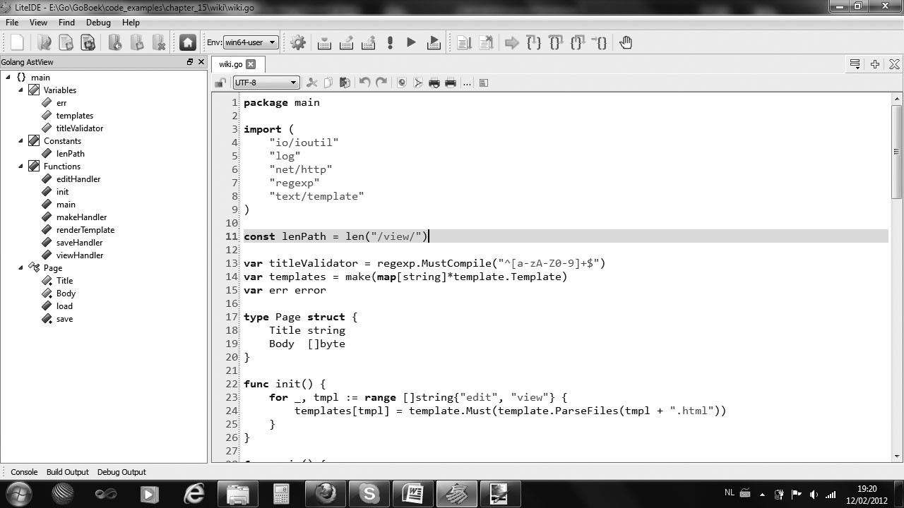
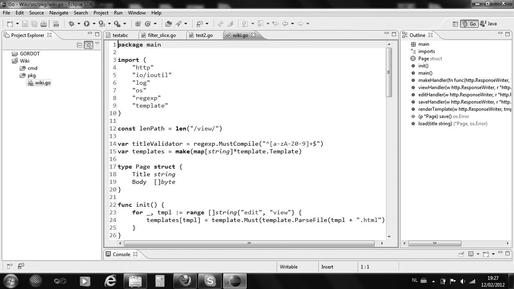

# 第3章：编辑器、集成开发环境与其它工具

因为 Go 语言还是一门相对年轻的编程语言，所以不管是在集成开发环境（IDE）还是相关的插件方面，发展都不是很成熟。不过目前还是有一些 IDE 能够较好地支持 Go 的开发，有些开发工具甚至是跨平台的，你可以在 Linux、Mac OS X 或者 Windows 下工作。

你可以通过查阅 [编辑器和 IDE 扩展](http://go-lang.cat-v.org/text-editors/) 页面来获取 Go 开发工具的最新信息。

## 3.1 Go 开发环境的基本要求

这里有一个可以用来开发 Go 的集成开发环境，你期待有以下哪些特性，从而替代你使用文本编辑器写代码和命令行编译与链接程序的方式？

1. 语法高亮是必不可少的功能，这也是每个开发工具都提供配置文件来实现自定义配置的原因。
2. 可以自动保存代码，至少在每次编译前都会保存。
3. 可以显示代码所在的行数。
4. 拥有较好的项目文件纵览和导航能力，可以同时编辑多个源文件并设置书签，能够匹配括号，能够跳转到某个函数或类型的定义部分。
5. 完美的查找和替换功能，替换之前最好还能预览结果。
6. 可以注释或取消注释选中的一行或多行代码。
7. 当有编译错误时，双击错误提示可以跳转到发生错误的位置。
8. 跨平台，能够在 Linux、Mac OS X 和 Windows 下工作，这样就可以专注于一个开发环境。
9. 最好是免费的，不过有些开发者还是希望能够通过支付一定金额以获得更好的开发环境。
10. 最好是开源的。
11. 能够通过插件架构来轻易扩展和替换某个功能。
12. 尽管集成开发环境本身就是非常复杂的，但一定要让人感觉操作方便。
13. 能够通过代码模版来简化编码过程从而提升编码速度。
14. 使用 Go 项目的概念来浏览和管理项目中的文件，同时还要拥有构建系统的概念，这样才能更加方便的构建、清理或运行我们建立的程序或项目。构建出的程序需要能够通过命令行或 IDE 内部的控制台运行。
15. 拥有断点、检查变量值、单步执行、逐过程执行标识库中代码的能力。
16. 能够方便的存取最近使用过的文件或项目。
17. 拥有对包、类型、变量、函数和方法的智能代码补全的功能。
18. 能够对项目或包中的代码建立抽象语法树视图（AST-view）。
19. 内置 Go 的相关工具。
20. 能够方便完整地查阅 Go 文档。
21. 能够方便地在不同的 Go 环境之间切换。
22. 能够导出不同格式的代码文件，如：PDF，HTML 或格式化后的代码。
23. 针对一些特定的项目有项目模板，如：Web 应用，App Engine 项目，从而能够更快地开始开发工作。
24. 具备代码重构的能力。
25. 集成像 hg 或 git 这样的版本控制工具。
26. 集成 Google App Engine 开发及调试的功能。

## 3.2 编辑器和集成开发环境

这些编辑器包含了代码高亮和其它与 Go 有关的一些使用工具：Emacs、Vim、Xcode 6、KD Kate、TextWrangler、BBEdit、McEdit、TextMate、TextPad、JEdit、SciTE、Nano、Notepad++、Geany、SlickEdit、IntelliJ IDEA 和 Sublime Text 2。

你可以将 Linux 的文本编辑器 GEdit 改造成一个很好的 Go 开发工具，详见页面：[http://gohelp.wordpress.com/](http://gohelp.wordpress.com/)。

**[Sublime Text](http://www.sublimetext.com)** 是一个革命性的跨平台（Linux、Mac OS X、Windows）文本编辑器，它支持编写非常多的编程语言代码。对于 Go 而言，它有一个插件叫做 [GoSublime](https://github.com/DisposaBoy/GoSublime) 来支持代码补全和代码模版。

这里还有一些更加高级的 Go 开发工具，其中一些是以插件的形式利用本身是作为开发 Java 的工具。

**[IntelliJ Idea Plugin](https://github.com/go-lang-plugin-org/go-lang-idea-plugin)** 是一个 IntelliJ IDEA 的插件，具有很好的操作体验和代码补全功能。

**[LiteIDE](https://github.com/visualfc/liteide)** 这是一款专门针对 Go 开发的集成开发环境，在编辑、编译和运行 Go 程序和项目方面都有非常好的支持。同时还包括了对源代码的抽象语法树视图和一些内置工具（此开发环境由国人 vfc 大叔开发）。

**[GoClipse](https://github.com/GoClipse/goclipse)** 是一款 Eclipse IDE 的插件，拥有非常多的特性以及通过 GoCode 来实现代码补全功能。

如果你对集成开发环境都不是很熟悉，那就使用 LiteIDE 吧，另外使用 GoClipse 或者 IntelliJ Idea Plugin 也是不错的选择。

**代码补全** 一般都是通过内置 GoCode 实现的（如：LieteIDE、GoClipse），如果需要手动安装 GoCode，在命令行输入指令 `go get -u github.com/nsf/gocode` 即可（务必事先配置好 Go 环境变量）。

接下来会对这三个集成开发环境做更加详细的说明。

### 3.2.1 LiteIDE

这款 IDE 的当前最新版本号为 X27，你可以从 [GitHub](https://github.com/visualfc/liteide) 页面获取详情。

LiteIDE 是一款非常好用的轻量级 Go 集成开发环境（基于 QT、Kate 和 SciTE），包含了跨平台开发及其它必要的特性，对代码编写、自动补全和运行调试都有极佳的支持。它采用了 Go 项目的概念来对项目文件进行浏览和管理，它还支持在各个 Go 开发环境之间随意切换以及交叉编译的功能。

同时，它具备了抽象语法树视图的功能，可以清楚地纵览项目中的常量、变量、函数、不同类型以及他们的属性和方法。



图 3.1 LiteIDE 代码编辑界面和抽象语法树视图

### 3.2.2 GoClipse

该款插件的当前最新版本号为 0.9.1，你可以从 [GitHub](https://github.com/GoClipse/goclipse) 页面获取详情。

其依附于著名的 Eclipse 这个大型开发环境，虽然需要安装 JVM 运行环境，但却可以很容易地享有 Eclipse 本身所具有的诸多功能。这是一个非常好的编辑器，完善的代码补全、抽象语法树视图、项目管理和程序调试功能。



图 3.2 GoClipse 代码编辑界面、抽象语法树视图和项目管理

## 3.3 调试器

应用程序的开发过程中调试是必不可少的一个环节，因此有一个好的调试器是非常重要的，可惜的是，Go 在这方面的发展还不是很完善。目前可用的调试器是 `gdb`，最新版均以内置在集成开发环境 LiteIDE 和 GoClipse 中，但是该调试器的调试方式并不灵活且操作难度较大。

如果你不想使用调试器，你可以按照下面的一些有用的方法来达到基本调试的目的：

1. 在合适的位置使用打印语句输出相关变量的值（`print`/`println` 和 `fmt.Print`/`fmt.Println`/`fmt.Printf`）。
2. 在 `fmt.Printf` 中使用下面的说明符来打印有关变量的相关信息：

   - `%+v` 打印包括字段在内的实例的完整信息
   - `%#v` 打印包括字段和限定类型名称在内的实例的完整信息
   - `%T` 打印某个类型的完整说明

3. 使用 panic 语句（第 13.2 节）来获取栈跟踪信息（直到 panic 时所有被调用函数的列表）。
4. 使用关键字 defer 来跟踪代码执行过程（第 6.4 节）。

## 3.4 构建并运行 Go 程序

在大多数 IDE 中，每次构建程序之前都会自动调用源码格式化工具 `gofmt` 并保存格式化后的源文件。如果构建成功则不会输出任何信息，而当发生编译时错误时，则会指明源码中具体第几行出现了什么错误，如：`a declared and not used`。一般情况下，你可以双击 IDE 中的错误信息直接跳转到发生错误的那一行。

如果程序执行一切顺利并成功退出后，将会在控制台输出 `Program exited with code 0`。

从 Go 1 版本开始，使用 Go 自带的更加方便的工具来构建应用程序：

- `go build` 编译自身包和依赖包
- `go install` 编译并安装自身包和依赖包

## 3.5 格式化代码

Go 开发团队不想要 Go 语言像许多其它语言那样总是在为代码风格而引发无休止的争论，浪费大量宝贵的开发时间，因此他们制作了一个工具：`go fmt`（`gofmt`）。这个工具可以将你的源代码格式化成符合官方统一标准的风格，属于语法风格层面上的小型重构。遵循统一的代码风格是 Go 开发中无可撼动的铁律，因此你必须在编译或提交版本管理系统之前使用 `gofmt` 来格式化你的代码。

尽管这种做法也存在一些争论，但使用 `gofmt` 后你不再需要自成一套代码风格而是和所有人使用相同的规则。这不仅增强了代码的可读性，而且在接手外部 Go 项目时，可以更快地了解其代码的含义。此外，大多数开发工具也都内置了这一功能。

Go 对于代码的缩进层级方面使用 tab 还是空格并没有强制规定，一个 tab 可以代表 4 个或 8 个空格。在实际开发中，1 个 tab 应该代表 4 个空格，而在本身的例子当中，每个 tab 代表 8 个空格。至于开发工具方面，一般都是直接使用 tab 而不替换成空格。

在命令行输入 `gofmt –w program.go` 会格式化该源文件的代码然后将格式化后的代码覆盖原始内容（如果不加参数 `-w` 则只会打印格式化后的结果而不重写文件）；`gofmt -w *.go` 会格式化并重写所有 Go 源文件；`gofmt map1` 会格式化并重写 map1 目录及其子目录下的所有 Go 源文件。

`gofmt` 也可以通过在参数 `-r` 后面加入用双引号括起来的替换规则实现代码的简单重构，规则的格式：`<原始内容> -> <替换内容>`。

实例：

	gofmt -r '(a) -> a' –w *.go

上面的代码会将源文件中没有意义的括号去掉。

	gofmt -r 'a[n:len(a)] -> a[n:]' –w *.go

上面的代码会将源文件中多余的 `len(a)` 去掉。（ **译者注：了解切片（slice）之后就明白这为什么是多余的了** ）

	gofmt –r 'A.Func1(a,b) -> A.Func2(b,a)' –w *.go

上面的代码会将源文件中符合条件的函数的参数调换位置。

如果想要了解有关 `gofmt` 的更多信息，请访问该页面：[http://golang.org/cmd/gofmt/](http://golang.org/cmd/gofmt/)。

## 3.6 生成代码文档

`go doc` 工具会从 Go 程序和包文件中提取顶级声明的首行注释以及每个对象的相关注释，并生成相关文档。

它也可以作为一个提供在线文档浏览的 web 服务器，[http://golang.org](http://golang.org) 就是通过这种形式实现的。

**一般用法**

- `go doc package` 获取包的文档注释，例如：`go doc fmt` 会显示使用 `godoc` 生成的 `fmt` 包的文档注释。
- `go doc package/subpackage` 获取子包的文档注释，例如：`go doc container/list`。
- `go doc package function` 获取某个函数在某个包中的文档注释，例如：`go doc fmt Printf` 会显示有关 `fmt.Printf()` 的使用说明。

这个工具只能获取在 Go 安装目录下 `../go/src` 中的注释内容。此外，它还可以作为一个本地文档浏览 web 服务器。在命令行输入 `godoc -http=:6060`，然后使用浏览器打开 [http://localhost:6060](http://localhost:6060) 后，你就可以看到本地文档浏览服务器提供的页面。

`godoc` 也可以用于生成非标准库的 Go 源码文件的文档注释（第 9.6 章）。

如果想要获取更多有关 `godoc` 的信息，请访问该页面：[http://golang.org/cmd/godoc/](http://golang.org/cmd/godoc/)（在线版的第三方包 `godoc` 可以使用 [Go Walker](https://gowalker.org)）。

## 3.7 其它工具

Go 自带的工具集主要使用脚本和 Go 语言自身编写的，目前版本的 Go 实现了以下三个工具：

- `go install` 是安装 Go 包的工具，类似 Ruby 中的 `rubygems`。主要用于安装非标准库的包文件，将源代码编译成对象文件。
- `go fix` 用于将你的 Go 代码从旧的发行版迁移到最新的发行版，它主要负责简单的、重复的、枯燥无味的修改工作，如果像 API 等复杂的函数修改，工具则会给出文件名和代码行数的提示以便让开发人员快速定位并升级代码。Go 开发团队一般也使用这个工具升级 Go 内置工具以及 谷歌内部项目的代码。`go fix` 之所以能够正常工作是因为 Go 在标准库就提供生成抽象语法树和通过抽象语法树对代码进行还原的功能。该工具会尝试更新当前目录下的所有 Go 源文件，并在完成代码更新后在控制台输出相关的文件名称。
- `go test` 是一个轻量级的单元测试框架（第 13 章）。

## 3.8 Go 性能说明

根据 Go 开发团队和基本的算法测试，Go 语言与 C 语言的性能差距大概在 10%~20% 之间（ **译者注：由于出版时间限制，该数据应为 2013 年 3 月 28 日之前产生** ）。虽然没有官方的性能标准，但是与其它各个语言相比已经拥有非常出色的表现。

如果说 Go 语言的执行效率大约比 C++ 慢 20% 也许更有实际意义。保守估计在相同的环境和执行目标的情况下，Go 程序比 Java 或 Scala 应用程序要快上 2 倍，并比这两门语言占用的内存降低了 70% 。在很多情况下这种比较是没有意义的，而像谷歌这样拥有成千上万台服务器的公司都抛弃 C++ 而开始将 Go 用于生产环境才足够说明它本身所具有的优势。

时下流行的语言大都是运行在虚拟机上，如：Java 和 Scala 使用的 JVM，C# 和 VB.NET 使用的 .NET CLR。尽管虚拟机的性能已经有了很大的提升，但任何使用 JIT 编译器和脚本语言解释器的编程语言（Ruby、Python、Perl 和 JavaScript）在 C 和 C++ 的绝对优势下甚至都无法在性能上望其项背。

如果说 Go 比 C++ 要慢 20%，那么 Go 就要比任何非静态和编译型语言快 2 到 10 倍，并且能够更加高效地使用内存。

其实比较多门语言之间的性能是一种非常猥琐的行为，因为任何一种语言都有其所擅长和薄弱的方面。例如在处理文本方面，那些只处理纯字节的语言显然要比处理 Unicode 这种更为复杂编码的语言要出色的多。有些人可能认为使用两种不同的语言实现同一个目标能够得出正确的结论，但是很多时候测试者可能对一门语言非常了解而对另一门语言只是大概明白，测试者对程序编写的手法在一定程度也会影响结果的公平性，因此测试程序应该分别由各自语言的擅长者来编写，这样才能得到具有可比性的结果。另外，像在统计学方面，人们很难避免人为因素对结果的影响，所以这在严格意义上并不是科学。还要注意的是，测试结果的可比性还要根据测试目标来区别，例如很多发展十多年的语言已经针对各类问题拥有非常成熟的类库，而作为一门新生语言的 Go 语言，并没有足够的时间来推导各类问题的最佳解决方案。如果你想获取更多有关性能的资料，请访问 [Computer Language Benchmark Game](http://shootout.alioth.debian.org/)（详见引用 27）。

这里有一些评测结果：

- 比较 Go 和 Python 在简单的 web 服务器方面的性能，单位为传输量每秒：

  原生的 Go http 包要比 web.py 快 7 至 8 倍，如果使用 web.go 框架则稍微差点，比 web.py 快 6 至 7 倍。在 Python 中被广泛使用的 tornado 异步服务器和框架在 web 环境下要比 web.py 快很多，Go 大概只比它快 1.2 至 1.5 倍（详见引用 26）。

- Go 和 Python 在一般开发的平均水平测试中，Go 要比 Python 3 快 25 倍左右，少占用三分之二的内存，但比 Python 大概多写一倍的代码（详见引用 27）。

- 根据 Robert Hundt（2011 年 6 月，详见引用 28）的文章对 C++、Java、Go 和 Scala，以及 Go 开发团队的反应（详见引用 29），可以得出以下结论：

  - Go 和 Scala 之间具有更多的可比性（都使用更少的代码），而 C++ 和 Java 都使用非常冗长的代码。
  - Go 的编译速度要比绝大多数语言都要快，比 Java 和 C++ 快 5 至 6 倍，比 Scala 快 10 倍。	
  - Go 的二进制文件体积是最大的（每个可执行文件都包含 runtime）。	
  - 在最理想的情况下，Go 能够和 C++ 一样快，比 Scala 快 2 至 3 倍，比 Java 快 5 至 10 倍。	
  - Go 在内存管理方面也可以和 C++ 相媲美，几乎只需要 Scala 所使用的一半，是Java的五分之一左右。

## 3.9 与其它语言进行交互

### 3.9.1 与 C 进行交互

工具 `cgo` 提供了对 FFI（外部函数接口）的支持，能够使用 Go 代码安全地调用 C 语言库，你可以访问 `cgo` 文档主页：[http://golang.org/cmd/cgo](http://golang.org/cmd/cgo)。`cgo` 会替代 Go 编译器来产生可以组合在同一个包中的 Go 和 C 代码。在实际开发中一般使用 `cgo` 创建单独的 C 代码包。

如果你想要在你的 Go 程序中使用 `cgo`，则必须在单独的一行使用 `import "C"` 来导入，一般来说你可能还需要 `import "unsafe"`。

然后，你可以在 `import "C"` 之前使用注释（单行或多行注释均可）的形式导入 C 语言库（甚至有效的 C 语言代码），它们之间没有空行，例如：

```c
// #include <stdio.h>
// #include <stdlib.h>
import "C"
```

名称 "C" 并不属于标准库的一部分，这只是 `cgo` 集成的一个特殊名称用于引用 C 的命名空间。在这个命名空间里所包含的 C 类型都可以被使用，例如 `C.uint`、`C.long` 等等，还有 `libc` 中的函数 `C.random()` 等也可以被调用。

当你想要使用某个类型作为 C 中函数的参数时，必须将其转换为 C 中的类型，反之亦然，例如：

```go
var i int
C.uint(i) 		// 从 Go 中的 int 转换为 C 中的无符号 int
int(C.random()) // 从 C 中 random() 函数返回的 long 转换为 Go 中的 int
```

下面的 2 个 Go 函数 `Random()` 和 `Seed()` 分别调用了 C 中的 `C.random()` 和 `C.srandom()`。

示例 3.2 [c1.go](examples/chapter_3/CandGo/c1.go)

```go
package rand

// #include <stdlib.h>
import "C"

func Random() int {
	return int(C.random())
}

func Seed(i int) {
	C.srandom(C.uint(i))
}
```

C 当中并没有明确的字符串类型，如果你想要将一个 string 类型的变量从 Go 转换到 C 时，可以使用 `C.CString(s)`；同样，可以使用 `C.GoString(cs)` 从 C 转换到 Go 中的 string 类型。

Go 的内存管理机制无法管理通过 C 代码分配的内存。

开发人员需要通过手动调用 `C.free` 来释放变量的内存：

```go
defer C.free(unsafe.Pointer(Cvariable))
```

这一行最好紧跟在使用 C 代码创建某个变量之后，这样就不会忘记释放内存了。下面的代码展示了如何使用 cgo 创建变量、使用并释放其内存：

示例 3.3 [c2.go](examples/chapter_3/CandGo/c2.go)

```go
package print

// #include <stdio.h>
// #include <stdlib.h>
import "C"
import "unsafe"

func Print(s string) {
	cs := C.CString(s)
	defer C.free(unsafe.Pointer(cs))
	C.fputs(cs, (*C.FILE)(C.stdout))
}
```

**构建 cgo 包**

你可以在使用将会在第 9.5 节讲到的 Makefile 文件（因为我们使用了一个独立的包），除了使用变量 GOFILES 之外，还需要使用变量 CGOFILES 来列出需要使用 `cgo` 编译的文件列表。例如，示例 3.2 中的代码就可以使用包含以下内容的 `Makefile` 文件来编译，你可以使用 `gomake` 或 `make`：

	include $(GOROOT)/src/Make.inc
	TARG=rand
	CGOFILES=\
	c1.go\
	include $(GOROOT)/src/Make.pkg

### 3.9.2 与 C++ 进行交互

SWIG（简化封装器和接口生成器）支持在 Linux 系统下使用 Go 代码调用 C 或者 C++ 代码。这里有一些使用 SWIG 的注意事项：

- 编写需要封装的库的 SWIG 接口。
- SWIG 会产生 C 的存根函数。
- 这些库可以使用 `cgo` 来调用。
- 相关的 Go 文件也可以被自动生成。

这类接口支持方法重载、多重继承以及使用 Go 代码实现 C++ 的抽象类。

目前使用 SWIG 存在的一个问题是它无法支持所有的 C++ 库，比如说它就无法解析 `TObject.h`。