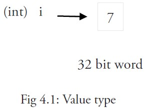
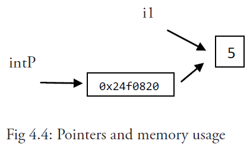
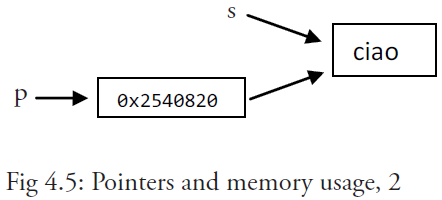

# 第4章：基本结构和基本数据类型

## 4.1 文件名、关键字与标识符

Go 的源文件以 `.go` 为后缀名存储在计算机中，这些文件名均由小写字母组成，如 `scanner.go` 。如果文件名由多个部分组成，则使用下划线 `_` 对它们进行分隔，如 `scanner_test.go` 。文件名不包含空格或其他特殊字符。

一个源文件可以包含任意多行的代码，Go 本身没有对源文件的大小进行限制。

你会发现在 Go 代码中的几乎所有东西都有一个名称或标识符。另外，Go 语言也是区分大小写的，这与 C 家族中的其它语言相同。有效的标识符必须以字母（可以使用任何 UTF-8 编码的字符或 `_`）开头，然后紧跟着 0 个或多个字符或 Unicode 数字，如：`X56`、`group1`、`_x23`、`i`、`өԑ12`。

以下是无效的标识符： 

- `1ab`（以数字开头）
- `case`（Go 语言的关键字）
- `a+b`（运算符是不允许的）

`_` 本身就是一个特殊的标识符，被称为空白标识符。它可以像其他标识符那样用于变量的声明或赋值（任何类型都可以赋值给它），但任何赋给这个标识符的值都将被抛弃，因此这些值不能在后续的代码中使用，也不可以使用这个标识符作为变量对其它变量进行赋值或运算。

在编码过程中，你可能会遇到没有名称的变量、类型或方法。虽然这不是必须的，但有时候这样做可以极大地增强代码的灵活性，这些变量被统称为匿名变量。

下面列举了 Go 代码中会使用到的 25 个关键字或保留字：

<table class="table table-bordered table-striped table-condensed">
  <tr>
    <td>break</td>
    <td>default</td>
    <td>func</td>
    <td>interface</td>
    <td>select</td>
  </tr>
  <tr>
    <td>case</td>
    <td>defer</td>
    <td>go</td>
    <td>map</td>
    <td>struct</td>
  </tr>
  <tr>
    <td>chan</td>
    <td>else</td>
    <td>goto</td>
    <td>package</td>
    <td>switch</td>
  </tr>
  <tr>
    <td>const</td>
    <td>fallthrough</td>
    <td>if</td>
    <td>range</td>
    <td>type</td>
  </tr>
  <tr>
    <td>continue</td>
    <td>for</td>
    <td>import</td>
    <td>return</td>
    <td>var</td>
  </tr>
</table>

之所以刻意地将 Go 代码中的关键字保持的这么少，是为了简化在编译过程第一步中的代码解析。和其它语言一样，关键字不能够作标识符使用。

除了以上介绍的这些关键字，Go 语言还有 36 个预定义标识符，其中包含了基本类型的名称和一些基本的内置函数（第 6.5 节），它们的作用都将在接下来的章节中进行进一步地讲解。

<table class="table table-bordered table-striped table-condensed">
  <tr>
    <td>append</td>
    <td>bool</td>
    <td>byte</td>
    <td>cap</td>
    <td>close</td>
    <td>complex</td>
    <td>complex64</td>
    <td>complex128</td>
    <td>uint16</td>
  </tr>
  <tr>
    <td>copy</td>
    <td>false</td>
    <td>float32</td>
    <td>float64</td>
    <td>imag</td>
    <td>int</td>
    <td>int8</td>
    <td>int16</td>
    <td>uint32</td>
  </tr>
  <tr>
    <td>int32</td>
    <td>int64</td>
    <td>iota</td>
    <td>len</td>
    <td>make</td>
    <td>new</td>
    <td>nil</td>
    <td>panic</td>
    <td>uint64</td>
  </tr>
  <tr>
    <td>print</td>
    <td>println</td>
    <td>real</td>
    <td>recover</td>
    <td>string</td>
    <td>true</td>
    <td>uint</td>
    <td>uint8</td>
    <td>uintptr</td>
  </tr>
</table>

程序一般由关键字、常量、变量、运算符、类型和函数组成。

程序中可能会使用到这些分隔符：括号 `()`，中括号 `[]` 和大括号 `{}`。

程序中可能会使用到这些标点符号：`.`、`,`、`;`、`:` 和 `…`。

程序的代码通过语句来实现结构化。每个语句不需要像 C 家族中的其它语言一样以分号 `;` 结尾，因为这些工作都将由 Go 编译器自动完成。

如果你打算将多个语句写在同一行，它们则必须使用 `;` 人为区分，但在实际开发中我们并不鼓励这种做法。

## 4.2 Go 程序的基本结构和要素

示例 4.1 [hello_world.go](examples/chapter_4/hello_world.go)

```go
package main

import "fmt"

func main() {
	fmt.Println("hello, world")
}
```

### 4.2.1 包的概念、导入与可见性

包是结构化代码的一种方式：每个程序都由包（通常简称为 `pkg`）的概念组成，可以使用自身的包或者从其它包中导入内容。

如同其它一些编程语言中的类库或命名空间的概念，每个 Go 文件都属于且仅属于一个包。一个包可以由许多以 `.go` 为扩展名的源文件组成，因此文件名和包名一般来说都是不相同的。

你必须在源文件中非注释的第一行指明这个文件属于哪个包，如：`package main`。`package main`表示一个可独立执行的程序，每个 Go 应用程序都包含一个名为 `main` 的包。

一个应用程序可以包含不同的包，而且即使你只使用 `main` 包也不必把所有的代码都写在一个巨大的文件里：你可以用一些较小的文件，并且在每个文件非注释的第一行都使用 `package main` 来指明这些文件都属于 `main` 包。如果你打算编译包名不是为 `main` 的源文件，如 `pack1`，编译后产生的对象文件将会是 `pack1.a` 而不是可执行程序。另外要注意的是，所有的包名都应该使用小写字母。

#### **标准库**

在 Go 的安装文件里包含了一些可以直接使用的包，即标准库。在 Windows 下，标准库的位置在 Go 根目录下的子目录 `pkg\windows_386` 中；在 Linux 下，标准库在 Go 根目录下的子目录 `pkg\linux_amd64` 中（如果是安装的是 32 位，则在 `linux_386` 目录中）。一般情况下，标准包会存放在 `$GOROOT/pkg/$GOOS_$GOARCH/` 目录下。

Go 的标准库包含了大量的包（如：`fmt` 和 `os`），但是你也可以创建自己的包（第 9 章）。

如果想要构建一个程序，则包和包内的文件都必须以正确的顺序进行编译。包的依赖关系决定了其构建顺序。

属于同一个包的源文件必须全部被一起编译，一个包即是编译时的一个单元，因此根据惯例，每个目录都只包含一个包。

**如果对一个包进行更改或重新编译，所有引用了这个包的客户端程序都必须全部重新编译。**

Go 中的包模型采用了显式依赖关系的机制来达到快速编译的目的，编译器会从后缀名为 `.o` 的对象文件（需要且只需要这个文件）中提取传递依赖类型的信息。

如果 `A.go` 依赖 `B.go`，而 `B.go` 又依赖 `C.go`：

- 编译 `C.go`, `B.go`, 然后是 `A.go`.
- 为了编译 `A.go`, 编译器读取的是 `B.o` 而不是 `C.o`.

这种机制对于编译大型的项目时可以显著地提升编译速度。

#### **每一段代码只会被编译一次**

一个 Go 程序是通过 `import` 关键字将一组包链接在一起。

`import "fmt"` 告诉 Go 编译器这个程序需要使用 `fmt` 包（的函数，或其他元素），`fmt` 包实现了格式化 `IO`（输入/输出）的函数。包名被封闭在半角双引号 `""` 中。如果你打算从已编译的包中导入并加载公开声明的方法，不需要插入已编译包的源代码。

如果需要多个包，它们可以被分别导入：

```go
import "fmt"
import "os"
```

或：

```go
import "fmt"; import "os"
```

但是还有更短且更优雅的方法（被称为因式分解关键字，该方法同样适用于 `const`、`var` 和 `type` 的声明或定义）：

```go
import (
   "fmt"
   "os"
)
```

它甚至还可以更短的形式，但使用 `gofmt` 后将会被强制换行：

```go
import ("fmt"; "os")
```

当你导入多个包时，最好按照字母顺序排列包名，这样做更加清晰易读。

如果包名不是以 `.` 或 `/` 开头，如 `"fmt"` 或者 `"container/list"`，则 Go 会在全局文件进行查找；如果包名以 `./` 开头，则 Go 会在相对目录中查找；如果包名以 `/` 开头（在 Windows 下也可以这样使用），则会在系统的绝对路径中查找。

> 译者注：以相对路径在GOPATH下导入包会产生报错信息
>
> *报错信息：local import "./XXX" in non-local package*
>
> *引用：[Go programs cannot use relative import paths within a work space.](https://golang.org/cmd/go/#hdr-Relative_import_paths )*
>
> *注解：在GOPATH外可以以相对路径的形式执行go build（go install 不可以）*

导入包即等同于包含了这个包的所有的代码对象。

除了符号 `_`，包中所有代码对象的标识符必须是唯一的，以避免名称冲突。但是相同的标识符可以在不同的包中使用，因为可以使用包名来区分它们。

包通过下面这个被编译器强制执行的规则来决定是否将自身的代码对象暴露给外部文件：

#### **可见性规则**

当标识符（包括常量、变量、类型、函数名、结构字段等等）以一个大写字母开头，如：`Group1`，那么使用这种形式的标识符的对象就可以被外部包的代码所使用（客户端程序需要先导入这个包），这被称为导出（像面向对象语言中的 `public`）；标识符如果以小写字母开头，则对包外是不可见的，但是他们在整个包的内部是可见并且可用的（像面向对象语言中的 `private` ）。

（大写字母可以使用任何 Unicode 编码的字符，比如希腊文，不仅仅是 ASCII 码中的大写字母）。

因此，在导入一个外部包后，能够且只能够访问该包中导出的对象。

假设在包 `pack1` 中我们有一个变量或函数叫做 `Thing`（以 T 开头，所以它能够被导出），那么在当前包中导入 `pack1` 包，`Thing` 就可以像面向对象语言那样使用点标记来调用：`pack1.Thing`（`pack1` 在这里是不可以省略的）。

因此包也可以作为命名空间使用，帮助避免命名冲突（名称冲突）：两个包中的同名变量的区别在于他们的包名，例如 `pack1.Thing` 和 `pack2.Thing`。

你可以通过使用包的别名来解决包名之间的名称冲突，或者说根据你的个人喜好对包名进行重新设置，如：`import fm "fmt"`。下面的代码展示了如何使用包的别名：

示例 4.2 [alias.go](examples/chapter_4/alias.go)

```go
package main

import fm "fmt" // alias3

func main() {
   fm.Println("hello, world")
}
```

> **注意事项** 
>
> 如果你导入了一个包却没有使用它，则会在构建程序时引发错误，如 `imported and not used: os`，这正是遵循了 Go 的格言：“没有不必要的代码！“。

**包的分级声明和初始化**

你可以在使用 `import` 导入包之后定义或声明 0 个或多个常量（`const`）、变量（`var`）和类型（`type`），这些对象的作用域都是全局的（在本包范围内），所以可以被本包中所有的函数调用（如 [gotemplate.go](examples/chapter_4/gotemplate.go) 源文件中的 c 和 v），然后声明一个或多个函数（`func`）。

### 4.2.2 函数

这是定义一个函数最简单的格式：

```go
func functionName()
```

你可以在括号 `()` 中写入 0 个或多个函数的参数（使用逗号 `,` 分隔），每个参数的名称后面必须紧跟着该参数的类型。

`main` 函数是每一个可执行程序所必须包含的，一般来说都是在启动后第一个执行的函数（如果有 `init()` 函数则会先执行该函数）。如果你的 `main` 包的源代码没有包含 `main` 函数，则会引发构建错误 `undefined: main.main`。`main` 函数既没有参数，也没有返回类型（与 C 家族中的其它语言恰好相反）。如果你不小心为 `main` 函数添加了参数或者返回类型，将会引发构建错误： 

```go
func main must have no arguments and no return values results.
```

在程序开始执行并完成初始化后，第一个调用（程序的入口点）的函数是 `main.main()`（如：C 语言），该函数一旦返回就表示程序已成功执行并立即退出。

函数里的代码（函数体）使用大括号 `{}` 括起来。

左大括号 `{` 必须与方法的声明放在同一行，这是编译器的强制规定，否则你在使用 `gofmt` 时就会出现错误提示：

	`build-error: syntax error: unexpected semicolon or newline before {`

（这是因为编译器会产生 `func main() ;` 这样的结果，很明显这错误的）

**Go 语言虽然看起来不使用分号作为语句的结束，但实际上这一过程是由编译器自动完成，因此才会引发像上面这样的错误**

右大括号 `}` 需要被放在紧接着函数体的下一行。如果你的函数非常简短，你也可以将它们放在同一行：

```go
func Sum(a, b int) int { return a + b }
```

对于大括号 `{}` 的使用规则在任何时候都是相同的（如：`if` 语句等）。

因此符合规范的函数一般写成如下的形式：

```go
func functionName(parameter_list) (return_value_list) {
   …
}
```

其中：

- `parameter_list` 的形式为 `(param1 type1, param2 type2, …)`
- `return_value_list` 的形式为 `(ret1 type1, ret2 type2, …)`

只有当某个函数需要被外部包调用的时候才使用大写字母开头，并遵循 Pascal 命名法；否则就遵循骆驼命名法，即第一个单词的首字母小写，其余单词的首字母大写。

下面这一行调用了 `fmt` 包中的 `Println` 函数，可以将字符串输出到控制台，并在最后自动增加换行字符 `\n`：

```go
fmt.Println（"hello, world"）
```

使用 `fmt.Print("hello, world\n")` 可以得到相同的结果。

`Print` 和 `Println` 这两个函数也支持使用变量，如：`fmt.Println(arr)`。如果没有特别指定，它们会以默认的打印格式将变量 `arr` 输出到控制台。

单纯地打印一个字符串或变量甚至可以使用预定义的方法来实现，如：`print`、`println：print("ABC")`、`println("ABC")`、`println(i)`（带一个变量 `i`）。

这些函数只可以用于调试阶段，在部署程序的时候务必将它们替换成 `fmt` 中的相关函数。

当被调用函数的代码执行到结束符 `}` 或返回语句时就会返回，然后程序继续执行调用该函数之后的代码。

程序正常退出的代码为 `0` 即 `Program exited with code 0`；如果程序因为异常而被终止，则会返回非零值，如：`1`。这个数值可以用来测试是否成功执行一个程序。

### 4.2.3 注释

示例 4.2 [hello_world2.go](examples/chapter_4/hello_world2.go)

```go
package main

import "fmt" // Package implementing formatted I/O.

func main() {
   fmt.Printf("Καλημέρα κόσμε; or こんにちは 世界\n")
}
```

上面这个例子通过打印 `Καλημέρα κόσμε; or こんにちは 世界` 展示了如何在 Go 中使用国际化字符，以及如何使用注释。

注释不会被编译，但可以通过 `godoc` 来使用（第 3.6 节）。

单行注释是最常见的注释形式，你可以在任何地方使用以 `//` 开头的单行注释。多行注释也叫块注释，均已以 `/*` 开头，并以 `*/` 结尾，且不可以嵌套使用，多行注释一般用于包的文档描述或注释成块的代码片段。

每一个包应该有相关注释，在 `package` 语句之前的块注释将被默认认为是这个包的文档说明，其中应该提供一些相关信息并对整体功能做简要的介绍。一个包可以分散在多个文件中，但是只需要在其中一个进行注释说明即可。当开发人员需要了解包的一些情况时，自然会用 `godoc` 来显示包的文档说明，在首行的简要注释之后可以用成段的注释来进行更详细的说明，而不必拥挤在一起。另外，在多段注释之间应以空行分隔加以区分。

示例：

```go
// Package superman implements methods for saving the world.
//
// Experience has shown that a small number of procedures can prove
// helpful when attempting to save the world.
package superman
```

几乎所有全局作用域的类型、常量、变量、函数和被导出的对象都应该有一个合理的注释。如果这种注释（称为文档注释）出现在函数前面，例如函数 `Abcd`，则要以 `"Abcd..."` 作为开头。

示例：

```go
// enterOrbit causes Superman to fly into low Earth orbit, a position
// that presents several possibilities for planet salvation.
func enterOrbit() error {
   ...
}
```

`godoc` 工具（第 3.6 节）会收集这些注释并产生一个技术文档。

### 4.2.4 类型

变量（或常量）包含数据，这些数据可以有不同的数据类型，简称类型。使用 `var` 声明的变量的值会自动初始化为该类型的零值。类型定义了某个变量的值的集合与可对其进行操作的集合。

类型可以是基本类型，如：`int`、`float`、`bool`、`string`；结构化的（复合的），如：`struct`、`array`、`slice`、`map`、`channel`；只描述类型的行为的，如：`interface`。

结构化的类型没有真正的值，它使用 `nil` 作为默认值（在 Objective-C 中是 `nil`，在 Java 中是 `null`，在 C 和 C++ 中是`NULL`或 `0`）。值得注意的是，Go 语言中不存在类型继承。

函数也可以是一个确定的类型，就是以函数作为返回类型。这种类型的声明要写在函数名和可选的参数列表之后，例如：

```go
func FunctionName (a typea, b typeb) typeFunc
```

你可以在函数体中的某处返回使用类型为 `typeFunc` 的变量 `var`：

```go
return var
```

一个函数可以拥有多返回值，返回类型之间需要使用逗号分割，并使用小括号 `()` 将它们括起来，如：

```go
func FunctionName (a typea, b typeb) (t1 type1, t2 type2)
```

示例： 函数 `Atoi` (第 4.7 节)：`func Atoi(s string) (i int, err error)`

返回的形式：

```go
return var1, var2
```

这种多返回值一般用于判断某个函数是否执行成功（`true`/`false`）或与其它返回值一同返回错误消息（详见之后的并行赋值）。

使用 `type` 关键字可以定义你自己的类型，你可能想要定义一个结构体(第 10 章)，但是也可以定义一个已经存在的类型的别名，如：

```go
type IZ int
```

**这里并不是真正意义上的别名，因为使用这种方法定义之后的类型可以拥有更多的特性，且在类型转换时必须显式转换。**

然后我们可以使用下面的方式声明变量：

```go
var a IZ = 5
```

这里我们可以看到 `int` 是变量 a 的底层类型，这也使得它们之间存在相互转换的可能（第 4.2.6 节）。

如果你有多个类型需要定义，可以使用因式分解关键字的方式，例如：

```go
type (
   IZ int
   FZ float64
   STR string
)
```

每个值都必须在经过编译后属于某个类型（编译器必须能够推断出所有值的类型），因为 Go 语言是一种静态类型语言。

### 4.2.5 Go 程序的一般结构

下面的程序可以被顺利编译但什么都做不了，不过这很好地展示了一个 Go 程序的首选结构。这种结构并没有被强制要求，编译器也不关心 `main` 函数在前还是变量的声明在前，但使用统一的结构能够在从上至下阅读 Go 代码时有更好的体验。

所有的结构将在这一章或接下来的章节中进一步地解释说明，但总体思路如下：

- 在完成包的 `import` 之后，开始对常量、变量和类型的定义或声明。
- 如果存在 `init` 函数的话，则对该函数进行定义（这是一个特殊的函数，每个含有该函数的包都会首先执行这个函数）。
- 如果当前包是 `main` 包，则定义 `main` 函数。
- 然后定义其余的函数，首先是类型的方法，接着是按照 `main` 函数中先后调用的顺序来定义相关函数，如果有很多函数，则可以按照字母顺序来进行排序。

示例 4.4 [gotemplate.go](examples/chapter_4/gotemplate.go)

```go
package main

import (
   "fmt"
)

const c = "C"

var v int = 5

type T struct{}

func init() { // initialization of package
}

func main() {
   var a int
   Func1()
   // ...
   fmt.Println(a)
}

func (t T) Method1() {
   //...
}

func Func1() { // exported function Func1
   //...
}
```

Go 程序的执行（程序启动）顺序如下：

1. 按顺序导入所有被 `main` 包引用的其它包，然后在每个包中执行如下流程：
2. 如果该包又导入了其它的包，则从第一步开始递归执行，但是每个包只会被导入一次。
3. 然后以相反的顺序在每个包中初始化常量和变量，如果该包含有 `init` 函数的话，则调用该函数。
4. 在完成这一切之后，`main` 也执行同样的过程，最后调用 `main` 函数开始执行程序。

### 4.2.6 类型转换

在必要以及可行的情况下，一个类型的值可以被转换成另一种类型的值。由于 Go 语言不存在隐式类型转换，因此所有的转换都必须显式说明，就像调用一个函数一样（类型在这里的作用可以看作是一种函数）：

```go
valueOfTypeB = typeB(valueOfTypeA)
```

**类型 B 的值 = 类型 B(类型 A 的值)**

示例： 

```go
a := 5.0
b := int(a)
```

但这只能在定义正确的情况下转换成功，例如从一个取值范围较小的类型转换到一个取值范围较大的类型（例如将 `int16` 转换为 `int32`）。当从一个取值范围较大的转换到取值范围较小的类型时（例如将 `int32` 转换为 `int16` 或将 `float32` 转换为 `int`），会发生精度丢失（截断）的情况。当编译器捕捉到非法的类型转换时会引发编译时错误，否则将引发运行时错误。

具有相同底层类型的变量之间可以相互转换：

```go
var a IZ = 5
c := int(a)
d := IZ(c)
```

### 4.2.7 Go 命名规范

干净、可读的代码和简洁性是 Go 追求的主要目标。通过 `gofmt` 来强制实现统一的代码风格。Go 语言中对象的命名也应该是简洁且有意义的。像 Java 和 Python 中那样使用混合着大小写和下划线的冗长的名称会严重降低代码的可读性。名称不需要指出自己所属的包，因为在调用的时候会使用包名作为限定符。返回某个对象的函数或方法的名称一般都是使用名词，没有 `Get...` 之类的字符，如果是用于修改某个对象，则使用 `SetName`。有必须要的话可以使用大小写混合的方式，如 `MixedCaps` 或 `mixedCaps`，而不是使用下划线来分割多个名称。

## 4.3 常量

常量使用关键字 `const` 定义，用于存储不会改变的数据。

存储在常量中的数据类型只可以是布尔型、数字型（整数型、浮点型和复数）和字符串型。

常量的定义格式：`const identifier [type] = value`，例如： 

```go
const Pi = 3.14159
```

在 Go 语言中，你可以省略类型说明符 `[type]`，因为编译器可以根据变量的值来推断其类型。

- 显式类型定义： `const b string = "abc"`
- 隐式类型定义： `const b = "abc"`

一个没有指定类型的常量被使用时，会根据其使用环境而推断出它所需要具备的类型。换句话说，未定义类型的常量会在必要时刻根据上下文来获得相关类型。

```go
var n int
f(n + 5) // 无类型的数字型常量 “5” 它的类型在这里变成了 int
```

常量的值必须是能够在编译时就能够确定的；你可以在其赋值表达式中涉及计算过程，但是所有用于计算的值必须在编译期间就能获得。

- 正确的做法：`const c1 = 2/3`  
- 错误的做法：`const c2 = getNumber()` // 引发构建错误: `getNumber() used as value`

**因为在编译期间自定义函数均属于未知，因此无法用于常量的赋值，但内置函数可以使用，如：`len()`。**

数字型的常量是没有大小和符号的，并且可以使用任何精度而不会导致溢出：

```go
const Ln2 = 0.693147180559945309417232121458\
			176568075500134360255254120680009
const Log2E = 1/Ln2 // this is a precise reciprocal
const Billion = 1e9 // float constant
const hardEight = (1 << 100) >> 97
```

根据上面的例子我们可以看到，反斜杠 `\` 可以在常量表达式中作为多行的连接符使用。

与各种类型的数字型变量相比，你无需担心常量之间的类型转换问题，因为它们都是非常理想的数字。

不过需要注意的是，当常量赋值给一个精度过小的数字型变量时，可能会因为无法正确表达常量所代表的数值而导致溢出，这会在编译期间就引发错误。另外，常量也允许使用并行赋值的形式：

```go
const beef, two, c = "eat", 2, "veg"
const Monday, Tuesday, Wednesday, Thursday, Friday, Saturday = 1, 2, 3, 4, 5, 6
const (
	Monday, Tuesday, Wednesday = 1, 2, 3
	Thursday, Friday, Saturday = 4, 5, 6
)
```

常量还可以用作枚举：

```go
const (
	Unknown = 0
	Female = 1
	Male = 2
)
```

现在，数字 `0`、`1` 和 `2` 分别代表未知性别、女性和男性。这些枚举值可以用于测试某个变量或常量的实际值，比如使用 `switch`/`case` 结构 (第 5.3 节).

在这个例子中，`iota` 可以被用作枚举值：

```go
const (
	a = iota
	b = iota
	c = iota
)
```

第一个 `iota` 等于 0，每当 `iota` 在新的一行被使用时，它的值都会自动加 1；所以 `a=0, b=1, c=2` 可以简写为如下形式：

```go
const (
	a = iota
	b
	c
)
```

> （ **译者注：关于 iota 的使用涉及到非常复杂多样的情况，这里作者解释的并不清晰，因为很难对 iota 的用法进行直观的文字描述。如希望进一步了解，请观看视频教程 [《Go编程基础》](https://github.com/Unknwon/go-fundamental-programming) [第四课：常量与运算符](https://github.com/Unknwon/go-fundamental-programming/blob/master/lectures/lecture4.md)** ）

`iota` 也可以用在表达式中，如：`iota + 50`。在每遇到一个新的常量块或单个常量声明时， `iota` 都会重置为 0（ **简单地讲，每遇到一次 `const` 关键字，iota 就重置为 0** ）。

当然，常量之所以为常量就是恒定不变的量，因此我们无法在程序运行过程中修改它的值；如果你在代码中试图修改常量的值则会引发编译错误。

引用 `time` 包中的一段代码作为示例：一周中每天的名称。

```go
const (
	Sunday = iota
	Monday
	Tuesday
	Wednesday
	Thursday
	Friday
	Saturday
)
```

你也可以使用某个类型作为枚举常量的类型：

```go
type Color int

const (
	RED Color = iota // 0
	ORANGE // 1
	YELLOW // 2
	GREEN // ..
	BLUE
	INDIGO
	VIOLET // 6
)
```

## 4.4 变量

### 4.4.1 简介

声明变量的一般形式是使用 `var` 关键字：`var identifier type`。

需要注意的是，Go 和许多编程语言不同，它在声明变量时将变量的类型放在变量的名称之后。Go 为什么要选择这么做呢？

首先，它是为了避免像 C 语言中那样含糊不清的声明形式，例如：`int* a, b;`。在这个例子中，只有 `a` 是指针而 `b` 不是。如果你想要这两个变量都是指针，则需要将它们分开书写（你可以在 [Go 语言的声明语法](http://blog.golang.org/2010/07/gos-declaration-syntax.html) 页面找到有关于这个话题的更多讨论）。

而在 Go 中，则可以很轻松地将它们都声明为指针类型：

```go
var a, b *int
```

其次，这种语法能够按照从左至右的顺序阅读，使得代码更加容易理解。

示例：

```go
var a int
var b bool
var str string
```

你也可以改写成这种形式：

```go
var (
	a int
	b bool
	str string
)
```

这种因式分解关键字的写法一般用于声明全局变量。

当一个变量被声明之后，系统自动赋予它该类型的零值：`int` 为 0，`float` 为 0.0，`bool` 为 false，`string` 为空字符串，指针为 `nil`。记住，所有的内存在 Go 中都是经过初始化的。

变量的命名规则遵循骆驼命名法，即首个单词小写，每个新单词的首字母大写，例如：`numShips` 和 `startDate`。

但如果你的全局变量希望能够被外部包所使用，则需要将首个单词的首字母也大写（第 4.2 节：可见性规则）。

一个变量（常量、类型或函数）在程序中都有一定的作用范围，称之为作用域。如果一个变量在函数体外声明，则被认为是全局变量，可以在整个包甚至外部包（被导出后）使用，不管你声明在哪个源文件里或在哪个源文件里调用该变量。

在函数体内声明的变量称之为局部变量，它们的作用域只在函数体内，参数和返回值变量也是局部变量。在第 5 章，我们将会学习到像 `if` 和 `for` 这些控制结构，而在这些结构中声明的变量的作用域只在相应的代码块内。一般情况下，局部变量的作用域可以通过代码块（用大括号括起来的部分）判断。

尽管变量的标识符必须是唯一的，但你可以在某个代码块的内层代码块中使用相同名称的变量，则此时外部的同名变量将会暂时隐藏（结束内部代码块的执行后隐藏的外部同名变量又会出现，而内部同名变量则被释放），你任何的操作都只会影响内部代码块的局部变量。

变量可以编译期间就被赋值，赋值给变量使用运算符等号 `=`，当然你也可以在运行时对变量进行赋值操作。

示例：

```go
a = 15
b = false
```

一般情况下，当变量`a`和变量`b`之间类型相同时，才能进行如`a = b`的赋值。

声明与赋值（初始化）语句也可以组合起来。

示例：

```go
var identifier [type] = value
var a int = 15
var i = 5
var b bool = false
var str string = "Go says hello to the world!"
```

但是 Go 编译器的智商已经高到可以根据变量的值来自动推断其类型，这有点像 Ruby 和 Python 这类动态语言，只不过它们是在运行时进行推断，而 Go 是在编译时就已经完成推断过程。因此，你还可以使用下面的这些形式来声明及初始化变量：

```go
var a = 15
var b = false
var str = "Go says hello to the world!"
```

或：

```go
var (
	a = 15
	b = false
	str = "Go says hello to the world!"
	numShips = 50
	city string
)
```

不过自动推断类型并不是任何时候都适用的，当你想要给变量的类型并不是自动推断出的某种类型时，你还是需要显式指定变量的类型，例如：

```go
var n int64 = 2
```

然而，`var a` 这种语法是不正确的，因为编译器没有任何可以用于自动推断类型的依据。变量的类型也可以在运行时实现自动推断，例如：

```go
var (
	HOME = os.Getenv("HOME")
	USER = os.Getenv("USER")
	GOROOT = os.Getenv("GOROOT")
)
```

这种写法主要用于声明包级别的全局变量，当你在函数体内声明局部变量时，应使用简短声明语法 `:=`，例如：

```go
a := 1
```

下面这个例子展示了如何通过`runtime`包在运行时获取所在的操作系统类型，以及如何通过 `os` 包中的函数 `os.Getenv()` 来获取环境变量中的值，并保存到 `string` 类型的局部变量 `path` 中。

示例 4.5 [goos.go](examples/chapter_4/goos.go)

```go
package main

import (
	"fmt"
   "runtime"
	"os"
)

func main() {
	var goos string = runtime.GOOS
	fmt.Printf("The operating system is: %s\n", goos)
	path := os.Getenv("PATH")
	fmt.Printf("Path is %s\n", path)
}
```

如果你在 Windows 下运行这段代码，则会输出 `The operating system is: windows` 以及相应的环境变量的值；如果你在 Linux 下运行这段代码，则会输出 `The operating system is: linux` 以及相应的的环境变量的值。

这里用到了 `Printf` 的格式化输出的功能（第 4.4.3 节）。

### 4.4.2 值类型和引用类型

程序中所用到的内存在计算机中使用一堆箱子来表示（这也是人们在讲解它的时候的画法），这些箱子被称为 “ 字 ”。根据不同的处理器以及操作系统类型，所有的字都具有 32 位（4 字节）或 64 位（8 字节）的相同长度；所有的字都使用相关的内存地址来进行表示（以十六进制数表示）。

所有像 `int`、`float`、`bool` 和 `string` 这些基本类型都属于值类型，使用这些类型的变量直接指向存在内存中的值：



另外，像数组（第 7 章）和结构（第 10 章）这些复合类型也是值类型。

当使用等号 `=` 将一个变量的值赋值给另一个变量时，如：`j = i`，实际上是在内存中将 `i` 的值进行了拷贝：


你可以通过 `&i` 来获取变量 `i` 的内存地址（第 4.9 节），例如：`0xf840000040`（每次的地址都可能不一样）。值类型的变量的值存储在栈中。

内存地址会根据机器的不同而有所不同，甚至相同的程序在不同的机器上执行后也会有不同的内存地址。因为每台机器可能有不同的存储器布局，并且位置分配也可能不同。

更复杂的数据通常会需要使用多个字，这些数据一般使用引用类型保存。

一个引用类型的变量 `r1` 存储的是 `r1` 的值所在的内存地址（数字），或内存地址中第一个字所在的位置。


这个内存地址被称之为指针（你可以从上图中很清晰地看到，第 4.9 节将会详细说明），这个指针实际上也被存在另外的某一个字中。

同一个引用类型的指针指向的多个字可以是在连续的内存地址中（内存布局是连续的），这也是计算效率最高的一种存储形式；也可以将这些字分散存放在内存中，每个字都指示了下一个字所在的内存地址。

当使用赋值语句 `r2 = r1` 时，只有引用（地址）被复制。

如果 `r1` 的值被改变了，那么这个值的所有引用都会指向被修改后的内容，在这个例子中，`r2` 也会受到影响。

在 Go 语言中，指针（第 4.9 节）属于引用类型，其它的引用类型还包括 `slices`（第 7 章），`maps`（第 8 章）和 `channel`（第 13 章）。被引用的变量会存储在堆中，以便进行垃圾回收，且比栈拥有更大的内存空间。

### 4.4.3 打印

函数 `Printf` 可以在 `fmt` 包外部使用，这是因为它以大写字母 P 开头，该函数主要用于打印输出到控制台。通常使用的格式化字符串作为第一个参数：

```go
func Printf(format string, list of variables to be printed)
```

在示例 4.5 中，格式化字符串为：`"The operating system is: %s\n"`。

这个格式化字符串可以含有一个或多个的格式化标识符，例如：`%..`，其中 `..` 可以被不同类型所对应的标识符替换，如 `%s` 代表字符串标识符、`%v` 代表使用类型的默认输出格式的标识符。这些标识符所对应的值从格式化字符串后的第一个逗号开始按照相同顺序添加，如果参数超过 1 个则同样需要使用逗号分隔。使用这些占位符可以很好地控制格式化输出的文本。

函数 `fmt.Sprintf` 与 `Printf` 的作用是完全相同的，不过前者将格式化后的字符串以返回值的形式返回给调用者，因此你可以在程序中使用包含变量的字符串，具体例子可以参见示例 15.4 [simple_tcp_server.go](examples/chapter_15/simple_tcp_server.go)。

函数 `fmt.Print` 和 `fmt.Println` 会自动使用格式化标识符 `%v` 对字符串进行格式化，两者都会在每个参数之间自动增加空格，而后者还会在字符串的最后加上一个换行符。例如：

```go
fmt.Print("Hello:", 23)
```

将输出：`Hello: 23`。

### 4.4.4 简短形式，使用 := 赋值操作符

我们知道可以在变量的初始化时省略变量的类型而由系统自动推断，而这个时候再在 Example 4.4.1 的最后一个声明语句写上 `var` 关键字就显得有些多余了，因此我们可以将它们简写为 `a := 50` 或 `b := false`。

`a` 和 `b` 的类型（`int` 和 `bool`）将由编译器自动推断。

这是使用变量的首选形式，但是它只能被用在函数体内，而不可以用于全局变量的声明与赋值。使用操作符 `:=` 可以高效地创建一个新的变量，称之为初始化声明。

**注意事项**

如果在相同的代码块中，我们不可以再次对于相同名称的变量使用初始化声明，例如：`a := 20` 就是不被允许的，编译器会提示错误 `no new variables on left side of :=`，但是 `a = 20` 是可以的，因为这是给相同的变量赋予一个新的值。

如果你在定义变量 `a` 之前使用它，则会得到编译错误 `undefined: a`。

如果你声明了一个局部变量却没有在相同的代码块中使用它，同样会得到编译错误，例如下面这个例子当中的变量 `a`：

```go
func main() {
   var a string = "abc"
   fmt.Println("hello, world")
}
```

尝试编译这段代码将得到错误 `a declared and not used`。

此外，单纯地给 `a` 赋值也是不够的，这个值必须被使用，所以使用 `fmt.Println("hello, world", a)` 会移除错误。

但是全局变量是允许声明但不使用。

其他的简短形式为：

同一类型的多个变量可以声明在同一行，如：

```go
var a, b, c int
```

(这是将类型写在标识符后面的一个重要原因)

多变量可以在同一行进行赋值，如：

```go
a, b, c = 5, 7, "abc"
```

上面这行假设了变量 `a`，`b` 和 `c` 都已经被声明，否则的话应该这样使用：

```go
a, b, c := 5, 7, "abc"
```

右边的这些值以相同的顺序赋值给左边的变量，所以 a 的值是 `5`， b 的值是 `7`，c 的值是 `"abc"`。

这被称为 **并行** 或 **同时** 赋值。

如果你想要交换两个变量的值，则可以简单地使用 `a, b = b, a`。

(在 Go 语言中，这样省去了使用交换函数的必要)

空白标识符 `_` 也被用于抛弃值，如值 `5` 在：`_, b = 5, 7` 中被抛弃。

`_` 实际上是一个只写变量，你不能得到它的值。这样做是因为 Go 语言中你必须使用所有被声明的变量，但有时你并不需要使用从一个函数得到的所有返回值。

并行赋值也被用于当一个函数返回多个返回值时，比如这里的 `val` 和错误 `err` 是通过调用 `Func1` 函数同时得到：`val, err = Func1(var1)`。

### 4.4.5 init 函数

变量除了可以在全局声明中初始化，也可以在 `init` 函数中初始化。这是一类非常特殊的函数，它不能够被人为调用，而是在每个包完成初始化后自动执行，并且执行优先级比 `main` 函数高。

每个源文件都只能包含一个 `init` 函数。初始化总是以单线程执行，并且按照包的依赖关系顺序执行。

一个可能的用途是在开始执行程序之前对数据进行检验或修复，以保证程序状态的正确性。

示例 4.6 [init.go](examples/chapter_4/init.go):

```go
package trans

import "math"

var Pi float64

func init() {
   Pi = 4 * math.Atan(1) // init() function computes Pi
}
```

在它的 `init` 函数中计算变量 Pi 的初始值。

示例 4.7 [user_init.go](examples/chapter_4/user_init.go) 中导入了包 trans（需要`init.go`目录为`./trans/init.go`）并且使用到了变量 Pi：

```go
package main

import (
   "fmt"
   "./trans"
)

var twoPi = 2 * trans.Pi

func main() {
   fmt.Printf("2*Pi = %g\n", twoPi) // 2*Pi = 6.283185307179586
}
```

`init` 函数也经常被用在当一个程序开始之前调用后台执行的 `goroutine`，如下面这个例子当中的 `backend()`：

```go
func init() {
   // setup preparations
   go backend()
}
```

**练习** 推断以下程序的输出，并解释你的答案，然后编译并执行它们。

练习 4.1 [local_scope.go](examples/chapter_4/local_scope.go):

```go
package main

var a = "G"

func main() {
   n()
   m()
   n()
}

func n() { print(a) }

func m() {
   a := "O"
   print(a)
}
```

练习 4.2 [global_scope.go](examples/chapter_4/global_scope.go):

```go
package main

var a = "G"

func main() {
   n()
   m()
   n()
}

func n() {
   print(a)
}

func m() {
   a = "O"
   print(a)
}
```

练习 4.3 [function_calls_function.go](examples/chapter_4/function_calls_function.go)

```go
package main

var a string

func main() {
   a = "G"
   print(a)
   f1()
}

func f1() {
   a := "O"
   print(a)
   f2()
}

func f2() {
   print(a)
}
```

## 4.5 基本类型和运算符

我们将在这个部分讲解有关布尔型、数字型和字符型的相关知识。

表达式是一种特定的类型的值，它可以由其它的值以及运算符组合而成。每个类型都定义了可以和自己结合的运算符集合，如果你使用了不在这个集合中的运算符，则会在编译时获得编译错误。

一元运算符只可以用于一个值的操作（作为后缀），而二元运算符则可以和两个值或者操作数结合（作为中缀）。

只有两个类型相同的值才可以和二元运算符结合，另外要注意的是，Go 是强类型语言，因此不会进行隐式转换，任何不同类型之间的转换都必须显式说明（第 4.2 节）。Go 不存在像 C 和 Java 那样的运算符重载，表达式的解析顺序是从左至右。

你可以在第 4.5.3 节找到有关运算符优先级的相关信息，优先级越高的运算符在条件相同的情况下将被优先执行。但是你可以通过使用括号将其中的表达式括起来，以人为地提升某个表达式的运算优先级。

### 4.5.1 布尔类型 bool

一个简单的例子：`var b bool = true`。

布尔型的值只可以是常量 `true` 或者 `false`。

两个类型相同的值可以使用相等 `==` 或者不等 `!=` 运算符来进行比较并获得一个布尔型的值。

当相等运算符两边的值是完全相同的值的时候会返回 `true`，否则返回 `false`，并且只有在两个的值的类型相同的情况下才可以使用。

示例：

```go
var aVar = 10
aVar == 5 -> false
aVar == 10 -> true
```

当不等运算符两边的值是不同的时候会返回 `true`，否则返回 `false`。

示例：

```go
var aVar = 10
aVar != 5 -> true
aVar != 10 -> false
```

Go 对于值之间的比较有非常严格的限制，只有两个类型相同的值才可以进行比较，如果值的类型是接口（`interface`，第 11 章），它们也必须都实现了相同的接口。如果其中一个值是常量，那么另外一个值的类型必须和该常量类型相兼容的。如果以上条件都不满足，则其中一个值的类型必须在被转换为和另外一个值的类型相同之后才可以进行比较。

布尔型的常量和变量也可以通过和逻辑运算符（非 `!`、和 `&&`、或 `||`）结合来产生另外一个布尔值，这样的逻辑语句就其本身而言，并不是一个完整的 Go 语句。

逻辑值可以被用于条件结构中的条件语句（第 5 章），以便测试某个条件是否满足。另外，和 `&&`、或 `||` 与相等 `==` 或不等 `!=` 属于二元运算符，而非 `!` 属于一元运算符。在接下来的内容中，我们会使用 `T` 来代表条件符合的语句，用 `F` 来代表条件不符合的语句。

Go 语言中包含以下逻辑运算符：

非运算符：`!`

```go
!T -> false
!F -> true
```

非运算符用于取得和布尔值相反的结果。

和运算符：`&&`

```go
T && T -> true
T && F -> false
F && T -> false
F && F -> false
```

只有当两边的值都为 `true` 的时候，和运算符的结果才是 `true`。

或运算符：`||`

```go
T || T -> true
T || F -> true
F || T -> true
F || F -> false
```

只有当两边的值都为 `false` 的时候，或运算符的结果才是 `false`，其中任意一边的值为 `true` 就能够使得该表达式的结果为 `true`。

在 Go 语言中，`&&` 和 `||` 是具有快捷性质的运算符，当运算符左边表达式的值已经能够决定整个表达式的值的时候（`&&` 左边的值为 `false`，`||` 左边的值为 `true`），运算符右边的表达式将不会被执行。利用这个性质，如果你有多个条件判断，应当将计算过程较为复杂的表达式放在运算符的右侧以减少不必要的运算。

利用括号同样可以升级某个表达式的运算优先级。

在格式化输出时，你可以使用 `%t` 来表示你要输出的值为布尔型。

布尔值（以及任何结果为布尔值的表达式）最常用在条件结构的条件语句中，例如：`if`、`for` 和 `switch` 结构（第 5 章）。

对于布尔值的好的命名能够很好地提升代码的可读性，例如以 `is` 或者 `Is` 开头的 `isSorted`、`isFinished`、`isVisible`，使用这样的命名能够在阅读代码的获得阅读正常语句一样的良好体验，例如标准库中的 `unicode.IsDigit(ch)`（第 4.5.5 节）。

### 4.5.2 数字类型

#### 4.5.2.1 整型 int 和浮点型 float

Go 语言支持整型和浮点型数字，并且原生支持复数，其中位的运算采用补码（详情参见 [二的补码](http://en.wikipedia.org/wiki/Two's_complement) 页面）。

Go 也有基于架构的类型，例如：`int`、`uint` 和 `uintptr`。

这些类型的长度都是根据运行程序所在的操作系统类型所决定的：

- `int` 和 `uint` 在 32 位操作系统上，它们均使用 32 位（4 个字节），在 64 位操作系统上，它们均使用 64 位（8 个字节）。
- `uintptr` 的长度被设定为足够存放一个指针即可。

Go 语言中没有 `float` 类型。（Go语言中只有 `float32` 和 `float64`）没有`double`类型。

与操作系统架构无关的类型都有固定的大小，并在类型的名称中就可以看出来：

整数：

- `int8`（-128 -> 127）
- `int16`（-32768 -> 32767）
- `int32`（-2,147,483,648 -> 2,147,483,647）
- `int64`（-9,223,372,036,854,775,808 -> 9,223,372,036,854,775,807）

无符号整数：

- `uint8`（0 -> 255）
- `uint16`（0 -> 65,535）
- `uint32`（0 -> 4,294,967,295）
- `uint64`（0 -> 18,446,744,073,709,551,615）

浮点型（IEEE-754 标准）：

- `float32`（+- 1e-45 -> +- 3.4 * 1e38）
- `float64`（+- 5 * 1e-324 -> 107 * 1e308）

`int` 型是计算最快的一种类型。

整型的零值为 `0`，浮点型的零值为 `0.0`。

`float32` 精确到小数点后 7 位，`float64` 精确到小数点后 15 位。由于精确度的缘故，你在使用 `==` 或者 `!=` 来比较浮点数时应当非常小心。你最好在正式使用前测试对于精确度要求较高的运算。

你应该尽可能地使用 `float64`，因为 `math` 包中所有有关数学运算的函数都会要求接收这个类型。

你可以通过增加前缀 0 来表示 8 进制数（如：077），增加前缀 0x 来表示 16 进制数（如：0xFF），以及使用 e 来表示 10 的连乘（如： 1e3 = 1000，或者 6.022e23 = 6.022 x 1e23）。

你可以使用 `a := uint64(0)` 来同时完成类型转换和赋值操作，这样 `a` 的类型就是 `uint64`。

Go 中不允许不同类型之间的混合使用，但是对于常量的类型限制非常少，因此允许常量之间的混合使用，下面这个程序很好地解释了这个现象（该程序无法通过编译）：

示例 4.8 [type_mixing.go](examples/chapter_4/type_mixing.go)

```go
package main

func main() {
	var a int
	var b int32
	a = 15
	b = a + a	 // 编译错误
	b = b + 5    // 因为 5 是常量，所以可以通过编译
}
```

如果你尝试编译该程序，则将得到编译错误 `cannot use a + a (type int) as type int32 in assignment`。

同样地，`int16` 也不能够被隐式转换为 `int32`。

下面这个程序展示了通过显式转换来避免这个问题（第 4.2 节）。

示例 4.9 [casting.go](examples/chapter_4/casting.go)

```go
package main

import "fmt"

func main() {
	var n int16 = 34
	var m int32
	// compiler error: cannot use n (type int16) as type int32 in assignment
	//m = n
	m = int32(n)

	fmt.Printf("32 bit int is: %d\n", m)
	fmt.Printf("16 bit int is: %d\n", n)
}
```

输出：

```
32 bit int is: 34
16 bit int is: 34
```

**格式化说明符**

在格式化字符串里，`%d` 用于格式化整数（`%x` 和 `%X` 用于格式化 16 进制表示的数字），`%g` 用于格式化浮点型（`%f` 输出浮点数，`%e` 输出科学计数表示法），`%0nd` 用于规定输出长度为`n`的整数，其中开头的数字 `0` 是必须的。

`%n.mg` 用于表示数字 `n` 并精确到小数点后 `m` 位，除了使用 `g` 之外，还可以使用 `e` 或者 `f`，例如：使用格式化字符串 `%5.2e` 来输出 3.4 的结果为 `3.40e+00`。

**数字值转换**

当进行类似 `a32bitInt = int32(a32Float)` 的转换时，小数点后的数字将被丢弃。这种情况一般发生当从取值范围较大的类型转换为取值范围较小的类型时，或者你可以写一个专门用于处理类型转换的函数来确保没有发生精度的丢失。下面这个例子展示如何安全地从 `int` 型转换为 `int8`：

```go
func Uint8FromInt(n int) (uint8, error) {
	if 0 <= n && n <= math.MaxUint8 { // conversion is safe
		return uint8(n), nil
	}
	return 0, fmt.Errorf("%d is out of the uint8 range", n)
}
```

或者安全地从 `float64` 转换为 `int`：

```go
func IntFromFloat64(x float64) int {
	if math.MinInt32 <= x && x <= math.MaxInt32 { // x lies in the integer range
		whole, fraction := math.Modf(x)
		if fraction >= 0.5 {
			whole++
		}
		return int(whole)
	}
	panic(fmt.Sprintf("%g is out of the int32 range", x))
}
```

不过如果你实际存的数字超出你要转换到的类型的取值范围的话，则会引发 `panic`（第 13.2 节）。

**问题 4.1** `int` 和 `int64` 是相同的类型吗？

#### 4.5.2.2 复数

Go 拥有以下复数类型：

```go
complex64 (32 位实数和虚数)
complex128 (64 位实数和虚数)
```

复数使用 `re+imI` 来表示，其中 `re` 代表实数部分，`im` 代表虚数部分，`I` 代表根号负 `1`。

示例：

```go
var c1 complex64 = 5 + 10i
fmt.Printf("The value is: %v", c1)
// 输出： 5 + 10i
```

如果 `re` 和 `im` 的类型均为 `float32`，那么类型为 `complex64` 的复数 `c` 可以通过以下方式来获得：

```go
c = complex(re, im)
```

函数 `real(c)` 和 `imag(c)` 可以分别获得相应的实数和虚数部分。

在使用格式化说明符时，可以使用 `%v` 来表示复数，但当你希望只表示其中的一个部分的时候需要使用 `%f`。

复数支持和其它数字类型一样的运算。当你使用等号 `==` 或者不等号 `!=` 对复数进行比较运算时，注意对精确度的把握。`cmath` 包中包含了一些操作复数的公共方法。如果你对内存的要求不是特别高，最好使用 `complex128` 作为计算类型，因为相关函数都使用这个类型的参数。

#### 4.5.2.3 位运算

位运算只能用于整数类型的变量，且需当它们拥有等长位模式时。

`%b` 是用于表示位的格式化标识符。

**二元运算符**

- 按位与 `&`：

  对应位置上的值经过和运算结果，具体参见和运算符，第 4.5.1 节，并将 T（`true`）替换为 1，将 F（`false`）替换为 0

  ```go
  1 & 1 -> 1
  1 & 0 -> 0
  0 & 1 -> 0
  0 & 0 -> 0
  ```

- 按位或 `|`：

  对应位置上的值经过或运算结果，具体参见或运算符，第 4.5.1 节，并将 T（`true`）替换为 1，将 F（`false`）替换为 0

  ```go
  1 | 1 -> 1
  1 | 0 -> 1
  0 | 1 -> 1
  0 | 0 -> 0
  ```

- 按位异或 `^`：

  对应位置上的值根据以下规则组合：

  ```go
  1 ^ 1 -> 0
  1 ^ 0 -> 1
  0 ^ 1 -> 1
  0 ^ 0 -> 0
  ```

- 位清除 `&^`：将指定位置上的值设置为 0。

**一元运算符**

- 按位补足 `^`：

  该运算符与异或运算符一同使用，即 `m^x`，对于无符号 x 使用“全部位设置为 1”，对于有符号 x 时使用 `m=-1`。例如：

  ```go
  ^10 = -01 ^ 10 = -11
  ```

- 位左移 `<<`：

  - 用法：`bitP << n`。

  - `bitP` 的位向左移动 `n` 位，右侧空白部分使用 `0` 填充；如果 n 等于 2，则结果是 2 的相应倍数，即 2 的 n 次方。例如：

    ```go
    1 << 10 // 等于 1 KB
    1 << 20 // 等于 1 MB
    1 << 30 // 等于 1 GB
    ```

- 位右移 `>>`：

  - 用法：`bitP >> n`。
  - `bitP` 的位向右移动 n 位，左侧空白部分使用 0 填充；如果 n 等于 2，则结果是当前值除以 2 的 n 次方。

当希望把结果赋值给第一个操作数时，可以简写为 `a <<= 2` 或者 `b ^= a & 0xffffffff`。

**位左移常见实现存储单位的用例**

使用位左移与 iota 计数配合可优雅地实现存储单位的常量枚举：

```go
type ByteSize float64
const (
	_ = iota // 通过赋值给空白标识符来忽略值
	KB ByteSize = 1<<(10*iota)
	MB
	GB
	TB
	PB
	EB
	ZB
	YB
)
```

**在通讯中使用位左移表示标识的用例**

```go
type BitFlag int
const (
	Active BitFlag = 1 << iota // 1 << 0 == 1
	Send // 1 << 1 == 2
	Receive // 1 << 2 == 4
)

flag := Active | Send // == 3
```

#### 4.5.2.4 逻辑运算符

Go 中拥有以下逻辑运算符：`==`、`!=`（第 4.5.1 节）、`<`、`<=`、`>`、`>=`。

它们之所以被称为逻辑运算符是因为它们的运算结果总是为布尔值 `bool`。例如：

```go
b3:= 10 > 5 // b3 is true
```

#### 4.5.2.5 算术运算符

常见可用于整数和浮点数的二元运算符有 `+`、`-`、`*` 和 `/`。

（相对于一般规则而言，Go 在进行字符串拼接时允许使用对运算符 `+` 的重载，但 Go 本身不允许开发者进行自定义的运算符重载）

`/` 对于整数运算而言，结果依旧为整数，例如：`9 / 4 -> 2`。

取余运算符只能作用于整数：`9 % 4 -> 1`。

整数除以 `0` 可能导致程序崩溃，将会导致运行时的恐慌状态（如果除以 0 的行为在编译时就能被捕捉到，则会引发编译错误）；第 13 章将会详细讲解如何正确地处理此类情况。

浮点数除以 `0.0` 会返回一个无穷尽的结果，使用 `+Inf` 表示。

**练习 4.4** 尝试编译 [divby0.go](exercises/chapter_4/divby0.go)。

你可以将语句 `b = b + a` 简写为 `b+=a`，同样的写法也可用于 `-=`、`*=`、`/=`、`%=`。

对于整数和浮点数，你可以使用一元运算符 `++`（递增）和 `--`（递减），但只能用于后缀：

```go
i++ -> i += 1 -> i = i + 1
i-- -> i -= 1 -> i = i - 1
```

同时，带有 `++` 和 `--` 的只能作为语句，而非表达式，因此 `n = i++` 这种写法是无效的，其它像 `f(i++)` 或者 `a[i]=b[i++]` 这些可以用于 C、C++ 和 Java 中的写法在 Go 中也是不允许的。

在运算时 **溢出** 不会产生错误，Go 会简单地将超出位数抛弃。如果你需要范围无限大的整数或者有理数（意味着只被限制于计算机内存），你可以使用标准库中的 `big` 包，该包提供了类似 `big.Int` 和 `big.Rat` 这样的类型（第 9.4 节）。

#### 4.5.2.6 随机数

一些像游戏或者统计学类的应用需要用到随机数。`rand` 包实现了伪随机数的生成。

示例 4.10 [random.go](examples/chapter_4/random.go) 演示了如何生成 10 个非负随机数：

```go
package main
import (
	"fmt"
	"math/rand"
	"time"
)

func main() {
	for i := 0; i < 10; i++ {
		a := rand.Int()
		fmt.Printf("%d / ", a)
	}
	for i := 0; i < 5; i++ {
		r := rand.Intn(8)
		fmt.Printf("%d / ", r)
	}
	fmt.Println()
	timens := int64(time.Now().Nanosecond())
	rand.Seed(timens)
	for i := 0; i < 10; i++ {
		fmt.Printf("%2.2f / ", 100*rand.Float32())
	}
}
```

可能的输出：

```go
816681689 / 1325201247 / 623951027 / 478285186 / 1654146165 /
1951252986 / 2029250107 / 762911244 / 1372544545 / 591415086 / / 3 / 0 / 6 / 4 / 2 /22.10
/ 65.77 / 65.89 / 16.85 / 75.56 / 46.90 / 55.24 / 55.95 / 25.58 / 70.61 /
```

函数 `rand.Float32` 和 `rand.Float64` 返回介于 `[0.0, 1.0)` 之间的伪随机数，其中包括 0.0 但不包括 1.0。函数 `rand.Intn` 返回介于 [0, n) 之间的伪随机数。

你可以使用 `Seed(value)` 函数来提供伪随机数的生成种子，一般情况下都会使用当前时间的纳秒级数字（第 4.8 节）。

### 4.5.3 运算符与优先级

有些运算符拥有较高的优先级，二元运算符的运算方向均是从左至右。下表列出了所有运算符以及它们的优先级，由上至下代表优先级由高到低：

```go
优先级 	运算符
 7 			^ !
 6 			* / % << >> & &^
 5 			+ - | ^
 4 			== != < <= >= >
 3 			<-
 2 			&&
 1 			||
```

当然，你可以通过使用括号来临时提升某个表达式的整体运算优先级。

### 4.5.4 类型别名

当你在使用某个类型时，你可以给它起另一个名字，然后你就可以在你的代码中使用新的名字（用于简化名称或解决名称冲突）。

在 `type TZ int` 中，`TZ` 就是 `int` 类型的新名称（用于表示程序中的时区），然后就可以使用 `TZ` 来操作 `int` 类型的数据。

示例 4.11 [type.go](examples/chapter_4/type.go)

```go
package main
import "fmt"

type TZ int

func main() {
	var a, b TZ = 3, 4
	c := a + b
	fmt.Printf("c has the value: %d", c) // 输出：c has the value: 7
}
```

实际上，类型别名得到的新类型并非和原类型完全相同，新类型不会拥有原类型所附带的方法（第 10 章）；TZ 可以自定义一个方法用来输出更加人性化的时区信息。

**练习 4.5** 定义一个 `string` 的类型别名 `Rope`，并声明一个该类型的变量。

### 4.5.5 字符类型

严格来说，这并不是 Go 语言的一个类型，字符只是整数的特殊用例。`byte` 类型是 `uint8` 的别名，对于只占用 1 个字节的传统 ASCII 编码的字符来说，完全没有问题。例如：`var ch byte = 'A'`；字符使用单引号括起来。

在 ASCII 码表中，A 的值是 65，而使用 16 进制表示则为 41，所以下面的写法是等效的：

```go
var ch byte = 65 或 var ch byte = '\x41'
```

（`\x` 总是紧跟着长度为 2 的 16 进制数）

另外一种可能的写法是 `\` 后面紧跟着长度为 3 的八进制数，例如：`\377`。

不过 Go 同样支持 Unicode（UTF-8），因此字符同样称为 Unicode 代码点或者 `runes`，并在内存中使用 `int` 来表示。在文档中，一般使用格式 `U+hhhh` 来表示，其中 `h` 表示一个 16 进制数。其实 `rune` 也是 Go 当中的一个类型，并且是 `int32` 的别名。

在书写 Unicode 字符时，需要在 16 进制数之前加上前缀 `\u` 或者 `\U`。

因为 Unicode 至少占用 2 个字节，所以我们使用 `int16` 或者 `int` 类型来表示。如果需要使用到 4 字节，则会加上 `\U` 前缀；前缀 `\u` 则总是紧跟着长度为 4 的 16 进制数，前缀 `\U` 紧跟着长度为 8 的 16 进制数。

示例 4.12 [char.go](examples/chapter_4/char.go)

```go
var ch int = '\u0041'
var ch2 int = '\u03B2'
var ch3 int = '\U00101234'
fmt.Printf("%d - %d - %d\n", ch, ch2, ch3) // integer
fmt.Printf("%c - %c - %c\n", ch, ch2, ch3) // character
fmt.Printf("%X - %X - %X\n", ch, ch2, ch3) // UTF-8 bytes
fmt.Printf("%U - %U - %U", ch, ch2, ch3) // UTF-8 code point
```

输出：

```go
65 - 946 - 1053236
A - β - r
41 - 3B2 - 101234
U+0041 - U+03B2 - U+101234
```

格式化说明符 `%c` 用于表示字符；当和字符配合使用时，`%v` 或 `%d` 会输出用于表示该字符的整数；`%U` 输出格式为 `U+hhhh` 的字符串（另一个示例见第 5.4.4 节）。

包 `unicode` 包含了一些针对测试字符的非常有用的函数（其中 `ch` 代表字符）：

- 判断是否为字母：`unicode.IsLetter(ch)`
- 判断是否为数字：`unicode.IsDigit(ch)`
- 判断是否为空白符号：`unicode.IsSpace(ch)`

这些函数返回一个布尔值。包 `utf8` 拥有更多与 `rune` 相关的函数。

（ **译者注：关于类型的相关讲解，可参考视频教程 《Go编程基础》 第 3 课：[类型与变量](https://github.com/Unknwon/go-fundamental-programming/blob/master/lectures/lecture3.md)** ）

## 4.6 字符串

字符串是 UTF-8 字符的一个序列（当字符为 ASCII 码时则占用 1 个字节，其它字符根据需要占用 2-4 个字节）。UTF-8 是被广泛使用的编码格式，是文本文件的标准编码，其它包括 XML 和 JSON 在内，也都使用该编码。由于该编码对占用字节长度的不定性，Go 中的字符串里面的字符也可能根据需要占用 1 至 4 个字节（示例见第 4.6 节），这与其它语言如 C++、Java 或者 Python 不同（Java 始终使用 2 个字节）。Go 这样做的好处是不仅减少了内存和硬盘空间占用，同时也不用像其它语言那样需要对使用 UTF-8 字符集的文本进行编码和解码。

字符串是一种值类型，且值不可变，即创建某个文本后你无法再次修改这个文本的内容；更深入地讲，字符串是字节的定长数组。

Go 支持以下 2 种形式的字面值：

- 解释字符串：

  该类字符串使用双引号括起来，其中的相关的转义字符将被替换，这些转义字符包括：

  - `\n`：换行符
  - `\r`：回车符
  - `\t`：tab 键
  - `\u` 或 `\U`：Unicode 字符
  - `\\`：反斜杠自身

- 非解释字符串：

  该类字符串使用反引号括起来，支持换行，例如：

  ```go
  `This is a raw string \n` 中的 `\n\` 会被原样输出。
  ```

和 C/C++不一样，Go 中的字符串是根据长度限定，而非特殊字符`\0`。

`string` 类型的零值为长度为零的字符串，即空字符串 `""`。

一般的比较运算符（`==`、`!=`、`<`、`<=`、`>=`、`>`）通过在内存中按字节比较来实现字符串的对比。你可以通过函数 `len()` 来获取字符串所占的字节长度，例如：`len(str)`。

字符串的内容（纯字节）可以通过标准索引法来获取，在中括号 `[]` 内写入索引，索引从 0 开始计数：

- 字符串 `str` 的第 `1` 个字节：`str[0]`
- 第 `i` 个字节：`str[i - 1]`
- 最后 `1` 个字节：`str[len(str)-1]`

需要注意的是，这种转换方案只对纯 ASCII 码的字符串有效。

> **注意事项** 获取字符串中某个字节的地址的行为是非法的，例如：`&str[i]`。

**字符串拼接符 `+`**

两个字符串 `s1` 和 `s2` 可以通过 `s := s1 + s2` 拼接在一起。

`s2` 追加在 `s1` 尾部并生成一个新的字符串 `s`。

你可以通过以下方式来对代码中多行的字符串进行拼接：

```go
str := "Beginning of the string " +
	"second part of the string"
```

由于编译器行尾自动补全分号的缘故，加号 `+` 必须放在第一行。

拼接的简写形式 `+=` 也可以用于字符串：

```go
s := "hel" + "lo,"
s += "world!"
fmt.Println(s) //输出 “hello, world!”
```

在循环中使用加号 `+` 拼接字符串并不是最高效的做法，更好的办法是使用函数 `strings.Join()`（第 4.7.10 节），有没有更好地办法了？有！使用字节缓冲（`bytes.Buffer`）拼接更加给力（第 7.2.6 节）！

在第 7 章，我们会讲到通过将字符串看作是字节（`byte`）的切片（`slice`）来实现对其标准索引法的操作。会在第 5.4.1 节中讲到的 `for` 循环只会根据索引返回字符串中的纯字节，而在第 5.4.4 节（以及第 7.6.1 节的示例）将会展示如何使用 `for-range` 循环来实现对 Unicode 字符串的迭代操作。在下一节，我们会学习到许多有关字符串操作的函数和方法，同时 `fmt` 包中的 `fmt.Sprint(x)` 也可以格式化生成并返回你所需要的字符串（第 4.4.3 节）。

**练习 4.6** [count_characters.go](exercises/chapter_4/count_characters.go)

创建一个用于统计字节和字符（rune）的程序，并对字符串 `asSASA ddd dsjkdsjs dk` 进行分析，然后再分析 `asSASA ddd dsjkdsjsこん dk`，最后解释两者不同的原因（提示：使用 `unicode/utf8` 包）。

```go
package main

import (
	"fmt"
	"unicode/utf8"
)

func main() {
	// count number of characters:
	str1 := "asSASA ddd dsjkdsjs dk"
	fmt.Printf("The number of bytes in string str1 is %d\n", len(str1))
	fmt.Printf("The number of characters in string str1 is %d\n", utf8.RuneCountInString(str1))
	str2 := "asSASA ddd dsjkdsjsこん dk"
	fmt.Printf("The number of bytes in string str2 is %d\n", len(str2))
	fmt.Printf("The number of characters in string str2 is %d", utf8.RuneCountInString(str2))
}

/* Output:
The number of bytes in string str1 is 22
The number of characters in string str1 is 22
The number of bytes in string str2 is 28
The number of characters in string str2 is 24
*/
```

## 4.7 strings 和 strconv 包

作为一种基本数据结构，每种语言都有一些对于字符串的预定义处理函数。Go 中使用 `strings` 包来完成对字符串的主要操作。

### 4.7.1 前缀和后缀

`HasPrefix` 判断字符串 `s` 是否以 `prefix` 开头：

```go
strings.HasPrefix(s, prefix string) bool
```

`HasSuffix` 判断字符串 `s` 是否以 `suffix` 结尾：

```go
strings.HasSuffix(s, suffix string) bool
```

示例 4.13 [presuffix.go](examples/chapter_4/presuffix.go)

```go
package main

import (
	"fmt"
	"strings"
)

func main() {
	var str string = "This is an example of a string"
	fmt.Printf("T/F? Does the string \"%s\" have prefix %s? ", str, "Th")
	fmt.Printf("%t\n", strings.HasPrefix(str, "Th"))
}
```

输出：

```go
T/F? Does the string "This is an example of a string" have prefix Th? true
```

这个例子同样演示了转义字符 `\` 和格式化字符串的使用。

### 4.7.2 字符串包含关系

`Contains` 判断字符串 `s` 是否包含 `substr`：

```go
strings.Contains(s, substr string) bool
```

### 4.7.3 判断子字符串或字符在父字符串中出现的位置（索引）

`Index` 返回字符串 `str` 在字符串 `s` 中的索引（`str` 的第一个字符的索引），`-1` 表示字符串 `s` 不包含字符串 `str`：

```go
strings.Index(s, str string) int
```

`LastIndex` 返回字符串 `str` 在字符串 `s` 中最后出现位置的索引（`str` 的第一个字符的索引），`-1` 表示字符串 `s` 不包含字符串 `str`：

```go
strings.LastIndex(s, str string) int
```

如果需要查询非 ASCII 编码的字符在父字符串中的位置，建议使用以下函数来对字符进行定位：

```go
strings.IndexRune(s string, r rune) int
```

	注: 原文为 "If ch is a non-ASCII character use strings.IndexRune(s string, ch int) int."
	该方法在最新版本的 Go 中定义为 func IndexRune(s string, r rune) int
	实际使用中的第二个参数 rune 可以是 rune 或 int, 例如 strings.IndexRune("chicken", 99) 或 strings.IndexRune("chicken", rune('k'))

示例 4.14 [index_in_string.go](examples/chapter_4/index_in_string.go)

```go
package main

import (
	"fmt"
	"strings"
)

func main() {
	var str string = "Hi, I'm Marc, Hi."

	fmt.Printf("The position of \"Marc\" is: ")
	fmt.Printf("%d\n", strings.Index(str, "Marc"))

	fmt.Printf("The position of the first instance of \"Hi\" is: ")
	fmt.Printf("%d\n", strings.Index(str, "Hi"))
	fmt.Printf("The position of the last instance of \"Hi\" is: ")
	fmt.Printf("%d\n", strings.LastIndex(str, "Hi"))

	fmt.Printf("The position of \"Burger\" is: ")
	fmt.Printf("%d\n", strings.Index(str, "Burger"))
}
```

输出：

```go
The position of "Marc" is: 8
The position of the first instance of "Hi" is: 0
The position of the last instance of "Hi" is: 14
The position of "Burger" is: -1
```

### 4.7.4 字符串替换

`Replace` 用于将字符串 `str` 中的前 `n` 个字符串 `old` 替换为字符串 `new`，并返回一个新的字符串，如果 `n = -1` 则替换所有字符串 `old` 为字符串 `new`：

```go
strings.Replace(str, old, new, n) string
```

### 4.7.5 统计字符串出现次数

`Count` 用于计算字符串 `str` 在字符串 `s` 中出现的非重叠次数：

```go
strings.Count(s, str string) int
```

示例 4.15 [count_substring.go](examples/chapter_4/count_substring.go)

```go
package main

import (
	"fmt"
	"strings"
)

func main() {
	var str string = "Hello, how is it going, Hugo?"
	var manyG = "gggggggggg"

	fmt.Printf("Number of H's in %s is: ", str)
	fmt.Printf("%d\n", strings.Count(str, "H"))

	fmt.Printf("Number of double g's in %s is: ", manyG)
	fmt.Printf("%d\n", strings.Count(manyG, "gg"))
}
```

输出：

```go
Number of H's in Hello, how is it going, Hugo? is: 2
Number of double g’s in gggggggggg is: 5
```

### 4.7.6 重复字符串

`Repeat` 用于重复 `count` 次字符串 `s` 并返回一个新的字符串：

```go
strings.Repeat(s, count int) string
```

示例 4.16 [repeat_string.go](examples/chapter_4/repeat_string.go)

```go
package main

import (
	"fmt"
	"strings"
)

func main() {
	var origS string = "Hi there! "
	var newS string

	newS = strings.Repeat(origS, 3)
	fmt.Printf("The new repeated string is: %s\n", newS)
}
```

输出：

```go
The new repeated string is: Hi there! Hi there! Hi there!
```

### 4.7.7 修改字符串大小写

`ToLower` 将字符串中的 Unicode 字符全部转换为相应的小写字符：

```go
strings.ToLower(s) string
```

`ToUpper` 将字符串中的 Unicode 字符全部转换为相应的大写字符：

```go
strings.ToUpper(s) string
```

示例 4.17 [toupper_lower.go](examples/chapter_4/toupper_lower.go)

```go
package main

import (
	"fmt"
	"strings"
)

func main() {
	var orig string = "Hey, how are you George?"
	var lower string
	var upper string

	fmt.Printf("The original string is: %s\n", orig)
	lower = strings.ToLower(orig)
	fmt.Printf("The lowercase string is: %s\n", lower)
	upper = strings.ToUpper(orig)
	fmt.Printf("The uppercase string is: %s\n", upper)
}
```

输出：

```go
The original string is: Hey, how are you George?
The lowercase string is: hey, how are you george?
The uppercase string is: HEY, HOW ARE YOU GEORGE?
```

### 4.7.8 修剪字符串

你可以使用 `strings.TrimSpace(s)` 来剔除字符串开头和结尾的空白符号；如果你想要剔除指定字符，则可以使用 `strings.Trim(s, "cut")` 来将开头和结尾的 `cut` 去除掉。该函数的第二个参数可以包含任何字符，如果你只想剔除开头或者结尾的字符串，则可以使用 `TrimLeft` 或者 `TrimRight` 来实现。

### 4.7.9 分割字符串

`strings.Fields(s)` 将会利用 1 个或多个空白符号来作为动态长度的分隔符将字符串分割成若干小块，并返回一个 `slice`，如果字符串只包含空白符号，则返回一个长度为 0 的 `slice`。

`strings.Split(s, sep)` 用于自定义分割符号来对指定字符串进行分割，同样返回 `slice`。

因为这 2 个函数都会返回 `slice`，所以习惯使用 `for-range` 循环来对其进行处理（第 7.3 节）。

### 4.7.10 拼接 slice 到字符串

`Join` 用于将元素类型为 `string` 的 `slice` 使用分割符号来拼接组成一个字符串：

```go
strings.Join(sl []string, sep string) string
```

示例 4.18 [strings_splitjoin.go](examples/chapter_4/strings_splitjoin.go)

```go
package main

import (
	"fmt"
	"strings"
)

func main() {
	str := "The quick brown fox jumps over the lazy dog"
	sl := strings.Fields(str)
	fmt.Printf("Splitted in slice: %v\n", sl)
	for _, val := range sl {
		fmt.Printf("%s - ", val)
	}
	fmt.Println()
	str2 := "GO1|The ABC of Go|25"
	sl2 := strings.Split(str2, "|")
	fmt.Printf("Splitted in slice: %v\n", sl2)
	for _, val := range sl2 {
		fmt.Printf("%s - ", val)
	}
	fmt.Println()
	str3 := strings.Join(sl2,";")
	fmt.Printf("sl2 joined by ;: %s\n", str3)
}
```

输出：

	Splitted in slice: [The quick brown fox jumps over the lazy dog]
	The - quick - brown - fox - jumps - over - the - lazy - dog -
	Splitted in slice: [GO1 The ABC of Go 25]
	GO1 - The ABC of Go - 25 -
	sl2 joined by ;: GO1;The ABC of Go;25

其它有关字符串操作的文档请参阅 [官方文档](http://golang.org/pkg/strings/)（ **译者注：国内用户可访问 [该页面](http://docs.studygolang.com/pkg/strings/)** ）。

### 4.7.11 从字符串中读取内容

函数 `strings.NewReader(str)` 用于生成一个 `Reader` 并读取字符串中的内容，然后返回指向该 `Reader` 的指针，从其它类型读取内容的函数还有：

- `Read()` 从 `[]byte` 中读取内容。
- `ReadByte()` 和 `ReadRune()` 从字符串中读取下一个 `byte` 或者 `rune`。

### 4.7.12 字符串与其它类型的转换

与字符串相关的类型转换都是通过 `strconv` 包实现的。

该包包含了一些变量用于获取程序运行的操作系统平台下 `int` 类型所占的位数，如：`strconv.IntSize`。

任何类型 **T** 转换为字符串总是成功的。

针对从数字类型转换到字符串，Go 提供了以下函数：

- `strconv.Itoa(i int) string` 返回数字 `i` 所表示的字符串类型的十进制数。
- `strconv.FormatFloat(f float64, fmt byte, prec int, bitSize int) string` 将 64 位浮点型的数字转换为字符串，其中 `fmt` 表示格式（其值可以是 `'b'`、`'e'`、`'f'` 或 `'g'`），`prec` 表示精度，`bitSize` 则使用 32 表示 `float32`，用 64 表示 `float64`。

将字符串转换为其它类型 **tp** 并不总是可能的，可能会在运行时抛出错误 `parsing "…": invalid argument`。

针对从字符串类型转换为数字类型，Go 提供了以下函数：

- `strconv.Atoi(s string) (i int, err error)` 将字符串转换为 `int` 型。
- `strconv.ParseFloat(s string, bitSize int) (f float64, err error)` 将字符串转换为 `float64` 型。

利用多返回值的特性，这些函数会返回 2 个值，第 1 个是转换后的结果（如果转换成功），第 2 个是可能出现的错误，因此，我们一般使用以下形式来进行从字符串到其它类型的转换：

```go
val, err = strconv.Atoi(s)
```

在下面这个示例中，我们忽略可能出现的转换错误：

示例 4.19 [string_conversion.go](examples/chapter_4/string_conversion.go)

```go
package main

import (
	"fmt"
	"strconv"
)

func main() {
	var orig string = "666"
	var an int
	var newS string

	fmt.Printf("The size of ints is: %d\n", strconv.IntSize)	  

	an, _ = strconv.Atoi(orig)
	fmt.Printf("The integer is: %d\n", an) 
	an = an + 5
	newS = strconv.Itoa(an)
	fmt.Printf("The new string is: %s\n", newS)
}
```

输出：

```go
64 位系统：
The size of ints is: 64
32 位系统：
The size of ints is: 32
The integer is: 666
The new string is: 671
```

在第 5.1 节，我们将会利用 `if` 语句来对可能出现的错误进行分类处理。

更多有关该包的讨论，请参阅 [官方文档](http://golang.org/pkg/strconv/)（ **译者注：国内用户可访问 [该页面](http://docs.studygolang.com/pkg/strconv/)** ）。

## 4.8 时间和日期

`time` 包为我们提供了一个数据类型 `time.Time`（作为值使用）以及显示和测量时间和日期的功能函数。

当前时间可以使用 `time.Now()` 获取，或者使用 `t.Day()`、`t.Minute()` 等等来获取时间的一部分；你甚至可以自定义时间格式化字符串，例如： `fmt.Printf("%02d.%02d.%4d\n", t.Day(), t.Month(), t.Year())` 将会输出 `21.07.2011`。

`Duration` 类型表示两个连续时刻所相差的纳秒数，类型为 `int64`。`Location` 类型映射某个时区的时间，`UTC` 表示通用协调世界时间。

包中的一个预定义函数 `func (t Time) Format(layout string) string` 可以根据一个格式化字符串来将一个时间 `t` 转换为相应格式的字符串，你可以使用一些预定义的格式，如：`time.ANSIC` 或 `time.RFC822`。 

一般的格式化设计是通过对于一个标准时间的格式化描述来展现的，这听起来很奇怪，但看下面这个例子你就会一目了然：

```go
fmt.Println(t.Format("02 Jan 2006 15:04")) 
```

输出：

	21 Jul 2011 10:31

其它有关时间操作的文档请参阅 [官方文档](http://golang.org/pkg/time/)（ **译者注：国内用户可访问 [该页面](http://docs.studygolang.com/pkg/time/)** ）。

示例 4.20 [time.go](examples/chapter_4/time.go)

```go
package main
import (
	"fmt"
	"time"
)

var week time.Duration
func main() {
	t := time.Now()
	fmt.Println(t) // e.g. Wed Dec 21 09:52:14 +0100 RST 2011
	fmt.Printf("%02d.%02d.%4d\n", t.Day(), t.Month(), t.Year())
	// 21.12.2011
	t = time.Now().UTC()
	fmt.Println(t) // Wed Dec 21 08:52:14 +0000 UTC 2011
	fmt.Println(time.Now()) // Wed Dec 21 09:52:14 +0100 RST 2011
	// calculating times:
	week = 60 * 60 * 24 * 7 * 1e9 // must be in nanosec
	week_from_now := t.Add(time.Duration(week))
	fmt.Println(week_from_now) // Wed Dec 28 08:52:14 +0000 UTC 2011
	// formatting times:
	fmt.Println(t.Format(time.RFC822)) // 21 Dec 11 0852 UTC
	fmt.Println(t.Format(time.ANSIC)) // Wed Dec 21 08:56:34 2011
	// The time must be 2006-01-02 15:04:05
	fmt.Println(t.Format("02 Jan 2006 15:04")) // 21 Dec 2011 08:52
	s := t.Format("20060102")
	fmt.Println(t, "=>", s)
	// Wed Dec 21 08:52:14 +0000 UTC 2011 => 20111221
}
```

输出的结果已经写在每行 `//` 的后面。

如果你需要在应用程序在经过一定时间或周期执行某项任务（事件处理的特例），则可以使用 `time.After` 或者 `time.Ticker`：我们将会在第 14.5 节讨论这些有趣的事情。 另外，`time.Sleep（d Duration）` 可以实现对某个进程（实质上是 `goroutine`）时长为 `d` 的暂停。

## 4.9 指针

不像 Java 和 .NET，Go 语言为程序员提供了控制数据结构的指针的能力；但是，你不能进行指针运算。通过给予程序员基本内存布局，Go 语言允许你控制特定集合的数据结构、分配的数量以及内存访问模式，这些对构建运行良好的系统是非常重要的：指针对于性能的影响是不言而喻的，而如果你想要做的是系统编程、操作系统或者网络应用，指针更是不可或缺的一部分。

由于各种原因，指针对于使用面向对象编程的现代程序员来说可能显得有些陌生，不过我们将会在这一小节对此进行解释，并在未来的章节中展开深入讨论。

程序在内存中存储它的值，每个内存块（或字）有一个地址，通常用十六进制数表示，如：`0x6b0820` 或 `0xf84001d7f0`。

Go 语言的取地址符是 `&`，放到一个变量前使用就会返回相应变量的内存地址。

下面的代码片段（示例 4.9 [pointer.go](examples/chapter_4/pointer.go)）可能输出 `An integer: 5, its location in memory: 0x6b0820`（这个值随着你每次运行程序而变化）。

```go
var i1 = 5
fmt.Printf("An integer: %d, it's location in memory: %p\n", i1, &i1)
```

这个地址可以存储在一个叫做指针的特殊数据类型中，在本例中这是一个指向 `int` 的指针，即 `i1`：此处使用 `*int` 表示。如果我们想调用指针 `intP`，我们可以这样声明它：

```go
var intP *int
```

然后使用 `intP = &i1` 是合法的，此时 `intP` 指向 `i1`。

（指针的格式化标识符为 `%p`）

`intP` 存储了 `i1` 的内存地址；它指向了 `i1` 的位置，它引用了变量 `i1`。

**一个指针变量可以指向任何一个值的内存地址** 它指向那个值的内存地址，在 32 位机器上占用 4 个字节，在 64 位机器上占用 8 个字节，并且与它所指向的值的大小无关。当然，可以声明指针指向任何类型的值来表明它的原始性或结构性；你可以在指针类型前面加上 `*` 号（前缀）来获取指针所指向的内容，这里的 `*` 号是一个类型更改器。使用一个指针引用一个值被称为间接引用。

当一个指针被定义后没有分配到任何变量时，它的值为 `nil`。

一个指针变量通常缩写为 `ptr`。

**注意事项**

在书写表达式类似 `var p *type` 时，切记在 `*` 号和指针名称间留有一个空格，因为 `var p*type` 是语法正确的，但是在更复杂的表达式中，它容易被误认为是一个乘法表达式！

符号 `*` 可以放在一个指针前，如 `*intP`，那么它将得到这个指针指向地址上所存储的值；这被称为反引用（或者内容或者间接引用）操作符；另一种说法是指针转移。

对于任何一个变量 `var`， 如下表达式都是正确的：`var == *(&var)`。

现在，我们应当能理解 `pointer.go` 的全部内容及其输出：

示例 4.21 [pointer.go](examples/chapter_4/pointer.go):

```go
package main
import "fmt"
func main() {
	var i1 = 5
	fmt.Printf("An integer: %d, its location in memory: %p\n", i1, &i1)
	var intP *int
	intP = &i1
	fmt.Printf("The value at memory location %p is %d\n", intP, *intP)
}
```

输出：

```go
An integer: 5, its location in memory: 0x24f0820
The value at memory location 0x24f0820 is 5
```

我们可以用下图来表示内存使用的情况：



程序 `string_pointer.go` 为我们展示了指针对`string`的例子。

它展示了分配一个新的值给 `*p` 并且更改这个变量自己的值（这里是一个字符串）。

示例 4.22 [string_pointer.go](examples/chapter_4/string_pointer.go)

```go
package main
import "fmt"
func main() {
	s := "good bye"
	var p *string = &s
	*p = "ciao"
	fmt.Printf("Here is the pointer p: %p\n", p) // prints address
	fmt.Printf("Here is the string *p: %s\n", *p) // prints string
	fmt.Printf("Here is the string s: %s\n", s) // prints same string
}
```

输出：

```go
Here is the pointer p: 0x2540820
Here is the string *p: ciao
Here is the string s: ciao
```

通过对 `*p` 赋另一个值来更改“对象”，这样 `s` 也会随之更改。

内存示意图如下：



**注意事项** 

你不能得到一个文字或常量的地址，例如：

```go
const i = 5
ptr := &i //error: cannot take the address of i
ptr2 := &10 //error: cannot take the address of 10
```

所以说，Go 语言和 C、C++ 以及 D 语言这些低级（系统）语言一样，都有指针的概念。但是对于经常导致 C 语言内存泄漏继而程序崩溃的指针运算（所谓的指针算法，如：`pointer+2`，移动指针指向字符串的字节数或数组的某个位置）是不被允许的。Go 语言中的指针保证了内存安全，更像是 Java、C# 和 VB.NET 中的引用。

因此 `c = *p++` 在 Go 语言的代码中是不合法的。

指针的一个高级应用是你可以传递一个变量的引用（如函数的参数），这样不会传递变量的拷贝。指针传递是很廉价的，只占用 4 个或 8 个字节。当程序在工作中需要占用大量的内存，或很多变量，或者两者都有，使用指针会减少内存占用和提高效率。被指向的变量也保存在内存中，直到没有任何指针指向它们，所以从它们被创建开始就具有相互独立的生命周期。

另一方面（虽然不太可能），由于一个指针导致的间接引用（一个进程执行了另一个地址），指针的过度频繁使用也会导致性能下降。

指针也可以指向另一个指针，并且可以进行任意深度的嵌套，导致你可以有多级的间接引用，但在大多数情况这会使你的代码结构不清晰。

如我们所见，在大多数情况下 Go 语言可以使程序员轻松创建指针，并且隐藏间接引用，如：自动反向引用。

对一个空指针的反向引用是不合法的，并且会使程序崩溃：

示例 4.23 [testcrash.go](examples/chapter_4/testcrash.go):

```go
package main
func main() {
	var p *int = nil
	*p = 0
}
// in Windows: stops only with: <exit code="-1073741819" msg="process crashed"/>
// runtime error: invalid memory address or nil pointer dereference
```

**问题 4.2** 列举 Go 语言中 `*` 号的所有用法。