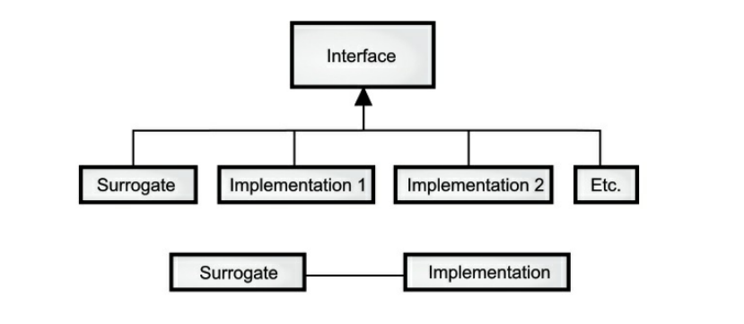

# 第二十五章 设计模式

## 概念
最初，你可以将模式视为解决特定类问题的一种特别巧妙且有深刻见解的方法。这就像前辈已经从所有角度去解决问题，并提出了最通用，最灵活的解决方案。问题可能是你之前看到并解决过的问题，但你的解决方案可能没有你在模式中体现的那种完整性。

虽然它们被称为“设计模式”，但它们实际上并不与设计领域相关联。模式似乎与传统的分析、设计和实现的思维方式不同。相反，模式在程序中体现了一个完整的思想，因此它有时会出现在分析阶段或高级设计阶段。因为模式在代码中有一个直接的实现，所以你可能不会期望模式在低级设计或实现之前出现(而且通常在到达这些阶段之前，你不会意识到需要一个特定的模式)。

模式的基本概念也可以看作是程序设计的基本概念:添加抽象层。当你抽象一些东西的时候，就像在剥离特定的细节，而这背后最重要的动机之一是:
> **将易变的事物与不变的事物分开**

另一种方法是，一旦你发现程序的某些部分可能因某种原因而发生变化，你要保持这些变化不会引起整个代码中其他变化。 如果代码更容易理解，那么维护起来会更容易。

通常，开发一个优雅且易维护设计中最困难的部分是发现我称之为变化的载体（也就是最易改变的地方）。这意味着找到系统中最重要的变化，换而言之，找到变化会导致最严重后果的地方。一旦发现变化载体，就可以围绕构建设计的焦点。

因此，设计模式的目标是隔离代码中的更改。 如果以这种方式去看，你已经在本书中看到了设计模式。 例如，继承可以被认为是一种设计模式（虽然是由编译器实现的）。它允许你表达所有具有相同接口的对象（即保持相同的行为）中的行为差异（这就是变化的部分）。组合也可以被视为一种模式，因为它允许你动态或静态地更改实现类的对象，从而改变类的工作方式。

你还看到了设计模式中出现的另一种模式：迭代器（Java 1.0和1.1随意地将其称为枚举; Java 2 集合才使用Iterator）。当你逐个选择元素时并逐步处理，这会隐藏集合的特定实现。迭代器允许你编写通用代码，该代码对序列中的所有元素执行操作，而不考虑序列的构建方式。因此，你的通用代码可以与任何可以生成迭代器的集合一起使用。

即使模式是非常有用的，但有些人断言：
> **设计模式代表语言的失败。**

这是一个非常重要的见解，因为一个模式在 C++ 有意义，可能在JAVA或者其他语言中就没有意义。出于这个原因，所以一个模式可能出现在设计模式书上，不意味着应用于你的编程语言是有用的。

我认为“语言失败”这个观点是有道理的，但是我也认为这个观点过于简单化。如果你试图解决一个特定的问题，而你使用的语言没有直接提供支持你使用的技巧，你可以说这个是语言的失败。但是，你使用特定的技巧的频率的是多少呢？也许平衡是对的：当你使用特定的技巧的时候，你必须付出更多的努力，但是你又没有足够的理由去使得语言支持这个技术。另一方面，没有语言的支持，使用这种技术常常会很混乱，但是在语言支持下，你可能会改变编程方式（例如，Java 8流实现此目的）。

### 单例模式
也许单例模式是最简单的设计模式，它是一种提供一个且只有一个对象实例的方法。这在java库中使用，但是这有个更直接的示例：

```java
// patterns/SingletonPattern.java
interface Resource {
    int getValue();
    void setValue(int x);
}

/*
* 由于这不是从Cloneable基类继承而且没有添加可克隆性，
* 因此将其设置为final可防止通过继承添加可克隆性。
* 这也实现了线程安全的延迟初始化：
*/
final class Singleton {
    private static final class ResourceImpl implements Resource {
        private int i;
        private ResourceImpl(int i) {
            this.i = i;
        }
        public synchronized int getValue() {
            return i;
        }
        public synchronized void setValue(int x) {
            i = x;
        }
    }

    private static class ResourceHolder {
        private static Resource resource = new ResourceImpl(47);
    }
    public static Resource getResource() {
        return ResourceHolder.resource;
    }
}

public class SingletonPattern {
    public static void main(String[] args) {
        Resource r = Singleton.getResource();
        System.out.println(r.getValue());
        Resource s2 = Singleton.getResource();
        s2.setValue(9);
        System.out.println(r.getValue());
        try {     
             // 不能这么做，会发生：compile-time error（编译时错误）.     
             // Singleton s3 = (Singleton)s2.clone();    
             } catch(Exception e) {      
                 throw new RuntimeException(e);    
             }  
        }
} /* Output: 47 9 */
```
创建单例的关键是防止客户端程序员直接创建对象。 在这里，这是通过在Singleton类中将Resource的实现作为私有类来实现的。

此时，你将决定如何创建对象。在这里，它是按需创建的，在第一次访问的时候创建。 该对象是私有的，只能通过`public getResource()`方法访问。


懒惰地创建对象的原因是它嵌套的私有类`resourceHolder`在首次引用之前不会加载（在`getResource()`中）。当Resource对象加载的时候，静态初始化块将被调用。由于JVM的工作方式，这种静态初始化是线程安全的。为保证线程安全，Resource中的getter和setter是同步的。

### 模式分类

“设计模式”一书讨论了23种不同的模式，分为以下三种类别（所有这些模式都围绕着可能变化的特定方面）。

1. **创建型**：如何创建对象。 这通常涉及隔离对象创建的细节，这样你的代码就不依赖于具体的对象的类型，因此在添加新类型的对象时不会更改。单例模式（Singleton）被归类为创作模式，本章稍后你将看到Factory Method的示例。

2. **构造型**：设计对象以满足特定的项目约束。它们处理对象与其他对象连接的方式，以确保系统中的更改不需要更改这些连接。

3. **行为型**：处理程序中特定类型的操作的对象。这些封装要执行的过程，例如解释语言、实现请求、遍历序列(如在迭代器中)或实现算法。本章包含观察者和访问者模式的例子。

《设计模式》一书中每个设计模式都有单独的一个章节，每个章节都有一个或者多个例子，通常使用C++，但有时也使用SmallTalk。 本章不重复设计模式中显示的所有模式，因为该书独立存在，应单独研究。 相反，你会看到一些示例，可以为你提供关于模式的理解以及它们如此重要的原因。

## 构建应用程序框架

应用程序框架允许您从一个类或一组类开始，创建一个新的应用程序，重用现有类中的大部分代码，并根据需要覆盖一个或多个方法来定制应用程序。

**模板方法模式**

应用程序框架中的一个基本概念是模板方法模式，它通常隐藏在底层，通过调用基类中的各种方法来驱动应用程序(为了创建应用程序，您已经覆盖了其中的一些方法)。

模板方法模式的一个重要特性是它是在基类中定义的，并且不能更改。它有时是一个 **private** 方法，但实际上总是 **final**。它调用其他基类方法(您覆盖的那些)来完成它的工作,但是它通常只作为初始化过程的一部分被调用(因此框架使用者不一定能够直接调用它)。

```Java
// patterns/TemplateMethod.java
// Simple demonstration of Template Method

abstract class ApplicationFramework {
    ApplicationFramework() {
        templateMethod();
    }

    abstract void customize1();

    abstract void customize2(); // "private" means automatically "final": private void templateMethod() { IntStream.range(0, 5).forEach( n -> { customize1(); customize2(); }); }}// Create a new "application": class MyApp extends ApplicationFramework { @Override void customize1() { System.out.print("Hello "); }@Override

    void customize2() {
        System.out.println("World!");
    }
}

public class TemplateMethod {
    public static void main(String[] args) {
        new MyApp();
    }
}
/*
Output:
Hello World!
Hello World!
Hello World!
Hello World!
Hello World!
*/
```

基类构造函数负责执行必要的初始化，然后启动运行应用程序的“engine”(模板方法模式)(在GUI应用程序中，这个“engine”是主事件循环)。框架使用者只提供
**customize1()** 和 **customize2()** 的定义，然后“应用程序”已经就绪运行。



## 面向实现

代理模式和桥接模式都提供了在代码中使用的代理类;完成工作的真正类隐藏在这个代理类的后面。当您在代理中调用一个方法时，它只是反过来调用实现类中的方法。这两种模式非常相似，所以代理模式只是桥接模式的一种特殊情况。人们倾向于将两者合并,称为代理模式，但是术语“代理”有一个长期的和专门的含义，这可能解释了这两种模式不同的原因。基本思想很简单:从基类派生代理，同时派生一个或多个提供实现的类:创建代理对象时，给它一个可以调用实际工作类的方法的实现。


在结构上，代理模式和桥接模式的区别很简单:代理模式只有一个实现，而桥接模式有多个实现。在设计模式中被认为是不同的:代理模式用于控制对其实现的访问，而桥接模式允许您动态更改实现。但是，如果您扩展了“控制对实现的访问”的概念，那么这两者就可以完美地结合在一起

**代理模式**

如果我们按照上面的关系图实现，它看起来是这样的:

```Java
// patterns/ProxyDemo.java
// Simple demonstration of the Proxy pattern
interface ProxyBase {
    void f();

    void g();

    void h();
}

class Proxy implements ProxyBase {
    private ProxyBase implementation;

    Proxy() {
        implementation = new Implementation();
    }
    // Pass method calls to the implementation:
    @Override
    public void f() { implementation.f(); }
    @Override
    public void g() { implementation.g(); }
    @Override
    public void h() { implementation.h(); }
}

class Implementation implements ProxyBase {
    public void f() {
        System.out.println("Implementation.f()");
    }

    public void g() {
        System.out.println("Implementation.g()");
    }

    public void h() {
        System.out.println("Implementation.h()");
    }
}

public class ProxyDemo {
    public static void main(String[] args) {
        Proxy p = new Proxy();
        p.f();
        p.g();
        p.h();
    }
}
/*
Output:
Implementation.f()
Implementation.g()
Implementation.h()
*/
```

具体实现不需要与代理对象具有相同的接口;只要代理对象以某种方式“代表具体实现的方法调用，那么基本思想就算实现了。然而，拥有一个公共接口是很方便的，因此具体实现必须实现代理对象调用的所有方法。

**状态模式**

状态模式向代理对象添加了更多的实现，以及在代理对象的生命周期内从一个实现切换到另一种实现的方法:

```Java
// patterns/StateDemo.java // Simple demonstration of the State pattern
interface StateBase {
    void f();

    void g();

    void h();

    void changeImp(StateBase newImp);
}

class State implements StateBase {
    private StateBase implementation;

    State(StateBase imp) {
        implementation = imp;
    }

    @Override
    public void changeImp(StateBase newImp) {
        implementation = newImp;
    }// Pass method calls to the implementation: @Override public void f() { implementation.f(); } @Override public void g() { implementation.g(); } @Override

    public void h() {
        implementation.h();
    }
}

class Implementation1 implements StateBase {
    @Override
    public void f() {
        System.out.println("Implementation1.f()");
    }

    @Override
    public void g() {
        System.out.println("Implementation1.g()");
    }

    @Override
    public void h() {
        System.out.println("Implementation1.h()");
    }

    @Override
    public void changeImp(StateBase newImp) {
    }
}

class Implementation2 implements StateBase {
    @Override
    public void f() {
        System.out.println("Implementation2.f()");
    }

    @Override
    public void g() {
        System.out.println("Implementation2.g()");
    }

    @Override
    public void h() {
        System.out.println("Implementation2.h()");
    }

    @Override
    public void changeImp(StateBase newImp) {
    }
}

public class StateDemo {
    static void test(StateBase b) {
        b.f();
        b.g();
        b.h();
    }

    public static void main(String[] args) {
        StateBase b = new State(new Implementation1());
        test(b);
        b.changeImp(new Implementation2());
        test(b);
    }
}
/* Output:
Implementation1.f()
Implementation1.g()
Implementation1.h()
Implementation2.f()
Implementation2.g()
Implementation2.h()
*/
```

在main()中，首先使用第一个实现，然后改变成第二个实现。代理模式和状态模式的区别在于它们解决的问题。设计模式中描述的代理模式的常见用途如下:

1. 远程代理。它在不同的地址空间中代理对象。远程方法调用(RMI)编译器rmic会自动为您创建一个远程代理。

2. 虚拟代理。这提供了“懒加载”来根据需要创建“昂贵”的对象。

3. 保护代理。当您希望对代理对象有权限访问控制时使用。

4. 智能引用。要在被代理的对象被访问时添加其他操作。例如，跟踪特定对象的引用数量，来实现写时复制用法，和防止对象别名。一个更简单的例子是跟踪特定方法的调用数量。您可以将Java引用视为一种保护代理，因为它控制在堆上实例对象的访问(例如，确保不使用空引用)。

在设计模式中，代理模式和桥接模式并不是相互关联的，因为它们被赋予(我认为是任意的)不同的结构。桥接模式,特别是使用一个单独的实现，但这似乎对我来说是不必要的,除非你确定该实现是你无法控制的(当然有可能，但是如果您编写所有代码，那么没有理由不从单基类的优雅中受益)。此外，只要代理对象控制对其“前置”对象的访问，代模式理就不需要为其实现使用相同的基类。不管具体情况如何，在代理模式和桥接模式中，代理对象都将方法调用传递给具体实现对象。

**状态机**

桥接模式允许程序员更改实现，状态机利用一个结构来自动地将实现更改到下一个。当前实现表示系统所处的状态，系统在不同状态下的行为不同(因为它使用桥接模式)。基本上，这是一个利用对象的“状态机”。将系统从一种状态移动到另一种状态的代码通常是模板方法模式，如下例所示:

```Java
// patterns/state/StateMachineDemo.java
// The StateMachine pattern and Template method
// {java patterns.state.StateMachineDemo}
package patterns.state;

import onjava.Nap;

interface State {
    void run();
}

abstract class StateMachine {
    protected State currentState;

    Nap(0.5);
System.out.println("Washing"); new

    protected abstract boolean changeState();

    // Template method:
    protected final void runAll() {
        while (changeState()) // Customizable
            currentState.run();
    }
}

// A different subclass for each state:
class Wash implements State {
    @Override
    public void run() {
    }
}

class Spin implements State {
    @Override
    public void run() {
        System.out.println("Spinning");
        new Nap(0.5);
    }
}

class Rinse implements State {
    @Override
    public void run() {
        System.out.println("Rinsing");
        new Nap(0.5);
    }
}

class Washer extends StateMachine {
    private int i = 0;

    // The state table:
    private State[] states = {new Wash(), new Spin(), new Rinse(), new Spin(),};

    Washer() {
        runAll();
    }

    @Override
    public boolean changeState() {
        if (i < states.length) {
            // Change the state by setting the
            // surrogate reference to a new object:
            currentState = states[i++];
            return true;
        } else return false;
    }
}

public class StateMachineDemo {
    public static void main(String[] args) {
        new Washer();
    }
}
/*
Output:
Washing
Spinning
Rinsing
Spinning
*/
```

在这里，控制状态的类(本例中是状态机)负责决定下一个状态。然而，状态对象本身也可以决定下一步移动到什么状态，通常基于系统的某种输入。这是更灵活的解决方案。

## 工厂模式

当你发现必须将新类型添加到系统中时，合理的第一步是使用多态性为这些新类型创建一个通用接口。这会将你系统中的其余代码与要添加的特定类型的信息分开，使得可以在不改变现有代码的情况下添加新类型……或者看起来如此。起初，在这种设计中，似乎你必须更改代码的唯一地方就是你继承新类型的地方，但这并不是完全正确的。 你仍然必须创建新类型的对象，并且在创建时必须指定要使用的确切构造器。因此，如果创建对象的代码分布在整个应用程序中，那么在添加新类型时，你将遇到相同的问题——你仍然必须追查你代码中新类型碍事的所有地方。恰好是类型的创建碍事，而不是类型的使用（通过多态处理），但是效果是一样的：添加新类型可能会引起问题。

解决方案是强制对象的创建都通过通用工厂进行，而不是允许创建代码在整个系统中传播。 如果你程序中的所有代码都必须执行通过该工厂创建你的一个对象，那么在添加新类时只需要修改工厂即可。

由于每个面向对象的程序都会创建对象，并且很可能会通过添加新类型来扩展程序，因此工厂是最通用的设计模式之一。

举例来说，让我们重新看一下**Shape**系统。 首先，我们需要一个用于所有示例的基本框架。 如果无法创建**Shape**对象，则需要抛出一个合适的异常：

```java
// patterns/shapes/BadShapeCreation.java package patterns.shapes;
public class BadShapeCreation extends RuntimeException {
    public BadShapeCreation(String msg) {
        super(msg);
    }
}
```

接下来，是一个**Shape**基类：

```java
// patterns/shapes/Shape.java
package patterns.shapes;
public class Shape {
	private static int counter = 0;
    private int id = counter++;
    @Override
    public String toString(){
        return getClass().getSimpleName() + "[" + id + "]";
    }
    public void draw() {
        System.out.println(this + " draw");
    }
    public void erase() {
        System.out.println(this + " erase");
    }
}
```

该类自动为每一个**Shape**对象创建一个唯一的`id`。

`toString()`使用运行期信息来发现特定的**Shape**子类的名字。

现在我们能很快创建一些**Shape**子类了：

```java
// patterns/shapes/Circle.java
package patterns.shapes;
public class Circle extends Shape {}
```

```java
// patterns/shapes/Square.java
package patterns.shapes;
public class Square extends Shape {}
```

```java
// patterns/shapes/Triangle.java
package patterns.shapes;
public class Triangle extends Shape {} 
```

工厂是具有能够创建对象的方法的类。 我们有几个示例版本，因此我们将定义一个接口：

```java
// patterns/shapes/FactoryMethod.java
package patterns.shapes;
public interface FactoryMethod {
    Shape create(String type);
}
```

`create()`接收一个参数，这个参数使其决定要创建哪一种**Shape**对象，这里是`String`，但是它其实可以是任何数据集合。对象的初始化数据（这里是字符串）可能来自系统外部。 这个例子将测试工厂：

```java
// patterns/shapes/FactoryTest.java
package patterns.shapes;
import java.util.stream.*;
public class FactoryTest {
    public static void test(FactoryMethod factory) {
        Stream.of("Circle", "Square", "Triangle",
                  "Square", "Circle", "Circle", "Triangle")
        .map(factory::create)
        .peek(Shape::draw)
        .peek(Shape::erase)
        .count(); // Terminal operation
    }
} 
```

在主函数`main()`里，要记住除非你在最后使用了一个终结操作，否则**Stream**不会做任何事情。在这里，`count()`的值被丢弃了。

创建工厂的一种方法是显式创建每种类型：

```java
// patterns/ShapeFactory1.java
// A simple static factory method
import java.util.*;
import java.util.stream.*;
import patterns.shapes.*;
public class ShapeFactory1 implements FactoryMethod {
    public Shape create(String type) {
        switch(type) {
            case "Circle": return new Circle();
            case "Square": return new Square();
            case "Triangle": return new Triangle();
            default: throw new BadShapeCreation(type);
        }
    }
    public static void main(String[] args) {
        FactoryTest.test(new ShapeFactory1());
    }
}
```

输出结果：

```java
Circle[0] draw
Circle[0] erase
Square[1] draw
Square[1] erase
Triangle[2] draw
Triangle[2] erase
Square[3] draw
Square[3] erase
Circle[4] draw
Circle[4] erase
Circle[5] draw
Circle[5] erase
Triangle[6] draw
Triangle[6] erase 
```

`create()`现在是添加新类型的Shape时系统中唯一需要更改的其他代码。

### 动态工厂

前面例子中的**静态**`create()`方法强制所有创建操作都集中在一个位置，因此这是添加新类型的**Shape**时唯一必须更改代码的地方。这当然是一个合理的解决方案，因为它把创建对象的过程限制在一个框内。但是，如果你在添加新类时无需修改任何内容，那就太好了。 以下版本使用反射在首次需要时将**Shape**的构造器动态加载到工厂列表中：

```java
// patterns/ShapeFactory2.java
import java.util.*;
import java.lang.reflect.*;
import java.util.stream.*;
import patterns.shapes.*;
public class ShapeFactory2 implements FactoryMethod {
    Map<String, Constructor> factories = new HashMap<>();
    static Constructor load(String id) {
        System.out.println("loading " + id);
        try {
            return Class.forName("patterns.shapes." + id)
                .getConstructor();
        } catch(ClassNotFoundException |
                NoSuchMethodException e) {
            throw new BadShapeCreation(id);
        }
    }
    public Shape create(String id) {
        try {
            return (Shape)factories
                .computeIfAbsent(id, ShapeFactory2::load)
                .newInstance();
        } catch(InstantiationException |
                IllegalAccessException |
                InvocationTargetException e) {
            throw new BadShapeCreation(id);
        }
    }
    public static void main(String[] args) {
        FactoryTest.test(new ShapeFactory2());
    }
}
```

输出结果：

```java
loading Circle
Circle[0] draw
Circle[0] erase
loading Square
Square[1] draw
Square[1] erase
loading Triangle
Triangle[2] draw
Triangle[2] erase
Square[3] draw
Square[3] erase
Circle[4] draw
Circle[4] erase
Circle[5] draw
Circle[5] erase
Triangle[6] draw
Triangle[6] erase
```

和之前一样，`create()`方法基于你传递给它的**String**参数生成新的**Shape**s，但是在这里，它是通过在**HashMap**中查找作为键的**String**来实现的。 返回的值是一个构造器，该构造器用于通过调用`newInstance()`创建新的**Shape**对象。

然而，当你开始运行程序时，工厂的`map`为空。`create()`使用`map`的`computeIfAbsent()`方法来查找构造器（如果该构造器已存在于`map`中）。如果不存在则使用`load()`计算出该构造器，并将其插入到`map`中。 从输出中可以看到，每种特定类型的**Shape**都是在第一次请求时才加载的，然后只需要从`map`中检索它。

### 多态工厂

《设计模式》这本书强调指出，采用“工厂方法”模式的原因是可以从基本工厂中继承出不同类型的工厂。 再次修改示例，使工厂方法位于单独的类中：

```java
// patterns/ShapeFactory3.java
// Polymorphic factory methods
import java.util.*;
import java.util.function.*;
import java.util.stream.*;
import patterns.shapes.*;
interface PolymorphicFactory {
    Shape create();
}
class RandomShapes implements Supplier<Shape> {
    private final PolymorphicFactory[] factories;
    private Random rand = new Random(42);
    RandomShapes(PolymorphicFactory... factories){
        this.factories = factories;
    }
    public Shape get() {
        return factories[ rand.nextInt(factories.length)].create();
    }
}
public class ShapeFactory3 {
    public static void main(String[] args) {
        RandomShapes rs = new RandomShapes(
            Circle::new,
            Square::new,
            Triangle::new);
        Stream.generate(rs)
            .limit(6)
            .peek(Shape::draw)
            .peek(Shape::erase)
            .count();
    }
}
```

输出结果：

```java
Triangle[0] draw
Triangle[0] erase
Circle[1] draw
Circle[1] erase
Circle[2] draw
Circle[2] erase
Triangle[3] draw
Triangle[3] erase
Circle[4] draw
Circle[4] erase
Square[5] draw
Square[5] erase 
```

**RandomShapes**实现了**Supplier \<Shape>**，因此可用于通过`Stream.generate()`创建**Stream**。 它的构造器采用**PolymorphicFactory**对象的可变参数列表。 变量参数列表以数组形式出现，因此列表是以数组形式在内部存储的。`get()`方法随机获取此数组中一个对象的索引，并在结果上调用`create()`以产生新的**Shape**对象。 添加新类型的**Shape**时，**RandomShapes**构造器是唯一需要更改的地方。 请注意，此构造器需要**Supplier \<Shape>**。 我们传递给其**Shape**构造器的方法引用，该引用可满足**Supplier \<Shape>**约定，因为Java 8支持结构一致性。

鉴于**ShapeFactory2.java**可能会抛出异常，使用此方法则没有任何异常——它在编译时完全确定。

### 抽象工厂

抽象工厂模式看起来像我们之前所见的工厂对象，但拥有不是一个工厂方法而是几个工厂方法， 每个工厂方法都会创建不同种类的对象。 这个想法是在创建工厂对象时，你决定如何使用该工厂创建的所有对象。 《设计模式》中提供的示例实现了跨各种图形用户界面（GUI）的可移植性：你创建一个适合你正在使用的GUI的工厂对象，然后从中请求菜单，按钮，滑块等等，它将自动为GUI创建适合该项目版本的组件。 因此，你可以将从一个GUI更改为另一个所产生的影响隔离限制在一处。 作为另一个示例，假设你正在创建一个通用游戏环境来支持不同类型的游戏。 使用抽象工厂看起来就像下文那样：

```java
// patterns/abstractfactory/GameEnvironment.java
// An example of the Abstract Factory pattern
// {java patterns.abstractfactory.GameEnvironment}
package patterns.abstractfactory;
import java.util.function.*;
interface Obstacle {
    void action();
}

interface Player {
    void interactWith(Obstacle o);
}

class Kitty implements Player {
    @Override
    public void interactWith(Obstacle ob) {
        System.out.print("Kitty has encountered a ");
        ob.action();
    }
}

class KungFuGuy implements Player {
    @Override
    public void interactWith(Obstacle ob) {
        System.out.print("KungFuGuy now battles a ");
        ob.action();
    }
}

class Puzzle implements Obstacle {
    @Override
    public void action() {
        System.out.println("Puzzle");
    }
}

class NastyWeapon implements Obstacle {
    @Override
    public void action() {
        System.out.println("NastyWeapon");
    }
}

// The Abstract Factory:
class GameElementFactory {
    Supplier<Player> player;
    Supplier<Obstacle> obstacle;
}

// Concrete factories:
class KittiesAndPuzzles extends GameElementFactory {
    KittiesAndPuzzles() {
        player = Kitty::new;
        obstacle = Puzzle::new;
    }
}

class KillAndDismember extends GameElementFactory {
    KillAndDismember() {
        player = KungFuGuy::new;
        obstacle = NastyWeapon::new;
    }
}

public class GameEnvironment {
    private Player p;
    private Obstacle ob;

    public GameEnvironment(GameElementFactory factory) {
        p = factory.player.get();
        ob = factory.obstacle.get();
    }
    public void play() {
        p.interactWith(ob);
    }
    public static void main(String[] args) {
        GameElementFactory kp = new KittiesAndPuzzles(), kd = new KillAndDismember();
        GameEnvironment g1 = new GameEnvironment(kp), g2 = new GameEnvironment(kd);
        g1.play();
        g2.play();
    }
}

```

输出结果：

```java
Kitty has encountered a Puzzle
KungFuGuy now battles a NastyWeapon
```

在这种环境中，**Player**对象与**Obstacle**对象进行交互，但是根据你所玩游戏的类型，存在不同类型的玩家和障碍物。 你可以通过选择特定的**GameElementFactory**来确定游戏的类型，然后**GameEnvironment**控制游戏的设置和玩法。 在此示例中，设置和玩法非常简单，但是这些活动（初始条件和状态变化）可以决定游戏的大部分结果。 这里，**GameEnvironment**不是为继承而设计的，尽管这样做很有意义。 它还包含“双重调度”和“工厂方法”的示例，稍后将对这两个示例进行说明。

<!-- Function Objects -->

## 函数对象

一个 *函数对象* 封装了一个函数。其特点就是将被调用函数的选择与那个函数被调用的位置进行解耦。

*《设计模式》* 中也提到了这个术语，但是没有使用。然而，*函数对象* 的话题却在那本书的很多模式中被反复论及。

### 命令模式

从最直观的角度来看，*命令模式* 就是一个函数对象：一个作为对象的函数。我们可以将 *函数对象* 作为参数传递给其他方法或者对象，来执行特定的操作。

在Java 8之前，想要产生单个函数的效果，我们必须明确将方法包含在对象中，而这需要太多的仪式了。而利用Java 8的lambda特性， *命令模式* 的实现将是微不足道的。

```java
// patterns/CommandPattern.java
import java.util.*;

public class CommandPattern {
  public static void main(String[] args) {
    List<Runnable> macro = Arrays.asList(
      () -> System.out.print("Hello "),
      () -> System.out.print("World! "),
      () -> System.out.print("I'm the command pattern!")
    );
    macro.forEach(Runnable::run);
  }
}
/* Output:
Hello World! I'm the command pattern!
*/
```

*命令模式* 的主要特点是允许向一个方法或者对象传递一个想要的动作。在上面的例子中，这个对象就是 **macro** ，而 *命令模式* 提供了将一系列需要一起执行的动作集进行排队的方法。在这里，*命令模式* 允许我们动态的创建新的行为，通常情况下我们需要编写新的代码才能完成这个功能，而在上面的例子中，我们可以通过解释运行一个脚本来完成这个功能（如果需要实现的东西很复杂请参考解释器模式）。

*《设计模式》* 认为“命令模式是回调的面向对象的替代品”。尽管如此，我认为"back"（回来）这个词是callback（回调）这一概念的基本要素。也就是说，我认为回调（callback）实际上是返回到回调的创建者所在的位置。另一方面，对于 *命令* 对象，通常只需创建它并将其交给某种方法或对象，而不是自始至终以其他方式联系命令对象。不管怎样，这就是我对它的看法。在本章的后面内容中，我将会把一组设计模式放在“回调”的标题下面。

### 策略模式

*策略模式* 看起来像是从同一个基类继承而来的一系列 *命令* 类。但是仔细查看 *命令模式*，你就会发现它也具有同样的结构：一系列分层次的 *函数对象*。不同之处在于，这些函数对象的用法和策略模式不同。就像前面的 `io/DirList.java` 那个例子，使用 *命令* 是为了解决特定问题 -- 从一个列表中选择文件。“不变的部分”是被调用的那个方法，而变化的部分被分离出来放到 *函数对象* 中。我认为 *命令模式* 在编码阶段提供了灵活性，而 *策略模式* 的灵活性在运行时才会体现出来。尽管如此，这种区别却是非常模糊的。

另外，*策略模式* 还可以添加一个“上下文（context）”，这个上下文（context）可以是一个代理类（surrogate class），用来控制对某个特定 *策略* 对象的选择和使用。就像 *桥接模式* 一样！下面我们来一探究竟：

```java
// patterns/strategy/StrategyPattern.java
// {java patterns.strategy.StrategyPattern}
package patterns.strategy;
import java.util.function.*;
import java.util.*;

// The common strategy base type:
class FindMinima {
  Function<List<Double>, List<Double>> algorithm;
}

// The various strategies:
class LeastSquares extends FindMinima {
  LeastSquares() {
    // Line is a sequence of points (Dummy data):
    algorithm = (line) -> Arrays.asList(1.1, 2.2);
  }
}

class Perturbation extends FindMinima {
  Perturbation() {
    algorithm = (line) -> Arrays.asList(3.3, 4.4);
  }
}

class Bisection extends FindMinima {
  Bisection() {
    algorithm = (line) -> Arrays.asList(5.5, 6.6);
  }
}

// The "Context" controls the strategy:
class MinimaSolver {
  private FindMinima strategy;
  MinimaSolver(FindMinima strat) {
    strategy = strat;
  }
  List<Double> minima(List<Double> line) {
    return strategy.algorithm.apply(line);
  }
  void changeAlgorithm(FindMinima newAlgorithm) {
    strategy = newAlgorithm;
  }
}

public class StrategyPattern {
  public static void main(String[] args) {
    MinimaSolver solver = 
      new MinimaSolver(new LeastSquares());
    List<Double> line = Arrays.asList(
      1.0, 2.0, 1.0, 2.0, -1.0,
      3.0, 4.0, 5.0, 4.0 );
    System.out.println(solver.minima(line)); 
    solver.changeAlgorithm(new Bisection()); 
    System.out.println(solver.minima(line));
  }
}
/* Output:
[1.1, 2.2]
[5.5, 6.6]
*/
```

`MinimaSolver` 中的 `changeAlgorithm()` 方法将一个不同的策略插入到了 `私有` 域 `strategy` 中，这使得在调用 `minima()` 方法时，可以使用新的策略。

我们可以通过将上下文注入到 `FindMinima` 中来简化我们的解决方法。

```java
// patterns/strategy/StrategyPattern2.java // {java patterns.strategy.StrategyPattern2}
package patterns.strategy;
import java.util.function.*;
import java.util.*;

// "Context" is now incorporated:
class FindMinima2 {
  Function<List<Double>, List<Double>> algorithm;
  FindMinima2() { leastSquares(); } // default
  // The various strategies:
  void leastSquares() {
    algorithm = (line) -> Arrays.asList(1.1, 2.2);
  }
  void perturbation() {
    algorithm = (line) -> Arrays.asList(3.3, 4.4);
  }
  void bisection() {
    algorithm = (line) -> Arrays.asList(5.5, 6.6);
  }
  List<Double> minima(List<Double> line) {
    return algorithm.apply(line);
  }
}

public class StrategyPattern2 {
  public static void main(String[] args) {
    FindMinima2 solver = new FindMinima2();
    List<Double> line = Arrays.asList(
      1.0, 2.0, 1.0, 2.0, -1.0,
      3.0, 4.0, 5.0, 4.0 );
    System.out.println(solver.minima(line));
    solver.bisection();
    System.out.println(solver.minima(line));
  }
}
/* Output:
[1.1, 2.2]
[5.5, 6.6]
*/
```

`FindMinima2` 封装了不同的算法，也包含了“上下文”（Context），所以它便可以在一个单独的类中控制算法的选择了。

### 责任链模式

*责任链模式* 也许可以被看作一个使用了 *策略* 对象的“递归的动态一般化”。此时我们进行一次调用，在一个链序列中的每个策略都试图满足这个调用。这个过程直到有一个策略成功满足该调用或者到达链序列的末尾才结束。在递归方法中，一个方法将反复调用它自身直至达到某个终止条件；使用责任链，一个方法会调用相同的基类方法（拥有不同的实现），这个基类方法将会调用基类方法的其他实现，如此反复直至达到某个终止条件。

除了调用某个方法来满足某个请求以外，链中的多个方法都有机会满足这个请求，因此它有点专家系统的意味。由于责任链实际上就是一个链表，它能够动态创建，因此它可以看作是一个更一般的动态构建的 `switch` 语句。

在上面的 `StrategyPattern.java` 例子中，我们可能想自动发现一个解决方法。而 *责任链* 就可以达到这个目的：

```java
// patterns/chain/ChainOfResponsibility.java
// Using the Functional interface
// {java patterns.chain.ChainOfResponsibility}
package patterns.chain;
import java.util.*;
import java.util.function.*;

class Result {
  boolean success;
  List<Double> line;
  Result(List<Double> data) {
    success = true;
    line = data;
  }
  Result() {
    success = false;
    line = Collections.<Double>emptyList();
  }
}

class Fail extends Result {}

interface Algorithm {
  Result algorithm(List<Double> line);
}

class FindMinima {
  public static Result leastSquares(List<Double> line) {
    System.out.println("LeastSquares.algorithm");
    boolean weSucceed = false;
    if(weSucceed) // Actual test/calculation here
      return new Result(Arrays.asList(1.1, 2.2));
    else // Try the next one in the chain:
      return new Fail();
  }
  public static Result perturbation(List<Double> line) {
    System.out.println("Perturbation.algorithm");
    boolean weSucceed = false;
    if(weSucceed) // Actual test/calculation here
      return new Result(Arrays.asList(3.3, 4.4));
    else
      return new Fail();
  }
  public static Result bisection(List<Double> line) {
    System.out.println("Bisection.algorithm");
    boolean weSucceed = true;
    if(weSucceed) // Actual test/calculation here
      return new Result(Arrays.asList(5.5, 6.6));
    else
      return new Fail();
    }
  static List<Function<List<Double>, Result>>
    algorithms = Arrays.asList(
      FindMinima::leastSquares,
      FindMinima::perturbation,
      FindMinima::bisection
    );
  public static Result minima(List<Double> line) {
    for(Function<List<Double>, Result> alg :
        algorithms) {
      Result result = alg.apply(line);
      if(result.success)
        return result;
    }
    return new Fail();
  }
}

public class ChainOfResponsibility {
  public static void main(String[] args) {
    FindMinima solver = new FindMinima();
    List<Double> line = Arrays.asList(
      1.0, 2.0, 1.0, 2.0, -1.0,
      3.0, 4.0, 5.0, 4.0);
    Result result = solver.minima(line);
    if(result.success)
      System.out.println(result.line);
    else
      System.out.println("No algorithm found");
  }
}
/* Output:
LeastSquares.algorithm
Perturbation.algorithm
Bisection.algorithm
[5.5, 6.6]
*/
```

我们从定义一个 `Result` 类开始，这个类包含一个 `success` 标志，因此接收者就可以知道算法是否成功执行，而 `line` 变量保存了真实的数据。当算法执行失败时， `Fail` 类可以作为返回值。要注意的是，当算法执行失败时，返回一个 `Result` 对象要比抛出一个异常更加合适，因为我们有时可能并不打算解决这个问题，而是希望程序继续执行下去。

每一个 `Algorithm` 接口的实现，都实现了不同的 `algorithm()` 方法。在 `FindMinama` 中，将会创建一个算法的列表（这就是所谓的“链”），而 `minima()` 方法只是遍历这个列表，然后找到能够成功执行的算法而已。

## 改变接口

有时候我们需要解决的问题很简单，仅仅是“我没有需要的接口”而已。有两种设计模式用来解决这个问题：*适配器模式* 接受一种类型并且提供一个对其他类型的接口。*外观模式* 为一组类创建了一个接口，这样做只是为了提供一种更方便的方法来处理库或资源。

### 适配器模式（Adapter）

当我们手头有某个类，而我们需要的却是另外一个类，我们就可以通过 *适配器模式* 来解决问题。唯一需要做的就是产生出我们需要的那个类，有许多种方法可以完成这种适配。

```java
// patterns/adapt/Adapter.java
// Variations on the Adapter pattern
// {java patterns.adapt.Adapter}
package patterns.adapt;

class WhatIHave {
    public void g() {
    }

    public void h() {
    }
}

interface WhatIWant {
    void f();
}

class ProxyAdapter implements WhatIWant {
    WhatIHave whatIHave;

    ProxyAdapter(WhatIHave wih) {
        whatIHave = wih;
    }

    @Override
    public void f() {
        // Implement behavior using
        // methods in WhatIHave:
        whatIHave.g();
        whatIHave.h();
    }
}

class WhatIUse {
    public void op(WhatIWant wiw) {
        wiw.f();
    }
}

// Approach 2: build adapter use into op():
class WhatIUse2 extends WhatIUse {
    public void op(WhatIHave wih) {
        new ProxyAdapter(wih).f();
    }
}

// Approach 3: build adapter into WhatIHave:
class WhatIHave2 extends WhatIHave implements WhatIWant {
    @Override
    public void f() {
        g();
        h();
    }
}

// Approach 4: use an inner class:
class WhatIHave3 extends WhatIHave {
    private class InnerAdapter implements WhatIWant {
        @Override
        public void f() {
            g();
            h();
        }
    }

    public WhatIWant whatIWant() {
        return new InnerAdapter();
    }
}

public class Adapter {
    public static void main(String[] args) {
        WhatIUse whatIUse = new WhatIUse();
        WhatIHave whatIHave = new WhatIHave();
        WhatIWant adapt = new ProxyAdapter(whatIHave);
        whatIUse.op(adapt);
        // Approach 2:
        WhatIUse2 whatIUse2 = new WhatIUse2();
        whatIUse2.op(whatIHave);
        // Approach 3:
        WhatIHave2 whatIHave2 = new WhatIHave2();
        whatIUse.op(whatIHave2);
        // Approach 4:
        WhatIHave3 whatIHave3 = new WhatIHave3();
        whatIUse.op(whatIHave3.whatIWant());
    }
}
```

我想冒昧的借用一下术语“proxy”（代理），因为在 *《设计模式》* 里，他们坚持认为一个代理（proxy）必须拥有和它所代理的对象一模一样的接口。但是，如果把这两个词一起使用，叫做“代理适配器（proxy adapter）”，似乎更合理一些。

### 外观模式（Façade）

当我想方设法试图将需求初步（first-cut）转化成对象的时候，通常我使用的原则是：

>“把所有丑陋的东西都隐藏到对象里去”。

基本上说，*外观模式* 干的就是这个事情。如果我们有一堆让人头晕的类以及交互（Interactions），而它们又不是客户端程序员必须了解的，那我们就可以为客户端程序员创建一个接口只提供那些必要的功能。

外观模式经常被实现为一个符合单例模式（Singleton）的抽象工厂（abstract factory）。当然，你可以通过创建包含 **静态** 工厂方法（static factory methods）的类来达到上述效果。

```java
// patterns/Facade.java

class A { A(int x) {} }

class B { B(long x) {} }

class C { C(double x) {} }

// Other classes that aren't exposed by the
// facade go here ...
public class Facade {
  static A makeA(int x) { return new A(x); }
  static B makeB(long x) { return new B(x); }
  static C makeC(double x) { return new C(x); }
  public static void main(String[] args) {
    // The client programmer gets the objects
    // by calling the static methods:
    A a = Facade.makeA(1);
    B b = Facade.makeB(1);
    C c = Facade.makeC(1.0);
  }
}
```

《设计模式》给出的例子并不是真正的 *外观模式* ，而仅仅是一个类使用了其他的类而已。

#### 包（Package）作为外观模式的变体

我感觉，*外观模式* 更倾向于“过程式的（procedural）”，也就是非面向对象的（non-object-oriented）：我们是通过调用某些函数才得到对象。它和抽象工厂（Abstract factory）到底有多大差别呢？*外观模式* 关键的一点是隐藏某个库的一部分类（以及它们的交互），使它们对于客户端程序员不可见，这样那些类的接口就更加简练和易于理解了。

其实，这也正是 Java 的 packaging（包）的功能所完成的事情：在库以外，我们只能创建和使用被声明为公共（public）的那些类；所有非公共（non-public）的类只能被同一 package 的类使用。看起来，*外观模式* 似乎是 Java 内嵌的一个功能。

公平起见，*《设计模式》* 主要是写给 C++ 读者的。尽管 C++ 有命名空间（namespaces）机制来防止全局变量和类名称之间的冲突，但它并没有提供类隐藏的机制，而在 Java 里我们可以通过声明 non-public 类来实现这一点。我认为，大多数情况下 Java 的 package 功能就足以解决针对 *外观模式* 的问题了。

<!-- Interpreter: Run-Time Flexibility -->
## 解释器

<!-- Callbacks -->

If the application user needs greater run-time flexibility, for example to create scripts describing the desired behavior of the system, you can use the Interpreter design pattern. Here, you create and embed a language interpreter into your program.

Developing your own language and building an interpreter for it is a time-consuming distraction from the process of building your application. The best solution is to reuse code: that is, to embed an
interpreter that’s already been built and debugged for you. The Python language can be freely embedded in your for-profit application without any license agreement, royalties, or Strings of any kind. In addition, there is a version of Python called Jython which is entirely Java byte codes, so incorporating it into your application is simple. Python is a scripting language that is very easy to learn, very logical to read and write, supports functions and objects, has a large set of available libraries, and runs on virtually every platform. You can download
Python and learn more about it at www.Python.org.

## 回调

Callbacks decouple code from behavior. These include Observer, and a category of callbacks called “multiple dispatching” (not in Design Patterns), including Visitor from Design Patterns.

### Observer

Like the other forms of callback, this contains a hook point where you
can change code. The difference is in the observer’s completely
dynamic nature. It is often used for the specific case of changes based
on other objects’ change of state, but is also the basis of event
management. Observers allow you to decouple the source of the call
from the called code in a completely dynamic way.

The observer pattern solves a fairly common problem: What if a group of objects must update themselves when some object changes state?
This can be seen in the “model-view” aspect of SmallTalk’s MVC
(model-view-controller), or the almost-equivalent “Document-View
Architecture.” Suppose you have some data (the “document”) and
more than one view, say a plot and a textual view. When you change
the data, the two views must know to update themselves, and that’s
what the observer facilitates. It’s a common enough problem that its
solution is part of the standard java.util library.
There are two types of objects used to implement the observer pattern
in Java. The Observable class keeps track of everybody who wants
to be informed when a change happens, whether the “state” has
changed or not. When someone says “OK, everybody should check and
potentially update themselves,” the Observable class performs this
task by calling the notifyObservers() method for each one on
the list. The notifyObservers() method is part of the base class
Observable.

There are actually two “things that change” in the observer pattern:
the quantity of observing objects and the way an update occurs. That
is, the observer pattern allows you to modify both of these without
affecting the surrounding code.

Observer is an “interface” class that only has one method,
update(). This function is called by the object that’s observed, when
that object decides its time to update all its observers. The arguments
are optional; you can have an update() with no arguments and that
would still fit the observer pattern; however this is more general—it
allows the observed object to pass the object that caused the update
(since an Observer may be registered with more than one observed
object) and any extra information if that’s helpful, rather than forcing
the Observer object to hunt around to see who is updating and to
fetch any other information it needs.

The “observed object” that decides when and how to do the updating is called the Observable.

Observable has a flag to indicate whether it’s been changed. In a simpler design, there would be no flag; if something happened, everyone is notified. The flag allows you to wait, and only notify the
Observers when you decide the time is right. Notice, however, that  the control of the flag’s state is protected, so only an inheritor can decide what constitutes a change, and not the end user of the resulting derived Observer class.

Most of the work is done in notifyObservers(). If the changed flag has not been set, this does nothing. Otherwise, it first clears the changed flag so repeated calls to notifyObservers() won’t waste time. This is done before notifying the observers in case the calls
to update() do anything that causes a change back to this
Observable object. Then it moves through the set and calls back
to the update() method of each Observer.

At first it may appear you can use an ordinary Observable object to
manage the updates. But this doesn’t work; to get an effect, you must
inherit from Observable and somewhere in your derived-class code
call setChanged(). This is the method that sets the “changed” flag,
which means when you call notifyObservers(), all observers
will, in fact, get notified. Where you call setChanged() depends on
the logic of your program.

### Observing Flowers

Here is an example of the observer pattern:

```java
// patterns/observer/ObservedFlower.java
// Demonstration of "Observer" pattern
// {java patterns.observer.ObservedFlower}
package patterns.observer;

import java.util.*;

class Flower {
    private boolean isOpen;
    private boolean alreadyOpen;
    private boolean alreadyClosed;

    Flower() {
        isOpen = false;
    }

    OpenNotifier opening = new OpenNotifier();
    CloseNotifier closing = new CloseNotifier();

    public void open() { // Opens its petals
        isOpen = true;
        opening.notifyObservers();
        alreadyClosed = false;
    }

    public void close() { // Closes its petals
        isOpen = false;
        closing.notifyObservers();
        alreadyOpen = false;
    }

    class OpenNotifier extends Observable {
        @Override
        public void notifyObservers() {
            if (isOpen && !alreadyOpen) {
                setChanged();
                super.notifyObservers();
                alreadyOpen = true;
            }
        }
    }

    class CloseNotifier extends Observable {
        @Override
        public void notifyObservers() {
            if (!isOpen && !alreadyClosed) {
                setChanged();
                super.notifyObservers();
                alreadyClosed = true;
            }
        }
    }
}

class Bee {
    private String name;

    Bee(String nm) {
        name = nm;
    }

    // Observe openings:
    public Observer openObserver() {
        return (ob, a) -> System.out
                .println("Bee " + name + "'s breakfast time!");
    }

    // Observe closings:
    public Observer closeObserver() {
        return (ob, a) -> System.out.println("Bee " + name + "'s bed time!");
    }
}

class Hummingbird {
    private String name;

    Hummingbird(String nm) {
        name = nm;
    }

    public Observer openObserver() {
        return (ob, a) -> System.out
                .println("Hummingbird " + name + "'s breakfast time!");
    }

    public Observer closeObserver() {
        return (ob, a) -> System.out
                .println("Hummingbird " + name + "'s bed time!");
    }
}

public class ObservedFlower {
    public static void main(String[] args) {
        Flower f = new Flower();
        Bee ba = new Bee("A"), bb = new Bee("B");
        Hummingbird ha = new Hummingbird("A"), hb = new Hummingbird("B");
        f.opening.addObserver(ha.openObserver());
        f.opening.addObserver(hb.openObserver());
        f.opening.addObserver(ba.openObserver());
        f.opening.addObserver(bb.openObserver());
        f.closing.addObserver(ha.closeObserver());
        f.closing.addObserver(hb.closeObserver());
        f.closing.addObserver(ba.closeObserver());
        f.closing.addObserver(bb.closeObserver());
        // Hummingbird B decides to sleep in:
        f.opening.deleteObserver(hb.openObserver());
        // A change that interests observers:
        f.open();
        f.open(); // It's already open, no change.
        // Bee A doesn't want to go to bed:
        f.closing.deleteObserver(ba.closeObserver());
        f.close();
        f.close(); // It's already closed; no change
        f.opening.deleteObservers();
        f.open();
        f.close();
    }
}
/* Output:
Bee B's breakfast time!
Bee A's breakfast time!
Hummingbird B's breakfast time!
Hummingbird A's breakfast time!
Bee B's bed time!
Bee A's bed time!
Hummingbird B's bed time!
Hummingbird A's bed time!
Bee B's bed time!
Bee A's bed time!
Hummingbird B's bed time!
Hummingbird A's bed time!
*/
```

The events of interest are that a Flower can open or close. Because of the use of the inner class idiom, both these events can be separatelyobservable phenomena. OpenNotifier and CloseNotifier both inherit Observable, so they have access to setChanged() and can be handed to anything that needs an Observable. Because Observable is a class, we don’t have an opportunity to use lambda expressions.

Observer is a functional interface, so openObserver() and closeObserver() in Bee and Hummingbird can be defined using lambdas. Both of those classes may independently observe Flower openings and closings.

In main(), you see one of the prime benefits of the observer pattern: the ability to change behavior at runtime by dynamically registering and un-registering Observers with Observables.

Notice you can create other completely different observing objects; the only connection the Observers have with Flowers is the Observer interface.

### A Visual Example of Observers

The following example cheats by using the Swing library to create graphics, which are not introduced in this book (See Thinking in Java, 4th edition, available at www.OnJava8.com). Boxes are placed in a grid on the screen and each one is initialized to a random color. In addition, each box implements the Observer interface and is registered with an Observable object. When you click on a box, all other boxes are notified of the change because the Observable object automatically calls each Observer object’s update() method. Inside this method, the box checks to see if it's adjacent to the one that was clicked, and if so it changes its color to match the clicked box.

The `java.awt.event` library has a `MouseListener` class with multiple methods, but we are only interested in the `mouseClicked()` method. You can’t write a lambda expression if you just want to implement `mouseClicked()` because `MouseListener` is not a functional interface due to its multiple methods. Java 8 allows us to simplify our code using the default keyword to create a helper interface and solve this problem:

```java
// onjava/MouseClick.java
// Helper interface to allow lambda expressions
package onjava;

import java.awt.event.*;

// Default everything except mouseClicked():
public interface MouseClick extends MouseListener {
    @Override
    default void mouseEntered(MouseEvent e) {
    }

    @Override
    default void mouseExited(MouseEvent e) {
    }

    @Override
    default void mousePressed(MouseEvent e) {
    }

    @Override
    default void mouseReleased(MouseEvent e) {
    }
}
```

Now you can successfully cast a lambda expression to a MouseClick and pass it to addMouseListener().

```java
// patterns/BoxObserver.java
// Demonstration of Observer pattern using
// Java's built-in observer classes
// {ExcludeFromTravisCI}
import javax.swing.*;
import java.awt.*;
import java.awt.event.*;
import java.util.*;
import onjava.*;
import onjava.MouseClick;

// You must inherit a new type of Observable:
class BoxObservable extends Observable {
    @Override
    public void notifyObservers(Object b) {
        // Otherwise it won't propagate changes:
        setChanged();
        super.notifyObservers(b);
    }
}

public class BoxObserver extends JFrame {
    Observable notifier = new BoxObservable();

    public BoxObserver(int grid) {
        setTitle("Demonstrates Observer pattern");
        Container cp = getContentPane();
        cp.setLayout(new GridLayout(grid, grid));
        for (int x = 0; x < grid; x++)
            for (int y = 0; y < grid; y++)
                cp.add(new OCBox(x, y, notifier));
    }

    public static void main(String[] args) {
        new TimedAbort(4);
        int grid = 8;
        if (args.length > 0)
            grid = Integer.parseInt(args[0]);
        JFrame f = new BoxObserver(grid);
        f.setSize(500, 400);
        f.setVisible(true);
        f.setDefaultCloseOperation(DISPOSE_ON_CLOSE);
    }
}

class OCBox extends JPanel implements Observer {
    Observable notifier;
    int x, y; // Locations in grid
    Color cColor = newColor();
    static final Color[] COLORS = { Color.black, Color.blue, Color.cyan,
            Color.darkGray, Color.gray, Color.green, Color.lightGray,
            Color.magenta, Color.orange, Color.pink, Color.red, Color.white,
            Color.yellow };

    static Color newColor() {
        return COLORS[(int) (Math.random() * COLORS.length)];
    }

    OCBox(int x, int y, Observable notifier) {
        this.x = x;
        this.y = y;
        notifier.addObserver(this);
        this.notifier = notifier;
        addMouseListener(
                (MouseClick) e -> notifier.notifyObservers(OCBox.this));
    }

    @Override
    public void paintComponent(Graphics g) {
        super.paintComponent(g);
        g.setColor(cColor);
        Dimension s = getSize();

        g.fillRect(0, 0, s.width, s.height);
    }

    @Override
    public void update(Observable o, Object arg) {
        OCBox clicked = (OCBox) arg;
        if (nextTo(clicked)) {
            cColor = clicked.cColor;
            repaint();
        }
    }

    private boolean nextTo(OCBox b) {
        return Math.abs(x - b.x) <= 1 && Math.abs(y - b.y) <= 1;
    }
}
```

Notice how MouseClick enables addMouseListener() to accept a lambda expression.

When you first look at the online documentation for Observable, it’s a bit confusing because it appears you can use an ordinary Observable object to manage the updates. But this doesn’t work.

Try it—inside BoxObserver, create an Observable object instead of a BoxObservable object and see what happens: nothing. To get an effect, you must inherit from Observable and somewhere in your derived-class code call setChanged(). This is the method that sets the “changed” flag, which means when you call notifyObservers(), all observers will, in fact, get notified. In the example above setChanged() is simply called within notifyObservers(), but you can use any criterion to decide when
to call setChanged().

BoxObserver contains a single Observable object called notifier, and every time an OCBox object is created, it is tied to notifier. In OCBox, whenever you click the mouse the notifyObservers() method is called, passing the clicked object in as an argument so all the boxes receiving the message (in their
update() method) know who was clicked and can decide whether to change themselves or not. Using a combination of code in notifyObservers() and update() you can work out some fairly complex schemes.

It might appear that the way the observers are notified must be frozen at compile time in the notifyObservers() method. However, if you look more closely at the code above you’ll see that the only place in BoxObserver or OCBox where you’re aware you’re working with a
BoxObservable is at the point of creation of the Observable object—from then on everything uses the basic Observable interface. This means you can inherit other Observable classes and swap them at run-time to change notification behavior.

## 多次调度

<!-- Pattern Refactoring -->

Programs can get especially messy when dealing with multiple
interacting types. For example, consider a system that parses and
executes mathematical expressions. You want to say Number +
Number, Number * Number, etc., where Number is the base class
for a family of numerical objects. But when you say a + b, and you
don’t know the exact type of either a or b, so how can you get them to
interact properly?
The answer starts with something you probably don’t think about:
Java performs only single dispatching. That is, if you are performing

mechanism on only one of those
types. This doesn’t solve the problem, so you end up detecting some
types manually and effectively producing your own dynamic binding
behavior.
The solution is called multiple dispatching. Because polymorphism
only occurs via method calls, if you want double dispatching to occur,
there must be two method calls: the first to determine the first
unknown type, and the second to determine the second unknown type.
With multiple dispatching, you must have a polymorphic method call
to determine each of the types.
Generally, you’ll set up a configuration such that a single method call
produces more than one dynamic method call and thus determines
more than one type in the process. The methods in the following
example are called compete() and eval(), and are both members
of the same type. (Here there are only two dispatches, which is called
double dispatching). If you are working with two different interacting
type hierarchies, you’ll need a polymorphic method call in each
hierarchy.
Here’s an example of multiple dispatching:

```java
// patterns/PaperScissorsRock.java
// Demonstration of multiple dispatching
import java.util.*;
import java.util.function.*;
import java.util.stream.*;
import onjava.*;
import static onjava.Tuple.*;

enum Outcome {
    WIN, LOSE, DRAW
}

interface Item {
    Outcome compete(Item it);

    Outcome eval(Paper p);

    Outcome eval(Scissors s);

    Outcome eval(Rock r);
}

class Paper implements Item {
    @Override
    public Outcome compete(Item it) {
        return it.eval(this);
    }

    @Override
    public Outcome eval(Paper p) {
        return Outcome.DRAW;
    }

    @Override
    public Outcome eval(Scissors s) {
        return Outcome.WIN;
    }

    @Override
    public Outcome eval(Rock r) {
        return Outcome.LOSE;
    }

    @Override
    public String toString() {
        return "Paper";
    }
}

class Scissors implements Item {
    @Override
    public Outcome compete(Item it) {
        return it.eval(this);
    }

    @Override
    public Outcome eval(Paper p) {
        return Outcome.LOSE;
    }

    @Override
    public Outcome eval(Scissors s) {
        return Outcome.DRAW;
    }

    @Override
    public Outcome eval(Rock r) {
        return Outcome.WIN;
    }

    @Override
    public String toString() {
        return "Scissors";
    }
}

class Rock implements Item {
    @Override
    public Outcome compete(Item it) {
        return it.eval(this);
    }

    @Override
    public Outcome eval(Paper p) {
        return Outcome.WIN;
    }

    @Override
    public Outcome eval(Scissors s) {
        return Outcome.LOSE;
    }

    @Override
    public Outcome eval(Rock r) {
        return Outcome.DRAW;
    }

    @Override
    public String toString() {
        return "Rock";
    }
}

class ItemFactory {
    static List<Supplier<Item>> items = Arrays.asList(Scissors::new, Paper::new,
            Rock::new);
    static final int SZ = items.size();
    private static SplittableRandom rand = new SplittableRandom(47);

    public static Item newItem() {
        return items.get(rand.nextInt(SZ)).get();
    }

    public static Tuple2<Item, Item> newPair() {
        return tuple(newItem(), newItem());
    }
}

class Compete {
    public static Outcome match(Tuple2<Item, Item> p) {
        System.out.print(p.a1 + " -> " + p.a2 + " : ");
        return p.a1.compete(p.a2);
    }
}

public class PaperScissorsRock {
    public static void main(String[] args) {
        Stream.generate(ItemFactory::newPair).limit(20).map(Compete::match)
                .forEach(System.out::println);
    }
}
/* Output:
Scissors -> Rock : LOSE
Scissors -> Paper : WIN
Rock -> Paper : LOSE
Rock -> Rock : DRAW
Rock -> Paper : LOSE
Paper -> Scissors : LOSE
Rock -> Paper : LOSE
Scissors -> Scissors : DRAW
Scissors -> Rock : LOSE
Scissors -> Paper : WIN
Scissors -> Rock : LOSE
Paper -> Scissors : LOSE
Rock -> Rock : DRAW
Scissors -> Scissors : DRAW
Paper -> Paper : DRAW
Scissors -> Paper : WIN
Scissors -> Rock : LOSE
Scissors -> Paper : WIN
Rock -> Paper : LOSE
Rock -> Scissors : WIN
*/
```

The Item interface contains the structure of the double dispatch:
compete() performs the first dispatch, and the second dispatch
occurs through the call to eval().
Suppose you have two items, a and b, and you don’t know the type of
either. Here’s what happens as you call a.compete(b): The
compete() method is polymorphic, so through dynamic dispatching
you wake up inside the particular compete() body for the type of a.
If we say a is type Paper, then we wake up in Papers compete(), thus
determining the type of the first unknown object via the first
dispatch. But now compete() turns around and calls eval() on b,
the second unknown type, while passing a as an argument, so the
overloaded version of eval() is called for the type of b—and that’s
the second dispatch. At that point, you’re inside an eval() that

knows the type of both objects.

### Visitor, a Type of Multiple Dispatching

The assumption for Visitor is that you have a primary class hierarchy
that is fixed; perhaps it’s from another vendor and you can’t make
changes to that hierarchy. However, you’d like to add new
polymorphic methods to that hierarchy, which means that normally
you’d have to add something to the base class interface. So the
dilemma is that you must add methods to the base class, but you can’t
touch the base class. How do you get around this?
Visitor (the final pattern in the Design Patterns book) solves this
problem by building on the double dispatching scheme shown in the
last section.
Visitor allows you to extend the interface of the primary type by
creating a separate class hierarchy of type Visitor to virtualize the
operations performed upon the primary type. The objects of the
primary type simply “accept” the visitor, then call the visitor’s
dynamically-bound method.

```java
// patterns/visitor/BeeAndFlowers.java
// Demonstration of "visitor" pattern
// {java patterns.visitor.BeeAndFlowers}
package patterns.visitor;

import java.util.*;
import java.util.function.*;
import java.util.stream.*;

interface Visitor {
    void visit(Gladiolus g);

    void visit(Renuculus r);

    void visit(Chrysanthemum c);
}

// The Flower hierarchy cannot be changed:
interface Flower {
    void accept(Visitor v);
}

class Gladiolus implements Flower {
    @Override
    public void accept(Visitor v) {
        v.visit(this);
    }
}

class Renuculus implements Flower {
    @Override
    public void accept(Visitor v) {
        v.visit(this);
    }
}

class Chrysanthemum implements Flower {
    @Override
    public void accept(Visitor v) {
        v.visit(this);
    }
}

// Add the ability to produce a String:
class StringVal implements Visitor {
    String s;

    @Override
    public String toString() {
        return s;
    }

    @Override
    public void visit(Gladiolus g) {
        s = "Gladiolus";
    }

    @Override
    public void visit(Renuculus r) {
        s = "Renuculus";
    }

    @Override
    public void visit(Chrysanthemum c) {
        s = "Chrysanthemum";
    }
}

// Add the ability to do "Bee" activities:
class Bee implements Visitor {
    @Override
    public void visit(Gladiolus g) {
        System.out.println("Bee and Gladiolus");
    }

    @Override
    public void visit(Renuculus r) {
        System.out.println("Bee and Renuculus");
    }

    @Override
    public void visit(Chrysanthemum c) {
        System.out.println("Bee and Chrysanthemum");
    }
}

class FlowerFactory {
    static List<Supplier<Flower>> flowers = Arrays.asList(Gladiolus::new,
            Renuculus::new, Chrysanthemum::new);
    static final int SZ = flowers.size();
    private static SplittableRandom rand = new SplittableRandom(47);

    public static Flower newFlower() {
        return flowers.get(rand.nextInt(SZ)).get();
    }
}

public class BeeAndFlowers {
    public static void main(String[] args) {
        List<Flower> flowers = Stream.generate(FlowerFactory::newFlower)
                .limit(10).collect(Collectors.toList());
        StringVal sval = new StringVal();
        flowers.forEach(f -> {
            f.accept(sval);
            System.out.println(sval);
        });
        // Perform "Bee" operation on all Flowers:
        Bee bee = new Bee();
        flowers.forEach(f -> f.accept(bee));
    }
}
/* Output:
Gladiolus
Chrysanthemum
Gladiolus
Renuculus
Chrysanthemum
Renuculus
Chrysanthemum
Chrysanthemum
Chrysanthemum
Renuculus
Bee and Gladiolus
Bee and Chrysanthemum
Bee and Gladiolus
Bee and Renuculus
Bee and Chrysanthemum
Bee and Renuculus
Bee and Chrysanthemum
Bee and Chrysanthemum
Bee and Chrysanthemum
Bee and Renuculus
*/
```

Note the similarity with the previous example: Flower accepts a Visitor for the first dispatch, then turns around and calls visit() (passing itself as an argument, to end up in the overloaded method according to the Flower type) as the second dispatch.

In main(), it’s almost as if I added a method to produce a Flower String representation, which is the point of Visitor: adding methods to a frozen hierarchy.

## 模式重构


<!-- Abstracting Usage -->
## 抽象用法


<!-- Multiple Dispatching -->
## 多次派遣


<!-- The Visitor Pattern -->
## 访问者模式

<!-- RTTI Considered Harmful? -->

## RTTI的优劣


<!-- Summary -->
## 本章小结

Discovering the vector of change is no trivial matter; it’s not something
that an analyst can usually detect before the program sees its initial
design. The necessary insight will probably not appear until later
phases in the project. Sometimes only at the design or implementation
phases do you discover a deeper or more subtle need in your system.
In the case of adding new types (which was the focus of most of the
“recycle” examples) you might realize you need a particular
inheritance hierarchy only when you are in the maintenance phase and
you begin extending the system!

One of the most important things you’ll learn by exploring design
patterns seems to be an about-face from the impression people often
get, that “OOP is all about polymorphism.” This can produce the “twoyear-
old with a hammer” syndrome (everything looks like a nail). Put
another way, it’s hard to understand polymorphism, and once you do,
you try to cast all your designs into that one particular mold.
What design patterns say is that OOP isn’t just about polymorphism.
It’s about “separating the things that change from the things that stay
the same.” Polymorphism is an important way to do this, and it turns
out to be helpful if the programming language directly supports

polymorphism (so you don’t have to wire it in yourself, which would
tend to make it prohibitively expensive). But design patterns in
general show other ways to accomplish the basic goal, and once your
eyes open to this you begin to search for more creative designs.

1. But be warned: the examples are in C++.

