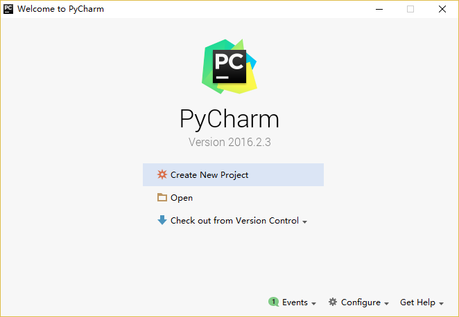
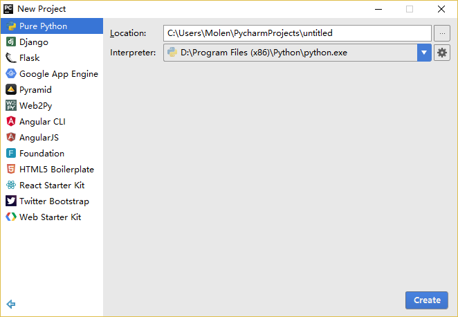
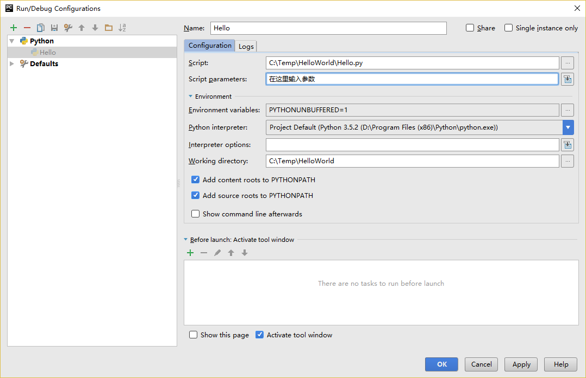

# 简明 Python 教程

《A Byte of Python》是一本由 **Swaroop C H** 编写，旨在于介绍如何使用 Python 语言进行编程的自由图书。它以教材与指南的形式为入门者介绍 Python 语言。如果你对电脑知识的了解仅限于如何保存文本文件的话，那这本书就是为你准备的。

2005 年，**沈洁元**将本书的 1.20 版引进中国，并完成了全本翻译，将本书的译名定为《简明 Python 教程》。2017年，**漠伦**基于原书 4.0 版重新翻译，制作了本版全新译本，并沿用同样的译名。

本版译本定义为 4.08c 版。最后修订于 2018 年 2 月 4 日。

# 关于 Python

**Python** 是一种极少数能声言兼具 _简单_ 与 _功能强大_ 的编程语言。你将惊异于发现你正在使用的这门编程语言是如此简单，它专注于如何解决问题，而非拘泥于语法与结构。

官方对 Python 的介绍如下：

> Python 是一款易于学习且功能强大的编程语言。 它具有高效率的数据结构，能够简单又有效地实现面向对象编程。Python 简洁的语法与动态输入之特性，加之其解释性语言的本质，使得它成为一种在多种领域与绝大多数平台都能进行脚本编写与应用快速开发工作的理想语言。

我将会在下一节详细讨论这些特性。

## 名字背后的故事

**Python** 的创造者吉多·范罗苏姆（Guido van Rossum）采用 BBC 电视节目《蒙提·派森的飞行马戏团（Monty Python's Flying Circus，一译巨蟒剧团）》的名字来为这门编程语言命名。尽管他本人并不特别喜欢蟒蛇这种通过在猎物身边卷曲自己的身体以此来碾碎猎物身体来进食的动物。

## Python 的特色

### 简单

**Python** 是一门简单且简约的语言。阅读一份优秀的 **Python** 程序代码就如同在阅读英语文章一样，尽管这门英语要求十分严格！**Python** 这种伪代码式的特质正是它的一大优势。它能够让你专注于解决问题的方案，而不是语言本身。

### 易于学习

正如你接下来将看到的，**Python** 是一门非常容易入门的语言。正如前面所提到的，**Python** 有一套极其简单的语法体系。

### 自由且开放

**Python** 是 **FLOSS** （自由/开放源代码软件）的成员之一。简单来说，你可以自由地分发这一软件的拷贝，阅读它的源代码，并对其作出改动，或是将其的一部分运用于一款新的自由程序中。**FLOSS** 基于一个可以分享知识的社区理念而创建。这正是 Python 为何能如此优秀的一大原因——它由一群希望看到 **Python** 能变得更好的社区成员所创造，并持续改进至今。

### 高级语言

当你在用 **Python** 编写程序时，你不必考虑诸如你的程序应当如何使用内存等底层细节。

### 跨平台性

由于其开放源码的特性，**Python** 已被移植到其它诸多平台（意即它们已经过改动以保证其能正常工作）。如果你小心地避开了所有系统依赖型的特性。你所有的 **Python** 程序可以在其中任何一个平台上工作，不必作出任何改动。

你可以在 GNU/Linux、Windows、FreeBSD、Macintosh、 Solaris、 OS/2、 Amiga、 AROS、 AS/400、 BeOS、 OS/390、 z/OS、 Palm OS、 QNX、 VMS、 Psion、 Acorn RISC OS、 VxWorks、 PlayStation、 Sharp Zaurus、 Windows CE 以及 PocketPC 平台上运行 Python！

你甚至可以通过诸如 [Kivy](http://kivy.org) 一类的平台来制作可在你的电脑 _以及_ iPhone、iPad 或安卓手机上运行的游戏。

### 解释性

有关这一特性，需要一些详细的解释。

在你使用诸如 C 或 C\++ 等编译语言编写程序时，需要将这些语言的源代码通过编译程序配合其中不同的标记（Flags）与选项，来将它们转换成你的电脑所使用的语言（例如 0 与 1 构成的二进制码）。当你运行这些程序时，链接程序或载入程序将会从硬盘中将程序拷贝至内存中并将其运行。

另一方面，**Python** 不需要将其编译成二进制码。你只需要直接从源代码 _运行_ 该程序。在程序内部，**Python** 会将源代码转换为称为字节码的中间形式，尔后再转换成你的电脑所使用的语言，并运行它。实际上，这一流程使得 **Python** 更加易于使用，你不必再担心该如何编译程序，或如何保证适当的库被正确的链接并加载等等步骤。这也同样使得 **Python** 程序更便携且易于迁移，你只需要将 **Python** 程序拷贝到另一台电脑便可让它立即开始工作！

### 面向对象

**Python** 同时支持面向过程编程与面向对象编程。在 _面向过程_ 的编程语言中，程序是由仅仅带有可重用特性的子程序与函数所构建起来的。在 _面向对象_ 的编程语言中，程序是由结合了数据与功能的对象所构建起来的。与 C++ 或 Java 这些大型语言相比，**Python** 具有其特别的、功能强大又简单的方式来实现面向对象编程。

### 可扩展性

如果你需要代码的某一重要部分能够快速地运行，或希望算法的某些部分不被公开，你可以在 C 或 C\++ 语言中编写这些程序，然后再将其运用于你的 **Python** 程序中。

### 可嵌入性

你可以在你的 C 或 C\++ 程序中嵌入 **Python**，从而向你的程序用户提供 _脚本_ 功能。

### 丰富的库

实际上 Python 标准库的规模非常庞大。它能够帮助你完成诸多事情，包括正则表达式、文档生成、单元测试、多线程、数据库、网页浏览器、CGI、FTP、邮件、XML、XML-RPC、HTML、WAV 文件、密码系统、GUI（图形用户界面），以及其它系统依赖型的活动。只需记住，只要安装了 Python，这些功能便随时可用。它们的存在被称作 Python _自备电池（Batteries Included）_ 式的哲学。

除了标准库以外，你还可以在 [Python 库索引（Python Package Index）](http://pypi.python.org/pypi) 中发掘许多其它高质量的库。

### 总结

**Python** 着实是一门令人心生激动且强大的语言。它得当地结合了性能与功能，使得编写 **Python** 程序是如此简易又充满乐趣。

### Python 3 VS Python 2

如果你对“Python 2”与“Python 3”之间的区别不感兴趣你可以略过本段。但务必注意你正在使用的版本。本书是以 **Python 3** 为对象撰写的。

只消记住一旦你正确理解并学习了其中一个版本的 Python，你便可以很容易地理解另一版本的区别，并能快速学习如何使用。困难的是学习如何编程以及理解 Python 语言本身的基础部分。这便是我们在本书中的目标，而一旦你达成了目标，你便可以根据你的实际情况，决定是该使用 Python 2 还是 Python 3。

要想了解有关 Python 2 和 Python 3 之间的区别的更多细节，你可以参阅：

- [The future of Python 2](http://lwn.net/Articles/547191/)
- [Porting Python 2 Code to Python 3](https://docs.python.org/3/howto/pyporting.html)
- [Writing code that runs under both Python2 and 3](https://wiki.python.org/moin/PortingToPy3k/BilingualQuickRef)
- [Supporting Python 3: An in-depth guide](http://python3porting.com)

### 程序员怎么说

或许你在阅读诸如 ESR 等伟大的黑客是如何讨论 Python 时会有些有趣的发现：

- _埃里克·雷蒙（Eric S. Raymond）_ 是《大教堂和市集（The Cathedral and the Bazaar）》的作者，同时也是 _开放源代码促进会_ 的创始人之一。他曾说[Python 已成为他所喜爱的一门编程语言](http://www.python.org/about/success/esr/)。这篇文章给了我接触 Python 的最先鼓舞。
- _布鲁斯·埃克尔（Bruce Eckel）_ 是《Java 编程思想（Thinking in Java）》与《C++ 编程思想（Thinking in C++）》的作者。他说没有一种编程语言能像 Python 这样使他更加高产。他说或许 Python 是唯一一门面向程序员且致力于使事情变得更加容易的语言。阅读 [完整采访](http://www.artima.com/intv/aboutme.html) 以了解更多细节。
- _彼得·诺米格（Peter Norvig）_ 是广为人知的 Lisp 作者，同时也是 Google 公司的搜索质量总监（Director of Search Quality，感谢吉多·范罗苏姆指出这一点）。他说[写 Python 时就好像在写伪代码](https://news.ycombinator.com/item?id=1803815)。他还说 Python 一直是构成 Google 整体的重要部分。你可以通过浏览 [Google Jobs](http://www.google.com/jobs/index.html) 页面并发现“Python 知识”是软件工程师所须具备的一项要求来验证这一说法。

# 安装

我们在本书中提及“Python 3”时，我们指的是任何大于等于 `3.6.8` 的 Python 发行版。[^1]

## 在 Windows 中安装

访问 https://www.python.org/downloads/ 并下载最新版本的 Python。在本书撰写的时点，最新版本为 Python 3.8.2。其安装过程与其它 Windows 平台的软件的安装过程无异。

注意：请务必确认你勾选了 `Add Python 3.6 to PATH` 选项。

若要想改变安装位置，勾选 `Customize installation` 选项，点击 `Next` 后在安装位置中输入 `C:\python36` 。

如未勾选相关选项，你可以点击 `Add Python to environment variables` 。它和安装程序第一屏的 `Add Python 3.6 to PATH` 能起到相同效果。

你可以选择是否为所有用户安装启动器，这不会产生多大影响。启动器用以切换已安装的不同版本的 Python。

如果你的环境变量（Path）未正确设置，可以遵循上述步骤予以修正。否则，请参阅 `在 Windows 中运行 Python 提示符` 。

注意：对于那些对编程有所了解的人，如果你熟悉 Docker，可以参阅 [Python in Docker](https://hub.docker.com/_/python/) 和 [Docker on Windows](https://docs.docker.com/windows/)。

### DOS 提示符 {#dos-prompt}

如果你希望在 Windows 命令行使用 Python，比如 DOS 提示符，你需要设置相应的PATH 环境变量。

对于 Windows 2000，XP，2003，点击 `控制面板` → `系统` → `高级` → `环境变量` 。点击 _系统变量_ 选项卡下名为 `PATH` 的变量，选择 `编辑` 并在已存在的字符串末尾添加 `;C:\Python36` （请确保该文件夹确实存在，对于更新版本的 Python 文件夹的名字可能有所不同）。当然，你应该使用恰当的目录名称。

<!-- 该目录应与 book.json 中的 pythonVersion 变量相匹配-->
对于更古老的 Windows 系统版本，打开文件 `C:\AUTOEXEC.BAT` 并在其中添加一行 `PATH=%PATH%;C:\Python36` ，完成编辑并保存后，你需要重启系统。对于 Windows NT 系统，则对应 `AUTOEXEC.NT` 文件。

对于 Windows Vista：

- 点击开始并选择 `控制面板`  。
- 点击系统，在右侧你将会看见“浏览你的计算机的基本信息”
- 左侧将由一个任务列表，最后一个即为“高级系统设置”，点击它。
- `高级` 标签栏下可以看见 `系统属性` 对话框。
- 在较低位置的名为 `系统变量` 的对话框，向下滚动至变量部分并点击 `编辑` 按钮。
- 修改你需要改动的变量。
- 重启系统。Vista 直至重启前都不会应用系统变量环境的改动。

对于 Windos 7 与 10：

- 在桌面右击计算机并选择 `属性` 或点击 `开始` 并选择 `控制面板` → `系统与安全` → `系统` 。点击左侧的 `高级系统设置` 并选择 `高级` 标签。点击底部 `系统变量` 下的 `环境变量` ，找到 `PATH` 属性，将其选中并点击 `编辑` 。
- 前往变量值的最后一行并添加 `;C:\Python36` （请确保该文件夹确实存在，对于更新版本的 Python 文件夹的名字可能有所不同）至业已存在的部分的后方。当然，你应该使用恰当的目录名称。
- 如果该变量值为 `%SystemRoot%\system32;` 则在修改后其应变为 `%SystemRoot%\system32;C:\Python36` 。<!-- 该目录应与 book.json 中的 pythonVersion 变量相匹配-->
- 点击 `确定` 以完成操作。你不需要进行重启，不过你可能需要关闭并重启命令提示符。

### 在 Windows 下运行 Python 命令提示符

对于 Windows 用户来说，如果你已经正确并恰当地[设置了 `PATH ` 变量](#dos-prompt)，你可以在命令行中运行解释程序。

要想在 Windows 中运行终端，点击开始并点击 `运行` 。在对话中输入 `cmd` 并按下回车键。

然后，输入 `python` 以确保其没有任何错误。

## 在 Mac OS 下安装

对于 Mac OS X 用户，你可以使用 [Homebrew](http://brew.sh) 并通过命令 `brew install python3` 进行安装。

要想验证安装是否成功，你可以通过按键 `[Command + Space]` （以启动 Spotlight 搜索），输入 `Terminal` 并按下 `[enter]` 键来启动终端程序。现在，试着运行 `python3` 来确保其没有任何错误。

## 在 GNU/Linux 下安装

对于 GNU/Linux 用户，你可以使用发行版的包管理器来安装 Python 3，例如在 Debian 与 Ubuntu 平台下，你可以输入命令：`sudo apt-get update && sudo apt-get install python3` 。

要想验证安装是否成功，你可以通过打开 `Terminal` 应用或通过按下 `Alt + F2` 组合键并输入 `gnome-terminal` 来启动终端程序。如果这不起作用，请查阅你所使用的的 GNU/Linux 发行版的文档。现在，运行 `python3` 命令来确保其没有任何错误。

你会看到在运行命令后 Python 的版本信息显示在屏幕上：

<!-- 输出内容应与 book.json 中的 pythonVersion 变量相匹配-->

```bash
$ python -V
Python 3.6.8
```

附注：`$` 是 Shell 的提示符。根据你电脑所运行的操作系统的设置的不同，它也会有所不同，在之后的内容中我会使用 `$` 符号来代表提示符。

注意：输出的内容会因你的电脑而有所不同，其取决于你在你的电脑上安装的 Python 版本。

## 总结

从现在起，我们将假定你已经在你的系统中安装了 Python。

接下来，我们将要撰写我们的第一个 Python 程序。

---

[^1]: 本书采用 Python 3.5.1 用来讲授，但最新版本 Python 已非此版本。在翻译时遵从原书内容继续沿用 Python 3.5.1 版本，请读者自行代换为最新版本。
# 第一步

接下来我们将看见如何在 **Python** 中运行一个传统的“`Hello World`”程序。本章将会教你如何编写、保存与运行 **Python** 程序。

通过 **Python** 来运行的你的程序有两种方法——使用交互式解释器提示符或直接运行一个源代码文件。我们将了解如何使用他们二者的功能。

## 使用解释器提示符

在你的操作系统中打开终端（**Terminal**）程序（正如我们先前在 [安装](./installation.md#installation) 章节所讨论过的那样）然后通过输入 `python3` 并按下 `[enter]` 键来打开 **Python** 提示符（Python Prompt）。

当你启动 **Python** 后，你会看见在你能开始输入内容的地方出现了 `>>>` 。这个被称作 _Python 解释器提示符（Python Interpreter Prompt）_ 。

在 Python 解释器提示符，输入：

```python
print("Hello World")
```

在输入完成后按下 `[enter]` 键。你将会看到屏幕上打印出 `Hello World` 字样。

下面是一个在 Mac OS X 电脑上你能够看见的结果的示例。有关 Python 软件的细节将会因为你使用的电脑而有所不同，但是从提示符（如 `>>>` ）开始部分应该是相同的，而不会受到操作系统的影响。

```python
> python3
Python 3.6.8 (default, Aug  7 2019, 17:28:10) 
[GCC 4.8.5 20150623 (Red Hat 4.8.5-39)] on linux
Type "help", "copyright", "credits" or "license" for more information.
>>> print("Hello World")
Hello World
```

你自然会注意到，Python 会立即给你输出了一行结果！你刚才所输入的便是一句独立的 **Python** _语句_ 。我们使用 `print` （不必太过惊讶）命令来打印你所提供的信息。在这里，我们提供了文本 `Hello World` ，然后它便被迅速地打印到了屏幕上。

### 如何退出解释器提示符

如果你正在使用一款 GNU/Linux 或 OS X 上的 Shell 程序，你可以通过按下 `[ctrl + d]` 组合键或是输入 `exit()` （注意：要记住要包含括号 `()`）并敲下 `[enter]` 来退出解释器提示符。

如果你使用的是 Windows 命令提示符，可以按下 `[ctrl + z]` 组合键并敲击 `[enter]` 键来退出。

## 选择一款编辑器

当我们希望运行某些程序时，总不能每次都在解释器提示符中输入我们的程序。因此我们需要将它们保存为文件，从而我们便可以多次地运行这些程序。

要想创建我们的 Python 源代码文件，我们需要一款能够让你输入并保存代码的编辑器软件。一款优秀的面向程序员的编辑器能够帮助你的编写源代码文件工作变得轻松得多。故而选择一款编辑器确实至关重要。你要像挑选你想要购买的汽车一样挑选你的编辑器。一款优秀的编辑器能够帮助你更轻松地编写 Python 程序，使你的编程之旅更加舒适，并助你找到一条更加安全且快速的道路到达你的目的地（实现你的目标）。

对编辑器的一项最基本要求为 _语法高亮_ ，这一功能能够通过标以不同颜色来帮助你区分 Python 程序中的不同部分，从而能够让你更好 _看清_ 你的程序，并使它的运行模式更加形象化。

如果你对应从哪开始还没有概念，我推荐你使用 [PyCharm 教育版](https://www.jetbrains.com/pycharm-edu/) 软件，它在 Windows、Mac OS X、GNU/Linux 上都可以运行。在下一节你能够了解到更多信息。

如果你正在使用 Windows 系统，**不要用记事本**——这是一个很糟糕的选择，因为它没有语法加亮功能，同样重要的另一个原因是，它不支持文本缩进功能，这一功能我们之后将会了解它究竟有多重要。而一款好的编辑器能够自动帮你完成这一工作。

如果你已是一名经验丰富的程序员，那你一定在用 [Vim](http://www.vim.org) 或 [Emacs](http://www.gnu.org/software/emacs/) 了。无需多言，它们都是最强大的编辑器之一，用它们来编写你的 Python 程序自是受益颇多。我个人用它们来编写了我大部分程序，同时也因此写了一本书《[Entire Book on Vim]({{ book.vimBookUrl }})》。

或许你有意去花费时间来学习 **Vim** 或 **Emacs**，那么我自是强烈推荐你学习它们二者中的一款，它们将在长远意义上对你裨益颇深。当然，正如我先前所推荐的，初学者可以以 **PyCharm** 开始，从而在此刻专注于学习 **Python** 而不是编辑器。

再此重申，请选择一款合适的编辑器——它能够让编写 Python 程序变得更加有趣且容易。

## PyCharm {#pycharm}

[PyCharm 教育版](https://www.jetbrains.com/pycharm-edu/)是一款能够对你编写 Python 程序的工作有所帮助的免费编辑器。

当你打开 **PyCharm** 时，你会看见如下界面，点击 `Create New Project` ：



选择 `Pure Python` ：



将你的项目路径位置中的 `untitled` 更改为 `helloworld` ，你所看到的界面细节应该类似于下方这番：


点击 `Create` 按钮。

对侧边栏中的 `helloworld` 右击选中，并选择 `New` -> `Python File` ：


你会被要求输入名字，现在输入 `hello` ：


现在你便可以看见一个新的文件已为你开启：


删除那些已存在的内容，现在由你自己输入以下代码：

<!-- TODO: Update screenshots for Python 3 -->

```python
print("hello world")
```
现在右击你所输入的内容（无需选中文本），然后点击 `Run 'hello'` 。


此刻你将会看到你的程序所输出的内容（它所打印出来的内容）：


嚯！虽然只是刚开始的几个步骤，但从今以后，每当我们要求你创建一个新的文件时，记住只需在 `helloworld` 上右击并选择 -> `New` -> `Python File` 并继续如上所述步骤一般输入内容并运行即可。

你可以在 [PyCharm Quickstart](https://www.jetbrains.com/pycharm-educational/quickstart/) 页面找到有关 **PyCharm** 的更多信息。

## Vim

1. 安装 [Vim](http://www.vim.org)。
    * Mac OS X 应该通过 [HomeBrew](http://brew.sh/) 来安装 `macvim` 包。
    * Windows 用户应该通过 [Vim 官方网站](http://www.vim.org/download.php) 下载“自安装可执行文件”。
    * GNU/Linux  用户应该通过他们使用的发行版的软件仓库获取 Vim。例如 Debian 与 Ubuntu 用户可以安装 `vim` 包。
2. 安装 [jedi-vim](https://github.com/davidhalter/jedi-vim) 插件为 Vim 增添自动完成功能。
3. 安装与之相应的 `jedi` Python 包：`pip install -U jedi`

## Emacs

1. 安装 [Emacs 24+](http://www.gnu.org/software/emacs/)。
    * Mac OS X 用户应该从 http://emacsformacosx.com 获取 Emacs。
    * Windows 用户应该从 http://ftp.gnu.org/gnu/emacs/windows/ 获取 Emacs。
    * GNU/Linux 用户应该从他们使用的发行版的软件仓库获取 Emacs。如 Debian 和 Ubuntu 用户可以安装 `emacs24` 包。
2. 安装 [ELPY](https://github.com/jorgenschaefer/elpy/wiki)。

## 使用一份源代码文件

现在让我们回到编程中来。在你学习一门新的编程语言时有一项传统，你所编写并运行的第一个程序应该是 “Hello World” 程序——它所做的全部工作便是宣言你所运行的“Hello World”这句话。正如西蒙·科泽斯（Simon Cozens，一译西蒙·寇森斯） [^2] 所说，这是“向编程之神所称颂的传统咒语，愿他帮助并保佑你更好的学习这门语言”。

启动你所选择的编辑器，输入如下程序并将它保存为 `hello.py` 。

如果你正在使用 **PyCharm**，我们已经讨论过[如何从源文件中运行它了](#pycharm)。

对于其它编辑器，打开一个新文件名将其命名为 `hello.py` ，然后输入如下内容：

```python
print("hello world")
```

你应当将文件保存到哪里？保存到任何你知道其位置与路径的文件夹。如果你不了解这句话是什么意思，那就创建一个新文件夹并用这一路径来保存并运行你所有的 Python 程序：

- Mac OS X 上的 `/tmp/py` 。
- GNU/Linux 上的 `/tmp/py` 。
- Windows 上的 `C:\\py` 。

要想创建上述文件夹（在你正在使用的操作系统上），你可以在终端上使用 `mkdir` 命令，如 `mkdir /tmp/py` 。

重要提示：你需要经常确认并确保你为文件赋予了 `.py` 扩展名，例如 `foo.py` 。

要想运行你的 Python 程序：

1. 打开终端窗口（你可查阅先前的 [安装](./installation.md#installation)章节来了解应该怎么做）。
2. 使用 `cd` 命令来**改**变**目**录到你保存文件的地方，例如 `cd /tmp/py` 。
3. 通过输入命令 `python hello.py` 来运行程序。程序的输出结果应如下方所示：

```
$ python hello.py
hello world
```


如果你得到了与上图类似的输出结果，那么恭喜你！——你已经成功运行了你的第一个 Python 程序。你亦已经成功穿过了学习编程的最困难的部分，也就是，开始编写你的第一个程序！

如果你遭遇了什么错误，请确认是否已经_正确地_输入了上面所列出的内容，并尝试重新运行程序。要注意 Python 是区分大小写的，如 `print` 和 `Print` 是不同的——注意前者的 p 是小写的，而后者的 P 是大写的。此外，你需要确保每一行的第一个字符前面都没有任何空格或制表格——我们会在后面了解 [为什么这件事如此重要](./07.basics.md#indentation)。

**它是如何工作的**

一款 Python 程序是由 _语句_ 所构成的。在我们的第一个程序中，我们只有一条语句。在这条语句中，我们调用 `print` _语句_ 来搭配我们提供的文本”`hello world`“。

## 获取帮助

如果你需要获得 Python 中有关任何函数或语句的快速信息，你可以使用其内置的 `help` 功能。这在使用解释器提示符时十分有用。例如，运行 `help('len')` 命令——这将显示出有关 `len` 函数的帮助，了解其是用来计算项目数量的。

小贴士：按下 `q` 键可以退出帮助。

类似地，你可以通过此方式获得几乎所有有关 Python 的信息。使用 `help()` 命令来了解有关 `help` 它本身的更多信息吧！

如果你需要获得有关 `return` 这类运算符的帮助，你需要做的就是将它们放在引号中，就像 `help('return')` 这般，这样 Python 就不会混淆我们正在试图做的事情。

## 总结

现在，你应该可以轻松地编写、保存并运行 Python 程序了。

从此你便成为一名 Python 用户了，现在让我们来学习更多有关 Python 的概念。

---

[^2]: 令人印象深刻的《Beginning Perl》一书的作者。——原书注。在本书中，除特别说明的注释外，其余注释均为译者所加。
# 基础

只是打印出 `hello world` 肯定是不够的，是吗？你会希望做得比这还要多——你想要输入一些内容，操纵它，然后从中得到一些输出出来的内容。我们可以在 Python 中通过使用变量与常量来实现这一目标，在本章中我们还会学习其它的一些概念。[^3]

## 注释

_注释_  是任何存在于 `#` 号右侧的文字，其主要用作写给程序读者看的笔记。

举个例子：

```python
print('hello world') #注意到 print 是一个函数
```

或者：

```python
# 注意到 print 是一个函数
print('hello world')
```

你应该在你的程序中尽可能多地使用有用的注释：

- 解释假设
- 说明重要的决定
- 解释重要的细节
- 说明你想要解决的问题
- 说明你想要在程序中克服的问题，等等。

[*代码会告诉你怎么做，注释会告诉你为何如此。*](http://www.codinghorror.com/blog/2006/12/code-tells-you-how-comments-tell-you-why.html)

这样做对你的程序的读者来说非常有用，他们可以很容易地理解你的程序是做什么的。请记住，这个人可以是六个月后的你！

## 字面常量 

一个字面常量（Literal Constants）[^4]的例子是诸如 `5`、`1.23` 这样的数字，或者是如 `这是一串文本` 或 `This is a string` 这样的文本。

用这样的称呼是因为它们是 _字面上的_ [^5]——你用的就是它字面意义上的值或是内容。数字 `2` 总是表示它本身而非其他含义——它是一个 _常量_，因为它的值不能被改变。因此，所有的这些都被称作字面常量。

## 数字

数字主要分为两种类型——整数（Integers）与浮点数（Floats）。

有关整数的例子即 `2`，它只是一个整数。

有关浮点数（Floating Point Numbers，在英文中也会简写为 _floats_ ）的例子是 `3.23` 或 `52.3E-4`。其中，`E` 表示 10 的幂。在这里，`52.3E-4` 表示 `52.3 * 10^-4`。

> **针对有经验的程序员的提示**
> 
> 没有单独的 `long` 类型。`int` 类型可以指任何大小的整数。

## 字符串

一串字符串（String）是 _字符（Characters）_ 的 _序列（Sequence）_。基本上，字符串就是一串词汇。

你将会在几乎所有你撰写的 Python 程序中使用字符串，所以对下面的部分你要多上点心。

### 单引号

你可以使用单引号来指定字符串，例如 `'将我这样框进来'` 或 `'Quote me on this'` 。

所有引号内的空间，诸如空格与制表符，都将按原样保留。

### 双引号

被双引号包括的字符串和被单引号括起的字符串其工作机制完全相同。例如 `"你的名字是？"` 或 `"What's your name?"` 。

### 三引号

你可以通过使用三个引号——`"""` 或 `'''` 来指定多行字符串。你可以在三引号之间自由地使用单引号与双引号。来看看这个例子：

```python
'''这是一段多行字符串。这是它的第一行。
This is the second line.
"What's your name?," I asked.
He said "Bond, James Bond."
'''
```

### 字符串是不可变的

这意味着一旦你创造了一串字符串，你就不能再改变它。尽管这看起来像是一件坏事，但实际上并非如此。我们将会在稍后展现的多个程序中看到为何这一点不是一个限制。

> **针对 C/C++ 程序员的提示**
> 
> Python 中没有单独的 `char` 数据类型。它并非切实必要，并且我相信你不会想念它的。


<!-- -->

> **针对 Perl/PHP 程序员的提示**
> 
> 记住单引号括起的字符串和双引号括起的字符串是一样的——它们不存在任何区别。

### 格式化方法

有时候我们会想要从其他信息中构建字符串。这正是 `format()` 方法大有用武之地的地方。

将以下内容保存为文件 `str_format.py` ：

```python
age = 20
name = 'Swaroop'

print('{0} was {1} years old when he wrote this book'.format(name, age))
print('Why is {0} playing with that python?'.format(name))
```

输出：

```bash
$ python str_format.py
Swaroop was 20 years old when he wrote this book
Why is Swaroop playing with that python?
```

**它是如何工作的**

一个字符串可以使用某些特定的格式（**Specification**），随后，`format` 方法将被调用，使用这一方法中与之相应的参数替换这些格式。

在这里要注意我们第一次应用这一方法的地方，此处 `{0}` 对应的是变量 `name`，它是该格式化方法中的第一个参数。与之类似，第二个格式 `{1}` 对应的是变量 `age`，它是格式化方法中的第二个参数。请注意，**Python** 从 0 开始计数，这意味着索引中的第一位是 0，第二位是 1，以此类推。

我们可以通过联立字符串来达到相同的效果：

```python
name + 'is' +str(age) + 'years old'
```

但这样实现是很丑陋的，而且也容易出错。其次，转换至字符串的工作将由 `format` 方法自动完成，而不是如这般需要明确转换至字符串。再次，当使用 `format` 方法时，我们可以直接改动文字而不必与变量打交道，反之亦然。

同时还应注意数字只是一个可选选项，所以你同样可以写成：

```python
age = 20
name = 'Swaroop'

print('{} was {} years old when he wrote this book'.format(name, age))
print('Why is {} playing with that python?'.format(name))
```

这样做同样能得到与前面的程序一样的输出结果。

**Python** 中 `format` 方法所做的事情便是将每个参数值替换至格式所在的位置。这之中可以有更详细的格式，例如：

```python
# 对于浮点数 '0.333' 保留小数点(.)后三位
print('{0:.3f}'.format(1.0/3))
# 使用下划线填充文本，并保持文字处于中间位置
# 使用 (^) 定义 '___hello___'字符串长度为 11
print('{0:_^11}'.format('hello'))
# 基于关键词输出 'Swaroop wrote A Byte of Python'  
print('{name} wrote {book}'.format(name='Swaroop', book='A Byte of Python'))
```

输出：

```
0.333
___hello___
Swaroop wrote A Byte of Python
```

由于我们正在讨论格式问题，就要注意 `print` 总是会以一个不可见的“新一行”字符（`\n`）结尾，因此重复调用 `print`将会在相互独立的一行中分别打印。为防止打印过程中出现这一换行符，你可以通过 `end` 指定其应以空白结尾：

```python
print('a', end='')
print('b', end='')
```

输出结果如下：

```
ab
```

或者你通过 `end` 指定以空格结尾：

```python
print('a', end=' ')
print('b', end=' ')
print('c')
```

输出结果如下：

```
a b c
```

### 转义序列

想象一下，如果你希望生成一串包含单引号（`'`）的字符串，你应该如何指定这串字符串？例如，你想要的字符串是 `"What's your name?"`。你不能指定 `'What's your name?'`，因为这会使 Python 对于何处是字符串的开始、何处又是结束而感到困惑。所以，你必须指定这个单引号不代表这串字符串的结尾。这可以通过 _转义序列（Escape Sequence）_ 来实现。你通过 `\` 来指定单引号：要注意它可是反斜杠。现在，你可以将字符串指定为 `'What\'s your name?'`。

另一种指定这一特别的字符串的方式是这样的： `"What's your name?"` ，如这个例子般使用双引号。类似地， 你必须在使用双引号括起的字符串中对字符串内的双引号使用转义序列。同样，你必须使用转义序列 `\\` 来指定反斜杠本身。

如果你想指定一串双行字符串该怎么办？一种方式即使用[如前所述](#triple-quotes)的三引号字符串，或者你可以使用一个表示新一行的转义序列——`\n` 来表示新一行的开始。下面是一个例子：

```python
'This is the first line\nThis is the second line'
```

另一个你应该知道的大有用处的转义序列是制表符：`\t` 。实际上还有很多的转义序列，但我必须只在此展示最重要的一些。

还有一件需要的事情，在一个字符串中，一个放置在末尾的反斜杠表示字符串将在下一行继续，但不会添加新的一行。来看看例子：

```python
"This is the first sentence. \
This is the second sentence."
```

相当于

```python
"This is the first sentence. This is the second sentence."
```

### 原始字符串

如果你需要指定一些未经过特殊处理的字符串，比如转义序列，那么你需要在字符串前增加 `r` 或 `R` 来指定一个 _原始（Raw）_ 字符串[^6]。下面是一个例子：

```python
r"Newlines are indicated by \n"
```

> **针对正则表达式用户的提示**
> 
> 在处理正则表达式时应全程使用原始字符串。否则，将会有大量 Backwhacking 需要处理。举例说明的话，反向引用可以通过 `'\\1'` 或 `r'\1' ` 来实现。

## 变量

如果只使用字面常量很快就会让人感到无聊——我们需要一些能够存储任何信息并且也能操纵它们的方式。这便是 _变量（Variables）_ 登场的时刻。正如其名字所述那般，变量的值是可以变化的，也就是说，你可以用变量来存储任何东西。变量只是你的计算机内存中用以存储信息的一部分。与文字常量不同，你需要通过一些方式来访问这些变量，因此，你需要为它们命名。

## 标识符命名

变量是标识符的一个例子。_标识符（Identifiers）_ 是为 _某些东西_ 提供的给定名称。在你命名标识符时，你需要遵守以下规则：

- 第一个字符必须是字母表中的字母（大写 ASCII 字符或小写 ASCII 字符或 Unicode 字符）或下划线（`_`）。
- 标识符的其它部分可以由字符（大写 ASCII 字符或小写 ASCII 字符或 Unicode 字符）、下划线（`_`）、数字（0~9）组成。
- 标识符名称区分大小写。例如，`myname` 和 `myName` 并_不_等同。要注意到前者是小写字母 `n` 而后者是大写字母 `N`。
- _有效_ 的标识符名称可以是 `i` 或 `name_2_3` ，_无效_ 的标识符名称可能是 `2things`，`this is spaced out`，`my-name` 和 `>a1b2_c3`。

## 数据类型

变量可以将各种形式的值保存为不同的_数据类型（Data Type）_。基本的类型是我们已经讨论过的数字与字符串。在后面的章节中，我们会了解如何通过 [类（Classes）](./14.oop.md#classes) 类创建我们自己的类型。

## 对象

需要记住的是，Python 将程序中的任何内容统称为 _对象（Object）_。这是一般意义上的说法。我们以“_某某对象（object）_”相称，而非“_某某东西（something）_”。

> **针对面向对象编程语言用户的提示：**
> 
> **Python** 是强（Strongly）面向对象的，因为所有的一切都是对象， 包括数字、字符串与函数。

接下来我们将看见如何使用变量与字面常量。你需要保存以下案例并试图运行程序。

## 如何编写 Python 程序

从今以后，保存和运行 Python 程序的标准步骤如下：

### 对于 PyCharm 用户

1. 打开 [PyCharm](./06.first_steps.md#pycharm)。
2. 以给定的文件名创建新文件。
3. 输入案例中给出的代码。
4. 右键并运行当前文件。

注意：每当你需要提供 [命令行参数（Command Line Arguments）](./11.modules.md#modules)时，点击 `Run` -> `Edit Configurations` 并在 `Script parameters:` 部分输入相应参数，并点击 `OK` 按钮：



### 对于其他编辑器用户

1. 打开你选择的编辑器。
2. 输入案例中给出的代码。
3. 以给定的文件名将其保存成文件。
4. 在解释器中通过命令 `python program.py` 来运行程序。

### 案例：使用变量与字面常量

输入并运行以下程序：

```python
# 文件名：var.py
i = 5
print(i)
i = i + 1
print(i)

s = '''This is a multi-line string.
This is the second line.'''
print(s)
```

输出：

```bash
5
6
This is a multi-line string.
This is the second line.
```

**它是如何工作的**

下面是这一程序的工作原理。首先，我们使用赋值运算符（`=`）将字面常量数值 `5` 赋值给变量 `i`。这一行被称之为声明语句（Statement）因为其工作正是声明一些在这一情况下应当完成的事情：我们将变量名 `i` 与值 `5` 相连接。然后，我们通过 `print` 语句来打印变量 `i` 所声明的内容，这并不奇怪，只是将变量的值打印到屏幕上。

接着，我们将 `1` 加到 `i` 变量所存储的值中，并将得出的结果重新存储进这一变量。然后我们将这一变量打印出来，并期望得到的值应为 `6`。

类似地，我们将字面文本赋值给变量 `s`，并将其打印出来。

> **针对静态编程语言程序员的提示**
> 
> 变量只需被赋予某一值。不需要声明或定义数据类型。

## 逻辑行与物理行

所谓物理行（Physical Line）是你在编写程序时 _你所看到_ 的内容。所谓逻辑行（Logical Line）是 _Python 所看到_ 的单个语句。Python 会假定每一 _物理行_ 会对应一个 _逻辑行_。

有关逻辑行的一个例子是诸如 `print('hello world')` 这样一句语句——如果其本身是一行（正如你在编辑器里所看到的那样），那么它也对应着一行物理行。

Python 之中暗含这样一种期望：Python 鼓励每一行使用一句独立语句从而使得代码更加可读。

如果你希望在一行物理行中指定多行逻辑行，那么你必须通过使用分号(`;`)来明确表明逻辑行或语句的结束。下面是一个例子：

```python
i = 5
print(i)
```

实际上等同于

```python
i = 5;
print(i);
```

同样可以看作

```python
i = 5; print(i);
```

也与这一写法相同

```python
i = 5; print(i)
```

然而，我*强烈建议*你**对于每一行物理行最多只写入一行逻辑行**。这个观点就是说你不应该使用分号。实际上，我_从未_在 Python 程序中使用、甚至是见过一个分号。

在一类情况下这一方法会颇为有用：如果你有一行非常长的代码，你可以通过使用反斜杠将其拆分成多个物理行。这被称作_显式行连接（Explicit Line Joining）_[^5]：

```python
s = 'This is a string. \
This continues the string.'
print(s)
```

输出：

```
This is a string. This continues the string.
```

类似地，

```python
i = \
5
```

等同于

```python
i = 5
```

在某些情况下，会存在一个隐含的假设，允许你不使用反斜杠。这一情况即逻辑行以括号开始，它可以是方括号或花括号，但不能是右括号。这被称作 *隐式行连接（Implicit Line Joining）*。你可以在后面当我们讨论[列表（List）](./12.data_structures.md#lists)的章节时了解这一点。

## 缩进

空白区[^7]在 Python 中十分重要。实际上，*空白区在各行的开头非常重要*。这被称作 _缩进（Indentation）_。在逻辑行的开头留下空白区（使用空格或制表符）用以确定各逻辑行的缩进级别，而后者又可用于确定语句的分组。

这意味着放置在一起的语句_必须_拥有相同的缩进。每一组这样的语句被称为 *块（block）*。我们将会在后文章节的案例中了解块这一概念是多么重要。

有一件事你需要记住：错误的缩进可能会导致错误。下面是一个例子：

```python
i = 5
# 下面将发生错误，注意行首有一个空格
 print('Value is', i)
print('I repeat, the value is', i)
```

当你运行这一程序时，你将得到如下错误：

```
  File "whitespace.py", line 3
    print('Value is', i)
    ^
IndentationError: unexpected indent
# 缩进错误：意外缩进
```

你会注意到第二行开头有一个空格。Python 指出的错误信息告诉我们程序的语法是无效的，意即，程序没有被正确地写入。这一信息对你的意义是 _你不能任意开始一个新的语句块_（当然，除非你一直在使用默认的主代码块）。你可以使用新块的情况将会在后面诸如[控制流](./09.control_flow.md#control_flow)等章节加以介绍。

> **如何缩进**
> 
> 使用四个空格来缩进。这是来自 Python 语言官方的建议。好的编辑器会自动为你完成这一工作。请确保你在缩进中使用数量一致的空格，否则你的程序将不会运行，或引发不期望的行为。

<!-- -->

> **针对静态编程语言程序员的提示**
> 
> Python 将始终对块使用缩进，并且绝不会使用大括号。你可以通过运行 `from __future__ import braces` 来了解更多信息。

## 总结

现在我们已经了解了诸多本质性的细节，我们可以前去了解控制流语句等更多更加有趣的东西。记得一定要充分理解你在本章所阅读的内容。

---

[^3]: 自本章起，书中将出现大量程序源代码内容，在源代码中会包含一些英文语句或者英文注释。为保持源代码整体美观以及避免其它不必要的改动，在代码内容中出现的英文语句将会保持原样，英文注释将酌情翻译。

[^4]: “字面常量”原文作 Literal Constants。沈洁元译本译作“字面意义上的常量”。在一些 Python 中文文档中，Literal 译作“字面值”。

[^5]: 原文作 literal。

[^6]: “原始字符串”原文作 Raw String。沈洁元译本译作“自然字符串”。

[^7]: 沈洁元译本译作“明确的行连接”。

[^8]: 空白区原文作“Whitespace”，沈洁元译本译作“空白”。它可能被理解成“空格”，但为了与后文的空格（Space）区分，此处取字面意。

#  运算符与表达式

你所编写的大多数语句（逻辑行）都包含了_表达式（Expressions）_。一个表达式的简单例子便是 `2+3`。表达式可以拆分成运算符（Operators）与操作数（Operands）。

_运算符（Operators）_是进行某些操作，并且可以用诸如 `+` 等符号或特殊关键词加以表达的功能。运算符需要一些数据来进行操作，这些数据就被称作_操作数（Operands）_。在上面的例子中 `2` 和 `3` 就是操作数。

## 运算符

接下来我们将简要了解各类运算符及它们的用法。

要记得你可以随时在解释器中对给出的案例里的表达式进行求值。例如要想测试表达式 `2+3`，则可以使用交互式 Python 解释器提示符：

```python
>>> 2 + 3
5
>>> 3 * 5
15
>>>
```

下面是可用运算符的速览：

- `+`（加）
    - 两个对象相加。
    - `3+5` 则输出 `8`。`'a' + 'b'` 则输出 `'ab'`。

- `-`（减）
    - 从一个数中减去另一个数，如果第一个操作数不存在，则假定为零。
    - `-5.2` 将输出一个负数，`50 - 24` 输出 `26`。

- `*`（乘）
    - 给出两个数的乘积，或返回字符串重复指定次数后的结果。
    - `2 * 3` 输出 `6`。`'la' * 3` 输出 `'lalala'`。

- `**` （乘方）
    - 返回 x 的 y 次方。
    - `3 ** 4` 输出 `81` （即 `3 * 3 * 3 * 3`）。

- `/` （除）
    - x 除以 y
    - `13 / 3` 输出 `4.333333333333333`。

- `//` （整除）
    - x 除以 y 并对结果_向下_取整至最接近的整数。
    - `13 // 3` 输出 `4`。
    - `-13 // 3` 输出 `-5`。

- `%` （取模）
    - 返回除法运算后的余数。
    - `13 % 3` 输出 `1`。`-25.5 % 2.25` 输出 `1.5`。

- `<<` （左移）
    - 将数字的位向左移动指定的位数。（每个数字在内存中以二进制数表示，即 0 和1）
    - `2 << 2` 输出 `8`。 `2` 用二进制数表示为 `10`。
    - 向左移 2 位会得到 `1000` 这一结果，表示十进制中的 `8`。

- `>>` （右移）
    - 将数字的位向右移动指定的位数。
    - `11 >> 1` 输出 `5`。
    - `11` 在二进制中表示为 `1011`，右移一位后输出 `101` 这一结果，表示十进制中的 `5`。

- `&` （按位与）
    - 对数字进行按位与操作。[^1]
    - `5 & 3` 输出 `1`。

- `|` （按位或）
    - 对数字进行按位或操作。[^2]
    - `5 | 3` 输出 `7`。

- `^`（按位异或）
    - 对数字进行按位异或操作。[^3]
    - `5 ^ 3` 输出 `6`。

- `~` （按位取反）[^4]
    - x 的按位取反结果为 -(x+1)。
    - `~5` 输出 `-6`。有关本例的更多细节可以参阅：http://stackoverflow.com/a/11810203 。

- `<` （小于）
    - 返回 x 是否小于 y。所有的比较运算符返回的结果均为 `True` 或 `False`。请注意这些名称之中的大写字母。
    - `5 < 3` 输出 `False`，`3 < 6` 输出 `True`。
    - 比较可以任意组成组成链接：`3 < 5 < 7` 返回 `True`。

- `>` （大于）
    - 返回 x 是否大于 y。
    - `5 > 3` 返回 `True`。如果两个操作数均为数字，它们首先将会被转换至一种共同的类型。否则，它将总是返回 `False`。

- `<=` （小于等于）
    - 返回 x 是否小于或等于 y。
    - `x = 3; y = 6; x<=y` 返回 `True`。

- `>=` （大于等于）
    - 返回 x 是否大于或等于 y。
    - `x = 4; y = 3; x>=3` 返回 `True`。

- `==` （等于）
    - 比较两个对象是否相等。
    - `x = 2; y = 2; x == y` 返回 `True`。
    - `x = 'str'; y = 'stR'; x == y` 返回 `False`。
    - `x = 'str'; y = 'str'; x == y` 返回 `True`。

- `!=` （不等于）
    - 比较两个对象是否不相等。
    - `x = 2; y = 3; x != y` 返回 `True`。

- `not` （布尔“非”）[^5]
    - 如果 x 是 `True`，则返回 `False`。如果 x 是 `False`，则返回 `True`。
    - `x = True; not x` 返回 `False`。

- `and` （布尔“与”）[^6]
    - 如果 x 是 `False`，则 `x and y` 返回 `False`，否则返回 y 的计算值。
    - 当 x 是 `False` 时，`x = False; y = True; x and y` 将返回 `False`。在这一情境中，Python 将不会计算 y，因为它已经了解 and 表达式的左侧是 `False`，这意味着整个表达式都将是 `False` 而不会是别的值。这种情况被称作短路计算（Short-circuit Evaluation）。

- `or`（布尔“或”）[^7]
    - 如果 x 是 `True`，则返回 `True`，否则它将返回 y 的计算值。
    - `x = Ture; y = False; x or y` 将返回 `Ture`。在这里短路计算同样适用。

## 数值运算与赋值的快捷方式

一种比较常见的操作是对一个变量进行一项数学运算并将运算得出的结果返回给这个变量，因此对于这类运算通常有如下的快捷表达方式：

```python
a = 2
a = a * 3
```

同样也可写作：

```python
a = 2
a *= 3
```

要注意到 `变量 = 变量 运算 表达式` 会演变成 `变量 运算 = 表达式`。

## 求值顺序[^8]

如果你有一个诸如 `2 + 3 * 4` 的表达式，是优先完成加法还是优先完成乘法呢？我们的高中数学知识会告诉我们应该先完成乘法。这意味着乘法运算符的优先级要高于加法运算符。

下面将给出 Python 中从最低优先级（最少绑定）到最高优先级（最多绑定）的优先级表。这意味着，在给定的表达式中，Python 将优先计算表中位列于后的较高优先级的运算符与表达式。

为了保持完整，下表是从 [Python 参考手册](http://docs.python.org/3/reference/expressions.html#operator-precedence) 中引用而来。你最好使用圆括号操作符来对运算符与操作数进行分组，以更加明确地指定优先级。这也能使得程序更加可读。你可以阅读[改变运算顺序](#changing-order-of-evaluation)来了解更多的细节。

- `lambda`：Lambda 表达式
- `if - else` ：条件表达式
- `or`：布尔“或”
- `and`：布尔“与”
- `not x`：布尔“非”
- `in, not in, is, is not, <, <=, >, >=, !=, ==`：比较，包括成员资格测试（Membership Tests）和身份测试（Identity Tests）。
- `|`：按位或
- `^`：按位异或
- `&`：按位与
- `<<, >>`：移动
- `+, -`：加与减
- `*, /, //, %`：乘、除、整除、取余
- `+x, -x, ~x`：正、负、按位取反
- `**`：求幂
- `x[index], x[index:index], x(arguments...), x.attribute`：下标、切片、调用、属性引用
- `(expressions...), [expressions...], {key: value...}, {expressions...}`：表示绑定或元组、表示列表、表示字典、表示集合

我们还没有遇到的运算符将在后面的章节中加以解释。

在上表中位列同一行的运算符具有_相同优先级_。例如 `+` 和 `-` 就具有相同的优先级。

## 改变运算顺序

为了使表达式更加易读，我们可以使用括号。举个例子，`2 + (3 * 4)` 自是要比 `2 + 3 * 4` 要更加容易理解，因为后者还要求你要了解运算符的优先级。和其它的一切一样，使用括号同样也要适度（而不要过度），同时亦应不要像 `(2 + (3 * 4))` 这般冗余。

使用括号还有一个额外的优点——它能帮助我们改变运算的顺序。同样举个例子，如果你希望在表达式中计算乘法之前应先计算加法，那么你可以将表达式写作 `(2 + 3) * 4`。

## 结合性[^9]

运算符通常由左至右结合。这意味着具有相同优先级的运算符将从左至右的方式依次进行求值。如 `2 + 3 + 4` 将会以 `(2 + 3) +4` 的形式加以计算。

## 表达式

案例（将其保存为 `expression.py`）：

```python
length = 5
breadth = 2

area = length * breadth
print('Area is', area)
print('Perimeter is', 2 * (length + breadth))
```

输出：

```bash
$ python expression.py
Area is 10
Perimeter is 14
```

**它是如何工作的**

矩形的长度（Length）与宽度（Breadth）存储在以各自名称命名的变量中。我们使用它们并借助表达式来计算矩形的面积（Area）与周长（Perimeter）。我们将表达式 `length * breadth` 的结果存储在变量 `area` 中并将其通过使用 `print` 函数打印出来。在第二种情况中，我们直接在 `print` 函数中使用了表达式 `2 * (length + breadth)` 的值。

同时，你需要注意到 Python是如何_漂亮地打印出_ 输出结果的。尽管我们没有特别在 `Area is` 和变量 `area` 之间指定空格，Python 会帮我们加上所以我们就能得到一个整洁的输出结果，同时程序也因为这样的处理方式而变得更加易读（因为我们不需要在用以输出的字符串中考虑空格问题）。这便是一个 Python 是如何让程序员的生活变得更加便捷美好的范例。

## 总结

我们已经了解了如何使用运算符、操作数与表达式——这些是我们构建任何程序的基本块。接下来，我们将看到如何在程序中善加利用这些语句。

----

[^9]: 按位与是针对二进制数的操作，指将两个二进制数的每一位都进行比较，如果两个相应的二进位都为 1 则此位为 1，否则为 0。在本例中，`5` 的二进制表达为 `101`，`3` 的二进制表达为 `11`（为补全位数进行按位操作写作 `011`），则按位与操作后的结果为 `001`，对应的十进制数为 `1`。

[^10]: 按位或是针对二进制数的操作，指将两个二进制数的每一位都进行比较，如果两个相应的二进位有一个为 1 则此位为 1，否则为 0。在本例中，`101` 与 `011` 进行按位或操作后的结果为 `111`，对应十进制数为 `7`。

[^11]: 按位异或是针对二进制数的操作，指将两个二进制数的每一位都进行比较，如果两个相应的二进位不同则此位为 1，相同为 0。在本例中，`101` 与 `011` 进行按位异或操作的结果为 `110`，对应十进制数为 `6`。

[^12]: 按位取反也称作“按位取非”或“求非”或“取反”，沈洁元译本译作“按位翻转”，是针对二进制数的操作，指将两个二进制数的每一二进位都进行取反操作，`0` 换成 `1`，`1` 换成 `0`。受篇幅与学识所限，本例具体原理不在此处赘述。读者只需按照给出的公式记忆即可。

[^13]: 原文作 Boolean NOT。

[^14]: 原文作 Boolean AND。

[^15]: 原文作 Boolean OR。

[^16]: 原文作 Evaluation Order。

[^17]: 原文作 Associativity，沈洁元译本译作“结合规律”。
# 控制流

截止到现在，在我们所看过的程序中，总是有一系列语句从上到下精确排列，并交由 Python 忠实地执行。如果你想改变这一工作流程，应该怎么做？就像这样的情况：你需要程序作出一些决定，并依据不同的情况去完成不同的事情，例如依据每天时间的不同打印出 '早上好' 'Good Morning' 或 '晚上好' 'Good Evening'？

正如你可能已经猜测到的那番，这是通过控制流语句来实现的。在 Python 中有三种控制流语句——`if` `for` 和 `while`。

## `if` 语句

`if` 语句用以检查条件：*如果* 条件为真（True），我们将运行一块语句（称作 _if-block_ 或 _if 块_），*否则* 我们将运行另一块语句（称作 _else-block_ 或 _else 块_）。其中 *else* 从句是可选的。

案例（保存为 `if.py`）：

```python
number = 23
guess = int(input('Enter an integer : '))

if guess == number:
    # 新块从这里开始
    print('Congratulations, you guessed it.')
    print('(but you do not win any prizes!)')
    # 新块在这里结束
elif guess < number:
    # 另一代码块
    print('No, it is a little higher than that')
    # 你可以在此做任何你希望在该代码块内进行的事情
else:
    print('No, it is a little lower than that')
    # 你必须通过猜测一个大于（>）设置数的数字来到达这里。

print('Done')
# 这最后一句语句将在
# if 语句执行完毕后执行。
```

输出：

```bash
$ python if.py
Enter an integer : 50
No, it is a little lower than that
Done

$ python if.py
Enter an integer : 22
No, it is a little higher than that
Done

$ python if.py
Enter an integer : 23
Congratulations, you guessed it.
(but you do not win any prizes!)
Done
```

**它是如何工作的**

在这个程序中，我们根据用户猜测的数字来检查这一数字是否是我们所设置的。我们将变量 `number` 设为任何我们所希望的整数，例如 `23`。然后，我们通过 `input()` 函数来获取用户的猜测数。所谓函数是一种可重复使用的程序。我们将在[下一章](./10.functions.md#functions)详细讨论它。

我们为内置的 `input` 函数提供一串打印到屏幕上的字符串并等待用户的输入。一旦我们输入了某些内容并按下键盘上的 `enter` 键，`input()` 函数将以字符串的形式返回我们所输入的内容。然后我们通过 `int` 将这个字符串转换成一个整数并将其储存在变量 `guess` 中。实际上，`int` 是一个类（Class），但你现在你所需要知道的就是你可以使用它将一串字符串转换成一个整数（假设这个字符串的文本中含有一个有效的整数）。

接下来，我们将用户提供的猜测数与我们所选择的数字进行对比。如果它们相等，我们就打印一条成功信息。在这里要注意到我们使用缩进级别来告诉 Python 哪些语句分别属于哪个块。这便是为什么在 Python 中缩进如此重要。我希望你能够坚持“缩进一致”的原则，你能做到吧？

另外需要注意的是 `if` 语句在结尾处包含一个冒号——我们借此向 Python 指定接下来会有一块语句在后头。

然后，我们检查猜测数是否小于我们选择的数字，如果是，我们将告诉用户他们必须猜一个更高一些的数字。在这里我们使用的是 `elif` 语句，它们实际上将两个相连的 `if else-if else` 语句合并成一句 `if-elif-else` 语句。这能够使程序更加简便，并且可以减少所需要的缩进量。

`elif` 和 `else` 同样都必须有一个冒号在其逻辑行的末尾，后面跟着与它们相应的语句块（当然，别忘了恰当的缩进）。

你可以在 if 块的 一个 `if` 语句中设置另一个 `if` 语句，并可以如此进行下去——这被称作嵌套的 `if` 语句。

要记住 `elif` 和 `else` 部分都是可选的。一个最小规模且有效的 `if` 语句是这样的：

```python
if True:
    print('Yes, it is true')
```

当 Python 完整执行了 `if` 语句及与其相关的 `elif` 和 `else` 子句后，它将会移动至包含 `if` 语句的代码块的下一句语句中。在本例中，也就是主代码块（程序开始执行的地方），其下一句语句就是 `print('Done')` 语句。在完成这些工作后，Python 会发现已行至程序末尾并宣告工作的完成。

尽管这是一个非常简单的程序，我也一直在其中指出你应该注意的事情。所有的这些都可算是简单易懂（对于那些具有 C/C++ 背景的人来说是相当简单易懂）。不过在开始时它们还是可能会不断吸引你的注意，不断地去在意它们。但经过一些更丰富的操作后你就会习惯它们及其中的逻辑，它们对于你来说将会成为“自然而然”的事情。

> **针对 C/C++ 程序员的提示**
> 
> Python 中不存在 `switch` 语句。你可以通过使用 `if..elif..else` 语句来实现同样的事情（在某些情况下，使用一部[字典](./12.data_structures.md#dictionary)能够更快速地完成）。

## `while` 语句

`while` 语句能够让你在条件为真的前提下重复执行某块语句。 `while` 语句是 *循环（Looping）* 语句的一种。`while` 语句同样可以拥有 `else` 子句作为可选选项。

案例（保存为 `while.py`）：

```python
number = 23
running = True

while running:
    guess = int(input('Enter an integer : '))

    if guess == number:
        print('Congratulations, you guessed it.')
        # 这将导致 while 循环中止
        running = False
    elif guess < number:
        print('No, it is a little higher than that.')
    else:
        print('No, it is a little lower than that.')
else:
    print('The while loop is over.')
    # 在这里你可以做你想做的任何事

print('Done')
```

输出：

```bash
$ python while.py
Enter an integer : 50
No, it is a little lower than that.
Enter an integer : 22
No, it is a little higher than that.
Enter an integer : 23
Congratulations, you guessed it.
The while loop is over.
Done
```

**它是如何工作的**

在这一程序中，我们依旧通过猜数游戏来演示，不过新程序的优点在于能够允许用户持续猜测直至他猜中为止——而无需像我们在上一节中所做的那样，每次猜测都要重新运行程序。这种变化恰到好处地演示了 `while` 语句的作用。

首先我们将 `input` 与 `if` 语句移到 `while` 循环之中，并在 while 循环开始前将变量 `running` 设置为 `True`。程序开始时，我们首先检查变量 `running` 是否为 `True`，之后再执行相应的 *while 块*。在这一代码块被执行之后，将会重新对条件进行检查，在本例中也就是 `running` 变量。如果它依旧为 `True`，我们将再次执行 while 块，否则我们将继续执行可选的 else 块，然后进入到下一个语句中。

`else` 代码块在 `while` 循环的条件变为 `False` 时开始执行——这个开始的时机甚至可能是在第一次检查条件的时候。如果 `while` 循环中存在一个 `else` 代码块，它将总是被执行，除非你通过 `break` 语句来中断这一循环。

`True` 和 `False` 被称作布尔（Boolean）型，你可以将它们分别等价地视为 `1` 与 `0`。

> **针对 C/C++ 程序员的提示**
> 
> 你可以在 `while` 循环中使用 `else` 从句。


## `for` 循环

`for...in` 语句是另一种循环语句，其特点是会在一系列对象上进行*迭代（Iterates）*，意即它会遍历序列中的每一个项目。我们将在后面的[序列（Sequences）](./12.data_structures.md#sequence)章节中了解有关它的更多内容。现在你所需要的就是所谓队列就是一系列项目的有序集合。

案例（保存为 `for.py`）：

```python
for i in range(1, 5):
    print(i)
else:
    print('The for loop is over')
```

输出：

```bash
$ python for.py
1
2
3
4
The for loop is over
```

**它是如何工作的**

在这一程序中，我们打印了一个数字*序列*。我们通过内置的 `range` 函数生成这一数字序列。

在这里我们所要做的事情是提供两个数字，而 `range` 将会返回一个数字序列，从第一个数字开始，至第二个数字结束。举个例子，`range(1,5)` 将输出序列 `[1, 2, 3, 4]`。在默认情况下，`range` 将会以 1 逐步递增。如果我们向 `range` 提供第三个数字，则这个数字将成为逐步递增的加数。同样举个例子来说明，`range(1,5,2)` 将会输出 `[1, 3]`。要记住这一序列扩展*直到*第二个数字，也就是说，它*不会*包括第二个数字在内。

另外需要注意的是，`range()` 每次只会生成一个数字，如果你希望获得完整的数字列表，要在使用 `range()` 时调用 `list()`。例如下面这样：`list(range(5))` ，它将会返回 `[0, 1, 2, 3, 4]`。有关列表的详细解释将会在 [《数据结构》一章](./12.data_structures.md#data-structures)呈现。

然后 `for` 循环就会在这一范围内展开递归——`for i in range(1,5)` 等价于 `for i in [1, 2, 3, 4]`，这个操作将依次将队列里的每个数字（或是对象）分配给 `i`，一次一个，然后以每个 `i` 的值执行语句块。在本例中，我们这一语句块所做的就是打印出这些值。

同样要记住，`else` 部分是可选的。当循环中包含他时，它总会在 `for` 循环结束后开始执行，除非程序遇到了 [break](#break-statement) 语句。

另一个需要注意的地方是 `for...in` 能在任何队列中工作。在这里，我们有的是通过内置的 `range` 函数生成的一串数字列表，但总体来说我们可以包含任何类型对象的队列！我们将会在后面的章节详细解释这一观念。

> **针对 C/C++/Java/C# 程序员的提示**
> 
> Python 中的 `for` 循环和 C/C++ 中的 `for` 循环可以说是完全不同。C# 程序员会注意到 Python 中的 `for` 循环与 C# 中的 `foreach` 循环相似。Java 程序员则会注意到它同样与 Java 1.5 中的 `for (int i : IntArray)` 无甚区别。
> 
> 在 C/C++ 中，如果你希望编写 `for (int i = 0; i < 5; i++)`，那么在 Python 你只需要写下 `for i in range(0,5)`。正如你所看到的，Python 中的 `for` 循环将更加简单，更具表现力且更不容易出错。

## `break` 语句

`break` 语句用以*中断*（Break）循环语句，也就是中止循环语句的执行，即使循环条件没有变更为 `False`，或队列中的项目尚未完全迭代依旧如此。

有一点需要尤其注意，如果你 *中断* 了一个 `for` 或 `while` 循环，任何相应循环中的 `else` 块都将*不会*被执行。

案例（保存为 `break.py`）：

```python
while True:
    s = input('Enter something : ')
    if s == 'quit':
        break
    print('Length of the string is', len(s))
print('Done')
```

输出：

```bash
$ python break.py
Enter something : Programming is fun
Length of the string is 18
Enter something : When the work is done
Length of the string is 21
Enter something : if you wanna make your work also fun:
Length of the string is 37
Enter something : use Python!
Length of the string is 11
Enter something : quit
Done
```

**它是如何工作的**

在本程序中，我们重复地接受用户的输入内容并打印出每一次输入内容的长度。我们通过检查用户输入的是否是 `quit` 这一特殊条件来判断是否应该终止程序。我们通过*中断*循环并转进至程序末尾来结束这一程序。

输入字符串的长度可以通过内置的 `len` 函数来找到。

记住，`break` 语句同样可以适用于 `for` 循环。

**Swaroop 的诗意 Python**

我所使用的输入内容是一首我所写的小诗：

```bash
Programming is fun
When the work is done
if you wanna make your work also fun:
    use Python!
```
## `continue` 语句

`continue` 语句用以告诉 Python 跳过当前循环块中的剩余语句，并*继续*该循环的下一次迭代。

案例（保存为 `continue.py`）：

```python
while True:
    s = input('Enter something : ')
    if s == 'quit':
        break
    if len(s) < 3:
        print('Too small')
        continue
    print('Input is of sufficient length')
    # 自此处起继续进行其它任何处理
```

输出：

```bash
$ python continue.py
Enter something : a
Too small
Enter something : 12
Too small
Enter something : abc
Input is of sufficient length
Enter something : quit
```

**它是如何工作的**

在本程序中，我们接受来自用户的输入内容，但是只有在输入的字符串其长至少 3 字符我们才会对其进行处理。为此，我们使用内置的 `len` 函数和来获取字符串的长度，如果其长度小于 3，我们便通过使用 `continue` 语句跳过代码块中的其余语句。否则，循环中的剩余语句将被执行，并在此处进行我们所希望的任何类型的处理。

要注意 `continue` 语句同样能用于 `for` 循环。

## 总结

我们已经了解了三种控制流语句——`if`，`while` 和 `for` ——及其相关的 `break` 与 `continue` 语句是如何工作的。这些语句是 Python 中一些最常用的部分，因此，习惯去使用它们是必要的。

接下来，我们将了解如何创建并使用函数。
# 函数

函数（Functions）是指可重复使用的程序片段。它们允许你为某个代码块赋予名字，允许你通过这一特殊的名字在你的程序任何地方来运行代码块，并可重复任何次数。这就是所谓的*调用（Calling）*函数。我们已经使用过了许多内置的函数，例如 `len` 和 `range`。

函数概念可能是在任何复杂的软件（无论使用的是何种编程语言）中*最*重要的构建块，所以我们接下来将在本章中探讨有关函数的各个方面。

函数可以通过关键字 `def` 来定义。这一关键字后跟一个函数的*标识符*名称，再跟一对圆括号，其中可以包括一些变量的名称，再以冒号结尾，结束这一行。随后而来的语句块是函数的一部分。下面的案例将会展示出这其实非常简单：

案例（保存为 `function1.py`）：

```python
def say_hello():
    # 该块属于这一函数
    print('hello world')
# 函数结束

say_hello()  # 调用函数
say_hello()  # 再次调用函数

```

输出：

```bash
$ python function1.py
hello world
hello world

```

**它是如何工作的**

我们以上文解释过的方式定义名为 `say_hello` 的函数。这个函数不使用参数，因此在括号中没有声明变量。函数的参数只是输入到函数之中，以便我可以传递不同的值给它，并获得相应的结果。

要注意到我们可以两次调用相同的函数，这意味着我们不必重新把代码再写一次。

## 函数参数[^1]

函数可以获取参数，这个参数的值由你所提供，借此，函数便可以利用这些值来*做*一些事情。这些参数与变量类似，这些变量的值在我们调用函数时已被定义，且在函数运行时均已赋值完成。

函数中的参数通过将其放置在用以定义函数的一对圆括号中指定，并通过逗号予以分隔。当我们调用函数时，我们以同样的形式提供需要的值。要注意在此使用的术语——在定义函数时给定的名称称作_“形参”（Parameters）_，在调用函数时你所提供给函数的值称作_“实参”（Arguments）_。

案例（保存为 `function_param.py`）：

```python
def print_max(a, b):
    if a > b:
        print(a, 'is maximum')
    elif a == b:
        print(a, 'is equal to', b)
    else:
        print(b, 'is maximum')

# 直接传递字面值
print_max(3, 4)

x = 5
y = 7

# 以参数的形式传递变量
print_max(x, y)

```

输出：

```bash
$ python function_param.py
4 is maximum
7 is maximum

```

**它是如何工作的**

在这里，我们将函数命名为 `print_max` 并使用两个参数分别称作 `a` 和 `b`。我们使用一个简单的 `if...else` 语句来找出更大的那个数，并将它打印出来。

第一次调用函数 `print_max` 时，我们以实参的形式直接向函数提供这一数字。在第二次调用时，我们将变量作为实参来调用函数。`print_max(x, y)` 将使得实参 `x` 的值将被赋值给形参 `a`，而实参 `y` 的值将被赋值给形参 `b`。在两次调用中，`print_max` 都以相同的方式工作。

## 局部变量[^2]

当你在一个函数的定义中声明变量时，它们不会以任何方式与身处函数之外但具有相同名称的变量产生关系，也就是说，这些变量名只存在于函数这一*局部（Local）*。这被称为变量的*作用域（Scope）*。所有变量的作用域是它们被定义的块，从定义它们的名字的定义点开始。

案例（保存为 `function_local.py`）：

```python
x = 50


def func(x):
    print('x is', x)
    x = 2
    print('Changed local x to', x)


func(x)
print('x is still', x)
```

输出：

```bash
$ python function_local.py
x is 50
Changed local x to 2
x is still 50

```

**它是如何工作的**

当我们第一次打印出存在于函数块的第一行的名为 `x` 的值时，Python 使用的是在函数声明之上的主代码块中声明的这一参数的值。

接着，我们将值 `2` 赋值给 `x`。`x` 是我们这一函数的局部变量。因此，当我们改变函数中 `x` 的值的时候，主代码块中的 `x` 则不会受到影响。

随着最后一句 `print` 语句，我们展示出主代码块中定义的 `x` 的值，由此确认它实际上不受先前调用的函数中的局部变量的影响。

## `global` 语句 

如果你想给一个在程序顶层的变量赋值（也就是说它不存在于任何作用域中，无论是函数还是类），那么你必须告诉 Python 这一变量并非局部的，而是*全局（Global）*的。我们需要通过 `global` 语句来完成这件事。因为在不使用 `global` 语句的情况下，不可能为一个定义于函数之外的变量赋值。

你可以使用定义于函数之外的变量的值（假设函数中没有具有相同名字的变量）。然而，这种方式不会受到鼓励而且应该避免，因为它对于程序的读者来说是含糊不清的，无法弄清楚变量的定义究竟在哪。而通过使用 `global` 语句便可清楚看出这一变量是在最外边的代码块中定义的。

案例（保存为 `function_global.py`）：

```python
x = 50


def func():
    global x

    print('x is', x)
    x = 2
    print('Changed global x to', x)


func()
print('Value of x is', x)

```

输出：

```bash
$ python function_global.py
x is 50
Changed global x to 2
Value of x is 2

```

**它是如何工作的**

`global` 语句用以声明 `x` 是一个全局变量——因此，当我们在函数中为 `x` 进行赋值时，这一改动将影响到我们在主代码块中使用的 `x` 的值。

你可以在同一句 `global` 语句中指定不止一个的全局变量，例如 `global x, y, z`。

## 默认参数值

对于一些函数来说，你可能为希望使一些参数*可选*并使用默认的值，以避免用户不想为他们提供值的情况。默认参数值可以有效帮助解决这一情况。你可以通过在函数定义时附加一个赋值运算符（`=`）来为参数指定默认参数值。

要注意到，默认参数值应该是常数。更确切地说，默认参数值应该是不可变的——这将在后面的章节中予以更详细的解释。就目前来说，只要记住就行了。

案例（保存为 `function_default.py`）：

```python
def say(message, times=1):
    print(message * times)

say('Hello')
say('World', 5)

```

输出：

```bash
$ python function_default.py
Hello
WorldWorldWorldWorldWorld

```

**它是如何工作的**

名为 `say` 的函数用以按照给定的次数打印一串字符串。如果我们没有提供一个数值，则将按照默认设置，只打印一次字符串。我们通过为参数 `times` 指定默认参数值 `1` 来实现这一点。

在第一次使用 `say` 时，我们只提供字符串因而函数只会将这个字符串打印一次。在第二次使用 `say` 时，我们既提供了字符串，同时也提供了一个参数 `5`，声明我们希望*说（Say）*这个字符串五次。

> *注意*
> 
> 只有那些位于参数列表末尾的参数才能被赋予默认参数值，意即在函数的参数列表中拥有默认参数值的参数不能位于没有默认参数值的参数之前。
> 
> 这是因为值是按参数所处的位置依次分配的。举例来说，`def func(a, b=5)` 是有效的，但 `def func(a=5, b)` 是*无效的*。

## 关键字参数[^3]

如果你有一些具有许多参数的函数，而你又希望只对其中的一些进行指定，那么你可以通过命名它们来给这些参数赋值——这就是*关键字参数（Keyword Arguments）*——我们使用命名（关键字）而非位置（一直以来我们所使用的方式）来指定函数中的参数。

这样做有两大优点——其一，我们不再需要考虑参数的顺序，函数的使用将更加容易。其二，我们可以只对那些我们希望赋予的参数以赋值，只要其它的参数都具有默认参数值。

案例（保存为 `function_keyword.py`）：

```python
def func(a, b=5, c=10):
    print('a is', a, 'and b is', b, 'and c is', c)

func(3, 7)
func(25, c=24)
func(c=50, a=100)

```

输出：

```bash
$ python function_keyword.py
a is 3 and b is 7 and c is 10
a is 25 and b is 5 and c is 24
a is 100 and b is 5 and c is 50

```

**它是如何工作的**

名为 `func` 的函数有一个没有默认参数值的参数，后跟两个各自带有默认参数值的参数。

在第一次调用函数时，`func(3, 7)`，参数 `a` 获得了值 `3`，参数 `b` 获得了值 `7`，而 `c` 获得了默认参数值 `10`。

在第二次调用函数时，`func(25, c=24)`，由于其所处的位置，变量 `a` 首先获得了值 25。然后，由于命名——即关键字参数——指定，变量 `c` 获得了值 `24`。变量 `b` 获得默认参数值 `5`。

在第三次调用函数时，`func(c=50, a=100)`，我们全部使用关键字参数来指定值。在这里要注意到，尽管 `a` 在 `c` 之前定义，但我们还是在变量 `a` 之前指定了变量 `c`。

## 可变参数[^4]

有时你可能想定义的函数里面能够有_任意_数量的变量，也就是参数数量是可变的，这可以通过使用星号来实现（将下方案例保存为 `function_varargs.py`）：

```python
def total(a=5, *numbers, **phonebook):
    print('a', a)

    #遍历元组中的所有项目
    for single_item in numbers:
        print('single_item', single_item)

    #遍历字典中的所有项目
    for first_part, second_part in phonebook.items():
        print(first_part,second_part)

print(total(10,1,2,3,Jack=1123,John=2231,Inge=1560))

```

输出：

```bash
$ python function_varargs.py
a 10
single_item 1
single_item 2
single_item 3
Inge 1560
John 2231
Jack 1123
None

```

**它是如何工作的**

当我们声明一个诸如 `*param` 的星号参数时，从此处开始直到结束的所有位置参数（Positional Arguments）都将被收集并汇集成一个称为“`param`”的元组（Tuple）。

类似地，当我们声明一个诸如 `**param` 的双星号参数时，从此处开始直至结束的所有关键字参数都将被收集并汇集成一个名为 `param` 的字典（Dictionary）。


我们将在[后面的章节](./data_structures.md#data-structures)探索有关元组与字典的更多内容。

## `return` 语句

`return` 语句用于从函数中*返回*，也就是中断函数。我们也可以选择在中断函数时从函数中*返回一个值*。

案例（保存为 `function_return.py`）：

```python
def maximum(x, y):
    if x > y:
        return x
    elif x == y:
        return 'The numbers are equal'
    else:
        return y

print(maximum(2, 3))

```

输出：

```bash
$ python function_return.py
3

```

**它是如何工作的**

`maximum` 函数将会返回参数中的最大值，在本例中是提供给函数的数值。它使用一套简单的 `if...else` 语句来找到较大的那个值并将其*返回*。

要注意到如果 `return` 语句没有搭配任何一个值则代表着 `返回 None`。`None` 在 Python 中一个特殊的类型，代表着虚无。举个例子， 它用于指示一个变量没有值，如果有值则它的值便是 `None（虚无）`。

每一个函数都在其末尾隐含了一句 `return None`，除非你写了你自己的 `return` 语句。你可以运行 `print(some_function())`，其中 `some_function` 函数不使用 `return` 语句，就像这样：

```python
def some_function():
    pass
```

Python 中的 `pass` 语句用于指示一个没有内容的语句块。

> 提示：有一个名为 `max` 的内置函数已经实现了“找到最大数”这一功能，所以尽可能地使用这一内置函数。

## `DocStrings`

Python 有一个甚是优美的功能称作*文档字符串（Documentation Strings）*，在称呼它时通常会使用另一个短一些的名字*docstrings*。`DocStrings` 是一款你应当使用的重要工具，它能够帮助你更好地记录程序并让其更加易于理解。令人惊叹的是，当程序实际运行时，我们甚至可以通过一个函数来获取文档！

案例（保存为 `function_docstring.py`）：

```python
def print_max(x, y):
    '''打印两个数值中的最大数。

    这两个数都应该是整数'''
    # 如果可能，将其转换至整数类型
    x = int(x)
    y = int(y)

    if x > y:
        print(x, 'is maximum')
    else:
        print(y, 'is maximum')

print_max(3, 5)
print(print_max.__doc__)

```

输出：

```bash
$ python function_docstring.py
5 is maximum
打印两个数值中的最大数。

    这两个数都应该是整数

```

**它是如何工作的**

函数的第一行逻辑行中的字符串是该函数的 *文档字符串（`DocString`）*。这里要注意文档字符串也适用于后面相关章节将提到的[模块（Modules）](./11.modules.md#modules)与[类（Class）](./14.oop.md#oop) 。

该文档字符串所约定的是一串多行字符串，其中第一行以某一大写字母开始，以句号结束。第二行为空行，后跟的第三行开始是任何详细的解释说明。[^5]在此*强烈建议*你在你所有重要功能的所有文档字符串中都遵循这一约定。

我们可以通过使用函数的 `__doc__`（注意其中的*双下划綫*）属性（属于函数的名称）来获取函数 `print_max` 的文档字符串属性。只消记住 Python 将*所有东西*都视为一个对象，这其中自然包括函数。我们将在后面的[类（Class）](./14.oop.md#oop)章节讨论有关对象的更多细节。

如果你曾使用过 Python 的 `help()` 函数，那么你应该已经了解了文档字符串的用途了。它所做的便是获取函数的 `__doc__` 属性并以一种整洁的方式将其呈现给你。你可以在上方的函数中尝试一下——只需在程序中包含 `help(print_max)` 就行了。要记住你可以通过按下 `q` 键来退出 `help`。

自动化工具可以以这种方式检索你的程序中的文档。因此，我*强烈推荐*你为你编写的所有重要的函数配以文档字符串。你的 Python 发行版中附带的 `pydoc` 命令与 `help()` 使用文档字符串的方式类似。

## 总结

我们已经了解了许多方面的函数，但我们依旧还未覆盖到所有类型的函数。不过，我们已经覆盖到了大部分你每天日常使用都会使用到的 Python 函数。

接下来，我们将了解如何创建并使用 Python 模块。

****

[^18]: 原文作 Function Parameters，沈洁元译本译作“函数形参”。Parameter 和 Argument 同时具有“参数”和“形参”或“实参”两种译法。一般来说，只有在存在形参实参二义关系时，才会特别翻译成“形参”或“实参”。故此节标题 Parameter 作“参数”解。

[^19]: 原文作 Local Varibles。

[^20]: 原文作 Keyword Arguments，沈洁元译本译作“关键参数”。

[^21]: 原文作 VarArgs Parameters，VarArgs 来自于英文“可变的”“自变量（一译变元，台译引数，也可以理解成参数）”两个英文单词的结合，即 **Var**iable **Arg**uments。

[^22]: 此处指的是以英文撰写的文档字符串内容。
# 模块

在上一章，你已经了解了如何在你的程序中通过定义一次函数工作来重用代码。那么如果你想在你所编写的别的程序中重用一些函数的话，应该怎么办？正如你可能想象到的那样，答案是模块（**Modules**）。

编写模块有很多种方法，其中最简单的一种便是创建一个包含函数与变量、以 `.py` 为后缀的文件。

另一种方法是使用撰写 **Python** 解释器本身的本地语言来编写模块。举例来说，你可以使用 [C 语言](http://docs.python.org/3/extending/)来撰写 **Python** 模块，并且在编译后，你可以通过标准 **Python** 解释器在你的 **Python** 代码中使用它们。

一个模块可以被其它程序*导入*并运用其功能。我们在使用 **Python** 标准库的功能时也同样如此。首先，我们要了解如何使用标准库模块。

案例 (保存为 `module_using_sys.py`)：

```python
import sys

print('The command line arguments are:')
for i in sys.argv:
    print(i)

print('\n\nThe PYTHONPATH is', sys.path, '\n')

```

输出：

```bash
$ python module_using_sys.py we are arguments
The command line arguments are:
module_using_sys.py
we
are
arguments


The PYTHONPATH is ['/tmp/py',
# many entries here, not shown here
'/Library/Python/2.7/site-packages',
'/usr/local/lib/python2.7/site-packages']

```

**它是如何工作的**

首先，我们通过 `import` 语句*导入* `sys` 模块。基本上，这句代码将转化为我们告诉 Python 我们希望使用这一模块。`sys` 模块包含了与 Python 解释器及其环境相关的功能，也就是所谓的*系统*功能（*sys*tem）。

当 Python 运行 `import sys` 这一语句时，它会开始寻找 `sys` 模块。在这一案例中，由于其是一个内置模块，因此 Python 知道应该在哪里找到它。

如果它不是一个已编译好的模块，即用 Python 编写的模块，那么 Python 解释器将从它的 `sys.path` 变量所提供的目录中进行搜索。如果找到了对应模块，则该模块中的语句将在开始运行，并*能够*为你所使用。在这里需要注意的是，初始化工作只需在我们*第一次*导入模块时完成。

`sys` 模块中的 `argv` 变量通过使用点号予以指明，也就是 `sys.argv` 这样的形式。它清晰地表明了这一名称是 `sys` 模块的一部分。这一处理方式的另一个优点是这个名称不会与你程序中的其它任何一个 `argv` 变量冲突。

`sys.argv` 变量是一系列字符串的*列表（List）*（列表将在[后面的章节](./12.data_structures.md#data-structures)予以详细解释）。具体而言，`sys.argv` 包含了*命令行参数（Command Line Arguments）*这一列表，也就是使用命令行传递给你的程序的参数。

如果你正在使用一款 IDE 来编写并运行这些程序，请在程序菜单中寻找相关指定命令行参数的选项。

在这里，当我们运行 `python module_using_sys.py we are arguments` 时，我们通过 `python` 命令来运行 `module_using_sys.py` 模块，后面的内容则是传递给程序的参数。 Python 将命令行参数存储在 `sys.argv` 变量中供我们使用。

在这里要记住的是，运行的脚本名称在 `sys.argv` 的列表中总会位列第一。因此，在这一案例中我们将会有如下对应关系：`'module_using_sys.py'` 对应 `sys.argv[0]`，`'we'` 对应 `sys.argv[1]`，`'are'` 对应 `sys.argv[2]`，`'arguments'` 对应 `sys.argv[3]`。要注意到 Python 从 0 开始计数，而不是 1。

`sys.path` 内包含了导入模块的字典名称列表。你能观察到 `sys.path` 的第一段字符串是空的——这一空字符串代表当前目录也是 `sys.path` 的一部分，它与 `PYTHONPATH` 环境变量等同。这意味着你可以直接导入位于当前目录的模块。否则，你必须将你的模块放置在 `sys.path` 内所列出的目录中。

另外要注意的是当前目录指的是程序启动的目录。你可以通过运行 `import os; print(os.getcwd())` 来查看你的程序目前所处在的目录。

## 按字节码编译的 `.pyc` 文件 [^1]

导入一个模块是一件代价高昂的事情，因此 Python 引入了一些技巧使其能够更快速的完成。其中一种方式便是创建*按字节码编译的（Byte-Compiled）*文件，这一文件以 `.pyc` 为其扩展名，是将 Python 转换成中间形式的文件（还记得[《介绍》](./04.about_python.md#interpreted)一章中介绍的 Python 是如何工作的吗？）。这一 `.pyc` 文件在你下一次从其它不同的程序导入模块时非常有用——它将更加快速，因为导入模块时所需要的一部分处理工作已经完成了。同时，这些按字节码编译的文件是独立于运行平台的。

注意：这些 `.pyc` 文件通常会创建在与对应的 `.py` 文件所处的目录中。如果 Python 没有相应的权限对这一目录进行写入文件的操作，那么 `.pyc` 文件将_不会_被创建。

## `from..import` 语句

如果你希望直接将 `argv` 变量导入你的程序（为了避免每次都要输入 `sys.`），那么你可以通过使用 `from sys import argv` 语句来实现这一点。

> **警告：**一般来说，你应该尽量*避免*使用 `from...import` 语句，而去使用 `import` 语句。这是为了避免在你的程序中出现名称冲突，同时也为了使程序更加易读。

案例：

```python
from math import sqrt
print("Square root of 16 is", sqrt(16))
```

## 模块的 `__name__`

每个模块都有一个名称，而模块中的语句可以找到它们所处的模块的名称。这对于确定模块是独立运行的还是被导入进来运行的这一特定目的来说大为有用。正如先前所提到的，当模块第一次被导入时，它所包含的代码将被执行。我们可以通过这一特性来使模块以不同的方式运行，这取决于它是为自己所用还是从其它从的模块中导入而来。这可以通过使用模块的 `__name__` 属性来实现。

案例（保存为 `module_using_name.py`）：

```python
if __name__ == '__main__':
    print('This program is being run by itself')
else:
    print('I am being imported from another module')

```

输出：

```bash
$ python module_using_name.py
This program is being run by itself

$ python
>>> import module_using_name
I am being imported from another module
>>>

```

**它是如何工作的**

每一个 Python 模块都定义了它的 `__name__` 属性。如果它与 `__main__` 属性相同则代表这一模块是由用户独立运行的，因此我们便可以采取适当的行动。

## 编写你自己的模块

编写你自己的模块很简单，这其实就是你一直在做的事情！这是因为每一个 Python 程序同时也是一个模块。你只需要保证它以 `.py` 为扩展名即可。下面的案例会作出清晰的解释。

案例（保存为 `mymodule.py`）：

```python
def say_hi():
    print('Hi, this is mymodule speaking.')

__version__ = '0.1'

```

上方所呈现的就是一个简单的*模块*。正如你所看见的，与我们一般所使用的 Python 的程序相比其实并没有什么特殊的区别。我们接下来将看到如何在其它 Python 程序中使用这一模块。

要记住该模块应该放置于与其它我们即将导入这一模块的程序相同的目录下，或者是放置在 `sys.path` 所列出的其中一个目录下。

另一个模块（保存为 `mymodule_demo.py`）：

```python
import mymodule

mymodule.say_hi()
print('Version', mymodule.__version__)

```

输出：

```bash
$ python mymodule_demo.py
Hi, this is mymodule speaking.
Version 0.1

```

**它是如何工作的**

你会注意到我们使用相同的点符来访问模块中的成员。Python 很好地重用了其中的符号，这充满了“Pythonic”式的气息，这使得我们可以不必学习新的方式来完成同样的事情。

下面是一个使用 `from...import` 语法的范本（保存为 `mymodule_demo2.py`）：

```python
from mymodule import say_hi, __version__

say_hi()
print('Version', __version__)

```

`mymodule_demo2.py` 所输出的内容与 `mymodule_demo.py` 所输出的内容是一样的。

在这里需要注意的是，如果导入到 mymodule 中的模块里已经存在了 `__version__` 这一名称，那将产生冲突。这可能是因为每个模块通常都会使用这一名称来声明它们各自的版本号。因此，我们大都推荐最好去使用 `import` 语句，尽管这会使你的程序变得稍微长一些。

你还可以使用：

```python
from mymodule import *
```

这将导入诸如 `say_hi` 等所有公共名称，但不会导入 `__version__` 名称，因为后者以双下划线开头。

> **警告：**要记住你应该避免使用 import * 这种形式，即 `from mymodule import * `。

<!-- -->

> **Python 之禅**
> 
> Python 的一大指导原则是“明了胜过晦涩”[^2]。你可以通过在 Python 中运行 `import this` 来了解更多内容。

## `dir` 函数

内置的 `dir()` 函数能够返回由对象所定义的名称列表。如果这一对象是一个模块，则该列表会包括函数内所定义的函数、类与变量。

该函数接受参数。如果参数是模块名称，函数将返回这一指定模块的名称列表。如果没有提供参数，函数将返回当前模块的名称列表。

案例：

```python
$ python
>>> import sys

# 给出 sys 模块中的属性名称
>>> dir(sys)
['__displayhook__', '__doc__',
'argv', 'builtin_module_names',
'version', 'version_info']
# 此处只展示部分条目

# 给出当前模块的属性名称
>>> dir()
['__builtins__', '__doc__',
'__name__', '__package__','sys']

# 创建一个新的变量 'a'
>>> a = 5

>>> dir()
['__builtins__', '__doc__', '__name__', '__package__', 'a']

# 删除或移除一个名称
>>> del a

>>> dir()
['__builtins__', '__doc__', '__name__', '__package__']
```

**它是如何工作的**

首先我们看到的是 `dir` 在被导入的 `sys` 模块上的用法。我们能够看见它所包含的一个巨大的属性列表。

随后，我们以不传递参数的形式使用 `dir` 函数。在默认情况下，它将返回当前模块的属性列表。要注意到被导入模块的列表也会是这一列表的一部分。

给了观察 `dir` 函数的操作，我们定义了一个新的变量 `a` 并为其赋予了一个值，然后在检查 `dir` 返回的结果，我们就能发现，同名列表中出现了一个新的值。我们通过 `del` 语句移除了一个变量或是属性，这一变化再次反映在 `dir` 函数所处的内容中。

关于 `del` 的一个小小提示——这一语句用于*删除*一个变量或名称，当这一语句运行后，在本例中即 `del a`，你便不再能访问变量 `a`——它将如同从未存在过一般。

要注意到 `dir()` 函数能对*任何*对象工作。例如运行 `dir(str)` 可以访问 `str`（String，字符串）类的属性。

同时，还有一个 [`vars()`](http://docs.python.org/3/library/functions.html#vars) 函数也可以返回给你这些值的属性，但只是可能，它并不能针对所有类都能正常工作。

## 包

现在，你必须开始遵守用以组织你的程序的层次结构。变量通常位于函数内部，函数与全局变量通常位于模块内部。如果你希望组织起这些模块的话，应该怎么办？这便是包（Packages）应当登场的时刻。

包是指一个包含模块与一个特殊的 `__init__.py` 文件的文件夹，后者向 Python 表明这一文件夹是特别的，因为其包含了 Python 模块。

让我们这样设想：你想创建一个名为“`world`”的包，其中还包含着 “`asia`”、“`africa`”等其它子包，同时这些子包都包含了诸如“`india`”、 “`madagascar`”等模块。

下面是你会构建出的文件夹的结构：

```python
- <some folder present in the sys.path>/
    - world/
        - __init__.py
        - asia/
            - __init__.py
            - india/
                - __init__.py
                - foo.py
        - africa/
            - __init__.py
            - madagascar/
                - __init__.py
                - bar.py
```

包是一种能够方便地分层组织模块的方式。你将在 [标准库](./17.stdlib.md#stdlib) 中看到许多有关于此的实例。

## 总结

如同函数是程序中的可重用部分那般，模块是一种可重用的程序。包是用以组织模块的另一种层次结构。Python 所附带的标准库就是这样一组有关包与模块的例子。

我们已经了解了如何使用这些模块并创建你自己的模块。

接下来，我们将学习一些有趣的概念，它们被称作数据结构。

****

[^23]: 原文作 Byte-compiled .pyc Files，沈洁元译本译作“字节编译的 .pyc 文件”。

[^24]: 原文作 Explicit is better than Implicit，如果使用前面章节出现过的术语概念，也可理解为“显式胜过隐式”。

# 数据结构

数据结构（Data Structures）基本上人如其名——它们只是一种*结构*，能够将一些*数据*聚合在一起。换句话说，它们是用来存储一系列相关数据的集合。

Python 中有四种内置的数据结构——_列表（**List**）、元组（**Tuple**）、字典（**Dictionary**）和集合（**Set**）_。我们将了解如何使用它们，并利用它们将我们的编程之路变得更加简单。

## 列表

`列表` 是一种用于保存一系列有序项目的集合，也就是说，你可以利用列表保存一串项目的*序列*。想象起来也不难，你可以想象你有一张购物清单，上面列出了需要购买的商品，除开在购物清单上你可能为每件物品都单独列一行，在 Python 中你需要在它们之间多加上一个逗号。

项目的列表应该用方括号括起来，这样 Python 才能理解到你正在指定一张列表。一旦你创建了一张列表，你可以添加、移除或搜索列表中的项目。既然我们可以添加或删除项目，我们会说列表是一种*可变的（Mutable）*数据类型，意即，这种类型是可以被改变的。

## 有关对象与类的快速介绍

虽然到目前为止我经常推迟有关对象（Object）与类（Class）的讨论，但现在对它们进行稍许解释能够有助于你更好地理解列表。我们将在[后面的章节](./14.oop.md#oop)讨论有关它们的更多细节。

列表是使用对象与类的实例。当我们启用一个变量 `i` 并将整数 `5` 赋值给它时，你可以认为这是在创建一个 `int` *类*（即类型）之下的*对象*（即实例） `i`。实际上，你可以阅读 `help(int)` 来了解更多内容。

一个类也可以带有*方法（Method）*，也就是说对这个类定义仅对于它启用某个函数。只有当你拥有一个属于该类的对象时，你才能使用这些功能。举个例子，**Python** 为 `list` 类提供了一种 `append` 方法，能够允许你向列表末尾添加一个项目。例如 `mylist.append('an item')` 将会向列表 `mylist` 添加一串字符串。在这里要注意到我们通过使用点号的方法来访问对象。

一个类同样也可以具有*字段（Field）*，它是只为该类定义且只为该类所用的变量。只有当你拥有一个属于该类的对象时，你才能够使用这些变量或名称。字段同样可以通过点号来访问，例如 `mylist.field`。

案例（保存为 `ds_using_list.py`）：

```python
# This is my shopping list
shoplist = ['apple', 'mango', 'carrot', 'banana']

print('I have', len(shoplist), 'items to purchase.')

print('These items are:', end=' ')
for item in shoplist:
    print(item, end=' ')

print('\nI also have to buy rice.')
shoplist.append('rice')
print('My shopping list is now', shoplist)

print('I will sort my list now')
shoplist.sort()
print('Sorted shopping list is', shoplist)

print('The first item I will buy is', shoplist[0])
olditem = shoplist[0]
del shoplist[0]
print('I bought the', olditem)
print('My shopping list is now', shoplist)
```

输出：

```bash
$ python ds_using_list.py
I have 4 items to purchase.
These items are: apple mango carrot banana
I also have to buy rice.
My shopping list is now ['apple', 'mango', 'carrot', 'banana', 'rice']
I will sort my list now
Sorted shopping list is ['apple', 'banana', 'carrot', 'mango', 'rice']
The first item I will buy is apple
I bought the apple
My shopping list is now ['banana', 'carrot', 'mango', 'rice']
```

**它是如何工作的**

变量 `shoplist` 是一张为即将前往市场的某人准备的购物清单。在 `shoplist` 中，我们只存储了一些字符串，它们是我们需要购买的物品的名称，但是你可以向列表中添加_任何类型的对象_，包括数字，甚至是其它列表。

我们还使用 `for...in` 循环来遍历列表中的每一个项目。学习到现在，你必须有一种列表也是一个序列的意识。有关序列的特性将会在[稍后的章节](#sequence)予以讨论。

在这里要注意在调用 `print` 函数时我们使用 `end` 参数，这样就能通过一个空格来结束输出工作，而不是通常的换行。

接下来，如我们讨论过的那般，我们通过列表对象中的 `append` 方法向列表中添加一个对象。然后，我们将列表简单地传递给 `print` 函数，整洁且完整地打印出列表内容，以此来检查项目是否被切实地添加进列表之中。

接着，我们列表的 `sort` 方法对列表进行排序。在这里要着重理解到这一方法影响到的是列表本身，而不会返回一个修改过的列表——这与修改字符串的方式并不相同。同时，这也是我们所说的，列表是_可变的（Mutable）_而字符串是_不可变的（Immutable）_。

随后，当我们当我们在市场上买回某件商品时，我们需要从列表中移除它。我们通过使用 `del` 语句来实现这一需求。在这里，我们将给出我们希望从列表中移除的商品，`del` 语句则会为我们从列表中移除对应的项目。我们希望移除列表中的第一个商品，因此我们使用 `del shoplist[0]`（要记住 Python 从 0 开始计数）。

如果你想了解列表对象定义的所有方法，可以通过 `help(list)` 来了解更多细节。

## 元组

元组（Tuple）用于将多个对象保存到一起。你可以将它们近似地看作列表，但是元组不能提供列表类能够提供给你的广泛的功能。元组的一大特征类似于字符串，它们是*不可变的*，也就是说，你不能编辑或更改元组。

元组是通过特别指定项目来定义的，在指定项目时，你可以给它们加上括号，并在括号内部用逗号进行分隔。

元组通常用于保证某一语句或某一用户定义的函数可以安全地采用一组数值，意即元组内的数值不会改变。

案例（保存为 `ds_using_tuple.py`）：

```python
# 我会推荐你总是使用括号
# 来指明元组的开始与结束
# 尽管括号是一个可选选项。
# 明了胜过晦涩，显式优于隐式。
zoo = ('python', 'elephant', 'penguin')
print('Number of animals in the zoo is', len(zoo))

new_zoo = 'monkey', 'camel', zoo
print('Number of cages in the new zoo is', len(new_zoo))
print('All animals in new zoo are', new_zoo)
print('Animals brought from old zoo are', new_zoo[2])
print('Last animal brought from old zoo is', new_zoo[2][2])
print('Number of animals in the new zoo is',
      len(new_zoo)-1+len(new_zoo[2]))

```

输出：

```bash
$ python ds_using_tuple.py
Number of animals in the zoo is 3
Number of cages in the new zoo is 3
All animals in new zoo are ('monkey', 'camel', ('python', 'elephant', 'penguin'))
Animals brought from old zoo are ('python', 'elephant', 'penguin')
Last animal brought from old zoo is penguin
Number of animals in the new zoo is 5

```

**它是如何工作的**

变量 `zoo` 指的是一个包含项目的元组。我们能够看到 `len` 函数在此处用来获取元组的长度。这也表明元组同时也是一个[序列](#sequence)。

现在，我们将这些动物从即将关闭的老动物园（Zoo）转移到新的动物园中。因此，`new_zoo` 这一元组包含了一些本已存在的动物以及从老动物园转移过去的动物。让我们回到话题中来，在这里要注意到元组中所包含的元组不会失去其所拥有的身份。

如同我们在列表里所做的那般，我们可以通过在方括号中指定项目所处的位置来访问元组中的各个项目。这种使用方括号的形式被称作_索引（Indexing）_运算符。我们通过指定 `new_zoo[2]` 来指定 `new_zoo` 中的第三个项目，我们也可以通过指定 `new_zoo[2][2]` 来指定 `new_zoo` 元组中的第三个项目中的第三个项目[^1]。一旦你习惯了这种语法你就会觉得这其实非常简单。

> **包含 0 或 1 个项目的元组**
> 
> 一个空的元组由一对圆括号构成，就像 `myempty = ()` 这样。然而，一个只拥有一个项目的元组并不像这样简单。你必须在第一个（也是唯一一个）项目的后面加上一个逗号来指定它，如此一来 Python 才可以识别出在这个表达式想表达的究竟是一个元组还是只是一个被括号所环绕的对象，也就是说，如果你想指定一个包含项目 `2` 的元组，你必须指定 `singleton = (2, )`。

<!-- -->

> **针对 Perl 程序员的提示**
> 
> 列表中的列表不会丢失其标识，即列表不会像在 Perl 里那般会被打散（Flattened）。这同样也适用于元组中的元组、列表中的元组或元组中的列表等等情况。对于 Python 而言，它们只是用一个对象来存储另一个对象，不过仅此而已。

## 字典

字典就像一本地址簿，如果你知道了他或她的姓名，你就可以在这里找到其地址或是能够联系上对方的更多详细信息，换言之，我们将*键值（Keys）*（即姓名）与*值（Values）*（即地址等详细信息）联立到一起。在这里要注意到键值必须是唯一的，正如在现实中面对两个完全同名的人你没办法找出有关他们的正确信息。

另外要注意的是你只能使用不可变的对象（如字符串）作为字典的键值，但是你可以使用可变或不可变的对象作为字典中的值。基本上这段话也可以翻译为你只能使用简单对象作为键值。

在字典中，你可以通过使用符号构成 `d = {key : value1 , key2 : value2}` 这样的形式，来成对地指定键值与值。在这里要注意到成对的键值与值之间使用冒号分隔，而每一对键值与值则使用逗号进行区分，它们全都由一对花括号括起。

另外需要记住，字典中的成对的键值—值配对不会以任何方式进行排序。如果你希望为它们安排一个特别的次序，只能在使用它们之前自行进行排序。

你将要使用的字典是属于 `dict` 类下的实例或对象。

案例（保存为 `ds_using_dict.py`）：

```python
# “ab”是地址（Address）簿（Book）的缩写

ab = {
    'Swaroop': 'swaroop@swaroopch.com',
    'Larry': 'larry@wall.org',
    'Matsumoto': 'matz@ruby-lang.org',
    'Spammer': 'spammer@hotmail.com'
}

print("Swaroop's address is", ab['Swaroop'])

# 删除一对键值—值配对
del ab['Spammer']

print('\nThere are {} contacts in the address-book\n'.format(len(ab)))

for name, address in ab.items():
    print('Contact {} at {}'.format(name, address))

# 添加一对键值—值配对
ab['Guido'] = 'guido@python.org'

if 'Guido' in ab:
    print("\nGuido's address is", ab['Guido'])

```

输出：

```bash
$ python ds_using_dict.py
Swaroop's address is swaroop@swaroopch.com

There are 3 contacts in the address-book

Contact Swaroop at swaroop@swaroopch.com
Contact Matsumoto at matz@ruby-lang.org
Contact Larry at larry@wall.org

Guido's address is guido@python.org

```

**它是如何工作的**

我们通过已经讨论过的符号体系来创建字典 `ab`。然后我们通过使用索引运算符来指定某一键值以访问相应的键值—值配对，有关索引运算符的方法我们已经在列表与元组部分讨论过了。你可以观察到这之中的语法非常简单。

我们可以通过我们的老朋友——`del` 语句——来删除某一键值—值配对。我们只需指定字典、包含需要删除的键值名称的索引算符，并将其传递给 `del` 语句。这一操作不需要你知道与该键值相对应的值。

接着，我们通过使用字典的 `items` 方法来访问字典中的每一对键值—值配对信息，这一操作将返回一份包含元组的列表，每一元组中则包含了每一对相应的信息——键值以及其相应的值。我们检索这一配对，并通过 `for...in` 循环将每一对配对的信息相应地分配给 `name` 与 `address` 变量，并将结果打印在 `for` 代码块中。

如果想增加一堆新的键值—值配对，我们可以简单地通过使用索引运算符访问一个键值并为其分配与之相应的值，就像我们在上面的例子中对 Guido 键值所做的那样。

我们可以使用 `in` 运算符来检查某对键值—值配对是否存在。

要想了解有关 `dict` 类的更多方法，请参阅 `help(dict)`。

> **关键字参数与字典**
> 
> 如果你曾在你的函数中使用过关键词参数，那么你就已经使用过字典了！你只要这么想——你在定义函数时的参数列表时，就指定了相关的键值—值配对。当你在你的函数中访问某一变量时，它其实就是在访问字典中的某个键值。（在编译器设计的术语中，这叫作_符号表（Symbol Table）_）

## 序列

列表、元组和字符串可以看作序列（Sequence）的某种表现形式，可是究竟什么是序列，它又有什么特别之处？

序列的主要功能是*资格测试（Membership Test）*（也就是 `in` 与 `not in` 表达式）和*索引操作（Indexing Operations）*，它们能够允许我们直接获取序列中的特定项目。

上面所提到的序列的三种形态——列表、元组与字符串，同样拥有一种*切片（Slicing）*运算符，它能够允许我们序列中的某段切片——也就是序列之中的一部分。

案例（保存为 `ds_seq.py`）：

```python
shoplist = ['apple', 'mango', 'carrot', 'banana']
name = 'swaroop'

# Indexing or 'Subscription' operation #
# 索引或“下标（Subscription）”操作符 #
print('Item 0 is', shoplist[0])
print('Item 1 is', shoplist[1])
print('Item 2 is', shoplist[2])
print('Item 3 is', shoplist[3])
print('Item -1 is', shoplist[-1])
print('Item -2 is', shoplist[-2])
print('Character 0 is', name[0])

# Slicing on a list #
print('Item 1 to 3 is', shoplist[1:3])
print('Item 2 to end is', shoplist[2:])
print('Item 1 to -1 is', shoplist[1:-1])
print('Item start to end is', shoplist[:])

# 从某一字符串中切片 #
print('characters 1 to 3 is', name[1:3])
print('characters 2 to end is', name[2:])
print('characters 1 to -1 is', name[1:-1])
print('characters start to end is', name[:])

```

输出：

```bash
$ python ds_seq.py
Item 0 is apple
Item 1 is mango
Item 2 is carrot
Item 3 is banana
Item -1 is banana
Item -2 is carrot
Character 0 is s
Item 1 to 3 is ['mango', 'carrot']
Item 2 to end is ['carrot', 'banana']
Item 1 to -1 is ['mango', 'carrot']
Item start to end is ['apple', 'mango', 'carrot', 'banana']
characters 1 to 3 is wa
characters 2 to end is aroop
characters 1 to -1 is waroo
characters start to end is swaroop
```

**它是如何工作的**

首先，我们已经了解了如何通过使用索引来获取序列中的各个项目。这也被称作_下标操作（Subscription Operation）_。如上所示，每当你在方括号中为序列指定一个数字，Python 将获取序列中与该位置编号相对应的项目。要记得 Python 从 0 开始计数。因此 `shoplist[0]` 将获得 `shoplist` 序列中的第一个项目，而 `shoplist[3]` 将获得第四个项目。

索引操作也可以使用负数，在这种情况下，位置计数将从队列的末尾开始。因此，`shoplist[-1]` 指的是序列的最后一个项目，`shoplist[-2]` 将获取序列中倒数第二个项目。

你需要通过指定序列名称来进行序列操作，在指定时序列名称后面可以跟一对数字——这是可选的操作，这一对数字使用方括号括起，并使用冒号分隔。在这里需要注意，它与你至今为止使用的索引操作显得十分相像。但是你要记住数字是可选的，冒号却不是。

在切片操作中，第一个数字（冒号前面的那位）指的是切片开始的位置，第二个数字（冒号后面的那位）指的是切片结束的位置。如果第一位数字没有指定，Python 将会从序列的起始处开始操作。如果第二个数字留空，Python 将会在序列的末尾结束操作。要注意的是切片操作会在开始处返回 _start_，并在 _end_ 前面的位置结束工作。也就是说，序列切片将包括起始位置，但不包括结束位置。

因此，`shoplist[1:3]` 返回的序列的一组切片将从位置 1 开始，包含位置 2 并在位置 3 时结束，因此，这块*切片*返回的是两个项目。类似地，`shoplist[:]` 返回的是整个序列。

你同样可以在切片操作中使用负数位置。使用负数时位置将从序列末端开始计算。例如，`shoplist[:-1]` 强返回一组序列切片，其中不包括序列的最后一项项目，但其它所有项目都包含其中。

你同样可以在切片操作中提供第三个参数，这一参数将被视为切片的_步长（Step）_（在默认情况下，步长大小为 1）：

```python
>>> shoplist = ['apple', 'mango', 'carrot', 'banana']
>>> shoplist[::1]
['apple', 'mango', 'carrot', 'banana']
>>> shoplist[::2]
['apple', 'carrot']
>>> shoplist[::3]
['apple', 'banana']
>>> shoplist[::-1]
['banana', 'carrot', 'mango', 'apple']
```

你会注意到当步长为 2 时，我们得到的是第 0、2、4…… 位项目。当步长为 3 时，我们得到的是第 0、3……位项目。

你可以在 Python 解释器中交互地尝试不同的切片方式的组合，这将帮助你立即看到结果。序列的一大优点在于你可以使用同样的方式访问元组、列表与字符串。

## 集合

集合（Set）是简单对象的_无序_集合（Collection）。当集合中的项目存在与否比起次序或其出现次数更加重要时，我们就会使用集合。

通过使用集合，你可以测试某些对象的资格或情况，检查它们是否是其它集合的子集，找到两个集合的交集，等等。

```python
>>> bri = set(['brazil', 'russia', 'india'])
>>> 'india' in bri
True
>>> 'usa' in bri
False
>>> bric = bri.copy()
>>> bric.add('china')
>>> bric.issuperset(bri)
True
>>> bri.remove('russia')
>>> bri & bric # OR bri.intersection(bric)
{'brazil', 'india'}
```

**它是如何工作的**

这个案例几乎不言自明，因为它涉及的是学校所教授的数学里的基础集合知识。

## 引用[^2]

当你创建了一个对象并将其分配给某个变量时，变量只会_查阅（Refer）_某个对象，并且它也不会代表对象本身。也就是说，变量名只是指向你计算机内存中存储了相应对象的那一部分。这叫作将名称*绑定（Binding）*给那一个对象。

一般来说，你不需要去关心这个，不过由于这一引用操作困难会产生某些微妙的效果，这是需要你注意的：

案例（保存为 `ds_reference.py`）：

```python
print('Simple Assignment')
shoplist = ['apple', 'mango', 'carrot', 'banana']
# mylist 只是指向同一对象的另一种名称
mylist = shoplist

# 我购买了第一项项目，所以我将其从列表中删除
del shoplist[0]

print('shoplist is', shoplist)
print('mylist is', mylist)
# 注意到 shoplist 和 mylist 二者都
# 打印出了其中都没有 apple 的同样的列表，以此我们确认
# 它们指向的是同一个对象

print('Copy by making a full slice')
# 通过生成一份完整的切片制作一份列表的副本
mylist = shoplist[:]
# 删除第一个项目
del mylist[0]

print('shoplist is', shoplist)
print('mylist is', mylist)
# 注意到现在两份列表已出现不同

```

输出：

```bash
$ python ds_reference.py
Simple Assignment
shoplist is ['mango', 'carrot', 'banana']
mylist is ['mango', 'carrot', 'banana']
Copy by making a full slice
shoplist is ['mango', 'carrot', 'banana']
mylist is ['carrot', 'banana']

```

**它是如何工作的**

大部分解释已经在注释中提供。

你要记住如果你希望创建一份诸如序列等复杂对象的副本（而非整数这种简单的_对象（Object）_），你必须使用切片操作来制作副本。如果你仅仅是将一个变量名赋予给另一个名称，那么它们都将“查阅”同一个对象，如果你对此不够小心，那么它将造成麻烦。

> **针对 Perl 程序员的提示**
> 
> 要记住列表的赋值语句**不会**创建一份副本。你必须使用切片操作来生成一份序列的副本。

## 有关字符串的更多内容

在早些时候我们已经详细讨论过了字符串。还有什么可以知道的吗？还真有，想必你还不知道字符串同样也是一种对象，并且它也具有自己的方法，可以做到检查字符串中的一部分或是去掉空格等几乎一切事情！

你在程序中使用的所有字符串都是 `str` 类下的对象。下面的案例将演示这种类之下一些有用的方法。要想获得这些方法的完成清单，你可以查阅 `help(str)`。

案例（保存为 `ds_str_methods.py`）：

```python
# 这是一个字符串对象
name = 'Swaroop'

if name.startswith('Swa'):
    print('Yes, the string starts with "Swa"')

if 'a' in name:
    print('Yes, it contains the string "a"')

if name.find('war') != -1:
    print('Yes, it contains the string "war"')

delimiter = '_*_'
mylist = ['Brazil', 'Russia', 'India', 'China']
print(delimiter.join(mylist))

```

输出：

```bash
$ python ds_str_methods.py
Yes, the string starts with "Swa"
Yes, it contains the string "a"
Yes, it contains the string "war"
Brazil_*_Russia_*_India_*_China

```

**它是如何工作的**

在这里，我们会看见一此操作中包含了好多字符串方法。`startswith` 方法用于查找字符串是否以给定的字符串内容开头。`in` 运算符用以检查给定的字符串是否是查询的字符串中的一部分。

`find` 方法用于定位字符串中给定的子字符串的位置。如果找不到相应的子字符串，`find` 会返回 -1。`str` 类同样还拥有一个简洁的方法用以 `联结（Join）`序列中的项目，其中字符串将会作为每一项目之间的分隔符，并以此生成并返回一串更大的字符串。

## 总结

我们已经详细探讨了 Python 中内置的多种不同的数据结构。这些数据结构对于编写大小适中的 Python 程序而言至关重要。

现在我们已经具备了诸多有关 Python 的基本知识，接下来我们将会了解如何设计并编写一款真实的 Python 程序。

****
[^25]: 第一个“第三个项目”可以是指元组中的元组。

[^26]: 原文作“Reference”，沈洁元译本译作“参考”。此处译名尚存疑，如有更好的翻译建议还请指出。

# 解决问题

我们已经探索了 Python 语言中的许多部分，现在我们将通过设计并编写一款程序来了解如何把这些部分组合到一起。这些程序一定是能_做到_一些有用的事情。这其中的方法就是去学习如何靠你自己来编写一份 Python 脚本。

## 问题

我们希望解决的问题如下：

> 我想要一款程序来备份我所有的重要文件。

虽然这是一个简单的问题，但是其中并没有足够的信息有助于让我们开始规划一份解决方案。我们需要进行一些*分析（Analysis）*。例如，我们应该如何指定_哪些_文件是我们需要备份的？它们应该_如何_进行备份？储存到_哪里_?

在正确地分析了这些问题过后，我们便开始*设计（Design）*我们的程序。我们将列出一份关于我们的程序应如何运转的清单。在这个案例中，我已经编写了如下清单来说明_我_将如何工作。如果由你来设计程序，你可能不会做出同样的分析，因为每个人都有其自己的行事方式，所以出现不同是完全正常、且正确的。

- 需要备份的文件与目录应在一份列表中予以指定。
- 备份必须存储在一个主备份目录中。
- 备份文件将打包压缩成 zip 文件。
- zip 压缩文件的文件名由当前日期与时间构成。
- 我们使用在任何 GNU/Linux 或 Unix 发行版中都会默认提供的标准 `zip` 命令进行打包。在这里你需要了解到只要有命令行界面，你就可以使用任何需要用到的压缩或归档命令。

> **针对 Windows 用户的提示**
> 
> Windows 用户可以从 [GnuWin32 项目页面](http://gnuwin32.sourceforge.net/packages/zip.htm) 上下载并[安装](http://gnuwin32.sourceforge.net/downlinks/zip.php) `zip` 命令，并将 `C:\Program Files\GnuWin32\bin` 添加至你的系统的 `PATH` 环境变量中，这一操作过程与[我们为使系统识别 Python 命令本身所做的事情](./installation.md#dos-prompt)相同。

## 解决方案

由于我们的程序设计方案现在已经相当稳定，我们便可以开始编写代码，这个过程我们称之为*实现（Implementation）*我们的解决方案。

将下述代码保存为 `backup_ver1.py`：

```python
import os
import time

# 1. 需要备份的文件与目录将被
# 指定在一个列表中。
# 例如在 Windows 下：
# source = ['"C:\\My Documents"', 'C:\\Code']
# 又例如在 Mac OS X 与 Linux 下：
source = ['/Users/swa/notes']
# 在这里要注意到我们必须在字符串中使用双引号
# 用以括起其中包含空格的名称。

#2. 备份文件必须存储在一个
#主备份目录中
#例如在 Windows 下：
# target_dir = 'E:\\Backup'
# 又例如在 Mac OS X 和 Linux 下：
target_dir = '/Users/swa/backup'
# 要记得将这里的目录地址修改至你将使用的路径

# 3. 备份文件将打包压缩成 zip 文件。
# 4. zip 压缩文件的文件名由当前日期与时间构成。
target = target_dir + os.sep + \
         time.strftime('%Y%m%d%H%M%S') + '.zip'

# 如果目标目录还不存在，则进行创建
if not os.path.exists(target_dir):
    os.mkdir(target_dir)  # 创建目录

# 5. 我们使用 zip 命令将文件打包成 zip 格式
zip_command = 'zip -r {0} {1}'.format(target,
                                      ' '.join(source))

# 运行备份
print('Zip command is:')
print(zip_command)
print('Running:')
if os.system(zip_command) == 0:
    print('Successful backup to', target)
else:
    print('Backup FAILED')

```

输出：

```bash
$ python backup_ver1.py
Zip command is:
zip -r /Users/swa/backup/20140328084844.zip /Users/swa/notes
Running:
  adding: Users/swa/notes/ (stored 0%)
  adding: Users/swa/notes/blah1.txt (stored 0%)
  adding: Users/swa/notes/blah2.txt (stored 0%)
  adding: Users/swa/notes/blah3.txt (stored 0%)
Successful backup to /Users/swa/backup/20140328084844.zip

```

现在，我们正处于*测试（Testing）*阶段，在这一阶段我们测试我们的程序是否能正常工作。如果其行为不符合我们的预期，那么我们需要对我们的程序进行 *Debug* 工作，也就是说，移除程序中的 *Bug*（错误）。

如果上面的程序不能够正常工作，复制打印在 `Zip command is` 后面的命令，将其粘贴至 shell（在 GNU/Linux 与 Mac OS X 环境中）或 `cmd`（对于 Windows 环境），看看存在什么错误并尝试将其修复。同时你还需要检查 zip 命令手册来看看是不是哪里存在错误。如果这条命令成功运行，那么可能是错误可能存在在 Python 程序本身之中，因此你需要检查你的程序是否如上面所展示那番。

**它是如何工作的**

你会注意到我们是如何一步步将我们的*设计*转化为*代码*的。

我们首先导入 `os` 与 `time` 模块以准备使用它们。然后，我们在 `source` 列表中指定我们需要备份的文件与目录。我们需要存储我们所有备份文件的目标目录在 `target_dir` 变量中予以指定。我们将要创建的 zip 归档文件的名字由当前日期与时间构成，在这里通过 `time.strftime()` 函数来创建。文件名将以 `.zip` 作为扩展名，并存储在 `target_dir` 目录中。

在这里要注意 `os.sep` 变量的使用方式——它将根据你的操作系统给出相应的分隔符，在 GNU/Linux 与 Unix 中它会是 `'/'`，在 Windows 中它会是 `'\\'`，在 Mac OS 中它会是 `':'`。使用 `os.sep` 而非直接使用这些字符有助于使我们的程序变得可移植，从而可以在上述这些系统中都能正常工作。

`time.strftime()` 函数会遵循某些格式（Specification），其中一种就如我们在上方程序中所使用的那样。`%Y` 将被替换成带有具体世纪的年份。`%m` 将会被替换成以 `01` 至 `12` 的十进制数所表示的月份。有关这些格式的全部列表可以在[ Python 参考手册](http://docs.python.org/3/library/time.html#time.strftime)中查询到。

我们使用_连接（Concatenates）_字符串的加法（`+`）运算符来创建目标 zip 文件的文件名，也就是说，它将两个字符串连接到一起并返回一个新的字符串。然后，我们创建了一串字符串 `zip_command`，其中包括了我们要执行的命令。如果这条命令不能正常工作，你可以把它拷贝到 Shell（GNU/Linux 终端或 DOS 提示符）中进行检查。

我们使用的 `zip` 命令会有一些选项与参数需要传递。`-r` 选项用以指定 zip 命令应该**递归地**（**R**ecursively）对目录进行工作，也就是说它应该包括所有的子文件夹与其中的文件。这两个选项结合到一起并可以指定一个快捷方式作 `-qr`。选项后面跟着的是将要创建的 zip 文件的名称，再往后是需要备份的文件与目录的列表。我们通过使用已经讨论过并已了解该如何运用的的字符串方法 `join` 来将列表 `source` 转换成字符串。

随后，我们终于可以*运行*这一使用了 `os.system` 函数的命令，这一函数可以使命令像是从*系统*中运行的。也就是说，从 shell 中运行的——如果运行成功，它将返回 `0`，如果运行失败，将返回一个错误代码。

根据命令运行的结果是成功还是失败，我们将打印出与之相应的信息来告诉你备份的结果究竟如何。

就是这样，我们便创建了一份用以备份我们的重要文件的脚本！

> **针对 Windows 用户的提示**
> 
> 除了使用双反斜杠转义序列，你还可以使用原始字符串。例如使用 `'C:\\Documents'` 或 `r'C:\Documents'`。然而，*不*要使用 `'C:\Documents'`，因为它将被识别为你使用了一个未知的转义序列 `\D` 来结束路径的输入。

现在，我们已经拥有了一份可以正常工作的备份脚本，我们可以在任何我们需要备份文件的时候使用它。这被称作软件的*操作（Operation）*或*部署（Deployment）*阶段。

上面所展示的程序能够正常工作，但是（通常）第一个程序都不会按照你所期望的进行工作。可能是因为你没有正确地设计程序，或如果你在输入代码时出现了错误。出现这些情况时，在恰当的时候，你需要回到设计阶段，或者你需要对你的程序进行 Debug 工作。

## 第二版

我们的第一版脚本已经能够工作了。然而，我们还可以对它作出一些改进，从而使它能够更好地在每一天都可以正常工作。我们将这一阶段称之为软件的*维护（Maintenance）*阶段。

我认为有一种颇为有用的改进是起用一种更好的文件命名机制——使用_时间_作为文件名，存储在以当前_日期_为名字的文件夹中，这一文件夹则照常存储在主备份目录下。这种机制的第一个有点在于你的备份会以分层的形式予以存储，从而使得它们能更易于管理。第二个优点是文件名能够更短。第三个优点在于由于只有当天进行了备份才会创建相应的目录，独立的目录能够帮助你快速地检查每天是否都进行了备份。

保存为 `backup_ver2.py`：

```python
import os
import time

# 1. 需要备份的文件与目录将被
# 指定在一个列表中。
# 例如在 Windows 下：
# source = ['"C:\\My Documents"', 'C:\\Code']
# 又例如在 Mac OS X 与 Linux 下：
source = ['/Users/swa/notes']
# 在这里要注意到我们必须在字符串中使用双引号
# 用以括起其中包含空格的名称。

# 2. 备份文件必须存储在一个
# 主备份目录中
# 例如在 Windows 下：
# target_dir = 'E:\\Backup'
# 又例如在 Mac OS X 和 Linux 下：
target_dir = '/Users/swa/backup'
# 要记得将这里的目录地址修改至你将使用的路径

# 如果目标目录不存在则创建目录
if not os.path.exists(target_dir):
    os.mkdir(target_dir)  # 创建目录

# 3. 备份文件将打包压缩成 zip 文件。
# 4. 将当前日期作为主备份目录下的子目录名称
today = target_dir + os.sep + time.strftime('%Y%m%d')
# 将当前时间作为 zip 文件的文件名
now = time.strftime('%H%M%S')

# zip 文件名称格式
target = today + os.sep + now + '.zip'

# 如果子目录尚不存在则创建一个
if not os.path.exists(today):
    os.mkdir(today)
    print('Successfully created directory', today)

# 5. 我们使用 zip 命令将文件打包成 zip 格式
zip_command = 'zip -r {0} {1}'.format(target,
                                      ' '.join(source))

# 运行备份
print('Zip command is:')
print(zip_command)
print('Running:')
if os.system(zip_command) == 0:
    print('Successful backup to', target)
else:
    print('Backup FAILED')

```

输出：

```bash
$ python backup_ver2.py
Successfully created directory /Users/swa/backup/20140329
Zip command is:
zip -r /Users/swa/backup/20140329/073201.zip /Users/swa/notes
Running:
  adding: Users/swa/notes/ (stored 0%)
  adding: Users/swa/notes/blah1.txt (stored 0%)
  adding: Users/swa/notes/blah2.txt (stored 0%)
  adding: Users/swa/notes/blah3.txt (stored 0%)
Successful backup to /Users/swa/backup/20140329/073201.zip

```

**它是如何工作的**

程序的大部分都保持不变。有所改变的部分是我们通过 `os.path.exists` 函数来检查主文件目录中是否已经存在了以当前日期作为名称的子目录。如果尚未存在，我们通过 `os.mkdir` 函数来创建一个。

## 第三版

第二版在我要制作多份备份时能够正常工作，但当备份数量过于庞大时，我便很难找出备份之间有什么区别了。例如，我可能对我的程序或者演示文稿做了重大修改，然后我想将这些修改与 zip 文件的文件名产生关联。这可以通过将用户提供的注释内容添加到文件名中来实现。

预先提醒：下面给出的程序将不会正常工作，所以不必惊慌，只需跟着案例去做因为你要在里面学上一课。

保存为 `backup_ver3.py`：

```python
import os
import time

# 1. 需要备份的文件与目录将被
# 指定在一个列表中。
# 例如在 Windows 下：
# source = ['"C:\\My Documents"', 'C:\\Code']
# 又例如在 Mac OS X 与 Linux 下：
source = ['/Users/swa/notes']
# 在这里要注意到我们必须在字符串中使用双引号
# 用以括起其中包含空格的名称。

# 2. 备份文件必须存储在一个
# 主备份目录中
# 例如在 Windows 下：
# target_dir = 'E:\\Backup'
# 又例如在 Mac OS X 和 Linux 下：
target_dir = '/Users/swa/backup'
# 要记得将这里的目录地址修改至你将使用的路径

# 如果目标目录还不存在，则进行创建
if not os.path.exists(target_dir):
    os.mkdir(target_dir)  # 创建目录

# 3. 备份文件将打包压缩成 zip 文件。
# 4. 将当前日期作为主备份目录下的
# 子目录名称
today = target_dir + os.sep + time.strftime('%Y%m%d')
# 将当前时间作为 zip 文件的文件名
now = time.strftime('%H%M%S')

# 添加一条来自用户的注释以创建
# zip 文件的文件名
comment = input('Enter a comment --> ')
# 检查是否有评论键入
if len(comment) == 0:
    target = today + os.sep + now + '.zip'
else:
    target = today + os.sep + now + '_' +
        comment.replace(' ', '_') + '.zip'

# 如果子目录尚不存在则创建一个
if not os.path.exists(today):
    os.mkdir(today)
    print('Successfully created directory', today)

# 5. 我们使用 zip 命令将文件打包成 zip 格式
zip_command = "zip -r {0} {1}".format(target,
                                      ' '.join(source))

# 运行备份
print('Zip command is:')
print(zip_command)
print('Running:')
if os.system(zip_command) == 0:
    print('Successful backup to', target)
else:
    print('Backup FAILED')

```

输出：

```bash
$ python backup_ver3.py
  File "backup_ver3.py", line 39
    target = today + os.sep + now + '_' +
                                        ^
SyntaxError: invalid syntax

```

**它是如何（不）工作的**

*这个程序它跑不起来！*Python 会说程序之中存在着语法错误，这意味着脚本并未拥有 Python 期望看见的结构。当我们观察 Python 给出的错误时，会看见它同时也告诉我们它检测到错误的额地方。所以我们开始从那个地方开始对我们的程序进行 *Debug* 工作。

仔细观察，我们会发现有一独立的逻辑行被分成了两行物理行，但我们并未指定这两行物理行应该是一起的。基本上，Python 已经发现了该逻辑行中的加法运算符（`+`）没有任何操作数，因此它不知道接下来应当如何继续。因此，我们在程序中作出修正。当我们发现程序中的错误并对其进行修正时，我们称为*“错误修复（Bug Fixing）”*。

## 第四版

保存为 `backup_ver4.py`：

```python
import os
import time

# 1. 需要备份的文件与目录将被
# 指定在一个列表中。
# 例如在 Windows 下：
# source = ['"C:\\My Documents"', 'C:\\Code']
# 又例如在 Mac OS X 与 Linux 下：
source = ['/Users/swa/notes']
# 在这里要注意到我们必须在字符串中使用双引号
# 用以括起其中包含空格的名称。

# 2. 备份文件必须存储在一个
# 主备份目录中
# 例如在 Windows 下：
# target_dir = 'E:\\Backup'
# 又例如在 Mac OS X 和 Linux 下：
target_dir = '/Users/swa/backup'
# 要记得将这里的目录地址修改至你将使用的路径

# 如果目标目录还不存在，则进行创建
if not os.path.exists(target_dir):
    os.mkdir(target_dir)  # 创建目录

# 3. 备份文件将打包压缩成 zip 文件。
# 4. 将当前日期作为主备份目录下的
# 子目录名称
today = target_dir + os.sep + time.strftime('%Y%m%d')
# 将当前时间作为 zip 文件的文件名
now = time.strftime('%H%M%S')

# 添加一条来自用户的注释以创建
# zip 文件的文件名
comment = input('Enter a comment --> ')
# 检查是否有评论键入
if len(comment) == 0:
    target = today + os.sep + now + '.zip'
else:
    target = today + os.sep + now + '_' + \
        comment.replace(' ', '_') + '.zip'

# 如果子目录尚不存在则创建一个
if not os.path.exists(today):
    os.mkdir(today)
    print('Successfully created directory', today)

# 5. 我们使用 zip 命令将文件打包成 zip 格式
zip_command = 'zip -r {0} {1}'.format(target,
                                      ' '.join(source))

# 运行备份
print('Zip command is:')
print(zip_command)
print('Running:')
if os.system(zip_command) == 0:
    print('Successful backup to', target)
else:
    print('Backup FAILED')

```

输出：

```bash
$ python backup_ver4.py
Enter a comment --> added new examples
Zip command is:
zip -r /Users/swa/backup/20140329/074122_added_new_examples.zip /Users/swa/notes
Running:
  adding: Users/swa/notes/ (stored 0%)
  adding: Users/swa/notes/blah1.txt (stored 0%)
  adding: Users/swa/notes/blah2.txt (stored 0%)
  adding: Users/swa/notes/blah3.txt (stored 0%)
Successful backup to /Users/swa/backup/20140329/074122_added_new_examples.zip

```

**它是如何工作的**

现在程序可以正常工作了！让我们来回顾一下我们在第三版中所作出的实际的增强工作。我们使用 `input` 函数来接受用户的注释内容，并通过 `len` 函数来检查输入内容的长度，以检查用户是否确实输入了什么内容。如果用户未输入任何内容而直接敲下了 `enter` 键（也许这份备份只是一份例行备份而没作出什么特殊的修改），那么我们将继续我们以前所做的工作。

不过，如果用户输入了某些注释内容，那么它将会被附加进 zip 文件的文件名之中，处在 `.zip` 扩展名之前。在这里需要注意的是我们用下划线替换注释中的空格——这是因为管理没有空格的文件名总会容易得多。

## 继续改进

第四版程序已经是一份对大多数用户来说都能令人满意地工作运行的脚本了，不过总会有改进的余地在。例如，你可以在程序中添加 `-v` 选项来指定程序的显示信息的_详尽_[^1]程度，从而使你的程序可以更具说服力，或者是添加 `-q` 选项使程序能_静默（Quiet）_运行。

另一个可以增强的方向是在命令行中允许额外的文件与目录传递到脚本中。我们可以从 `sys.argv` 列表中获得这些名称，然后我们可以通过`list` 类提供的 `extend` 方法把它们添加到我们的 `source` 列表中.

最重要的改进方向是不使用 `os.system` 方法来创建归档文件，而是使用 [zipfile](http://docs.python.org/3/library/zipfile.html) 或 [tarfile](http://docs.python.org/3/library/tarfile.html) 内置的模块来创建它们的归档文件。这些都是标准库的一部分，随时供你在你的电脑上没有 zip 程序作为没有外部依赖的情况下使用这些功能。

不过，在上面的例子中，我一直都在使用 `os.system` 这种方式作为创建备份的手段，这样就能保证案例对于所有人来说都足够简单同时也确实有用。

你可以试试编写第五版脚本吗？在脚本中使用 [zipfile](http://docs.python.org/3/library/zipfile.html) 模块而非 `os.system` 调用。

## 软件开发流程

我们已经经历了开发一款软件的流程中的各个`阶段（Phases）`。现在可以将这些阶段总结如下：

1. What/做什么（分析）
2. How/怎么做（设计）
3. Do It/开始做（执行）
4. Test/测试（测试与修复错误）
5. Use/使用（操作或开发）
6. Maintain/维护（改进）

编写程序时推荐的一种方式是遵循我们在编写备份脚本时所经历的步骤：进行分析与设计；开始实现一个简单版本；测试并修复错误；开始使用以确保工作状况皆如期望那般。现在，你可以添加任何你所希望拥有的功能，并继续去重复这一“开始做—测试—使用”循环，需要做多少次就去做多少次。

要记住：

> 程序是成长起来的，不是搭建出来的。
> （Software is grown, not built.）
> ——[Bill de hÓra](http://97things.oreilly.com/wiki/index.php/Great_software_is_not_built,_it_is_grown)

## 总结

我们已经看到了如何创建我们自己的 Python 程序与脚本，也了解了编写这些程序需要经历的数个阶段。或许你会发现我们在本章中学习的内容对于编写你自己的程序很有帮助，这样你就能慢慢习惯 Python，同样包括它解决问题的方式。

接下来，我们将讨论面向对象编程。

----
[^27]: 原文作 Verbosity，沈洁元译本译作“交互”。
# 面向对象编程

在至今我们编写的所有程序中，我们曾围绕函数设计我们的程序，也就是那些能够处理数据的代码块。这被称作_面向过程（Procedure-oriented）_的编程方式。还有另外一种组织起你的程序的方式，它将数据与功能进行组合，并将其包装在被称作“对象”的东西内。在大多数情况下，你可以使用过程式编程，但是当你需要编写一个大型程序或面对某一更适合此方法的问题时，你可以考虑使用面向对象式的编程技术。

类与对象是面向对象编程的两个主要方面。一个**类（Class）**能够创建一种新的_类型（Type）_，其中**对象（Object）**就是类的**实例（Instance）**。可以这样来类比：你可以拥有类型 `int` 的变量，也就是说存储整数的变量是 `int` 类的实例（对象）。

> **针对静态编程语言程序员的提示**
> 
> 请注意，即使是整数也会被视为对象（`int` 类的对象）。这不同于 C++ 与 Java（1.5 版之前），在它们那儿整数是原始内置类型。[^1]
> 
> 有关类的更多详细信息，请参阅 `help(int)`。
> 
> C# 与 Java 1.5 程序员会发现这与_装箱与拆箱（Boxing and Unboxing）_概念[^2]颇有相似之处。

对象可以使用_属于_它的普通变量来存储数据。这种从属于对象或类的变量叫作**字段（Field）**。对象还可以使用_属于_类的函数来实现某些功能，这种函数叫作类的**方法（Method）**。这两个术语很重要，它有助于我们区分函数与变量，哪些是独立的，哪些又是属于类或对象的。总之，字段与方法通称类的**属性（Attribute）**。

字段有两种类型——它们属于某一类的各个实例或对象，或是从属于某一类本身。它们被分别称作**实例变量（Instance Variables）**与**类变量（Class Variables）**。

通过 `class` 关键字可以创建一个类。这个类的字段与方法可以在缩进代码块中予以列出。

## `self`

类方法与普通函数只有一种特定的区别——前者必须多加一个参数在参数列表开头，这个名字必须添加到参数列表的开头，但是你*不用*在你调用这个功能时为这个参数赋值，Python 会为它提供。这种特定的变量引用的是对象_本身_，按照惯例，它被赋予 `self` 这一名称。

尽管你可以为这一参数赋予任何名称，但是_强烈推荐_你使用 `self` 这一名称——其它的任何一种名称绝对会引人皱眉。使用一个标准名称能带来诸多好处——任何一位你的程序的读者能够立即认出它，甚至是专门的 **IDE**（Integrated Development Environments，集成开发环境）也可以为你提供帮助，只要你使用了 `self` 这一名称。

> **针对 C++/Java/C# 程序员的提示**
> 
> Python 中的 `self` 相当于 C++ 中的 `this` 指针以及 Java 与 C# 中的 `this` 引用。

你一定会在想 Python 是如何给 `self` 赋值的，以及为什么你不必给它一个值。一个例子或许会让这些疑问得到解答。假设你有一个 `MyClass` 的类，这个类下有一个实例 `myobject`。当你调用一个这个对象的方法，如 `myobject.method(arg1, arg2)` 时，Python 将会自动将其转换成 `MyClass.method(myobject, arg1, arg2)`——这就是 `self` 的全部特殊之处所在。

这同时意味着，如果你有一个没有参数的方法，你依旧必须拥有一个参数——`self`。

## 类

最简单的类（Class）可以通过下面的案例来展示（保存为 `oop_simplestclass.py`）：

```python
class Person:
    pass  # 一个空的代码块

p = Person()
print(p)

```

输出：

```bash
$ python oop_simplestclass.py
&lt;__main__.Person instance at 0x10171f518&gt;

```

**它是如何工作的**

我们通过使用 `class` 语句与这个类的名称来创建一个新类。在它之后是一个缩进的语句块，代表这个类的主体。在本案例中，我们创建的是一个空代码块，使用 `pass` 语句予以标明。

然后，我们通过采用类的名称后跟一对括号的方法，给这个类创建一个对象（或是实例，我们将在[后面的章节](#init)中了解有关实例的更多内容）。为了验证我们的操作是否成功，我们通过直接将它们打印出来来确认变量的类型。结果告诉我们我们在 `Person` 类的 `__main__` 模块中拥有了一个实例。

要注意到在本例中还会打印出计算机内存中存储你的对象的地址。案例中给出的地址会与你在你的电脑上所能看见的地址不相同，因为 Python 会在它找到的任何空间来存储对象。

## 方法

我们已经在前面讨论过类与对象一如函数那般都可以带有方法（Method），唯一的不同在于我们还拥有一个额外的 `self` 变量。现在让我们来看看下面的例子（保存为 `oop_method.py`）。

```python
class Person:
    def say_hi(self):
        print('Hello, how are you?')

p = Person()
p.say_hi()
# 前面两行同样可以写作
# Person().say_hi()

```

输出：

```bash
$ python oop_method.py
Hello, how are you?

```

**它是如何工作的**

这里我们就能看见 `self` 是如何行动的了。要注意到 `say_hi` 这一方法不需要参数，但是依旧在函数定义中拥有 `self` 变量。

## `__init__` 方法

在 Python 的类中，有不少方法的名称具有着特殊的意义。现在我们要了解的就是 `__init__` 方法的意义。

`__init__` 方法会在类的对象被实例化（Instantiated）时立即运行。这一方法可以对任何你想进行操作的目标对象进行*初始化（Initialization）*操作。这里你要注意在 init 前后加上的双下划线。

案例（保存为 `oop_init.py`）：

```python
class Person:
    def __init__(self, name):
        self.name = name

    def say_hi(self):
        print('Hello, my name is', self.name)

p = Person('Swaroop')
p.say_hi()
# 前面两行同时也能写作
# Person('Swaroop').say_hi()

```

输出：

```bash
$ python oop_init.py
Hello, my name is Swaroop

```

**它是如何工作的**

在本例中，我们定义一个接受 `name` 参数（当然还有 `self` 参数）的 `__init__` 方法。在这里，我们创建了一个字段，同样称为 `name`。要注意到尽管它们的名字都是“name”，但这是两个不相同的变量。虽说如此，但这并不会造成任何问题，因为 `self.name` 中的点号意味着这个叫作“name”的东西是某个叫作“self”的对象的一部分，而另一个 `name` 则是一个局部变量。由于我们已经如上这般明确指出了我们所指的是哪一个名字，所以它不会引发混乱。

当我们在 `Person` 类下创建新的实例 `p` 时，我们采用的方法是先写下类的名称，后跟括在括号中的参数，形如：`p = Person('Swaroop')`。

我们不会显式地调用 `__init__` 方法。
这正是这个方法的特殊之处所在。

现在，我们可以使用我们方法中的 `self.name` 字段了，使用的方法在 `say_hi` 方法中已经作过说明。

## 类变量与对象变量 [^3]

我们已经讨论过了类与对象的功能部分（即方法），现在让我们来学习它们的数据部分。数据部分——也就是字段——只不过是_绑定（Bound）_到类与对象的**命名空间（Namespace）**的普通变量。这就代表着这些名称仅在这些类与对象所存在的上下文中有效。这就是它们被称作_“命名空间”_的原因。

_字段（Field）_有两种类型——类变量与对象变量，它们根据究竟是类还是对象_拥有_这些变量来进行分类。

**类变量（Class Variable）**是共享的（Shared）——它们可以被属于该类的所有实例访问。该类变量只拥有一个副本，当任何一个对象对类变量作出改变时，发生的变动将在其它所有实例中都会得到体现。

**对象变量（Object variable）**由类的每一个独立的对象或实例所拥有。在这种情况下，每个对象都拥有属于它自己的字段的副本，也就是说，它们不会被共享，也不会以任何方式与其它不同实例中的相同名称的字段产生关联。下面一个例子可以帮助你理解（保存为 `oop_objvar.py`）：

```python
# coding=UTF-8

class Robot:
    """表示有一个带有名字的机器人。"""

    # 一个类变量，用来计数机器人的数量
    population = 0

    def __init__(self, name):
        """初始化数据"""
        self.name = name
        print("(Initializing {})".format(self.name))

        # 当有人被创建时，机器人
        # 将会增加人口数量
        Robot.population += 1

    def die(self):
        """我挂了。"""
        print("{} is being destroyed!".format(self.name))

        Robot.population -= 1

        if Robot.population == 0:
            print("{} was the last one.".format(self.name))
        else:
            print("There are still {:d} robots working.".format(
                Robot.population))

    def say_hi(self):
        """来自机器人的诚挚问候

        没问题，你做得到。"""
        print("Greetings, my masters call me {}.".format(self.name))

    @classmethod
    def how_many(cls):
        """打印出当前的人口数量"""
        print("We have {:d} robots.".format(cls.population))


droid1 = Robot("R2-D2")
droid1.say_hi()
Robot.how_many()

droid2 = Robot("C-3PO")
droid2.say_hi()
Robot.how_many()

print("\nRobots can do some work here.\n")

print("Robots have finished their work. So let's destroy them.")
droid1.die()
droid2.die()

Robot.how_many()

```

输出：

```bash
$ python oop_objvar.py
(Initializing R2-D2)
Greetings, my masters call me R2-D2.
We have 1 robots.
(Initializing C-3PO)
Greetings, my masters call me C-3PO.
We have 2 robots.

Robots can do some work here.

Robots have finished their work. So let's destroy them.
R2-D2 is being destroyed!
There are still 1 robots working.
C-3PO is being destroyed!
C-3PO was the last one.
We have 0 robots.

```

**它是如何工作的**

这是一个比较长的案例，但是它有助于展现类与对象变量的本质。在本例中，`population` 属于 `Robot` 类，因此它是一个类变量。`name` 变量属于一个对象（通过使用 `self` 分配），因此它是一个对象变量。

因此，我们通过 `Robot.population` 而非 `self.population` 引用 `population` 类变量。我们对于 `name` 对象变量采用 `self.name` 标记法加以称呼，这是这个对象中所具有的方法。要记住这个类变量与对象变量之间的简单区别。同时你还要注意当一个对象变量与一个类变量名称相同时，类变量将会被隐藏。

除了 `Robot.popluation`，我们还可以使用 `self.__class__.population`，因为每个对象都通过 `self.__class__` 属性来引用它的类。

`how_many` 实际上是一个属于类而非属于对象的方法。这就意味着我们可以将它定义为一个 `classmethod（类方法）` 或是一个 `staticmethod（静态方法）`，这取决于我们是否需要知道这一方法属于哪个类。由于我们已经引用了一个类变量，因此我们使用 `classmethod（类方法）`。

我们使用[装饰器（Decorator）](./18.more.md#decorator)将 `how_many` 方法标记为类方法。

你可以将装饰器想象为调用一个包装器（Wrapper）函数的快捷方式，因此启用 `@classmethod` 装饰器等价于调用：

```python
how_many = classmethod(how_many)
```

你会观察到 `__init__` 方法会使用一个名字以初始化 `Robot` 实例。在这一方法中，我们将 `population` 按 1 往上增长，因为我们多增加了一台机器人。你还会观察到 `self.name` 的值是指定给每个对象的，这体现了对象变量的本质。

你需要记住你*只能*使用 `self` 来引用同一对象的变量与方法。这被称作*属性引用（Attribute Reference）*。

在本程序中，我们还会看见针对类和方法的 *文档字符串（DocStrings）* 的使用方式。我们可以在运行时通过 `Robot.__doc__` 访问类的 文档字符串，对于方法的文档字符串，则可以使用 `Robot.say_hi.__doc__`。

在 `die` 方法中，我们简单地将 `Robot.population` 的计数按 1 向下减少。

所有的类成员都是公开的。但有一个例外：如果你使用数据成员并在其名字中_使用双下划线作为前缀_，形成诸如 `__privatevar` 这样的形式，Python 会使用名称调整（Name-mangling）来使其有效地成为一个私有变量。

因此，你需要遵循这样的约定：任何在类或对象之中使用的变量其命名应以下划线开头，其它所有非此格式的名称都将是公开的，并可以为其它任何类或对象所使用。请记得这只是一个约定，Python 并不强制如此（除了双下划线前缀这点）。

> **针对 C++/Java/C# 程序员的提示**
> 
> 所有类成员（包括数据成员）都是_公开的_，并且 Python 中所有的方法都是_虚拟的（Virtual）_。

## 继承

面向对象编程的一大优点是对代码的**重用（Reuse）**，重用的一种实现方法就是通过**继承（Inheritance）**机制。继承最好是想象成在类之间实现**类型与子类型（Type and Subtype）**关系的工具。

现在假设你希望编写一款程序来追踪一所大学里的老师和学生。有一些特征是他们都具有的，例如姓名、年龄和地址。另外一些特征是他们独有的，一如教师的薪水、课程与假期，学生的成绩和学费。

你可以为每一种类型创建两个独立的类，并对它们进行处理。但增添一条共有特征就意味着将其添加进两个独立的类。这很快就会使程序变得笨重。

一个更好的方法是创建一个公共类叫作 `SchoolMember`，然后让教师和学生从这个类中_继承（Inherit）_，也就是说他们将成为这一类型（类）的子类型，而我们就可以向这些子类型中添加某些该类独有的特征。

这种方法有诸多优点。如果我们增加或修改了 `SchoolMember` 的任何功能，它将自动反映在子类型中。举个例子，你可以通过简单地向 `SchoolMember` 类进行操作，来为所有老师与学生添加一条新的 ID 卡字段。不过，对某一子类型作出的改动并不会影响到其它子类型。另一大优点是你可以将某一老师或学生对象看作 `SchoolMember` 的对象并加以引用，这在某些情况下会大为有用，例如清点学校中的成员数量。这被称作**多态性（Polymorphism）**，在任何情况下，如果父类型希望，子类型都可以被替换，也就是说，该对象可以被看作父类的实例。

同时还需要注意的是我们重用父类的代码，但我们不需要再在其它类中重复它们，当我们使用独立类型时才会必要地重复这些代码。

在上文设想的情况中，`SchoolMember` 类会被称作**基类（Base Class）**[^4]或是**超类（Superclass）**。`Teacher` 和 `Student` 类会被称作**派生类（Derived Classes）**[^5]或是**子类（Subclass）**。

我们将通过下面的程序作为案例来进行了解（保存为 `oop_subclass.py`）：

```python
# coding=UTF-8

class SchoolMember:
    '''代表任何学校里的成员。'''
    def __init__(self, name, age):
        self.name = name
        self.age = age
        print('(Initialized SchoolMember: {})'.format(self.name))

    def tell(self):
        '''告诉我有关我的细节。'''
        print('Name:"{}" Age:"{}"'.format(self.name, self.age), end=" ")


class Teacher(SchoolMember):
    '''代表一位老师。'''
    def __init__(self, name, age, salary):
        SchoolMember.__init__(self, name, age)
        self.salary = salary
        print('(Initialized Teacher: {})'.format(self.name))

    def tell(self):
        SchoolMember.tell(self)
        print('Salary: "{:d}"'.format(self.salary))


class Student(SchoolMember):
    '''代表一位学生。'''
    def __init__(self, name, age, marks):
        SchoolMember.__init__(self, name, age)
        self.marks = marks
        print('(Initialized Student: {})'.format(self.name))

    def tell(self):
        SchoolMember.tell(self)
        print('Marks: "{:d}"'.format(self.marks))

t = Teacher('Mrs. Shrividya', 40, 30000)
s = Student('Swaroop', 25, 75)

# 打印一行空白行
print()

members = [t, s]
for member in members:
    # 对全体师生工作
    member.tell()

```

输出：

```bash
$ python oop_subclass.py
(Initialized SchoolMember: Mrs. Shrividya)
(Initialized Teacher: Mrs. Shrividya)
(Initialized SchoolMember: Swaroop)
(Initialized Student: Swaroop)

Name:"Mrs. Shrividya" Age:"40" Salary: "30000"
Name:"Swaroop" Age:"25" Marks: "75"

```

**它是如何工作的**

要想使用继承，在定义类[^6]时我们需要在类后面跟一个包含基类名称的元组。然后，我们会注意到基类的 `__init__` 方法是通过 `self` 变量被显式调用的，因此我们可以初始化对象的基类部分。下面这一点很重要，需要牢记——因为我们在 `Teacher` 和 `Student` 子类中定义了 `__init__` 方法，Python 不会自动调用基类 `SchoolMember` 的构造函数，你必须自己显式地调用它。

相反，如果我们_没有_在一个子类中定义一个 `__init__` 方法，Python 将会自动调用基类的构造函数。

我们会观察到，我们可以通过在方法名前面加上基类名作为前缀，再传入 `self` 和其余变量，来调用基类的方法。

在这里你需要注意，当我们使用 `SchoolMember` 类的 `tell` 方法时，我们可以将 `Teacher` 或 `Student` 的实例看作 `SchoolMember` 的实例。

同时，你会发现被调用的是子类型的 `tell` 方法，而不是 `SchoolMember` 的 `tell` 方法。理解这一问题的一种思路是 Python *总会*从当前的实际类型中开始寻找方法，在本例中即是如此。如果它找不到对应的方法，它就会在该类所属的基本类中依顺序逐个寻找属于基本类的方法，这个基本类是在定义子类时后跟的元组指定的。

这里有一条有关术语的注释——如果继承元组（Inheritance Tuple）中有超过一个类，这种情况就会被称作**多重继承（Multiple Inheritance）**。

`end` 参数用在超类的 `tell()` 方法的 `print` 函数中，目的是打印一行并允许下一次打印在同一行继续。这是一个让 `print` 能够不在打印的末尾打印出 `\n` （新行换行符）符号的小窍门。

## 总结

我们已经探索了有关类和对象的各个方面，还有与它们相关的各类术语。我们还了解了面向对象编程的益处与陷阱。Python 是高度面向对象的，从长远来看，了解这些概念对你大有帮助。

接下来，我们将学习如何处理输入与输出，以及如何在 Python 中访问文件。

----
[^28]: 原文作 Primitive native types，沈洁元译本表达为“把整数纯粹作为类型”。Primitive type 翻译作“原始类型”，也称作“内置类型”，因此此处也可以翻译成“基本内置类型”。

[^29]: 沈洁元译本译作“封装与解封装”。

[^30]: 本节标题原文作 Class And Object Variables，沈洁元译本译作“类与对象的方法”。

[^31]: 沈洁元译本译作“基本类”。

[^32]: 沈洁元译本译作“导出类”。

[^33]: 此处的类即派生类或子类。
# 输入与输出

有些时候你的程序会与用户产生交互。举个例子，你会希望获取用户的输入内容，并向用户打印出一些返回的结果。我们可以分别通过 `input()` 函数与 `print` 函数来实现这一需求。

对于输入，我们还可以使用 `str` （String，字符串）类的各种方法。例如，你可以使用 `rjust` 方法来获得一个右对齐到指定宽度的字符串。你可以查看 `help(str)` 来了解更多细节。

另一个常见的输入输出类型是处理文件。创建、读取与写入文件对于很多程序来说是必不可少的功能，而我们将在本章探讨这一方面。

## 用户输入内容

将以下程序保存为 `io_input.py`：

```python
def reverse(text):
    return text[::-1]


def is_palindrome(text):
    return text == reverse(text)


something = input("Enter text: ")
if is_palindrome(something):
    print("Yes, it is a palindrome")
else:
    print("No, it is not a palindrome")

```

输出：

```bash
$ python3 io_input.py
Enter text: sir
No, it is not a palindrome

$ python3 io_input.py
Enter text: madam
Yes, it is a palindrome

$ python3 io_input.py
Enter text: racecar
Yes, it is a palindrome

```

**它是如何工作的**

我们使用切片功能翻转文本。我们已经了解了我们可以通过使用 `seq[a:b]` 来从位置 `a` 开始到位置 `b` 结束来[对序列进行切片](./12.data_structures.md#sequence) 。我们同样可以提供第三个参数来确定切片的_步长（Step）_。默认的步长为 `1`，它会返回一份连续的文本。如果给定一个负数步长，如 `-1`，将返回翻转过的文本。

`input()` 函数可以接受一个字符串作为参数，并将其展示给用户。尔后它将等待用户输入内容或敲击返回键。一旦用户输入了某些内容并敲下返回键，`input()` 函数将返回用户输入的文本。

我们获得文本并将其进行翻转。如果原文本与翻转后的文本相同，则判断这一文本是[回文](http://en.wiktionary.org/wiki/palindrome)。

### 作业练习

要想检查文本是否属于回文需要忽略其中的标点、空格与大小写。例如，“Rise to vote, sir.”是一段回文文本，但是我们现有的程序不会这么认为。你可以改进上面的程序以使它能够识别这段回文吗？

如果你需要一些提示，那么这里有一个想法……[^1]

## 文件

你可以通过创建一个属于 `file` 类的对象并适当使用它的 `read`、`readline`、`write` 方法来打开或使用文件，并对它们进行读取或写入。读取或写入文件的能力取决于你指定以何种方式打开文件。最后，当你完成了文件，你可以调用 `close` 方法来告诉 Python 我们已经完成了对该文件的使用。

案例（保存为 `io_using_file.py`）：

```python
poem = '''\
Programming is fun
When the work is done
if you wanna make your work also fun:
    use Python!
'''

# 打开文件以编辑（'w'riting）
f = open('poem.txt', 'w')
# 向文件中编写文本
f.write(poem)
# 关闭文件
f.close()

# 如果没有特别指定，
# 将假定启用默认的阅读（'r'ead）模式
f = open('poem.txt')
while True:
    line = f.readline()
    # 零长度指示 EOF
    if len(line) == 0:
        break
    # 每行（`line`）的末尾
    # 都已经有了换行符
    #因为它是从一个文件中进行读取的
    print(line, end='')
# 关闭文件
f.close()

```

输出：

```bash
$ python3 io_using_file.py
Programming is fun
When the work is done
if you wanna make your work also fun:
    use Python!

```

**它是如何工作的**

首先，我们使用内置的 `open` 函数并指定文件名以及我们所希望使用的打开模式来打开一个文件。打开模式可以是阅读模式（`'r'`），写入模式（`'w'`）和追加模式（`'a'`）。我们还可以选择是通过文本模式（`'t'`）还是二进制模式（`'b'`）来读取、写入或追加文本。实际上还有其它更多的模式可用，`help(open)` 会给你有关它们的更多细节。在默认情况下，`open()` 会将文件视作文本（**t**ext）文件，并以阅读（**r**ead）模式打开它。

在我们的案例中，我们首先采用写入模式打开文件并使用文件对象的 `write` 方法来写入文件，并在最后通过 `close` 关闭文件。

接下来，我们重新在阅读模式下打开同一个文件。我们不需要特别指定某种模式，因为“阅读文本文件”是默认的。我们在循环中使用 `readline` 方法来读取文件的每一行。这一方法将会一串完整的行，其中在行末尾还包含了换行符。当一个_空_字符串返回时，它表示我们已经到达了文件末尾，并且通过 `break` 退出循环。

最后，我们通过 `close` 关闭了文件。

现在，你可以检查 `poem.txt` 文件的内容来确认程序确实对该文件进行了写入与读取操作。

## Pickle[^2]

Python 提供了一个叫作 `Pickle` 的标准模块，通过它你可以将_任何_纯 Python 对象存储到一个文件中，并在稍后将其取回。这叫作*持久地（Persistently）*存储对象。

案例（保存为 `io_pickle.py`）：

```python
import pickle

# 我们存储相关对象的文件的名称
shoplistfile = 'shoplist.data'
# 需要购买的物品清单
shoplist = ['apple', 'mango', 'carrot']

# 准备写入文件
f = open(shoplistfile, 'wb')
# 转储对象至文件
pickle.dump(shoplist, f)
f.close()

# 清除 shoplist 变量
del shoplist

# 重新打开存储文件
f = open(shoplistfile, 'rb')
# 从文件中载入对象
storedlist = pickle.load(f)
print(storedlist)

```

输出：

```bash
$ python io_pickle.py
['apple', 'mango', 'carrot']

```

**它是如何工作的**

要想将一个对象存储到一个文件中，我们首先需要通过 `open` 以写入（**w**rite）二进制（**b**inary）模式打开文件，然后调用 `pickle` 模块的 `dump` 函数。这一过程被称作_封装（Pickling）_。

接着，我们通过 `pickle` 模块的 `load` 函数接收返回的对象。这个过程被称作_拆封（Unpickling）_。

## Unicode[^3]

截止到现在，当我们编写或使用字符串、读取或写入某一文件时，我们用到的只是简单的英语字符。

> 注意：如果你正在使用 Python 2，我们又希望能够读写其它非英语语言，我们需要使用 `unicode` 类型，它全都以字母 `u` 开头，例如 `u"hello world"`。

```python
>>> "hello world"
'hello world'
>>> type("hello world")
<class 'str'>
>>> u"hello world"
'hello world'
>>> type(u"hello world")
<class 'str'>
```

当我们阅读或写入某一文件或当我们希望与互联网上的其它计算机通信时，我们需要将我们的 Unicode 字符串转换至一个能够被发送和接收的格式，这个格式叫作“UTF-8”。我们可以在这一格式下进行读取与写入，只需使用一个简单的关键字参数到我们的标准 `open` 函数中：

```python
# encoding=utf-8
import io

f = io.open("abc.txt", "wt", encoding="utf-8")
f.write(u"Imagine non-English language here")
f.close()

text = io.open("abc.txt", encoding="utf-8").read()
print(text)

```

**它是如何工作的**

现在你可以忽略 `import` 语句，我们会在[模块章节](./11.modules.md#modules)章节探讨有关它的更多细节。

每当我们诸如上面那番使用 Unicode 字面量编写一款程序时，我们必须确保 Python 程序已经被告知我们使用的是 UTF-8，因此我们必须将 `# encoding=utf-8` 这一注释放置在我们程序的顶端。[^4]

我们使用 `io.open` 并提供了“编码（Encoding）”与“解码（Decoding）”参数来告诉 Python 我们正在使用 Unicode。

你可以阅读以下文章来了解有关这一话题的更多内容：

- ["The Absolute Minimum Every Software Developer Absolutely, Positively Must Know About Unicode and Character Sets"](http://www.joelonsoftware.com/articles/Unicode.html)
- [Python Unicode Howto](http://docs.python.org/3/howto/unicode.html)
- [Pragmatic Unicode talk by Nat Batchelder](http://nedbatchelder.com/text/unipain.html)

## 总结

我们已经讨论了有关输入和输出的多种类型，这些内容有关文件处理，有关 pickle 模块还有关于 Unicode。

接下来，我们将探索一些异常的概念。

---

[^34]: 使用一个元组（你可以在这里找到一份列出_所有_[标点符号](http://grammar.ccc.commnet.edu/grammar/marks/marks.htm)的列表）来保存所有需要禁用的字符，然后使用成员资格测试来确定一个字符是否应该被移除，即 forbidden = (`!`, `?`, `.`, ...)。——原书注

[^35]: 沈洁元译本将本节标题译作“储存器”，两版原书在本节的标题相同，但是内容已大不相同。

[^36]: Unicode 有“统一码”“万国码”“国际码”等多种译名。出于交流习惯的考虑，此处全部采用原文。

[^37]: 可能你已经注意到，在前面章节的一些程序文件中开头标注了采用 UTF-8 编码。这是在中文版翻译过程中为了修改程序中使用三引号括起的说明性字符串，同时要保证程序代码能被 Python 正常识别而作出的改动。

# 异常

当你的程序出现例外情况时就会发生异常（Exception）。例如，当你想要读取一个文件时，而那个文件却不存在，怎么办？又或者你在程序执行时不小心把它删除了，怎么办？这些通过使用**异常**来进行处理。

类似地，如果你的程序中出现了一些无效的语句该怎么办？Python 将会对此进行处理，**举起（Raises）**[^1]它的小手来告诉你哪里出现了一个**错误（Error）**。

## 错误

你可以想象一个简单的 `print` 函数调用。如果我们把 `print` 误拼成 `Print` 会怎样？你会注意到它的首字母是大写。在这一例子中，Python 会_抛出（Raise）_一个语法错误。

```python
>>> Print("Hello World")
Traceback (most recent call last):
  File "<stdin>", line 1, in <module>
NameError: name 'Print' is not defined
>>> print("Hello World")
Hello World
```

你会注意到一个 `NameError` 错误被抛出，同时 Python 还会打印出检测到的错误发生的位置。这就是一个错误**错误处理器（Error Handler）**[^2] 为这个错误所做的事情。

## 异常

我们将**尝试（Try）**去读取用户的输入内容。按下 `[ctrl-d]` 来看看会发生什么事情。

```python
>>> s = input('Enter something --> ')
Enter something --> Traceback (most recent call last):
  File "<stdin>", line 1, in <module>
EOFError
```

此处 Python 指出了一个称作 `EOFError` 的错误，代表着它发现了一个*文件结尾（End of File）*符号（由 `ctrl-d` 实现）在不该出现的时候出现了。

## 处理异常

我们可以通过使用 `try..except` 来处理异常状况。一般来说我们会把通常的语句放在 try 代码块中，将我们的错误处理器代码放置在 except 代码块中。

案例（保存文 `exceptions_handle.py`）：

```python
try:
    text = input('Enter something --> ')
except EOFError:
    print('Why did you do an EOF on me?')
except KeyboardInterrupt:
    print('You cancelled the operation.')
else:
    print('You entered {}'.format(text))

```

输出：

```bash
# Press ctrl + d
$ python exceptions_handle.py
Enter something --> Why did you do an EOF on me?

# Press ctrl + c
$ python exceptions_handle.py
Enter something --> ^CYou cancelled the operation.

$ python exceptions_handle.py
Enter something --> No exceptions
You entered No exceptions

```

**它是如何工作的**

我们将所有可能引发异常或错误的语句放在 `try` 代码块中，并将相应的错误或异常的处理器（Handler）放在 `except` 子句或代码块中。`except` 子句可以处理某种特定的错误或异常，或者是一个在括号中列出的错误或异常。如果没有提供错误或异常的名称，它将处理_所有_错误与异常。

要注意到必须至少有一句 `except` 字句与每一句 `try` 字句相关联。不然，有一个 try 代码块又有什么意义？

如果没有任何错误或异常被处理，那么将调用 Python 默认处理器，它只会终端程序执行并打印出错误信息。我们已经在前面的章节里见过了这种处理方式。

你还可以拥有一个 `else` 子句与 `try..except` 代码块相关联。`else` 子句将在没有发生异常的时候执行。

在下一个案例中，我们还将了解如何获取异常对象以便我们可以检索其他信息。

## 抛出异常[^3]

你可以通过 `raise` 语句来_引发_一次异常，具体方法是提供错误名或异常名以及要_抛出（Thrown）_异常的对象。

你能够引发的错误或异常必须是直接或间接从属于 `Exception`（异常） 类的派生类。

案例（保存为 `exceptions_raise.py`）：

```python
# encoding=UTF-8

class ShortInputException(Exception):
    '''一个由用户定义的异常类'''
    def __init__(self, length, atleast):
        Exception.__init__(self)
        self.length = length
        self.atleast = atleast

try:
    text = input('Enter something --> ')
    if len(text) < 3:
        raise ShortInputException(len(text), 3)
    # 其他工作能在此处继续正常运行
except EOFError:
    print('Why did you do an EOF on me?')
except ShortInputException as ex:
    print(('ShortInputException: The input was ' +
           '{0} long, expected at least {1}')
          .format(ex.length, ex.atleast))
else:
    print('No exception was raised.')

```

输出：

```bash
$ python exceptions_raise.py
Enter something --> a
ShortInputException: The input was 1 long, expected at least 3

$ python exceptions_raise.py
Enter something --> abc
No exception was raised.

```

**它是如何工作的**

在本例中，我们创建了我们自己的异常类型。这一新的异常类型叫作 `ShortInputException`。它包含两个字段——获取给定输入文本长度的 `length`，程序期望的最小长度 `atleast`。

在 `except` 子句中，我们提及了错误类，将该类存储 `as（为）` 相应的错误名或异常名。这类似于函数调用中的形参与实参。在这个特殊的 `except` 子句中我们使用异常对象的 `length` 与 `atleast` 字段来向用户打印一条合适的信息。

## Try ... Finally

假设你正在你的读取中读取一份文件。你应该如何确保文件对象被正确关闭，无论是否会发生异常？这可以通过 `finally` 块来完成。

保存该程序为 `exceptions_finally.py`：

```python
import sys
import time

f = None
try:
    f = open("poem.txt")
    # 我们常用的文件阅读风格
    while True:
        line = f.readline()
        if len(line) == 0:
            break
        print(line, end='')
        sys.stdout.flush()
        print("Press ctrl+c now")
        # 为了确保它能运行一段时间
        time.sleep(2)
except IOError:
    print("Could not find file poem.txt")
except KeyboardInterrupt:
    print("!! You cancelled the reading from the file.")
finally:
    if f:
        f.close()
    print("(Cleaning up: Closed the file)")

```

输出：

```bash
$ python exceptions_finally.py
Programming is fun
Press ctrl+c now
^C!! You cancelled the reading from the file.
(Cleaning up: Closed the file)

```

**它是如何工作的**

我们按照通常文件读取进行操作，但是我们同时通过使用 `time.sleep` 函数任意在每打印一行后插入两秒休眠，使得程序运行变得缓慢（在通常情况下 Python 运行得非常快速）。当程序在处在运行过过程中时，按下 `ctrl + c` 来中断或取消程序。

你会注意到 `KeyboardInterrupt` 异常被抛出，尔后程序退出。不过，在程序退出之前，finally 子句得到执行，文件对象总会被关闭。

另外要注意到我们在 `print` 之后使用了 `sys.stout.flush()`，以便它能被立即打印到屏幕上。

## `with` 语句

在 `try` 块中获取资源，然后在 `finally` 块中释放资源是一种常见的模式。因此，还有一个 `with` 语句使得这一过程可以以一种干净的姿态得以完成。

保存为 `exceptions_using_with.py`：

```python
with open("poem.txt") as f:
    for line in f:
        print(line, end='')

```

**它是如何工作的**

程序输出的内容应与上一个案例所呈现的相同。本例的不同之处在于我们使用的是 `open` 函数与 `with` 语句——我们将关闭文件的操作交由 `with open` 来自动完成。

在幕后发生的事情是有一项 `with` 语句所使用的协议（Protocol）。它会获取由 `open` 语句返回的对象，在本案例中就是“`thefile`”。

它_总会_在代码块开始之前调用 `thefile.__enter__` 函数，并且_总会_在代码块执行完毕之后调用 `thefile.__exit__`。

因此，我们在 `finally` 代码块中编写的代码应该格外留心 `__exit__` 方法的自动操作。这能够帮助我们避免重复显式使用 `try..finally` 语句。

有关该话题的更多讨论已经超出了本书所能涉及的范围，因此请参考 [PEP 343](http://www.python.org/dev/peps/pep-0343/) 来了解更加全面的解释。

## 总结

我们已经讨论了 `try..except` 和 `try..finally` 语句的用法。同时我们也已经看到了如何创建我们自己的异常类型，还有如何抛出异常。

接下来，我们将探索 Python 的标准库。

---

[^38]: 在本章中 Raise 一词会经常出现，沈洁元译本大都将其译作“引发”，此处将按照具体的语境对该词的译法作出调整。

[^39]: 此处采用沈洁元译本的翻译。但是在其它教程或有关 Python 的讨论文章中，Handler 大都保留原文而不作翻译，这点需读者知悉。

[^40]: 原文作 Raising Exceptions，沈洁元译本译作“引发异常”，此处采用更流行的译法。

# 标准库

Python 标准库（Python Standrad Library）中包含了大量有用的模块，同时也是每个标准的 Python 安装包中的一部分。熟悉 Python 标准库十分重要，因为只要你熟知这些库可以做到什么事，许多问题都能够轻易解决。

我们将探索这个库中的一些常用模块。你能在你的 Python 安装包中附带的文档中的[“库概览（Library Reference）” 部分](http://docs.python.org/3/library/)中查找到所有模块的全部细节。

让我们来了解一些有用的模块。

> **注意：**如果你觉得本章内容过于超前，你可以先跳过本章。不过，我强烈建议你在适应了采用 Python 进行编程后再来看看本章。

## `sys` 模块

`sys` 模块包括了一些针对特定系统的功能。我们已经了解过 `sys.argv` 列表中包括了命令行参数。

想象一些我们需要检查正在使用的 Python 软件的版本，`sys` 模块会给我们相关的信息。

<!-- 输出内容应与 book.json 中的 pythonVersion 变量相匹配 -->
```python
>>> import sys
>>> sys.version_info
sys.version_info(major=3, minor=5, micro=1, releaselevel='final', serial=0)
>>> sys.version_info.major == 3
True
```

**它是如何工作的**

`sys` 模块包含一个 `version_info` 元组，它提供给我们版本信息。第一个条目是主版本信息。我们可以调出这些信息并使用它。

## 日志模块

如果你想将一些调试（Debugging）信息或一些重要的信息储存在某个地方，以便你可以检查你的程序是否如你所期望那般运行，应该怎么做？你应该如何将这些信息“储存在某个地方”？这可以通过 `logging` 模块来实现。

保存为 `stdlib_logging.py`：

```python
import os
import platform
import logging

if platform.platform().startswith('Windows'):
    logging_file = os.path.join(os.getenv('HOMEDRIVE'),
                                os.getenv('HOMEPATH'),
                                'test.log')
else:
    logging_file = os.path.join(os.getenv('HOME'),
                                'test.log')

print("Logging to", logging_file)

logging.basicConfig(
    level=logging.DEBUG,
    format='%(asctime)s : %(levelname)s : %(message)s',
    filename=logging_file,
    filemode='w',
)

logging.debug("Start of the program")
logging.info("Doing something")
logging.warning("Dying now")

```

输出：

```bash
$ python stdlib_logging.py
Logging to /Users/swa/test.log

$ cat /Users/swa/test.log
2014-03-29 09:27:36,660 : DEBUG : Start of the program
2014-03-29 09:27:36,660 : INFO : Doing something
2014-03-29 09:27:36,660 : WARNING : Dying now

```

如果你不能运行 `cat` 命令，你可以通过一款文本编辑器打开 `test.log` 文件。

**它是如何工作的**

我们使用了三款标准库中的模块——`os` 模块用以和操作系统交互，`platform` 模块用以获取平台——操作系统——的信息，`logging` 模块用来*记录（Log）*信息。

首先，我们通过检查 `platform.platform()` 返回的字符串来确认我们正在使用的操作系统（有关更多信息，请参阅`import platform; help(platform)`）。如果它是 Windows，我们将找出其主驱动器（Home Drive），主文件夹（Home Folder）以及我们希望存储信息的文件名。将这三个部分汇聚到一起，我们得到了有关文件的全部位置信息。对于其它平台而言，我们需要知道的只是用户的主文件夹位置，这样我们就可获得文件的全部位置信息。

我们使用 `os.path.join()` 函数来将这三部分位置信息聚合到一起。使用这一特殊函数，而非仅仅将这几段字符串拼凑在一起的原因是这个函数会确保完整的位置路径符合当前操作系统的预期格式。

然后我们配置 `logging` 模块，让它以特定的格式将所有信息写入我们指定的文件。

最后，无论这些信息是用以调试，提醒，警告甚至是其它关键的消息，我们都可以将其聚合并记录。一旦程序开始运行，我们可以检查这一文件，从而我们便能知道程序运行过程中究竟发生了什么，哪怕在用户运行时什么信息都没有显示。

## 每周模块系列

标准库中还有许多模块值得探索，例如一些[用以调试（Debugging）的模块](http://docs.python.org/3/library/pdb.html)，
[处理命令行选项的模块](http://docs.python.org/3/library/argparse.html)，[正则表达式（Regular Expressions）模块](http://docs.python.org/3/library/re.html) 等等等等。

进一步探索标准库的最好方法是阅读由 Doug Hellmann 撰写的优秀的 [Python Module of the Week](http://pymotw.com/2/contents.html) 系列（你还可以阅读[它的实体书](http://amzn.com/0321767349)或是阅读 [Python 官方文档](http://docs.python.org/3/)）。

## 总结

我们已经探索了 Python 标准库中提供的诸多的模块的一些功能。在此强烈建议你浏览 [Python 标准库文档](http://docs.python.org/3/library/)来了解所有可以使用的模块。

接下来，我们将介绍 Python 的其它各个方面，让我们的 Python 之旅更加_完整_。
# 更多

到现在，我们的介绍已经涵盖了你将使用到的 Python 的大部分方面。在本章中，我们将介绍一些其它的方面，来让我们对 Python 的认识更加全面。

## 传递元组

你可曾希望从一个函数中返回两个不同的值？你能做到的。只需要使用一个元组。

```python
>>> def get_error_details():
...     return (2, 'details')
...
>>> errnum, errstr = get_error_details()
>>> errnum
2
>>> errstr
'details'
```

要注意到 `a, b = <some expression>` 的用法会将表达式的结果解释为具有两个值的一个元组。

这也意味着在 Python 中交换两个变量的最快方法是：

```python
>>> a = 5; b = 8
>>> a, b
(5, 8)
>>> a, b = b, a
>>> a, b
(8, 5)
```

## 特殊方法

诸如 `__init__` 和 `__del__` 等一些方法对于类来说有特殊意义。

特殊方法用来模拟内置类型的某些行为。举个例子，如果你希望为你的类使用 `x[key]` 索引操作（就像你在列表与元组中使用的那样），那么你所需要做的只不过是实现 `__getitem__()` 方法，然后你的工作就完成了。如果你试图理解它，就想想 Python 就是对 `list` 类这样做的！

下面的表格列出了一些有用的特殊方法。如果你想了解所有的特殊方法，请[参阅手册](http://docs.python.org/3/reference/datamodel.html#special-method-names)。

- `__init__(self, ...)`
    - 这一方法在新创建的对象被返回准备使用时被调用。

- `__del__(self)`
    - 这一方法在对象被删除之前调用（它的使用时机不可预测，所以避免使用它）

- `__str__(self)`
    - 当我们使用 `print` 函数时，或 `str()` 被使用时就会被调用。

- `__lt__(self, other)`
    - 当_小于_运算符（<）被使用时被调用。类似地，使用其它所有运算符（+、> 等等）时都会有特殊方法被调用。

- `__getitem__(self, key)`
    - 使用 `x[key]` 索引操作时会被调用。

- `__len__(self)`
    - 当针对序列对象使用内置 `len()` 函数时会被调用

## 单语句块

我们已经见识过每一个语句块都由其自身的缩进级别与其它部分相区分。 是这样没错，不过有一个小小的警告。如果你的语句块只包括单独的一句语句，那么你可以在同一行指定它，例如条件语句与循环语句。下面这个例子应该能比较清楚地解释：

```python
>>> flag = True
>>> if flag: print('Yes')
...
Yes
```

注意，单个语句是在原地立即使用的，它不会被看作一个单独的块。尽管，你可以通过这种方式来使你的程序更加_小巧_，但除非是为了检查错误，我强烈建议你避免使用这种快捷方法，这主要是因为如果你不小心使用了一个“恰到好处”的缩进，它就很容易添加进额外的语句。

## Lambda 表格

`lambda` 语句可以创建一个新的函数对象。从本质上说，`lambda` 需要一个参数，后跟一个表达式作为函数体，这一表达式执行的值将作为这个新函数的返回值。

案例（保存为 `more_lambda.py`）：

```python
points = [{'x': 2, 'y': 3},
          {'x': 4, 'y': 1}]
points.sort(key=lambda i: i['y'])
print(points)

```

输出：

```bash
$ python more_lambda.py
[{'y': 1, 'x': 4}, {'y': 3, 'x': 2}]

```

**它是如何工作的**

要注意到一个 `list` 的 `sort` 方法可以获得一个 `key` 参数，用以决定列表的排序方式（通常我们只知道升序与降序）。在我们的案例中，我们希望进行一次自定义排序，为此我们需要编写一个函数，但是又不是为函数编写一个独立的 `def` 块，只在这一个地方使用，因此我们使用 Lambda 表达式来创建一个新函数。

## 列表推导

列表推导（List Comprehension）用于从一份现有的列表中得到一份新列表。想象一下，现在你已经有了一份数字列表，你想得到一个相应的列表，其中的数字在大于 2 的情况下将乘以 2。列表推导就是这类情况的理想选择。

案例（保存为 `more_list_comprehension.py`）：

```python
listone = [2, 3, 4]
listtwo = [2*i for i in listone if i > 2]
print(listtwo)

```

输出：

```bash
$ python more_list_comprehension.py
[6, 8]

```

**它是如何工作的**

在本案例中，当满足了某些条件时（`if i > 2`），我们进行指定的操作（`2*i`），以此来获得一份新的列表。要注意到原始列表依旧保持不变。

使用列表推导的优点在于，当我们使用循环来处理列表中的每个元素并将其存储到新的列表中时时，它能减少样板（Boilerplate）代码的数量。

## 在函数中接收元组与字典

有一种特殊方法，即分别使用 `*` 或 `**` 作为元组或字典的前缀，来使它们作为一个参数为函数所接收。当函数需要一个可变数量的实参时，这将颇为有用。

```python
>>> def powersum(power, *args):
...     '''Return the sum of each argument raised to the specified power.'''
...     total = 0
...     for i in args:
...         total += pow(i, power)
...     return total
...
>>> powersum(2, 3, 4)
25
>>> powersum(2, 10)
100
```

因为我们在 `args` 变量前添加了一个 `*` 前缀，函数的所有其它的额外参数都将传递到 `args` 中，并作为一个元组予以储存。如果采用的是 `**` 前缀，则额外的参数将被视为字典的键值—值配对。

## `assert` 语句

`assert` 语句用以断言（Assert）某事是真的。例如说你非常确定你正在使用的列表中至少包含一个元素，并想确认这一点，如果其不是真的，就抛出一个错误，`assert` 语句就是这种情况下的理想选择。当语句断言失败时，将会抛出 `AssertionError`。

```python
>>> mylist = ['item']
>>> assert len(mylist) >= 1
>>> mylist.pop()
'item'
>>> assert len(mylist) >= 1
Traceback (most recent call last):
  File "<stdin>", line 1, in <module>
AssertionError
```

你应该明智地选用 `assert` 语句。在大多数情况下，它好过捕获异常，也好过定位问题或向用户显示错误信息然后退出。

## 装饰器

装饰器（Decorators）是应用包装函数的快捷方式。这有助于将某一功能与一些代码一遍又一遍地“包装”。举个例子，我为自己创建了一个 `retry` 装饰器，这样我可以将其运用到任何函数之中，如果在一次运行中抛出了任何错误，它就会尝试重新运行，直到最大次数 5 次，并且每次运行期间都会有一定的延迟。这对于你在对一台远程计算机进行网络调用的情况十分有用：

```python
from time import sleep
from functools import wraps
import logging
logging.basicConfig()
log = logging.getLogger("retry")


def retry(f):
    @wraps(f)
    def wrapped_f(*args, **kwargs):
        MAX_ATTEMPTS = 5
        for attempt in range(1, MAX_ATTEMPTS + 1):
            try:
                return f(*args, **kwargs)
            except:
                log.exception("Attempt %s/%s failed : %s",
                              attempt,
                              MAX_ATTEMPTS,
                              (args, kwargs))
                sleep(10 * attempt)
        log.critical("All %s attempts failed : %s",
                     MAX_ATTEMPTS,
                     (args, kwargs))
    return wrapped_f


counter = 0


@retry
def save_to_database(arg):
    print("Write to a database or make a network call or etc.")
    print("This will be automatically retried if exception is thrown.")
    global counter
    counter += 1
    # 这将在第一次调用时抛出异常
    # 在第二次运行时将正常工作（也就是重试）
    if counter < 2:
        raise ValueError(arg)


if __name__ == '__main__':
    save_to_database("Some bad value")

```

输出：

```bash
$ python more_decorator.py
Write to a database or make a network call or etc.
This will be automatically retried if exception is thrown.
ERROR:retry:Attempt 1/5 failed : (('Some bad value',), {})
Traceback (most recent call last):
  File "more_decorator.py", line 14, in wrapped_f
    return f(*args, **kwargs)
  File "more_decorator.py", line 39, in save_to_database
    raise ValueError(arg)
ValueError: Some bad value
Write to a database or make a network call or etc.
This will be automatically retried if exception is thrown.

```

**它是如何工作的**

请参阅：

- http://www.ibm.com/developerworks/linux/library/l-cpdecor.html
- http://toumorokoshi.github.io/dry-principles-through-python-decorators.html

## Python 2 与 Python 3 的不同

请参阅：

- ["Six" library](http://pythonhosted.org/six/)
- [Porting to Python 3 Redux by Armin](http://lucumr.pocoo.org/2013/5/21/porting-to-python-3-redux/)
- [Python 3 experience by PyDanny](http://pydanny.com/experiences-with-django-python3.html)
- [Official Django Guide to Porting to Python 3](https://docs.djangoproject.com/en/dev/topics/python3/)
- [Discussion on What are the advantages to python 3.x?](http://www.reddit.com/r/Python/comments/22ovb3/what_are_the_advantages_to_python_3x/)

## 总结

我们在本章中介绍了有关 Python 的更多功能，不过我们还未涵盖到 Python 的所有功能。不过，在这一阶段，我们已经涉猎了大多数你将在实践中遇到的内容。这足以让你开始编写任何你所期望的程序。

接下来，我们将讨论如何进一步探索 Python。

# 迈出下一步[^1]

如果到现在你已经阅读过本书并且编写了许多程序，那么你一定已经开始熟悉并且习惯 Python 了。或许你已经创建了一些 Python 程序来尝试完成一些工作，同时锻炼你自己的 Python 技能。如果你尚未至此，你也应该作出努力。现在我们面临的问题是“下一步该做什么？”。

我会建议你试图解决这个问题：

> 编写一款你自己的命令行*地址簿*程序，你可以用它浏览、添加、编辑、删除或搜索你的联系人，例如你的朋友、家人、同事，还有他们诸如邮件地址、电话号码等多种信息。这些详细信息必须被妥善储存以备稍后的检索。

如果你回想至今我们学过、讨论过、遇见过的所有东西，你会发现这其实非常简单。如果你仍想要有关如何进行的提示，这儿倒是有一些。[^2]

一旦你能够做到这件事，你便可以说自己是一名 Python 程序员了。现在，赶快[写封邮件]({{ book.contactUrl }})来感谢我写出了这么棒的一本书 ;-)。这一步并非强制但我仍建议如此。同时，请考虑[购买本书的实体书]({{ book.buyBookUrl }})来支持本书的后续改进。

如果你觉得上面的程序太容易了，这还有另一个：

> 实现[替换命令](http://unixhelp.ed.ac.uk/CGI/man-cgi?replace)。这个命令能将一串字符串替换为另外提供的文件或列表中的另一串。

只要你想，替换命令可以或简单或复杂地实现，从简单的字符串替换到搜寻搭配的样式（正则表达式）。

## 下一个项目

如果你发现上面的程序都能很容易地编写出来，那么看看下面这个完整的项目列表，并尝试编写你自己的程序：https://github.com/thekarangoel/Projects#numbers (这一列表与 [Martyr2 的超级项目列表](http://www.dreamincode.net/forums/topic/78802-martyr2s-mega-project-ideas-list/)相同)。

你还可以看看：

- [Exercises for Programmers: 57 Challenges to Develop Your Coding Skills](https://pragprog.com/book/bhwb/exercises-for-programmers)
- [Intermediate Python Projects](https://openhatch.org/wiki/Intermediate_Python_Workshop/Projects)

## 示例代码

学习一门编程语言的最好方式就是编写大量代码，并阅读大量代码：

- [Python Cookbook](http://code.activestate.com/recipes/langs/python/) 是一本极具价值的“烹饪法”与提示的集合，它介绍了如何通过 Python 解决某些特定类型的问题。
- [Python Module of the Week](http://pymotw.com/2/contents.html) 是另一本优秀的[标准库](./stdlib.md#stdlib)必读指南。

## 建议

- [The Hitchhiker's Guide to Python!](http://docs.python-guide.org/en/latest/)
- [The Elements of Python Style](https://github.com/amontalenti/elements-of-python-style)
- [Python Big Picture](http://slott-softwarearchitect.blogspot.ca/2013/06/python-big-picture-whats-roadmap.html)
- ["Writing Idiomatic Python" ebook](http://www.jeffknupp.com/writing-idiomatic-python-ebook/) （付费）

## 视频

- [Full Stack Web Development with Flask](https://github.com/realpython/discover-flask)
- [PyVideo](http://www.pyvideo.org)

## 问与答

- [Official Python Dos and Don'ts](http://docs.python.org/3/howto/doanddont.html)
- [Official Python FAQ](http://www.python.org/doc/faq/general/)
- [Norvig's list of Infrequently Asked Questions](http://norvig.com/python-iaq.html)
- [Python Interview Q & A](http://dev.fyicenter.com/Interview-Questions/Python/index.html)
- [StackOverflow questions tagged with python](http://stackoverflow.com/questions/tagged/python)

## 教程

- [Hidden features of Python](http://stackoverflow.com/q/101268/4869)
- [What's the one code snippet/python trick/etc did you wish you knew when you learned python?](http://www.reddit.com/r/Python/comments/19dir2/whats_the_one_code_snippetpython_tricketc_did_you/)
- [Awaretek's comprehensive list of Python tutorials](http://www.awaretek.com/tutorials.html)

## 讨论

如果你遇到了一个 Python 问题，但不知道该问谁，那么 [python-tutor list](http://mail.python.org/mailman/listinfo/tutor) 是你提问的最佳场所。

请确保你会自己做你的家庭作业，你会首先尝试自己解决问题，同时，还要会[问聪明的问题](http://catb.org/~esr/faqs/smart-questions.html)。

## 新闻

如果你希望了解 Python 世界的最新动态，那就跟随 [Official Python Planet](http://planet.python.org) 的脚步吧。

## 安装库

[Python 库索引](http://pypi.python.org/pypi)中包含了大量开源的库，你可以在你自己的程序中使用它们。

要想了解如何安装并使用这些库，你可以使用 [pip](http://www.pip-installer.org/en/latest/)。

## 创建一个网站

学习使用 [Flask](http://flask.pocoo.org) 来创建你自己的网站。下面这些资源有助于你开始学习：

- [Flask Official Quickstart](http://flask.pocoo.org/docs/quickstart/)
- [The Flask Mega-Tutorial](http://blog.miguelgrinberg.com/post/the-flask-mega-tutorial-part-i-hello-world)
- [Example Flask Projects](https://github.com/mitsuhiko/flask/tree/master/examples)

## 图形软件

假设你希望使用 Python 来创建你自己的图形程序。这可以通过采用一个 GUI（Graphical User Interface，图形用户界面）库和它们的 Python 绑定来实现。绑定是允许你用 Python 编写你自己的程序，然后使用它们在 C 或 C++ 或其它语言写编写的库。

使用 Python 的 GUI 有许多选择：

- Kivy
    - http://kivy.org

- PyGTK
    - 这是 GTK+ 工具包的 Python 绑定，它是构建 GNOME 的基础。GTK+ 有许多奇怪的用法，但是你一旦习惯了使用它，就能很快的创建出你的 GUI 应用。Glade 图形界面设计工具是不可或缺的。它的文档至今仍在不断改进。GTK+ 在 GNU/Linux 下能够良好工作，但是它针对 Windows 平台的移植工作尚未完成。你可以使用 GTK+ 创建免费或专有的软件。要想开始使用，请阅读 [PyGTK 教程](http://www.pygtk.org/tutorial.html)。

- PyQt
    - 这是 Qt 工具包的 Python 绑定，它是构建 KDE 的基础。 受益于 Qt Designer 与令人惊讶的 Qt 文档，Qt 十分容易使用也十分强大。如果你希望创建一款开源（GPL）软件，你可以免费使用 PyQt，不过如果你想创建专有的闭源软件，你需要购买它。从 Qt 4.5 开始你可以使用它来创建不采用 GPL 授权的软件。要想开始使用，请阅读 [PySide](http://qt-project.org/wiki/PySide)。

- wxPython
    - 这是 wxWidgets 工具包的 Python 绑定。wxPython 有一个与之相关的学习曲线。不过，它非常便携，并且可以运行在 GNU/Linux、Windwos、Mac、甚至是嵌入式平台中。有许多 IDE 可以采用 wxPython，并且包含了 GUI 设计工具，例如 [SPE (Stani's Python Editor)](http://spe.pycs.net/) 还有 [wxGlade](http://wxglade.sourceforge.net/) GUI 构建工具。你可以使用 wxPython 来创建免费或专有的软件。要想开始使用，请阅读[wxPython 教程](http://zetcode.com/wxpython/)。

### GUI 工具总结

想要了解更多的选择，可以参阅 [GuiProgramming wiki page at the official python website](http://www.python.org/cgi-bin/moinmoin/GuiProgramming)。

不幸的是，Python 没有一款标准 GUI 工具。我建议你根据你的实际情况从上面列出的工具中进行挑选。第一个因素是你是否愿意为使用任何 GUI 工具付费。第二个因素是你希望你的程序只在 Windwos 上运行，还是在 Mac 和 GNU/Linux 上运行，还是在它们三者之上都能运行。第三个因素，如果 GNU/Linux 是目标平台，那你是要做 KDE 用户还是 GNOME 用户。

有关更详尽且更全面的分析，请参阅 ['The Python Papers, Volume 3, Issue 1' (PDF)](http://archive.pythonpapers.org/ThePythonPapersVolume3Issue1.pdf) 的第 26 页。

## 各种实现

编程语言主要有两部分——语言与软件。语言是你_如何_编写，软件是你_怎样_实际运行我们的程序。

我们一直在使用 `_CPython_` 软件来运行我们的程序。它被成为 `CPython` 是因为它是使用 C 语言编写的，同时它也是_经典的（Classical） Python 解释器_。

还有其他软件可以运行你的 Python 程序：

- [Jython](http://www.jython.org)
    - 在 Java 平台上运行的 Python 实现。这意味着你可以在 Python 语言中使用 Java 的库与类，反之亦然。

- [IronPython](http://www.codeplex.com/Wiki/View.aspx?ProjectName=IronPython)
    - 在 .NET 平台上运行的 Python 实现。这意味着你可以在 Python 语言中使用 .NET 的库与类，反之亦然

- [PyPy](http://codespeak.net/pypy/dist/pypy/doc/home.html)
    - 用 Python 编写的 Python 实现！这是一项研究项目，旨在于使其能快速且方便的改进解释器，因为解释器本身就是用动态语言编写的了（而不是采用上述三种 C、Java、C# 等动态语言来编写）。

还有其它诸如 [CLPython](http://common-lisp.net/project/clpython/)——采用 Common Lisp 编写的 Python 实现，和[Brython](http://brython.info/) ，它在 JavaScript 解释器之上实现，意味着你可以使用 Python（而非 JavaScript）编写你的 Web 浏览器（“Ajax”）程序。

上述这些实现每一种都有其大有作为的专门领域。

## 函数式编程（面向高阶读者）

当你开始编写更加庞大的程序时，你应该清楚了解更多关于使用函数的方式来进行编程，而不是我们在[《面向对象编程》章节中](./14.oop.md#oop)所学习的基于类的方式进行编程：

- [Functional Programming Howto by A.M. Kuchling](http://docs.python.org/3/howto/functional.html)
- [Functional programming chapter in 'Dive Into Python' book](http://www.diveintopython.net/functional_programming/index.html)
- [Functional Programming with Python presentation](http://ua.pycon.org/static/talks/kachayev/index.html)
- [Funcy library](https://github.com/Suor/funcy)
- [PyToolz library](http://toolz.readthedocs.org/en/latest/)

## 总结

现在我们已经行至本书末尾，不过，正如人们所说，这是_昭示着开始的终结_！你现在已经是一名狂热 Python 用户，毫无疑问，你已准备好通过 Python 来解决诸多问题了。你可以开始自动化你的电脑，去做任何你以前难以想象的事情，你可以开始编写你自己的游戏，开始做更多更多的事，远不仅此。来，让我们出发吧！

---

[^41]: 本章所提供的所有学习资源均为英文，故对于其标题不作翻译。

[^42]: 创建一个类用来表示人的信息。使用一份字典来存储人物对象，将它们的名字当作键值。使用 pickle 模块来将对象长久地存储在硬盘上。使用字典的内置方法来添加、删除或编辑地址簿中的人物。——原书注