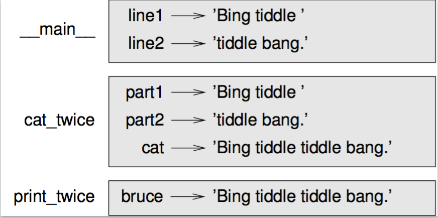

第三章：函数
============

在编程的语境下，**函数（function）**指的是一个有命名的、执行某个计算的语句序列（sequence of statements）。 在定义一个函数的时候，你需要指定函数的名字和语句序列。之后，你可以通过这个名字“调用（call）”该函数。

函数调用
--------

我们已经看见过一个**函数调用（function call）**的例子。

```python
>>> type(42)
<class 'int'>
```

这个函数的名字是 `type`。括号中的表达式被称为这个函数的**实参（argument）**。这个函数执行的结果，就是实参的类型。

人们常说函数“接受（accept）”实参，然后“返回(return)”一个结果。该结果也被称为**返回值（return value）**。

Python提供了能够将值从一种类型转换为另一种类型的内建函数。 函数 `int`接受任意值，并在其能做到的情况下，将该值转换成一个整型数， 否则会报错：

```python
>>> int('32')
32
>>> int('Hello')
ValueError: invalid literal for int(): Hello
```

`int` 能将浮点数转换为整型数，但是它并不进行舍入；只是截掉了小数点部分：

```python
>>> int(3.99999)
3
>>> int(-2.3)
-2
```

`float` 可以将整型数和字符串转换为浮点数：

```python
>>> float(32)
32.0
>>> float('3.14159')
3.14159
```

最后，`str` 可以将其实参转换成字符串：

```python
>>> str(32)
'32'
>>> str(3.14159)
'3.14159'
```

数学函数
--------

Python中有一个数学模块（`math`），提供了大部分常用的数学函数。**模块（module）**指的是一个含有相关函数的文件。

在使用模块之前，我们需要通过 **导入语句（import statement）**导入该模块：

```python
>>> import math
```

这条语句会生成一个名为 `math` 的**模块对象（module object）**。如果你打印这个模块对象，你将获得关于它的一些信息：

```python
>>> math
<module 'math' (built-in)>
```

该模块对象包括了定义在模块内的所有函数和变量。想要访问其中的一个函数，你必须指定该模块的名字以及函数名，并以点号（也被叫做句号）分隔开来。 这种形式被称作**点标记法（dot notation）**。

```python
>>> ratio = signal_power / noise_power
>>> decibels = 10 * math.log10(ratio)

>>> radians = 0.7
>>> height = math.sin(radians)
```

第一个例子使用`math.log10`计算分贝信噪比（假设`signal_power`和`noise_power`已经被定义了）。math模块也提供了 `log` 函数，用于计算以e为底的对数。

第二个例子计算radians的正弦值（sine）。 变量名暗示 `sin`函数以及其它三角函数（`cos`、`tan` 等）接受弧度（radians）实参。度数转换为弧度，需要除以180，并乘以 $\pi$：

```python
>>> degrees = 45
>>> radians = degrees / 180.0 * math.pi
>>> math.sin(radians)
0.707106781187
```

表达式 `math.pi` 从 `math` 模块中获得变量 `pi` 。该变量的值是$\pi$的一个浮点数近似值，精确到大约15位数。

如果你懂几何学（trigonometry），你可以将之前的结果和二分之根号二进行比较，检查是否正确：

```python
>>> math.sqrt(2) / 2.0
0.707106781187
```

组合
----

目前为止，我们已经分别介绍了程序的基本元素——变量、表达式和语句，但是还没有讨论如何将它们组合在一起。

编程语言的最有用特征之一，是能够将小块构建材料（building blocks）**组合（compose）**在一起。例如，函数的实参可以是任意类型的表达式，包括算术运算符：

```python
x = math.sin(degrees / 360.0 * 2 * math.pi)
```

甚至是函数调用：

```python
x = math.exp(math.log(x+1))
```

几乎任何你可以放值的地方，你都可以放一个任意类型的表达式，只有一个例外：赋值语句的左侧必须是一个变量名。左侧放其他任何表达式都会产生语法错误（后面我们会讲到这个规则的例外）。

```python
>>> minutes = hours * 60                 # 正确
>>> hours * 60 = minutes                 # 错误！
SyntaxError: can't assign to operator
```

新建函数
--------

目前为止，我们只使用了Python自带的函数， 但是创建新函数也是可能的。一个**函数定义（function definition）**指定了新函数的名称以及当函数被调用时执行的语句序列。

下面是一个示例：

```python
def print_lyrics():
    print("I'm a lumberjack, and I'm okay.")
    print("I sleep all night and I work all day.")
```

`def` 是一个关键字，表明这是一个函数定义。 这个函数的名字是`print_lyrics`。函数的命名规则与变量名相同：字母、数字以及下划线是合法的，但是第一个字符不能是数字。不能使用关键字作为函数名，并应该避免变量和函数同名。

函数名后面的圆括号是空的，表明该函数不接受任何实参。

函数定义的第一行被称作**函数头（header）**；其余部分被称作**函数体（body）**。函数头必须以冒号结尾，而函数体必须缩进。 按照惯例，缩进总是4个空格。函数体能包含任意条语句。

打印语句中的字符串被括在双引号中。单引号和双引号的作用相同；大多数人使用单引号，上述代码中的情况除外，即单引号（同时也是撇号）出现在字符串中时。

所有引号（单引号和双引号）必须是“直引号（straight quotes）”，它们通常位于键盘上Enter键的旁边。像这句话中使用的‘弯引号（curly quotes）’，在Python语言中则是不合法的。

如果你在交互模式下键入函数定义，每空一行解释器就会打印三个句点（*...*），让你知道定义并没有结束。

```python
>>> def print_lyrics():
...     print("I'm a lumberjack, and I'm okay.")
...     print("I sleep all night and I work all day.")
...
```

为了结束函数定义，你必须输入一个空行。

定义一个函数会创建一个 **函数对象（function object）**，其类型是
`function`：

```python
>>> print(print_lyrics)
<function print_lyrics at 0xb7e99e9c>
>>> type(print_lyrics)
<class 'function'>
```

调用新函数的语法，和调用内建函数的语法相同：

```python
>>> print_lyrics()
I'm a lumberjack, and I'm okay.
I sleep all night and I work all day.
```

一旦你定义了一个函数，你就可以在另一个函数内部使用它。
例如，为了重复之前的叠句（refrain），我们可以编写一个名叫`repeat_lyrics`的函数：

```python
def repeat_lyrics():
    print_lyrics()
    print_lyrics()
```

然后调用`repeat_lyrics`：

```python
>>> repeat_lyrics()
I'm a lumberjack, and I'm okay.
I sleep all night and I work all day.
I'm a lumberjack, and I'm okay.
I sleep all night and I work all day.
```

不过，这首歌的歌词实际上不是这样的。

定义和使用
----------

将上一节的多个代码段组合在一起，整个程序看起来是这样的：

```python
def print_lyrics():
    print("I'm a lumberjack, and I'm okay.")
    print("I sleep all night and I work all day.")

def repeat_lyrics():
    print_lyrics()
    print_lyrics()

repeat_lyrics()
```

该程序包含两个函数定义：`print_lyrics`和`repeat_lyrics`。函数定义和其它语句一样，都会被执行，但是其作用是创建函数对象。函数内部的语句在函数被调用之前，是不会执行的，而且函数定义不会产生任何输出。

你可能猜到了，在运行函数之前，你必须先创建这个函数。换句话说，函数定义必须在其第一次被调用之前执行。

我们做个小练习，将程序的最后一行移到顶部，使得函数调用出现在函数定义之前。运行程序，看看会得到怎样的错误信息。

现在将函数调用移回底部，然后将`print_lyrics`的定义移到`repeat_lyrics`的定义之后。这次运行程序时会发生什么？

执行流程
--------

为了保证函数第一次使用之前已经被定义，你必须要了解语句执行的顺序，这也被称作**执行流程（flow of execution）**。

执行流程总是从程序的第一条语句开始，自顶向下，每次执行一条语句。

函数定义不改变程序执行的流程，但是请记住，函数不被调用的话，函数内部的语句是不会执行的。

函数调用像是在执行流程上绕了一个弯路。执行流程没有进入下一条语句，而是跳入了函数体，开始执行那里的语句，然后再回到它离开的位置。

这听起来足够简单，至少在你想起一个函数可以调用另一个函数之前。当一个函数执行到中间的时候，程序可能必须执行另一个函数里的语句。然后在执行那个新函数的时候，程序可能又得执行另外一个函数！

幸运的是，Python善于记录程序执行流程的位置，因此每次一个函数执行完成时，程序会回到调用它的那个函数原来执行的位置。当到达程序的结尾时，程序才会终止。

总之，阅读程序时，你没有必要总是从上往下读。有时候，跟着执行流程阅读反而更加合理。

形参和实参
----------

我们之前接触的一些函数需要实参。例如，当你调用 `math.sin`时，你传递一个数字作为实参。 有些函数接受一个以上的实参：`math.pow`接受两个，底数和指数。

在函数内部，实参被赋给称作**形参（parameters）**的变量。下面的代码定义了一个接受一个实参的函数：

```python
def print_twice(bruce):
    print(bruce)
    print(bruce)
```

这个函数将实参赋给名为 `bruce`
的形参。当函数被调用的时候，它会打印形参（无论它是什么）的值两次。

该函数对任意能被打印的值都有效。

```python
>>> print_twice('Spam')
Spam
Spam
>>> print_twice(42)
42
42
>>> print_twice(math.pi)
3.14159265359
3.14159265359
```

组合规则不仅适用于内建函数，而且也适用于开发者自定义的函数（programmer-defined functions），因此我们可以使用任意类型的表达式作为`print_twice`的实参：

```python
>>> print_twice('Spam '*4)
Spam Spam Spam Spam
Spam Spam Spam Spam
>>> print_twice(math.cos(math.pi))
-1.0
-1.0
```

在函数被调用之前，实参会先进行计算，因此在这些例子中，表达式`'Spam '*4`和 `math.cos(math.pi)` 都只被计算了一次。

你也可以用变量作为实参：

```python
>>> michael = 'Eric, the half a bee.'
>>> print_twice(michael)
Eric, the half a bee.
Eric, the half a bee.
```

我们传递的实参名（`michael`）与形参的名字（`bruce`）没有任何关系。
这个值在传入函数之前叫什么都没有关系；只要传入了`print_twice`函数，我们将所有人都称为
`bruce` 。

变量和形参都是局部的
--------------------

当你在函数里面创建变量时，这个变量是**局部的（local）**，也就是说它只在函数内部存在。例如：

```python
def cat_twice(part1, part2):
    cat = part1 + part2
    print_twice(cat)
```

该函数接受两个实参，拼接（concatenates）它们并打印结果两次。下面是使用该函数的一个示例：

```python
>>> line1 = 'Bing tiddle '
>>> line2 = 'tiddle bang.'
>>> cat_twice(line1, line2)
Bing tiddle tiddle bang.
Bing tiddle tiddle bang.
```

当`cat_twice`结束时，变量 `cat` 被销毁了。如果我们试图打印它，我们将获得一个异常：

```python
>>> print(cat)
NameError: name 'cat' is not defined
```

形参也都是局部的。例如，在`print_twice`函数的外部并没有 `bruce`这个变量。

堆栈图
------

有时，画一个**堆栈图（stack diagram）**可以帮助你跟踪哪个变量能在哪儿用。与状态图类似，堆栈图要说明每个变量的值，但是它们也要说明每个变量所属的函数。

每个函数用一个**栈帧（frame）**表示。一个栈帧就是一个线框，函数名在旁边，形参以及函数内部的变量则在里面。前面例子的堆栈图如图3-1所示。



这些线框排列成栈的形式，说明了哪个函数调用了哪个函数等信息。
在此例中，`print_twice`被`cat_twice`调用，
`cat_twice`又被`__main__`调用，`__main__`是一个表示最上层栈帧的特殊名字。
当你在所有函数之外创建一个变量时，它就属于`__main__`。

每个形参都指向其对应实参的值。 因此，`part1` 和 `line1`
的值相同，`part2` 和 `line2` 的值相同， `bruce` 和 `cat` 的值相同。

如果函数调用时发生错误，Python会打印出错函数的名字以及调用它的函数的名字，
以及调用 *后面这个函数* 的函数的名字，一直追溯到`__main__`为止。

例如，如果你试图在`print_twice`里面访问 `cat` ， 你将获得一个
`NameError` ：

```python
Traceback (innermost last):
  File "test.py", line 13, in __main__
    cat_twice(line1, line2)
  File "test.py", line 5, in cat_twice
    print_twice(cat)
  File "test.py", line 9, in print_twice
    print(cat)
NameError: name 'cat' is not defined
```

这个函数列表被称作**回溯（traceback）**。
它告诉你发生错误的是哪个程序文件，错误在哪一行，以及当时在执行哪个函数。
它还会显示引起错误的那一行代码。

回溯中的函数顺序，与堆栈图中的函数顺序一致。出错时正在运行的那个函数则位于回溯信息的底部。

有返回值函数和无返回值函数
--------------------------

有一些我们之前用过的函数，例如数学函数，会返回结果；
由于没有更好的名字，我姑且叫它们**有返回值函数（fruitful functions）**。
其它的函数，像`print_twice`，执行一个动作但是不返回任何值。
我称它们为**无返回值函数（void functions）**。

当你调用一个有返回值函数时，你几乎总是想用返回的结果去做些什么；
例如，你可能将它赋值给一个变量，或者把它用在表达式里：

```python
x = math.cos(radians)
golden = (math.sqrt(5) + 1) / 2
```

当你在交互模式下调用一个函数时，Python解释器会马上显示结果：

```python
>>> math.sqrt(5)
2.2360679774997898
```

但是在脚本中，如果你单单调用一个有返回值函数， 返回值就永远丢失了！

```python
math.sqrt(5)
```

该脚本计算5的平方根，但是因为它没保存或者显示这个结果，
这个脚本并没多大用处。

无返回值函数可能在屏幕上打印输出结果，或者产生其它的影响，
但是它们并没有返回值。如果你试图将无返回值函数的结果赋给一个变量，
你会得到一个被称作 `None` 的特殊值。

```python
>>> result = print_twice('Bing')
Bing
Bing
>>> print(result)
None
```

`None` 这个值和字符串`'None'`不同。这是一个自己有独立类型的特殊值：

```python
>>> print(type(None))
<class 'NoneType'>
```

目前为止，我们写的函数都是无返回值函数。
我们将在几章之后开始编写有返回值函数。

为什么写函数？
--------------

你可能还不明白为什么值得将一个程序分解成多个函数。 原因包括以下几点：

-   创建一个新的函数可以让你给一组语句命名，这可以让你的程序更容易阅读和调试。
-   通过消除重复的代码，函数精简了程序。以后，如果你要做个变动，你只需在一处修改即可。
-   将一个长程序分解为多个函数，可以让你一次调试一部分，然后再将它们组合为一个可行的整体。
-   设计良好的函数经常对多个程序都有帮助。一旦你写出并调试好一个函数，你就可以重复使用它。

调试
----

调试，是你能获得的最重要的技能之一。
虽然调试会让人沮丧，但却是编程过程中最富含智慧、挑战以及乐趣的一部分。

在某些方面，调试像是侦探工作。
你面对一些线索，必须推理出是什么进程（processes）和事件（events）导致了你看到的结果。

调试也像是一门实验性科学。一旦你猜到大概哪里出错了，
你可以修改程序，再试一次。
如果你的假设是正确的，那么你就可以预测到修改的结果，并且离正常运行的程序又近了一步。
如果你的假设是错误的，你就不得不再提一个新的假设。
如夏洛克·福尔摩斯所指出的，“当你排除了所有的不可能，无论剩下的是什么，
不管多么难以置信，一定就是真相。”（阿瑟·柯南·道尔，*《四签名》*）

对某些人来说，编程和调试是同一件事。
也就是说，编程是逐步调试一个程序，直到它满足了你期待的过程。
这意味着，你应该从一个能*正常运行*（working）
的程序开始，每次只做一些小改动，并同步进行调试。

举个例子，Linux是一个有着数百万行代码的操作系统 但是它一开始，只是Linus
Torvalds写的一个用于研究Intel 80386芯片的简单程序。 根据Larry
Greenfield的描述，“Linus的早期项目中，有一个能够交替打印AAAA和BBBB的程序。
这个程序后来演变为了Linux。”（*Linux用户手册* Beta 版本1）。

术语表
------

函数（function）：

> 执行某种有用运算的命名语句序列。函数可以接受形参，也可以不接受；可以返回一个结果，也可以不返回。

函数定义（function definition）：

> 创建一个新函数的语句，指定了函数名、形参以及所包含的语句。

函数对象（function object）：

> 函数定义所创建的一个值。函数名是一个指向函数对象的变量。

函数头（header）：

> 函数定义的第一行。

函数体（body）：

> 函数定义内部的语句序列。

形参（parameters）：

> 函数内部用于指向被传作实参的值的名字。

函数调用（function call）：

> 运行一个函数的语句。它包括了函数名，紧随其后的实参列表，实参用圆括号包围起来。

实参（argument）：

> 函数调用时传给函数的值。这个值被赋给函数中相对应的形参。

局部变量（local variable）：

> 函数内部定义的变量。局部变量只能在函数内部使用。

返回值（return value）：

> 函数执行的结果。如果函数调用被用作表达式，其返回值是这个表达式的值。

有返回值函数（fruitful function）：

> 会返回一个值的函数。

无返回值函数（void function）：

> 总是返回None的函数。

None：

> 无返回值函数返回的一个特殊值。

模块（module）：

> 包含了一组相关函数及其他定义的的文件。

导入语句（import statement）：

> 读取一个模块文件，并创建一个模块对象的语句。

模块对象（module object）：

> 导入语句创建的一个值，可以让开发者访问模块内部定义的值。

点标记法（dot notation）：

> 调用另一个模块中函数的语法，需要指定模块名称，之后跟着一个点（句号）和函数名。

组合（composition）：

> 将一个表达式嵌入一个更长的表达式，或者是将一个语句嵌入一个更长语句的一部分。

执行流程（flow of execution）：

> 语句执行的顺序。

堆栈图（stack diagram）：

> 一种图形化表示堆栈的方法，堆栈中包括函数、函数的变量及其所指向的值。

栈帧（frame）：

> 堆栈图中一个栈帧，代表一个函数调用。其中包含了函数的局部变量和形参。

回溯（traceback）：

> 当出现异常时，解释器打印出的出错时正在执行的函数列表。

练习题
------

### 习题 3-1

编写一个名为`right_justify`的函数，函数接受一个名为`s`的字符串作为形参，
并在打印足够多的前导空格（leading
space）之后打印这个字符串，使得字符串的最后一个字母位于显示屏的第70列。

```python
>>> right_justify('monty')
                                                                 monty
```

提示：使用字符串拼接（string
concatenation）和重复。另外，Python提供了一个名叫len的内建函数，可以返回一个字符串的长度，因此`len('allen')`的值是5。

函数对象是一个可以赋值给变量的值，也可以作为实参传递。例如，
`do_twice`函数接受函数对象作为实参，并调用这个函数对象两次：

```python
def do_twice(f):
    f()
    f()
```

下面这个示例使用`do_twice`来调用名为`print_spam`的函数两次。

```python
def print_spam():
    print('spam')

do_twice(print_spam)
```

1.  将这个示例写入脚本，并测试。
2.  修改`do_twice`，使其接受两个实参，一个是函数对象，另一个是值。
    然后调用这一函数对象两次，将那个值传递给函数对象作为实参。
3.  从本章前面一些的示例中，将 `print_twice` 函数的定义复制到脚本中。
4.  使用修改过的`do_twice`，调用`print_twice`两次，将`'spam'`
    传递给它作为实参。
5.  定义一个名为`do_four`的新函数，其接受一个函数对象和一个值作为实参。
    调用这个函数对象四次，将那个值作为形参传递给它。
    函数体中应该只有两条语句，而不是四条。

答案： <http://thinkpython2.com/code/do_four.py> 。

注意：这一习题只能使用我们目前学过的语句和特性来完成。

### 习题 3-2

1.  编写一个能画出如下网格（grid）的函数：

        + - - - - + - - - - +
        |         |         |
        |         |         |
        |         |         |
        |         |         |
        + - - - - + - - - - +
        |         |         |
        |         |         |
        |         |         |
        |         |         |
        + - - - - + - - - - +

    提示：你可以使用一个用逗号分隔的值序列，在一行中打印出多个值：

        print('+', '-')

    `print`
    函数默认会自动换行，但是你可以阻止这个行为，只需要像下面这样将行结尾变成一个空格：

        print('+', end=' ')
        print('-')

    这两个语句的输出结果是 `'+ -'`。

    一个没有传入实参的 `print` 语句会结束当前行，跳到下一行。

2.  编写一个能够画出四行四列的类似网格的函数。

答案： <http://thinkpython2.com/code/grid.py> 。致谢：这个习题基于
*Practical C Programming, Third Edition*
一书中的习题改编，此书由O’Reilly出版社于1997年出版。

### **贡献者**

1.  翻译：[@bingjin](https://github.com/bingjin)
2.  校对：[@bingjin](https://github.com/bingjin)
3.  参考：[@carfly](https://github.com/carfly)

